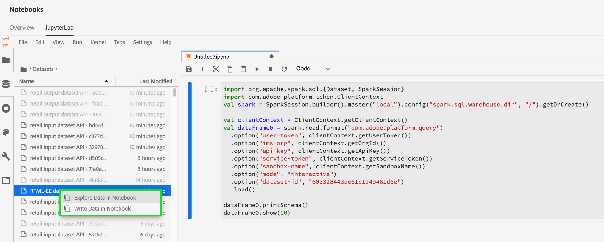

# でのデータアクセス [!DNL Jupyterlab] notebooks

サポートされる各カーネルは、ノートブック内のデータセットから Platform データを読み取るための組み込み機能を備えてます。現在、Adobe Experience Platform Data Science Workspace の JupyterLab は、のノートブックをサポートしています [!DNL Python]、R、PySpark、Scala。 ただし、ページ番号付けデータのサポートは、次の項目に制限されます。 [!DNL Python] R ノート。 このガイドでは、JupyterLab ノートブックを使用してデータにアクセスする方法に焦点を当てます。

## はじめに

このガイドを読む前に、 [[!DNL JupyterLab] ユーザーガイド](./overview.md) ～の高度な紹介のために [!DNL JupyterLab] と、Data Science Workspace 内での役割を表します。

## ノートブックのデータ制限 {#notebook-data-limits}

>[!IMPORTANT]
>
>PySpark と Scala のノートブックの場合は、「Remote RPC client disassociated」という理由でエラーが発生しています。 これは、通常、ドライバーまたは実行者のメモリが不足していることを意味します。 次に切り替えてみてください： [&quot;batch&quot;モード](#mode) をクリックして、このエラーを解決します。

次の情報は、読み取り可能な最大データ量、使用されたデータのタイプ、およびデータを読み取る推定時間枠を定義します。

の場合 [!DNL Python] また、ベンチマークには、40GB RAM で構成されたノートブックサーバを使用しました。 PySpark と Scala の場合、以下に示すベンチマークには、64GB RAM、8 コア、2 DBU で構成されたデータバリッククラスタが最大 4 ワーカーを持つデータバリッククラスタが使用されました。

使用される ExperienceEvent スキーマデータのサイズは、1,000 行 (1,000) から 10 億行 (1B) までと様々です。 PySpark の場合は、 [!DNL Spark] 指標の場合、10 日間の日付範囲が XDM データに使用されていました。

アドホックスキーマデータは、 [!DNL Query Service] Create Table as Select (CTAS)。 このデータは、1,000 行（1,000 行）から 10 億行（1B 行）までのサイズも様々です。

### バッチモードとインタラクティブモードを使用する場合 {#mode}

PySpark と Scala のノートブックでデータセットを読み取る場合、インタラクティブモードまたはバッチモードを使用してデータセットを読み取ることができます。 インタラクティブは高速な結果を得るために作成されるのに対して、バッチモードは大規模なデータセット用です。

- PySpark と Scala のノートブックの場合、500 万行以上のデータを読み取る場合は、バッチモードを使用する必要があります。 各モードの効率について詳しくは、 [PySpark](#pyspark-data-limits) または [Scala](#scala-data-limits) 以下のデータ制限テーブル。

### [!DNL Python] ノートブックデータの制限

**XDM ExperienceEvent スキーマ：** XDM データの最大 200 万行（ディスク上の最大 6.1 GB のデータ）を 22 分以内に読み取れるはずです。 行を追加すると、エラーが発生する場合があります。

| 行数 | 1K | 1 万 | 100,000 | 1M | 2M |
| ----------------------- | ------ | ------ | ----- | ----- | ----- |
| ディスク上のサイズ (MB) | 18.73 | 187.5 | 308 | 3000 | 6050 |
| SDK （秒） | 20.3 | 86.8 | 63 | 659 | 1315 |

**アドホックスキーマ：** XDM（アドホック）以外のデータの最大 500 万行（ディスク上のデータは 5.6 GB）を 14 分以内に読み取れるはずです。 行を追加すると、エラーが発生する場合があります。

| 行数 | 1K | 1 万 | 100,000 | 1M | 2M | 3M | 5M |
| ----------------------- | ------- | ------- | ----- | ----- | ----- | ----- | ------ |
| ディスクのサイズ（MB 単位） | 1.21 | 11.72 | 115 | 1120 | 2250 | 3380 | 5630 |
| SDK （秒） | 7.27 | 9.04 | 27.3 | 180 | 346 | 487 | 819 |

### R ノートブックのデータ制限

**XDM ExperienceEvent スキーマ：** 13 分未満で、最大 100 万行の XDM データ（ディスク上の 3GB データ）を読み取れるはずです。

| 行数 | 1K | 1 万 | 100,000 | 1M |
| ----------------------- | ------ | ------ | ----- | ----- |
| ディスク上のサイズ (MB) | 18.73 | 187.5 | 308 | 3000 |
| R カーネル（秒） | 14.03 | 69.6 | 86.8 | 775 |

**アドホックスキーマ：** 約 10 分で、アドホックデータ（ディスク上の 293 MB のデータ）の最大 300 万行を読み取れるはずです。

| 行数 | 1K | 1 万 | 100,000 | 1M | 2M | 3M |
| ----------------------- | ------- | ------- | ----- | ----- | ----- | ----- |
| ディスクのサイズ（MB 単位） | 0.082 | 0.612 | 9.0 | 91 | 188 | 293 |
| R SDK （秒単位） | 7.7 | 4.58 | 35.9 | 233 | 470.5 | 603 |

### PySpark ([!DNL Python] カーネル ) ノートブックのデータ制限： {#pyspark-data-limits}

**XDM ExperienceEvent スキーマ：** インタラクティブモードでは、XDM データの最大 500 万行（ディスク上の最大 13.42GB のデータ）を約 20 分で読み取れるようになります。 インタラクティブモードでは、最大 500 万行までしかサポートされません。 大きなデータセットを読み取る場合は、バッチモードに切り替えることをお勧めします。 バッチモードでは、約 14 時間で XDM データの最大 5 億行（ディスク上の最大 1.31 TB のデータ）を読み取れるはずです。

| 行数 | 1K | 1 万 | 100,000 | 1M | 2M | 3M | 5M | 10M | 50M | 1 億 | 5 億 |
|-------------------------|--------|--------|-------|-------|-------|-------|---------|---------|----------|--------|--------|
| ディスク上のサイズ | 2.93 MB | 4.38 MB | 29.02 | 2.69 GB | 5.39 GB | 8.09 GB | 13.42 GB | 26.82 GB | 134.24 GB | 268.39 GB | 1.31 TB |
| SDK（インタラクティブモード） | 33 秒 | 32.4s | 55.1s | 253.5s | 489.2s | 729.6s | 1206.8s | - | - | - | - |
| SDK （バッチモード） | 815.8s | 492.8s | 379.1s | 637.4s | 624.5s | 869.2s | 1104.1s | 1786s | 5387.2s | 10624.6s | 50547s |

**アドホックスキーマ：** インタラクティブモードでは、XDM 以外のデータの最大 500 万行（ディスク上の最大 5.36GB のデータ）を 3 分以内に読み取れるはずです。 バッチモードでは、XDM 以外のデータの最大 10 億行（ディスク上の最大 1.05 TB のデータ）を約 18 分で読み取れるはずです。

| 行数 | 1K | 1 万 | 100,000 | 1M | 2M | 3M | 5M | 10M | 50M | 1 億 | 5 億 | 1B |
|--------------|--------|---------|---------|-------|-------|-------|--------|--------|---------|--------|---------|-------|
| ディスク上のサイズ | 1.12 MB | 11.24 MB | 109.48 MB | 2.69 GB | 2.14 GB | 3.21 GB | 5.36 GB | 10.71 GB | 53.58 GB | 107.52 GB | 535.88 GB | 1.05 TB |
| SDK インタラクティブモード（秒） | 28.2s | 18.6s | 20.8s | 20.9s | 23.8s | 21.7s | 24.7s | - | - | - | - | - |
| SDK バッチモード（秒） | 428.8s | 578.8s | 641.4s | 538.5s | 630.9s | 467.3s | 411s | 675s | 702 秒 | 719.2s | 1022.1s | 1122.3s |

### [!DNL Spark] （Scala カーネル）ノートブックのデータ制限： {#scala-data-limits}

**XDM ExperienceEvent スキーマ：** インタラクティブモードでは、XDM データの最大 500 万行（ディスク上の最大 13.42GB のデータ）を約 18 分で読み取れる必要があります。 インタラクティブモードでは、最大 500 万行までしかサポートされません。 大きなデータセットを読み取る場合は、バッチモードに切り替えることをお勧めします。 バッチモードでは、約 14 時間で XDM データの最大 5 億行（ディスク上の最大 1.31 TB のデータ）を読み取れるはずです。

| 行数 | 1K | 1 万 | 100,000 | 1M | 2M | 3M | 5M | 10M | 50M | 1 億 | 5 億 |
|---------------|--------|--------|-------|-------|-------|-------|---------|---------|----------|--------|--------|
| ディスク上のサイズ | 2.93 MB | 4.38 MB | 29.02 | 2.69 GB | 5.39 GB | 8.09 GB | 13.42 GB | 26.82 GB | 134.24 GB | 268.39 GB | 1.31 TB |
| SDK インタラクティブモード（秒） | 37.9s | 22.7s | 45.6s | 231.7s | 444.7s | 660.6s | 1100 秒 | - | - | - | - |
| SDK バッチモード（秒） | 374.4s | 398.5s | 527s | 487.9s | 588.9s | 829 秒 | 939.1s | 1441s | 5473.2s | 10118.8 | 49207.6 |

**アドホックスキーマ：** インタラクティブモードでは、XDM 以外のデータの最大 500 万行（ディスク上の最大 5.36GB のデータ）を 3 分以内に読み取ることができます。 バッチモードでは、XDM 以外のデータの最大 10 億行（ディスク上の最大 1.05 TB のデータ）を約 16 分で読み取れるはずです。

| 行数 | 1K | 1 万 | 100,000 | 1M | 2M | 3M | 5M | 10M | 50M | 1 億 | 5 億 | 1B |
|--------------|--------|---------|---------|-------|-------|-------|---------|---------|---------|--------|---------|-------|
| ディスク上のサイズ | 1.12 MB | 11.24 MB | 109.48 MB | 2.69 GB | 2.14 GB | 3.21 GB | 5.36 GB | 10.71 GB | 53.58 GB | 107.52 GB | 535.88 GB | 1.05 TB |
| SDK インタラクティブモード（秒） | 35.7s | 31 秒 | 19.5s | 25.3s | 23 秒 | 33.2s | 25.5s | - | - | - | - | - |
| SDK バッチモード（秒） | 448.8s | 459.7s | 519 秒 | 475.8s | 599.9s | 347.6s | 407.8s | 397s | 518.8s | 487.9s | 760.2s | 975.4s |

## Python ノートブック {#python-notebook}

[!DNL Python] ノートブックを使用すると、データセットにアクセスする際にデータをページ番号付けできます。 ページ番号付けの有無に関わらずデータを読み取るコード例を以下に示します。入手可能なスターター Python ノートブックの詳細については、 [[!DNL JupyterLab] ランチャー](./overview.md#launcher) 」の節を参照してください。

以下の Python ドキュメントでは、次の概念の概要を説明しています。

- [データセットからの読み取り](#python-read-dataset)
- [データセットへの書き込み](#write-python)
- [クエリデータ](#query-data-python)
- [ExperienceEvent データのフィルタリング](#python-filter)

### Python でのデータセットからの読み取り {#python-read-dataset}

**ページネーションなし：**

次のコードを実行すると、データセット全体が読み取られます。実行が成功した場合、データは `df` 変数で参照される Pandas データフレームとして保存されます。

```python
# Python

from platform_sdk.dataset_reader import DatasetReader
dataset_reader = DatasetReader(get_platform_sdk_client_context(), dataset_id="{DATASET_ID}")
df = dataset_reader.read()
df.head()
```

**ページネーションを使用：**

次のコードを実行すると、指定したデータセットからデータが読み取られます。ページ番号付けは、`limit()` 関数を使用してデータを制限し、`offset()` 関数を使用してデータをオフセットすることで実現します。データの制限とは、読み取るデータポイントの最大数を指し、オフセットとは、データの読み取り前にスキップするデータポイントの数を指します。読み取り操作が正常に実行された場合、データは `df` 変数が参照する Pandas データフレームとして保存されます。

```python
# Python

from platform_sdk.dataset_reader import DatasetReader

dataset_reader = DatasetReader(get_platform_sdk_client_context(), dataset_id="{DATASET_ID}")
df = dataset_reader.limit(100).offset(10).read()
```

### Python でのデータセットへの書き込み {#write-python}

JupyterLab ノートブック内のデータセットに書き込むには、JupyterLab の左側のナビゲーションで、「データアイコン」タブ（下でハイライト表示されている）を選択します。 この **[!UICONTROL データセット]** および **[!UICONTROL スキーマ]** ディレクトリが表示されます。 選択 **[!UICONTROL データセット]** をクリックし、右クリックして、 **[!UICONTROL ノートブックにデータを書き込む]** オプションを選択します。 ノートブックの下部に、実行可能なコードエントリが表示されます。


- 用途 **[!UICONTROL ノートブックにデータを書き込む]** 選択したデータセットで書き込みセルを生成する場合。
- 用途 **[!UICONTROL ノートブック内のデータの調査]** 選択したデータセットで読み取りセルを生成する場合。
- 用途 **[!UICONTROL ノートブックでのデータのクエリ]** をクリックして、選択したデータセットで基本的なクエリセルを生成します。

または、次のコードセルをコピーして貼り付けることもできます。 両方を `{DATASET_ID}` および `{PANDA_DATAFRAME}`.

```python
from platform_sdk.models import Dataset
from platform_sdk.dataset_writer import DatasetWriter

dataset = Dataset(get_platform_sdk_client_context()).get_by_id(dataset_id="{DATASET_ID}")
dataset_writer = DatasetWriter(get_platform_sdk_client_context(), dataset)
write_tracker = dataset_writer.write({PANDA_DATAFRAME}, file_format='json')
```

### 次を使用してデータをクエリ [!DNL Query Service] in [!DNL Python] {#query-data-python}

[!DNL JupyterLab][!DNL Platform][!DNL Python] で を使用すると、 ノートブックで SQL を使用して、[Adobe Experience Platform クエリサービス](https://docs.adobe.com/content/help/ja-JP/experience-platform/query/home.html)を通じてデータにアクセスできます。を通じてデータにアクセスする [!DNL Query Service] は、実行時間が優れているので、大規模なデータセットの処理に役立ちます。 を使用してデータをクエリする場合は、 [!DNL Query Service] には、10 分の処理時間制限があります。

事前準備 [!DNL Query Service] in [!DNL JupyterLab]を使用する場合、 [[!DNL Query Service] SQL 構文](https://docs.adobe.com/content/help/ja-JP/experience-platform/query/home.html#!api-specification/markdown/narrative/technical_overview/query-service/sql/syntax.md).

を使用したデータのクエリ [!DNL Query Service] ターゲットデータセットの名前を指定する必要があります。 必要なコードセルを生成するには、**[!UICONTROL データエクスプローラー]**&#x200B;を使用して目的のデータセットを見つけます。データセットのリストを右クリックし、「 」をクリックします。 **[!UICONTROL ノートブックでのデータのクエリ]** ノートブックで 2 つのコードセルを生成する場合。 これら 2 つのセルの概要を以下に示します。


を活用するため [!DNL Query Service] in [!DNL JupyterLab]を使用する場合、最初に [!DNL Python] ノート [!DNL Query Service]. これは、最初に生成されたセルを実行することで達成できます。

```python
qs_connect()
```

2 番目に生成されたセルでは、最初の行を SQL クエリの前に定義する必要があります。デフォルトでは、生成されたセルは、クエリ結果を Pandas データフレームとして保存するオプションの変数（`df0`）を定義します。<br>この `-c QS_CONNECTION` 引数は必須で、カーネルに対して SQL クエリを実行するように指示します。 [!DNL Query Service]. その他の引数のリストは、[付録](#optional-sql-flags-for-query-service)を参照してください。

```python
%%read_sql df0 -c QS_CONNECTION
SELECT *
FROM name_of_the_dataset
LIMIT 10
/* Querying table "name_of_the_dataset" (datasetId: {DATASET_ID})*/
```

Python 変数は、次の例に示すように、文字列形式の構文を使用して中括弧（`{}`）で囲むことで、SQL クエリ内で直接参照できます。

```python
table_name = 'name_of_the_dataset'
table_columns = ','.join(['col_1','col_2','col_3'])
```

```python
%%read_sql demo -c QS_CONNECTION
SELECT {table_columns}
FROM {table_name}
```

### フィルター [!DNL ExperienceEvent] データ {#python-filter}

にアクセスしてフィルターするには、 [!DNL ExperienceEvent] データセット [!DNL Python] ノートブックの場合は、データセットの ID(`{DATASET_ID}`) と、論理演算子を使用して特定の時間範囲を定義するフィルタールールを使用します。 時間範囲を定義すると、指定されたページ番号は無視され、データセット全体が考慮されます。

フィルタリング操作のリストを以下に示します。

- `eq()`：と等しい
- `gt()`：より大きい
- `ge()`：より大きいか等しい
- `lt()`：より小さい
- `le()`：より小さいか等しい
- `And()`：論理積演算子
- `Or()`：論理和演算子

次のセルは、 [!DNL ExperienceEvent] 2019 年 1 月 1 日から 2019 年 12 月 31 日の終わりまでの間にのみ存在するデータセット。

```python
# Python

from platform_sdk.dataset_reader import DatasetReader

dataset_reader = DatasetReader(get_platform_sdk_client_context(), dataset_id="{DATASET_ID}")
df = dataset_reader.\
    where(dataset_reader["timestamp"].gt("2019-01-01 00:00:00").\
    And(dataset_reader["timestamp"].lt("2019-12-31 23:59:59"))\
).read()
```

## R ノートブック {#r-notebooks}

R ノートブックを使用すると、データセットにアクセスする際にデータをページ番号付けできます。 ページ番号付けの有無に関わらずデータを読み取るコード例を以下に示します。利用可能なスターター R ノートブックの詳細については、 [[!DNL JupyterLab] ランチャー](./overview.md#launcher) 」の節を参照してください。

以下の R ドキュメントでは、次の概念の概要を説明しています。

- [データセットからの読み取り](#r-read-dataset)
- [データセットへの書き込み](#write-r)
- [ExperienceEvent データのフィルタリング](#r-filter)

### R でのデータセットからの読み取り {#r-read-dataset}

**ページネーションなし：**

次のコードを実行すると、データセット全体が読み取られます。実行が成功した場合、データは `df0` 変数で参照される Pandas データフレームとして保存されます。

```R
# R

library(reticulate)
use_python("/usr/local/bin/ipython")
psdk <- import("platform_sdk")
datetime <- import("datetime", convert = FALSE)
py_run_file("~/.ipython/profile_default/startup/platform_sdk_context.py")
DatasetReader <- psdk$dataset_reader$DatasetReader
dataset_reader <- DatasetReader(py$get_platform_sdk_client_context(), dataset_id="{DATASET_ID}")
df0 <- dataset_reader$read()
head(df0)
```

**ページネーションを使用：**

次のコードを実行すると、指定したデータセットからデータが読み取られます。ページ番号付けは、`limit()` 関数を使用してデータを制限し、`offset()` 関数を使用してデータをオフセットすることで実現します。データの制限とは、読み取るデータポイントの最大数を指し、オフセットとは、データの読み取り前にスキップするデータポイントの数を指します。読み取り操作が正常に実行された場合、データは `df0` 変数が参照する Pandas データフレームとして保存されます。

```R
# R

library(reticulate)
use_python("/usr/local/bin/ipython")
psdk <- import("platform_sdk")
datetime <- import("datetime", convert = FALSE)
py_run_file("~/.ipython/profile_default/startup/platform_sdk_context.py")

DatasetReader <- psdk$dataset_reader$DatasetReader
dataset_reader <- DatasetReader(py$get_platform_sdk_client_context(), dataset_id="{DATASET_ID}") 
df0 <- dataset_reader$limit(100L)$offset(10L)$read()
```

### R でのデータセットへの書き込み {#write-r}

JupyterLab ノートブック内のデータセットに書き込むには、JupyterLab の左側のナビゲーションで、「データアイコン」タブ（下でハイライト表示されている）を選択します。 この **[!UICONTROL データセット]** および **[!UICONTROL スキーマ]** ディレクトリが表示されます。 選択 **[!UICONTROL データセット]** をクリックし、右クリックして、 **[!UICONTROL ノートブックにデータを書き込む]** オプションを選択します。 ノートブックの下部に、実行可能なコードエントリが表示されます。


- 用途 **[!UICONTROL ノートブックにデータを書き込む]** 選択したデータセットで書き込みセルを生成する場合。
- 用途 **[!UICONTROL ノートブック内のデータの調査]** 選択したデータセットで読み取りセルを生成する場合。

または、次のコードセルをコピーして貼り付けることもできます。

```R
psdk <- import("platform_sdk")
dataset <- psdk$models$Dataset(py$get_platform_sdk_client_context())$get_by_id(dataset_id="{DATASET_ID}")
dataset_writer <- psdk$dataset_writer$DatasetWriter(py$get_platform_sdk_client_context(), dataset)
write_tracker <- dataset_writer$write(df, file_format='json')
```

### フィルター [!DNL ExperienceEvent] データ {#r-filter}

にアクセスしてフィルターするには、 [!DNL ExperienceEvent] データセットを R ノートブックに保存する場合は、データセットの ID(`{DATASET_ID}`) と、論理演算子を使用して特定の時間範囲を定義するフィルタールールを使用します。 時間範囲を定義すると、指定されたページ番号は無視され、データセット全体が考慮されます。

フィルタリング操作のリストを以下に示します。

- `eq()`：と等しい
- `gt()`：より大きい
- `ge()`：より大きいか等しい
- `lt()`：より小さい
- `le()`：より小さいか等しい
- `And()`：論理積演算子
- `Or()`：論理和演算子

次のセルは、 [!DNL ExperienceEvent] 2019 年 1 月 1 日から 2019 年 12 月 31 日の終わりまでの間にのみ存在するデータセット。

```R
# R

library(reticulate)
use_python("/usr/local/bin/ipython")
psdk <- import("platform_sdk")
datetime <- import("datetime", convert = FALSE)
py_run_file("~/.ipython/profile_default/startup/platform_sdk_context.py")

client_context <- py$PLATFORM_SDK_CLIENT_CONTEXT
DatasetReader <- psdk$dataset_reader$DatasetReader
dataset_reader <- DatasetReader(py$get_platform_sdk_client_context(), dataset_id="{DATASET_ID}") 

df0 <- dataset_reader$
    where(dataset_reader["timestamp"]$gt("2019-01-01 00:00:00")$
    And(dataset_reader["timestamp"]$lt("2019-12-31 23:59:59"))
)$read()
```

## PySpark 3 ノートブック {#pyspark-notebook}

以下の PySpark ドキュメントでは、次の概念の概要を説明しています。

- [sparkSession を初期化](#spark-initialize)
- [データの読み取りと書き込み](#magic)
- [ローカルデータフレームの作成](#pyspark-create-dataframe)
- [ExperienceEvent データのフィルタリング](#pyspark-filter-experienceevent)

### sparkSession の初期化 {#spark-initialize}

すべて [!DNL Spark] 2.4 ノートブックでは、次のボイラープレートコードを使用してセッションを初期化する必要があります。

```scala
from pyspark.sql import SparkSession
spark = SparkSession.builder.getOrCreate()
```

### %dataset を使用した PySpark 3 ノートブックでの読み書き {#magic}

の導入により [!DNL Spark] 2.4, `%dataset` PySpark 3 ([!DNL Spark] 2.4) ノートブック。 IPython カーネルで利用可能なマジックコマンドの詳細は、 [IPython マジックドキュメント](https://ipython.readthedocs.io/en/stable/interactive/magics.html).


**用途**

```scala
%dataset {action} --datasetId {id} --dataFrame {df} --mode batch
```

**説明**

カスタム [!DNL Data Science Workspace] からデータセットを読み取る、または書き込むためのマジックコマンド [!DNL PySpark] ノートブック ([!DNL Python] 3 カーネル )。

| 名前 | 説明 | 必須 |
| --- | --- | --- |
| `{action}` | データセットに対して実行するアクションのタイプ。 「読み取り」と「書き込み」の 2 つのアクションを使用できます。 | ○ |
| `--datasetId {id}` | 読み取りまたは書き込みを行うデータセットの ID を指定するために使用されます。 | ○ |
| `--dataFrame {df}` | pandas データフレーム。 <ul><li> アクションが「read」の場合、{df} は、データセット読み取り操作の結果（データフレームなど）を使用できる変数です。 </li><li> アクションが「write」の場合、このデータフレーム {df} はデータセットに書き込まれます。 </li></ul> | ○ |
| `--mode` | データの読み取り方法を変更する追加のパラメーター。 使用できるパラメーターは、「バッチ」と「インタラクティブ」です。 デフォルトでは、モードは「batch」に設定されています。<br> 小規模なデータセットでクエリのパフォーマンスを向上させるには、「インタラクティブ」モードを使用することをお勧めします。 | ○ |

>[!TIP]
>
>PySpark テーブルを [ノートブックデータの制限](#notebook-data-limits) セクションで `mode` は、次のように設定する必要があります。 `interactive` または `batch`.

**例**

- **例を読む**: `%dataset read --datasetId 5e68141134492718af974841 --dataFrame pd0 --mode batch`
- **記述例**: `%dataset write --datasetId 5e68141134492718af974842 --dataFrame pd0 --mode batch`

>[!IMPORTANT]
>
> を使用してデータをキャッシュする `df.cache()` データを書き込む前に、ノートブックのパフォーマンスを大幅に向上させることができます。 これは、次のエラーが発生した場合に役立ちます。
> 
> - ステージの失敗によりジョブが中止されました…各パーティション内の要素数が同じ RDD のみを zip で圧縮できます。
> - リモート RPC クライアントが関連付けを解除し、その他のメモリエラーが発生しました。
> - データセットの読み取りと書き込みの際のパフォーマンスが低下。
> 
> 詳しくは、 [トラブルシューティングガイド](../troubleshooting-guide.md) を参照してください。

次のメソッドを使用して、JupyterLab buy で上記の例を自動生成できます。

JupyterLab の左側のナビゲーションで、「データアイコン」タブ（下でハイライト表示）を選択します。 この **[!UICONTROL データセット]** および **[!UICONTROL スキーマ]** ディレクトリが表示されます。 選択 **[!UICONTROL データセット]** をクリックし、右クリックして、 **[!UICONTROL ノートブックにデータを書き込む]** オプションを選択します。 ノートブックの下部に、実行可能なコードエントリが表示されます。

- 用途 **[!UICONTROL ノートブック内のデータの調査]** 読み取りセルを生成する。
- 用途 **[!UICONTROL ノートブックにデータを書き込む]** 書き込みセルを生成する場合。


### ローカルデータフレームの作成 {#pyspark-create-dataframe}

PySpark 3 を使用してローカルデータフレームを作成するには、SQL クエリを使用します。 例：

```scala
date_aggregation.createOrReplaceTempView("temp_df")

df = spark.sql('''
  SELECT *
  FROM sparkdf
''')

local_df
```

```scala
df = spark.sql('''
  SELECT *
  FROM sparkdf
  LIMIT limit
''')
```

```scala
sample_df = df.sample(fraction)
```

>[!TIP]
>
>オプションのシードサンプルを指定することもできます。例えば、Replacement とのブール値、2 分の 1、長いシードなどです。

### フィルター [!DNL ExperienceEvent] データ {#pyspark-filter-experienceevent}

へのアクセスとフィルタリング [!DNL ExperienceEvent] PySpark ノートブックのデータセットでは、データセット ID (`{DATASET_ID}`)、組織の IMS ID、および特定の時間範囲を定義するフィルタールールが含まれます。 フィルター時間範囲は、関数 `spark.sql()`（関数パラメータは SQL クエリ文字列）

次のセルでは、 [!DNL ExperienceEvent] 2019 年 1 月 1 日から 2019 年 12 月 31 日の終わりまでの間にのみ存在するデータセット。

```python
# PySpark 3 (Spark 2.4)

from pyspark.sql import SparkSession
spark = SparkSession.builder.getOrCreate()

%dataset read --datasetId {DATASET_ID} --dataFrame df --mode batch

df.createOrReplaceTempView("event")
timepd = spark.sql("""
    SELECT *
    FROM event
    WHERE timestamp > CAST('2019-01-01 00:00:00.0' AS TIMESTAMP)
    AND timestamp < CAST('2019-12-31 23:59:59.9' AS TIMESTAMP)
""")
timepd.show()
```

## Scala ノートブック {#scala-notebook}

以下のドキュメントには、次の概念の例が含まれています。

- [sparkSession を初期化](#scala-initialize)
- [データセットの読み取り](#read-scala-dataset)
- [データセットへの書き込み](#scala-write-dataset)
- [ローカルデータフレームの作成](#scala-create-dataframe)
- [ExperienceEvent データのフィルタリング](#scala-experienceevent)

### SparkSession の初期化 {#scala-initialize}

すべての Scala ノートブックでは、次のボイラープレートコードを使用してセッションを初期化する必要があります。

```scala
import org.apache.spark.sql.{ SparkSession }
val spark = SparkSession
  .builder()
  .master("local")
  .getOrCreate()
```

### データセットの読み取り {#read-scala-dataset}

Scala では、 `clientContext` Platform の値を取得して返すために、 `var userToken`. 以下の Scala の例では、 `clientContext` は、データセットの読み取りに必要なすべての必須値を取得して返すために使用されます。

>[!IMPORTANT]
>
> を使用してデータをキャッシュする `df.cache()` データを書き込む前に、ノートブックのパフォーマンスを大幅に向上させることができます。 これは、次のエラーが発生した場合に役立ちます。
> 
> - ステージの失敗によりジョブが中止されました…各パーティション内の要素数が同じ RDD のみを zip で圧縮できます。
> - リモート RPC クライアントが関連付けを解除し、その他のメモリエラーが発生しました。
> - データセットの読み取りと書き込みの際のパフォーマンスが低下。
> 
> 詳しくは、 [トラブルシューティングガイド](../troubleshooting-guide.md) を参照してください。

```scala
import org.apache.spark.sql.{Dataset, SparkSession}
import com.adobe.platform.token.ClientContext
val spark = SparkSession.builder().master("local").config("spark.sql.warehouse.dir", "/").getOrCreate()

val clientContext = ClientContext.getClientContext()
val df1 = spark.read.format("com.adobe.platform.query")
  .option("user-token", clientContext.getUserToken())
  .option("ims-org", clientContext.getOrgId())
  .option("api-key", clientContext.getApiKey())
  .option("service-token", clientContext.getServiceToken())
  .option("sandbox-name", clientContext.getSandboxName())
  .option("mode", "batch")
  .option("dataset-id", "5e68141134492718af974844")
  .load()

df1.printSchema()
df1.show(10)
```

| 要素 | 説明 |
| ------- | ----------- |
| df1 | データの読み取りと書き込みに使用される Pandas データフレームを表す変数。 |
| user-token | を使用して自動的に取得されたユーザートークン `clientContext.getUserToken()`. |
| service-token | を使用して自動的に取得されるサービストークン。 `clientContext.getServiceToken()`. |
| ims-org | を使用して自動的に取得される IMS Org ID `clientContext.getOrgId()`. |
| api-key | を使用して自動的に取得される API キー `clientContext.getApiKey()`. |

>[!TIP]
>
>内の Scala テーブルを確認します。 [ノートブックデータの制限](#notebook-data-limits) セクションで `mode` は、次のように設定する必要があります。 `interactive` または `batch`.

次のメソッドを使用して、JupyterLab buy で上記の例を自動生成できます。

JupyterLab の左側のナビゲーションで、「データアイコン」タブ（下でハイライト表示）を選択します。 この **[!UICONTROL データセット]** および **[!UICONTROL スキーマ]** ディレクトリが表示されます。 選択 **[!UICONTROL データセット]** をクリックし、右クリックして、 **[!UICONTROL ノートブック内のデータの調査]** オプションを選択します。 ノートブックの下部に、実行可能なコードエントリが表示されます。
および
- 用途 **[!UICONTROL ノートブック内のデータの調査]** 読み取りセルを生成する。
- 用途 **[!UICONTROL ノートブックにデータを書き込む]** 書き込みセルを生成する場合。



### データセットへの書き込み {#scala-write-dataset}

Scala では、 `clientContext` Platform の値を取得して返すために、 `var userToken`. 以下の Scala の例では、 `clientContext` は、データセットへの書き込みに必要なすべての値を定義して返すために使用されます。

>[!IMPORTANT]
>
> を使用してデータをキャッシュする `df.cache()` データを書き込む前に、ノートブックのパフォーマンスを大幅に向上させることができます。 これは、次のエラーが発生した場合に役立ちます。
> 
> - ステージの失敗によりジョブが中止されました…各パーティション内の要素数が同じ RDD のみを zip で圧縮できます。
> - リモート RPC クライアントが関連付けを解除し、その他のメモリエラーが発生しました。
> - データセットの読み取りと書き込みの際のパフォーマンスが低下。
> 
> 詳しくは、 [トラブルシューティングガイド](../troubleshooting-guide.md) を参照してください。

```scala
import org.apache.spark.sql.{Dataset, SparkSession}
import com.adobe.platform.token.ClientContext
val spark = SparkSession.builder().master("local").config("spark.sql.warehouse.dir", "/").getOrCreate()

val clientContext = ClientContext.getClientContext()
df1.write.format("com.adobe.platform.query")
  .option("user-token", clientContext.getUserToken())
  .option("service-token", clientContext.getServiceToken())
  .option("ims-org", clientContext.getOrgId())
  .option("api-key", clientContext.getApiKey())
  .option("sandbox-name", clientContext.getSandboxName())
  .option("mode", "batch")
  .option("dataset-id", "5e68141134492718af974844")
  .save()
```

| element | description |
| ------- | ----------- |
| df1 | データの読み取りと書き込みに使用される Pandas データフレームを表す変数。 |
| user-token | を使用して自動的に取得されたユーザートークン `clientContext.getUserToken()`. |
| service-token | を使用して自動的に取得されるサービストークン。 `clientContext.getServiceToken()`. |
| ims-org | を使用して自動的に取得される IMS Org ID `clientContext.getOrgId()`. |
| api-key | を使用して自動的に取得される API キー `clientContext.getApiKey()`. |

>[!TIP]
>
>内の Scala テーブルを確認します。 [ノートブックデータの制限](#notebook-data-limits) セクションで `mode` は、次のように設定する必要があります。 `interactive` または `batch`.

### ローカルデータフレームの作成 {#scala-create-dataframe}

Scala を使用してローカルデータフレームを作成するには、SQL クエリが必要です。 例：

```scala
sparkdf.createOrReplaceTempView("sparkdf")

val localdf = spark.sql("SELECT * FROM sparkdf LIMIT 1)
```

### フィルター [!DNL ExperienceEvent] データ {#scala-experienceevent}

へのアクセスとフィルタリング [!DNL ExperienceEvent] Scala ノートブックのデータセットでは、データセット ID (`{DATASET_ID}`)、組織の IMS ID、および特定の時間範囲を定義するフィルタールールが含まれます。 時間範囲のフィルタリングは、`spark.sql()` 関数を使用して定義します。関数パラメータは SQL クエリ文字列です。

次のセルでは、 [!DNL ExperienceEvent] 2019 年 1 月 1 日から 2019 年 12 月 31 日の終わりまでの間にのみ存在するデータセット。

```scala
// Spark (Spark 2.4)

// Turn off extra logging
import org.apache.log4j.{Level, Logger}
Logger.getLogger("org").setLevel(Level.OFF)
Logger.getLogger("com").setLevel(Level.OFF)

import org.apache.spark.sql.{Dataset, SparkSession}
val spark = org.apache.spark.sql.SparkSession.builder().appName("Notebook")
  .master("local")
  .getOrCreate()

// Stage Exploratory
val dataSetId: String = "{DATASET_ID}"
val orgId: String = sys.env("IMS_ORG_ID")
val clientId: String = sys.env("PYDASDK_IMS_CLIENT_ID")
val userToken: String = sys.env("PYDASDK_IMS_USER_TOKEN")
val serviceToken: String = sys.env("PYDASDK_IMS_SERVICE_TOKEN")
val mode: String = "batch"

var df = spark.read.format("com.adobe.platform.query")
  .option("user-token", userToken)
  .option("ims-org", orgId)
  .option("api-key", clientId)
  .option("mode", mode)
  .option("dataset-id", dataSetId)
  .option("service-token", serviceToken)
  .load()
df.createOrReplaceTempView("event")
val timedf = spark.sql("""
    SELECT * 
    FROM event 
    WHERE timestamp > CAST('2019-01-01 00:00:00.0' AS TIMESTAMP)
    AND timestamp < CAST('2019-12-31 23:59:59.9' AS TIMESTAMP)
""")
timedf.show()
```

## 次の手順

このドキュメントでは、JupyterLab ノートブックを使用したデータセットへのアクセスに関する一般的なガイドラインを説明しました。 データセットのクエリの詳細な例については、 [JupyterLab ノートブックのクエリサービス](./query-service.md) ドキュメント。 データセットの調査と視覚化の方法の詳細については、 [ノートブックを使用したデータの分析](./analyze-your-data.md).

## のオプションの SQL フラグ [!DNL Query Service] {#optional-sql-flags-for-query-service}

次の表に、 [!DNL Query Service].

| **フラグ** | **説明** |
| --- | --- |
| `-h`、`--help` | ヘルプメッセージを表示し、終了します。 |
| `-n`、`--notify` | 通知のオプションを切り替えてクエリ結果を通知します。 |
| `-a`、`--async` | このフラグを使用すると、クエリが非同期的に実行され、カーネルの実行中にクエリを解放できます。変数にクエリ結果を割り当てる場合、クエリが完了しない場合は定義されない可能性があるので、注意が必要です。 |
| `-d`、`--display` | このフラグを使用すると、結果が表示されなくなります。 |
