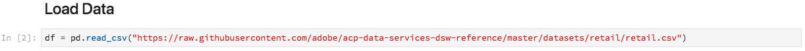

# ノートブックを使用したデータの分析

このチュートリアルでは、Data Science Workspace に組み込まれている Jupyter ノートブックを使用してデータへのアクセス、データの調査、データの視覚化をおこなう方法について説明します。このチュートリアルを完了すると、Jupyter ノートブックで提供される機能の一部を把握でき、データへの理解を深めることができます。

次の概念が導入されています。

- **[!DNL JupyterLab]:**[[!DNL JupyterLab]](https://blog.jupyter.org/jupyterlab-is-ready-for-users-5a6f039b8906) は、Project Jupyter向けの次世代のWebベースのインターフェースで、と緊密に統合されてい [!DNL Adobe Experience Platform]ます。
- **バッチ**：データセットはいくつかのバッチで構成されます。バッチとは、一定期間に収集され 1 つの単位として一緒に処理される一連のデータです。データセットにデータが追加されると、新しいバッチが作成されます。
- **データアクセス SDK（廃止）**：データアクセス SDK は廃止されました。Please use the [[!DNL Platform SDK]](../authoring/platform-sdk.md) guide.

## Data Science Workspace でのノートブックの調査

この節では、既に小売販売スキーマに取り込まれているデータを調査します。

Data Science Workspace allows users to create [!DNL Jupyter Notebooks] through the [!DNL JupyterLab] platform where they can create and edit machine learning workflows. [!DNL JupyterLab] は、Web ブラウザーでノートブックドキュメントを編集できるサーバー／クライアント型のコラボレーションツールです。これらのノートブックには、実行可能コードとリッチテキスト要素の両方を含めることができます。For our purposes, we will use Markdown for analysis description and executable [!DNL Python] code to perform data exploration and analysis.

### ワークスペースの選択

When launching [!DNL JupyterLab], we are presented with a web-based interface for Jupyter Notebooks. 選択するノートブックタイプに応じて、対応するカーネルが起動します。

使用する環境を比較する際には、各サービスの制限事項を考慮する必要があります。例えば、 で [pandas](https://pandas.pydata.org/) ライブラリを使用する場合、通常のユーザーであれば、RAM の上限は 2 GB です。[!DNL Python]パワーユーザーの場合でも、20 GB の RAM に制限されます。If dealing with larger computations, it would make sense to use [!DNL Spark] which offers 1.5 TB that is shared with all notebook instances.

デフォルトでは、Tensorflow レシピは GPU クラスターで動作し、Python は CPU クラスター内で動作します。

### ノートコンピューターの新規作成

In the [!DNL Adobe Experience Platform] UI, click on the Data Science tab in the top menu to take you to the Data Science Workspace. From this page, click on the [!DNL JupyterLab] tab which will open the [!DNL JupyterLab] launcher. 次のようなページが表示されます。


In our tutorial, we will be using [!DNL Python] 3 in the Jupyter Notebook to show how to access and explore the data. ランチャーページには、サンプルのノートブックが用意されています。We will be using the Retail Sales recipe for [!DNL Python] 3.


Retail Sales レシピは、同じ Retail Sales データセットを使用して、Jupyter ノートブックでデータを調査し視覚化する方法を示すスタンドアロンの例です。さらに、このノートブックでは、トレーニングと検証をさらに進めます。このノートブックについて詳しくは、[こちらの説明](../walkthrough.md)を参照してください。

### データへのアクセス

>[!NOTE]
>
> `data_access_sdk_python` は廃止されているので、お勧めしません。コードを変換する場合は、[データアクセス SDK の Platform SDK への変換](../authoring/platform-sdk.md)チュートリアルを参照してください。このチュートリアルでも、以下と同じ手順を使用します。

We will go over accessing data internally from [!DNL Adobe Experience Platform] and data externally. `data_access_sdk_python` ライブラリを使用して、データセットや XDM スキーマなどの内部データにアクセスします。For external data, we will use the pandas [!DNL Python] library.

#### 外部データ

Retail Sales ノートブックを開き、「Load Data」ヘッダーを探します。The following [!DNL Python] code uses pandas&#39; `DataFrame` data structure and the [read_csv()](https://pandas.pydata.org/pandas-docs/stable/generated/pandas.read_csv.html#pandas.read_csv) function to read the CSV hosted on [!DNL Github] into the DataFrame:



pandas の DataFrame データ構造は、2 次元のラベル付きデータ構造です。データの次元をすばやく確認するには、`df.shape` を使用します。DataFrame の次元を表すタプルが返されます。


最後に、どのようなデータであるかを見てみましょう。`df.head(n)` を使用して、DataFrame の最初の `n` 行を表示できます。


#### [!DNL Experience Platform] data

Now, we will go over accessing [!DNL Experience Platform] data.

##### データセット ID 別

この節では、Retail Sales データセットを使用します。これは、Retail Sales サンプルノートブックで使用されているのと同じデータセットです。

Jupyter ニートブックで、左側の「**Data**」タブからデータにアクセスできます。このタブをクリックすると、データセットのリストが表示されます。


これで、Datasets ディレクトリで、取り込まれたすべてのデータセットを確認できます。ディレクトリにデータセットが大量に入力されている場合は、すべてのエントリの読み込みに 1 分程度かかる場合があります。

データセットは同じなので、外部データを使用した前の節の読み込みデータを置き換えます。「**Load Data**」の下のコードブロックを選択し、キーボードの **D** キーを 2 回押します。フォーカスがテキスト内ではなく、ブロック上にあることを確認します。**D** キーを 2 回押す前に、**Esc** キーを押してテキストフォーカスをエスケープすることができます。

これで、`Retail-Training-<your-alias>` データセットを右クリックし、ドロップダウンの「Explore Data in Notebook」オプションを選択できます。実行可能コードエントリがノートブックに表示されます。

>[!TIP]
>
>Refer to the [[!DNL Platform SDK]](../authoring/platform-sdk.md) guide to convert your code.

```PYTHON
from data_access_sdk_python.reader import DataSetReader
from datetime import date
reader = DataSetReader()
df = reader.load(data_set_id="xxxxxxxx", ims_org="xxxxxxxx@AdobeOrg")
df.head()
```

If you are working on other kernels other than [!DNL Python], please refer to [this page](https://github.com/adobe/acp-data-services-dsw-reference/wiki/Accessing-Data-on-the-Platform) to access data on the [!DNL Adobe Experience Platform].

実行可能なセルを選択し、ツールバーの再生ボタンを押すと、実行可能コードが実行されます。`head()` の出力は、データセットのキーを列にした、データセットの最初の n 行分のテーブルです。`head()` では、出力する行数を指定する整数の引数を受け取ります。デフォルトでは、これは 5 です。


カーネルを再起動し、すべてのセルを再実行した場合は、前回と同じ出力が得られるはずです。


### データの調査

これでデータにアクセスできるようになったので、統計と視覚化を使用して、データそのものに焦点を当てましょう。使用するデータセットは、45 箇所の異なる店舗に関するある日の各種情報を提供する小売データセットです。特定の `date` および `store` の特性の一部を次に示します。
- `storeType`
- `weeklySales`
- `storeSize`
- `temperature`
- `regionalFuelPrice`
- `markDown`
- `cpi`
- `unemployment`
- `isHoliday`

#### 統計概要

We can leverage [!DNL Python's] pandas library to get the data type of each attribute. 以下の呼び出しの出力では、各列のエントリ数とデータタイプに関する情報が得られます。

```PYTHON
df.info()
```


各列のデータタイプを知ることで、データの処理方法がわかるので、この情報は役に立ちます。

次に、統計概要を見てみましょう。数値データタイプのみが表示されるので、`date`、`storeType`、`isHoliday` は出力されません。

```PYTHON
df.describe()
```


これにより、特性ごとに 6435 個のインスタンスが存在することがわかります。また、平均、標準偏差（std）、最小、最大、四分位数などの統計情報も提供されます。これにより、データの偏差に関する情報が得られます。次の節では、視覚化について説明します。視覚化では、これらの情報を総合してデータの理解を深めることができます。

`store` の最小値と最大値を見ると、データが表す 45 箇所の一意の店舗があることがわかります。店舗の種類を識別する `storeTypes` もあります。次の方法で `storeTypes` の分布を確認できます。


つまり、22 店舗が `storeType` `A`、17 店舗が `storeType` `B`、6 店舗が `storeType``C` です。

#### データの視覚化

データフレームの値がわかったので、これに視覚化を補って、情報をより明確にし、パターンを識別しやすくしたいと思います。結果をオーディエンスに伝える場合はグラフも便利です。Some [!DNL Python] libraries which are useful for visualization include:
- [Matplotlib](https://matplotlib.org/)
- [pandas](https://pandas.pydata.org/)
- [seaborn](https://seaborn.pydata.org/)
- [ggplot](https://ggplot2.tidyverse.org/)

この節では、各ライブラリを使用する利点を簡単に説明します。

[Matplotlib](https://matplotlib.org/)[!DNL Python] は、最も古くからある 視覚化パッケージです。「容易なことを容易に、難しいことを可能に」することを目的にしています。このパッケージはきわめて強力ですが、同時に複雑でもあるので、その傾向はあります。相当な時間と労力をかけなければ、見栄えのまずまず良いグラフを得るのは必ずしも容易ではありません。

[pandas](https://pandas.pydata.org/) は、統合インデックス付けを使用したデータ操作が可能な DataFrame オブジェクトに主に使用されます。ただし、pandas には、Matplotlib をベースにしたプロット機能も組み込まれています。

[seaborn](https://seaborn.pydata.org/) は、Matplotlib の上に構築されたパッケージです。デフォルトのグラフをより視覚に訴えるものにし、複雑なグラフを簡単に作成できるようにすることが主な目的です。

[ggplot](https://ggplot2.tidyverse.org/) は、Matplotlib の上に構築されたパッケージです。ただし、主な違いは、このツールが R の ggplot2 を移植したものであることです。seaborn と同様に、Matplotlib を改良することが目的です。R の ggplot2 を使い慣れたユーザーは、このライブラリの使用を検討してください。


##### 単一変量グラフ

単一変量グラフは、個々の変数のグラフです。データの視覚化に使用される一般的な単一変量グラフは、ボックスウィスカープロットです。

以前の小売データセットを使って、45 店舗とその週間売上高ごとにボックスウィスカープロットを作成できます。プロットは、`seaborn.boxplot` 関数を使用して生成されます。


ボックスウィスカープロットは、データの分布を示すのに使用されます。プロットの外側の線は上下の四分位数を示し、ボックスは四分位数の範囲に広がります。ボックス内の行は中央値を示します。上四分位数または下四分位数の 1.5 倍以上のデータポイントは、円としてマークされます。これらの点は外れ値と見なされます。

##### 多変量グラフ

多変量プロットは、変数間の相互作用を確認するために使用されます。この視覚化手法を使用すると、データサイエンティストは変数間に相関関係やパターンがあるかどうかを確認できます。一般的に使用される多変量グラフは相関行列です。多変数間の依存関係が相関係数で定量化されます。

同じ小売データセットを使用して、相関行列を生成できます。


対角線上に 1 が並んでいることに注目してください。これは、変数をそれ自身と比較する場合、完全に正の相関関係があることを示しています。強い正の相関は 1 に近い大きさになり、弱い相関は 0 に近い大きさになります。負の相関は、逆の傾向を示す負の係数で示されます。


## 次の手順

This tutorial went over how to create a new Jupyter notebook in the Data Science Workspace and how to access data externally as well as from [!DNL Adobe Experience Platform]. 特に、次の手順を詳しく説明しました。
- Jupyter ノートブックの新規作成
- データセットとスキーマへのアクセス
- データセットの調査

これで、[次の手順](../models-recipes/package-source-files-recipe.md)に進んで、レシピをパッケージ化し Data Science Workspace にインポートする準備が整いました。