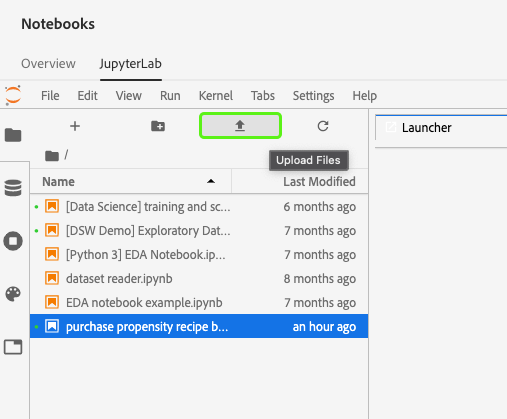
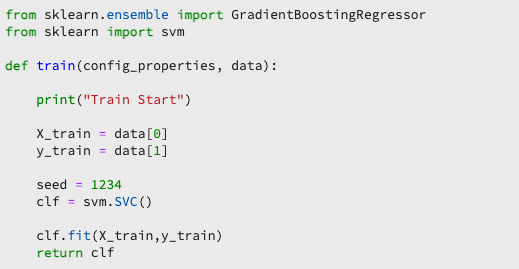

# JupyterLab Notebooks を使用してモデルを作成する

このチュートリアルでは、JupyterLab ノートブックレシピビルダーテンプレートを使用してモデルを作成するために必要な手順について説明します。

## 導入された概念：

- **レシピ：** レシピは、モデル仕様のAdobeの用語で、トレーニング済みモデルの作成と実行に必要な特定の機械学習、AI アルゴリズム、アルゴリズムのアンサンブル、処理ロジック、設定を表すトップレベルのコンテナです。
- **モデル**：モデルは、履歴データと構成を使用してビジネスユースケースを解決するためにトレーニングされる機械学習レシピのインスタンスです。
- **トレーニング**：トレーニングは、ラベル付きのデータからパターンやインサイトを学習するプロセスです。
- **スコアリング**：スコアリングは、トレーニング済みモデルを使用してデータからインサイトを生成するプロセスです。

## 必要なアセットのダウンロード {#assets}

このチュートリアルを進める前に、必要なスキーマとデータセットを作成する必要があります。 のチュートリアルを参照してください。 [Luma 傾向モデルのスキーマとデータセットの作成](../models-recipes/create-luma-data.md) 必要なアセットをダウンロードし、前提条件を設定する。

## の基本を学ぶ [!DNL JupyterLab] ノートブック環境

内で最初からレシピを作成することもできます [!DNL Data Science Workspace]. 開始するには、に移動します。 [Adobe Experience Platform](https://platform.adobe.com) をクリックし、 **[!UICONTROL ノートブック]** 」タブをクリックします。 新しいノートブックを作成するには、 [!DNL JupyterLab Launcher].

この [!UICONTROL レシピビルダー] ノートブックを使用すると、ノートブック内でトレーニングとスコアリングの実行を実行できます。 これにより、トレーニングデータとスコアリングデータで実験を実行する間に、`train()` メソッドと `score()` メソッドを柔軟に変更できます。トレーニングとスコアリングの出力に満足したら、レシピを作成し、さらにレシピを使用してモデルとしてモデルとして公開して機能をモデル化できます。

>[!NOTE]
>
>この [!UICONTROL レシピビルダー] ノートブックは、すべてのファイル形式の操作をサポートしていますが、現在、レシピの作成機能は、のみをサポートしています [!DNL Python].


を選択し、 [!UICONTROL レシピビルダー] ランチャーからノートブックが開き、新しいタブに表示されます。

上部の新しい「ノートブック」タブに、3 つの追加のアクションを含むツールバーが読み込まれます。 **[!UICONTROL トレーニング]**, **[!UICONTROL スコア]**、および **[!UICONTROL レシピを作成]**. これらのアイコンは、 [!UICONTROL レシピビルダー] ノートブック。 これらのアクションに関する詳細情報が提供されています [トレーニングとスコアリングのセクション](#training-and-scoring) ノートブックでレシピを作成した後。


## の基本を学ぶ [!UICONTROL レシピビルダー] notebook

提供されたアセットフォルダーには、Luma の傾向モデルが含まれます `propensity_model.ipynb`. JupyterLab の「ノートブックをアップロード」オプションを使用して、提供されたモデルをアップロードし、ノートブックを開きます。



このチュートリアルの残りの部分では、傾向モデルノートブックで事前に定義された次のファイルについて説明します。

- [要件ファイル](#requirements-file)
- [設定ファイル](#configuration-files)
- [トレーニングデータローダー](#training-data-loader)
- [スコアリングデータローダー](#scoring-data-loader)
- [パイプラインファイル](#pipeline-file)
- [評価ファイル](#evaluator-file)
- [データセーバーファイル](#data-saver-file)

次のビデオチュートリアルでは、Luma 傾向モデルのノートブックを説明します。

>[!VIDEO](https://video.tv.adobe.com/v/333570)

### 要件ファイル {#requirements-file}

要件ファイルは、モデルで使用する追加のライブラリを宣言するために使用されます。 依存関係がある場合は、バージョン番号を指定できます。追加のライブラリを探すには、 [anaconda.org](https://anaconda.org). 要件ファイルの形式を設定する方法については、 [コンダ](https://docs.conda.io/projects/conda/en/latest/user-guide/tasks/manage-environments.html#creating-an-environment-file-manually). 既に使用されている主なライブラリのリストは次のとおりです。

```JSON
python=3.6.7
scikit-learn
pandas
numpy
data_access_sdk_python
```

>[!NOTE]
>
> 追加したライブラリまたは特定のバージョンは、上記のライブラリと互換性がない場合があります。また、環境ファイルを手動で作成する場合は、 `name` フィールドを上書きすることはできません。

Luma 傾向モデルノートブックの場合、要件を更新する必要はありません。

### 設定ファイル {#configuration-files}

設定ファイル（`training.conf` および `scoring.conf`）は、トレーニングとスコアリングに使用するデータセットを指定し、ハイパーパラメーターを追加するために使用されます。トレーニングとスコアリングには別々の設定があります。

モデルがトレーニングを実行するには、 `trainingDataSetId`, `ACP_DSW_TRAINING_XDM_SCHEMA`、および `tenantId`. また、スコアリングの場合、 `scoringDataSetId`, `tenantId`、および `scoringResultsDataSetId `.

データセットとスキーマ ID を確認するには、「データ」タブに移動します  （フォルダーアイコンの下）をクリックします。 3 つの異なるデータセット ID を指定する必要があります。 この `scoringResultsDataSetId` は、モデルスコアリング結果の保存に使用され、空のデータセットである必要があります。 これらのデータセットは、以前に [必要なアセット](#assets) 手順


同じ情報は、「[Adobe Experience Platform](https://platform.adobe.com/)」の「**[スキーマ](https://platform.adobe.com/schema)**」タブと「**[データセット](https://platform.adobe.com/dataset/overview)**」タブにあります。

競い合うと、トレーニングとスコアリングの設定は次のスクリーンショットのようになります。


デフォルトでは、データのトレーニングとスコアリングをおこなう際に、次の設定パラメーターが設定されます。

- `ML_FRAMEWORK_IMS_USER_CLIENT_ID`
- `ML_FRAMEWORK_IMS_TOKEN`
- `ML_FRAMEWORK_IMS_ML_TOKEN`
- `ML_FRAMEWORK_IMS_TENANT_ID`

## トレーニングデータローダーについて {#training-data-loader}

トレーニングデータローダーの目的は、機械学習モデルの作成に使用するデータをインスタンス化することです。通常、トレーニングデータローダーが実行するタスクは 2 つあります。

- からデータを読み込み中 [!DNL Platform]
- データの準備と特徴量エンジニアリング

以下の 2 つの節で、データの読み込みとデータの準備について説明します。

### データの読み込み {#loading-data}

この手順では、[pandas データフレーム](https://pandas.pydata.org/pandas-docs/stable/generated/pandas.DataFrame.html)を使用します。データは、 [!DNL Adobe Experience Platform] 次のいずれかを使用： [!DNL Platform] SDK (`platform_sdk`) または pandas`を使用する外部ソースから `read_csv()` または `read_json()` 関数

- [[!DNL Platform SDK]](#platform-sdk)
- [外部ソース](#external-sources)

>[!NOTE]
>
> Recipe Builder ノートブックでは、データは `platform_sdk` データローダーを介して読み込まれます。

### [!DNL Platform] SDK {#platform-sdk}

`platform_sdk` データローダーの使用に関する詳細なチュートリアルについては、『[Platform SDK ガイド](../authoring/platform-sdk.md)』を参照してください。このチュートリアルでは、認証の構築、データの基本読み取り、およびデータの基本的な書き込みに関する情報を提供します。

### 外部ソース {#external-sources}

この節では、JSON または CSV ファイルを pandas オブジェクトにインポートする方法を示します。Pandas ライブラリの公式ドキュメントについては、次の URL を参照してください。
- [read_csv](https://pandas.pydata.org/pandas-docs/stable/generated/pandas.read_csv.html)
- [read_json](https://pandas.pydata.org/pandas-docs/stable/generated/pandas.read_json.html)

まず、CSV ファイルのインポート例を示します。`data` 引数は CSV ファイルへのパスです。この変数は、[前の節](#configuration-files)の `configProperties` からインポートされました。

```PYTHON
df = pd.read_csv(data)
```

また、JSON ファイルからインポートすることもできます。`data` 引数は CSV ファイルへのパスです。この変数は、[前の節](#configuration-files)の `configProperties` からインポートされました。

```PYTHON
df = pd.read_json(data)
```

これで、データはデータフレームオブジェクトに含まれ、[次の節](#data-preparation-and-feature-engineering)で分析および操作できます。

## トレーニングデータローダーファイル

この例では、データは Platform SDK を使用して読み込まれます。 ライブラリは、次の行を含めることで、ページの上部にインポートできます。

`from platform_sdk.dataset_reader import DatasetReader`

その後、 `load()` メソッドを使用して、 `trainingDataSetId` 設定 (`recipe.conf`) ファイルです。

```PYTHON
def load(config_properties):
    print("Training Data Load Start")

    #########################################
    # Load Data
    #########################################    
    client_context = get_client_context(config_properties)
    dataset_reader = DatasetReader(client_context, dataset_id=config_properties['trainingDataSetId'])
```

>[!NOTE]
>
>詳しくは、 [設定ファイルセクション](#configuration-files)を使用する場合、次の設定パラメーターが、 `client_context = get_client_context(config_properties)`:
> - `ML_FRAMEWORK_IMS_USER_CLIENT_ID`
> - `ML_FRAMEWORK_IMS_TOKEN`
> - `ML_FRAMEWORK_IMS_ML_TOKEN`
> - `ML_FRAMEWORK_IMS_TENANT_ID`


データが揃ったら、データの準備と特徴のエンジニアリングから始めます。

### データの準備と特徴量エンジニアリング {#data-preparation-and-feature-engineering}

データを読み込んだ後、データをクリーンアップしてデータの準備を行う必要があります。 この例では、モデルの目標は、顧客が製品を注文するかどうかを予測することです。 モデルが特定の製品を参照していないので、必要ありません `productListItems` したがって、列は削除されます。 次に、1 つの列に 1 つまたは 2 つの値のみを含む追加の列が削除されます。 モデルのトレーニングでは、目標の予測に役立つ有用なデータのみを保持することが重要です。


不要なデータを削除したら、特徴エンジニアリングを開始できます。 この例で使用されるデモデータには、セッション情報が含まれていません。 通常、特定の顧客の現在および過去のセッションに関するデータを取得します。 この例では、セッション情報が不足しているので、ジャーニー区切りによる現在および過去のセッションを模倣します。


区切りが完了すると、データにラベルが付けられ、ジャーニーが作成されます。


次に、機能を作成し、過去と現在に分割します。 次に、不要な列が削除され、Luma のお客様向けの過去と現在のジャーニーの両方が表示されます。 これらのジャーニーには、顧客が品目を購入したかどうかや、購入に至るまでにたどったジャーニーなどの情報が含まれます。


## スコアリングデータローダー {#scoring-data-loader}

スコアリングのデータを読み込む手順は、トレーニングデータの読み込みと似ています。 コードを詳しく見ると、 `scoringDataSetId` 内 `dataset_reader`. これは、トレーニングとスコアの両方で同じ Luma データソースが使用されるからです。

トレーニングとスコアリングに異なるデータファイルを使用する場合、トレーニングとスコアリングのデータローダーは別々になります。 これにより、必要に応じて、トレーニングデータをスコアリングデータにマッピングするなど、追加の前処理を実行できます。

## パイプラインファイル {#pipeline-file}

`pipeline.py` ファイルには、トレーニングとスコアリングのロジックが含まれます。

トレーニングの目的は、トレーニングデータセットの特徴とラベルを使用してモデルを作成することです。トレーニングモデルを選択したら、x および y トレーニングデータセットをモデルに適合させ、トレーニング済みモデルを返す必要があります。

>[!NOTE]
> 
>  特徴とは、機械学習モデルがラベルを予測するために使用する入力変数を指します。



`score()` 関数には、スコアリングアルゴリズムを含め、モデルの成功度を示す測定値を返す必要があります。`score()` 関数は、スコアリングデータセットラベルとトレーニング済みモデルを使用して、予測された特徴のセットを生成します。次に、これらの予測値が、スコアリングデータセットの実際の特徴と比較されます。この例では、`score()` 関数は、トレーニング済みモデルを使用して、スコアリングデータセットのラベルを使用して特徴を予測します。予測された特徴が返されます。


## 評価ファイル {#evaluator-file}

`evaluator.py` ファイルには、トレーニングレシピの評価方法とトレーニングデータの分割方法に関するロジックが含まれています。

### データセットの分割 {#split-the-dataset}

トレーニングのデータ準備段階では、トレーニングとテストに使用するデータセットを分割する必要があります。この `val` データは、トレーニング後にモデルを評価するために暗黙的に使用されます。 このプロセスはスコアリングとは別のものです。

この節では、 `split()` 関数を使用してデータをノートブックに読み込み、データセット内の関連のない列を削除してデータをクリーンアップします。 ここから、データ内の既存の生の特徴から関連する特徴を追加で作成するプロセスである特徴エンジニアリングを実行できます。


### トレーニング済みモデルの評価 {#evaluate-the-trained-model}

この `evaluate()` 関数は、モデルのトレーニングが終わると実行され、モデルの成功度を示す指標を返します。 この `evaluate()` 関数は、テストデータセットラベルとトレーニング済みモデルを使用して、一連の特徴を予測します。 これらの予測値は、テストデータセットの実際の特徴と比較されます。この例では、次の指標が使用されます。 `precision`, `recall`, `f1`、および `accuracy`. この関数は、評価指標の配列を含む `metric` オブジェクトを返します。これらの指標は、トレーニング済みモデルのパフォーマンスを評価するために使用されます。


追加中 `print(metric)` 指標の結果を表示できます。


## データセーバーファイル {#data-saver-file}

この `datasaver.py` ファイルに `save()` 関数とは、スコアリングのテスト中に予測を保存するために使用します。 この `save()` 関数は、予測と [!DNL Experience Platform Catalog] API はデータをに書き込みます。 `scoringResultsDataSetId` が `scoring.conf` ファイル。 次のことが可能です。


## トレーニングとスコアリング {#training-and-scoring}

ノートブックの変更が完了し、レシピのトレーニングをおこなう場合は、バーの上部にある関連ボタンを選択して、セル内にトレーニングランを作成できます。 ボタンを選択すると、トレーニングスクリプトのコマンドと出力のログがノートブック ( `evaluator.py` セル ) を参照してください。 Conda は、最初にすべての依存関係をインストールし、その後トレーニングを開始します。

スコアリングを実行する前に、少なくとも 1 回はトレーニングを実行する必要があります。の選択 **[!UICONTROL スコアリングを実行]** ボタンは、トレーニング中に生成されたトレーニング済みモデルに対してスコアを付けます。 スコアリングスクリプトは、 `datasaver.py`.

デバッグの目的で、非表示の出力を表示する場合は、出力セルの末尾に `debug` を追加し、再実行します。


## レシピの作成 {#create-recipe}

レシピの編集が完了し、トレーニング/スコアリングの出力に満足したら、「 」を選択してノートブックからレシピを作成できます。 **[!UICONTROL レシピを作成]** をクリックします。


選択後 **[!UICONTROL レシピを作成]**」と入力すると、レシピ名の入力を求めるプロンプトが表示されます。 この名前は、 [!DNL Platform].


次を選択したら、 **[!UICONTROL Ok]**、レシピの作成プロセスが開始されます。 これには時間がかかる場合があり、「レシピを作成」ボタンの代わりに進行状況バーが表示されます。 完了したら、 **[!UICONTROL レシピを表示]** ボタンをクリックして **[!UICONTROL レシピ]** 下のタブ **[!UICONTROL ML モデル]**


>[!CAUTION]
>
> - ファイルのセルを削除しないでください
> - ファイルのセルの先頭の `%%writefile` 行を編集しないでください
> - 異なるノートブックに同時にレシピを作成しないでください


## 次の手順 {#next-steps}

このチュートリアルでは、 [!UICONTROL レシピビルダー] ノートブック。 また、ノートブックをレシピワークフローに導く方法も学びました。

内でリソースを使用する方法を学び続けるには [!DNL Data Science Workspace]、次を参照してください： [!DNL Data Science Workspace] 「レシピとモデル」ドロップダウン。