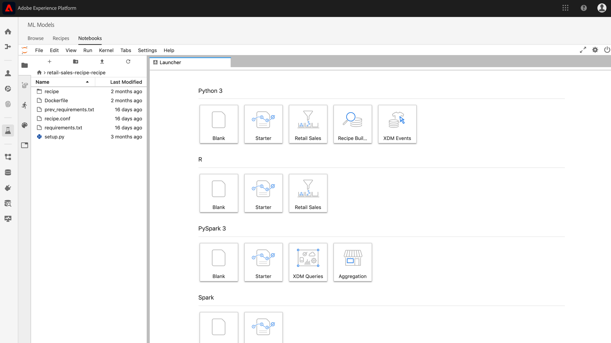

# Jupyterノートブックを使用してレシピを作成する

このチュートリアルでは、2つの主なセクションについて説明します。 まず、JupterLabノートブック内のテンプレートを使用して機械学習モデルを作成します。 次に、JupyterLab内でノートブックをレシピワークフローに導き、Data Science Workspace内でレシピを作成します。
- [JupyterLabノートブック環境](#get-started-with-the-jupyterlab-notebook-environment)
- [レシピファイルを編集する](#make-edits-to-recipe-files)
- [Recipe Builderノートブックの概要](#get-started-with-the-recipe-builder-notebook)
   - [要件ファイル](#requirements-file)
   - [設定ファイル](#configuration-files)
   - [トレーニングデータローダー](#training-data-loader)
   - [スコアデータローダー](#scoring-data-loader)
   - [パイプラインファイル](#pipeline-file)
   - [評価ファイル](#evaluator-file)
   - [データセーバーファイル](#data-saver-file)
- [トレーニングとスコア](#training-and-scoring)
- [レシピの作成](#create-recipe)

## 導入された概念：

- **レシピ：** レシピとは、アドビのモデル仕様を表す用語で、トップレベルのコンテナで、トレーニングを受けたモデルを作成して実行し、特定のビジネス問題の解決に役立つ、特定の機械学習、AIアルゴリズム、アルゴリズムのアンサンブルを表します。
- **モデル：** モデルとは、ビジネスの使用事例に対して解決するための履歴データと設定を使用してトレーニングを受けた機械学習レシピのインスタンスです。
- **トレーニング：** トレーニングとは、ラベル付きのデータからパターンや洞察を学習するプロセスです。
- **スコア：** スコアリングとは、トレーニングを受けたモデルを使用して、データからインサイトを生成するプロセスです。

## JupyterLabノートブック環境

レシピを一から作成する方法は、Data Science Workspace内で実行できます。 開始するには、 [Adobe Experience Platform](https://platform.adobe.com) ( **Adobe Experience Platform** )に移動し、左側の「MLモデル」タブをクリックしてData Science Workspaceに移動します。 ここから、「 **Notebooks** 」サブタブをクリックし、Jupyterlabランチャー画面で、Recipe Builderテンプレートを選択して新しいノートブックを作成します。

Recipe Builderノートブックを使用すると、ノートブック内でトレーニングとスコアリングの実行を実行できます。 これにより、トレーニングデータとスコアリングデータの実 `train()` 験を実行す `score()` る間に、および方法を柔軟に変更できます。 トレーニングとスコアの出力に満足したら、Data Science Workspaceで使用するレシピを作成し、Recipe Builderノートブックに組み込まれているレシピの機能を使用します。

>[!NOTE] Recipe Builderノートブックは、すべてのファイル形式での作業をサポートしていますが、現在のところ、レシピの作成機能はPythonのみをサポートしています。



ランチャーからRecipe Builderノートブックをクリックすると、タブにノートブックが開きます。 ノートブックで使用されるテンプレートは、このパブリック・リポジトリにもあるPython小売売上予測レシピ [です。](https://github.com/adobe/experience-platform-dsw-reference/tree/master/recipes/python/retail/)

ツールバーには、「 **Train**」、「 **Score** 」、「 **Create Recipe**」の3つのアクションがあります。 これらのアイコンは、レシピビルダーのノートブックにのみ表示されます。 これらのアクションに関する詳細は、ノート [ブックでレシピを作成した後](#training-and-scoring) 、トレーニングとスコアのセクションで説明します。


## レシピファイルを編集する

<!-- Databricks update to recipe needed -->
レシピファイルを編集するには、ファイルパスに対応するジュピター内のセルに移動します。 例えば、に変更を加える場合は、を `evaluator.py`探します `%%writefile demo-recipe/evaluator.py`。

開始がセルに必要な変更を加えたら、セルを実行します。 このコ `%%writefile filename.py` マンドは、セルの内容をに書き込みま `filename.py`す。 各ファイルのセルを手動で実行し、変更を加える必要があります。

>[!NOTE] 該当する場合は、セルを手動で実行する必要があります。

## Recipe Builderノートブックの概要

JupyterLabノートブック環境の基本を理解したら、機械学習モデルレシピを構成するファイルを見てみましょう。 ここで説明するファイルは次のとおりです。

- [要件ファイル](#requirements-file)
- [設定ファイル](#configuration-files)
- [トレーニングデータローダー](#training-data-loader)
- [スコアデータローダー](#scoring-data-loader)
- [パイプラインファイル](#pipeline-file)
- [評価ファイル](#evaluator-file)
- [データセーバーファイル](#data-saver-file)


### 要件ファイル

要件ファイルは、レシピで使用する追加のライブラリを宣言するために使用されます。 依存関係がある場合は、バージョン番号を指定できます。 その他のライブラリを探すには、https://anaconda.orgを参照してください。 既に使用されているメインリストのライブラリは次のとおりです。

```JSON
python=3.5.2
scikit-learn
pandas
numpy
data_access_sdk_python
```

>[!NOTE] 追加したライブラリまたは特定のバージョンは、上記のライブラリと互換性がない場合があります。


### 設定ファイル

設定ファイルと、は、ト `training.conf` レーニ `scoring.conf`ングとスコアリングに使用するデータセットを指定し、ハイパーパラメータを追加するために使用されます。 トレーニングとスコアリングには別々の設定があります。

トレーニングとスコアリングを実行する前に、ユーザーは次の変数を入力する必要があります。
- `trainingDataSetId`
- `ACP_DSW_TRAINING_XDM_SCHEMA`
- `scoringDataSetId`
- `ACP_DSW_SCORING_RESULTS_XDM_SCHEMA`
- `scoringResultsDataSetId`

データセットとスキーマIDを確認するには、左側のナビゲーションバー（フォルダーアイコンの下）にあるノートブック内の「データ」タブに移動します。


同じ情報は、 [Adobe Experience Platformの「](https://platform.adobe.com/) スキーマ **[」タブと「データセ](https://platform.adobe.com/schema)**ット**[」タブにあ](https://platform.adobe.com/dataset/overview)** ります。

デフォルトでは、データにアクセスする際に次の設定パラメーターが設定されます。

- `ML_FRAMEWORK_IMS_USER_CLIENT_ID`
- `ML_FRAMEWORK_IMS_TOKEN`
- `ML_FRAMEWORK_IMS_ML_TOKEN`
- `ML_FRAMEWORK_IMS_TENANT_ID`


## トレーニングデータローダー

トレーニングデータローダーの目的は、機械学習モデルの作成に使用するデータをインスタンス化することです。 通常、トレーニングデータローダーが達成するタスクは2つあります。
- プラットフォームからのデータの読み込み
- データの準備と機能のエンジニアリング

以下の2つのセクションで、データの読み込みとデータの準備について説明します。

### データの読み込み

この手順では、pandasのデータフ [レームを使用しま](https://pandas.pydata.org/pandas-docs/stable/generated/pandas.DataFrame.html)す。 データは、Platform SDK(`platform_sdk`)を使用してAdobe Experience Platformのファイルから、またはPandaや関数を使用して外部ソースから読み込むこ `read_csv()` とがで `read_json()` きます。

- [プラットフォームSDK](#platform-sdk)
- [外部ソース](#external-sources)

>[!NOTE] Recipe Builderノートブックでは、データはデータローダーを介して読み込 `platform_sdk` まれます。

### プラットフォームSDK

データローダの使用に関する詳細なチュートリ `platform_sdk` アルについては、『プラットフォームSDK』ガ [イドを参照してくださ](../authoring/platform-sdk.md)い。 このチュートリアルでは、認証の構築、データの基本読み取り、およびデータの基本的な書き込みに関する情報を提供します。

### 外部ソース

この節では、JSONまたはCSVファイルをpandasオブジェクトに読み込む方法を示します。 pandasライブラリの公式ドキュメントは、次のURLを参照してください。
- [read_csv](https://pandas.pydata.org/pandas-docs/stable/generated/pandas.read_csv.html)
- [read_json](https://pandas.pydata.org/pandas-docs/stable/generated/pandas.read_json.html)

まず、CSVファイルの読み込み例を示します。 引数 `data` はCSVファイルのパスです。 この変数は、前の節のから `configProperties` 読み込ま [れました](#configuration-files)。

```PYTHON
df = pd.read_csv(data)
```

また、JSONファイルから読み込むこともできます。 引数 `data` はCSVファイルのパスです。 この変数は、前の節のから `configProperties` 読み込ま [れました](#configuration-files)。

```PYTHON
df = pd.read_json(data)
```

これで、データはデータフレームオブジェクトに含まれ、次のセクションで分析および操作 [できます](#data-preparation-and-feature-engineering)。


### データアクセスSDK（非推奨）

>[!CAUTION]  が推奨さ `data_access_sdk_python` れなくなりました。デ [ータローダの使用に関するガイドについては、「Convert Data Access code to Platform SDK](../authoring/platform-sdk.md) 」を参照して `platform_sdk` ください。

データアクセスSDKを使用してデータを読み込むことができます。 ライブラリは、次の行を含めることで、ページの上部に読み込むことができます。

`from data_access_sdk_python.reader import DataSetReader`

次に、この方法を使 `load()` 用して、設定( `trainingDataSetId` )ファイルに設定されたとおりにト`recipe.conf`レーニングデータセットを取得します。

```PYTHON
prodreader = DataSetReader(client_id=configProperties['ML_FRAMEWORK_IMS_USER_CLIENT_ID'],
                           user_token=configProperties['ML_FRAMEWORK_IMS_TOKEN'],
                           service_token=configProperties['ML_FRAMEWORK_IMS_ML_TOKEN'])

df = prodreader.load(data_set_id=configProperties['trainingDataSetId'],
                     ims_org=configProperties['ML_FRAMEWORK_IMS_TENANT_ID'])
```

>[!NOTE] 設定ファイルの節で説 [明したように](#configuration-files)、Experience Platformのデータにアクセスする際には、次の設定パラメーターが設定されます。
> - `ML_FRAMEWORK_IMS_USER_CLIENT_ID`
> - `ML_FRAMEWORK_IMS_TOKEN`
> - `ML_FRAMEWORK_IMS_ML_TOKEN`
> - `ML_FRAMEWORK_IMS_TENANT_ID`


データが揃ったら、データの準備と機能のエンジニアリングから始めます。

### データの準備と機能のエンジニアリング

データの読み込み後、データは準備を行い、データセットとデータセットに分 `train` 割さ `val` れます。 サンプルコードを以下に示します。

```PYTHON
#########################################
# Data Preparation/Feature Engineering
#########################################
dataframe.date = pd.to_datetime(dataframe.date)
dataframe['week'] = dataframe.date.dt.week
dataframe['year'] = dataframe.date.dt.year

dataframe = pd.concat([dataframe, pd.get_dummies(dataframe['storeType'])], axis=1)
dataframe.drop('storeType', axis=1, inplace=True)
dataframe['isHoliday'] = dataframe['isHoliday'].astype(int)

dataframe['weeklySalesAhead'] = dataframe.shift(-45)['weeklySales']
dataframe['weeklySalesLag'] = dataframe.shift(45)['weeklySales']
dataframe['weeklySalesDiff'] = (dataframe['weeklySales'] - dataframe['weeklySalesLag']) / dataframe['weeklySalesLag']
dataframe.dropna(0, inplace=True)

dataframe = dataframe.set_index(dataframe.date)
dataframe.drop('date', axis=1, inplace=True) 
```

この例では、元のデータセットに対して次の5つの処理が行われています。
- 列の `week` 追加と `year` 追加
- インジケータ `storeType` ー変数に変換する
- 数値 `isHoliday` 変数に変換
- 将来の `weeklySales` 売上高と過去の売上高を得るオフセット
- データの分割（日付別）とデータセッ `train` ト `val` へ

最初に、と `week` 列が作 `year` 成され、元の列がPython `date` のdatetimeに変換さ [れます](https://pandas.pydata.org/pandas-docs/stable/generated/pandas.to_datetime.html)。 週と年の値は、datetimeオブジェクトから抽出されます。

次に、 `storeType` 3つの異なる店舗タイプ(、、および`A`)を表す3つの列に `B`変換され `C`ます。 それぞれにtrueを示すboolean値が含ま `storeType` れます。 列が `storeType` 削除されます。

同様に、ブ `weeklySales` ール値 `isHoliday` を数値表現（1または0）に変更します。

このデータは、とデータセット `train` の間で分 `val` 割されます。

関数の `load()` 出力は、データセットとデ `train` ータセッ `val` トで完了する必要があります。

### スコアデータローダー

スコアリング用のデータを読み込む手順は、関数内のトレーニングデータを読み込む手順と似て `split()` います。 データアクセスSDKを使用して、ファイル内のからデ `scoringDataSetId` ータを読み込 `recipe.conf` みます。

```PYTHON
def load(configProperties):

    print("Scoring Data Load Start")

    #########################################
    # Load Data
    #########################################
    prodreader = DataSetReader(client_id=configProperties['ML_FRAMEWORK_IMS_USER_CLIENT_ID'],
                               user_token=configProperties['ML_FRAMEWORK_IMS_TOKEN'],
                               service_token=configProperties['ML_FRAMEWORK_IMS_ML_TOKEN'])

    df = prodreader.load(data_set_id=configProperties['scoringDataSetId'],
                         ims_org=configProperties['ML_FRAMEWORK_IMS_TENANT_ID'])
```

データの読み込み後、データの準備とフィーチャーのエンジニアリングが行われます。

```PYTHON
#########################################
# Data Preparation/Feature Engineering
#########################################
df.date = pd.to_datetime(df.date)
df['week'] = df.date.dt.week
df['year'] = df.date.dt.year

df = pd.concat([df, pd.get_dummies(df['storeType'])], axis=1)
df.drop('storeType', axis=1, inplace=True)
df['isHoliday'] = df['isHoliday'].astype(int)

df['weeklySalesAhead'] = df.shift(-45)['weeklySales']
df['weeklySalesLag'] = df.shift(45)['weeklySales']
df['weeklySalesDiff'] = (df['weeklySales'] - df['weeklySalesLag']) / df['weeklySalesLag']
df.dropna(0, inplace=True)

df = df.set_index(df.date)
df.drop('date', axis=1, inplace=True)

print("Scoring Data Load Finish")

return df
```

当社のモデルの目的は将来の週別売上高を予測することなので、モデルの予測のパフォーマンスを評価するために使用するスコアデータセットを作成する必要があります。

このRecipe Builderノートブックは、週別販売の7日前のオフセットを行うことでこれを実現します。 毎週45のストアの測定値があるので、45個のデータセットを `weeklySales` 新しい列（という名前）に転送できます `weeklySalesAhead`。

```PYTHON
df['weeklySalesAhead'] = df.shift(-45)['weeklySales']
```

同様に、45秒前にシフトして列を `weeklySalesLag` 作成することもできます。 これを使用して、週別の売上高の差を計算し、列に格納することもできま `weeklySalesDiff`す。

```PYTHON
df['weeklySalesLag'] = df.shift(45)['weeklySales']
df['weeklySalesDiff'] = (df['weeklySales'] - df['weeklySalesLag']) / df['weeklySalesLag']
```

データポイント45のデータセッ `weeklySales` トを前に、45のデータセットを後ろに移動して新しい列を作成するので、最初と最後の45のデータポイントにはNaN値が設定されます。 NaN値を持つすべての行を削除する関数を使用して、こ `df.dropna()` れらのポイントをデータセットから削除できます。

```PYTHON
df.dropna(0, inplace=True)
```

スコアリ `load()` ングデータローダーの関数は、スコアリングデータセットを出力として使用して完了する必要があります。


### パイプラインファイル

このファ `pipeline.py` イルには、トレーニングとスコアのロジックが含まれます。 次の2つの項で、両方を見てみましょう。

### トレーニング

トレーニングの目的は、トレーニングデータセットの機能とラベルを使用してモデルを作成することです。

>[!NOTE]  機能 _とは_ 、機械学習モデルがラベルを予測するために使用する入力変数を指 _します_。

この機能 `train()` には、トレーニングモデルを含め、トレーニングされたモデルを返却する必要があります。 様々なモデルの例は、scikit-learnユーザーガイドのドキ [ュメントに記載されています](https://scikit-learn.org/stable/user_guide.html)。

トレーニングモデルを選択したら、xおよびyトレーニングデータセットをモデルに適合させ、トレーニング済みモデルが返されます。 これを示す例を次に示します。

```PYTHON
def train(configProperties, data):

    print("Train Start")

    #########################################
    # Extract fields from configProperties
    #########################################
    learning_rate = float(configProperties['learning_rate'])
    n_estimators = int(configProperties['n_estimators'])
    max_depth = int(configProperties['max_depth'])


    #########################################
    # Fit model
    #########################################
    X_train = data.drop('weeklySalesAhead', axis=1).values
    y_train = data['weeklySalesAhead'].values

    seed = 1234
    model = GradientBoostingRegressor(learning_rate=learning_rate,
                                      n_estimators=n_estimators,
                                      max_depth=max_depth,
                                      random_state=seed)

    model.fit(X_train, y_train)

    print("Train Complete")

    return model
```

アプリケーションに応じて、関数に引数が含まれることに注意してく `GradientBoostingRegressor()` ださい。 `xTrainingDataset` には、トレーニングに使用する機能を含める必要がありますが、ラ `yTrainingDataset` ベルを含める必要があります。


### スコア

関数にス `score()` コアリングアルゴリズムを含め、モデルの成功度を示す測定値を返す必要があります。 この関数 `score()` は、スコアリングデータセットラベルとトレーニングを受けたモデルを使用して、予測された機能のセットを生成します。 次に、これらの予測値が、スコアリングデータセットの実際の特徴と比較されます。 この例では、この関数は、トレーニ `score()` ングを受けたモデルを使用して、スコアリングデータセットのラベルを使用して機能を予測します。 予測された特徴が返されます。

```PYTHON
def score(configProperties, data, model):

    print("Score Start")

    X_test = data.drop('weeklySalesAhead', axis=1).values
    y_test = data['weeklySalesAhead'].values
    y_pred = model.predict(X_test)

    data['prediction'] = y_pred
    data = data[['store', 'prediction']].reset_index()
    data['date'] = data['date'].astype(str)

    print("Score Complete")

    return data
```

### 評価ファイル

このフ `evaluator.py` ァイルには、トレーニングレシピの評価方法とトレーニングデータの分割方法に関するロジックが含まれています。 小売販売の例では、トレーニングデータの読み込みと準備のロジックが含まれます。 以下の2つのセクションを見てみましょう。

### データセットの分割

トレーニングのデータ準備段階では、トレーニングとテストに使用するデータセットを分割する必要があります。 このデ `val` ータは、トレーニング後にモデルを評価するために暗黙的に使用されます。 このプロセスはスコアリングとは別のものです。

この節では、最初にノートブ `split()` ックにデータを読み込み、次にデータセット内の関連のない列を削除してデータをクリーンアップする関数を示します。 ここから、データ内の既存の生の機能から関連する機能を追加で作成するプロセスである機能エンジニアリングを実行できます。 このプロセスの例を以下に説明と共に示します。

関数を `split()` 次に示します。 引数で指定されたデータフレームは、返される変数と変数 `train` に分割 `val` されます。

```PYTHON
def split(self, configProperties={}, dataframe=None):
    train_start = '2010-02-12'
    train_end = '2012-01-27'
    val_start = '2012-02-03'
    train = dataframe[train_start:train_end]
    val = dataframe[val_start:]

    return train, val
```

### トレーニングされたモデルの評価

この関 `evaluate()` 数は、モデルのトレーニングが終わると実行され、モデルの成功度を示す指標が返されます。 この関数 `evaluate()` は、テストデータセットラベルとトレーニング済みモデルを使用して、一連の機能を予測します。 これらの予測値は、テストデータセットの実際の機能と比較されます。 一般的なスコアリングアルゴリズムには、次のものがあります。
- [平均絶対誤差率(MAPE)](https://en.wikipedia.org/wiki/Mean_absolute_percentage_error)
- [平均絶対誤差(MAE)](https://en.wikipedia.org/wiki/Mean_absolute_error)
- [平均平方根エラー(RMSE)](https://en.wikipedia.org/wiki/Root-mean-square_deviation)


小売 `evaluate()` 販売サンプルの関数を次に示します。

```PYTHON
def evaluate(self, data=[], model={}, configProperties={}):
    print ("Evaluation evaluate triggered")
    val = data.drop('weeklySalesAhead', axis=1)
    y_pred = model.predict(val)
    y_actual = data['weeklySalesAhead'].values
    mape = np.mean(np.abs((y_actual - y_pred) / y_actual))
    mae = np.mean(np.abs(y_actual - y_pred))
    rmse = np.sqrt(np.mean((y_actual - y_pred) ** 2))

    metric = [{"name": "MAPE", "value": mape, "valueType": "double"},
                {"name": "MAE", "value": mae, "valueType": "double"},
                {"name": "RMSE", "value": rmse, "valueType": "double"}]

    return metric
```

この関数は、評価指標の配列を含 `metric` むオブジェクトを返します。 これらの指標は、トレーニングを受けたモデルのパフォーマンスを評価するために使用されます。

### データセーバーファイル

このファ `datasaver.py` イルには、スコア `save()` リングのテスト中に予測を保存する関数が含まれています。 この関 `save()` 数は、予測を受け取り、エクスペリエンスプラットフォームカタログAPIを使用して、ファイルで指定した `scoringResultsDataSetId` データにデータを書き込 `scoring.conf` みます。

小売販売のサンプルレシピで使用されている例を次に示します。 ライブラリを使用してプラッ `DataSetWriter` トフォームにデータを書き込むことに注意してください。

```PYTHON
from data_access_sdk_python.writer import DataSetWriter

def save(configProperties, prediction):
    print("Datasaver Start")
    print("Setting up Writer")

    catalog_url = "https://platform.adobe.io/data/foundation/catalog"
    ingestion_url = "https://platform.adobe.io/data/foundation/import"

    writer = DataSetWriter(catalog_url=catalog_url,
                           ingestion_url=ingestion_url,
                           client_id=configProperties['ML_FRAMEWORK_IMS_USER_CLIENT_ID'],
                           user_token=configProperties['ML_FRAMEWORK_IMS_TOKEN'],
                           service_token=configProperties['ML_FRAMEWORK_IMS_ML_TOKEN'])

    print("Writer Configured")

    writer.write(data_set_id=configProperties['scoringResultsDataSetId'],
                 dataframe=prediction,
                 ims_org=configProperties['ML_FRAMEWORK_IMS_TENANT_ID'])

    print("Write Done")
    print("Datasaver Finish")
    print(prediction)
```


## トレーニングとスコア

ノートブックの変更が完了し、レシピのトレーニングを行う場合は、バーの上部にある関連するボタンをクリックして、セル内にトレーニング・ランを作成できます。 ボタンをクリックすると、トレーニングスクリプトのコマンドと出力のログがノートブック（セルの下）に表示 `evaluator.py` されます。 Condaは、最初にすべての依存関係をインストールし、その後トレーニングを開始します。

スコアを実行する前に、少なくとも1回はトレーニングを実行する必要があります。 「スコアを実行」ボ **タンをクリックすると** 、トレーニング中に生成されたトレーニング対象モデルに対してスコアが付けられます。 スコアリングスクリプトがに表示されま `datasaver.py`す。

デバッグの目的で、非表示の出力を表示する場合は、出力セ `debug` ルの末尾にを追加し、再実行します。

## レシピの作成

レシピの編集が完了し、トレーニング/スコアリングの出力に満足したら、「レシピの作成」を押してノートブックからレシピを作成 **できます**。 ボタンを押すと、レシピ名の入力を求めるプロンプトが表示されます。 この名前は、プラットフォームで作成された実際のレシピを表します。


「 **OK** 」を押すと、 [Adobe Experience Platformの新しいレシピに移動できます](https://platform.adobe.com/)。 「 **表示レシピ」ボタンをクリックすると** 、 **MLモデルの「レシピ** 」タブに移動で **きます。**


処理が完了すると、レシピは次のようになります。


>[!CAUTION]
> - ファイルのセルを削除しない
> - ファイルのセルの `%%writefile` 先頭の行を編集しない
> - 異なるノートブックに同時にレシピを作成しない


## 次の手順

このチュートリアルを完了すると、Recipe Builderノートブックで機械学習モデルを作成する方法を学習できます。 また、ノートブック内のレシピワークフローに従ってノートブックを使用し、Data Science Workspace内でレシピを作成する方法も学習しました。

Data Science Workspace内のリソースの使い方の学習を続けるには、「Data Science Workspaceレシピとモデル」ドロップダウンを参照してください。

## その他のリソース

次のビデオは、モデルの構築とデプロイに関する理解を深めるためのものです。

>[!VIDEO](https://images-tv.adobe.com/mpcv3/65884d30-94fe-47ef-8d4e-efafe5303260_1578451719.1920x1080at3000_h264.mp4)


