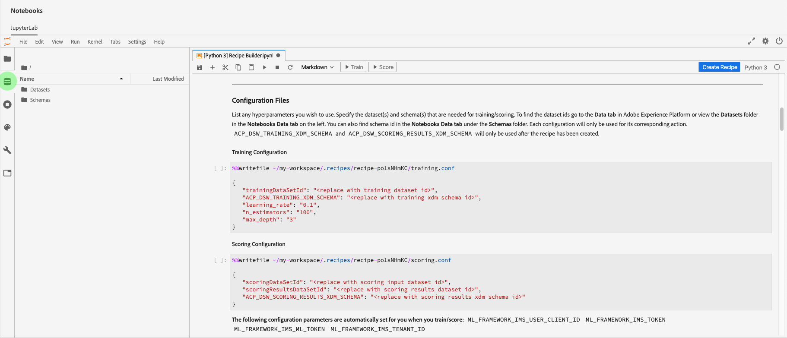

# Jupyterノートブックを使用してレシピを作成する

このチュートリアルでは、2つの主なセクションについて説明します。 まず、JupterLabノートブック内のテンプレートを使用して機械学習モデルを作成します。 次に、JupyterLab内でノートブックをレシピワークフローに合わせて使用し、Data Science Workspace内でレシピを作成します。

## 導入された概念：

- **レシピ：** レシピは、アドビのモデル仕様を表す用語で、トレーニングを受けたモデルを作成して実行し、特定のビジネス上の問題の解決に役立つ、特定の機械学習、AIアルゴリズム、アルゴリズムのアンサンブル、処理ロジック、設定を表す最上位コンテナです。
- **モデル：** モデルは、機械学習手法のインスタンスで、過去のデータと構成を使用してトレーニングを受け、ビジネスの使用事例に対して解決します。
- **トレーニング：** トレーニングは、ラベル付きのデータからパターンや洞察を学ぶプロセスです。
- **スコア：** スコアリングは、トレーニングを受けたモデルを使用して、データからインサイトを生成するプロセスです。

## JupyterLabノートブック環境の使用を開始する

レシピを一から作成するには、Data Science Workspace内で行います。 開始するには、 [Adobe Experience Platformに移動し](https://platform.adobe.com) 、左側の **[!UICONTROL Notebooks]** タブをクリックします。 JupterLabランチャーからレシピビルダテンプレートを選択して、新しいノートブックを作成します。

Recipe Builderノートブックを使用すると、ノートブック内でトレーニングとスコアリングの実行を実行できます。 これにより、トレーニングデータとスコアリングデータの実験を実行する間に、その `train()` 方法と `score()` 方法を柔軟に変更できます。 トレーニングとスコアの出力結果に満足したら、Data Science Workspaceで使用するレシピを作成し、Recipe Builderノートブックに組み込まれているレシピ機能を使用します。

>[!NOTE]
>Recipe Builderノートブックは、すべてのファイル形式での作業をサポートしていますが、現在のところ、レシピの作成機能はPythonのみをサポートしています。


ランチャーからRecipe Builderノートブックをクリックすると、タブにノートブックが開きます。 ノートブックで使用されるテンプレートは、Python小売売上予測レシピで、 [このパブリック・リポジトリにもあります。](https://github.com/adobe/experience-platform-dsw-reference/tree/master/recipes/python/retail/)

ツールバーには、とという3つの追加のアクションがあり **[!UICONTROL Train]**&#x200B;ま **[!UICONTROL Score]** す **[!UICONTROL Create Recipe]**。 これらのアイコンは、Recipe Builderノートブックにのみ表示されます。 これらの操作に関する詳細は、ノートブックでレシピ [を作成した後のトレーニングとスコアリングのセクション](#training-and-scoring) で説明します。


## レシピファイルに編集を加える

レシピファイルを編集するには、ファイルパスに対応するジュピター内のセルに移動します。 例えば、に変更を加える場合は、を探 `evaluator.py`し `%%writefile demo-recipe/evaluator.py`ます。

開始がセルに必要な変更を加えた後、セルを実行します。 セルの内容がに書き込まれ `%%writefile filename.py``filename.py`ます。 各ファイルのセルを手動で実行し、変更を加える必要があります。

>[!NOTE] 該当する場合は、セルを手動で実行する必要があります。

## Recipe Builderノートブックの概要

JupyterLabノートブック環境の基本を理解したら、機械学習モデルのレシピを構成するファイルを調べ始めます。 ここで説明するファイルは次のとおりです。

- [要件ファイル](#requirements-file)
- [設定ファイル](#configuration-files)
- [トレーニングデータローダー](#training-data-loader)
- [スコアリングデータローダー](#scoring-data-loader)
- [パイプラインファイル](#pipeline-file)
- [エバリュエーターファイル](#evaluator-file)
- [Data Saverファイル](#data-saver-file)

### 要件ファイル {#requirements-file}

要件ファイルは、レシピで使用する追加のライブラリを宣言するために使用します。 依存関係がある場合は、バージョン番号を指定できます。 その他のライブラリを探すには、https://anaconda.orgにアクセスしてください。 既に使用されているメインライブラリのリストには、次のものがあります。

```JSON
python=3.5.2
scikit-learn
pandas
numpy
data_access_sdk_python
```

>[!NOTE]
>追加するライブラリまたは特定のバージョンは、上記のライブラリと互換性がない場合があります。

### 設定ファイル {#configuration-files}

設定ファイル `training.conf``scoring.conf`と、は、トレーニングとスコアリングに使用するデータセットを指定すると共に、ハイパーパラメーターを追加するために使用します。 トレーニングとスコアリングの設定は別々です。

トレーニングとスコアリングを実行する前に、ユーザーは次の変数を入力する必要があります。
- `trainingDataSetId`
- `ACP_DSW_TRAINING_XDM_SCHEMA`
- `scoringDataSetId`
- `ACP_DSW_SCORING_RESULTS_XDM_SCHEMA`
- `scoringResultsDataSetId`

データセットIDとスキーマIDを確認するには、左側のナビゲーションバーにあるノートブック内の「データ」タブ（フォルダーアイコンの下）に移動します。



同じ情報は、 [Adobe Experience Platform](https://platform.adobe.com/) の「 **[スキーマ](https://platform.adobe.com/schema)**」タブと「**[データセット](https://platform.adobe.com/dataset/overview)** 」タブにもあります。

デフォルトでは、データにアクセスする際に次の設定パラメーターが設定されます。

- `ML_FRAMEWORK_IMS_USER_CLIENT_ID`
- `ML_FRAMEWORK_IMS_TOKEN`
- `ML_FRAMEWORK_IMS_ML_TOKEN`
- `ML_FRAMEWORK_IMS_TENANT_ID`

## トレーニングデータローダー {#training-data-loader}

トレーニングデータローダーの目的は、機械学習モデルの作成に使用するデータをインスタンス化することです。 通常、トレーニングデータローダーが実行するタスクは2つあります。
- プラットフォームからのデータの読み込み
- データの準備と機能のエンジニアリング

以下の2つのセクションでは、データの読み込みとデータの準備について詳しく説明します。

### データの読み込み {#loading-data}

この手順では、 [pandasのデータフレームを使用し](https://pandas.pydata.org/pandas-docs/stable/generated/pandas.DataFrame.html)ます。 データは、プラットフォームSDK(`platform_sdk`)を使用してAdobe Experience Platformのファイルから、またはパンダや関数を使用して外部ソースから読み込むこ `read_csv()` とができ `read_json()` ます。

- [プラットフォームSDK](#platform-sdk)
- [外部ソース](#external-sources)

>[!NOTE]
>Recipe Builderノートブックでは、データは `platform_sdk` Data Loaderを使用して読み込まれます。

### プラットフォームSDK {#platform-sdk}

Data Loaderの使用に関する詳しいチュートリアルについては、『 `platform_sdk` Platform SDK [](../authoring/platform-sdk.md)』ガイドを参照してください。 このチュートリアルでは、認証の構築、データの基本的な読み取り、およびデータの基本的な書き込みに関する情報を提供します。

### 外部ソース {#external-sources}

この節では、JSONまたはCSVファイルをpandasオブジェクトに読み込む方法について説明します。 pandasライブラリの公式ドキュメントは、次を参照してください。
- [read_csv](https://pandas.pydata.org/pandas-docs/stable/generated/pandas.read_csv.html)
- [read_json](https://pandas.pydata.org/pandas-docs/stable/generated/pandas.read_json.html)

まず、CSVファイルの読み込み例を示します。 引数はCSVファイルへのパスです。 `data` この変数は、 `configProperties` 前の節のからインポートされました [](#configuration-files)。

```PYTHON
df = pd.read_csv(data)
```

JSONファイルから読み込むこともできます。 引数はCSVファイルへのパスです。 `data` この変数は、 `configProperties` 前の節のからインポートされました [](#configuration-files)。

```PYTHON
df = pd.read_json(data)
```

これで、データはデータフレームオブジェクトになり、 [次のセクションで分析および操作できます](#data-preparation-and-feature-engineering)。

### From Data Access SDK（非推奨）

>[!CAUTION]
> `data_access_sdk_python` の使用が推奨されなくなりました。 [data loaderの使用に関するガイドについては、「Convert Data Access code to Platform SDK](../authoring/platform-sdk.md)`platform_sdk` 」を参照してください。

ユーザーは、データアクセスSDKを使用してデータを読み込むことができます。 ライブラリは、ページの上部に次の行を含めて読み込むことができます。

`from data_access_sdk_python.reader import DataSetReader`

次に、この `load()` 方法を使用して、設定( `trainingDataSetId` )ファイルに設定されたとおりに、トレーニングデータセット`recipe.conf`をに取り込みます。

```PYTHON
prodreader = DataSetReader(client_id=configProperties['ML_FRAMEWORK_IMS_USER_CLIENT_ID'],
                           user_token=configProperties['ML_FRAMEWORK_IMS_TOKEN'],
                           service_token=configProperties['ML_FRAMEWORK_IMS_ML_TOKEN'])

df = prodreader.load(data_set_id=configProperties['trainingDataSetId'],
                     ims_org=configProperties['ML_FRAMEWORK_IMS_TENANT_ID'])
```

>[!NOTE]
>「 [設定ファイル」セクションで説明したように](#configuration-files)、Experience Platformのデータにアクセスする場合は、次の設定パラメーターが設定されます。
> - `ML_FRAMEWORK_IMS_USER_CLIENT_ID`
> - `ML_FRAMEWORK_IMS_TOKEN`
> - `ML_FRAMEWORK_IMS_ML_TOKEN`
> - `ML_FRAMEWORK_IMS_TENANT_ID`


データが揃ったら、データの準備と機能のエンジニアリングから始めます。

### データの準備と機能のエンジニアリング {#data-preparation-and-feature-engineering}

データが読み込まれた後、データは準備を行い、データはデータセット `train` とデータセットに分割され `val` ます。 サンプルコードを次に示します。

```PYTHON
#########################################
# Data Preparation/Feature Engineering
#########################################
dataframe.date = pd.to_datetime(dataframe.date)
dataframe['week'] = dataframe.date.dt.week
dataframe['year'] = dataframe.date.dt.year

dataframe = pd.concat([dataframe, pd.get_dummies(dataframe['storeType'])], axis=1)
dataframe.drop('storeType', axis=1, inplace=True)
dataframe['isHoliday'] = dataframe['isHoliday'].astype(int)

dataframe['weeklySalesAhead'] = dataframe.shift(-45)['weeklySales']
dataframe['weeklySalesLag'] = dataframe.shift(45)['weeklySales']
dataframe['weeklySalesDiff'] = (dataframe['weeklySales'] - dataframe['weeklySalesLag']) / dataframe['weeklySalesLag']
dataframe.dropna(0, inplace=True)

dataframe = dataframe.set_index(dataframe.date)
dataframe.drop('date', axis=1, inplace=True) 
```

この例では、元のデータセットに対して次の5つの処理が行われています。
- 列 `week``year` の追加
- インジケーター変数 `storeType` に変換する
- 数値変数 `isHoliday` に変換する
- 将来 `weeklySales` と過去の売り上げ値を得るオフセット
- データを日付別に分割し、データセット `train``val` に分割

最初に、 `week` および `year` 列が作成され、元の `date` 列がPython [datetimeに変換されます](https://pandas.pydata.org/pandas-docs/stable/generated/pandas.to_datetime.html)。 週と年の値は、datetimeオブジェクトから抽出されます。

次に、 `storeType` は3種類の店舗タイプ(`A`、 `B`、および `C`)を表す3つの列に変換されます。 それぞれにboolean値が含まれ、trueが設定さ `storeType` れます。 列が削除さ `storeType` れます。

同様に、 `weeklySales``isHoliday` ブール値を数値表現（1または0）に変更します。

このデータは、とデータセット `train` に分割され `val` ます。

この `load()` 関数は、出力として、およ `train` び `val` データセットと共に完了する必要があります。

### スコアリングデータローダー {#scoring-data-loader}

スコアリング用のデータを読み込む手順は、 `split()` 関数内のトレーニングデータを読み込む手順と似ています。 Data Access SDKを使用して、フ `scoringDataSetId``recipe.conf` ァイル内のからデータを読み込みます。

```PYTHON
def load(configProperties):

    print("Scoring Data Load Start")

    #########################################
    # Load Data
    #########################################
    prodreader = DataSetReader(client_id=configProperties['ML_FRAMEWORK_IMS_USER_CLIENT_ID'],
                               user_token=configProperties['ML_FRAMEWORK_IMS_TOKEN'],
                               service_token=configProperties['ML_FRAMEWORK_IMS_ML_TOKEN'])

    df = prodreader.load(data_set_id=configProperties['scoringDataSetId'],
                         ims_org=configProperties['ML_FRAMEWORK_IMS_TENANT_ID'])
```

データをロードした後、データの準備とフィーチャエンジニアリングが行われます。

```PYTHON
#########################################
# Data Preparation/Feature Engineering
#########################################
df.date = pd.to_datetime(df.date)
df['week'] = df.date.dt.week
df['year'] = df.date.dt.year

df = pd.concat([df, pd.get_dummies(df['storeType'])], axis=1)
df.drop('storeType', axis=1, inplace=True)
df['isHoliday'] = df['isHoliday'].astype(int)

df['weeklySalesAhead'] = df.shift(-45)['weeklySales']
df['weeklySalesLag'] = df.shift(45)['weeklySales']
df['weeklySalesDiff'] = (df['weeklySales'] - df['weeklySalesLag']) / df['weeklySalesLag']
df.dropna(0, inplace=True)

df = df.set_index(df.date)
df.drop('date', axis=1, inplace=True)

print("Scoring Data Load Finish")

return df
```

モデルの目的は将来の週別売上高を予測することなので、モデルの予測のパフォーマンスを評価するために使用するスコアリングデータセットを作成する必要があります。

このRecipe Builderノートブックは、7日前の週別販売額を相殺することによってこれを実現します。 毎週45個のストアの測定値があるので、45個のデータセットを `weeklySales` 先にという新しい列に移動でき `weeklySalesAhead`ます。

```PYTHON
df['weeklySalesAhead'] = df.shift(-45)['weeklySales']
```

同様に、45シフトバックして列を作成す `weeklySalesLag` ることもできます。 これを使用して、週別売上高の差異を計算し、列に格納することもでき `weeklySalesDiff`ます。

```PYTHON
df['weeklySalesLag'] = df.shift(45)['weeklySales']
df['weeklySalesDiff'] = (df['weeklySales'] - df['weeklySalesLag']) / df['weeklySalesLag']
```

データポイント45のデータセットを前方にオフセットし、45のデータセットを後方にオフセットして新しい列を作成するので、最初と最後の45のデータポイントにはNaN値が割り当てられます。 `weeklySales` NaN値を持つすべての行を削除する `df.dropna()` 関数を使用すると、データセットからこれらのポイントを削除できます。

```PYTHON
df.dropna(0, inplace=True)
```

スコアリングデータローダーの `load()` 関数は、スコアリングデータセットを出力として完成する必要があります。

### パイプラインファイル {#pipeline-file}

この `pipeline.py` ファイルには、トレーニングとスコアリングのロジックが含まれます。

### トレーニング {#training}

トレーニングの目的は、トレーニングデータセットの機能とラベルを使用してモデルを作成することです。

>[!NOTE]\
>_機能_ は、機械学習モデルが __&#x200B;ラベルを予測するために使用する入力変数を参照します。

この `train()` 機能には、トレーニングモデルを含め、トレーニングされたモデルを返す必要があります。 様々なモデルの例は、『 [scikit-learnユーザーガイド』ドキュメントに記載されています](https://scikit-learn.org/stable/user_guide.html)。

トレーニングモデルを選択したら、xとyのトレーニングデータセットをモデルに合わせ、トレーニングモデルが返されます。 これを示す例を次に示します。

```PYTHON
def train(configProperties, data):

    print("Train Start")

    #########################################
    # Extract fields from configProperties
    #########################################
    learning_rate = float(configProperties['learning_rate'])
    n_estimators = int(configProperties['n_estimators'])
    max_depth = int(configProperties['max_depth'])


    #########################################
    # Fit model
    #########################################
    X_train = data.drop('weeklySalesAhead', axis=1).values
    y_train = data['weeklySalesAhead'].values

    seed = 1234
    model = GradientBoostingRegressor(learning_rate=learning_rate,
                                      n_estimators=n_estimators,
                                      max_depth=max_depth,
                                      random_state=seed)

    model.fit(X_train, y_train)

    print("Train Complete")

    return model
```

アプリケーションに応じて、関数に引数があることに注意してくだ `GradientBoostingRegressor()` さい。 `xTrainingDataset` には、トレーニングに使用する機能を含める必要があります。一方、ラベル `yTrainingDataset` は含める必要があります。

### スコア {#scoring}

この `score()` 関数は、スコアリングアルゴリズムを含み、モデルのパフォーマンスがどの程度成功したかを示す測定値を返す必要があります。 この `score()` 関数は、スコアリングデータセットラベルとトレーニングを受けたモデルを使用して、予測された特徴のセットを生成します。 これらの予測値は、スコアリングデータセットの実際の特徴と比較されます。 この例では、この `score()` 関数はトレーニングを受けたモデルを使用して、スコアリングデータセットのラベルを使用して特徴を予測します。 予測されたフィーチャが返されます。

```PYTHON
def score(configProperties, data, model):

    print("Score Start")

    X_test = data.drop('weeklySalesAhead', axis=1).values
    y_test = data['weeklySalesAhead'].values
    y_pred = model.predict(X_test)

    data['prediction'] = y_pred
    data = data[['store', 'prediction']].reset_index()
    data['date'] = data['date'].astype(str)

    print("Score Complete")

    return data
```

### エバリュエーターファイル {#evaluator-file}

この `evaluator.py` ファイルには、トレーニングを受けたレシピの評価方法とトレーニングデータの分割方法に関するロジックが含まれています。 小売売上の例では、トレーニングデータの読み込みと準備のロジックが含まれます。 以下の2つの項目を見てみましょう。

### データセットの分割 {#split-the-dataset}

トレーニングのデータ準備段階では、トレーニングとテストに使用するデータセットを分割する必要があります。 この `val` データは、トレーニング後にモデルを評価する際に暗黙的に使用されます。 この処理はスコアリングとは別です。

この節では、最初にノートブックにデータを読み込み、次にデータセット内の無関係な列を削除してデータを消去する `split()` 関数を示します。 ここから、データ内の既存の生のフィーチャから関連機能を追加作成するプロセスである機能エンジニアリングを実行できます。 このプロセスの例を以下に説明と共に示します。

この `split()` 機能を次に示します。 引数に指定されたデータフレームは、返される変数 `train` と `val` 変数に分割されます。

```PYTHON
def split(self, configProperties={}, dataframe=None):
    train_start = '2010-02-12'
    train_end = '2012-01-27'
    val_start = '2012-02-03'
    train = dataframe[train_start:train_end]
    val = dataframe[val_start:]

    return train, val
```

### トレーニングを受けたモデルの評価 {#evaluate-the-trained-model}

この `evaluate()` 機能は、モデルのトレーニングが終了した後に実行され、モデルのパフォーマンスの成功度を示す指標が返されます。 この `evaluate()` 関数は、テストデータセットラベルとトレーニングを受けたモデルを使用して、一連の機能を予測します。 これらの予測値は、テストデータセットの実際の機能と比較されます。 一般的なスコアリングアルゴリズムには、次のものがあります。
- [平均絶対誤差率(MAPE)](https://en.wikipedia.org/wiki/Mean_absolute_percentage_error)
- [平均絶対誤差(MAE)](https://en.wikipedia.org/wiki/Mean_absolute_error)
- [Root-mean-squareエラー(RMSE)](https://en.wikipedia.org/wiki/Root-mean-square_deviation)


小売売上サンプルの `evaluate()` 関数は次のとおりです。

```PYTHON
def evaluate(self, data=[], model={}, configProperties={}):
    print ("Evaluation evaluate triggered")
    val = data.drop('weeklySalesAhead', axis=1)
    y_pred = model.predict(val)
    y_actual = data['weeklySalesAhead'].values
    mape = np.mean(np.abs((y_actual - y_pred) / y_actual))
    mae = np.mean(np.abs(y_actual - y_pred))
    rmse = np.sqrt(np.mean((y_actual - y_pred) ** 2))

    metric = [{"name": "MAPE", "value": mape, "valueType": "double"},
                {"name": "MAE", "value": mae, "valueType": "double"},
                {"name": "RMSE", "value": rmse, "valueType": "double"}]

    return metric
```

この関数は、評価指標の配列を含む `metric` オブジェクトを返します。 これらの指標は、トレーニングを受けたモデルのパフォーマンスを評価するために使用されます。

### Data Saverファイル {#data-saver-file}

スコアリングのテスト中に予測を保存する `datasaver.py``save()` 関数がファイルに含まれています。 この `save()` 関数は、予測を受け取り、エクスペリエンスプラットフォームカタログAPIを使用して、 `scoringResultsDataSetId``scoring.conf` ファイルで指定したデータにデータを書き込みます。

小売売上のサンプルレシピの例を次に示します。 ライブラリを使用してプラットフォームにデータを書き込むことに注意して `DataSetWriter` ください。

```PYTHON
from data_access_sdk_python.writer import DataSetWriter

def save(configProperties, prediction):
    print("Datasaver Start")
    print("Setting up Writer")

    catalog_url = "https://platform.adobe.io/data/foundation/catalog"
    ingestion_url = "https://platform.adobe.io/data/foundation/import"

    writer = DataSetWriter(catalog_url=catalog_url,
                           ingestion_url=ingestion_url,
                           client_id=configProperties['ML_FRAMEWORK_IMS_USER_CLIENT_ID'],
                           user_token=configProperties['ML_FRAMEWORK_IMS_TOKEN'],
                           service_token=configProperties['ML_FRAMEWORK_IMS_ML_TOKEN'])

    print("Writer Configured")

    writer.write(data_set_id=configProperties['scoringResultsDataSetId'],
                 dataframe=prediction,
                 ims_org=configProperties['ML_FRAMEWORK_IMS_TENANT_ID'])

    print("Write Done")
    print("Datasaver Finish")
    print(prediction)
```

## トレーニングとスコア {#training-and-scoring}

ノートブックの変更が完了し、レシピのトレーニングを行う場合は、バーの上部にある関連ボタンをクリックして、セル内にトレーニングの実施を作成できます。 ボタンをクリックすると、トレーニングスクリプトのコマンドと出力のログがノートブックの( `evaluator.py` セルの下に)表示されます。 Condaは、最初にすべての依存関係をインストールし、その後トレーニングを開始します。

スコアリングを実行する前に、少なくとも1回はトレーニングを実行する必要があります。 ボタンをクリックすると、トレーニング中に生成されたトレーニングモデルにスコアが付けられます。 **[!UICONTROL Run Scoring]** スコアリングスクリプトが下に表示され `datasaver.py`ます。

デバッグの目的で、非表示の出力を確認する場合は、出力セル `debug` の末尾にを追加し、再実行します。

## レシピの作成 {#create-recipe}

レシピの編集が完了し、トレーニング/スコアリングの出力に満足したら、右上のナビゲーションを押して、ノートブックからレシピ **[!UICONTROL Create Recipe]** を作成できます。


ボタンを押すと、レシピ名の入力を求められます。 この名前は、プラットフォームで作成された実際のレシピを表します。


押すと、 **[!UICONTROL Ok]** Adobe Experience Platform [の新しいレシピに移動できます](https://platform.adobe.com/)。 ボタンをクリックする **[!UICONTROL View Recipes]****[!UICONTROL Recipes]** と、「 **[!UICONTROL ML Models]**


処理が完了すると、レシピは次のようになります。


>[!CAUTION]
> - ファイルのセルを削除しない
> - ファイルのセルの先頭の `%%writefile` 行を編集しない
> - 異なるノートブックに同時にレシピを作成しない


## 次の手順 {#next-steps}

このチュートリアルを完了すると、Recipe Builderノートブックで機械学習モデルの作成方法を学習できます。 また、ノートブック内でノートブックをレシピワークフローに合わせて使用し、Data Science Workspace内でレシピを作成する方法も学習しました。

Data Science Workspace内のリソースの使い方の学習を続けるには、「Data Science Workspace recipes and models」ドロップダウンを参照してください。

## その他のリソース {#additional-resources}

次のビデオは、モデルの作成とデプロイに関する理解を深めるために設計されています。

>[!VIDEO](https://video.tv.adobe.com/v/30575?quality=12&enable10seconds=on&speedcontrol=on)


