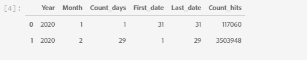

# 調査データ分析 (EDA) ノートブックを使用した予測モデルの Web ベースのデータの調査

調査データ分析 (EDA) ノートブックは、データのパターンの検出、データの整合性の確認、および予測モデルに関連するデータの要約を支援するように設計されています。

EDA ノートブックの例は、Web ベースのデータを考慮して最適化され、2 つの部分で構成されています。 第 1 部では、クエリサービスを使用して、トレンドとデータのスナップショットを表示します。 次に、探索的なデータ分析を念頭に置いて、データはプロファイルと訪問者のレベルで集計されます。

第 2 部は、Python ライブラリを使用して集計データに対して記述的分析を実行することから始めます。 このノートブックは、ヒストグラム、散布グラフ、ボックスプロット、相関行列などのビジュアライゼーションを示し、目標の予測に役立つと思われる機能を判断するために使用される実用的なインサイトを導き出します。

## はじめに

このガイドを読む前に、 [[!DNL JupyterLab] ユーザーガイド](./overview.md) ～の高度な紹介のために [!DNL JupyterLab] と、Data Science Workspace 内での役割を表します。 さらに、独自のデータを使用している場合は、 [のデータアクセス [!DNL Jupyterlab] notebooks](./access-notebook-data.md). このガイドでは、ノートブックのデータ制限に関する重要な情報を説明します。

このノートブックでは、Analytics Analysis WorkspaceにあるAdobe Analytics Experience Events データの形式で midvalues データセットを使用します。 EDA ノートブックを使用するには、次の値を持つデータテーブルを定義する必要があります `target_table` および `target_table_id`. 任意の中間値データセットを使用できます。

これらの値を見つけるには、 [python でデータセットに書き込む](./access-notebook-data.md#write-python) JupyterLab データアクセスガイドの「 」の節を参照してください。 データセット名 (`target_table`) は、データセットディレクトリにあります。 データセットを右クリックしてノートブックにデータを調査または書き込むと、データセット ID(`target_table_id`) は、実行可能コードエントリに指定されます。

## データ検出

この節では、「ユーザーアクティビティ別の上位 10 都市」や「閲覧された製品の上位 10 都市」など、トレンドの表示に使用する設定手順とクエリ例を示します。

### ライブラリの設定

JupyterLab は複数のライブラリをサポートしています。 次のコードをコードセルに貼り付けて実行すると、この例で使用する必要なすべてのパッケージを収集してインストールできます。 独自のデータ分析には、この例以外の追加または代替パッケージを使用できます。 サポートされているパッケージの一覧を表示するには、コピーして貼り付けます。 `!pip list --format=columns` を新しいセルに追加します。

```python
!pip install colorama
import chart_studio.plotly as py
import plotly.graph_objs as go
from plotly.offline import iplot
from scipy import stats
import numpy as np
import warnings
warnings.filterwarnings('ignore')
from scipy.stats import pearsonr
import matplotlib.pyplot as plt
from scipy.stats import pearsonr
import pandas as pd
import math
import re
import seaborn as sns
from datetime import datetime
import colorama
from colorama import Fore, Style
pd.set_option('display.max_columns', None)
pd.set_option('display.max_rows', None)
pd.set_option('display.width', 1000)
pd.set_option('display.expand_frame_repr', False)
pd.set_option('display.max_colwidth', -1)
```

### Adobe Experience Platformに接続 [!DNL Query Service]

[!DNL JupyterLab] Platform 上では、 [!DNL Python] を通じてデータにアクセスするノートブック [クエリサービス](https://docs.adobe.com/content/help/ja-JP/experience-platform/query/home.html). を通じてデータにアクセスする [!DNL Query Service] は、実行時間が優れているので、大規模なデータセットの処理に役立ちます。 を使用してデータをクエリする場合は、 [!DNL Query Service] には、10 分の処理時間制限があります。

事前準備 [!DNL Query Service] in [!DNL JupyterLab]を使用する場合、 [[!DNL Query Service] SQL 構文](https://docs.adobe.com/content/help/ja-JP/experience-platform/query/home.html#!api-specification/markdown/narrative/technical_overview/query-service/sql/syntax.md).

JupyterLab のクエリサービスを利用するには、まず作業中の Python ノートブックとクエリサービスの間の接続を作成する必要があります。これは、次のセルを実行することで実現できます。

```python
qs_connect()
```

### 調査する中間値データセットを定義する

データのクエリと調査を開始するには、中間値のデータセットテーブルを指定する必要があります。 をコピーして置き換えます。 `table_name` および `table_id` の値と独自のデータテーブル値

```python
target_table = "table_name"
target_table_id = "table_id"
```

完了すると、このセルは次の例のようになります。

```python
target_table = "cross_industry_demo_midvalues"
target_table_id = "5f7c40ef488de5194ba0157a"
```

### 使用可能な日付のデータセットを調べる

以下に示すセルを使用して、テーブルでカバーされる日付範囲を表示できます。 日数、最初の日付、最終日付を調べる目的は、さらに分析する日付範囲の選択を支援することです。

```python
%%read_sql -c QS_CONNECTION
SELECT distinct Year(timestamp) as Year, Month(timestamp) as Month, count(distinct DAY(timestamp)) as Count_days, min(DAY(timestamp)) as First_date, max(DAY(timestamp)) as Last_date, count(timestamp) as Count_hits
from {target_table}
group by Month(timestamp), Year(timestamp)
order by Year, Month;
```

セルを実行すると、次の出力が生成されます。



### データセット検出の日付を設定する

データセット検出に使用可能な日付を決定したら、以下のパラメーターを更新する必要があります。 このセルで設定された日付は、クエリの形式でのデータ検出にのみ使用されます。 日付は、このガイドの後半で、調査的なデータ分析に適した範囲に再び更新されます。

```python
target_year = "2020" ## The target year
target_month = "02" ## The target month
target_day = "(01,02,03)" ## The target days
```

### データセットの検出

すべてのパラメーターを設定したら、を開始します。 [!DNL Query Service]を読み込み、日付範囲を持っている場合は、データ行の読み取りを開始する準備が整いました。 読み取る行数を制限する必要があります。

```python
from platform_sdk.dataset_reader import DatasetReader
from datetime import date
dataset_reader = DatasetReader(PLATFORM_SDK_CLIENT_CONTEXT, dataset_id=target_table_id)
# If you do not see any data or would like to expand the default date range, change the following query
Table = dataset_reader.limit(5).read()
```

データセット内の使用可能な列数を表示するには、次のセルを使用します。

```python
print("\nNumber of columns:",len(Table.columns))
```

データセットの行を表示するには、次のセルを使用します。 この例では、行数は 5 行に制限されています。

```python
Table.head(5)
```


データセットに含まれるデータを把握したら、データセットをさらに分類すると役に立つ場合があります。 この例では、各列の列名とデータ型が一覧表示され、出力を使用してデータ型が正しいかどうかを確認します。

```python
ColumnNames_Types = pd.DataFrame(Table.dtypes)
ColumnNames_Types = ColumnNames_Types.reset_index()
ColumnNames_Types.columns = ["Column_Name", "Data_Type"]
ColumnNames_Types
```


### データセットのトレンド調査

次の節では、データのトレンドとパターンを調べるために使用する 4 つのクエリ例を示します。 以下に示す例は完全なものではありませんが、よく使用される機能の一部を示しています。

**指定した日の 1 時間ごとのアクティビティ数**

このクエリは、1 日を通してのアクション数とクリック数を分析します。 出力は、1 日の各時間のアクティビティ数に関する指標を含むテーブルの形式で表されます。

```sql
%%read_sql query_2_df -c QS_CONNECTION

SELECT Substring(timestamp, 12, 2)                        AS Hour, 
       Count(enduserids._experience.aaid.id) AS Count 
FROM   {target_table}
WHERE  Year(timestamp) = {target_year} 
       AND Month(timestamp) = {target_month}  
       AND Day(timestamp) in {target_day}
GROUP  BY Hour
ORDER  BY Hour;
```


クエリの動作を確認した後、データを一変量のプロットヒストグラムに表示して、視覚的にわかりやすくすることができます。

```python
trace = go.Bar(
    x = query_2_df['Hour'],
    y = query_2_df['Count'],
    name = "Activity Count"
)

layout = go.Layout(
    title = 'Activity Count by Hour of Day',
    width = 1200,
    height = 600,
    xaxis = dict(title = 'Hour of Day'),
    yaxis = dict(title = 'Count')
)

fig = go.Figure(data = [trace], layout = layout)
iplot(fig)
```


**特定の日に閲覧された上位 10 ページ**

このクエリは、特定の日に最も多く閲覧されたページを分析します。 出力は、ページ名とページビュー数の指標を含むテーブルの形式で表されます。

```sql
%%read_sql query_4_df -c QS_CONNECTION

SELECT web.webpagedetails.name                 AS Page_Name, 
       Sum(web.webpagedetails.pageviews.value) AS Page_Views 
FROM   {target_table}
WHERE  Year(timestamp) = {target_year}
       AND Month(timestamp) = {target_month}
       AND Day(timestamp) in {target_day}
GROUP  BY web.webpagedetails.name 
ORDER  BY page_views DESC 
LIMIT  10;
```

クエリの動作を確認した後、データを一変量のプロットヒストグラムに表示して、視覚的にわかりやすくすることができます。

```python
trace = go.Bar(
    x = query_4_df['Page_Name'],
    y = query_4_df['Page_Views'],
    name = "Page Views"
)

layout = go.Layout(
    title = 'Top Ten Viewed Pages For a Given Day',
    width = 1000,
    height = 600,
    xaxis = dict(title = 'Page_Name'),
    yaxis = dict(title = 'Page_Views')
)

fig = go.Figure(data = [trace], layout = layout)
iplot(fig)
```


**ユーザーアクティビティ別にグループ化された上位 10 都市**

このクエリは、データの元となる都市を分析します。

```sql
%%read_sql query_6_df -c QS_CONNECTION

SELECT concat(placeContext.geo.stateProvince, ' - ', placeContext.geo.city) AS state_city, 
       Count(timestamp)                                                     AS Count
FROM   {target_table}
WHERE  Year(timestamp) = {target_year}
       AND Month(timestamp) = {target_month}
       AND Day(timestamp) in {target_day}
GROUP  BY state_city
ORDER  BY Count DESC
LIMIT  10;
```

クエリの動作を確認した後、データを一変量のプロットヒストグラムに表示して、視覚的にわかりやすくすることができます。

```python
trace = go.Bar(
    x = query_6_df['state_city'],
    y = query_6_df['Count'],
    name = "Activity by City"
)

layout = go.Layout(
    title = 'Top Ten Cities by User Activity',
    width = 1200,
    height = 600,
    xaxis = dict(title = 'City'),
    yaxis = dict(title = 'Count')
)

fig = go.Figure(data = [trace], layout = layout)
iplot(fig)
```


**閲覧された製品の上位 10 件**

このクエリは、閲覧された上位 10 件の製品のリストを表示します。 次の例では、 `Explode()` 関数は、 `productlistitems` オブジェクトを独自の行に追加します。 これにより、ネストされたクエリを実行して、異なる SKU の製品ビューを集計できます。

```sql
%%read_sql query_7_df -c QS_CONNECTION

SELECT Product_List_Items.sku AS Product_SKU,
       Sum(Product_Views) AS Total_Product_Views
FROM  (SELECT Explode(productlistitems) AS Product_List_Items, 
              commerce.productviews.value   AS Product_Views 
       FROM   {target_table}
       WHERE  Year(timestamp) = {target_year}
              AND Month(timestamp) = {target_month}
              AND Day(timestamp) in {target_day}
              AND commerce.productviews.value IS NOT NULL) 
GROUP BY Product_SKU 
ORDER BY Total_Product_Views DESC
LIMIT  10;
```

クエリの動作を確認した後、データを一変量のプロットヒストグラムに表示して、視覚的にわかりやすくすることができます。

```python
trace = go.Bar(
    x = "SKU-" + query_7_df['Product_SKU'],
    y = query_7_df['Total_Product_Views'],
    name = "Product View"
)

layout = go.Layout(
    title = 'Top Ten Viewed Products',
    width = 1200,
    height = 600,
    xaxis = dict(title = 'SKU'),
    yaxis = dict(title = 'Product View Count')
)

fig = go.Figure(data = [trace], layout = layout)
iplot(fig)
```


データの傾向やパターンを調べたら、目標を予測するためにどの機能を構築したいかを適切に把握する必要があります。 テーブルをスキムスルーすると、各データ属性の形式、明らかな誤った表現、値内の大きな外れ値をすばやく強調表示し、属性間の関係を調べる候補を提案し始めることができます。

## 探索的データ分析

探索的データ分析は、データに対する理解を深め、モデリングの基礎として使用できる、説得力のある質問に対する直感を構築するために使用します。

データ検出手順が完了したら、イベント、市区町村またはユーザー ID レベルの集計を使用して、イベントレベルのデータを調べ、1 日のトレンドを確認します。 このデータは重要ですが、全体像を示すものではありません。 Web サイトでの購入を促す要因がまだわかっていません。

これを理解するには、プロファイル/訪問者レベルでデータを集計し、購入目標を定義して、相関関係、ボックスグラフ、散布グラフなどの統計的概念を適用する必要があります。 これらの方法は、定義した予測ウィンドウで、購入者と非購入者のアクティビティのパターンを比較するために使用されます。

この節では、次の機能を作成および調査します。

- `COUNT_UNIQUE_PRODUCTS_PURCHASED`:購入した個別製品の数。
- `COUNT_CHECK_OUTS`:チェックアウト数。
- `COUNT_PURCHASES`:購入の数。
- `COUNT_INSTANCE_PRODUCTADDS`:製品追加インスタンスの数。
- `NUMBER_VISITS`:訪問の数。
- `COUNT_PAID_SEARCHES`:有料検索の数。
- `DAYS_SINCE_VISIT`:前回の訪問からの経過日数。
- `TOTAL_ORDER_REVENUE`:合計注文売上高。
- `DAYS_SINCE_PURCHASE`:前回の購入からの日数。
- `AVG_GAP_BETWEEN_ORDERS_DAYS`:購入間の平均ギャップ（日数）。
- `STATE_CITY`:都道府県と市区町村が含まれます。

データの集計を続行する前に、調査データ分析で使用する予測変数のパラメーターを定義する必要があります。 つまり、データサイエンスモデルから何を求めているのですか？ 一般的なパラメーターには、目標、予測期間、分析期間が含まれます。

EDA ノートブックを使用している場合は、先に進む前に以下の値を置き換える必要があります。

```python
goal = "commerce.`order`.purchaseID" #### prediction variable
goal_column_type = "numerical" #### choose either "categorical" or "numerical"
prediction_window_day_start = "2020-01-01" #### YYYY-MM-DD
prediction_window_day_end = "2020-01-31" #### YYYY-MM-DD
analysis_period_day_start = "2020-02-01" #### YYYY-MM-DD
analysis_period_day_end = "2020-02-28" #### YYYY-MM-DD

### If the goal is a categorical goal then select threshold for the defining category and creating bins. 0 is no order placed, and 1 is at least one order placed:
threshold = 1
```

### 機能および目標作成のデータ集計

探索的分析を開始するには、プロファイルレベルで目標を作成し、その後データセットを集計する必要があります。 この例では、2 つのクエリが提供されます。 最初のクエリには、目標の作成が含まれます。 2 つ目のクエリを更新して、最初のクエリの変数以外の変数を含める必要があります。 次の項目を更新すると、 `limit` をクエリに追加します。 次のクエリを実行した後、集計データを調査に使用できるようになりました。

```sql
%%read_sql target_df -d -c QS_CONNECTION

SELECT DISTINCT endUserIDs._experience.aaid.id                  AS ID,
       Count({goal})                                            AS TARGET
FROM   {target_table}
WHERE DATE(TIMESTAMP) BETWEEN '{prediction_window_day_start}' AND '{prediction_window_day_end}'
GROUP BY endUserIDs._experience.aaid.id;
```

```sql
%%read_sql agg_data -d -c QS_CONNECTION

SELECT z.*, z1.state_city as STATE_CITY
from
((SELECT y.*,a2.AVG_GAP_BETWEEN_ORDERS_DAYS as AVG_GAP_BETWEEN_ORDERS_DAYS
from
(select a1.*, f.DAYS_SINCE_PURCHASE as DAYS_SINCE_PURCHASE
from
(SELECT DISTINCT a.ID  AS ID,
COUNT(DISTINCT Product_Items.SKU) as COUNT_UNIQUE_PRODUCTS_PURCHASED,
COUNT(a.check_out) as COUNT_CHECK_OUTS,
COUNT(a.purchases) as COUNT_PURCHASES, 
COUNT(a.product_list_adds) as COUNT_INSTANCE_PRODUCTADDS,
sum(CASE WHEN a.search_paid = 'TRUE' THEN 1 ELSE 0 END) as COUNT_PAID_SEARCHES,
DATEDIFF('{analysis_period_day_end}', MAX(a.date_a)) as DAYS_SINCE_VISIT,
ROUND(SUM(Product_Items.priceTotal * Product_Items.quantity), 2) AS TOTAL_ORDER_REVENUE
from 
(SELECT endUserIDs._experience.aaid.id as ID,
commerce.`checkouts`.value as check_out,
commerce.`order`.purchaseID as purchases, 
commerce.`productListAdds`.value as product_list_adds,
search.isPaid as search_paid,
DATE(TIMESTAMP) as date_a,
Explode(productlistitems) AS Product_Items
from {target_table}
Where DATE(TIMESTAMP) BETWEEN '{analysis_period_day_start}' AND '{analysis_period_day_end}') as a
group by a.ID) as a1
left join 
(SELECT DISTINCT endUserIDs._experience.aaid.id as ID,
DATEDIFF('{analysis_period_day_end}', max(DATE(TIMESTAMP))) as DAYS_SINCE_PURCHASE
from {target_table}
where DATE(TIMESTAMP) BETWEEN '{analysis_period_day_start}' AND '{analysis_period_day_end}'
and commerce.`order`.purchaseid is not null
GROUP BY endUserIDs._experience.aaid.id) as f
on f.ID = a1.ID
where a1.COUNT_PURCHASES>0) as y
left join
(select ab.ID, avg(DATEDIFF(ab.ORDER_DATES, ab.PriorDate)) as AVG_GAP_BETWEEN_ORDERS_DAYS
from
(SELECT distinct endUserIDs._experience.aaid.id as ID, TO_DATE(DATE(TIMESTAMP)) as ORDER_DATES, 
TO_DATE(LAG(DATE(TIMESTAMP),1) OVER (PARTITION BY endUserIDs._experience.aaid.id ORDER BY DATE(TIMESTAMP))) as PriorDate
FROM {target_table}
where DATE(TIMESTAMP) BETWEEN '{analysis_period_day_start}' AND '{analysis_period_day_end}'
AND commerce.`order`.purchaseid is not null) AS ab
where ab.PriorDate is not null
GROUP BY ab.ID) as a2
on a2.ID = y.ID) z    
left join
(select t.ID, t.state_city from
(
SELECT DISTINCT endUserIDs._experience.aaid.id as ID,
concat(placeContext.geo.stateProvince, ' - ', placeContext.geo.city) as state_city, 
ROW_NUMBER() OVER(PARTITION BY endUserIDs._experience.aaid.id ORDER BY DATE(TIMESTAMP) DESC) AS ROWNUMBER
FROM   {target_table}
WHERE  DATE(TIMESTAMP) BETWEEN '{analysis_period_day_start}' AND '{analysis_period_day_end}') as t
where t.ROWNUMBER = 1) z1
on z.ID = z1.ID)
limit 500000;
```

### 集計データセットの機能と目標の結合

次のセルは、前の例で概要を説明した集計データセットの機能と予測目標の結合に使用します。

```python
Data = pd.merge(agg_data,target_df, on='ID',how='left')
Data['TARGET'].fillna(0, inplace=True)
```

次の 3 つの例のセルを使用して、結合が成功したことを確認します。

`Data.shape` 列の数に続いて行数を返します。例：(11913、12)。

```python
Data.shape
```

`Data.head(5)` は、5 行のデータを含むテーブルを返します。 返されたテーブルには、プロファイル ID にマッピングされた 12 の集計データの列がすべて含まれています。

```python
Data.head(5)
```


このセルは、一意のプロファイルの数を出力します。

```python
print("Count of unique profiles:", (len(Data)))
```

### 欠落した値と外れ値の検出

データの集計を完了し、目標と結合したら、データヘルスチェックと呼ばれる場合があるデータを確認する必要があります。

このプロセスでは、欠落した値と外れ値を識別します。 問題が特定された場合、次のタスクでは、問題を処理するための特定の戦略を策定します。

>[!NOTE]
>
>この手順の間、データログプロセスで障害を示す可能性のある値の破損が見つかる場合があります。

```python
Missing = pd.DataFrame(round(Data.isnull().sum()*100/len(Data),2))
Missing.columns =['Percentage_missing_values'] 
Missing['Features'] = Missing.index
```

次のセルは、欠落した値を視覚化するために使用されます。

```python
trace = go.Bar(
    x = Missing['Features'],
    y = Missing['Percentage_missing_values'],
    name = "Percentage_missing_values")

layout = go.Layout(
    title = 'Missing values',
    width = 1200,
    height = 600,
    xaxis = dict(title = 'Features'),
    yaxis = dict(title = 'Percentage of missing values')
)

fig = go.Figure(data = [trace], layout = layout)
iplot(fig)
```


欠落した値を検出した後は、異常値を識別することが重要です。 平均、標準偏差、相関などのパラメトリック統計は、外れ値に対して非常に敏感です。 また、線形回帰などの一般的な統計的手順の前提も、これらの統計に基づいています。 つまり、異常値が分析をめちゃくちゃにする可能性があります。

この例では、四分位数間の範囲を使用して外れ値を識別します。 四分位数間範囲 (IQR) は、第 1 四分位数と第 3 四分位数（第 25 パーセンタイルと第 75 パーセンタイル）の間の範囲です。 次の例では、IQR が第 25 百分位以下の 1.5 倍、または IQR が第 75 百分位以下の 1.5 倍に該当するすべてのデータポイントを収集します。 次のセルでは、これらのいずれかに該当する値が外れ値として定義されます。

>[!TIP]
>
>異常値を修正するには、作業中のビジネスと業界に関する理解が必要です。 外れ値なので、観測をドロップできない場合もあります。 異常値は正当な観測値であり、多くの場合、最も興味深い観測値です。 異常値の削除について詳しくは、 [オプションのデータクリーニング手順](#optional-data-clean).

```python
TARGET = Data.TARGET

Data_numerical = Data.select_dtypes(include=['float64', 'int64'])
Data_numerical.drop(['TARGET'],axis = 1,inplace = True)
Data_numerical1 = Data_numerical

for i in range(0,len(Data_numerical1.columns)):
    Q1 = Data_numerical1.iloc[:,i].quantile(0.25)
    Q3 = Data_numerical1.iloc[:,i].quantile(0.75)
    IQR = Q3 - Q1
    Data_numerical1.iloc[:,i] = np.where(Data_numerical1.iloc[:,i]<(Q1 - 1.5 * IQR),np.nan, np.where(Data_numerical1.iloc[:,i]>(Q3 + 1.5 * IQR),
                                                                                                    np.nan,Data_numerical1.iloc[:,i]))
    
Outlier = pd.DataFrame(round(Data_numerical1.isnull().sum()*100/len(Data),2))
Outlier.columns =['Percentage_outliers'] 
Outlier['Features'] = Outlier.index   
```

これまでと同様に、結果を視覚化することが重要です。

```python
trace = go.Bar(
    x = Outlier['Features'],
    y = Outlier['Percentage_outliers'],
    name = "Percentage_outlier")

layout = go.Layout(
    title = 'Outliers',
    width = 1200,
    height = 600,
    xaxis = dict(title = 'Features'),
    yaxis = dict(title = 'Percentage of outliers')
)

fig = go.Figure(data = [trace], layout = layout)
iplot(fig)
```


### 一変量分析

欠落した値や外れ値のデータを修正したら、分析を開始できます。 分析には次の 3 つのタイプがあります。単一変量、二変量および多変量分析。 単一変量分析では、単一の変数の関係を使用して、データを取得し、要約し、データ内のパターンを見つけます。 二変量分析では一度に複数の変数が調べられ、多変量分析では一度に 3 つ以上の変数が調べられます。

次の例では、フィーチャの分布を視覚化するテーブルを生成します。

```python
Data_numerical = Data.select_dtypes(include=['float64', 'int64'])
distribution = pd.DataFrame([Data_numerical.count(),Data_numerical.mean(),Data_numerical.quantile(0), Data_numerical.quantile(0.01),
                             Data_numerical.quantile(0.05),Data_numerical.quantile(0.25), Data_numerical.quantile(0.5),
                        Data_numerical.quantile(0.75),  Data_numerical.quantile(0.95),Data_numerical.quantile(0.99), Data_numerical.max()])
distribution = distribution.T
distribution.columns = ['Count', 'Mean', 'Min', '1st_perc','5th_perc','25th_perc', '50th_perc','75th_perc','95th_perc','99th_perc','Max']
distribution
```


機能の分布を得たら、配列を使用して視覚化されたデータグラフを作成できます。 次のセルは、上記のテーブルを数値データで視覚化するために使用されます。

```python
A = sns.palplot(sns.color_palette("Blues"))
```

```python
for column in Data_numerical.columns[0:]:
    plt.figure(figsize=(5, 4))
    plt.ticklabel_format(style='plain', axis='y')
    sns.distplot(Data_numerical[column], color = A, kde=False, bins=6, hist_kws={'alpha': 0.4});
```


### 分類データ

グループ化カテゴリデータは、集計データの各列に含まれる値とその分布を理解するために使用されます。 この例では、上位 10 のカテゴリを使用して、分布の印刷を支援します。 1 つの列に数千の一意の値が含まれる場合があることに注意する必要があります。 散乱したプロットをレンダリングして読みにくくしたくない場合。 ビジネス目標を念頭に置いた上で、データをグループ化すると、より有意義な結果が得られます。

```python
Data_categorical = Data.select_dtypes(include='object')
Data_categorical.drop(['ID'], axis = 1, inplace = True, errors = 'ignore')
```

```python
for column in Data_categorical.columns[0:]:
    if (len(Data_categorical[column].value_counts())>10):
        plt.figure(figsize=(12, 8))
        sns.countplot(x=column, data = Data_categorical, order = Data_categorical[column].value_counts().iloc[:10].index, palette="Set2");
    else:
        plt.figure(figsize=(12, 8))
        sns.countplot(x=column, data = Data_categorical, palette="Set2");
```


### 単一のユニーク値のみを含む列を削除

値が 1 のみの列は、分析に情報を追加せず、削除できます。

```python
for col in Data.columns:
    if len(Data[col].unique()) == 1:
        if col == 'TARGET':
            print(Fore.RED + '\033[1m' + 'WARNING: TARGET HAS A SINGLE UNIQUE VALUE, ANY BIVARIATE ANALYSIS (NEXT STEP IN THIS NOTEBOOK) OR PREDICTION WILL BE MEANINGLESS' + Fore.RESET + '\x1b[21m')
        elif col == 'ID':
            print(Fore.RED + '\033[1m' + 'WARNING: THERE IS ONLY ONE PROFILE IN THE DATA, ANY BIVARIATE ANALYSIS (NEXT STEP IN THIS NOTEBOOK) OR PREDICTION WILL BE MEANINGLESS' + Fore.RESET + '\x1b[21m')
        else:
            print('Dropped column:',col)
            Data.drop(col,inplace=True,axis=1)
```

単一の値の列を削除したら、残りの列でエラーを確認します ( `Data.columns` コマンドを新しいセルに挿入します。

### 欠落した値に対して正しい値

次の節では、欠落した値の修正に関するサンプルアプローチを示します。 上記のデータでは、値が 1 列しかありませんが、以下の例のセルはすべてのデータ型の値を正しく修正します。 これには、以下が含まれます。

- 数値データタイプ：0 または max を入力し、該当する場合は
- 分類データタイプ：入力モーダル値

```python
#### Select only numerical data
Data_numerical = Data.select_dtypes(include=['float64', 'int64'])

#### For columns that contain days we impute max days of history for null values, for rest all we impute 0

# Imputing days with max days of history
Days_cols = [col for col in Data_numerical.columns if 'DAYS_' in col]
d1 = datetime.strptime(analysis_period_day_start, "%Y-%m-%d")
d2 = datetime.strptime(analysis_period_day_end, "%Y-%m-%d")
A = abs((d2 - d1).days)

for column in Days_cols:
    Data[column].fillna(A, inplace=True)

# Imputing 0
Data_numerical = Data.select_dtypes(include=['float64', 'int64'])
Missing_numerical = Data_numerical.columns[Data_numerical.isnull().any()].tolist()

for column in Missing_numerical:
    Data[column].fillna(0, inplace=True)
```

```python
#### Correct for missing values in categorical columns (Replace with mode)
Data_categorical = Data.select_dtypes(include='object')
Missing_cat = Data_categorical.columns[Data_categorical.isnull().any()].tolist() 
for column in Missing_cat:
    Data[column].fillna(Data[column].mode()[0], inplace=True)
```

完了したら、クリーンデータは二変量分析の準備が整います。

### 二変量分析

二変量分析は、特徴やターゲット変数など、2 つの値のセット間の関係を理解するのに役立ちます。 異なるプロットは、カテゴリと数値のデータタイプに応じて異なるので、この分析はデータタイプごとに別々に行う必要があります。 二変量分析では、次のグラフを使用することをお勧めします。

- **相関**:相関係数は、2 つのフィーチャ間の関係の強さの尺度です。 相関関係には —1 ～ 1 の値があります。ここで、次の値を指定します。1 は強い正の関係を示し、-1 は強い負の関係を示し、0 の結果は全く関係を示しません。
- **ペアプロット**:ペアプロットは、各変数間の関係を視覚化する簡単な方法です。 データ内の各変数間の関係の行列が生成されます。
- **ヒートマップ**:ヒートマップは、データセット内のすべての変数の相関係数です。
- **ボックスプロット**:ボックスプロットは、5 つの数値の概要 ( 最小、第 1 四分位数 (Q1)、中央値、第 3 四分位数 (Q3)、最大 ) に基づいて、データ分布を表示する標準化された方法です。
- **カウントプロット**:カウントプロットは、一部のカテゴリフィーチャのヒストグラムや棒グラフに似ています。 特定のタイプのカテゴリに基づいて、ある項目が発生した回数を表示します。

「目標」変数と述語/機能との関係を理解するために、グラフはデータ型に基づいて使用されます。 数値フィーチャーの場合、「目標」変数がカテゴリーの場合はボックスプロットを、「目標」変数が数値の場合はペアプロットとヒートマップを使用する必要があります。

分類特性の場合は、「目標」変数がカテゴリの場合はカウントプロットを、「目標」変数が数値の場合はボックスプロットを使用する必要があります。 これらの方法を使用すると、関係を理解するのに役立ちます。 これらの関係は、機能、つまり述語と目標の形式で設定できます。

**数値述語**

```python
if len(Data) == 1:
    print(Fore.RED + '\033[1m' + 'THERE IS ONLY ONE PROFILE IN THE DATA, BIVARIATE ANALYSIS IS NOT APPLICABLE, PLEASE INCLUDE AT LEAST ONE MORE PROFILE TO DO BIVARIATE ANALYSIS')
elif len(Data['TARGET'].unique()) == 1:
    print(Fore.RED + '\033[1m' + 'TARGET HAS A SINGLE UNIQUE VALUE, BIVARIATE ANALYSIS IS NOT APPLICABLE, PLEASE INCLUDE PROFILES WITH ATLEAST ONE DIFFERENT VALUE OF TARGET TO DO BIVARIATE ANALYSIS')
else:
    if (goal_column_type == "categorical"):
        TARGET_categorical = pd.DataFrame(np.where(TARGET>=threshold,"1","0"))
        TARGET_categorical.rename(columns={TARGET_categorical.columns[0]: "TARGET_categorical" }, inplace = True)
        Data_numerical = Data.select_dtypes(include=['float64', 'int64'])
        Data_numerical.drop(['TARGET'],inplace=True,axis=1)
        Data_numerical = pd.concat([Data_numerical, TARGET_categorical.astype(int)], axis = 1)
        ncols_for_charts = len(Data_numerical.columns)-1
        nrows_for_charts = math.ceil(ncols_for_charts/4)
        fig, axes = plt.subplots(nrows=nrows_for_charts, ncols=4, figsize=(18, 15))
        for idx, feat in enumerate(Data_numerical.columns[:-1]):
            ax = axes[int(idx // 4), idx % 4]
            sns.boxplot(x='TARGET_categorical', y=feat, data=Data_numerical, ax=ax)
            ax.set_xlabel('')
            ax.set_ylabel(feat)
            fig.tight_layout();
    else:
        Data_numerical = Data.select_dtypes(include=['float64', 'int64'])
        TARGET = pd.DataFrame(Data_numerical.TARGET)
        Data_numerical = Data.select_dtypes(include=['float64', 'int64'])
        Data_numerical.drop(['TARGET'],inplace=True,axis=1)
        Data_numerical = pd.concat([Data_numerical, TARGET.astype(int)], axis = 1)
        for i in Data_numerical.columns[:-1]:
            sns.pairplot(x_vars=i, y_vars=['TARGET'], data=Data_numerical, height = 4)
        f, ax = plt.subplots(figsize = (10,8))
        corr = Data_numerical.corr()
```

セルを実行すると、次の出力が生成されます。


**分類述語**

次の例は、各カテゴリ変数の上位 10 カテゴリに対する頻度プロットをプロットおよび表示する場合に使用します。

```python
if len(Data) == 1:
    print(Fore.RED + '\033[1m' + 'THERE IS ONLY ONE PROFILE IN THE DATA, BIVARIATE ANALYSIS IS NOT APPLICABLE, PLEASE INCLUDE AT LEAST ONE MORE PROFILE TO DO BIVARIATE ANALYSIS')
elif len(Data['TARGET'].unique()) == 1:
    print(Fore.RED + '\033[1m' + 'TARGET HAS A SINGLE UNIQUE VALUE, BIVARIATE ANALYSIS IS NOT APPLICABLE, PLEASE INCLUDE PROFILES WITH ATLEAST ONE DIFFERENT VALUE OF TARGET TO DO BIVARIATE ANALYSIS')
else:
    if (goal_column_type == "categorical"):
        TARGET_categorical = pd.DataFrame(np.where(TARGET>=threshold,"1","0"))
        TARGET_categorical.rename(columns={TARGET_categorical.columns[0]: "TARGET_categorical" }, inplace = True)
        Data_categorical = Data.select_dtypes(include='object')
        Data_categorical.drop(["ID"], axis =1, inplace = True)
        Cat_columns = Data_categorical
        Data_categorical = pd.concat([TARGET_categorical,Data_categorical], axis =1)
        for column in Cat_columns.columns:
            A = Data_categorical[column].value_counts().iloc[:10].index
            Data_categorical1 = Data_categorical[Data_categorical[column].isin(A)]
            plt.figure(figsize=(12, 8))
            sns.countplot(x="TARGET_categorical",hue=column, data = Data_categorical1, palette = 'Blues')
            plt.xlabel("GOAL")
            plt.ylabel("COUNT")
            plt.show();
    else:
        Data_categorical = Data.select_dtypes(include='object')
        Data_categorical.drop(["ID"], axis =1, inplace = True)
        Target = Data.TARGET
        Data_categorical = pd.concat([Data_categorical,Target], axis =1)
        for column in Data_categorical.columns[:-1]:
            A = Data_categorical[column].value_counts().iloc[:10].index
            Data_categorical1 = Data_categorical[Data_categorical[column].isin(A)]
            sns.catplot(x=column, y="TARGET", kind = "boxen", data =Data_categorical1, height=5, aspect=13/5);
```

セルを実行すると、次の出力が生成されます。


### 重要な数値特徴

相関解析を使用すると、上位 10 の重要な数値フィーチャのリストを作成できます。 これらの機能はすべて、「目標」機能の予測に使用できます。 このリストは、モデルの構築を開始する際にのフィーチャリストとして使用できます。

```python
if len(Data) == 1:
    print(Fore.RED + '\033[1m' + 'THERE IS ONLY ONE PROFILE IN THE DATA, BIVARIATE ANALYSIS IS NOT APPLICABLE, PLEASE INCLUDE AT LEAST ONE MORE PROFILE TO FIND IMPORTANT VARIABLES')
elif len(Data['TARGET'].unique()) == 1:
    print(Fore.RED + '\033[1m' + 'TARGET HAS A SINGLE UNIQUE VALUE, BIVARIATE ANALYSIS IS NOT APPLICABLE, PLEASE INCLUDE PROFILES WITH ATLEAST ONE DIFFERENT VALUE OF TARGET TO FIND IMPORTANT VARIABLES')
else:
    Data_numerical = Data.select_dtypes(include=['float64', 'int64'])
    Correlation = pd.DataFrame(Data_numerical.drop("TARGET", axis=1).apply(lambda x: x.corr(Data_numerical.TARGET)))
    Correlation['Corr_abs'] = abs(Correlation)
    Correlation = Correlation.sort_values(by = 'Corr_abs', ascending = False)
    Imp_features = pd.DataFrame(Correlation.index[0:10])
    Imp_features.rename(columns={0:'Important Feature'}, inplace=True)
    print(Imp_features)
```


### インサイトの例

データの分析中に、インサイトを明らかにすることは珍しくありません。 次の例は、ターゲットイベントの最新性と金額の値をマッピングするインサイトです。

```python
# Proxy for monetary value is TOTAL_ORDER_REVENUE and proxy for frequency is NUMBER_VISITS
if len(Data) == 1:
    print(Fore.RED + '\033[1m' + 'THERE IS ONLY ONE PROFILE IN THE DATA, INSIGHTS ANALYSIS IS NOT APPLICABLE, PLEASE INCLUDE AT LEAST ONE MORE PROFILE TO FIND IMPORTANT VARIABLES')
elif len(Data['TARGET'].unique()) == 1:
    print(Fore.RED + '\033[1m' + 'TARGET HAS A SINGLE UNIQUE VALUE, INSIGHTS ANALYSIS IS NOT APPLICABLE, PLEASE INCLUDE PROFILES WITH ATLEAST ONE DIFFERENT VALUE OF TARGET TO FIND IMPORTANT VARIABLES')
else:
    sns.lmplot("DAYS_SINCE_VISIT", "TOTAL_ORDER_REVENUE", Data, hue="TARGET", fit_reg=False);
```


## オプションのデータクリーニング手順 {#optional-data-clean}

異常値を修正するには、作業中のビジネスと業界に関する理解が必要です。 外れ値なので、観測をドロップできない場合もあります。 異常値は正当な観測値であり、多くの場合、最も興味深い観測値です。

外れ値の詳細と、それらをドロップするかどうかについては、 [解析係数](https://www.theanalysisfactor.com/outliers-to-drop-or-not-to-drop/).

次の例では、外れ値を使用するセルキャップと床のデータポイントを使用します。 [四分位数](https://www.thoughtco.com/what-is-the-interquartile-range-rule-3126244).

```python
TARGET = Data.TARGET

Data_numerical = Data.select_dtypes(include=['float64', 'int64'])
Data_numerical.drop(['TARGET'],axis = 1,inplace = True)

for i in range(0,len(Data_numerical.columns)):
    Q1 = Data_numerical.iloc[:,i].quantile(0.25)
    Q3 = Data_numerical.iloc[:,i].quantile(0.75)
    IQR = Q3 - Q1
    Data_numerical.iloc[:,i] = np.where(Data_numerical.iloc[:,i]<(Q1 - 1.5 * IQR), (Q1 - 1.5 * IQR), np.where(Data_numerical.iloc[:,i]>(Q3 + 1.5 * IQR),
                                                                                                     (Q3 + 1.5 * IQR),Data_numerical.iloc[:,i]))
Data_categorical = Data.select_dtypes(include='object')
Data = pd.concat([Data_categorical, Data_numerical, TARGET], axis = 1)
```

## 次の手順

探索的データ分析が完了したら、モデルの作成を開始する準備が整いました。 または、派生したデータやインサイトを使用して、Power BIなどのツールを使用してダッシュボードを作成できます。

Adobe Experience Platformは、モデル作成プロセスを、レシピ（モデルインスタンス）とモデルの 2 つの異なるステージに分けます。 レシピの作成プロセスを開始するには、 [JupyerLab Notebooks でのレシピの作成](./create-a-model.md). このドキュメントには、内のレシピを作成、トレーニングおよびスコアリングするための情報と例が含まれています [!DNL JupyterLab] ノートブック。
