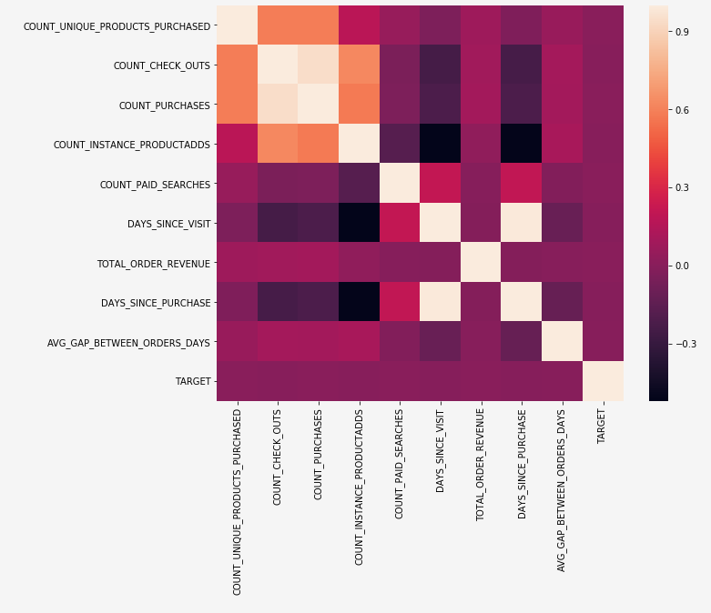

# 探索的データ分析（EDA）ノートブックを使用した、予測モデルの web ベースデータの調査

この探索的データ分析（EDA）ノートブックは、データのパターンの検出、データのサニティチェックおよび予測モデルに適したデータの要約に役立つように設計されています。

EDA ノートブックの例は、web ベースデータを念頭に置いて最適化されており、2 つの部分で構成されます。1 つ目の部分ではまず、Query Service を使用して、トレンドやデータのスナップショットを確認します。次に、探索的データ分析の目標を念頭に置いて、データがプロファイルおよび訪問者レベルで集計されます。

2 つ目の部分は、まず、Python ライブラリを使用して集計データに対して記述的分析を実行します。このノートブックが、ヒストグラム、散布グラフ、箱ひげ図、相関行列などのビジュアライゼーションを表示して、目標の予測に役立つ可能性の最も高い機能を判断するために使用される実用的なインサイトを導き出します。

## はじめに

このガイドを読む前に、[!DNL JupyterLab] の概要およびデータサイエンスワークスペース内での役割を[[!DNL JupyterLab] ユーザーガイド](./overview.md)で確認してください。さらに、独自のデータを使用している場合は、[ [!DNL Jupyterlab] ノートブックでのデータアクセス](./access-notebook-data.md)に関するドキュメントを確認してください。このガイドでは、ノートブックのデータ制限に関する重要な事項を説明します。

このノートブックでは、Analytics Analysis Workspace にある Adobe Analytics エクスペリエンスイベントデータ形式の中央値データセットを使用します。 EDA ノートブックを使用するには、`target_table` および `target_table_id` の値を持つデータテーブルを定義する必要があります。任意の中央値データセットを使用できます。

これらの値を見つけるには、 JupyterLab データアクセスガイドの [Python でのデータセットへの書き込み](./access-notebook-data.md#write-python)の節で概要を説明している手順に従ってください。データセット名（`target_table`）は、データセットディレクトリにあります。データセットを右クリックしてノートブックのデータの調査または書き込みを行うと、データセット ID（`target_table_id`）が実行可能コードエントリで提供されます。

## データ検出

この節では、「ユーザーアクティビティ別の上位 10 都市」や「閲覧された上位 10 製品」などのトレンドを表示するための設定手順とクエリ例を示します。

### ライブラリの設定

JupyterLab では複数のライブラリをサポートしています。次のコードをコードセルに貼り付けて実行すると、この例で使用する必須パッケージをすべて収集してインストールできます。独自のデータ分析には、この例で使用していない追加パッケージや代替パッケージを使用できます。 サポートされているパッケージのリストについては、`!pip list --format=columns` をコピーして新しいセルに貼り付けます。

```python
!pip install colorama
import chart_studio.plotly as py
import plotly.graph_objs as go
from plotly.offline import iplot
from scipy import stats
import numpy as np
import warnings
warnings.filterwarnings('ignore')
from scipy.stats import pearsonr
import matplotlib.pyplot as plt
from scipy.stats import pearsonr
import pandas as pd
import math
import re
import seaborn as sns
from datetime import datetime
import colorama
from colorama import Fore, Style
pd.set_option('display.max_columns', None)
pd.set_option('display.max_rows', None)
pd.set_option('display.width', 1000)
pd.set_option('display.expand_frame_repr', False)
pd.set_option('display.max_colwidth', -1)
```

### Adobe Experience Platform [!DNL Query Service] への接続

Platform 上の [!DNL JupyterLab] では、[!DNL Python] ノートブックで SQL を使用して、[クエリサービス](https://experienceleague.adobe.com/docs/experience-platform/query/home.html?lang=ja)を通じてデータにアクセスできます。[!DNL Query Service] を通じたデータへのアクセスは実行時間が短いので、大規模なデータセットの処理に役立ちます。[!DNL Query Service] を使用したデータのクエリには 10 分間の処理時間制限があることに注意してください。

[!DNL JupyterLab] で [!DNL Query Service] を使用する前に、[[!DNL Query Service] SQL 構文](https://experienceleague.adobe.com/docs/experience-platform/query/sql/syntax.html?lang=ja)について実践的に理解していることを確認してください。

JupyterLab でクエリサービスを利用するには、まず、作業中の Python ノートブックとクエリサービスの間の接続を作成する必要があります。それには、次のセルを実行します。

```python
qs_connect()
```

### 調査する中央値データセットの定義

データのクエリと調査を開始するには、中央値データセットテーブルを指定する必要があります。`table_name` と `table_id` の値を独自のデータテーブル値に置き換えます。

```python
target_table = "table_name"
target_table_id = "table_id"
```

完了すると、このセルは次の例のようになります。

```python
target_table = "cross_industry_demo_midvalues"
target_table_id = "5f7c40ef488de5194ba0157a"
```

### データセットでの使用可能な日付の調査

以下に示すセルを使用すると、テーブルで扱っている日付範囲を表示できます。日数、初日および最終日を調査する目的は、さらに掘り下げて分析するための日付範囲の選択を支援することです。

```python
%%read_sql -c QS_CONNECTION
SELECT distinct Year(timestamp) as Year, Month(timestamp) as Month, count(distinct DAY(timestamp)) as Count_days, min(DAY(timestamp)) as First_date, max(DAY(timestamp)) as Last_date, count(timestamp) as Count_hits
from {target_table}
group by Month(timestamp), Year(timestamp)
order by Year, Month;
```

このセルを実行すると、次の出力が生成されます。


### データセット検出用の日付の設定

データセット検出に使用可能な日付を決定したら、以下のパラメーターを更新する必要があります。 このセルで設定された日付は、クエリ形式でのデータ検出にのみ使用されます。日付は、このガイドで後ほど、探索的データ分析に適した範囲に再び更新されます。

```python
target_year = "2020" ## The target year
target_month = "02" ## The target month
target_day = "(01,02,03)" ## The target days
```

### データセットの検出

すべてのパラメーターを設定して、[!DNL Query Service] を開始し、日付範囲を指定したら、データ行の読み取りを開始する準備が整っています。読み取る行数を制限してください。

```python
from platform_sdk.dataset_reader import DatasetReader
from datetime import date
dataset_reader = DatasetReader(PLATFORM_SDK_CLIENT_CONTEXT, dataset_id=target_table_id)
# If you do not see any data or would like to expand the default date range, change the following query
Table = dataset_reader.limit(5).read()
```

データセットで使用可能な列の数を表示するには、次のセルを使用します。

```python
print("\nNumber of columns:",len(Table.columns))
```

データセットの行を表示するには、次のセルを使用します。 この例では、行数は 5 に制限されています。

```python
Table.head(5)
```


データセットにどのようなデータが含まれているかがわかったら、データセットをさらに分類すると役に立つ場合があります。 この例では、各列の列名とデータタイプが一覧表示される一方、出力を使用してデータタイプが正しいかどうかを確認しています。

```python
ColumnNames_Types = pd.DataFrame(Table.dtypes)
ColumnNames_Types = ColumnNames_Types.reset_index()
ColumnNames_Types.columns = ["Column_Name", "Data_Type"]
ColumnNames_Types
```


### データセットトレンドの調査

次の節では、データのトレンドとパターンを調べるために使用する 4 つのサンプルクエリを示します。 以下に示す例はすべてを網羅するものではなく、よく見られる一部の機能を扱っています。

**特定の日の時間別アクティビティ数**

このクエリでは、1 日を通してのアクションとクリックの数を分析しています。 出力は、当日の各時間のアクティビティ数に関する指標を含んだテーブルの形式で表されます。

```sql
%%read_sql query_2_df -c QS_CONNECTION

SELECT Substring(timestamp, 12, 2)                        AS Hour, 
       Count(enduserids._experience.aaid.id) AS Count 
FROM   {target_table}
WHERE  Year(timestamp) = {target_year} 
       AND Month(timestamp) = {target_month}  
       AND Day(timestamp) in {target_day}
GROUP  BY Hour
ORDER  BY Hour;
```


クエリの動作を確認したら、視覚的にわかりやすいように、データを一変量のプロットヒストグラムで表示することができます。

```python
trace = go.Bar(
    x = query_2_df['Hour'],
    y = query_2_df['Count'],
    name = "Activity Count"
)

layout = go.Layout(
    title = 'Activity Count by Hour of Day',
    width = 1200,
    height = 600,
    xaxis = dict(title = 'Hour of Day'),
    yaxis = dict(title = 'Count')
)

fig = go.Figure(data = [trace], layout = layout)
iplot(fig)
```


**特定の日に閲覧された上位 10 ページ**

このクエリでは、特定の日に最も多く閲覧されたページを分析しています。 出力は、ページ名とページビュー数の指標を含んだテーブルの形式で表されます。

```sql
%%read_sql query_4_df -c QS_CONNECTION

SELECT web.webpagedetails.name                 AS Page_Name, 
       Sum(web.webpagedetails.pageviews.value) AS Page_Views 
FROM   {target_table}
WHERE  Year(timestamp) = {target_year}
       AND Month(timestamp) = {target_month}
       AND Day(timestamp) in {target_day}
GROUP  BY web.webpagedetails.name 
ORDER  BY page_views DESC 
LIMIT  10;
```

クエリの動作を確認したら、視覚的にわかりやすいように、データを一変量のプロットヒストグラムで表示することができます。

```python
trace = go.Bar(
    x = query_4_df['Page_Name'],
    y = query_4_df['Page_Views'],
    name = "Page Views"
)

layout = go.Layout(
    title = 'Top Ten Viewed Pages For a Given Day',
    width = 1000,
    height = 600,
    xaxis = dict(title = 'Page_Name'),
    yaxis = dict(title = 'Page_Views')
)

fig = go.Figure(data = [trace], layout = layout)
iplot(fig)
```


**ユーザーアクティビティ別にグループ化された上位 10 都市**

このクエリでは、データの元となる都市を分析しています。

```sql
%%read_sql query_6_df -c QS_CONNECTION

SELECT concat(placeContext.geo.stateProvince, ' - ', placeContext.geo.city) AS state_city, 
       Count(timestamp)                                                     AS Count
FROM   {target_table}
WHERE  Year(timestamp) = {target_year}
       AND Month(timestamp) = {target_month}
       AND Day(timestamp) in {target_day}
GROUP  BY state_city
ORDER  BY Count DESC
LIMIT  10;
```

クエリの動作を確認したら、視覚的にわかりやすいように、データを一変量のプロットヒストグラムで表示することができます。

```python
trace = go.Bar(
    x = query_6_df['state_city'],
    y = query_6_df['Count'],
    name = "Activity by City"
)

layout = go.Layout(
    title = 'Top Ten Cities by User Activity',
    width = 1200,
    height = 600,
    xaxis = dict(title = 'City'),
    yaxis = dict(title = 'Count')
)

fig = go.Figure(data = [trace], layout = layout)
iplot(fig)
```


**閲覧された上位 10 製品**

このクエリでは、閲覧された上位 10 製品のリストを出力します。 次の例では、 `Explode()` 関数を使用して、 `productlistitems` オブジェクト内の各製品をそれ専用の行に返します。 これにより、ネストされたクエリを実行して、様々な SKU の製品ビューを集計できます。

```sql
%%read_sql query_7_df -c QS_CONNECTION

SELECT Product_List_Items.sku AS Product_SKU,
       Sum(Product_Views) AS Total_Product_Views
FROM  (SELECT Explode(productlistitems) AS Product_List_Items, 
              commerce.productviews.value   AS Product_Views 
       FROM   {target_table}
       WHERE  Year(timestamp) = {target_year}
              AND Month(timestamp) = {target_month}
              AND Day(timestamp) in {target_day}
              AND commerce.productviews.value IS NOT NULL) 
GROUP BY Product_SKU 
ORDER BY Total_Product_Views DESC
LIMIT  10;
```

クエリの動作を確認したら、視覚的にわかりやすいように、データを一変量のプロットヒストグラムで表示することができます。

```python
trace = go.Bar(
    x = "SKU-" + query_7_df['Product_SKU'],
    y = query_7_df['Total_Product_Views'],
    name = "Product View"
)

layout = go.Layout(
    title = 'Top Ten Viewed Products',
    width = 1200,
    height = 600,
    xaxis = dict(title = 'SKU'),
    yaxis = dict(title = 'Product View Count')
)

fig = go.Figure(data = [trace], layout = layout)
iplot(fig)
```


データのトレンドやパターンを調べたら、目標を予測するためにどのような機能を構築すればよいかが大体わかるはずです。 テーブル全体をざっと調べると、各データ属性の形式、明らかな表示ミスおよび大きな異常値をすばやくハイライト表示し、属性間の関係を調べる候補の提案を開始することができます。

## 探索的データ分析

探索的データ分析を使用すると、データの理解を深め、モデリングの基礎として使用できる切実な疑問に対する直感を磨くことができます。

データ検出手順が完了したら、イベント、都市またはユーザー ID レベルで一部集計されたイベントレベルのデータを調べて、1 日のトレンドを確認します。 このデータは重要ですが、全体像を示すものではありません。 Web サイトでの購入を促進する要因がまだわかっていません。

これを理解するには、プロファイル／訪問者レベルでデータを集計し、購入目標を定義して、相関性、ボックス図、散布図などの統計的概念を適用する必要があります。 これらの方法を使用して、定義した予測ウィンドウで購入者と非購入者のアクティビティのパターンを比較します。

この節では、次の機能を作成し調査します。

- `COUNT_UNIQUE_PRODUCTS_PURCHASED`：購入した一意の製品の数。
- `COUNT_CHECK_OUTS`：チェックアウト数。
- `COUNT_PURCHASES`：購入数。
- `COUNT_INSTANCE_PRODUCTADDS`：製品追加インスタンスの数。
- `NUMBER_VISITS`：訪問数。
- `COUNT_PAID_SEARCHES`：有料検索数。
- `DAYS_SINCE_VISIT`：前回の訪問からの経過日数。
- `TOTAL_ORDER_REVENUE`：合計注文売上高。
- `DAYS_SINCE_PURCHASE`：以前の購入からの経過日数。
- `AVG_GAP_BETWEEN_ORDERS_DAYS`：購入間の平均ギャップ（日数）。
- `STATE_CITY`：都道府県と市区町村が含まれます。

データ集計を続行する前に、探索的データ分析で使用する予測変数のパラメーター（データサイエンスモデルに何を求めるのか）を定義する必要があります。一般的なパラメーターには、目標、予測期間、分析期間が含まれています。

EDA ノートブックを使用している場合は、続行する前に以下の値を置き換える必要があります。

```python
goal = "commerce.`order`.purchaseID" #### prediction variable
goal_column_type = "numerical" #### choose either "categorical" or "numerical"
prediction_window_day_start = "2020-01-01" #### YYYY-MM-DD
prediction_window_day_end = "2020-01-31" #### YYYY-MM-DD
analysis_period_day_start = "2020-02-01" #### YYYY-MM-DD
analysis_period_day_end = "2020-02-28" #### YYYY-MM-DD

### If the goal is a categorical goal then select threshold for the defining category and creating bins. 0 is no order placed, and 1 is at least one order placed:
threshold = 1
```

### 特性と目標作成のためのデータ集計

探索的分析を開始するには、プロファイルレベルで目標を作成し、その後データセットを集計する必要があります。この例では、2 つのクエリが指定されています。最初のクエリには、目標の作成が含まれています。2 つ目のクエリは、最初のクエリの変数以外の変数を含めるように更新する必要があります。 クエリに合わせて `limit` を更新することもできます。次のクエリを実行すると、集計データを探索に使用できるようになります。

```sql
%%read_sql target_df -d -c QS_CONNECTION

SELECT DISTINCT endUserIDs._experience.aaid.id                  AS ID,
       Count({goal})                                            AS TARGET
FROM   {target_table}
WHERE DATE(TIMESTAMP) BETWEEN '{prediction_window_day_start}' AND '{prediction_window_day_end}'
GROUP BY endUserIDs._experience.aaid.id;
```

```sql
%%read_sql agg_data -d -c QS_CONNECTION

SELECT z.*, z1.state_city as STATE_CITY
from
((SELECT y.*,a2.AVG_GAP_BETWEEN_ORDERS_DAYS as AVG_GAP_BETWEEN_ORDERS_DAYS
from
(select a1.*, f.DAYS_SINCE_PURCHASE as DAYS_SINCE_PURCHASE
from
(SELECT DISTINCT a.ID  AS ID,
COUNT(DISTINCT Product_Items.SKU) as COUNT_UNIQUE_PRODUCTS_PURCHASED,
COUNT(a.check_out) as COUNT_CHECK_OUTS,
COUNT(a.purchases) as COUNT_PURCHASES, 
COUNT(a.product_list_adds) as COUNT_INSTANCE_PRODUCTADDS,
sum(CASE WHEN a.search_paid = 'TRUE' THEN 1 ELSE 0 END) as COUNT_PAID_SEARCHES,
DATEDIFF('{analysis_period_day_end}', MAX(a.date_a)) as DAYS_SINCE_VISIT,
ROUND(SUM(Product_Items.priceTotal * Product_Items.quantity), 2) AS TOTAL_ORDER_REVENUE
from 
(SELECT endUserIDs._experience.aaid.id as ID,
commerce.`checkouts`.value as check_out,
commerce.`order`.purchaseID as purchases, 
commerce.`productListAdds`.value as product_list_adds,
search.isPaid as search_paid,
DATE(TIMESTAMP) as date_a,
Explode(productlistitems) AS Product_Items
from {target_table}
Where DATE(TIMESTAMP) BETWEEN '{analysis_period_day_start}' AND '{analysis_period_day_end}') as a
group by a.ID) as a1
left join 
(SELECT DISTINCT endUserIDs._experience.aaid.id as ID,
DATEDIFF('{analysis_period_day_end}', max(DATE(TIMESTAMP))) as DAYS_SINCE_PURCHASE
from {target_table}
where DATE(TIMESTAMP) BETWEEN '{analysis_period_day_start}' AND '{analysis_period_day_end}'
and commerce.`order`.purchaseid is not null
GROUP BY endUserIDs._experience.aaid.id) as f
on f.ID = a1.ID
where a1.COUNT_PURCHASES>0) as y
left join
(select ab.ID, avg(DATEDIFF(ab.ORDER_DATES, ab.PriorDate)) as AVG_GAP_BETWEEN_ORDERS_DAYS
from
(SELECT distinct endUserIDs._experience.aaid.id as ID, TO_DATE(DATE(TIMESTAMP)) as ORDER_DATES, 
TO_DATE(LAG(DATE(TIMESTAMP),1) OVER (PARTITION BY endUserIDs._experience.aaid.id ORDER BY DATE(TIMESTAMP))) as PriorDate
FROM {target_table}
where DATE(TIMESTAMP) BETWEEN '{analysis_period_day_start}' AND '{analysis_period_day_end}'
AND commerce.`order`.purchaseid is not null) AS ab
where ab.PriorDate is not null
GROUP BY ab.ID) as a2
on a2.ID = y.ID) z    
left join
(select t.ID, t.state_city from
(
SELECT DISTINCT endUserIDs._experience.aaid.id as ID,
concat(placeContext.geo.stateProvince, ' - ', placeContext.geo.city) as state_city, 
ROW_NUMBER() OVER(PARTITION BY endUserIDs._experience.aaid.id ORDER BY DATE(TIMESTAMP) DESC) AS ROWNUMBER
FROM   {target_table}
WHERE  DATE(TIMESTAMP) BETWEEN '{analysis_period_day_start}' AND '{analysis_period_day_end}') as t
where t.ROWNUMBER = 1) z1
on z.ID = z1.ID)
limit 500000;
```

### 集計データセットの特性と目標の結合

次のセルは、前の例で概要を説明した集計データセットの特性と予測目標の結合に使用します。

```python
Data = pd.merge(agg_data,target_df, on='ID',how='left')
Data['TARGET'].fillna(0, inplace=True)
```

次の 3 つの例のセルを使用して、結合が成功したことを確認します。

`Data.shape` は、列数に続いて行数を返します。例：(11913, 12)。

```python
Data.shape
```

`Data.head(5)` は、5 行のデータを含むテーブルを返します。返されたテーブルには、プロファイル ID にマッピングされた集計データの 12 列がすべて含まれています。

```python
Data.head(5)
```


このセルは、一意のプロファイルの数を出力します。

```python
print("Count of unique profiles:", (len(Data)))
```

### 欠落値と異常値の検出

データ集計を完了し、目標と結合したら、データを確認する必要があります。これはデータヘルスチェックとも呼ばれます。

このプロセスでは、欠落値と異常値を識別します。問題が特定された場合、次のタスクでは、問題を処理するための具体的な戦略を考えます。

>[!NOTE]
>
>この手順では、データログプロセスで障害を示す可能性のある、値の破損が見つかる場合があります。

```python
Missing = pd.DataFrame(round(Data.isnull().sum()*100/len(Data),2))
Missing.columns =['Percentage_missing_values'] 
Missing['Features'] = Missing.index
```

次のセルは、欠落値を視覚化するために使用されます。

```python
trace = go.Bar(
    x = Missing['Features'],
    y = Missing['Percentage_missing_values'],
    name = "Percentage_missing_values")

layout = go.Layout(
    title = 'Missing values',
    width = 1200,
    height = 600,
    xaxis = dict(title = 'Features'),
    yaxis = dict(title = 'Percentage of missing values')
)

fig = go.Figure(data = [trace], layout = layout)
iplot(fig)
```


欠落値を検出した後は、異常値を識別することが重要です。平均、標準偏差、相関などのパラメトリック統計は、異常値の影響を強く受けます。また、線形回帰などの一般的な統計的手順の前提も、これらの統計に基づいています。つまり、異常値によって分析が台無になる可能性があります。

異常値を識別するために、この例では四分位範囲を使用します。四分位範囲（IQR）とは、第 1 四分位数と第 3 四分位数（25 パーセンタイルと 75 パーセンタイル）の間の範囲のことです。 次の例では、25 パーセンタイルを IQR の 1.5 倍より大きく下に外れた、または 75 パーセンタイルを IQR の 1.5 倍より大きく上に外れたすべてのデータポイントを収集します。これらのいずれかに該当する値が、次のセルで異常値として定義されます。

>[!TIP]
>
>異常値を修正するには、携わっているビジネスや業種に関する理解が必要です。時には、異常値だからというだけで観測値を除外するわけにはいかない場合もあります。異常値は妥当な観測値の可能性があり、多くの場合、最も興味深い観測値です。異常値の削除について詳しくは、[データクリーニング手順（オプション）](#optional-data-clean)を参照してください。

```python
TARGET = Data.TARGET

Data_numerical = Data.select_dtypes(include=['float64', 'int64'])
Data_numerical.drop(['TARGET'],axis = 1,inplace = True)
Data_numerical1 = Data_numerical

for i in range(0,len(Data_numerical1.columns)):
    Q1 = Data_numerical1.iloc[:,i].quantile(0.25)
    Q3 = Data_numerical1.iloc[:,i].quantile(0.75)
    IQR = Q3 - Q1
    Data_numerical1.iloc[:,i] = np.where(Data_numerical1.iloc[:,i]<(Q1 - 1.5 * IQR),np.nan, np.where(Data_numerical1.iloc[:,i]>(Q3 + 1.5 * IQR),
                                                                                                    np.nan,Data_numerical1.iloc[:,i]))
    
Outlier = pd.DataFrame(round(Data_numerical1.isnull().sum()*100/len(Data),2))
Outlier.columns =['Percentage_outliers'] 
Outlier['Features'] = Outlier.index   
```

いつも通り、結果の視覚化は重要です。

```python
trace = go.Bar(
    x = Outlier['Features'],
    y = Outlier['Percentage_outliers'],
    name = "Percentage_outlier")

layout = go.Layout(
    title = 'Outliers',
    width = 1200,
    height = 600,
    xaxis = dict(title = 'Features'),
    yaxis = dict(title = 'Percentage of outliers')
)

fig = go.Figure(data = [trace], layout = layout)
iplot(fig)
```


### 一変量分析

欠落値や異常値のデータを修正したら、分析を開始できます。分析には、一変量分析、二変量分析、多変量分析の 3 種類があります。一変量分析では、単一の変数の関係を使用して、データの取得、要約、データ内のパターン検出を行います。二変量分析では一度に複数の変数が調べられ、多変量分析では一度に 3 つ以上の変数が調べられます。

次の例では、特性の分布を視覚化するテーブルを生成します。

```python
Data_numerical = Data.select_dtypes(include=['float64', 'int64'])
distribution = pd.DataFrame([Data_numerical.count(),Data_numerical.mean(),Data_numerical.quantile(0), Data_numerical.quantile(0.01),
                             Data_numerical.quantile(0.05),Data_numerical.quantile(0.25), Data_numerical.quantile(0.5),
                        Data_numerical.quantile(0.75),  Data_numerical.quantile(0.95),Data_numerical.quantile(0.99), Data_numerical.max()])
distribution = distribution.T
distribution.columns = ['Count', 'Mean', 'Min', '1st_perc','5th_perc','25th_perc', '50th_perc','75th_perc','95th_perc','99th_perc','Max']
distribution
```


特徴の分布を得たら、配列を使用して視覚化されたデータグラフを作成できます。次のセルは、上記のテーブルを数値データで視覚化するために使用されます。

```python
A = sns.palplot(sns.color_palette("Blues"))
```

```python
for column in Data_numerical.columns[0:]:
    plt.figure(figsize=(5, 4))
    plt.ticklabel_format(style='plain', axis='y')
    sns.distplot(Data_numerical[column], color = A, kde=False, bins=6, hist_kws={'alpha': 0.4});
```


### 分類データ

グループ化カテゴリデータを使用して、集計データの各列に含まれる値とその分布を理解します。この例では、上位 10 個のカテゴリを使用して、分布のプロットを支援します。 1 つの列に一意の値が何千も含まれる場合があることに注意してください。 散乱したプロットをレンダリングして判読不能にすることは望ましくありませんビジネス目標を念頭に置いて、データをグループ化すると、より有意義な結果が得られます。

```python
Data_categorical = Data.select_dtypes(include='object')
Data_categorical.drop(['ID'], axis = 1, inplace = True, errors = 'ignore')
```

```python
for column in Data_categorical.columns[0:]:
    if (len(Data_categorical[column].value_counts())>10):
        plt.figure(figsize=(12, 8))
        sns.countplot(x=column, data = Data_categorical, order = Data_categorical[column].value_counts().iloc[:10].index, palette="Set2");
    else:
        plt.figure(figsize=(12, 8))
        sns.countplot(x=column, data = Data_categorical, palette="Set2");
```


### 一意の値が 1 つだけ入った列の削除

値が 1 つしかない列は、分析に情報を追加しないため、削除できます。

```python
for col in Data.columns:
    if len(Data[col].unique()) == 1:
        if col == 'TARGET':
            print(Fore.RED + '\033[1m' + 'WARNING: TARGET HAS A SINGLE UNIQUE VALUE, ANY BIVARIATE ANALYSIS (NEXT STEP IN THIS NOTEBOOK) OR PREDICTION WILL BE MEANINGLESS' + Fore.RESET + '\x1b[21m')
        elif col == 'ID':
            print(Fore.RED + '\033[1m' + 'WARNING: THERE IS ONLY ONE PROFILE IN THE DATA, ANY BIVARIATE ANALYSIS (NEXT STEP IN THIS NOTEBOOK) OR PREDICTION WILL BE MEANINGLESS' + Fore.RESET + '\x1b[21m')
        else:
            print('Dropped column:',col)
            Data.drop(col,inplace=True,axis=1)
```

値が 1 つの列を削除したら、新しいセルで `Data.columns` コマンドを使用して残りの列にエラーがないか確認します。

### 欠落値の修正

次の節では、欠落値を修正する方法のいくつかの例を示します。上記のデータでは、欠落値を持つ列は 1 つしかありませんが、以下の例のセルではすべてのデータタイプの値を修正します。 これには、以下が含まれます。

- 数値データタイプ：0 または最大値を入力する（該当する場合）
- カテゴリデータタイプ：入力モーダル値

```python
#### Select only numerical data
Data_numerical = Data.select_dtypes(include=['float64', 'int64'])

#### For columns that contain days we impute max days of history for null values, for rest all we impute 0

# Imputing days with max days of history
Days_cols = [col for col in Data_numerical.columns if 'DAYS_' in col]
d1 = datetime.strptime(analysis_period_day_start, "%Y-%m-%d")
d2 = datetime.strptime(analysis_period_day_end, "%Y-%m-%d")
A = abs((d2 - d1).days)

for column in Days_cols:
    Data[column].fillna(A, inplace=True)

# Imputing 0
Data_numerical = Data.select_dtypes(include=['float64', 'int64'])
Missing_numerical = Data_numerical.columns[Data_numerical.isnull().any()].tolist()

for column in Missing_numerical:
    Data[column].fillna(0, inplace=True)
```

```python
#### Correct for missing values in categorical columns (Replace with mode)
Data_categorical = Data.select_dtypes(include='object')
Missing_cat = Data_categorical.columns[Data_categorical.isnull().any()].tolist() 
for column in Missing_cat:
    Data[column].fillna(Data[column].mode()[0], inplace=True)
```

完了したら、二変量解析にクリーンデータを使用できます。

### 二変量解析

二変量解析を使用して、特性やターゲット変数など、2 つの値のセット間の関係を理解します。プロットはカテゴリと数値のデータタイプに応じて異なるので、この分析はデータタイプごとに別々に行う必要があります。 二変量解析では、次のチャートを使用することをお勧めします。

- **相関**：相関係数は、2 つの特性間の関係の強さの尺度です。 相関の値は -1 から 1 の間です。1 は強い正の関係を示し、-1 は強い負の関係を示し、ゼロの結果はまったく関係がないことを示します。
- **ペアプロット**：ペアプロットは、各変数間の関係を簡単に視覚化する方法です。 データ内の各変数間の関係の行列が生成されます。
- **ヒートマップ**：ヒートマップは、データセット内のすべての変数の相関係数です。
- **ボックスプロット**：ボックスプロットは、5 数要約（最小値、第一四分位数（Q1）、中央値、第三四分位数（Q3）、最大値）に基づいて、データ分布を表示する標準化された方法です。
- **カウントプロット**：カウントプロットは、一部のカテゴリ特性のヒストグラムや棒グラフに似ています。 特定のタイプのカテゴリに基づいた、ある項目の出現回数を表示します。

データタイプに基づいてチャートを使用して、「目標」変数と予測因子／特性との関係を理解します。数値特性の場合、「目標」変数がカテゴリの場合はボックスプロットを、「目標」変数が数値の場合はペアプロットとヒートマップを使用する必要があります。

カテゴリ特性の場合は、「目標」変数がカテゴリの場合はカウントプロットを、「目標」変数が数値の場合はボックスプロットを使用する必要があります。 これらの方法を使用すると、関係を理解するのに役立ちます。 これらの関係は、特性、または予測因子と目標の形式で設定できます。

**数値予測因子**

```python
if len(Data) == 1:
    print(Fore.RED + '\033[1m' + 'THERE IS ONLY ONE PROFILE IN THE DATA, BIVARIATE ANALYSIS IS NOT APPLICABLE, PLEASE INCLUDE AT LEAST ONE MORE PROFILE TO DO BIVARIATE ANALYSIS')
elif len(Data['TARGET'].unique()) == 1:
    print(Fore.RED + '\033[1m' + 'TARGET HAS A SINGLE UNIQUE VALUE, BIVARIATE ANALYSIS IS NOT APPLICABLE, PLEASE INCLUDE PROFILES WITH ATLEAST ONE DIFFERENT VALUE OF TARGET TO DO BIVARIATE ANALYSIS')
else:
    if (goal_column_type == "categorical"):
        TARGET_categorical = pd.DataFrame(np.where(TARGET>=threshold,"1","0"))
        TARGET_categorical.rename(columns={TARGET_categorical.columns[0]: "TARGET_categorical" }, inplace = True)
        Data_numerical = Data.select_dtypes(include=['float64', 'int64'])
        Data_numerical.drop(['TARGET'],inplace=True,axis=1)
        Data_numerical = pd.concat([Data_numerical, TARGET_categorical.astype(int)], axis = 1)
        ncols_for_charts = len(Data_numerical.columns)-1
        nrows_for_charts = math.ceil(ncols_for_charts/4)
        fig, axes = plt.subplots(nrows=nrows_for_charts, ncols=4, figsize=(18, 15))
        for idx, feat in enumerate(Data_numerical.columns[:-1]):
            ax = axes[int(idx // 4), idx % 4]
            sns.boxplot(x='TARGET_categorical', y=feat, data=Data_numerical, ax=ax)
            ax.set_xlabel('')
            ax.set_ylabel(feat)
            fig.tight_layout();
    else:
        Data_numerical = Data.select_dtypes(include=['float64', 'int64'])
        TARGET = pd.DataFrame(Data_numerical.TARGET)
        Data_numerical = Data.select_dtypes(include=['float64', 'int64'])
        Data_numerical.drop(['TARGET'],inplace=True,axis=1)
        Data_numerical = pd.concat([Data_numerical, TARGET.astype(int)], axis = 1)
        for i in Data_numerical.columns[:-1]:
            sns.pairplot(x_vars=i, y_vars=['TARGET'], data=Data_numerical, height = 4)
        f, ax = plt.subplots(figsize = (10,8))
        corr = Data_numerical.corr()
```

セルを実行すると、次の出力が生成されます。




**カテゴリ予測因子**

次の例を使用して、各カテゴリ変数の上位 10 個のカテゴリ頻度プロットをプロットして表示します。

```python
if len(Data) == 1:
    print(Fore.RED + '\033[1m' + 'THERE IS ONLY ONE PROFILE IN THE DATA, BIVARIATE ANALYSIS IS NOT APPLICABLE, PLEASE INCLUDE AT LEAST ONE MORE PROFILE TO DO BIVARIATE ANALYSIS')
elif len(Data['TARGET'].unique()) == 1:
    print(Fore.RED + '\033[1m' + 'TARGET HAS A SINGLE UNIQUE VALUE, BIVARIATE ANALYSIS IS NOT APPLICABLE, PLEASE INCLUDE PROFILES WITH ATLEAST ONE DIFFERENT VALUE OF TARGET TO DO BIVARIATE ANALYSIS')
else:
    if (goal_column_type == "categorical"):
        TARGET_categorical = pd.DataFrame(np.where(TARGET>=threshold,"1","0"))
        TARGET_categorical.rename(columns={TARGET_categorical.columns[0]: "TARGET_categorical" }, inplace = True)
        Data_categorical = Data.select_dtypes(include='object')
        Data_categorical.drop(["ID"], axis =1, inplace = True)
        Cat_columns = Data_categorical
        Data_categorical = pd.concat([TARGET_categorical,Data_categorical], axis =1)
        for column in Cat_columns.columns:
            A = Data_categorical[column].value_counts().iloc[:10].index
            Data_categorical1 = Data_categorical[Data_categorical[column].isin(A)]
            plt.figure(figsize=(12, 8))
            sns.countplot(x="TARGET_categorical",hue=column, data = Data_categorical1, palette = 'Blues')
            plt.xlabel("GOAL")
            plt.ylabel("COUNT")
            plt.show();
    else:
        Data_categorical = Data.select_dtypes(include='object')
        Data_categorical.drop(["ID"], axis =1, inplace = True)
        Target = Data.TARGET
        Data_categorical = pd.concat([Data_categorical,Target], axis =1)
        for column in Data_categorical.columns[:-1]:
            A = Data_categorical[column].value_counts().iloc[:10].index
            Data_categorical1 = Data_categorical[Data_categorical[column].isin(A)]
            sns.catplot(x=column, y="TARGET", kind = "boxen", data =Data_categorical1, height=5, aspect=13/5);
```

このセルを実行すると、次の出力が生成されます。


### 重要な数値特性

相関分析を使用すると、上位 10 個の重要な数値特性のリストを作成できます。 これらの特性はすべて、「目標」特性の予測に使用できます。 このリストは、モデルの構築を開始する際の特性リストとして使用できます。

```python
if len(Data) == 1:
    print(Fore.RED + '\033[1m' + 'THERE IS ONLY ONE PROFILE IN THE DATA, BIVARIATE ANALYSIS IS NOT APPLICABLE, PLEASE INCLUDE AT LEAST ONE MORE PROFILE TO FIND IMPORTANT VARIABLES')
elif len(Data['TARGET'].unique()) == 1:
    print(Fore.RED + '\033[1m' + 'TARGET HAS A SINGLE UNIQUE VALUE, BIVARIATE ANALYSIS IS NOT APPLICABLE, PLEASE INCLUDE PROFILES WITH ATLEAST ONE DIFFERENT VALUE OF TARGET TO FIND IMPORTANT VARIABLES')
else:
    Data_numerical = Data.select_dtypes(include=['float64', 'int64'])
    Correlation = pd.DataFrame(Data_numerical.drop("TARGET", axis=1).apply(lambda x: x.corr(Data_numerical.TARGET)))
    Correlation['Corr_abs'] = abs(Correlation)
    Correlation = Correlation.sort_values(by = 'Corr_abs', ascending = False)
    Imp_features = pd.DataFrame(Correlation.index[0:10])
    Imp_features.rename(columns={0:'Important Feature'}, inplace=True)
    print(Imp_features)
```


### インサイトの例

データの分析中にインサイトが得られることは珍しくありません。次の例は、ターゲットイベントのリーセンシーと金銭的価値をマッピングするインサイトです。

```python
# Proxy for monetary value is TOTAL_ORDER_REVENUE and proxy for frequency is NUMBER_VISITS
if len(Data) == 1:
    print(Fore.RED + '\033[1m' + 'THERE IS ONLY ONE PROFILE IN THE DATA, INSIGHTS ANALYSIS IS NOT APPLICABLE, PLEASE INCLUDE AT LEAST ONE MORE PROFILE TO FIND IMPORTANT VARIABLES')
elif len(Data['TARGET'].unique()) == 1:
    print(Fore.RED + '\033[1m' + 'TARGET HAS A SINGLE UNIQUE VALUE, INSIGHTS ANALYSIS IS NOT APPLICABLE, PLEASE INCLUDE PROFILES WITH ATLEAST ONE DIFFERENT VALUE OF TARGET TO FIND IMPORTANT VARIABLES')
else:
    sns.lmplot("DAYS_SINCE_VISIT", "TOTAL_ORDER_REVENUE", Data, hue="TARGET", fit_reg=False);
```


## データクリーニング手順（オプション） {#optional-data-clean}

異常値を修正するには、携わっているビジネスや業種に関する理解が必要です。時には、異常値だからというだけで観測値を除外するわけにはいかない場合もあります。異常値は妥当な観測値の可能性があり、多くの場合、最も興味深い観測値です。

異常値とそれらをドロップするかどうかについて詳しくは、[分析要因](https://www.theanalysisfactor.com/outliers-to-drop-or-not-to-drop/)のこのエントリを参照してください。

次のサンプルセルでは、[四分位範囲](https://www.thoughtco.com/what-is-the-interquartile-range-rule-3126244)を使用して、異常値であるデータポイントに上限値と下限値を適用しています。

```python
TARGET = Data.TARGET

Data_numerical = Data.select_dtypes(include=['float64', 'int64'])
Data_numerical.drop(['TARGET'],axis = 1,inplace = True)

for i in range(0,len(Data_numerical.columns)):
    Q1 = Data_numerical.iloc[:,i].quantile(0.25)
    Q3 = Data_numerical.iloc[:,i].quantile(0.75)
    IQR = Q3 - Q1
    Data_numerical.iloc[:,i] = np.where(Data_numerical.iloc[:,i]<(Q1 - 1.5 * IQR), (Q1 - 1.5 * IQR), np.where(Data_numerical.iloc[:,i]>(Q3 + 1.5 * IQR),
                                                                                                     (Q3 + 1.5 * IQR),Data_numerical.iloc[:,i]))
Data_categorical = Data.select_dtypes(include='object')
Data = pd.concat([Data_categorical, Data_numerical, TARGET], axis = 1)
```

## 次の手順

探索的データ分析が完了したら、モデルの作成を開始できます。または、得られたデータやインサイトを使用して、Power BI などのツールでダッシュボードを作成することもできます。

Adobe Experience Platform では、モデル作成プロセスをレシピ（モデルインスタンス）とモデルの 2 段階に分けています。レシピの作成プロセスを開始するには、[JupyerLab Notebooks でのレシピの作成](./create-a-model.md)のドキュメントを参照してください。このドキュメントには、[!DNL JupyterLab] Notebooks 内でのレシピの作成、トレーニングおよびスコアリングに関する情報と例が含まれています。
