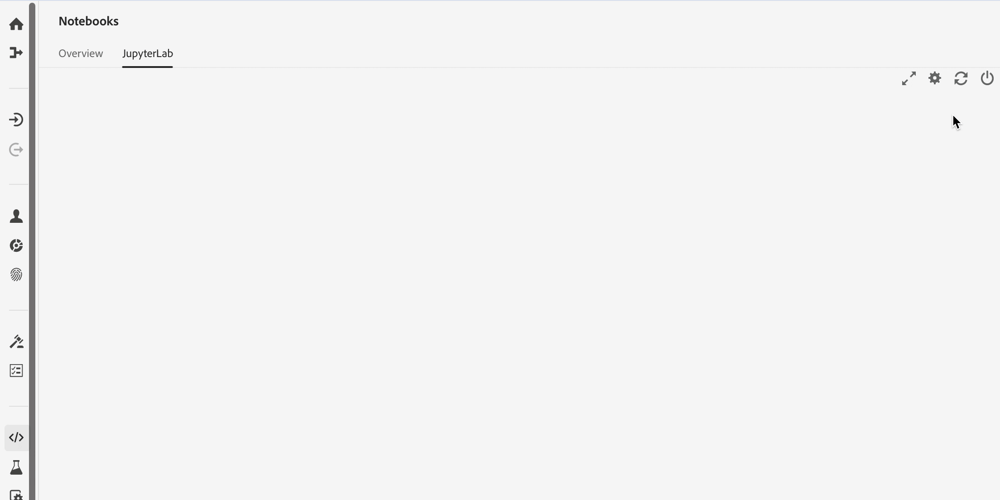

# [!DNL JupyterLab] UI の概要

[!DNL JupyterLab] は、[プロジェクト Jupyter](https://jupyter.org/) の Web ベースのユーザーインターフェイスで、Adobe Experience Platform に緊密に統合されています。データサイエンティストが Jupyter ノートブック、コード、データを操作するための、インタラクティブな開発環境を提供します。

このドキュメントでは、[!DNL JupyterLab] とその機能の概要と、一般的なアクションを実行する手順を説明します。

## [!DNL JupyterLab] on [!DNL Experience Platform]

Experience Platform の JupyterLab 統合には、アーキテクチャの変更、デザイン上の考慮事項、カスタマイズされたノートブック拡張機能、プリインストールされたライブラリ、アドビをテーマにしたインターフェイスが付属しています。

次のリストでは、Platform 上の JupyterLab に固有の機能の一部を説明します。

| 機能 | 説明 |
| --- | --- |
| **カーネル** | カーネルは、ノートブックや他の [!DNL JupyterLab] フロントエンドで、異なるプログラミング言語でコードを実行し、内観する機能を提供します。 [!DNL Experience Platform] は、R、PySpark、およびでの開発をサ [!DNL Python]ポートする追加のカーネルを提供しま [!DNL Spark]す。詳しくは「[カーネル](#kernels)」の節を参照してください。 |
| **データアクセス** | 読み取り/書き込み機能を完全にサポートし、[!DNL JupyterLab] 内から既存のデータセットに直接アクセスします。 |
| **[!DNL Platform]サービス統合** | 組み込みの統合により、[!DNL JupyterLab] 内から直接他の [!DNL Platform] サービスを利用できます。 サポートされる統合の完全なリストは、「[他の Platform サービスとの統合](#service-integration)」の節に記載されています。 |
| **認証** | <a href="https://jupyter-notebook.readthedocs.io/en/latest/security.html" target="_blank">JupyterLab の組み込みのセキュリティモデル</a>に加えて、Platform のサービス間通信を含む、アプリケーションと Experience Platform の間のすべてのやり取りは、<a href="https://www.adobe.io/authentication/auth-methods.html" target="_blank">[!DNL Adobe Identity Management System]（IMS）</a>を通じて暗号化され、認証されます。 |
| **開発ライブラリ** | [!DNL Experience Platform] では、[!DNL JupyterLab] は [!DNL Python]、R および PySpark 用に事前にインストールされたライブラリを提供します。 サポートされているライブラリの完全なリストについては、[付録](#supported-libraries)を参照してください。 |
| **ライブラリコントローラー** | 事前にインストールされたライブラリがニーズに合わない場合は、Python と R 用に追加のライブラリをインストールし、[!DNL Platform] の整合性を維持し、データを安全に保つために、一時的に分離されたコンテナに保存します。 詳しくは「[カーネル](#kernels)」の節を参照してください。 |

>[!NOTE]
>
> 追加のライブラリは、インストールされたセッションでのみ使用できます。新しいセッションを開始する際に必要な追加のライブラリを再インストールする必要があります。

## 他の [!DNL Platform] サービスとの統合 {#service-integration}

標準化と相互運用性は、[!DNL Experience Platform] の背後にある重要な概念です。[!DNL JupyterLab] を組み込み IDE として [!DNL Platform] に統合すると、他の [!DNL Platform] サービスとのやり取りが可能になり、[!DNL Platform] を最大限に活用できます。 [!DNL JupyterLab] では、次の [!DNL Platform] サービスを利用できます。

* **[!DNL Catalog Service]:** 読み取り/書き込み機能を使用して、データセットにアクセスし、調査します。
* **[!DNL Query Service]:** SQL を使用してデータセットにアクセスし、調査し、大量のデータを処理する際に、データアクセスのオーバーヘッドを低減できます。
* **[!DNL Sensei ML Framework]:** データのトレーニングとスコア、および 1 回のクリックでレシピを作成できるモデル開発。
* **[!DNL Experience Data Model (XDM)]:** 標準化と相互運用性は、Adobe Experience Platformの背後にある重要な概念です。[Adobeが推進するエクスペリエンスデータモデル (XDM)](https://www.adobe.com/go/xdm-home-en)は、顧客体験データを標準化し、顧客体験管理のスキーマを定義する取り組みです。

>[!NOTE]
>
>[!DNL JupyterLab] 上の [!DNL Platform] サービス統合の一部は、特定のカーネルに限定されています。 詳しくは「[カーネル](#kernels)」の節を参照してください。

## 主な機能と一般的な操作

[!DNL JupyterLab] の主な機能と、共通の操作を実行する手順に関する情報を以下の節で説明します。

* [JupyterLab へのアクセス](#access-jupyterlab)
* [JupyterLab インターフェイス](#jupyterlab-interface)
* [コードセル](#code-cells)
* [カーネル](#kernels)
* [カーネルセッション](#kernel-sessions)
* [ランチャー](#launcher)

### アクセス [!DNL JupyterLab] {#access-jupyterlab}

[Adobe Experience Platform](https://platform.adobe.com) で、左側のナビゲーション列から「**[!UICONTROL ノートブック]**」を選択します。 [!DNL JupyterLab] が完全に初期化されるまでしばらく待ちます。

### [!DNL JupyterLab] インターフェイス {#jupyterlab-interface}

[!DNL JupyterLab] インターフェイスは、メニューバー、折りたたみ可能な左サイドバー、およびドキュメントやアクティビティのタブを含むメイン作業領域で構成されます。

**メニューバー**

インターフェイスの上部にあるメニューバーには、[!DNL JupyterLab] で使用可能なアクションをキーボードショートカットで公開するトップレベルのメニューがあります。

* **ファイル**：ファイルとディレクトリに関連するアクション
* **編集**：編集に関するアクションおよびドキュメントのアクティビティ
* **表示** ： の外観を変更するアクション[!DNL JupyterLab]
* **実行**：ノートブックやコードコンソールなど、異なるアクティビティでコードを実行するアクション
* **カーネル** ：カーネル管理のアクション
* **タブ**：開いているドキュメントとアクティビティのリスト
* **設定**：共通設定と詳細設定エディター
* **ヘルプ**[!DNL JupyterLab]： とカーネルのヘルプリンクのリスト

**左サイドバー**

左側のサイドバーには、次の機能にアクセスできるクリック可能なタブが含まれています。

* **ファイルブラウザー**：保存されたノートブックドキュメントとディレクトリのリスト
* **データエクスプローラー**：データセットとスキーマ
* **カーネルとターミナルの実行**：終了する機能を持つアクティブなカーネルとターミナルセッションのリスト
* **コマンド**：便利なコマンドのリスト
* **セルインスペクター** ：プレゼンテーション用にノートブックを設定する際に役立つツールやメタデータにアクセスできるセルエディター。
* **タブ**：開いたタブのリスト

タブを選択してその機能を表示するか、展開されたタブでを選択して左側のサイドバーを折りたたみます。以下に例を示します。

**メイン作業領域**

[!DNL JupyterLab] のメイン作業領域を使用すると、ドキュメントやその他のアクティビティを、サイズ変更や分割が可能なタブのパネルに配置できます。 タブをタブパネルの中央にドラッグして、タブを移行します。タブをパネルの左、右、上または下にドラッグして、パネルを分割します。

### [!DNL Python]/R での GPU とメモリサーバーの設定

[!DNL JupyterLab] で、右上隅の歯車アイコンを選択して、*ノートブックサーバー設定* を開きます。 GPU をオンに切り替え、スライダーを使用して必要なメモリ量を割り当てることができます。 割り当て可能なメモリの量は、組織でプロビジョニングされているメモリの量によって異なります。 「**[!UICONTROL 設定を更新]**」を選択して保存します。

>[!NOTE]
>
>ノートブック用にプロビジョニングされる GPU は 1 組織につき 1 つだけです。 GPU が使用中の場合は、現在 GPU を予約しているユーザーが GPU を解放するのを待つ必要があります。 これは、GPU をログアウトするか、4 時間以上アイドル状態のままにすることで実行できます。

### 終了して [!DNL JupyterLab] を再起動

[!DNL JupyterLab] では、セッションを終了して、それ以上のリソースが使用されないようにすることができます。 まず **電源アイコン**  を選択し、表示されるポップオーバーから「**[!UICONTROL シャットダウン]**」を選択してセッションを終了します。 ノートブックセッションは、12 時間操作が行われなかった後、自動的に終了します。

[!DNL JupyterLab] を再起動するには、電源アイコンのすぐ左にある **再起動アイコン**  を選択し、表示されるポップオーバーから **[!UICONTROL 再起動]** を選択します。

### コードセル {#code-cells}

コードセルは、ノートブックの主なコンテンツです。これらには、ノートブックの関連カーネルの言語のソースコードと、コードセルを実行した結果の出力が含まれています。実行回数は、実行順序を表す各コードセルの右側に表示されます。

一般的なセルのアクションを以下に示します。

* **セルの追加**：ノートブックメニューのプラス記号（**+**）をクリックして、空のセルを追加します。新しいセルは、現在操作中のセルの下に配置されます。特定のセルにフォーカスがない場合は、ノートブックの最後に配置されます。

* **セルの移動**：移動するセルの右側にカーソルを置き、セルをクリックして新しい位置にドラッグします。また、あるノートブックから別のノートブックにセルを移動すると、セルとその内容が複製されます。

* **セルの実行**：実行するセルのボディをクリックし、ノートブックメニューの&#x200B;**再生**&#x200B;アイコン（**▶**）をクリックします。カーネルが実行を処理する際には、セルの実行カウンターにアスタリスク（**\***）が表示され、完了時には整数に置き換えられます。

* **セルの削除**：削除するセルのボディをクリックし、**はさみ**&#x200B;アイコンをクリックします。

### カーネル {#kernels}

ノートのカーネルは、ノートのセルを処理するための言語固有のコンピューティングエンジンです。[!DNL Python] に加えて、[!DNL JupyterLab] は R、PySpark、および [!DNL Spark](Scala) で追加の言語サポートを提供します。 ノートブックドキュメントを開くと、関連するカーネルが起動します。ノートブックセルが実行されると、カーネルは計算をおこない、結果を生成し、CPU やメモリリソースを大量に消費する可能性があります。割り当てたメモリは、カーネルがシャットダウンされるまで解放されないことに注意してください。

特定の機能は、以下の表で説明するように、特定のカーネルに限定されています。

| カーネル | ライブラリのインストールサポート | [!DNL Platform] 統合 |
| :----: | :--------------------------: | :-------------------- |
| **[!DNL Python]** | ○ | <ul><li>[!DNL Sensei ML Framework]</li><li>[!DNL Catalog Service]</li><li>[!DNL Query Service]</li></ul> |
| **R** | ○ | <ul><li>[!DNL Sensei ML Framework]</li><li>[!DNL Catalog Service]</li></ul> |
| **Scala** | × | <ul><li>[!DNL Sensei ML Framework]</li><li>[!DNL Catalog Service]</li></ul> |

### カーネルセッション {#kernel-sessions}

[!DNL JupyterLab] 上のアクティブなノートブックまたはアクティビティは、それぞれカーネルセッションを利用します。 すべてのアクティブなセッションは、左側のサイドバーから「**実行中の端末とカーネル**」タブを展開すると見つかります。ノートブックのカーネルのタイプと状態は、ノートブックのインターフェースの右上を見ることで識別できます。下の図では、ノートブックに関連するカーネルは **[!DNL Python]3** で、現在の状態は右側に灰色の円で表されています。中空の円はアイドルカーネルを意味し、実円はビジーカーネルを意味します。

カーネルがシャットダウンされたり、長時間非アクティブになったりした場合は、**カーネルなし！** が実円と表示されます。カーネルの状態をクリックし、以下に示すように適切なカーネルタイプを選択して、カーネルをアクティブにします。

### ランチャー {#launcher}

[//]: # (Talk about the different Notebooks, introduce that certain starter notebooks are limited to particular kernels)

カスタマイズされた *Launcher* は、次のような、サポートされているカーネル用の便利なノートブックテンプレートを提供し、タスクを開始するのに役立ちます。

| テンプレート | 説明 |
| --- | --- |
| 空白 | 空のノートブックファイル。 |
| スターター | サンプルデータを使用したデータ調査を示す、事前入力済みのノートブック。 |
| 小売売上 | サンプルデータを使用した [ 小売販売のレシピ ](https://docs.adobe.com/content/help/ja-JP/experience-platform/data-science-workspace/home.translate.html#!api-specification/markdown/narrative/technical_overview/data_science_workspace_overview/dsw_prebuilt_recipes/retail_sales_recipe/retail_sales_recipe.md) を含む事前入力済みのノートブック。 |
| レシピビルダー | [!DNL JupyterLab] でレシピを作成するためのノートブックテンプレート。 レシピの作成プロセスを示し、説明するコードとコメントが事前に記入されています。詳細な順を追った説明については、『[ノートブックのレシピチュートリアル](https://docs.adobe.com/content/help/ja-JP/experience-platform/data-science-workspace/jupyterlab/create-a-recipe.html)』を参照してください。 |
| [!DNL Query Service] | [!DNL JupyterLab] 内で直接 [!DNL Query Service] を使用する方法を示す、大規模なデータ分析を行うサンプルワークフローを備えた事前入力済みのノートブック。 |
| XDM イベント | データ構造全体に共通の機能に焦点を当てた、ポストバリューエクスペリエンスイベントデータのデータ探索を示す、事前入力済みのノートブック。 |
| XDM クエリ | エクスペリエンスのイベントデータに関するサンプルのビジネスクエリを示す、事前入力済みのノートブック。 |
| 集計 | 大量のデータをより小さく管理しやすいチャンクに集約するサンプルワークフローを示す、事前入力済みのノートブック。 |
| クラスタリング | クラスタリングアルゴリズムを使用したエンドツーエンドの機械学習モデリングプロセスを示す、事前入力済みのノートブック。 |

一部のノートブックテンプレートは、特定のカーネルに限定されています。各カーネルのテンプレートの可用性は、次の表にマッピングされます。

<table>
    <tr>
        <td></td>
        <th><strong>空白</strong></th>
        <th><strong>スターター</strong></th>
        <th><strong>小売売上</strong></th>
        <th><strong>レシピビルダー</strong></th>
        <th><strong>[!DNL Query Service]</strong></th>
        <th><strong>XDM イベント</strong></th>
        <th><strong>XDM クエリ</strong></th>
        <th><strong>集計</strong></th>
        <th><strong>クラスタリング</strong></th>
    </tr>
    <tr>
        <th><strong>[!DNL Python]</strong></th>
        <td >○</td>
        <td >○</td>
        <td >○</td>
        <td >○</td>
        <td >○</td>
        <td >○</td>
        <td >いいえ</td>
        <td >いいえ</td>
        <td >いいえ</td>
    </tr>
    <tr>
        <th ><strong>R</strong></th>
        <td >○</td>
        <td >○</td>
        <td >○</td>
        <td >いいえ</td>
        <td >いいえ</td>
        <td >いいえ</td>
        <td >いいえ</td>
        <td >いいえ</td>
        <td >いいえ</td>
    </tr>
      <tr>
        <th  ><strong>PySpark 3 ([!DNL Spark] 2.4)</strong></th>
        <td >いいえ</td>
        <td >○</td>
        <td >いいえ</td>
        <td >いいえ</td>
        <td >いいえ</td>
        <td >いいえ</td>
        <td >○</td>
        <td >○</td>
        <td >いいえ</td>
    </tr>
    <tr>
        <th ><strong>Scala</strong></th>
        <td >○</td>
        <td >○</td>
        <td >いいえ</td>
        <td >いいえ</td>
        <td >いいえ</td>
        <td >いいえ</td>
        <td >いいえ</td>
        <td >いいえ</td>
        <td >○</td>
    </tr>
</table>

新しい&#x200B;*ランチャー*&#x200B;を開くには、**ファイル／新規ランチャー**&#x200B;をクリックします。または、左のサイドバーで&#x200B;**ファイルブラウザー**&#x200B;を展開し、プラス記号（**+**）をクリックします。

## 次の手順

サポートされている各ノートブックとその使用方法について詳しくは、[Jupyterlab ノートブックデータアクセス ](./access-notebook-data.md) 開発者ガイドを参照してください。 このガイドでは、JupyterLab ノートブックを使用して、データの読み取り、書き込み、クエリなど、データにアクセスする方法に焦点を当てています。 データアクセスガイドには、サポートされている各ノートブックで読み取れる最大データ量に関する情報も含まれています。

## サポートされるライブラリ {#supported-libraries}

Python、R および PySpark でサポートされているパッケージのリストを表示するには、`!conda list` を新しいセルにコピーして貼り付け、セルを実行します。 サポートされているパッケージのリストが、アルファベット順に入力されます。

さらに、次の依存関係が使用されますが、一覧には表示されません。
* CUDA 11.2
* CUDN 8.1

