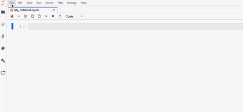

# [!DNL JupyterLab] UI の概要

[!DNL JupyterLab] は、[プロジェクト Jupyter](https://jupyter.org/) の web ベースのユーザーインターフェイスで、Adobe Experience Platform に緊密に統合されています。これは、データサイエンティストが Jupyter Notebook、コードおよびデータを扱うためのインタラクティブな開発環境を提供します。

このドキュメントでは、[!DNL JupyterLab] とその機能の概要のほか、一般的なアクションを実行する手順を説明します。

## [!DNL Experience Platform] 上の [!DNL JupyterLab]

Experience Platform の JupyterLab 統合には、アーキテクチャの変更、デザイン上の考慮事項、カスタマイズされたノートブック拡張機能、プリインストールされたライブラリ、アドビをテーマにしたインターフェイスが付属しています。

次のリストでは、Platform 上の JupyterLab に固有の機能の一部を説明します。

| 機能 | 説明 |
| --- | --- |
| **カーネル** | カーネルは、ノートブックや他の [!DNL JupyterLab] フロントエンドに、様々なプログラミング言語のコードの実行およびイントロスペクション機能を提供します。[!DNL Experience Platform] には、[!DNL Python]、R、PySpark および [!DNL Spark] での開発をサポートする追加のカーネルが用意されています。詳しくは「[カーネル](#kernels)」の節を参照してください。 |
| **データアクセス** | 読み取り／書き込み機能を完全にサポートし、既存のデータセットに [!DNL JupyterLab] 内から直接アクセスできます。 |
| **[!DNL Platform]サービスの統合** | 組み込み統合により、[!DNL JupyterLab] 内から他の [!DNL Platform] サービスを直接利用できます。サポートされる統合の完全なリストは、「[他の Platform サービスとの統合](#service-integration)」の節に記載されています。 |
| **認証** | <a href="https://jupyter-notebook.readthedocs.io/en/stable/security.html" target="_blank">JupyterLab の組み込みのセキュリティモデル</a>に加えて、Platform のサービス間通信を含む、アプリケーションと Experience Platform の間のすべてのやり取りは、<a href="https://www.adobe.io/authentication/auth-methods.html" target="_blank">[!DNL Adobe Identity Management System]（IMS）</a>を通じて暗号化され、認証されます。 |
| **開発ライブラリ** |  [!DNL Experience Platform] では、[!DNL JupyterLab] は [!DNL Python]、R、および PySpark 用のプリインストールされたライブラリを提供します。サポートされているライブラリの完全なリストについては、[付録](#supported-libraries)を参照してください。 |
| **ライブラリコントローラー** | プリインストールされたライブラリがニーズを満たさない場合は、Python と R 用に追加のライブラリをインストールできます。追加したライブラリは、[!DNL Platform] の整合性を維持しデータを安全に保つために、分離されたコンテナに一時的に保存されます。詳しくは、[カーネル](#kernels)の節を参照してください。 |

>[!NOTE]
>
> 追加のライブラリは、インストールされたセッションでのみ使用できます。新しいセッションを開始する際に、必要な追加のライブラリを再インストールする必要があります。

## 他の [!DNL Platform] サービスとの統合 {#service-integration}

標準化と相互運用性は、[!DNL Experience Platform] を支える重要な概念です。[!DNL Platform] 上の [!DNL JupyterLab] を組み込み IDE として統合することで、他の [!DNL Platform] サービスとのやり取りが可能になり、[!DNL Platform] を最大限に活用できます。[!DNL JupyterLab] では、次の [!DNL Platform] サービスを使用できます。

* **[!DNL Catalog Service]：**&#x200B;読み取りおよび書き込み機能でデータセットにアクセスし調査します。
* **[!DNL Query Service]：** SQL を使用してデータセットにアクセスし調査します。大量のデータを処理する際に、データアクセスのオーバーヘッドが低くなります。
* **[!DNL Sensei ML Framework]：**&#x200B;データのトレーニングおよびスコアリング機能を備え、1 回のクリックでレシピを作成できるモデル開発。
* **[!DNL Experience Data Model (XDM)]：**&#x200B;標準化と相互運用性は、Adobe Experience Platform を支える重要な概念です。アドビが推進する[エクスペリエンスデータモデル（XDM）](https://experienceleague.adobe.com/docs/experience-platform/xdm/home.html?lang=ja)は、カスタマーエクスペリエンスデータを標準化し、カスタマーエクスペリエンス（顧客体験）管理のスキーマを定義する取り組みです。

>[!NOTE]
>
> [!DNL JupyterLab] での一部の [!DNL Platform] サービス統合は、特定のカーネルに限定されています。詳しくは「[カーネル](#kernels)」の節を参照してください。

## 主な機能と一般的な操作

[!DNL JupyterLab] の主な機能と、一般的な操作を実行する手順について以下の節で説明します。

* [JupyterLab へのアクセス](#access-jupyterlab)
* [JupyterLab インターフェイス](#jupyterlab-interface)
* [コードセル](#code-cells)
* [カーネル](#kernels)
* [カーネルセッション](#kernel-sessions)
* [ランチャー](#launcher)

### [!DNL JupyterLab] へのアクセス {#access-jupyterlab}

[Adobe Experience Platform](https://platform.adobe.com) で、左側のナビゲーションの&#x200B;**[!UICONTROL ノートブック]**&#x200B;を選択します。 [!DNL JupyterLab] が完全に初期化されるまでしばらく待ちます。

### [!DNL JupyterLab] インターフェイス {#jupyterlab-interface}

[!DNL JupyterLab] インターフェイスは、メニューバー、折りたたみ可能な左サイドバー、および「ドキュメント」タブと「アクティビティ」タブを含んだメイン作業領域で構成されます。

**メニューバー**

インターフェイスの上部にあるメニューバーには、[!DNL JupyterLab] で使用可能なアクションをキーボードショートカットで公開する最上位のメニューがあります。

* **ファイル**：ファイルとディレクトリに関連するアクション
* **編集**：編集に関するアクションおよびドキュメントのアクティビティ
* **表示**：[!DNL JupyterLab] の外観を変更するアクション
* **実行**：ノートブックやコードコンソールなど、異なるアクティビティでコードを実行するアクション
* **カーネル** ：カーネル管理のアクション
* **タブ**：開いているドキュメントとアクティビティのリスト
* **設定**：共通設定と詳細設定エディター
* **ヘルプ**：[!DNL JupyterLab] とカーネルのヘルプリンクのリスト

**左サイドバー**

左側のサイドバーには、次の機能にアクセスできるクリック可能なタブが含まれています。

* **ファイルブラウザー**：保存されたノートブックドキュメントとディレクトリのリスト
* **データエクスプローラー**：データセットとスキーマ
* **カーネルとターミナルの実行**：終了する機能を持つアクティブなカーネルとターミナルセッションのリスト
* **コマンド**：便利なコマンドのリスト
* **セルインスペクター** ：プレゼンテーション用にノートブックを設定する際に役立つツールやメタデータにアクセスできるセルエディター。
* **タブ**：開いたタブのリスト

タブを選択してその機能を表示するか、展開されたタブを選択して、以下に示すように左側のサイドバーを折りたたみます。

**メイン作業領域**

[!DNL JupyterLab] のメインの作業領域では、ドキュメントやその他のアクティビティを、サイズ変更または分割可能なタブのパネルに配置できます。タブをタブパネルの中央にドラッグして、タブを移行します。タブをパネルの左、右、上または下にドラッグして、パネルを分割します。

### [!DNL Python]/R での GPU とメモリサーバーの設定

[!DNL JupyterLab] で、右上隅の歯車アイコンを選択して、*Notebook サーバー設定*&#x200B;を開きます。GPU をオンに切り替えたり、スライダーを使用して必要な量のメモリを割り当てたりできます。割り当てることができるメモリの量は、組織がプロビジョニングした量によって異なります。 「**[!UICONTROL 設定を更新]**」を選択して保存します。

>[!NOTE]
>
>Notebooks の組織ごとにプロビジョニングされる GPU は 1 つだけです。 GPU が使用中の場合は、現在 GPU を予約しているユーザーによって解放されるまで待つ必要があります。これは、ログアウトするか、GPU を 4 時間以上アイドル状態のままにしておくことで実行できます。

### [!DNL JupyterLab] の終了と再起動

[!DNL JupyterLab] では、それ以上リソースを使用しないよう、セッションを終了することができます。**電源アイコン**  を選択して開始し、表示されるポップオーバーから「**[!UICONTROL シャットダウン]**」を選択してセッションを終了します。Notebook セッションは、12 時間操作がないと自動的に終了します。

[!DNL JupyterLab] を再起動するには、電源アイコンのすぐ左にある&#x200B;**再起動アイコン**  を選択し、表示されるポップオーバーから「**[!UICONTROL 再起動]**」を選択します。

### コードセル {#code-cells}

コードセルは、ノートブックの主なコンテンツです。これらには、ノートブックの関連カーネルの言語のソースコードと、コードセルを実行した結果の出力が含まれています。実行回数は、実行順序を表す各コードセルの右側に表示されます。

一般的なセルのアクションを以下に示します。

* **セルの追加**：ノートブックメニューのプラス記号（**+**）をクリックして、空のセルを追加します。新しいセルは、現在操作中のセルの下に配置されます。特定のセルにフォーカスがない場合は、ノートブックの最後に配置されます。

* **セルの移動**：移動するセルの右側にカーソルを置き、セルをクリックして新しい位置にドラッグします。また、あるノートブックから別のノートブックにセルを移動すると、セルとその内容が複製されます。

* **セルの実行**：実行するセルのボディをクリックし、ノートブックメニューの&#x200B;**再生**&#x200B;アイコン（**▶**）をクリックします。カーネルが実行を処理する際には、セルの実行カウンターにアスタリスク（**\***）が表示され、完了時には整数に置き換えられます。

* **セルの削除**：削除するセルのボディをクリックし、**はさみ**&#x200B;アイコンをクリックします。

### カーネル {#kernels}

ノートのカーネルは、ノートのセルを処理するための言語固有のコンピューティングエンジンです。[!DNL Python] に加えて、[!DNL JupyterLab] は R、PySpark、[!DNL Spark]（Scala）で追加の言語サポートを提供します。ノートブックドキュメントを開くと、関連するカーネルが起動します。ノートブックセルが実行されると、カーネルは計算をおこない、結果を生成し、CPU やメモリリソースを大量に消費する可能性があります。割り当てられたメモリは、カーネルがシャットダウンされるまで解放されません。

特定の機能は、以下の表で説明するように、特定のカーネルに限定されています。

| カーネル | ライブラリのインストールサポート | [!DNL Platform] 統合 |
| :----: | :--------------------------: | :-------------------- |
| **[!DNL Python]** | ○ | <ul><li>[!DNL Sensei ML Framework]</li><li>[!DNL Catalog Service]</li><li>[!DNL Query Service]</li></ul> |
| **R** | ○ | <ul><li>[!DNL Sensei ML Framework]</li><li>[!DNL Catalog Service]</li></ul> |
| **Scala** | いいえ | <ul><li>[!DNL Sensei ML Framework]</li><li>[!DNL Catalog Service]</li></ul> |

### カーネルセッション {#kernel-sessions}

[!DNL JupyterLab] のアクティブなノートブックまたはアクティビティはそれぞれ、カーネルセッションを使用します。すべてのアクティブなセッションは、左側のサイドバーから「**実行中の端末とカーネル**」タブを展開すると見つかります。ノートブックのカーネルのタイプと状態は、ノートブックのインターフェースの右上を見ることで識別できます。下の図では、ノートブックに関連するカーネルは **[!DNL Python]3** で、現在の状態は右側に灰色の円で表されています。白い円はアイドルカーネル、黒い円はビジーカーネルを意味します。

カーネルが長期間シャットダウンされている、非アクティブとなっている場合、**カーネルがありません。** が実円と表示されます。カーネルの状態をクリックし、以下に示すように適切なカーネルタイプを選択して、カーネルをアクティブにします。

### ランチャー {#launcher}

[//]: # (Talk about the different Notebooks, introduce that certain starter notebooks are limited to particular kernels)

カスタマイズされた *Launcher* は、次のような、サポートされているカーネル用の便利なノートブックテンプレートを提供し、タスクを開始するのに役立ちます。

| テンプレート | 説明 |
| --- | --- |
| 空白 | 空のノートブックファイル。 |
| スターター | サンプルデータを使用したデータ調査を示す、事前入力済みのノートブック。 |
| 小売売上 | サンプルデータを使用した[小売販売レシピ](../pre-built-recipes/retail-sales.md)が表示されている、事前入力済みのノートブック。 |
| レシピビルダー | [!DNL JupyterLab] でレシピを作成するためのノートブックテンプレート。レシピの作成プロセスを示し、説明するコードとコメントが事前に記入されています。詳細な順を追った説明については、『[ノートブックのレシピチュートリアル](https://experienceleague.adobe.com/docs/experience-platform/data-science-workspace/jupyterlab/create-a-model.html?lang=ja)』を参照してください。 |
| [!DNL Query Service] | [!DNL Query Service] を [!DNL JupyterLab] で直接使用する方法を示し、データを大規模に分析するサンプルワークフローが提供された、事前入力済みのノートブック。 |
| XDM イベント | データ構造全体に共通の機能に焦点を当てた、ポストバリューエクスペリエンスイベントデータのデータ探索を示す、事前入力済みのノートブック。 |
| XDM クエリ | エクスペリエンスのイベントデータに関するサンプルのビジネスクエリを示す、事前入力済みのノートブック。 |
| 集計 | 大量のデータをより小さく管理しやすいチャンクに集約するサンプルワークフローを示す、事前入力済みのノートブック。 |
| クラスタリング | クラスタリングアルゴリズムを使用したエンドツーエンドの機械学習モデリングプロセスを示す、事前入力済みのノートブック。 |

一部のノートブックテンプレートは、特定のカーネルに限定されています。各カーネルのテンプレートの可用性は、次の表にマッピングされます。

<table>
    <tr>
        <td></td>
        <th><strong>空白</strong></th>
        <th><strong>スターター</strong></th>
        <th><strong>小売売上</strong></th>
        <th><strong>レシピビルダー</strong></th>
        <th><strong>[!DNL Query Service]</strong></th>
        <th><strong>XDM イベント</strong></th>
        <th><strong>XDM クエリ</strong></th>
        <th><strong>集計</strong></th>
        <th><strong>クラスタリング</strong></th>
    </tr>
    <tr>
        <th><strong>[!DNL Python]</strong></th>
        <td >○</td>
        <td >○</td>
        <td >○</td>
        <td >○</td>
        <td >○</td>
        <td >○</td>
        <td >いいえ</td>
        <td >いいえ</td>
        <td >いいえ</td>
    </tr>
    <tr>
        <th ><strong>R</strong></th>
        <td >○</td>
        <td >○</td>
        <td >○</td>
        <td >いいえ</td>
        <td >いいえ</td>
        <td >いいえ</td>
        <td >いいえ</td>
        <td >いいえ</td>
        <td >いいえ</td>
    </tr>
      <tr>
        <th  ><strong>PySpark 3（[!DNL Spark] 2.4）</strong></th>
        <td >いいえ</td>
        <td >○</td>
        <td >いいえ</td>
        <td >いいえ</td>
        <td >いいえ</td>
        <td >いいえ</td>
        <td >○</td>
        <td >○</td>
        <td >いいえ</td>
    </tr>
    <tr>
        <th ><strong>Scala</strong></th>
        <td >○</td>
        <td >○</td>
        <td >いいえ</td>
        <td >いいえ</td>
        <td >いいえ</td>
        <td >いいえ</td>
        <td >いいえ</td>
        <td >いいえ</td>
        <td >○</td>
    </tr>
</table>

新しい&#x200B;*ランチャー*&#x200B;を開くには、**ファイル／新規ランチャー**&#x200B;をクリックします。または、左のサイドバーで&#x200B;**ファイルブラウザー**&#x200B;を展開し、プラス記号（**+**）をクリックします。

## 次の手順

サポートされている各ノートブックの詳細と使用方法については、[Jupyterlab ノートブックのデータアクセス](./access-notebook-data.md)開発者ガイドを確認してください。このガイドでは、JupyterLab ノートブックを使用して、データの読み取りや、書き込み、クエリなど、データへのアクセスを行う方法を中心に取り上げています。 また、このデータアクセスガイドには、サポートされている各ノートブックで読み取り可能なデータの最大量に関する情報も含まれています。

## サポートされるライブラリ {#supported-libraries}

Python、R、PySpark でサポートされているパッケージのリストについては、`!conda list` をコピーして新しいセルに貼り付け、そのセルを実行します。 サポートされているパッケージのリストが、アルファベット順に表示されます。

さらに、次の依存関係が使用されますが、一覧には表示されません。
* CUDA 11.2
* CUDNN 8.1

