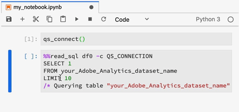

# ジュピターノートのクエリサービス

[!DNL Adobe Experience Platform] 標準機能としてに統合するこ [!DNL Data Science Workspace] とで、で構造化クエリ言語(SQL) [!DNL Query Service] を使用 [!DNL JupyterLab] できます。

このチュートリアルでは、 [!DNL Adobe Analytics] データの調査、変換、分析を行う一般的な使用例のサンプルSQLクエリを示します。

## はじめに

このチュートリアルを開始する前に、次の前提条件を満たす必要があります。

- へのアクセス [!DNL Adobe Experience Platform]。 でIMS組織にアクセスできない場合は、次に進む前にシステム管理者にお問い合わせ [!DNL Experience Platform]ください。

- データ [!DNL Adobe Analytics] セット

- このチュートリアルで使用する次の主要概念の実際の理解
   - [!DNL Experience Data Model (XDM) and XDM System](../../xdm/home.md)
   - [!DNL Query Service](../../query-service/home.md)
   - [!DNL Query Service SQL Syntax](../../query-service/sql/overview.md)
   - [Adobe Analytics]

## アクセス [!DNL JupyterLab] および [!DNL Query Service] {#access-jupyterlab-and-query-service}

1. で、左 [!DNL Experience Platform](https://platform.adobe.com)のナビゲーション列から[ **[!UICONTROL ノートブック]** ]に移動します。 JupyterLabが読み込まれるまで、少し時間をお待ちください。

   

   > [!NOTE] 新しい「ランチャー」タブが自動的に表示されなかった場合は、「 **[!UICONTROL ファイル]** 」をクリックして新しい「ランチャー」タブを開き、「 **[!UICONTROL 新規ランチャー」を選択します]**。

2. 「ランチャー」タブで、Python 3環境の **[!UICONTROL 空白]** (Blank)アイコンをクリックして、空のノートブックを開きます。

   

   > [!NOTE] Python 3は、現在、ノートブックのクエリサービスでサポートされている唯一の環境です。

3. 左側の選択レールで、 **[!UICONTROL Data]** アイコンをクリックし、重複で **[!UICONTROL Datasets]** ディレクトリをクリックして、すべてのデータセットをリストします。

   

4. 調査する [!DNL Adobe Analytics] データセットを見つけて、リスト上で右クリックし、[ノートブックの **[!UICONTROL クエリデータ]** ]をクリックして空のノートブックにSQLクエリを生成します。

5. 関数を含む最初に生成されたセルをクリックし `qs_connect()` 、再生ボタンをクリックして実行します。 この関数は、ノートブックインスタンスとの間に接続を作成し [!DNL Query Service]ます。

   

6. 2番目に生成されたSQLクエリから [!DNL Adobe Analytics] データセット名をコピーします。この名前は、の後の値になり `FROM`ます。

   

7. [ **+]** ボタンをクリックして、新しいノートブックのセルを挿入します。

   

8. 次のインポート・ステートメントを新しいセルにコピー、貼り付け、実行します。 以下の文は、データを視覚化するために使用されます。

   ```python
   import plotly.plotly as py
   import plotly.graph_objs as go
   from plotly.offline import iplot
   ```

9. 次に、次の変数をコピーして新しいセルに貼り付けます。 必要に応じて値を変更し、実行します。

   ```python
   target_table = "your Adobe Analytics dataset name"
   target_year = "2019"
   target_month = "04"
   target_day = "01"
   ```

   - `target_table` : データ [!DNL Adobe Analytics] セットの名前。
   - `target_year` : ターゲットデータの元となる特定の年。
   - `target_month` : ターゲットの開始月を指定します。
   - `target_day` : ターゲットデータの元となる特定の日。

   >[!NOTE] これらの値はいつでも変更できます。 変更を適用する場合は、必ず変数セルを実行し、変更を適用してください。

## データのクエリ {#query-your-data}

個々のノートブック・セルに次のSQLクエリを入力します。 クエリを実行するには、セルをクリックし、 **[!UICONTROL 再生]** ボタンをクリックします。 正常なクエリ結果またはエラーログが、実行されたセルの下に表示されます。

ノートブックが長時間非アクティブになると、ノートブックとの接続が切断され [!DNL Query Service] る場合があります。 その場合は、右上隅にある [!DNL JupyterLab] 電源 **** ボタンをクリックして再起動します。


ノートブックのカーネルはリセットされますが、セルは残ります。 **[!UICONTROL すべてのセルを再実行し]** 、離れた場所に移動します。

### 時間別訪問者数 {#hourly-visitor-count}

次のクエリは、指定した日付の時間別訪問者数を返します。

#### クエリ

```sql
%%read_sql hourly_visitor -c QS_CONNECTION
SELECT Substring(timestamp, 1, 10)                               AS Day,
       Substring(timestamp, 12, 2)                               AS Hour, 
       Count(DISTINCT concat(enduserids._experience.aaid.id, 
                             _experience.analytics.session.num)) AS Visit_Count 
FROM   {target_table}
WHERE _acp_year = {target_year} 
      AND _acp_month = {target_month}  
      AND _acp_day = {target_day}
GROUP  BY Day, Hour
ORDER  BY Hour;
```

上記のクエリでは、 `_acp_year` 節のターゲットがの値に設定され `WHERE``target_year`ます。 変数を波括弧(`{}`)で囲んで、SQLクエリに含めます。

クエリの最初の行には、オプションの変数が含まれ `hourly_visitor`ます。 クエリの結果は、この変数にPandasのデータフレームとして保存されます。 結果をデータフレームに保存すると、目的の [!DNL Python] パッケージを使用して、後でクエリ結果を視覚化できます。 新しいセルで次の [!DNL Python] コードを実行して、棒グラフを生成します。

```python
trace = go.Bar(
    x = hourly_visitor['Hour'],
    y = hourly_visitor['Visit_Count'],
    name = "Visitor Count"
)
layout = go.Layout(
    title = 'Visit Count by Hour of Day',
    width = 1200,
    height = 600,
    xaxis = dict(title = 'Hour of Day'),
    yaxis = dict(title = 'Count')
)
fig = go.Figure(data = [trace], layout = layout)
iplot(fig)
```

### 時間別アクティビティ数 {#hourly-activity-count}

次のクエリは、指定した日付の時間別アクション数を返します。

#### クエリ <!-- omit in toc -->

```sql
%%read_sql hourly_actions -d -c QS_CONNECTION
SELECT Substring(timestamp, 1, 10)                        AS Day,
       Substring(timestamp, 12, 2)                        AS Hour, 
       Count(concat(enduserids._experience.aaid.id, 
                    _experience.analytics.session.num,
                    _experience.analytics.session.depth)) AS Count 
FROM   {target_table}
WHERE  _acp_year = {target_year} 
       AND _acp_month = {target_month}  
       AND _acp_day = {target_day}
GROUP  BY Day, Hour
ORDER  BY Hour;
```

上記のクエリを実行すると、結果がデータフレーム `hourly_actions` として保存されます。 新しいセルで次の関数を実行して、結果をプレビューします。

```python
hourly_actions.head()
```

上記のクエリを変更して、 **WHERE** 節の論理演算子を使用して、指定した日付範囲に対して時間別のアクション数を返すことができます。

#### クエリ <!-- omit in toc -->

```sql
%%read_sql hourly_actions_date_range -d -c QS_CONNECTION
SELECT Substring(timestamp, 1, 10)                        AS Day,
       Substring(timestamp, 12, 2)                        AS Hour, 
       Count(concat(enduserids._experience.aaid.id, 
                    _experience.analytics.session.num,
                    _experience.analytics.session.depth)) AS Count 
FROM   {target_table}
WHERE  timestamp >= TO_TIMESTAMP('2019-06-01 00', 'YYYY-MM-DD HH')
       AND timestamp <= TO_TIMESTAMP('2019-06-02 23', 'YYYY-MM-DD HH')
GROUP  BY Day, Hour
ORDER  BY Hour;
```

変更したクエリを実行すると、結果がデータフレーム `hourly_actions_date_range` として保存されます。 新しいセルで次の関数を実行して、結果をプレビューします。

```python
hourly_actions_date_rage.head()
```

### 訪問者セッションあたりのイベント数 {#number-of-events-per-visitor-session}

次のクエリは、指定した日付に対する訪問者セッションあたりのイベント数を返します。

#### クエリ <!-- omit in toc -->

```sql
%%read_sql events_per_session -c QS_CONNECTION
SELECT concat(enduserids._experience.aaid.id, 
              '-#', 
              _experience.analytics.session.num) AS aaid_sess_key, 
       Count(timestamp)                          AS Count 
FROM   {target_table}
WHERE  _acp_year = {target_year} 
       AND _acp_month = {target_month}  
       AND _acp_day = {target_day}
GROUP BY aaid_sess_key
ORDER BY Count DESC;
```

次の [!DNL Python] コードを実行して、訪問セッションあたりのイベント数のヒストグラムを生成します。

```python
data = [go.Histogram(x = events_per_session['Count'])]

layout = go.Layout(
    title = 'Histogram of Number of Events per Visit Session',
    xaxis = dict(title = 'Number of Events'),
    yaxis = dict(title = 'Count')
)

fig = go.Figure(data = data, layout = layout)
iplot(fig)
```

### 特定の日の人気のあるページ {#popular-pages-for-a-given-day}

次のクエリは、指定した日付に対して、最頻訪問ページ10ページを返します。

#### クエリ <!-- omit in toc -->

```sql
%%read_sql popular_pages -c QS_CONNECTION
SELECT web.webpagedetails.name                 AS Page_Name, 
       Sum(web.webpagedetails.pageviews.value) AS Page_Views 
FROM   {target_table}
WHERE  _acp_year = {target_year}
       AND _acp_month = {target_month}
       AND _acp_day = {target_day}
GROUP  BY web.webpagedetails.name 
ORDER  BY page_views DESC 
LIMIT  10;
```

### 特定の日のアクティブなユーザー {#active-users-for-a-given-day}

次のクエリは、指定した日付に対して最もアクティブなユーザー10人を返します。

#### クエリ <!-- omit in toc -->

```sql
%%read_sql active_users -c QS_CONNECTION
SELECT enduserids._experience.aaid.id AS aaid, 
       Count(timestamp)               AS Count
FROM   {target_table}
WHERE  _acp_year = {target_year}
       AND _acp_month = {target_month}
       AND _acp_day = {target_day}
GROUP  BY aaid
ORDER  BY Count DESC
LIMIT  10;
```

### ユーザーアクティビティ別のアクティブな市区町村 {#active-cities-by-user-activity}

次のクエリは、指定した日付に対して、ユーザーアクティビティの大部分を生み出している10の市区町村を返します。

#### クエリ <!-- omit in toc -->

```sql
%%read_sql active_cities -c QS_CONNECTION
SELECT concat(placeContext.geo.stateProvince, ' - ', placeContext.geo.city) AS state_city, 
       Count(timestamp)                                                     AS Count
FROM   {target_table}
WHERE  _acp_year = {target_year}
       AND _acp_month = {target_month}
       AND _acp_day = {target_day}
GROUP  BY state_city
ORDER  BY Count DESC
LIMIT  10;
```

## 次の手順 <!-- omit in toc -->

このチュートリアルでは、ノートブックで使用する場合の使用例 [!DNL Query Service] をいくつか示しました [!DNL Jupyter] 。 「Jupyter Notebooks [(ジャプターノートブックを使用したデータの](./analyze-your-data.md) 分析)」チュートリアルに従って、データアクセスSDKを使用して同様の操作がどの程度実行されているかを確認します。