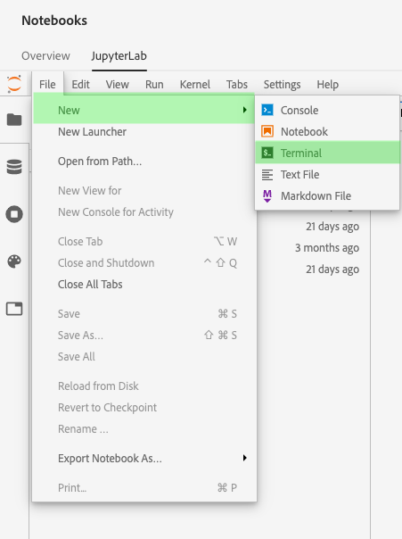

# [!DNL Git] を使用した [!DNL JupyterLab] での共同作業

[!DNL Git] は、ソフトウェア開発時にソースコードの変更を追跡するための分散バージョン管理システムです。Git は [!DNL Data Science Workspace JupyterLab] 環境内に事前にインストールされています。

## 前提条件

>[!NOTE]
>
> 使用する Git サーバーには、インターネット経由でアクセスできる必要があります。

[!DNL Data Science Workspace JupyterLab] 環境はホスト環境であり、企業のファイアウォール内にはデプロイされていないので、接続する Git サーバーはパブリックインターネットからアクセスできる必要があります。 これは、[GitHub](https://github.com/) 上のパブリックリポジトリまたはプライベートリポジトリ、または自分でホストすることに決めた [!DNL Git] サーバーの別のインスタンスである可能性があります。

## [!DNL Git] を [!DNL Data Science Workspace JupyterLab Notebooks] 環境に接続します

まず [!DNL Adobe Experience Platform] を起動し、[[!DNL JupyterLabs Notebooks]](https://platform.adobe.com/notebooks/jupyterLab) 環境に移動します。

[!DNL JupyterLab] 内で、「**[!UICONTROL ファイル]**」を選択し、「**[!UICONTROL 新規]**」の上にマウスポインターを置きます。 表示されるドロップダウンから、**[!UICONTROL ターミナル]** を選択します。

次に、*ターミナル* 内で、次のコマンドを使用してワークスペースに移動します。`cd my-workspace`.

>[!TIP]
>
> 使用可能な Git コマンドのリストを表示するには、次のコマンドを発行します。`git -help` をターミナル内に追加します。

次に、`git clone` コマンドを使用して、使用するリポジトリのクローンを作成します。 `ssh://` ではなく `https://` URL を使用してプロジェクトのクローンを作成します。

**例**:

`git clone https://github.com/adobe/experience-platform-dsw-reference.git`

>[!NOTE]
>
> 書き込み操作（例えば `git push`）を実行するには、新しいセッションごとに次の設定コマンドを実行する必要があります。 また、プッシュコマンドは、ユーザー名とパスワードの入力を求めるプロンプトも表示されます。
>
>`git config --global user.email "you@example.com"`
>
>`git config --global user.name "Your Name"`

## 次の手順

リポジトリのクローン作成が完了したら、通常のローカルマシンと同じように Git を使用して、ノートブック上の他のユーザーと共同作業できます。 [!DNL JupyterLab] 内で何ができるかについて詳しくは、[[!DNL JupyterLab user guide]](./overview.md) を参照してください。
