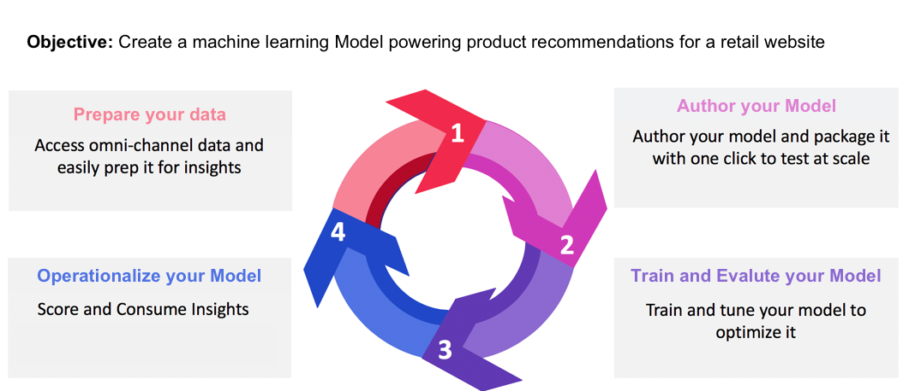
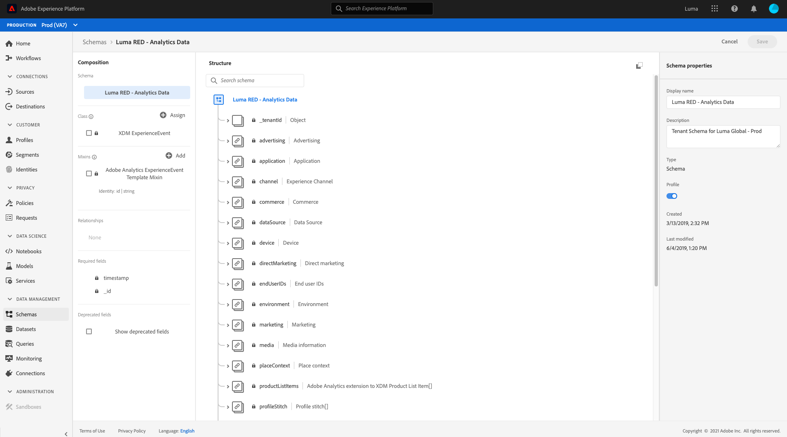

# マシンラーニングモデルの作成と公開

あなたはオンラインの小売サイトを所有しているとします。あなたは顧客が小売 Web サイトで買い物をする際に、自社が提供する他の様々な製品が目に入るよう、パーソナライズされた製品レコメンデーションを提示したいと考えています。Web サイトの存在期間全体にわたって、顧客データを継続的に収集し、このデータを使用してパーソナライズされた商品レコメンデーションを生成しようとします。

[!DNL Adobe Experience Platform] [!DNL Data Science Workspace] は、事前に作成された [製品Recommendationsレシピ](../pre-built-recipes/product-recommendations.md)を使用して目標を達成する手段を提供します。このチュートリアルでは、小売データにアクセスして理解し、機械学習モデルを作成して最適化し、[!DNL Data Science Workspace] でインサイトを生成する方法について説明します。

このチュートリアルは [!DNL Data Science Workspace] のワークフローを反映し、機械学習モデルを作成する次の手順について説明します。

1. [データの準備](#prepare-your-data)
2. [モデルのオーサリング](#author-your-model)
3. [モデルのトレーニングと評価](#train-and-evaluate-your-model)
4. [モデルを操作できるようにする](#operationalize-your-model)

## はじめに

このチュートリアルを開始する前に、次の前提条件を満たす必要があります。

- [!DNL Adobe Experience Platform] へのアクセス [!DNL Experience Platform] の IMS 組織にアクセスできない場合は、先に進む前にシステム管理者にお問い合わせください。

- イネーブルメントアセット。次のアイテムをプロビジョニングするには、アカウント担当者にお問い合わせください。
   - Recommendations のレシピ
   - Recommendations の入力データセット
   - Recommendations の入力スキーマ
   - Recommendations の出力データセット
   - Recommendations の出力スキーマ
   - ゴールデンデータセット postValues
   - ゴールデンデータセットスキーマ

- 必要な 3 つの [!DNL Jupyter Notebook] ファイルを [Adobeのパブリック  [!DNL Git]  リポジトリ ](https://github.com/adobe/experience-platform-dsw-reference/tree/master/Summit/2019/resources/Notebooks-Thurs) からダウンロードします。これらは、[!DNL Data Science Workspace] で [!DNL JupyterLab] ワークフローを示すのに使用されます。

このチュートリアルで使用する次の主要概念に対する十分な理解
- [[!DNL Experience Data Model]](../../xdm/home.md):顧客体験管理の標準スキーマ（や ExperienceEvent など）を定義する [!DNL Profile] Adobeによる標準化の取り組み。
- データセット：実際のデータ用に構成されたストレージおよび管理。[XDM スキーマ](../../xdm/schema/field-dictionary.md)の物理的にインスタンス化されたインスタンス。
- バッチ：データセットは、バッチで構成されます。バッチとは、一定期間に収集され、1 つの単位としてまとめて処理される一連のデータです。
- [!DNL JupyterLab]: [[!DNL JupyterLab]](https://blog.jupyter.org/jupyterlab-is-ready-for-users-5a6f039b8906) は、Project のオープンソース Web ベースのインターフェイスで、 [!DNL Jupyter] に緊密に統合されていま [!DNL Experience Platform]す。

## データの準備 {#prepare-your-data}

顧客に合わせてパーソナライズされた商品レコメンデーションを作成する機械学習モデルを作成するには、Web サイトにおける以前の顧客の購入を分析する必要があります。この節では、このデータが [!DNL Platform] から [!DNL Adobe Analytics] に取り込まれる仕組みと、そのデータを機械学習モデルで使用する機能データセットに変換する仕組みについて説明します。

### データを調べてスキーマを理解する

[Adobe Experience Platform](https://platform.adobe.com/) にログインし、**[!UICONTROL Datasets]** を選択して既存のデータセットをすべてリストし、調査するデータセットを選択します。 この場合、 [!DNL Analytics] データセット **ゴールデンデータセット postValues** です。

データセットアクティビティページが開き、データセットに関する情報が表示されます。 右上付近にある **[!UICONTROL プレビューデータセット]** を選択して、サンプルレコードを確認できます。 また、選択したデータセットのスキーマを表示することもできます。 右側のパネルでスキーマリンクを選択します。 **[!UICONTROL スキーマ名]** の下のリンクを選択すると、新しいタブでスキーマが開きます。

その他のデータセットは、プレビュー用にバッチを使用して事前設定されています。これらのデータセットを表示するには、上記の手順を繰り返します。

| データセット名 | スキーマ | 説明 |
| ----- | ----- | ----- |
| ゴールデンデータセット postValues | ゴールデンデータセットスキーマ | [!DNL Analytics]Web サイトの ソースデータ |
| Recommendations の入力データセット | Recommendations の入力スキーマ | [!DNL Analytics] データは、機能パイプラインを使用してトレーニングデータセットに変換されます。 このデータは、製品レコメンデーションの機械学習モデルのトレーニングに使用されます。`itemid` および `userid` は、その顧客が購入した製品に対応しています。 |
| Recommendations の出力データセット | Recommendations の出力スキーマ | スコア付け結果が保存されるデータセットには、各顧客にお勧めする製品のリストが含まれます。 |

## モデルのオーサリング {#author-your-model}

[!DNL Data Science Workspace] ライフサイクルの 2 番目の要素は、レシピとモデルの作成です。 製品 Recommendations レシピは、過去の購入データと機械学習を利用して、製品 Recommendations を大規模に生成できるように作られています。

レシピは、特定の問題を解決するために設計された機械学習アルゴリズムとロジックを含んでおり、モデルの基盤となります。さらに重要な点は、レシピを使用すると、組織全体の機械学習を民主化でき、他のユーザーはコードを書かなくても様々な用途のモデルにアクセスできるようになることです。

### 製品 Recommendations レシピの参照

Experience Platformで、左のナビゲーション列から「**[!UICONTROL モデル]**」に移動し、上部のナビゲーションで「**[!UICONTROL レシピ]**」を選択して、組織で使用可能なレシピのリストを表示します。

次に、提供された **[!UICONTROL Recommendations Recipe]** を探して開きます。 レシピの概要ページが表示されます。

次に、右側のパネルで「**[!UICONTROL Recommendations Input Schema]**」を選択して、レシピを実行するスキーマを表示します。 スキーマフィールド「[!UICONTROL itemId]」と「[!UICONTROL userId]」は、特定の時間 ([!UICONTROL timestamp]) にその顧客が購入した製品 ([!UICONTROL interactionType]) に対応します。 同じ手順に従って、**[!UICONTROL Recommendations の出力スキーマ]**&#x200B;のフィールドを確認します。

これで、商品 Recommendations のレシピで必要な入力および出力スキーマを確認しました。次の節に進み、製品Recommendationsモデルの作成、トレーニング、評価方法を学びます。

## モデルのトレーニングと評価 {#train-and-evaluate-your-model}

データの準備が完了し、レシピの準備が整ったので、機械学習モデルを作成、トレーニング、評価できます。

### モデルの作成

モデルはレシピのインスタンスで、データを大規模にトレーニングして、スコアを付けることができます。

Experience Platformで、左のナビゲーション列から「**[!UICONTROL モデル]**」に移動し、上部のナビゲーションで「**[!UICONTROL レシピ]**」を選択します。 組織で使用可能なレシピのリストが表示されます。製品レコメンデーションレシピを選択します。

レシピページで、「**[!UICONTROL モデルを作成]**」を選択します。

モデルの作成ワークフローは、レシピの選択から開始します。 「 **[!UICONTROL Recommendationsレシピ]** 」を選択し、右上隅の「 **[!UICONTROL 次へ]** 」を選択します。

次に、モデル名を指定します。 モデルのデフォルトのトレーニング動作やスコア付け動作の設定を含む、モデルで使用可能な設定が一覧表示されます。 設定を確認し、「**[!UICONTROL 完了]**」を選択します。

新しく生成されたトレーニング実行によって、モデルの概要ページにリダイレクトされます。 トレーニング実行は、モデルの作成時にデフォルトで生成されます。

トレーニング実行が完了するまで待つか、次のセクションで新しいトレーニング実行の作成を続行するかを選択できます。

### カスタムのハイパーパラメータを使用してモデルをトレーニングする

**モデルの概要** ページで、右上近くにある「**[!UICONTROL トレーニング]**」を選択して、新しいトレーニング実行を作成します。 モデルの作成時に使用したのと同じ入力データセットを選択し、「**[!UICONTROL 次へ]**」を選択します。

**[!UICONTROL 設定]**&#x200B;ページが表示されます。ここで、トレーニング実行 `num_recommendations` の値（ハイパーパラメーターとも呼ばれます）を設定できます。 トレーニング済みの最適化されたモデルは、トレーニング実行の結果に基づいて、最もパフォーマンスの高いハイパーパラメーターを利用します。

ハイパーパラメーターは学習できないので、トレーニングを実行する前に割り当てる必要があります。ハイパーパラメーターを調整すると、トレーニング済みモデルの精度が変わる場合があります。 モデルの最適化は反復的なプロセスなので、満足のいく評価を得るには、複数のトレーニング実行が必要になる場合があります。

>[!TIP]
>
>`num_recommendations` を 10 に設定します。

追加のデータポイントがモデル評価チャートに表示されます。 実行が完了すると、この処理が表示されるまでに数分かかる場合があります。

### モデルの評価

トレーニング実行が完了するたびに、結果の評価指標を表示して、モデルのパフォーマンスを判断できます。

完了した各トレーニング実行の評価指標（精度と再現率）を確認するには、トレーニング実行を選択します。

各評価指標に対して提供された情報を調べることができます。 これらの指標が高いほど、モデルのパフォーマンスが向上します。

各トレーニング実行に使用されるスキーマセット、データセット、設定パラメーターは、右側のパネルで確認できます。「モデル」ページに戻り、評価指標を観察して、パフォーマンスが最も高いトレーニングを特定します。

## モデルを操作できるようにする {#operationalize-your-model}

Data Science ワークフローの最後の手順では、モデルを操作できるようにして、データストアからのインサイトにスコアを付けて利用します。

### スコアを付けてインサイトを生成する

商品レコメンデーションモデルの概要ページで、リコールと精度の値が最も高く、最もパフォーマンスの高いトレーニング実行の名前を選択します。

次に、トレーニングの実行の詳細ページの右上にある「**[!UICONTROL スコア]**」を選択します。

次に、スコア付け入力データセットとして **[!UICONTROL Recommendations Input Dataset]** を選択します。これは、モデルの作成時に使用し、そのトレーニング実行時に実行したデータセットと同じものです。 次に、「**[!UICONTROL 次へ]**」を選択します。

入力データセットを取得したら、スコアリング出力データセットとして **[!UICONTROL Recommendations出力データセット]** を選択します。 スコアリングの結果は、このデータセットにバッチとして保存されます。

最後に、スコア設定を確認します。 これらのパラメーターには、前に選択した入力および出力データセットと、適切なスキーマが含まれます。 「**[!UICONTROL 完了]**」を選択して、スコアリングの実行を開始します。 実行が完了するまで数分かかる場合があります。

### スコアが付けられたインサイトを表示する

スコアリングの実行が正常に完了すると、生成された結果とインサイトの表示をプレビューできます。

スコア付け実行ページで、完了したスコア付け実行を選択し、右側のパネルで「**[!UICONTROL スコア付け結果データセットのプレビュー]**」を選択します。

プレビューの表では、各行に特定の顧客に対する製品レコメンデーションが含まれ、それぞれに [!UICONTROL recommendations] および [!UICONTROL userId] というラベルが付けられます。サンプルスクリーンショットでは、 [!UICONTROL num_recommendations] ハイパーパラメーターが 10 に設定されているので、レコメンデーションの各行には、最大 10 個の製品 ID を番号記号 (#) で区切って含めることができます。

## 次の手順 {#next-steps}

このチュートリアルでは、[!DNL Data Science Workspace] のワークフローを紹介し、機械学習を通じて生の未処理データを有用な情報に変換する方法を説明しました。 [!DNL Data Science Workspace] の使用方法の詳細については、次のガイドで [ 小売スキーマとデータセット ](./create-retails-sales-dataset.md) の作成に進みます。
