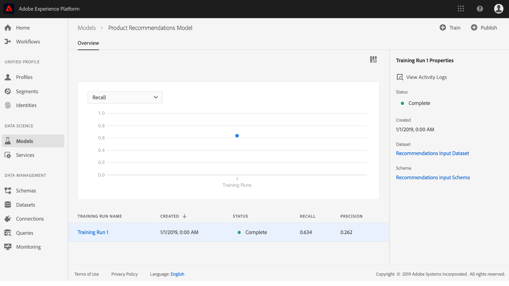
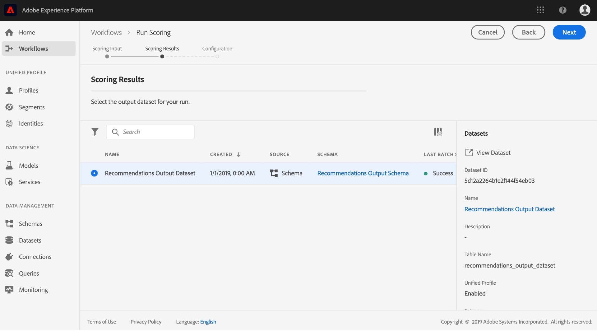

# マシンラーニングモデルの作成と公開

あなたはオンラインの小売サイトを所有しているとします。あなたは顧客が小売 Web サイトで買い物をする際に、自社が提供する他の様々な製品が目に入るよう、パーソナライズされた製品レコメンデーションを提示したいと考えています。Web サイトの存在期間全体にわたって、顧客データを継続的に収集し、このデータを使用してパーソナライズされた商品レコメンデーションを生成しようとします。

[!DNL Adobe Experience Platform] [!DNL Data Science Workspace] 事前に組み込まれた [製品Recommendationsレシピを使用して目標を達成する手段を提供します](../pre-built-recipes/product-recommendations.md)。このチュートリアルに従って、小売データにアクセスして理解し、機械学習モデルを作成して最適化し、[!DNL Data Science Workspace]でインサイトを生成する方法を確認します。

このチュートリアルは、[!DNL Data Science Workspace]のワークフローを反映しており、機械学習モデルを作成するための次の手順をカバーしています。

1. [データの準備](#prepare-your-data)
2. [モデルのオーサリング](#author-your-model)
3. [モデルのトレーニングと評価](#train-and-evaluate-your-model)
4. [モデルを操作できるようにする](#operationalize-your-model)

## はじめに

このチュートリアルを開始する前に、次の前提条件を満たす必要があります。

* [!DNL Adobe Experience Platform]にアクセスします。 [!DNL Experience Platform]のIMS組織にアクセスできない場合は、先に進む前に、システム管理者にお問い合わせください。

* イネーブルメントアセット。次のアイテムをプロビジョニングするには、アカウント担当者にお問い合わせください。
   * Recommendations のレシピ
   * Recommendations の入力データセット
   * Recommendations の入力スキーマ
   * Recommendations の出力データセット
   * Recommendations の出力スキーマ
   * ゴールデンデータセット postValues
   * ゴールデンデータセットスキーマ

* 必要な3つの[!DNL Jupyter Notebook]ファイルを[Adobepublic [!DNL Git] repository](https://github.com/adobe/experience-platform-dsw-reference/tree/master/Summit/2019/resources/Notebooks-Thurs)からダウンロードします。これらは[!DNL Data Science Workspace]で[!DNL JupyterLab]ワークフローを示すのに使用されます。

* このチュートリアルで使用する次の主要概念に対する十分な理解
   * [[!DNL Experience Data Model]](../../xdm/home.md):Adobeが導く標準化の取り組み。Customer Experience Managementの標準スキーマ（例：ExperienceEvent） [!DNL Profile] を定義します。
   * データセット：実際のデータ用に構成されたストレージおよび管理。[XDM スキーマ](../../xdm/schema/field-dictionary.md)の物理的にインスタンス化されたインスタンス。
   * バッチ：データセットは、バッチで構成されます。バッチとは、一定期間に収集され、1 つの単位としてまとめて処理される一連のデータです。
   * [!DNL JupyterLab]: [[!DNL JupyterLab]](https://blog.jupyter.org/jupyterlab-is-ready-for-users-5a6f039b8906) は、Project用のオープンソースのWebベースのインターフェイスで [!DNL Jupyter] 、に緊密に統合されてい [!DNL Experience Platform]ます。

## データの準備 {#prepare-your-data}

顧客に合わせてパーソナライズされた商品レコメンデーションを作成する機械学習モデルを作成するには、Web サイトにおける以前の顧客の購入を分析する必要があります。この節では、このデータが[!DNL Platform]から[!DNL Adobe Analytics]にどのように取り込まれるか、およびそのデータが機械学習モデルで使用する機能データセットにどのように変換されるかについて説明します。

### データを調べてスキーマを理解する

1. [Adobe Experience Platform](https://platform.adobe.com/) にログインし、「**[!UICONTROL データセット]**」をクリックして既存のデータセットをすべてリストし、調査するデータセットを選択します。この場合、[!DNL Analytics]データセット&#x200B;**ゴールデンデータセットpostValues**です。
   
2. 右上近くにある **[!UICONTROL プレビューデータセット]**&#x200B;を選択し、サンプルレコードを確認して、「**[!UICONTROL 閉じる]**」をクリックします。
   
3. 右側パネルの「スキーマ」の下のリンクを選択してデータセットのスキーマを表示し、データセットの詳細ページに戻ります。
   

その他のデータセットは、プレビュー用にバッチを使用して事前設定されています。これらのデータセットを表示するには、上記の手順を繰り返します。

| データセット名 | スキーマ | 説明 |
| ----- | ----- | ----- |
| ゴールデンデータセット postValues | ゴールデンデータセットスキーマ | [!DNL Analytics]Web サイトの ソースデータ |
| Recommendations の入力データセット | Recommendations の入力スキーマ | [!DNL Analytics]データは、機能パイプラインを使用してトレーニングデータセットに変換されます。 このデータは、製品レコメンデーションの機械学習モデルのトレーニングに使用されます。`itemid` および `userid` は、その顧客が購入した製品に対応しています。 |
| Recommendations の出力データセット | Recommendations の出力スキーマ | スコア付け結果が保存されるデータセットには、各顧客にお勧めする製品のリストが含まれます。 |

## モデルのオーサリング {#author-your-model}

[!DNL Data Science Workspace]ライフサイクルの2番目の要素は、レシピとモデルの作成です。 製品 Recommendations レシピは、過去の購入データと機械学習を利用して、製品 Recommendations を大規模に生成できるように作られています。

レシピは、特定の問題を解決するために設計された機械学習アルゴリズムとロジックを含んでおり、モデルの基盤となります。さらに重要な点は、レシピを使用すると、組織全体の機械学習を民主化でき、他のユーザーはコードを書かなくても様々な用途のモデルにアクセスできるようになることです。

### 製品 Recommendations レシピの参照

1. [!DNL Adobe Experience Platform]で、左側のナビゲーション列の&#x200B;**[!UICONTROL モデル]**&#x200B;に移動し、上部の&#x200B;**[!UICONTROL レシピ]**をクリックして、組織で使用可能なレシピのリストを表示します。
   
2. 提供された&#x200B;**[!UICONTROL Recommendations レシピ]**を探し、名前をクリックして開きます。
   
3. 右側パネルで、「**[!UICONTROL Recommendations 入力スキーマ]**」をクリックして、レシピを実行するスキーマを表示します。スキーマフィールド「[!UICONTROL itemId]」と「[!UICONTROL userId]」は、特定の時刻([!UICONTROL timestamp])に、その顧客が購入した製品([!UICONTROL interactionType])に対応します。 同じ手順に従って、**[!UICONTROL Recommendations の出力スキーマ]**のフィールドを確認します。
   

これで、商品 Recommendations のレシピで必要な入力および出力スキーマを確認しました。次のセクションに進み、製品レコメンデーションモデルの作成、トレーニング、および評価方法を見つけることができます。

## モデルのトレーニングと評価  {#train-and-evaluate-your-model}

データの準備が完了し、レシピを使用する準備が整ったら、機械学習モデルを作成、トレーニング、および評価できます。

### モデルの作成

モデルはレシピのインスタンスで、データを大規模にトレーニングして、スコアを付けることができます。

1. [!DNL Adobe Experience Platform]で、左側のナビゲーション列の&#x200B;**[!UICONTROL モデル]**&#x200B;に移動し、ページ上部の&#x200B;**[!UICONTROL レシピ]**をクリックして、組織で使用可能なすべてのレシピのリストを表示します。
   
2. 提供された **[!UICONTROL Recommendations レシピ]**&#x200B;を探して、名前をクリックし、レシピの概要ページを入力して開きます。「レシピの概要」ページの中央（既存のモデルがない場合）または右上のいずれかで「**[!UICONTROL モデルを作成]**」をクリックします。
   
3. トレーニングに使用できる入力データセットのリストが表示されます。「**[!UICONTROL Recommendations 入力データセット]**」を選択し、「**[!UICONTROL 次へ]**」をクリックします。
   
4. モデルの名前を指定します（例：「製品レコメンデーションモデル」）。モデルのデフォルトのトレーニング動作やスコア付け動作の設定を含め、モデルで使用可能な設定が表示されます。これらの設定は組織に固有なので、変更する必要はありません。設定を確認し、「**[!UICONTROL 完了]**」をクリックします。
   
5. モデルが作成され、新しく生成されたトレーニング実行内に、モデルの&#x200B;*概要*ページが表示されます。トレーニング実行は、モデルの作成時にデフォルトで生成されます。
   

トレーニング実行が完了するまで待つか、次のセクションで新しいトレーニング実行の作成を続行するかを選択できます。

### カスタムのハイパーパラメータを使用してモデルをトレーニングする

1. 「**モデルの概要**」ページで、右上付近にある「**[!UICONTROL トレーニング]**」をクリックして新しいトレーニング実行を作成します。モデルの作成時に使用したのと同じ入力データセットを選択し、「**[!UICONTROL 次へ]**」をクリックします。
   
2. **設定**&#x200B;ページが表示されます。ここで、トレーニング実行の&quot;[!UICONTROL num_recommendations]&quot;値（Hyperparameterとも呼ばれます）を設定できます。 最適化されたトレーニング済みモデルは、トレーニング実行の結果に基づいて、パフォーマンスが最も高いハイパーパラメーターを利用します。

   ハイパーパラメーターは学習できないので、トレーニングを実行する前に割り当てる必要があります。ハイパーパラメーターを調整すると、トレーニングモデルの精度が変わる場合があります。モデルの最適化は反復的なプロセスなので、満足のいく評価を得るには複数のトレーニング実行が必要となる場合があります。

   >[!TIP]
   >
   >**[!UICONTROL num_recommendations]** を 10 に設定します。

   
3. 新しいトレーニング実行が完了すると、モデル評価グラフに追加のデータポイントが表示されます。この処理には数分かかる場合があります。
   

### モデルの評価

トレーニング実行が完了するたびに、結果の評価指標を表示して、モデルのパフォーマンスを判断できます。

1. トレーニング実行をクリックして、完了した各トレーニングの評価指標（精度と再現率）を確認します。
2. 各評価指標に対して提供された情報を調べます。これらの指標が高いほど、モデルのパフォーマンスが良いということになります。
   
3. 各トレーニング実行に使用されるスキーマセット、データセット、設定パラメーターは、右側のパネルで確認できます。
4. 「モデル」ページに戻り、評価指標を観察して、パフォーマンスが最も高いトレーニングを特定します。

## モデルを操作できるようにする  {#operationalize-your-model}

Data Science ワークフローの最後の手順では、モデルを操作できるようにして、データストアからのインサイトにスコアを付けて利用します。

### スコアを付けてインサイトを生成する

1. 商品レコメンデーションの「*モデルの概要*」ページで、リコールと精度の値が最も高く、最もパフォーマンスの高いトレーニング実行の名前をクリックします。
2. トレーニングの実行の詳細ページの右上にある「**[!UICONTROL スコア]**」をクリックします。
3. スコア付け入力データセットとして「**[!UICONTROL Recommendations 入力データセット]**」を選択します。これは、モデルの作成時に使用し、そのトレーニング実行時に実施したデータセットと同じものです。次に、「**[!UICONTROL 次へ]**」をクリックします。
   
4. スコア付け出力データセットとして「**[!UICONTROL Recommendations 出力データセット]**」を選択します。スコア付けの結果は、このデータセットにバッチとして保存されます。
   
5. スコア設定を確認します。これらのパラメーターには、前に選択した入力および出力データセットと、適切なスキーマが含まれます。「**[!UICONTROL 完了]**」をクリックし、スコア付け実行を開始します。実行が完了するまで数分かかる場合があります。
   

### スコアが付けられたインサイトを表示する

スコア付け実行が正常に完了すると、生成された結果とインサイトの表示をプレビューできます。

1. スコア付け実行ページで、完了したスコア付け実行をクリックし、右側パネルの「**[!UICONTROL スコア付けの結果データセットのプレビュー]**」をクリックします。
   
2. プレビューの表では、各行に特定の顧客に対する製品レコメンデーションが含まれ、それぞれに [!UICONTROL recommendations] および [!UICONTROL userId] というラベルが付けられます。サンプルスクリーンショットでは、[!UICONTROL num_recommendations] ハイパーパラメーターが「10」に設定されているので、レコメンデーションの各行には、最大 10 個の製品 ID を番号記号（#）で区切って含めることができます。
   

## 次の手順 {#next-steps}

製品のレコメンデーションが正常に生成されました。

このチュートリアルでは、[!DNL Data Science Workspace]のワークフローについて説明し、未処理の生のデータを機械学習によって有用な情報に変える方法を説明します。 [!DNL Data Science Workspace]の使い方の詳細については、[小売売上スキーマとデータセット](./create-retails-sales-dataset.md)の作成に関する次のガイドに進んでください。