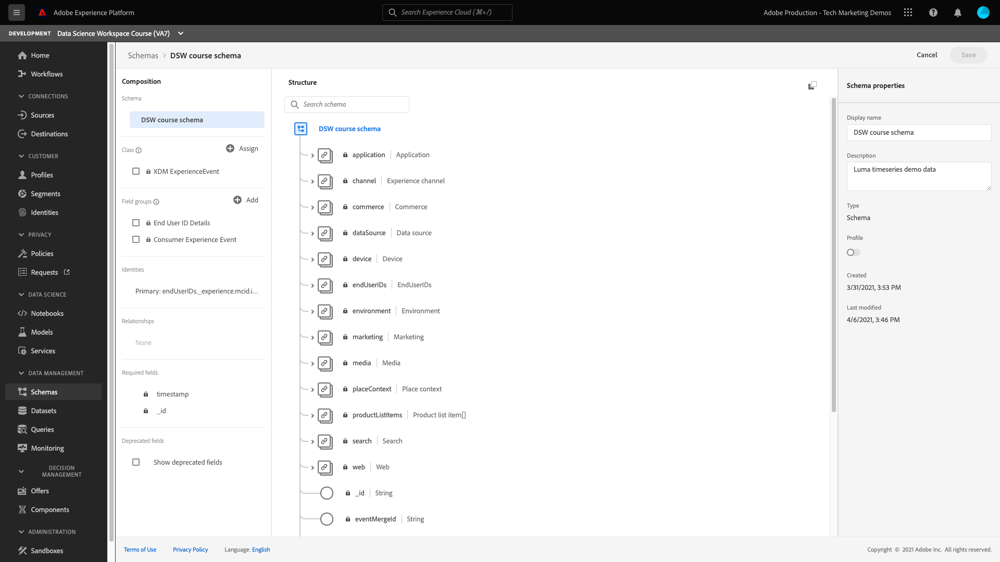

# マシンラーニングモデルの作成と公開

次のガイドでは、機械学習モデルの作成と公開に必要な手順を説明します。 各節には、実行する操作の説明と、説明する手順を実行するための UI および API ドキュメントへのリンクが含まれています。

## はじめに

このチュートリアルを開始する前に、次の前提条件を満たす必要があります。

- アクセス先 [!DNL Adobe Experience Platform]. If you do not have access to an IMS Organization in [!DNL Experience Platform], please speak to your system administrator before proceeding.

- All Data Science Workspace tutorials use the Luma propensity model. 続行するには、 [Luma 傾向モデルのスキーマとデータセット](./create-luma-data.md).

### データを調べてスキーマを理解する

にログインします。 [Adobe Experience Platform](https://platform.adobe.com/) を選択し、 **[!UICONTROL データセット]** をクリックして、既存のすべてのデータセットをリストし、調査するデータセットを選択します。 In this case, you should select the **Luma web data** dataset.

データセットアクティビティページが開き、データセットに関する情報が表示されます。 次を選択できます。 **[!UICONTROL データセットをプレビュー]** 右上付近にあるサンプルレコードを確認します。 You can also view the schema for the selected dataset.

右側のパネルでスキーマリンクを選択します。 A popover appears, selecting the link under **[!UICONTROL schema name]** opens the schema in a new tab.

You can further explore the data using the provided Exploratory Data Analysis (EDA) notebook. このノートブックは、Luma データのパターンを理解し、データの整合性を確認し、予測傾向モデルに関連するデータを要約するのに役立ちます。 Exploratory Data Analysis の詳細については、 [EDA ドキュメント](../jupyterlab/eda-notebook.md).

## Luma 傾向レシピの作成 {#author-your-model}

A main component of the [!DNL Data Science Workspace] lifecycle involves authoring Recipes and Models. Luma 傾向モデルは、顧客が Luma から製品を購入する傾向が高いかどうかに関する予測を生成するように設計されています。

Luma の傾向モデルを作成するには、レシピビルダーテンプレートが使用されます。 レシピは、特定の問題を解決するために設計された機械学習アルゴリズムとロジックを含むので、モデルの基礎となります。 さらに重要な点は、レシピを使用すると、組織全体の機械学習を民主化でき、他のユーザーはコードを書かなくても様々な用途のモデルにアクセスできるようになることです。

フォロー： [JupyterLab Notebooks を使用してモデルを作成する](../jupyterlab/create-a-model.md) 後続のチュートリアルで使用する Luma 傾向モデルレシピの作成に関するチュートリアルです。

## 外部ソース (*オプション*)

Data Science Workspace で使用するレシピをインポートおよびパッケージ化する場合は、ソースファイルをアーカイブファイルにパッケージ化する必要があります。 Follow the [package source files into a recipe](./package-source-files-recipe.md) tutorial. このチュートリアルでは、ソースファイルをレシピにパッケージ化する方法を示します。これは、レシピを Data Science Workspace にインポートするための前提条件の手順です。 チュートリアルが完了したら、Azure Container Registry に Docker イメージと、対応するイメージ URL（つまりアーカイブファイル）が提供されます。

このアーカイブファイルを使用して、Data Science Workspace でレシピを作成できます。それには、 [UI ワークフロー](./import-packaged-recipe-ui.md) または [API ワークフロー](./import-packaged-recipe-api.md).

## モデルのトレーニングと評価 {#train-and-evaluate-your-model}

Now that your data is prepared and a recipe is ready, you have the ability to create, train, and evaluate your machine learning model further. While using the Recipe Builder, you should have already trained, scored, and evaluated your model before packaging it into a recipe.

Data Science Workspace の UI と API を使用すると、レシピをモデルとして公開できます。 さらに、ハイパーパラメーターの追加、削除、変更など、モデルの特定の側面をさらに微調整できます。

### モデルの作成

UI を使用したモデルの作成について詳しくは、 Data Science Workspace でトレーニングにアクセスしてモデルを評価してください [UI チュートリアル](./train-evaluate-model-ui.md) または [API チュートリアル](./train-evaluate-model-api.md). このチュートリアルでは、モデルを微調整するためのハイパーパラメーターの作成、トレーニング、更新方法の例を示します。

>[!NOTE]
>
> ハイパーパラメーターは学習できないので、トレーニングを実行する前に割り当てる必要があります。ハイパーパラメーターを調整すると、トレーニング済みモデルの精度が変わる場合があります。 モデルの最適化は反復的なプロセスなので、満足のいく評価を得るには、複数のトレーニング実行が必要になる場合があります。

## モデルのスコア付け {#score-a-model}

モデルを作成して公開する次の手順では、モデルを操作できるようにして、データレイクとリアルタイム顧客プロファイルからのインサイトにスコアを付けて利用します。

 Data Science Workspace　でのスコアリングは、既存のトレーニング済みモデルに入力データを送ることで達成できます。次に、スコアリング結果が保存され、新しいバッチとして指定した出力データセットで表示可能になります。

モデルのスコアリング方法については、モデルのスコアを参照してください [UI チュートリアル](./score-model-ui.md) または [API チュートリアル](./score-model-api.md).

## スコアリング済みモデルのサービスとしての公開

Data Science Workspace を使用すると、トレーニング済みモデルをサービスとして公開できます。 これにより、IMS 組織内のユーザーは、独自のモデルを作成する必要なく、データをスコアリングできます。

モデルをサービスとして公開する方法については、 [UI チュートリアル](./publish-model-service-ui.md) または [API チュートリアル](./publish-model-service-api.md).

### サービスの自動トレーニングのスケジュール設定

モデルをサービスとして公開したら、機械学習サービスのスコアリングおよびトレーニング実行のスケジュールを設定できます。 Automating the training and scoring process can help maintain and improve a service&#39;s efficiency through time by keeping up with patterns within your data. Visit the [schedule a model in the Data Science Workspace UI](./schedule-models-ui.md) tutorial.

>[!NOTE]
>
> UI からは、自動トレーニングとスコアリングのモデルのスケジュールのみ設定できます。

## 次の手順 {#next-steps}

Adobe Experience Platform [!DNL Data Science Workspace] provides the tools and resources to create, evaluate, and utilize machine learning models to generate data predictions and insights. 機械学習のインサイトが [!DNL Profile]-enabled データセット。同じデータも [!DNL Profile] 次を使用してセグメント化できるレコード： [!DNL Adobe Experience Platform Segmentation Service].

プロファイルと時系列データが取得されると、リアルタイム顧客プロファイルは、既存のデータと結合して和集合表示を更新する前に、ストリーミングセグメント化と呼ばれる継続的なプロセスを通じて、そのデータをセグメントに含めるか除外するかを自動的に決定します。その結果、顧客がブランドとやり取りする際に、瞬時に計算をおこない、顧客に対して強化された個別的なエクスペリエンスを提供する意思決定をおこなうことができます。

のチュートリアルを参照してください。 [機械学習のインサイトを使用したリアルタイム顧客プロファイルの強化](./enrich-profile.md) を参照して、機械学習のインサイトを利用する方法の詳細を確認してください。
