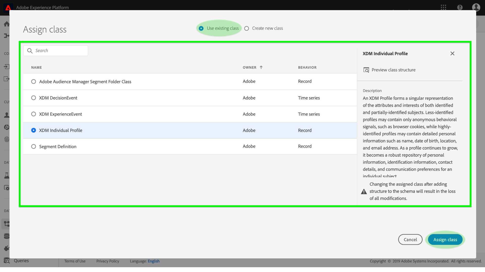
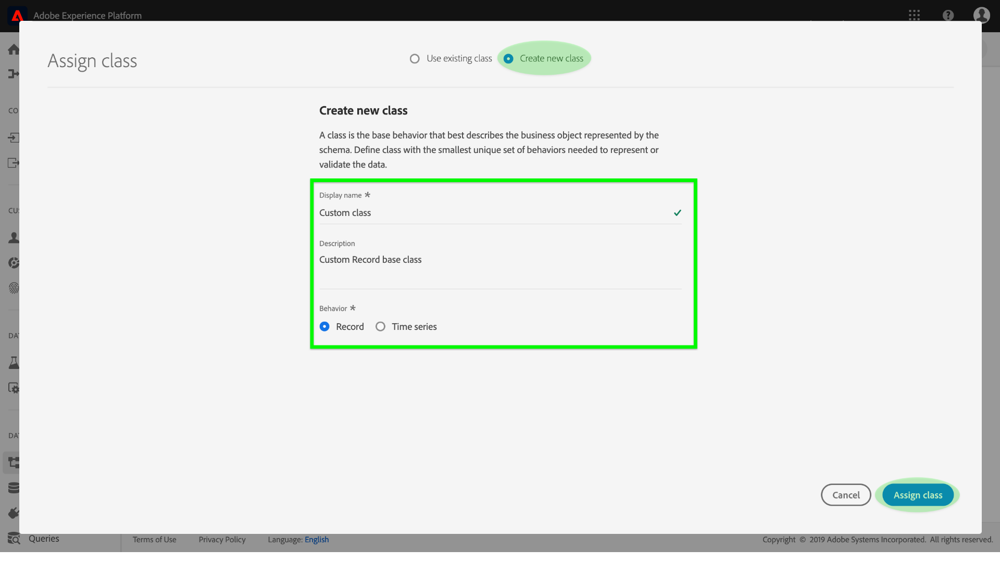
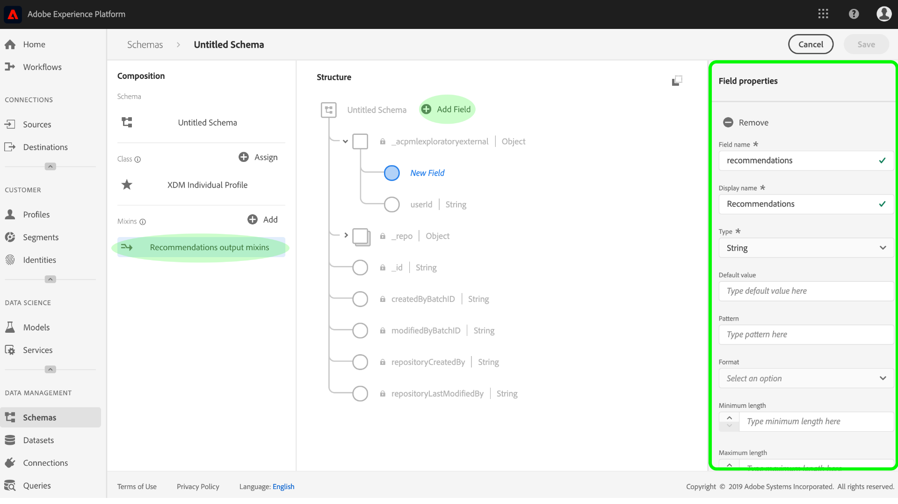
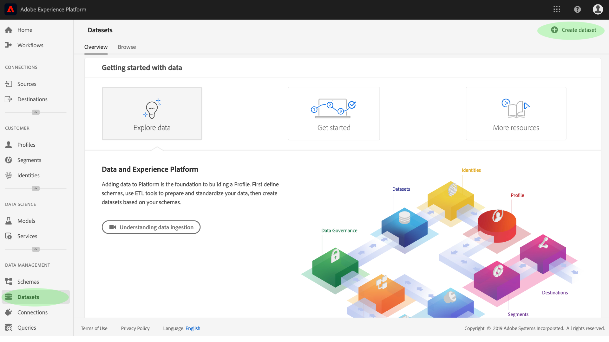

# 機械学習 [!DNL Real-time Customer Profile] のインサイトの拡充

[!DNL Adobe Experience Platform][!DNL Data Science Workspace] は、マシンラーニングモデルを作成、評価、利用してデータ予測とインサイトを生成するためのツールとリソースを提供します。When machine learning insights are ingested into a [!DNL Profile]-enabled dataset, that same data is also ingested as [!DNL Profile] records which can then be segmented into subsets of related elements by using [!DNL Experience Platform Segmentation Service].

This document provides a step-by-step tutorial to enrich [!DNL Real-time Customer Profile] with machine learning insights, steps are broken into the following sections:

1. [出力スキーマとデータセットの作成](#create-an-output-schema-and-dataset)
2. [出力スキーマとデータセットの設定](#configure-an-output-schema-and-dataset)
3. [セグメントビルダーを使用したセグメントの作成](#create-segments-using-the-segment-builder)

## はじめに

This tutorial requires a working understanding of the various aspects of [!DNL Adobe Experience Platform] involved in ingesting [!DNL Profile] data and creating segments. このチュートリアルを開始する前に、次のサービスのドキュメントを確認してください。

* [[!DNL Real-time Customer Profile]](../../rtcdp/overview.md):複数のソースからの集計データに基づいて、統合されたリアルタイムの消費者プロファイルを提供します。
* [[!DNL Identity Service]](../../identity-service/home.md):プラットフォーム [!DNL Real-time Customer Profile] に取り込まれる異なるデータソースのIDをブリッジ化することで有効にします。
* [[!DNL Experience Data Model (XDM)]](../../xdm/home.md):プラットフォームが顧客体験データを編成する際に使用する標準化されたフレームワーク。

上記のドキュメントに加え、スキーマおよびスキーマエディターに関する次のガイドも確認することを強くお勧めします。

* [スキーマ構成の基本](../../xdm/schema/composition.md):で使用するスキーマを構成するためのXDMスキーマ、構築ブロック、原則、ベストプラクティスについて説明 [!DNL Experience Platform]します。
* [スキーマエディタのチュートリアル](../../xdm/tutorials/create-schema-ui.md):内のスキーマエディタを使用してスキーマを作成する詳細な手順を説明 [!DNL Experience Platform]します。

## 出力スキーマとデータセットの作成 {#create-an-output-schema-and-dataset}

The first step towards enriching [!DNL Real-time Customer Profile] with scoring insights is knowing what real-world object (such as a person) your data defines. データを理解することで、リレーショナルデータベースのデザインと同様に、データに意味を持つ構造を説明し、設計できます。

クラスを割り当てることで、スキーマの構成が開始されます。クラスは、スキーマに含まれるデータ（レコードまたは時系列）の行動面を定義します。ここでは、スキーマビルダーを使用してスキーマを作成する基本手順を説明します。詳しいチュートリアルについては、[スキーマエディターを使用したスキーマの作成](../../xdm/tutorials/create-schema-ui.md)に関するチュートリアルを参照してください。

1. Adobe Experience Platform で、「**[!UICONTROL スキーマ]** 」タブをクリックしてスキーマブラウザーにアクセスします。「**[!UICONTROL スキーマ作成]**」をクリックして、**スキーマエディター**にアクセスします。このエディターで、インタラクティブにスキーマを作成できます。
   

2. **構成**&#x200B;ウィンドウで、「**[!UICONTROL 割り当て]**」をクリックし、使用可能なクラスを参照します。
   * 既存のクラスを割り当てるには、目的のクラスをクリックしてハイライト表示し、「**[!UICONTROL クラスを割り当て]**」をクリックします。
      

   * カスタムクラスを作成するには、ブラウザーウィンドウの中央上部近くにある「**[!UICONTROL 新規クラスを作成]**」をクリックします。クラス名と説明を入力し、クラスの動作を選択します。完了したら「**[!UICONTROL 、クラスの割り当て]**」をクリックします。
      

   この時点で、スキーマの構造にいくつかのクラスフィールドが含まれ、mixin を割り当てる準備が整います。Mixin は、特定の概念を説明する 1 つ以上のフィールドのグループです。

3. **構成**&#x200B;ウィンドウの「**Mixins**」サブセクションで「**[!UICONTROL 追加]**」をクリックします。
   * 既存の mixin を割り当てるには、目的の mixin をクリックしてハイライト表示し、「**[!UICONTROL Mixin を追加]**」をクリックします。クラスとは異なり、適切な場合、複数の mixin を 1 つのスキーマに割り当てられます。
      

   * 新しい mixin を作成するには、ブラウザーウィンドウの中央上付近にある「**[!UICONTROL 新規 mixin を作成]**」をクリックします。Mixin の名前と説明を入力し、完了したら「**[!UICONTROL Mixin を割り当て]**」をクリックします。
      

   * Mixin フィールドを追加するには、*構成*&#x200B;ウィンドウ内で mixin の名前をクリックします。次に、*構造*&#x200B;ウィンドウ内の「**[!UICONTROL フィールドを追加]**」をクリックすると、mixin フィールドを追加するオプションが提供されます。それに応じて、mixin プロパティを指定します。
      

4. スキーマの作成が完了したら、*構造*&#x200B;ウィンドウ内のスキーマの最上位フィールドをクリックすると、スキーマのプロパティが右側のプロパティウィンドウに表示されます。名前と説明を入力し、「**[!UICONTROL 保存]**」をクリックして、スキーマを作成します。
   

5. 左側のナビゲション列で「**[!UICONTROL データセット]**」をクリックしてから、「**[!UICONTROL データセットを作成]**」をクリックして、新しく作成したスキーマを使用して出力データセットを作成します。次の画面で、「**[!UICONTROL スキーマからデータセットを作成]**」を選択します。
   

6. スキーマブラウザーを使用して、新しく作成したスキーマを探して選択し、「**[!UICONTROL 次へ]**」をクリックします。
   

7. 名前と説明（オプション）を入力し、「**[!UICONTROL 完了]**」をクリックして、データセットを作成します。
   

出力スキーマデータセットを作成したので、次の節に進んで、プロファイルエンリッチメントを設定し有効にする準備が整いました。

## 出力スキーマとデータセットの設定 {#configure-an-output-schema-and-dataset}

Before you can enable a dataset for [!DNL Profile], you need to configure the dataset&#39;s schema to having a primary identity field and then enable the schema for [!DNL Profile]. 新しいスキーマを作成して有効にする場合は、[スキーマエディターを使用したスキーマの作成](../../xdm/tutorials/create-schema-ui.md)に関するチュートリアルを参照してください。それ以外の場合は、次の手順に従って既存のスキーマとデータセットを有効にします。

1. On Adobe Experience Platform, use the schema browser to find the output schema you wish to enable [!DNL Profile] on and click its name to view its composition.
   

2. スキーマ構造を展開し、主識別子として設定する適切なフィールドを探します。目的のフィールドをクリックして、そのプロパティを表示します。
   

3. フィールドの **[!UICONTROL ID]** プロパティ、**[!UICONTROL プライマリ ID]**&#x200B;プロパティを有効にし、適切な **[!UICONTROL ID 名前空間]**&#x200B;を選択して、フィールドをプライマリ ID として設定します。変更を加えたら、「**[!UICONTROL 適用]**」をクリックします。
   

4. スキーマ構造の最上位オブジェクトをクリックしてスキーマのプロパティを表示し、**[!UICONTROL プロファイルスイッチ]**&#x200B;を切り替えてプロファイルのスキーマを有効にします。「**[!UICONTROL 保存]**」をクリックして変更を確定すると、このスキーマを使用して作成されたデータセットがプロファイルに対して有効になります。
   

5. Use the dataset browser to find the dataset you wish to enable [!DNL Profile] on and click its name to access its details.
   

6. Enable the dataset for [!DNL Profile] by toggling the **[!UICONTROL Profile]** switch found in the right information column.
   

When data is ingested into a [!DNL Profile]-enabled dataset, that same data is also ingested as [!DNL Profile] records. スキーマとデータセットの準備が整ったら、適切なモデルを使用してスコアリングを実行することによりデータセットにデータを生成し、このチュートリアルを続行して、セグメントビルダーを使用して洞察セグメントを作成します。

## セグメントビルダーを使用したセグメントの作成 {#create-segments-using-the-segment-builder}

Now that you have generated and ingested insights into your [!DNL Profile]-enabled dataset, you can manage that data by identifying subsets of related elements using the Segment Builder. 次の手順に従って、独自のセグメントを作成します。

1. Adobe Experience Platform で、「**[!UICONTROL セグメント]**」タブをクリックし、「**[!UICONTROL セグメントを作成]**」をクリックして、セグメントビルダーにアクセスします。
   

2. セグメントビルダー内で、左のパネルから、セグメントの主要な構成要素（属性、イベント、既存のセグメント）にアクセスできます。各構成要素はそれぞれのタブに表示されます。Select the class to which your [!DNL Profile]-enabled schema extends then browse and find the building blocks for your segment.
   

3. 構成要素をルールビルダーキャンバスにドラッグ&amp;ドロップし、比較文を指定して完成させます。
   

4. セグメントを作成する際に、*セグメントプロパティ*パネルを見て、セグメントの結果の予測をプレビューできます。
   

5. 適切な「**[!UICONTROL 結合ポリシー]**」を選択し、名前とオプションの説明を入力し、「**[!UICONTROL 保存]**」をクリックして、新しいセグメントを完了します。
   

## 次の手順 {#next-steps}

This document walked you through the steps required to enable a schema and dataset for [!DNL Profile], and briefly demonstrated the workflow for creating insight segments using the Segment Builder. セグメントとセグメントビルダーについて詳しくは、「[セグメント化サービスの概要](../../segmentation/home.md)」を参照してください。