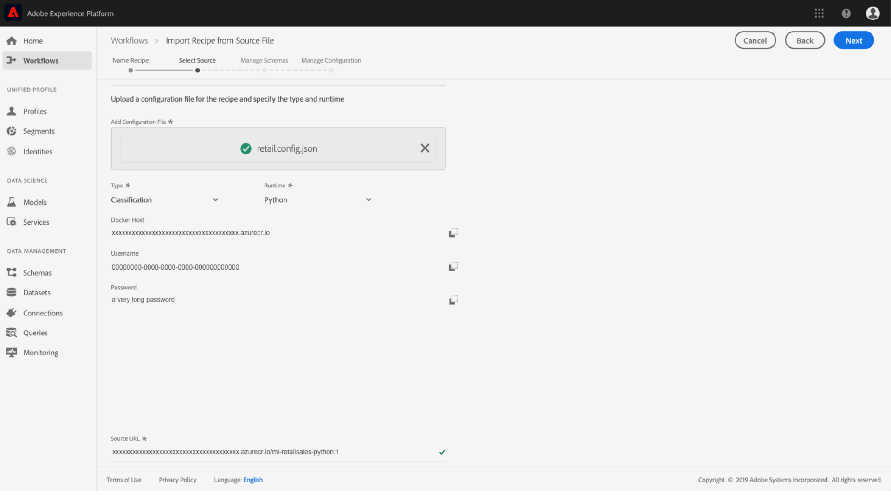

# パッケージ化されたレシピのインポート（Data Science Workspace UI 版）

このチュートリアルでは、提供された「小売売上」の例を使用してパッケージ化されたレシピを設定およびインポートする方法に関するインサイトを提供します。このチュートリアルを完了するまでに、Adobe Experience Platformでモデルの作成、トレーニング、評価をおこなう準備が整います [!DNL Data Science Workspace].

## 前提条件

このチュートリアルでは、Docker イメージ URL の形式でパッケージ化されたレシピが必要です。 詳しくは、[ソースファイルをレシピにパッケージ化する](./package-source-files-recipe.md)方法に関するチュートリアルを参照してください。

## UI ワークフロー

パッケージ化されたレシピのへの読み込み [!DNL Data Science Workspace] には、単一の JSON(JavaScript Object Notation) ファイルにコンパイルされた、特定のレシピ設定が必要です。このレシピ設定のコンパイルは、設定ファイルと呼ばれます。 特定の設定のセットを含むパッケージ化されたレシピは、レシピインスタンスと呼ばれます。1 つのレシピを使用して、 [!DNL Data Science Workspace].

パッケージレシピをインポートするワークフローは、次の手順で構成されます。
- [レシピの設定](#configure)
- [Docker ベースのレシピのインポート — Python](#python)
- [Docker ベースのレシピのインポート — R](#r)
- [Docker ベースのレシピのインポート — PySpark](#pyspark)
- [Docker ベースのレシピのインポート — Scala](#scala)

### レシピの設定 {#configure}

内のすべてのレシピインスタンス [!DNL Data Science Workspace] には、特定の使用例に合わせてレシピインスタンスをカスタマイズする一連の設定が付属しています。 設定ファイルは、このレシピインスタンスを使用して作成されたモデルのデフォルトのトレーニングおよびスコアリング動作を定義します。

>[!NOTE]
>
> 設定ファイルは、レシピとケースに固有です。

以下に、「小売売上」レシピのデフォルトのトレーニングとスコアリングの動作を示す設定ファイルの例を示します。

```json
[
    {
        "name": "train",
        "parameters": [
            {
                "key": "learning_rate",
                "value": "0.1"  
            },
            {
                "key": "n_estimators",
                "value": "100"
            },
            {
                "key": "max_depth",
                "value": "3"
            },
            {
                "key": "ACP_DSW_INPUT_FEATURES",
                "value": "date,store,storeType,storeSize,temperature,regionalFuelPrice,markdown,cpi,unemployment,isHoliday"
            },
            {
                "key": "ACP_DSW_TARGET_FEATURES",
                "value": "weeklySales"
            },
            {
                "key": "ACP_DSW_FEATURE_UPDATE_SUPPORT",
                "value": false
            },
            {
                "key": "tenantId",
                "value": "_{TENANT_ID}"
            },
            {
                "key": "ACP_DSW_TRAINING_XDM_SCHEMA",
                "value": "{SEE BELOW FOR DETAILS}"
            },
            {
                "key": "evaluation.labelColumn",
                "value": "weeklySalesAhead"
            },
            {
                "key": "evaluation.metrics",
                "value": "MAPE,MAE,RMSE,MASE"
            }
        ]
    },
    {
        "name": "score",
        "parameters": [
            {
                "key": "tenantId",
                "value": "_{TENANT_ID}"
            },
            {
                "key":"ACP_DSW_SCORING_RESULTS_XDM_SCHEMA",
                "value":"{SEE BELOW FOR DETAILS}"
            }
        ]
    }
]
```

| パラメーターキー | タイプ | 説明 |
| ----- | ----- | ----- |
| `learning_rate` | 数値 | グラデーション乗算用のスカラー |
| `n_estimators` | 数値 | ランダムフォレスト分類子のフォレスト内のツリーの数 |
| `max_depth` | 数値 | ランダムフォレスト分類子のツリーの最大深さ |
| `ACP_DSW_INPUT_FEATURES` | 文字列 | コンマ区切りの入力スキーマ属性のリスト |
| `ACP_DSW_TARGET_FEATURES` | 文字列 | コンマ区切りの出力スキーマ属性のリスト |
| `ACP_DSW_FEATURE_UPDATE_SUPPORT` | Boolean | 入出力機能が変更可能かどうかを特定します。 |
| `tenantId` | 文字列 | この ID は、作成するリソースの名前空間が適切に設定され、IMS 組織内に含まれるようにします。テナント ID を検索するには、[こちらの手順](../../xdm/api/getting-started.md#know-your-tenant_id)に従います。 |
| `ACP_DSW_TRAINING_XDM_SCHEMA` | 文字列 | モデルのトレーニングに使用する入力スキーマ。UI にインポートする場合は空のままにし、API を使用してインポートする場合はトレーニングスキーマ ID に置き換えます。 |
| `evaluation.labelColumn` | 文字列 | 評価のビジュアライゼーションの列ラベル |
| `evaluation.metrics` | 文字列 | モデルの評価に使用される評価指標のカンマ区切りのリスト |
| `ACP_DSW_SCORING_RESULTS_XDM_SCHEMA` | 文字列 | モデルのスコアリングに使用される出力スキーマUI にインポートする場合は空のままにし、API を使用してインポートする場合はスコアリングスキーマ ID に置き換えます。 |

このチュートリアルの目的で、「小売販売」レシピのデフォルトの設定ファイルを [!DNL Data Science Workspace] そのままの状態を参照します。

### Docker ベースのレシピのインポート — [!DNL Python] {#python}

移動して選択することから開始 **[!UICONTROL ワークフロー]** ～の左上に位置する [!DNL Platform] UI 次に、 **レシピを読み込む** を選択し、 **[!UICONTROL 起動]**.


この **設定** ページ **レシピを読み込む** ワークフローが表示されます。 レシピの名前と説明を入力し、「 」を選択します。 **[!UICONTROL 次へ]** をクリックします。


>[!NOTE]
>
> 『[ソースファイルをレシピにパッケージ化](./package-source-files-recipe.md)』チュートリアルでは、Python ソースファイルを使用して Retail Sales レシピを作成する最後に Docker URL が提供されていました。

一度 **ソースを選択** 」ページで、を使用して作成したパッケージレシピに対応する Docker URL を貼り付けます。 [!DNL Python] 内のソースファイル **[!UICONTROL ソース URL]** フィールドに入力します。 次に、指定した設定ファイルをドラッグ&amp;ドロップするか、ファイルシステムの&#x200B;**ブラウザー**&#x200B;を使用してインポートします。提供された設定ファイルは `experience-platform-dsw-reference/recipes/python/retail/retail.config.json` にあります。選択 **[!UICONTROL Python]** 内 **ランタイム** ドロップダウンして **[!UICONTROL 分類]** 内 **タイプ** ドロップダウンします。 すべての情報が入力されたら、「 」を選択します。 **[!UICONTROL 次へ]** 右上隅にある **スキーマを管理**.

>[!NOTE]
>
> タイプのサポート **[!UICONTROL 分類]** および **[!UICONTROL 回帰]**. モデルが次のタイプのいずれかに該当しない場合は、を選択します。 **[!UICONTROL カスタム]**.



次に、「 」セクションで、「小売売上」の入力および出力スキーマを選択します **スキーマを管理**&#x200B;の場合、 [小売販売スキーマとデータセットの作成](../models-recipes/create-retails-sales-dataset.md) チュートリアル


以下 **機能管理** 「 」セクションで、スキーマビューアのテナント ID を選択して、「小売売上」入力スキーマを展開します。 目的の入出力機能をハイライト表示し、右側の&#x200B;**[!UICONTROL フィールドプロパティ]**&#x200B;ウィンドウで「**[!UICONTROL 入力機能]**」または「**[!UICONTROL ターゲット機能]**」を選択して、入力機能と出力機能を選択します。このチュートリアルの目的では、**[!UICONTROL weeklySales]** を&#x200B;**[!UICONTROL ターゲット機能]**、その他すべてを&#x200B;**[!UICONTROL 入力機能]**&#x200B;として設定します。選択 **[!UICONTROL 次へ]** をクリックして、新しく設定したレシピを確認します。

レシピを確認し、必要に応じて、設定を追加、変更または削除します。選択 **[!UICONTROL 完了]** レシピを作成します。


次に進みます。 [次の手順](#next-steps) でモデルを作成する方法を確認するには、以下を実行します。 [!DNL Data Science Workspace] 新しく作成した「小売売上」レシピを使用して

### Docker ベースのレシピのインポート — R {#r}

移動して選択することから開始 **[!UICONTROL ワークフロー]** ～の左上に位置する [!DNL Platform] UI 次に、 **レシピを読み込む** を選択し、 **[!UICONTROL 起動]**.


この **設定** ページ **レシピを読み込む** ワークフローが表示されます。 レシピの名前と説明を入力し、「 」を選択します。 **[!UICONTROL 次へ]** をクリックします。


>[!NOTE]
>
> 「[ソースファイルをレシピにパッケージ化](./package-source-files-recipe.md)」チュートリアルでは、R ソースファイルを使用して Retail Sales レシピを作成する最後に Docker URL が提供されていました。

一度 **ソースを選択** 」ページで、R ソースファイルを使用して作成したパッケージレシピに対応する Docker URL を **[!UICONTROL ソース URL]** フィールドに入力します。 次に、指定した設定ファイルをドラッグ&amp;ドロップするか、ファイルシステムの&#x200B;**ブラウザー**&#x200B;を使用してインポートします。提供された設定ファイルは `experience-platform-dsw-reference/recipes/R/Retail\ -\ GradientBoosting/retail.config.json` にあります。選択 **[!UICONTROL R]** 内 **ランタイム** ドロップダウンして **[!UICONTROL 分類]** 内 **タイプ** ドロップダウンします。 すべての情報が入力されたら、「 」を選択します。 **[!UICONTROL 次へ]** 右上隅にある **スキーマを管理**.

>[!NOTE]
>
> *タイプ* サポート **[!UICONTROL 分類]** および **[!UICONTROL 回帰]**. モデルが次のタイプのいずれかに該当しない場合は、を選択します。 **[!UICONTROL カスタム]**.


次に、「 」セクションで、「小売売上」の入力および出力スキーマを選択します **スキーマを管理**&#x200B;の場合、 [小売販売スキーマとデータセットの作成](../models-recipes/create-retails-sales-dataset.md) チュートリアル


以下 *機能管理* 「 」セクションで、スキーマビューアのテナント ID を選択して、「小売売上」入力スキーマを展開します。 目的の入出力機能をハイライト表示し、右側の&#x200B;**[!UICONTROL フィールドプロパティ]**&#x200B;ウィンドウで「**[!UICONTROL 入力機能]**」または「**[!UICONTROL ターゲット機能]**」を選択して、入力機能と出力機能を選択します。このチュートリアルの目的では、**[!UICONTROL weeklySales]** を&#x200B;**[!UICONTROL ターゲット機能]**、その他すべてを&#x200B;**[!UICONTROL 入力機能]**&#x200B;として設定します。選択 **[!UICONTROL 次へ]** をクリックして、新しい設定済みレシピを確認します。

レシピを確認し、必要に応じて、設定を追加、変更または削除します。選択 **完了** レシピを作成します。


次に進みます。 [次の手順](#next-steps) でモデルを作成する方法を確認するには、以下を実行します。 [!DNL Data Science Workspace] 新しく作成した「小売売上」レシピを使用して

### Docker ベースのレシピのインポート — PySpark {#pyspark}

移動して選択することから開始 **[!UICONTROL ワークフロー]** ～の左上に位置する [!DNL Platform] UI 次に、 **レシピを読み込む** を選択し、 **[!UICONTROL 起動]**.


この **設定** ページ **レシピを読み込む** ワークフローが表示されます。 レシピの名前と説明を入力し、「 」を選択します。 **[!UICONTROL 次へ]** をクリックして次に進みます。


>[!NOTE]
>
> 内 [ソースファイルのレシピへのパッケージ化](./package-source-files-recipe.md) チュートリアルでは、PySpark ソースファイルを使用して Retail Sales レシピを作成する最後に Docker URL が提供されていました。

一度 **ソースを選択** 」ページで、PySpark ソースファイルを使用して作成したパッケージレシピに対応する Docker URL を **[!UICONTROL ソース URL]** フィールドに入力します。 次に、指定した設定ファイルをドラッグ&amp;ドロップするか、ファイルシステムの&#x200B;**ブラウザー**&#x200B;を使用してインポートします。提供された設定ファイルは `experience-platform-dsw-reference/recipes/pyspark/retail/pipeline.json` にあります。選択 **[!UICONTROL PySpark]** 内 **ランタイム** ドロップダウンします。 PySpark ランタイムが選択されると、デフォルトのアーティファクトが自動入力され、 **[!UICONTROL Docker]**. 次に、 **[!UICONTROL 分類]** 内 **タイプ** ドロップダウンします。 すべての情報が入力されたら、「 」を選択します。 **[!UICONTROL 次へ]** 右上隅にある **スキーマを管理**.

>[!NOTE]
>
> *タイプ* サポート **[!UICONTROL 分類]** および **[!UICONTROL 回帰]**. モデルが次のタイプのいずれかに該当しない場合は、を選択します。 **[!UICONTROL カスタム]**.


次に、 **スキーマを管理** セレクター。スキーマは、 [小売販売スキーマとデータセットの作成](../models-recipes/create-retails-sales-dataset.md) チュートリアル


以下 **機能管理** 「 」セクションで、スキーマビューアのテナント ID を選択して、「小売売上」入力スキーマを展開します。 目的の入出力機能をハイライト表示し、右側の&#x200B;**[!UICONTROL フィールドプロパティ]**&#x200B;ウィンドウで「**[!UICONTROL 入力機能]**」または「**[!UICONTROL ターゲット機能]**」を選択して、入力機能と出力機能を選択します。このチュートリアルの目的では、**[!UICONTROL weeklySales]** を&#x200B;**[!UICONTROL ターゲット機能]**、その他すべてを&#x200B;**[!UICONTROL 入力機能]**&#x200B;として設定します。選択 **[!UICONTROL 次へ]** をクリックして、新しく設定したレシピを確認します。


レシピを確認し、必要に応じて、設定を追加、変更または削除します。選択 **[!UICONTROL 完了]** レシピを作成します。


次に進みます。 [次の手順](#next-steps) でモデルを作成する方法を確認するには、以下を実行します。 [!DNL Data Science Workspace] 新しく作成した「小売売上」レシピを使用して

### Docker ベースのレシピのインポート — Scala {#scala}

移動して選択することから開始 **[!UICONTROL ワークフロー]** ～の左上に位置する [!DNL Platform] UI 次に、 **レシピを読み込む** を選択し、 **[!UICONTROL 起動]**.


この **設定** ページ **レシピを読み込む** ワークフローが表示されます。 レシピの名前と説明を入力し、「 」を選択します。 **[!UICONTROL 次へ]** をクリックして次に進みます。


>[!NOTE]
>
> 内 [ソースファイルのレシピへのパッケージ化](./package-source-files-recipe.md) チュートリアルでは、Scala ([!DNL Spark]) ソースファイル。

一度 **ソースを選択** 「ソース URL 」フィールドに、Scala ソースファイルを使用して作成したパッケージレシピに対応する Docker URL を貼り付けます。 次に、指定した設定ファイルをドラッグ&amp;ドロップするか、ファイルシステムのブラウザーを使用してインポートします。提供された設定ファイルは`experience-platform-dsw-reference/recipes/scala/retail/pipelineservice.json`にあります。選択 **[!UICONTROL Spark]** 内 **ランタイム** ドロップダウンします。 一度 [!DNL Spark] 「runtime」が選択されている場合、デフォルトのアーティファクトが自動入力されます。 **[!UICONTROL Docker]**. 次に、 **[!UICONTROL 回帰]** から **タイプ** ドロップダウンします。 すべての情報が入力されたら、「 」を選択します。 **[!UICONTROL 次へ]** 右上隅にある **スキーマを管理**.

>[!NOTE]
>
> タイプのサポート **[!UICONTROL 分類]** および **[!UICONTROL 回帰]**. モデルが次のタイプのいずれかに該当しない場合は、を選択します。 **[!UICONTROL カスタム]**.


次に、 **スキーマを管理** セレクター。スキーマは、 [小売販売スキーマとデータセットの作成](../models-recipes/create-retails-sales-dataset.md) チュートリアル


以下 **機能管理** 「 」セクションで、スキーマビューアのテナント ID を選択して、「小売売上」入力スキーマを展開します。 目的の入出力機能をハイライト表示し、右側の&#x200B;**[!UICONTROL フィールドプロパティ]**&#x200B;ウィンドウで「**[!UICONTROL 入力機能]**」または「**[!UICONTROL ターゲット機能]**」を選択して、入力機能と出力機能を選択します。このチュートリアルの目的で、[!UICONTROL weeklySales]&quot;  **[!UICONTROL ターゲット機能]** その他すべては **[!UICONTROL 入力機能]**. 選択 **[!UICONTROL 次へ]** をクリックして、新しく設定したレシピを確認します。


レシピを確認し、必要に応じて、設定を追加、変更または削除します。選択 **[!UICONTROL 完了]** レシピを作成します。


次に進みます。 [次の手順](#next-steps) でモデルを作成する方法を確認するには、以下を実行します。 [!DNL Data Science Workspace] 新しく作成した「小売売上」レシピを使用して

## 次の手順 {#next-steps}

このチュートリアルでは、レシピを設定および読み込む方法に関するインサイトを提供しました [!DNL Data Science Workspace]. 新しく作成したレシピを使用して、モデルの作成、トレーニング、評価をおこなうことができるようになりました。

- [UI でのモデルのトレーニングと評価](./train-evaluate-model-ui.md)
- [API を使用したモデルのトレーニングと評価](./train-evaluate-model-api.md)
