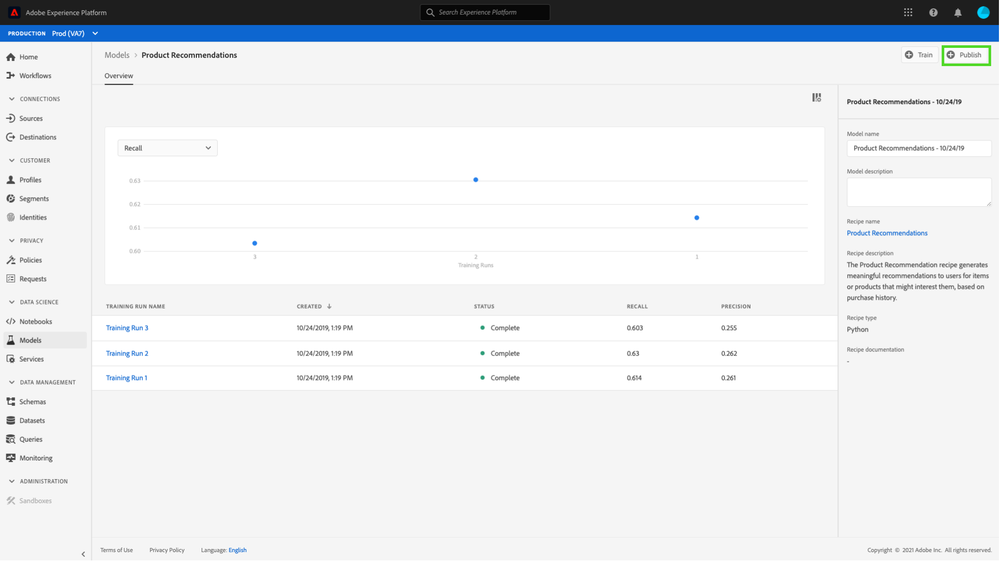
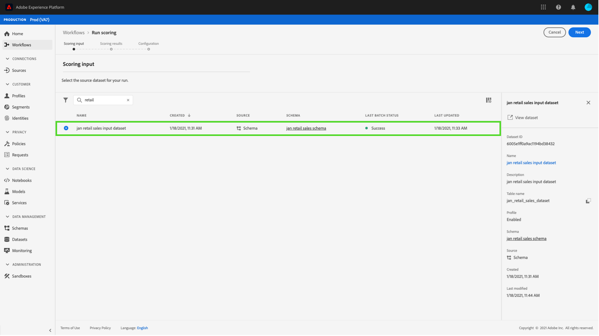
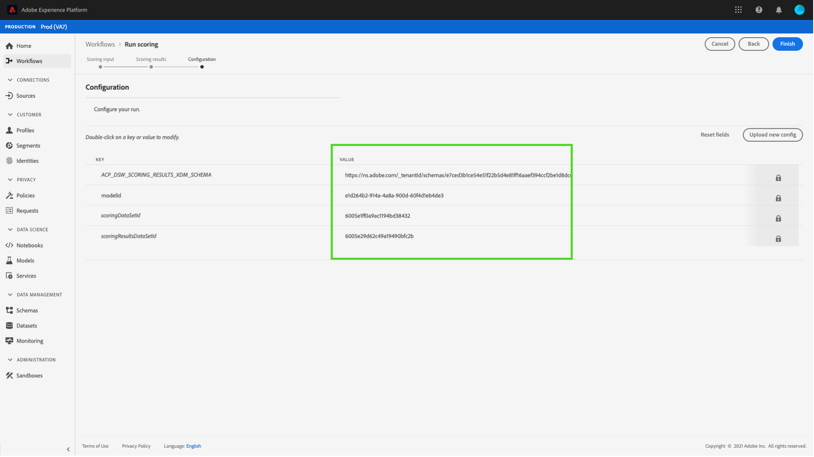

# Data Science Workspace UI でモデルをサービスとして公開する

Adobe Experience Platform Data Science Workspace　を使用すると、訓練を受けた評価済みのモデルをサービスとして公開でき、IMS 組織内のユーザーは、独自のモデルを作成する必要なくデータをスコアリングできます。

## はじめに

このチュートリアルを完了するには、[!DNL Experience Platform] にアクセスできる必要があります。 [!DNL Experience Platform] の IMS 組織にアクセスできない場合は、先に進む前にシステム管理者にお問い合わせください。

このチュートリアルでは、トレーニングを正常に実行できる既存のモデルが必要です。公開できるモデルがない場合は、「[UI でのモデルの訓練と評価](./train-evaluate-model-ui.md)」チュートリアルに従って操作を続行します。

Sensei 機械学習 API を使用してモデルを公開する場合は、[API のチュートリアル](./publish-model-service-api.md)を参照してください。

## モデルの公開 {#publish-a-model}

Adobe Experience Platformで、左側のナビゲーション列にある「**[!UICONTROL モデル]**」を選択し、「**[!UICONTROL 参照]**」タブを選択して、既存のすべてのモデルを一覧表示します。 サービスとして公開するモデルの名前を選択します。

サービス作成プロセスを開始するには、モデル概要ページの右上近くにある「**[!UICONTROL 公開]**」を選択します。

サービスの名前を入力し、必要に応じてサービスの説明を入力します。完了したら、「**[!UICONTROL 次へ]**」を選択します。

モデルに対する実行が成功したトレーニングがすべて表示されます。新しいサービスは、選択したトレーニングの実行からトレーニングとスコアの設定を継承します。

「**[!UICONTROL 完了]**」を選択してサービスを作成し、「**[!UICONTROL サービスギャラリー]**」にリダイレクトして、新しく作成したサービスを含む、使用可能なすべてのサービスを表示します。

## サービスを使用したスコア {#access-a-service}

Adobe Experience Platformで、左側のナビゲーション列にある「**[!UICONTROL サービス]**」タブを選択し、「**[!UICONTROL サービスギャラリー]**」にアクセスします。 使用するサービスを探し、**[!UICONTROL Open]** を選択します。

サービスの概要ページで、「**[!UICONTROL スコア]**」を選択します。

スコアリング実行に適した入力データセットを選択し、「**[!UICONTROL 次へ]**」を選択します。 スコアリングデータセットに対しても同じ手順を実行するよう求められます。 入出力データセットを選択したら、設定を更新できます。

サービスを作成すると、デフォルトのスコア設定が継承されます。これらの設定を確認し、必要に応じて値をダブルクリックして調整できます。設定が完了したら、「**[!UICONTROL 完了]**」を選択して、スコアリングの実行を開始します。

サービスの&#x200B;**概要**&#x200B;ページに、新しいスコアリングジョブとその進行状況の詳細が表示されます。ジョブが完了すると、**[!UICONTROL Scoring]** コンテナ内の **[!UICONTROL Most Recent]** ヘッダーが更新されます。

## 次の手順 {#next-steps}

このチュートリアルでは、[!UICONTROL サービスギャラリー]を通じてアクセス可能なサービスとしてモデルを公開し、新しいサービスを使用してデータをスコアリングしました。次のチュートリアルに進み、[サービスで自動トレーニングとスコアリングの実行をスケジュールする](./schedule-models-ui.md)方法を学びます。
