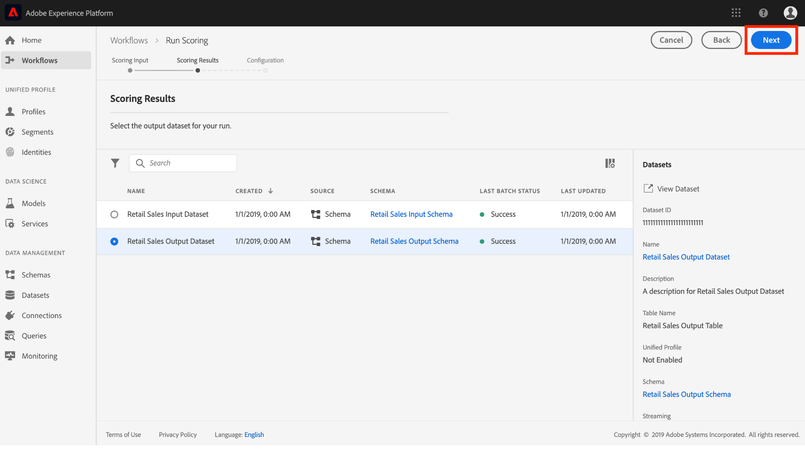

# モデルのサービスとしての公開（UI）

Adobe Experience Platform Data Science Workspace　を使用すると、訓練を受けた評価済みのモデルをサービスとして公開でき、IMS 組織内のユーザーは、独自のモデルを作成する必要なくデータをスコアリングできます。

## はじめに

このチュートリアルを完了するには、[!DNL Experience Platform]にアクセスできる必要があります。 [!DNL Experience Platform]のIMS組織にアクセスできない場合は、先に進む前に、システム管理者にお問い合わせください。

このチュートリアルでは、トレーニングを正常に実行できる既存のモデルが必要です。公開できるモデルがない場合は、「[UI でのモデルの訓練と評価](./train-evaluate-model-ui.md)」チュートリアルに従って操作を続行します。

Sensei 機械学習 API を使用してモデルを公開する場合は、[API のチュートリアル](./publish-model-service-api.md)を参照してください。

## モデルの公開 {#publish-a-model}

1. Adobe Experience Platform で、左側のナビゲーション列にある「**[!UICONTROL モデル]**」リンクをクリックして、既存のすべてのモデルを一覧表示します。サービスとして公開するモデルの名前を探し、クリックします。
   
2. サービス作成プロセスを開始するには、モデル概要ページの右上近くにある「**[!UICONTROL 公開]**」をクリックします。
   
3. サービスの名前を入力し、必要に応じてサービスの説明を入力します。完了したら、「**[!UICONTROL 次へ]**」をクリックします。
   
4. モデルに対する実行が成功したトレーニングがすべて表示されます。新しいサービスは、選択したトレーニングの実行からトレーニングとスコアの設定を継承します。
   
5. 「**[!UICONTROL 完了]**」をクリックしてサービスを作成し、「**[!UICONTROL サービスギャラリー]**」にリダイレクトして、新しく作成したサービスを含む、使用可能なすべてのサービスを表示します。
   

## サービスを使用したスコア  {#access-a-service}

1. Adobe Experience Platform で、左側のナビゲーション列にある「**[!UICONTROL サービス]**」タブをクリックして、**[!UICONTROL サービスギャラリー]**&#x200B;にアクセスします。使用するサービスを見つけ、「**[!UICONTROL スコア]**」をクリックします。
   
2. スコアリング実行に適した入力データセットを選択し、「**[!UICONTROL 次へ]**」をクリックします。
   
3. スコアリング結果に適した出力データセットを選択し、「**[!UICONTROL 次へ]**」をクリックします。
   
4. サービスを作成すると、デフォルトのスコア設定が継承されます。これらの設定を確認し、必要に応じて値をダブルクリックして調整できます。設定が完了したら、「**[!UICONTROL 完了]**」をクリックして、スコアリングの実行を開始します。
   
5. サービスの&#x200B;**概要**&#x200B;ページに、新しいスコアリングジョブとその進行状況の詳細が表示されます。ジョブが完了すると、**[!UICONTROL スコア]**&#x200B;コンテナ内の&#x200B;**[!UICONTROL 最新]**ヘッダーが更新されます。
   

## 次の手順 {#next-steps}

このチュートリアルでは、[!UICONTROL サービスギャラリー]を通じてアクセス可能なサービスとしてモデルを公開し、新しいサービスを使用してデータをスコアリングしました。次のチュートリアルに進み、[サービスで自動トレーニングとスコアリングの実行をスケジュールする](./schedule-models-ui.md)方法を学びます。
