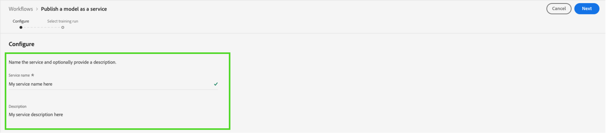
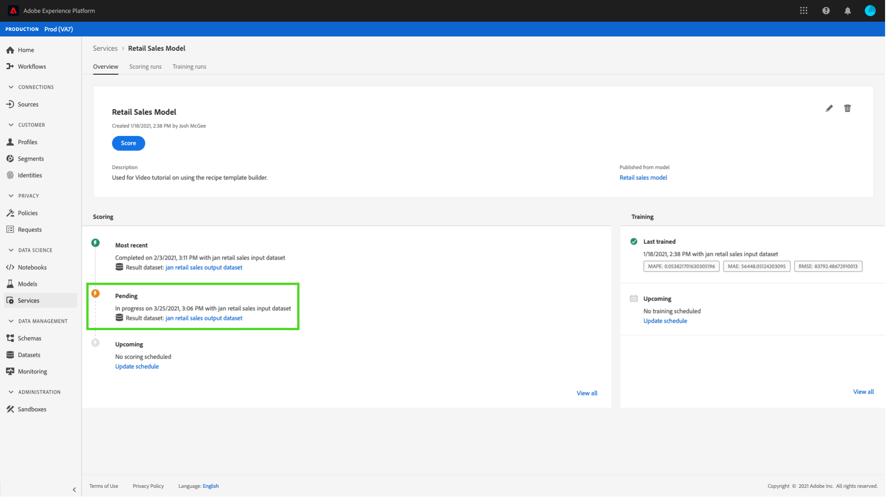

# Data Science Workspace UI でモデルをサービスとして公開する {#publish-a-model-as-a-service}

>[!CONTEXTUALHELP]
>id="platform_intelligentservices_publishmodel"
>title="サービスとしてのモデルの公開"
>abstract=""

Adobe Experience Platform Data Science Workspace を使用すると、トレーニング済みおよび評価済みのモデルをサービスとして公開でき、組織内のユーザーが独自のモデルを作成しなくてもデータのスコアを取得できます。

## はじめに

このチュートリアルを完了するには、にアクセスできる必要があります。 [!DNL Experience Platform]. で組織にアクセスする権限がない場合 [!DNL Experience Platform]続行する前にシステム管理者に問い合わせてください。

このチュートリアルでは、トレーニングを正常に実行できる既存のモデルが必要です。公開できるモデルがない場合は、「[UI でのモデルの訓練と評価](./train-evaluate-model-ui.md)」チュートリアルに従って操作を続行します。

Sensei 機械学習 API を使用してモデルを公開する場合は、[API のチュートリアル](./publish-model-service-api.md)を参照してください。

## モデルの公開 {#publish-a-model}

Adobe Experience Platformで、を選択します。 **[!UICONTROL モデル]** 左側のナビゲーション列にあるを選択します。 **[!UICONTROL 参照]** タブをクリックすると、既存のすべてのモデルが一覧表示されます。 サービスとして公開するモデルの名前を選択します。

を選択 **[!UICONTROL 公開]** モデルの概要ページの右上付近にある、サービス作成プロセスを開始します。

サービスに必要な名前を入力し、オプションでサービスの説明を入力して、 **[!UICONTROL 次]** 終了したとき。

モデルに対する実行が成功したトレーニングがすべて表示されます。新しいサービスは、選択したトレーニングの実行からトレーニングとスコアの設定を継承します。

を選択 **[!UICONTROL 終了]** サービスを作成し、にリダイレクトするには **[!UICONTROL サービスギャラリー]** 新規作成されたサービスを含め、使用可能なすべてのサービスを表示します。

## サービスを使用したスコア {#access-a-service}

Adobe Experience Platformで、 **[!UICONTROL サービス]** にアクセスするには、左側のナビゲーション列にあるタブ **[!UICONTROL サービスギャラリー]**. 使用するサービスを見つけて選択します **[!UICONTROL 開く]**.

サービスの概要ページで、 **[!UICONTROL スコア]**.

スコアリング実行に適した入力データセットを選択し、 **[!UICONTROL 次]**. スコアリングデータセットに対して同じ手順を実行するように求められます。 入力および出力データセットを選択したら、設定を更新できます。

サービスを作成すると、デフォルトのスコア設定が継承されます。これらの設定を確認し、必要に応じて値をダブルクリックして調整できます。設定に満足したら、次を選択します。 **[!UICONTROL 終了]** スコアリング実行を開始します。

サービスの&#x200B;**概要**&#x200B;ページに、新しいスコアリングジョブとその進行状況の詳細が表示されます。ジョブが完了すると、 **[!UICONTROL 最新]** 内のヘッダー **[!UICONTROL スコアリング]** コンテナが更新されます。

## 次の手順 {#next-steps}

このチュートリアルでは、[!UICONTROL サービスギャラリー]を通じてアクセス可能なサービスとしてモデルを公開し、新しいサービスを使用してデータをスコアリングしました。次のチュートリアルに進み、[サービスで自動トレーニングとスコアリングの実行をスケジュールする](./schedule-models-ui.md)方法を学びます。
