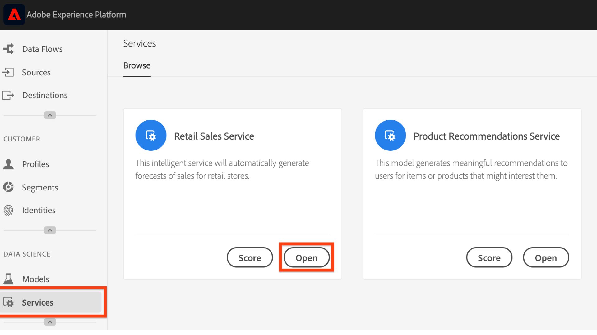
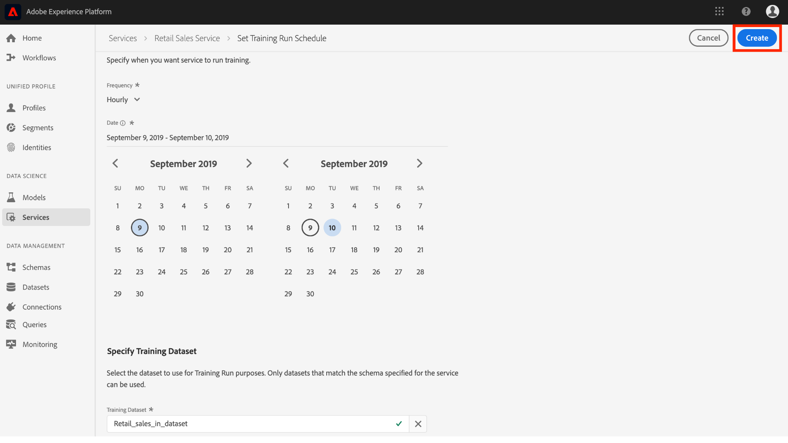

# モデルのスケジュール設定（UI）

Adobe Experience Platform[!DNL Data Science Workspace]では、機械学習サービスでのスケジュール済みスコアおよびトレーニングの実行を設定できます。 トレーニングとスコアリングを自動処理すると、データ内のパターンに追いつくことで、サービスの効率を時間をかけて維持および改善できます。

このチュートリアルでは、[!UICONTROL サービスギャラリー]を通じて、既存のサービスに対するトレーニングとスコアリングのスケジュールを設定する手順について説明します。チュートリアルは以下の主な節に分かれています。

- [スコアリングのスケジュール設定](#configure-scheduled-scoring)
- [スケジュール済みトレーニングの設定](#configure-scheduled-training)

## はじめに

このチュートリアルを完了するには、[!DNL Experience Platform]にアクセスできる必要があります。 [!DNL Experience Platform]のIMS組織にアクセスできない場合は、先に進む前に、システム管理者にお問い合わせください。

このチュートリアルには既存のサービスが必要です。使用するアクセス可能なサービスがない場合は、『[UI でのサービスとしてのモデルの公開](./publish-model-service-ui.md)』チュートリアルに従ってサービスを作成できます。

## スコアリングののスケジュール設定 {#configure-scheduled-scoring}

モデルスコアリングは、スケジュールに基づいて自動処理されるように設定できます。サービスを作成したら、次の手順に従って、スコアリングのスケジュールを設定および適用できます。

1. Adobe Experience Platformで、左のナビゲーション列にある&#x200B;**[!UICONTROL サービス]**&#x200B;タブをクリックして&#x200B;**[!DNL Service Gallery]**&#x200B;にアクセスします。 スコアリング実行のスケジュールを設定するサービスを探し、「**[!UICONTROL 開く]**」をクリックして、その&#x200B;**概要**ページを表示します。
   

2. 概要ページに、サービスのスコアリング情報が表示されます。「**[!UICONTROL スケジュールの更新]**」リンクをクリックして、スコアリングのスケジュールを設定します。
   

3. スコアリングスケジュールの頻度、開始日、終了日、入力データセットおよび出力データセットを設定します。設定が完了したら、「**[!UICONTROL 作成]**」をクリックして、サービスのスコアリングスケジュールを更新します。
   

4. 更新されたスコアリングスケジュールが、サービスの&#x200B;**概要**ページに表示されます。
   

## スケジュール済みトレーニングの設定  {#configure-scheduled-training}

サービスでトレーニング実行をスケジュール設定すると、機械学習モデルが最新のデータパターンに更新されます。スケジュールされたトレーニングの実行が完了するたびに、結果のトレーニング済みモデルは、次のスケジュール済みトレーニングの実行までサービスを強化するために使用されます。

サービスを作成したら、次の手順に従ってトレーニングスケジュールを設定および適用できます。

1. Adobe Experience Platform で、左側のナビゲーション列にある「**[!UICONTROL サービス]**」タブをクリックして、**[!UICONTROL サービスギャラリー]**&#x200B;にアクセスします。トレーニング実行のスケジュールを設定するサービスを探し、「**[!UICONTROL 開く]**」をクリックして、その&#x200B;**概要**ページを表示します。
   

2. 概要ページには、サービスのトレーニング情報が表示されます。「**[!UICONTROL スケジュールの更新]**」リンクをクリックして、トレーニングスケジュールを設定します。
   

3. トレーニングスケジュールに使用する頻度、開始日、終了日、入力データセットを設定します。設定が完了したら、「**[!UICONTROL 作成]**」をクリックして、サービスのトレーニングスケジュールを更新します。
   

4. 更新されたトレーニングスケジュールが、サービスの&#x200B;**概要**ページに表示されます。
   

## 次の手順

このチュートリアルに従うと、サービスでの自動トレーニングとスコアリングの実行を正常にスケジュールし、[!DNL Data Science Workspace]チュートリアルUIワークフローを完了できます。 まだおこなっていない場合は、[チュートリアルを再開](./create-retails-sales-dataset.md)して、API ワークフローに従ってモデルを作成、トレーニング、スコアリング、および公開することを検討してください。
