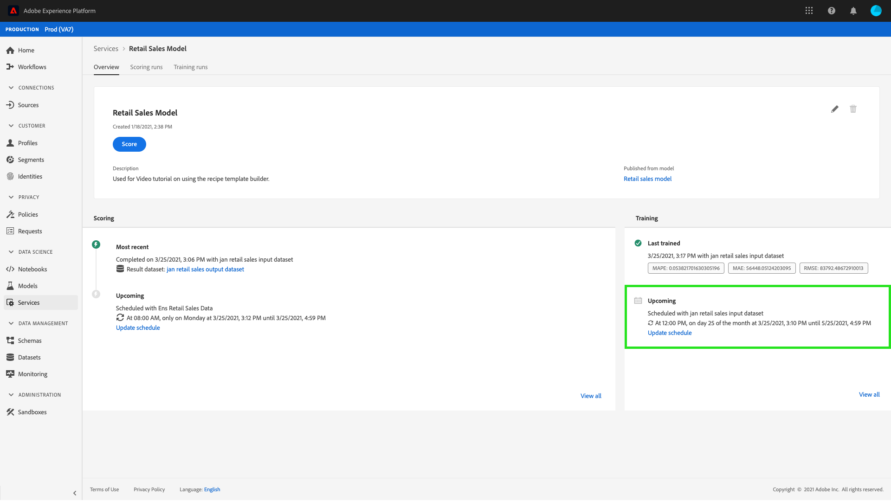

# Data Science Workspace UI でのモデルのスケジュール設定

Adobe Experience Platform [!DNL Data Science Workspace] では、機械学習サービスにスケジュールされたスコアリングとトレーニングの実行を設定できます。 トレーニングとスコアリングプロセスを自動化することで、データ内のパターンに追いつくことで、時間を通じてサービスの効率を維持し、向上させることができます。

このチュートリアルでは、[!UICONTROL  サービスギャラリー ] を使用して、既存のサービスに対してトレーニングおよびスコアリングスケジュールを設定する手順について説明します。 チュートリアルは以下の主な節に分かれています。

- [スコアリングののスケジュール設定](#configure-scheduled-scoring)
- [スケジュール済みトレーニングの設定](#configure-scheduled-training)

## はじめに

このチュートリアルを完了するには、[!DNL Experience Platform] へのアクセス権が必要です。 [!DNL Experience Platform] の組織にアクセスする権限がない場合は、続行する前にシステム管理者に問い合わせてください。

このチュートリアルでは、既存のサービスが必要です。 操作するアクセス可能なサービスがない場合は、「サービスとしてのモデルの公開 [ に関するチュートリアルに従ってサービスを作成でき ](./publish-model-service-ui.md) す。

## スコアリングののスケジュール設定 {#configure-scheduled-scoring}

モデルスコアリングは、スケジュールに基づいて自動処理されるように設定できます。サービスを作成したら、次の手順に従ってスコアリングスケジュールを設定し適用できます。

Adobe Experience Platformで、左側のナビゲーション列にある「**[!UICONTROL サービス]**」タブを選択して、サー **[!DNL Service Gallery]** スにアクセスします。 スコアリング実行をスケジュールするサービスを検索し、「**[!UICONTROL オープン]**」を選択して **[!UICONTROL 概要]** ページを表示します。

概要ページに、サービスのスコアリング情報が表示されます。「**[!UICONTROL スケジュールの更新]**」リンクを選択して、スコアリング・スケジュールを構成します。

スコアリングスケジュールの頻度、開始日、終了日、入力データセットおよび出力データセットを設定します。設定に満足したら、「**[!UICONTROL 作成]**」を選択して、サービスのスコアリングスケジュールを更新します。

更新されたスコアリングスケジュールがサービスの **[!UICONTROL 概要]** ページに表示されます。

## スケジュール済みトレーニングの設定 {#configure-scheduled-training}

サービスでスケジュールされたトレーニングの実行を設定すると、機械学習モデルを最新のデータパターンに確実に更新できます。 スケジュールされたトレーニング実行が完了するたびに、結果として得られたトレーニング済みモデルを使用して、次のスケジュールされたトレーニング実行までサービスの電源を入れます。

サービスを作成したら、次の手順に従ってトレーニングスケジュールを設定し、適用できます。

Adobe Experience Platformで、左側のナビゲーション列にある「**[!UICONTROL サービス]**」タブを選択し、**[!UICONTROL サービスギャラリー]** にアクセスします。 トレーニングの実行をスケジュールするサービスを見つけ、「**[!UICONTROL 開く]** を選択して **[!UICONTROL 概要]** ページを表示します。

概要ページには、サービスのトレーニング情報が表示されます。 **[!UICONTROL スケジュールを更新]** リンクを選択して、トレーニングスケジュールを設定します。

トレーニングスケジュールに使用する頻度、開始日、終了日、入力データセットを設定します。設定に満足したら、「**[!UICONTROL 作成]**」を選択して、サービスのトレーニングスケジュールを更新します。

更新されたトレーニングスケジュールがサービスの **[!UICONTROL 概要]** ページに表示されます。

## 次の手順

このチュートリアルでは、サービスに対する自動トレーニングとスコアリングの実行を正常にスケジュールし、[!DNL Data Science Workspace] のチュートリアル UI ワークフローを完了しました。 まだ行っていない場合は、[ チュートリアルを再開 ](./create-retails-sales-dataset.md) を検討し、API ワークフローに従って、モデルの作成、トレーニング、スコアリングおよび公開を行います。
