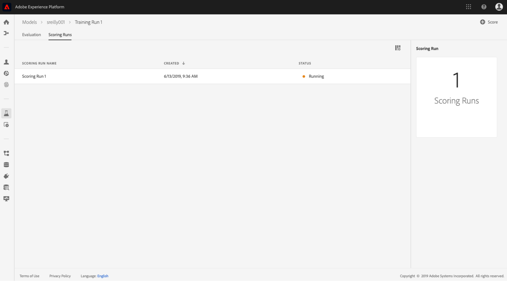

# Data Science Workspace UI でのモデルのスコア付け

Adobe Experience Platformでのスコア [!DNL Data Science Workspace] は、既存のトレーニング済みモデルに入力データを送ることで達成できます。 次に、スコアリング結果が保存され、新しいバッチとして指定した出力データセットで表示可能になります。

このチュートリアルでは、 [!DNL Data Science Workspace] ユーザーインターフェイス。

## はじめに

このチュートリアルを完了するには、 [!DNL Experience Platform]. の IMS 組織へのアクセス権がない場合 [!DNL Experience Platform]続行する前に、システム管理者にお問い合わせください。

このチュートリアルには、トレーニング済みのモデルが必要です。トレーニング済みモデルがない場合は、続行する前に、『[UI でのモデルのトレーニングと評価](./train-evaluate-model-ui.md)』チュートリアルに従ってください。

## 新しいスコアリングの実行の作成

スコアリングの実行は、以前に完了し評価されたトレーニングの実行の最適化された設定を使用して作成されます。モデルの最適な設定のセットは、通常、トレーニングの実行評価指標を見直すことで決定されます。

最も最適なトレーニング実行を見つけて、その設定をスコアリングに使用します。次に、目的のトレーニング実行を開き、名前に添付されたハイパーリンクを選択します。

トレーニング実行から **[!UICONTROL 評価]** タブ、選択 **[!UICONTROL スコア]** は、画面の右上に表示されます。 新しいスコアリングワークフローが開始されます。

入力スコアリングデータセットを選択し、「 」を選択します。 **[!UICONTROL 次へ]**.

出力スコアリングデータセットを選択します。これは、スコアリング結果が保存される専用の出力データセットです。選択を確認し、「 」を選択します。 **[!UICONTROL 次へ]**.

ワークフローの最後の手順で、スコアリングの実行を設定するよう求められます。これらの設定は、スコアリングの実行にモデルで使用されます。
モデルの作成時に設定された継承パラメータは削除できないことに注意してください。 継承されていないパラメーターは、値をダブルクリックするか、エントリにカーソルを合わせながら元に戻すアイコンを選択することで、編集または元に戻すことができます。

スコアリング設定を確認して、「 」を選択します。 **[!UICONTROL 完了]**  をクリックし、スコアリングの実行を作成して実行します。 次の場所に移動しました： **[!UICONTROL スコアリング実行]** 」タブに移動し、 **[!UICONTROL 保留中]** ステータスが表示されます。

スコア付け実行は、次のいずれかのステータスで表示できます。
- 保留中
- Complete
- 失敗
- 実行中

ステータスは自動的に更新されます。 ステータスが「 」の場合は次の手順に進みます。 **[!UICONTROL 完了]** または **[!UICONTROL 失敗]**.

## スコアリング結果の表示

スコアリング結果を表示するには、まずトレーニング実行を選択します。

トレーニング実行にリダイレクトされます **[!UICONTROL 評価]** ページ。 トレーニングの実行の評価ページの上部にある、「 **[!UICONTROL スコアリング実行]** タブをクリックして、既存のスコアリング実行のリストを表示します。

次に、スコアリングの実行を選択して、実行の詳細を表示します。

選択したスコアリング実行のステータスが「完了」または「失敗」の場合、 **[!UICONTROL アクティビティログを表示]** リンクが使用可能になります。 スコア付け実行が失敗した場合、実行ログは失敗の理由を判断するのに役立つ情報を提供できます。 実行ログをダウンロードするには、 **[!UICONTROL アクティビティログを表示]**.

この **[!UICONTROL アクティビティログを表示]** ポップオーバーが表示されます。 関連するログを自動的にダウンロードする URL を選択します。

また、「 」を選択して、スコアリング結果を表示するオプションもあります  **[!UICONTROL スコアリング結果のデータセットをプレビュー]**.

出力データセットのプレビューが表示されます。

スコアリング結果の完全なセットについて、 **[!UICONTROL スコアリング結果のデータセット]** 右側の列にあるリンク。

## 次の手順

このチュートリアルでは、でトレーニング済みモデルを使用してデータをスコアリングする手順を説明しました。 [!DNL Data Science Workspace]. [UI でモデルをサービスとして公開](./publish-model-service-ui.md)する方法のチュートリアルに従って、組織内のユーザーが機械学習サービスに簡単にアクセスしてデータをスコアリングできるようにします。
