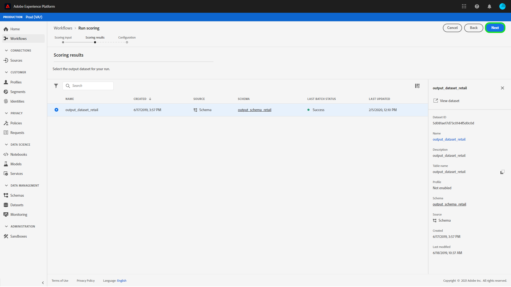

# Data Science Workspace UI でのモデルのスコアリング

Adobe Experience Platform [!DNL Data Science Workspace] でのスコアリングは、既存のトレーニング済みモデルに入力データを送ることで達成できます。 次に、スコアリング結果が保存され、新しいバッチとして指定した出力データセットで表示可能になります。

このチュートリアルでは、[!DNL Data Science Workspace] ユーザーインターフェイスでモデルにスコアを付けるために必要な手順を説明します。

## はじめに

このチュートリアルを完了するには、[!DNL Experience Platform] にアクセスできる必要があります。 [!DNL Experience Platform] の IMS 組織にアクセスできない場合は、先に進む前にシステム管理者にお問い合わせください。

このチュートリアルには、トレーニング済みのモデルが必要です。トレーニング済みモデルがない場合は、続行する前に、『[UI でのモデルのトレーニングと評価](./train-evaluate-model-ui.md)』チュートリアルに従ってください。

## 新しいスコアリングの実行の作成

スコアリングの実行は、以前に完了し評価されたトレーニングの実行の最適化された設定を使用して作成されます。モデルの最適な設定のセットは、通常、トレーニングの実行評価指標を見直すことで決定されます。

最も最適なトレーニング実行を見つけて、その設定をスコアリングに使用します。次に、目的のトレーニング実行を開き、名前に添付されたハイパーリンクを選択します。

トレーニング実行「**[!UICONTROL 評価]**」タブで、画面の右上にある「**[!UICONTROL スコア]**」を選択します。 新しいスコアリングワークフローが開始されます。

入力スコアリングデータセットを選択し、「**[!UICONTROL 次へ]**」を選択します。

出力スコアリングデータセットを選択します。これは、スコアリング結果が保存される専用の出力データセットです。選択を確認し、「**[!UICONTROL 次へ]**」を選択します。

ワークフローの最後の手順で、スコアリングの実行を設定するよう求められます。これらの設定は、スコアリングの実行にモデルで使用されます。
モデルの作成時に設定された継承パラメータは削除できません。 継承されていないパラメーターを編集または元に戻すには、値をダブルクリックするか、エントリの上にマウスポインターを置いて元に戻すアイコンを選択します。

スコアリング設定を確認し、「**[!UICONTROL 完了]**」を選択して、スコアリングの実行を作成して実行します。 「**[!UICONTROL スコア付けの実行]**」タブに移動し、新しいスコア付けの実行のステータスが「**[!UICONTROL 保留]**」になります。

スコア付け実行は、次のいずれかのステータスで表示できます。
- 保留中
- Complete
- Failed
- 実行中

ステータスは自動的に更新されます。 ステータスが「**[!UICONTROL 完了]**」または「**[!UICONTROL 失敗]**」の場合は、次の手順に進みます。

## スコアリング結果の表示

スコアリング結果を表示するには、まずトレーニングの実行を選択します。

トレーニング実行 **[!UICONTROL 評価]** ページにリダイレクトされます。 トレーニングの実行の評価ページの上部近くにある「**[!UICONTROL スコアリングの実行]**」タブを選択し、既存のスコアリングの実行のリストを表示します。

次に、スコアリングの実行を選択して、実行の詳細を表示します。

選択したスコアリングの実行のステータスが「完了」または「失敗」の場合、**[!UICONTROL アクティビティログの表示]** リンクが使用可能になります。 スコア付け実行が失敗した場合、実行ログは失敗の理由を判断するのに役立つ情報を提供できます。 実行ログをダウンロードするには、「**[!UICONTROL アクティビティログを表示]**」を選択します。

「**[!UICONTROL アクティビティログを表示]**」ポップオーバーが表示されます。 URL を選択すると、関連するログが自動的にダウンロードされます。

また、「**[!UICONTROL スコアリング結果データセットのプレビュー]**」を選択して、スコアリング結果を表示することもできます。

出力データセットのプレビューが表示されます。

スコアリング結果の完全なセットについては、右の列にある「**[!UICONTROL スコアリング結果データセット]**」リンクを選択します。

## 次の手順

このチュートリアルでは、[!DNL Data Science Workspace] のトレーニング済みモデルを使用してデータをスコアリングする手順を説明しました。 [UI でモデルをサービスとして公開](./publish-model-service-ui.md)する方法のチュートリアルに従って、組織内のユーザーが機械学習サービスに簡単にアクセスしてデータをスコアリングできるようにします。
