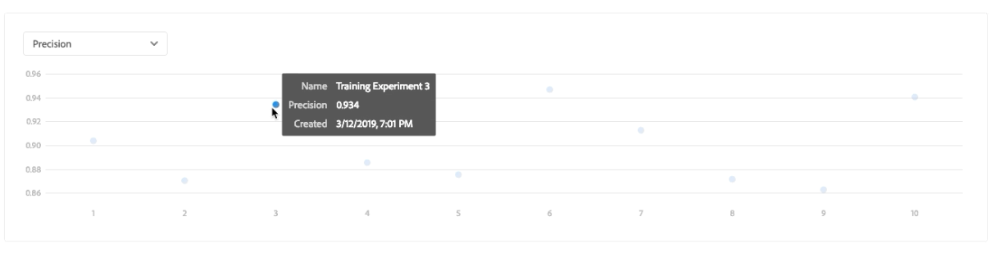

# モデル(UI)のトレーニングと評価

Adobe Experience Platform Data Science Workspaceでは、モデルの意図に適した既存のレシピを組み込むことで、機械学習モデルが作成されます。 次に、モデルに関連するハイパーパラメータを微調整することで、モデルの動作効率と有効性を最適化するようにトレーニングおよび評価します。 レシピは再利用可能で、複数のモデルを作成し、単一のレシピで特定の目的に合わせてカスタマイズできます。

このチュートリアルでは、モデルの作成、トレーニング、評価の手順について説明します。

## はじめに

このチュートリアルを完了するには、エクスペリエンスプラットフォームにアクセスできる必要があります。 Experience PlatformのIMS組織にアクセスできない場合は、先に進む前にシステム管理者にお問い合わせください。

このチュートリアルでは、既存のレシピが必要です。 レシピがない場合は、先に進む前に、UIチュートリ [アルの「パッケージレシピの読み込み](./import-packaged-recipe-ui.md) 」に従ってください。

## モデルの作成

1. Adobe Experience Platformで、左側のナビゲーション列にある「モ **デル** 」リンクをクリックして、既存のすべてのモデルをリストします。 ページ **の右上近くにある** 「モデルを作成」をクリックして、モデル作成プロセスを開始します。
   

2. 既存のレシピのリストを参照し、モデルの作成に使用するレシピを探して選択し、「 **Next**」をクリックします。
   

3. 適切な入力データセットを選択し、「 **Next**」をクリックします。 これにより、モデルのデフォルトの入力トレーニングデータセットが設定されます。
   

4. モデルの名前を指定し、デフォルトのモデル設定を確認します。 レシピの作成中にデフォルトの設定が適用され、値を重複クリックして設定値を確認および変更しました。 新しい設定のセットを指定するには、「新しい設定をアッ **プロード」をクリックし** 、モデル設定を含むJSONファイルをブラウザーウィンドウにドラッグします。 「完了」( **Finish** )をクリックして、モデルを作成します。
   >[!NOTE]設定は、意図されたレシピに固有で、小売販売レシピの設定は、商品レコメンデーションレシピに対しては機能しません。 小売販売レシ [ピ設定のリストについては](#reference) 、リファレンスの節を参照してください。

   

## トレーニング実行の作成

1. Adobe Experience Platformで、左側のナビゲーション列にある「モ **デル** 」リンクをクリックして、既存のすべてのモデルをリストします。 トレーニングを受けるモデルの名前を探し、クリックします。
   

2. 既存のトレーニング実行のうち、現在のトレーニングステータスが表示されます。 Data Science Workspaceユーザーインターフェイスを使用して作成されたモデルの場合、トレーニング実行は、デフォルトの設定と入力トレーニングデータセットを使用して自動的に生成および実行されます。
   

3. 新しいトレーニングを作成するには、[モデ **ルの概要** ]ページの右上近くにある[トレーニング]をクリックします。
   

4. トレーニング実行のトレーニング入力データセットを選択し、「 **Next**」をクリックします。
   

5. モデルの作成時に提供されたデフォルトの設定が表示され、値を重複クリックして変更および変更します。 「 **Finish** 」をクリックして、トレーニング実行を作成し、実行します。
   >[!NOTE]設定は、意図されたレシピに固有で、小売販売レシピの設定は、商品レコメンデーションレシピに対しては機能しません。 小売販売レシ [ピ設定のリストについては](#reference) 、リファレンスの節を参照してください。

   

## モデルの評価

1. Adobe Experience Platformで、左側のナビゲーション列にある「モ **デル** 」リンクをクリックして、既存のすべてのモデルをリストします。 評価するモデルの名前を探し、クリックします。
   

2. 既存のトレーニング実行のうち、現在のトレーニングステータスが表示されます。 複数の完了したトレーニング実行がある場合、モデル評価グラフで異なるトレーニング実行間で評価指標を比較し、グラフの上のドロップダウンリストを使用して評価指標を選択できます。

   平均絶対誤差率(MAPE)指標は、精度をエラーに対する割合で表します。 これは、パフォーマンスが最も高いテストを特定するために使用されます。 MAPEが低いほど、より良い結果が得られます。

   

   「精度」指標は、取得したインスタンスの合計と比較した、関連するインスタンスの割合 *を示し* ます。 精度は、ランダムに選択した結果が正しい確率と見なすことができます。
   

   特定のトレーニングの実行をクリックして、その表示の実行の詳細を選択します。 これは、実行が完了する前でも実行できます。 実行の詳細ページでは、トレーニングの実行に固有の他の評価指標、設定パラメーターおよびビジュアライゼーションを確認できます。 また、実行の詳細を確認するアクティビティログをダウンロードすることもできます。 ログは、失敗した実行で何が起きたかを確認するのに特に役立ちます。
   

3. ハイパーパラメータはトレーニングできず、異なる組み合わせのハイパーパラメータをテストすることでモデルを最適化する必要があります。 最適化されたモデルに到達するまで、このモデルのトレーニングと評価のプロセスを繰り返します。

## 次の手順

このチュートリアルでは、Data Science Workspaceでのモデルの作成、トレーニング、および評価に関する手順を説明しました。 最適化されたモデルに到達したら、UIチュートリアルの「モデルにスコアを付ける」に従って、トレーニングを受けたモデルを使用し [てインサイトを生成できます](./score-model-ui.md) 。

## リファレンス

### 小売販売レシピの設定

ハイパーパラメータは、モデルのトレーニング動作を決定し、ハイパーパラメータを修正すると、モデルの精度と精度に影響を与えます。

| Hyperparameter | 説明 | 推奨範囲 |
--- | --- | ---
| learning_rate | 学習率は、learning_rateによって各ツリーの貢献度を減らします。 learning_rateとn_estimatorsの間にトレードオフがあります。 | 0.1 | [2 - 10] /見積人数 |
| n_estimators | 実行する昇圧ステージの数。 グラデーションのブーストは、オーバーフィットに対してかなり強力なので、通常、大きな数値を指定するとパフォーマンスが向上します。 | 100 | 100 - 1000 |
| max_depth | 個々の回帰予測の最大深さ。 最大の深さは、ツリー内のノード数を制限します。 最高のパフォーマンスを得るには、このパラメータを調整します。最適な値は、入力変数の操作に依存します。 | 3 | 4 - 10 |

その他のパラメーターは、モデルの技術的特性を決定します。

| パラメータキー | タイプ | 説明 |
| ----- | ----- | ----- |
| `ACP_DSW_INPUT_FEATURES` | 文字列 | リスト。 |
| `ACP_DSW_TARGET_FEATURES` | 文字列 | リスト。 |
| `ACP_DSW_FEATURE_UPDATE_SUPPORT` | Boolean | 入出力機能を変更可能にするかどうかを指定します。 |
| `tenantId` | 文字列 | このIDを使用すると、作成したリソースの名前が適切に付けられ、IMS組織内に含まれるようになります。 [テナントIDを検索するには](../../xdm/api/getting-started.md#know-your-tenant-id) 、次の手順に従います。 |
| `ACP_DSW_TRAINING_XDM_SCHEMA` | 文字列 | モデルのトレーニングに使用する入力スキーマ。 |
| `evaluation.labelColumn` | 文字列 | 評価のビジュアライゼーションの列ラベル。 |
| `evaluation.metrics` | 文字列 | モデルのリストに使用する評価指標のコンマ区切りの評価。 |
| `ACP_DSW_SCORING_RESULTS_XDM_SCHEMA` | 文字列 | モデルのスコアスキーマに使用する出力データ。 |