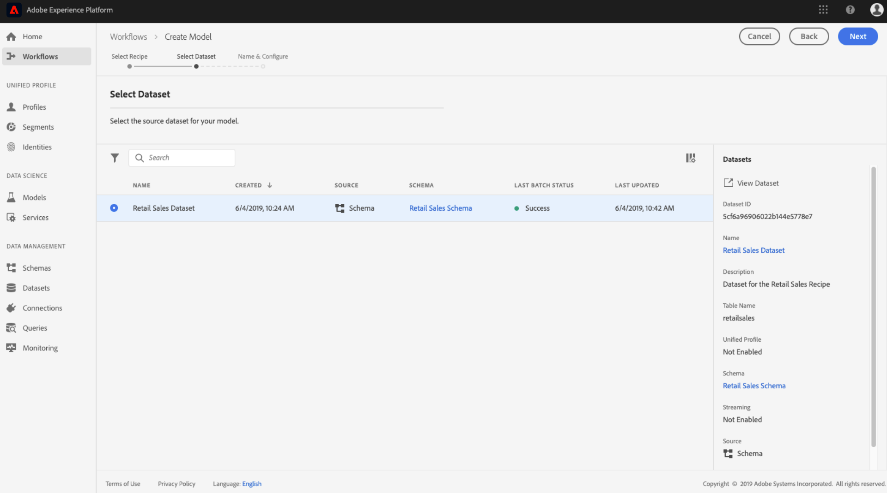

# Data Science Workspace UI でのモデルのトレーニングと評価

Adobe Experience Platform Data Science Workspace　では、モデルの意図に適した既存のレシピを組み込むことで、機械学習モデルが作成されます。次に、モデルに関連するハイパーパラメーターを微調整することで、モデルの動作効率と有効性を最適化するようにトレーニングおよび評価します。レシピは再利用可能で、複数のモデルを作成し、単一のレシピで特定の目的に合わせてカスタマイズできます。

このチュートリアルでは、モデルの作成、トレーニング、評価の手順について説明します。

## はじめに

このチュートリアルを完了するには、 [!DNL Experience Platform]. の IMS 組織へのアクセス権がない場合 [!DNL Experience Platform]続行する前に、システム管理者にお問い合わせください。

このチュートリアルでは、既存のレシピが必要です。レシピがない場合は、先に進む前に、「[UI へのパッケージレシピの読み込み](./import-packaged-recipe-ui.md)」チュートリアルに従ってください。

## モデルの作成

Experience Platformで、 **[!UICONTROL モデル]** 左側のナビゲーションにある「 」タブをクリックし、「参照」タブを選択して既存のモデルを表示します。 選択 **[!UICONTROL モデルを作成]** ページの右上付近にあるモデル作成プロセスを開始します。

既存のレシピのリストを参照し、モデルの作成に使用するレシピを見つけて選択し、「 」を選択します。 **[!UICONTROL 次へ]**.

適切な入力データセットを選択し、「 」を選択します。 **[!UICONTROL 次へ]**. これにより、モデルのデフォルトの入力トレーニングデータセットが設定されます。

モデルの名前を指定し、デフォルトのモデル設定を確認します。レシピの作成中にデフォルトの設定が適用されています。値をダブルクリックして設定値を確認および変更します。

新しい設定のセットを指定するには、「 」を選択します。 **[!UICONTROL 新しい設定をアップロード]** をクリックし、モデル設定を含む JSON ファイルをブラウザーウィンドウにドラッグします。 選択 **[!UICONTROL 完了]** をクリックして、モデルを作成します。

>[!NOTE]
>
>設定は、意図されたレシピに固有です。例えば、「小売販売レシピ」の設定は、「製品レコメンデーションレシピ」に対しては機能しません。小売販売レシピ設定のリストについては「[リファレンス](#reference)」の節を照してください。

## トレーニング実行の作成

Experience Platformで、 **[!UICONTROL モデル]** 左側のナビゲーションにある「 」タブをクリックし、「参照」タブを選択して既存のモデルを表示します。 トレーニングするモデルの名前にアタッチされたハイパーリンクを探して選択します。

既存のトレーニング実行と現在のトレーニングステータスが表示されます。を使用して作成されたモデルの場合 [!DNL Data Science Workspace] ユーザーインターフェイスでは、トレーニング実行は、デフォルトの設定と入力トレーニングデータセットを使用して自動的に生成され、実行されます。

「 」を選択して新しいトレーニング実行を作成します **[!UICONTROL トレーニング]** をクリックします。

トレーニング実行のトレーニング入力データセットを選択し、「 」を選択します。 **[!UICONTROL 次へ]**.

モデルの作成時に提供されたデフォルトの設定が表示されるので、値をダブルクリックして変更および修正します。選択 **[!UICONTROL 完了]** をクリックし、トレーニング実行を作成して実行します。

>[!NOTE]
>
>設定は、意図されたレシピに固有です。例えば、「小売販売レシピ」の設定は、「製品レコメンデーションレシピ」に対しては機能しません。小売販売レシピ設定のリストについては「[リファレンス](#reference)」の節を照してください。

## モデルの評価

Experience Platformで、 **[!UICONTROL モデル]** 左側のナビゲーションにある「 」タブをクリックし、「参照」タブを選択して既存のモデルを表示します。 評価するモデルの名前にアタッチされたハイパーリンクを探して選択します。

既存のトレーニング実行と現在のトレーニングステータスが表示されます。複数の完了したトレーニング実行がある場合、評価指標は、モデル評価グラフで、異なるトレーニング実行間で比較できます。グラフの上にあるドロップダウンリストを使用して評価指標を選択します。

絶対百分率誤差（MAPE）指標は、精度をエラーに対する割合で表します。これは、パフォーマンスが最も高い実験を特定するために使用されます。MAPE が低いほど、より良い結果が得られます。

「精度」指標は、*取得された*&#x200B;インスタンスの合計と比較した、関連するインスタンスの割合を示します。精度は、ランダムに選択した結果が正しい確率と見なすことができます。

特定のトレーニング実行を選択すると、評価ページを開くことで、その実行の詳細が表示されます。 これは、実行が完了する前でも実行できます。評価ページでは、トレーニングの実行に固有の他の評価指標、設定パラメーターおよびビジュアライゼーションを確認できます。

また、実行の詳細を確認するアクティビティログをダウンロードすることもできます。ログは、失敗した実行で何が起きたかを確認するのに特に役立ちます。

ハイパーパラメーターはトレーニングできず、異なる組み合わせのハイパーパラメーターをテストすることでモデルを最適化する必要があります。最適化されたモデルに到達するまで、このモデルのトレーニングと評価のプロセスを繰り返します。

## 次の手順

このチュートリアルでは、でのモデルの作成、トレーニング、評価に関する手順を説明しました。 [!DNL Data Science Workspace]. 最適モデルに到達したら、「[UI でのモデルのスコア付け](./score-model-ui.md)」チュートリアルに従って、訓練済みモデルを使用して洞察を生成できます。

## リファレンス {#reference}

### 小売販売レシピの設定

ハイパーパラメーターは、モデルのトレーニング動作を決定します。ハイパーパラメーターを修正すると、モデルの精度と精度に影響を与えます。

| Hyperparameter | 説明 | 推奨範囲 |
| --- | --- | --- |
| learning_rate | 学習率は、learning_rate によって各ツリーの貢献度を減らします。Learning_rate と n_estimators の間にトレードオフがあります。 | 0.1 |
| n_estimators | 実行するブースティングステージの数。勾配ブースティングは、過学習に対してかなり強力なので、通常、大きな数値を指定するとパフォーマンスが向上します。 | 100 |
| max_depth | 個々の回帰予測の最大深さ。最大の深さは、ツリー内のノード数を制限します。最高のパフォーマンスを得るには、このパラメーターを調整します。最適な値は、入力変数の操作に依存します。 | 3 |

他のパラメーターは、モデルの技術的特性を決定します。

| パラメーターキー | タイプ | 説明 |
| ----- | ----- | ----- |
| `ACP_DSW_INPUT_FEATURES` | 文字列 | コンマ区切りの入力スキーマ属性のリスト |
| `ACP_DSW_TARGET_FEATURES` | 文字列 | コンマ区切りの出力スキーマ属性のリスト |
| `ACP_DSW_FEATURE_UPDATE_SUPPORT` | Boolean | 入出力機能が変更可能かどうかを特定します。 |
| `tenantId` | 文字列 | この ID は、作成するリソースの名前空間が適切に設定され、IMS 組織内に含まれるようにします。テナント ID を検索するには、[こちらの手順](../../xdm/api/getting-started.md#know-your-tenant_id)に従います。 |
| `ACP_DSW_TRAINING_XDM_SCHEMA` | 文字列 | モデルのトレーニングに使用する入力スキーマ。 |
| `evaluation.labelColumn` | 文字列 | 評価のビジュアライゼーションの列ラベル |
| `evaluation.metrics` | 文字列 | モデルの評価に使用される評価指標のカンマ区切りのリスト |
| `ACP_DSW_SCORING_RESULTS_XDM_SCHEMA` | 文字列 | モデルのスコアリングに使用される出力スキーマ。 |
