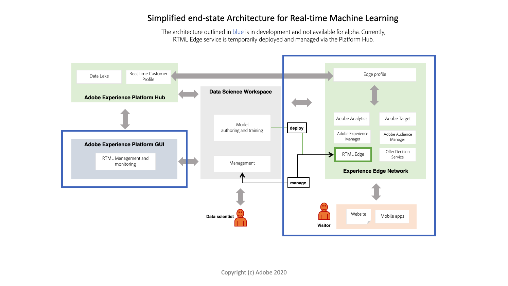

# リアルタイム機械学習の概要（アルファ）

>[!IMPORTANT]
>
>リアルタイム機械学習は、まだすべてのユーザーが利用できるわけではありません。 この機能はアルファ版で、まだテスト中です。 このドキュメントは変更される場合があります。

リアルタイム機械学習は、エンドユーザーのデジタルエクスペリエンスコンテンツの関連性を大幅に高めます。 これは、[!DNL Experience Edge] でのリアルタイムの推論と継続的な学習を活用することで可能になります。

ハブと [!DNL Edge] の両方でシームレスな計算を組み合わせることで、関連性とレスポンシブの両方で、パーソナライズされたエクスペリエンスの強化に従来から関与していた遅延が大幅に削減されます。 したがって、リアルタイム機械学習では、同期意思決定の遅延が非常に低くなります。 例としては、パーソナライズされた Web ページコンテンツのレンダリングや、オファーや割引の表示を使用して、チャーンを減らし、Web ストアでのコンバージョンを増やすなどがあります。

## リアルタイム機械学習アーキテクチャ {#architecture}

次の図は、リアルタイム機械学習アーキテクチャの概要を示しています。 現在、alpha の方が簡略化されています。

## リアルタイム機械学習ワークフロー

次のワークフローでは、リアルタイム機械学習モデルの作成と利用に関わる一般的な手順と結果について説明します。

### データの取り込みと準備

データが取り込まれ、Adobe Experience Platformの [!DNL Experience Data Model] (XDM) で変換されます。 このデータは、モデルトレーニングに使用されます。 XDM について詳しくは、[XDM の概要](../../xdm/home.md)を参照してください。

### オーサリング

リアルタイム機械学習モデルを作成するには、最初からオーサリングするか、Adobe Experience Platform Jupyter Notebooks で事前にトレーニング済みのシリアル化 ONNX モデルとして読み込みます。

### デプロイ

モデルを [!DNL Experience Edge] にデプロイし、予測 API エンドポイントを使用して、[!UICONTROL  サービスギャラリー ] にリアルタイム機械学習サービスを作成します。

### 推論

予測 REST API エンドポイントを使用して、機械学習のインサイトをリアルタイムで生成します。

### 配信

その後、Adobe Targetを使用して、リアルタイムの機械学習スコアをエクスペリエンスにマッピングするセグメントとルールを定義できます。 これにより、ブランドの Web サイトの訪問者に対し、同じページまたは次のページの高度にパーソナライズされたエクスペリエンスをリアルタイムで表示できます。

## 現在の機能

リアルタイム機械学習は現在アルファです。 以下に説明する機能は、使用可能な機能やノードが増えるにつれて変更される場合があります。

>[!NOTE]
>
> アルファの制限：
> - 現在、ONNX ベースのモデルのみがサポートされています。
> - ノードで使用される関数はシリアル化できません。 例えば、Pandas ノードで使用されるラムダ関数です。
> - [!DNL Edge] のデプロイメントが手動で行われた後、20 秒のスリープ状態が発生します。
> - ディープラーニングの場合は、`df.values` が呼び出されると、DL モデルが受け入れ可能な配列を返すようにデータを送信する必要があります。 これは、ONNX モデルのスコアリングノードが `df.values` を使用し、出力を送信してモデルに対してスコアを付けるためです。

### 機能:

|  | アルファ（5 月） |
| --- | --- |
| **機能** | - RTML ノートブックテンプレートの使用、カスタム機械学習モデルの作成、テスト、デプロイ。    — 事前にトレーニングされた機械学習モデルの読み込みのサポート。   — リアルタイム機械学習 SDK。   — オーサリングノードのスターターセット。  - Adobe Experience Platform Hub にデプロイされます。 |
| **対応プラットフォーム** | 北米 |
| **オーサリングノード** | - Pandas   - ScikitLearn   - ONXNode   - Split   - ModelUpload   - OneHotEncoder |
| **スコアリングの実行時間** | ONNX |

## 次の手順

『[始める前に](./getting-started.md)』に従って、作業を開始できます。このガイドでは、リアルタイム機械学習モデルを作成するために必要なすべての前提条件を設定する手順を説明します。
