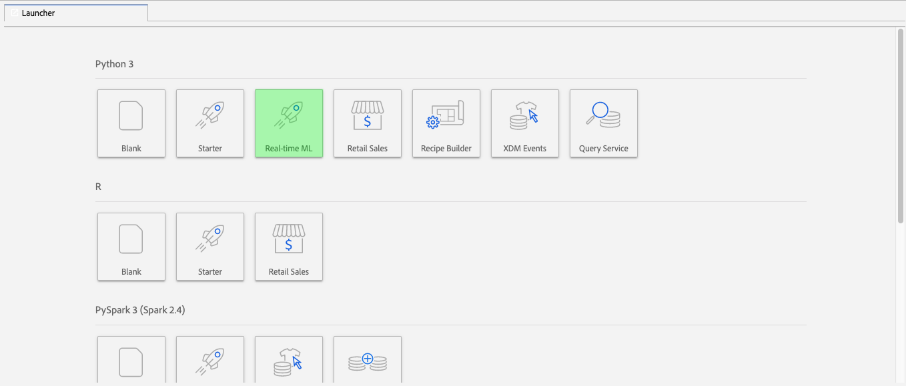

# リアルタイム機械学習ノートブック（アルファ）の管理

>[!IMPORTANT]
>
>リアルタイム機械学習は、まだすべてのユーザーが利用できるわけではありません。 この機能はアルファ版で、まだテスト中です。 このドキュメントは変更される場合があります。

次のガイドでは、リアルタイム機械学習アプリケーションの構築に必要な手順の概要を説明します。 提供されたAdobeの使用 **[!UICONTROL リアルタイム ML]** Python ノートブックテンプレート。このガイドでは、モデルのトレーニング、DSL の作成、Edge への DSL の公開、リクエストのスコアリングについて説明します。 リアルタイム機械学習モデルの実装を進めるにつれ、データセットのニーズに合わせてテンプレートを変更する必要があります。

## リアルタイムの機械学習ノートブックの作成

Adobe Experience Platform UI で、 **[!UICONTROL ノートブック]** から **データサイエンス**. 次に、 **[!UICONTROL JupyterLab]** 環境が読み込まれるまでしばらく時間がかかります。


この [!DNL JupyterLab] ランチャーが表示されます。 下にスクロールして *リアルタイム機械学習* をクリックし、 **[!UICONTROL リアルタイム ML]** ノートブック。 サンプルのデータセットを含むノートブックセルの例を含むテンプレートが開きます。



## ノードのインポートと検出

まず、モデルに必要なすべてのパッケージを読み込みます。 ノードオーサリングに使用する予定のパッケージが読み込まれていることを確認します。

>[!NOTE]
>
>インポートのリストは、作成するモデルに基づいて異なる場合があります。 このリストは、新しいノードが時間の経過と共に追加されるたびに変化します。 詳しくは、 [ノードリファレンスガイド](./node-reference.md) を参照してください。

```python
from pprint import pprint
import pandas as pd
import numpy as np
import json
import uuid
from shutil import copyfile
from pathlib import Path
from datetime import date, datetime, timedelta
from platform_sdk.dataset_reader import DatasetReader

from rtml_nodelibs.nodes.standard.preprocessing.json_to_df import JsonToDataframe
from rtml_sdk.edge.utils import EdgeUtils
from rtml_sdk.graph.utils import GraphBuilder
from rtml_nodelibs.nodes.standard.ml.onnx import ONNXNode
from rtml_nodelibs.core.nodefactory import NodeFactory as nf
from rtml_nodelibs.nodes.standard.preprocessing.pandasnode import Pandas
from rtml_nodelibs.nodes.standard.preprocessing.one_hot_encoder import OneHotEncoder
from rtml_nodelibs.nodes.standard.ml.artifact_utils import ModelUpload
from rtml_nodelibs.core.nodefactory import NodeFactory as nf
from rtml_nodelibs.core.datamsg import DataMsg
```

次のコードセルは、使用可能なノードのリストを出力します。

```python
# Discover Nodes
pprint(nf.discover_nodes())
```


## リアルタイム機械学習モデルのトレーニング

次のいずれかのオプションを使用して、次の内容を書き込みます： [!DNL Python] データを読み取り、前処理および分析するコード。 次に、独自の ML モデルをトレーニングし、ONNX 形式にシリアライズして、リアルタイム機械学習モデルストアにアップロードする必要があります。

- [JupyterLab ノートブックでの独自のモデルのトレーニング](#training-your-own-model)
- [独自にトレーニング済みの ONNX モデルを JupyterLab ノートブックにアップロードする](#pre-trained-model-upload)

### 独自のモデルのトレーニング {#training-your-own-model}

トレーニングデータを読み込んで開始します。

>[!NOTE]
>
>内 **リアルタイム ML** template、 [自動車保険の CSV データセット](https://github.com/adobe/experience-platform-dsw-reference/tree/master/datasets/insurance) が [!DNL Github].


Adobe Experience Platform内のデータセットを使用する場合は、以下のセルのコメントを解除します。 次に、 `DATASET_ID` を適切な値に設定します。


次の手順で、 [!DNL JupyterLab] ノートブックで、 **データ** タブ [!DNL JupyterLab]. この **[!UICONTROL データセット]** および **[!UICONTROL スキーマ]** ディレクトリが表示されます。 選択 **[!UICONTROL データセット]** をクリックし、右クリックして、 **[!UICONTROL ノートブック内のデータの調査]** オプションを選択します。 ノートブックの下部に実行可能なコードエントリが表示されます。 このセルには `dataset_id`.


完了したら、右クリックし、ノートブックの下部で生成したセルを削除します。

### トレーニングのプロパティ

提供されたテンプレートを使用して、内のトレーニングプロパティを変更します。 `config_properties`.

```python
config_properties = {
    "train_records_limit":1000000,
    "n_estimators": "80",
    "max_depth": "5",
    "ten_id": "_experienceplatform"  
}
```

### モデルの準備

の使用 **[!UICONTROL リアルタイム ML]** テンプレートの作成時には、ML モデルの分析、事前処理、トレーニング、評価をおこなう必要があります。 これは、データ変換を適用し、トレーニングパイプラインを構築することでおこなわれます。

**データ変換**

この **[!UICONTROL リアルタイム ML]** テンプレート **データ変換** セルは、独自のデータセットと連携するように変更する必要があります。 通常、列名の変更、データのロールアップ、データの準備/機能のエンジニアリングが行われます。

>[!NOTE]
>
>次の例は、読みやすくするために、 `[ ... ]`. を表示して展開してください *リアルタイム ML* templates データ変換の節を参照してください。

```python
df1.rename(columns = {config_properties['ten_id']+'.identification.ecid': 'ecid',
                     [ ... ]}, inplace=True)
df1 = df1[['ecid', 'km', 'cartype', 'age', 'gender', 'carbrand', 'leasing', 'city', 
       'country', 'nationality', 'primaryuser', 'purchase', 'pricequote', 'timestamp']]
print("df1 shape 1", df1.shape)
#########################################
# Data Rollup
######################################### 
df1['timestamp'] = pd.to_datetime(df1.timestamp)
df1['hour'] = df1['timestamp'].dt.hour.astype(int)
df1['dayofweek'] = df1['timestamp'].dt.dayofweek

df1.loc[(df1['purchase'] == 'yes'), 'purchase'] = 1
df1.purchase.fillna(0, inplace=True)
df1['purchase'] = df1['purchase'].astype(int)

[ ... ]

print("df1 shape 2", df1.shape)

#########################################
# Data Preparation/Feature Engineering
#########################################      

df1['carbrand'] = df1['carbrand'].str.lower()
df1['country'] = df1['country'].str.lower()
df1.loc[(df1['carbrand'] == 'vw'), 'carbrand'] = 'volkswagen'

[ ... ]

df1['age'].fillna(df1['age'].median(), inplace=True)
df1['gender'].fillna('notgiven', inplace=True)

[ ... ]

df1['city'] = df1.groupby('country')['city'].transform(lambda x: x.fillna(x.mode()))
df1.dropna(subset = ['pricequote'], inplace=True)
print("df1 shape 3", df1.shape)
print(df1)

#grouping
grouping_cols = ['carbrand', 'cartype', 'city', 'country']

for col in grouping_cols:
    df_idx = pd.DataFrame(df1[col].value_counts().head(6))

    def grouping(x):
        if x in df_idx.index:
            return x
        else:
            return "Others"
    df1[col] = df1[col].apply(lambda x: grouping(x))

def age(x):
    if x < 20:
        return "u20"
    elif x > 19 and x < 29:
    [ ... ]
    else: 
        return "Others"

df1['age'] = df1['age'].astype(int)
df1['age_bucket'] = df1['age'].apply(lambda x: age(x))

df_final = df1[['hour', 'dayofweek','age_bucket', 'gender', 'city',  
   'country', 'carbrand', 'cartype', 'leasing', 'pricequote', 'purchase']]
print("df final", df_final.shape)

cat_cols = ['age_bucket', 'gender', 'city', 'dayofweek', 'country', 'carbrand', 'cartype', 'leasing']
df_final = pd.get_dummies(df_final, columns = cat_cols)
```

指定したセルを実行して、例の結果を確認します。 次の `carinsurancedataset.csv` dataset は、定義した変更内容を返します。


**トレーニングパイプライン**

次に、トレーニングパイプラインを作成する必要があります。 これは、ONNX ファイルを変換して生成する必要がある点を除き、他のトレーニングパイプラインファイルと似ています。

前のセルで定義したデータ変換を使用して、テンプレートを変更します。 次に示すコードは、機能パイプラインで ONNX ファイルを生成する際に使用します。 次を表示してください： *リアルタイム ML* パイプラインコードセル全体のテンプレート。

```python
#for generating onnx
def generate_onnx_resources(self):        
    install_dir = os.path.expanduser('~/my-workspace')
    print("Generating Onnx")
        
    from skl2onnx import convert_sklearn
    from skl2onnx.common.data_types import FloatTensorType
        
    # ONNX-ification
    initial_type = [('float_input', FloatTensorType([None, self.feature_len]))]

    print("Converting Model to Onnx")
    onx = convert_sklearn(self.model, initial_types=initial_type)
             
    with open("model.onnx", "wb") as f:
        f.write(onx.SerializeToString())
            
    print("Model onnx created")
```

トレーニングパイプラインを完了し、データ変換を通じてデータを変更したら、次のセルを使用してトレーニングを実行します。

```python
model = train(config_properties, df_final)
```

### ONNX モデルの生成とアップロード

トレーニングの実行を正常に完了したら、ONNX モデルを生成し、トレーニング済みモデルをリアルタイム機械学習モデルストアにアップロードする必要があります。 次のセルを実行すると、ONNX モデルが他のすべてのノートブックと共に左側のレールに表示されます。

```python
import os
import skl2onnx, subprocess

model.generate_onnx_resources()
```

>[!NOTE]
>
>を `model_path` 文字列値 (`model.onnx`) をクリックして、モデルの名前を変更します。

```python
model_path = "model.onnx"
```

>[!NOTE]
>
>次のセルは編集も削除もできず、リアルタイム機械学習アプリケーションが機能するために必要です。

```python
model = ModelUpload(params={'model_path': model_path})
msg_model = model.process(None, 1)
model_id = msg_model.model['model_id']
 
print("Model ID: ", model_id)
```


### 独自のトレーニング済み ONNX モデルのアップロード {#pre-trained-model-upload}

次にあるアップロードボタンを使用する： [!DNL JupyterLab] ノートブックで、トレーニング済みの ONNX モデルを [!DNL Data Science Workspace] ノートブック環境。


次に、 `model_path` 文字列値 *リアルタイム ML* ノートブックを使用して、ONNX モデル名と一致させる必要があります。 完了したら、 *モデルパスを設定* セルを開き、 *モデルを RTML モデルストアにアップロードします* セル。 成功した場合、モデルの場所とモデル ID の両方が応答で返されます。


## ドメイン固有言語 (DSL) の作成

この節では、DSL の作成について説明します。 データの前処理を含むノードと ONNX ノードを作成します。 次に、ノードとエッジを使用して DSL グラフを作成します。 エッジは、組ベースのフォーマット (node_1、node_2) を使用してノードを接続します。 グラフにはサイクルを含めないでください。

>[!IMPORTANT]
>
>ONNX ノードの使用は必須です。 ONNX ノードがない場合、アプリケーションは失敗します。

### ノードオーサリング

>[!NOTE]
>
> 使用するデータのタイプに基づいて複数のノードを持つ場合があります。 次の例では、 *リアルタイム ML* テンプレート。 次を表示してください： *リアルタイム ML* テンプレート *ノードオーサリング* セクションに表示されます。

以下の Pandas ノードは、を使用します。 `"import": "map"` メソッド名をパラメーター内の文字列として読み込み、パラメーターをマップ関数として入力します。 以下の例では、 `{'arg': {'dataLayerNull': 'notgiven', 'no': 'no', 'yes': 'yes', 'notgiven': 'notgiven'}}`. マップを配置した後、次のオプションを設定できます。 `inplace` as `True` または `False`. 設定 `inplace` as `True` または `False` 変換をインプレースで適用するかどうかに基づきます。 デフォルト `"inplace": False` 新しい列を作成します。 新しい列名の提供のサポートは、今後のリリースで追加されるように設定されます。 最後の行 `cols` は、単一の列名または列のリストです。 変換を適用する列を指定します。 この例では、 `leasing` が指定されている。 使用可能なノードとその使用方法について詳しくは、 [ノードリファレンスガイド](./node-reference.md).

```python
# Renaming leasing column using Pandas Node
leasing_mapper_node = Pandas(params={'import': 'map',
                                'kwargs': {'arg': {
                                    'dataLayerNull': 'notgiven', 
                                    'no': 'no', 
                                    'yes': 'yes', 
                                    'notgiven': 'notgiven'}},
                                'inplace': True,
                                'cols': 'leasing'})
```

### DSL グラフを作成する

ノードを作成したら、次の手順は、ノードを連結してグラフを作成することです。

まず、配列を作成して、グラフの一部であるすべてのノードをリストします。

```python
nodes = [json_df_node, 
        to_datetime_node,
        hour_node,
        dayofweek_node,
        age_fillna_node,
        carbrand_fillna_node,
        country_fillna_node,
        cartype_primary_nationality_km_fillna_node,
        carbrand_mapper_node,
        cartype_mapper_node,
        country_mapper_node,
        gender_mapper_node,
        leasing_mapper_node,
        age_to_int_node,
        age_bins_node,
        dummies_node, 
        onnx_node]
```

次に、ノードをエッジに接続します。 各タプルは [!DNL Edge] 接続。

>[!TIP]
>
> ノードは互いに線形的に依存するので（各ノードは前のノードの出力に依存します）、単純な Python のリストを読み込んでリンクを作成できます。 ノードが複数の入力に依存する場合は、独自の接続を追加してください。

```python
edges = [(nodes[i], nodes[i+1]) for i in range(len(nodes)-1)]
```

ノードを接続したら、グラフを作成します。 下のセルは必須で、編集や削除はできません。

```python
dsl = GraphBuilder.generate_dsl(nodes=nodes, edges=edges)
pprint(json.loads(dsl))
```

完了したら、 `edge` 各ノードと、それらにマッピングされたパラメータを含むオブジェクトが返されます。


## Edge に公開（ハブ）

>[!NOTE]
>
>リアルタイム機械学習は、Adobe Experience Platform Hub に一時的にデプロイされ、管理されます。 詳しくは、 [リアルタイムの機械学習アーキテクチャ](./home.md#architecture).

これで、DSL グラフを作成したので、 [!DNL Edge].

>[!IMPORTANT]
>
>に公開しない [!DNL Edge] 多くの場合、これは [!DNL Edge] ノード。 同じモデルを複数回公開することはお勧めしません。

```python
edge_utils = EdgeUtils()
(edge_location, service_id) = edge_utils.publish_to_edge(dsl=dsl)
print(f'Edge Location: {edge_location}')
print(f'Service ID: {service_id}')
```

### DSL を更新して Edge に再公開（オプション）

DSL を更新する必要がない場合は、 [スコア付け](#scoring).

>[!NOTE]
>
>次のセルは、Edge に公開された既存の DSL を更新する場合にのみ必要です。

モデルは開発を続ける可能性が高くなります。 新しいサービスを作成する代わりに、既存のサービスを新しいモデルで更新することができます。 更新するノードを定義し、新しい ID を割り当ててから、新しい DSL を [!DNL Edge].

次の例では、ノード 0 が新しい ID で更新されています。

```python
# Update the id of Node 0 with a random uuid.

dsl_dict = json.loads(dsl)
print(f"ID of Node 0 in current DSL: {dsl_dict['edge']['applicationDsl']['nodes'][0]['id']}")

new_node_id = str(uuid.uuid4())
print(f'Updated Node ID: {new_node_id}')

dsl_dict['edge']['applicationDsl']['nodes'][0]['id'] = new_node_id
```


ノード ID を更新した後、更新された DSL を Edge に再公開できます。

```python
# Republish the updated DSL to Edge
(edge_location_ret, service_id, updated_dsl) = edge_utils.update_deployment(dsl=json.dumps(dsl_dict), service_id=service_id)
print(f'Updated dsl: {updated_dsl}')
```

更新された DSL が返されます。


## スコアリング {#scoring}

に公開した後 [!DNL Edge]の場合、スコアリングはクライアントからのPOSTリクエストによっておこなわれます。 通常、これは、ML スコアを必要とするクライアントアプリケーションから実行できます。 Postman からも実行できます。 この **[!UICONTROL リアルタイム ML]** template は、EdgeUtils を使用してこのプロセスを示しています。

>[!NOTE]
>
>スコアリングが開始する前に、少しの処理時間が必要です。

```python
# Wait for the app to come up
import time
time.sleep(20)
```

トレーニングで使用したのと同じスキーマを使用して、サンプルのスコアリングデータが生成されます。 このデータは、スコアリングデータフレームの作成に使用され、スコアリングディクショナリに変換されます。 次を表示してください： *リアルタイム ML* 完全なコードセルのテンプレート。


### Edge エンドポイントに対するスコア

次のセルを *リアルタイム ML* スコアを掛けるテンプレート [!DNL Edge] サービス。


スコアリングが完了したら、 [!DNL Edge] からの URL、ペイロード、スコアリング出力 [!DNL Edge] が返されます。

## デプロイ済みのアプリを [!DNL Edge]

現在デプロイされているアプリのリストを [!DNL Edge]、次のコードセルを実行します。 このセルは編集も削除もできません。

```python
services = edge_utils.list_deployed_services()
print(services)
```

返される応答は、デプロイされたサービスの配列です。

```json
[
    {
        "created": "2020-05-25T19:18:52.731Z",
        "deprecated": false,
        "id": "40eq76c0-1c6f-427a-8f8f-54y9cdf041b7",
        "type": "edge",
        "updated": "2020-05-25T19:18:52.731Z"
    }
]
```

## デプロイ済みのアプリまたはサービス ID をから削除する [!DNL Edge] （オプション）

>[!CAUTION]
>
>このセルは、デプロイ済みの Edge アプリケーションを削除するために使用されます。 デプロイ済みの [!DNL Edge] アプリケーション。

```python
if edge_utils.delete_from_edge(service_id=service_id):
    print(f"Deleted service id {service_id} successfully")
else:
    print(f"Failed to delete service id {service_id}")
```

## 次の手順

上記のチュートリアルに従うことで、ONNX モデルのトレーニングと、リアルタイム機械学習モデルストアへのアップロードが完了しました。 さらに、リアルタイム機械学習モデルにスコアを割り当て、デプロイしました。 モデルのオーサリングに使用できるノードの詳細については、 [ノードリファレンスガイド](./node-reference.md).
