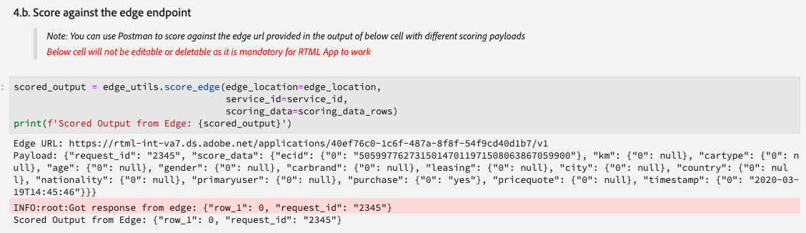

# リアルタイム機械学習ノートブックの管理（アルファ版）

>[!IMPORTANT]
>
>リアルタイム機械学習は、まだすべてのユーザーが利用できるわけではありません。この機能はアルファ版であり、まだテスト中です。このドキュメントは変更される場合があります。

次のガイドでは、リアルタイム機械学習アプリケーションを作成するために必要な手順の概要を説明します。このガイドでは、アドビ提供の&#x200B;**[!UICONTROL リアルタイム ML]** Python ノートブックテンプレートを使用して、モデルのトレーニング、DSL の作成、Edge への DSL の公開およびリクエストのスコアリングについて説明します。リアルタイム機械学習モデルの実装を進めるうちに、データセットのニーズに合わせてテンプレートを変更することが予想されます。

## リアルタイム機械学習ノートブックの作成

Adobe Experience Platform UI で、**データサイエンス**&#x200B;内から「**[!UICONTROL Notebooks]**」を選択します。次に、「**[!UICONTROL JupyterLab]**」を選択し、環境が読み込まれるまでしばらく待ちます。


[!DNL JupyterLab] ランチャーが表示されます。*リアルタイム機械学習*&#x200B;までスクロールし、「**[!UICONTROL リアルタイム ML]**」ノートブックを選択します。ノートブックセルの例とデータセットの例を含んだテンプレートが開きます。


## ノードの読み込みと検出

まず、モデルに必要なパッケージをすべて読み込みます。 ノードのオーサリングに使用する予定のパッケージが読み込まれていることを確認します。

>[!NOTE]
>
>読み込みのリストは、作成するモデルによって異なる場合があります。このリストは、時間の経過と共に新しいノードが追加されるにつれて変わっていきます。使用可能なノードの完全なリストについては、[ノードリファレンスガイド](./node-reference.md)を参照してください。

```python
from pprint import pprint
import pandas as pd
import numpy as np
import json
import uuid
from shutil import copyfile
from pathlib import Path
from datetime import date, datetime, timedelta
from platform_sdk.dataset_reader import DatasetReader

from rtml_nodelibs.nodes.standard.preprocessing.json_to_df import JsonToDataframe
from rtml_sdk.edge.utils import EdgeUtils
from rtml_sdk.graph.utils import GraphBuilder
from rtml_nodelibs.nodes.standard.ml.onnx import ONNXNode
from rtml_nodelibs.core.nodefactory import NodeFactory as nf
from rtml_nodelibs.nodes.standard.preprocessing.pandasnode import Pandas
from rtml_nodelibs.nodes.standard.preprocessing.one_hot_encoder import OneHotEncoder
from rtml_nodelibs.nodes.standard.ml.artifact_utils import ModelUpload
from rtml_nodelibs.core.nodefactory import NodeFactory as nf
from rtml_nodelibs.core.datamsg import DataMsg
```

次のコードセルは、使用可能なノードのリストを出力します。

```python
# Discover Nodes
pprint(nf.discover_nodes())
```


## リアルタイム機械学習モデルのトレーニング

次のオプションのいずれかを使用して、データの読み取り、前処理および分析を行う [!DNL Python] コードを作成します。次に、独自の ML モデルをトレーニングし、そのモデルを ONNX 形式にシリアル化してから、リアルタイム機械学習モデルストアにアップロードする必要があります。

- [JupyterLab Notebooks での独自モデルのトレーニング](#training-your-own-model)
- [JupyterLab Notebooks への独自のトレーニング済み ONNX モデルのアップロード](#pre-trained-model-upload)

### 独自モデルのトレーニング {#training-your-own-model}

まず、トレーニングデータを読み込みます。

>[!NOTE]
>
>**リアルタイム ML** テンプレートでは、[自動車保険の CSV データセット](https://github.com/adobe/experience-platform-dsw-reference/tree/master/datasets/insurance)が [!DNL Github] から取得されます。


Adobe Experience Platform 内からデータセットを使用する場合は、以下のセルのコメントを解除します。次に、`DATASET_ID` を適切な値に置き換える必要があります。


[!DNL JupyterLab] ノートブックのデータセットにアクセスするには、[!DNL JupyterLab] の左側のナビゲーションで「**データ**」タブを選択します。**[!UICONTROL データセット]**&#x200B;ディレクトリと&#x200B;**[!UICONTROL スキーマ]**&#x200B;ディレクトリが表示されます。 「**[!UICONTROL データセット]**」を選択して右クリックし、使用するデータセットのドロップダウンメニューから「**[!UICONTROL ノートブックのデータを調査]**」オプションを選択します。ノートブックの下部に実行可能コードエントリが表示されます。このセルに `dataset_id` が含まれています。


完了したら、ノートブックの下部に生成したセルを右クリックして削除します。

### トレーニングプロパティ

提供されたテンプレートを使用して、`config_properties` 内のトレーニングプロパティを変更します。

```python
config_properties = {
    "train_records_limit":1000000,
    "n_estimators": "80",
    "max_depth": "5",
    "ten_id": "_experienceplatform"  
}
```

### モデルの準備

**[!UICONTROL リアルタイム ML]** テンプレートを使用して、ML モデルの分析、前処理、トレーニングおよび評価を行う必要があります。それには、データ変換を適用し、トレーニングパイプラインを作成します。

**データ変換**

**[!UICONTROL リアルタイム ML]** テンプレートの&#x200B;**データ変換**&#x200B;セルは、独自のデータセットで機能するように変更する必要があります。通常、これには、列の名前変更、データのロールアップおよびデータ準備／機能エンジニアリングが含まれます。

>[!NOTE]
>
>次の例は、読みやすくするために `[ ... ]` を使用して要約されています。完全なコードセルについては、*リアルタイム ML* テンプレートのデータ変換に関する節を表示して展開してください。

```python
df1.rename(columns = {config_properties['ten_id']+'.identification.ecid': 'ecid',
                     [ ... ]}, inplace=True)
df1 = df1[['ecid', 'km', 'cartype', 'age', 'gender', 'carbrand', 'leasing', 'city', 
       'country', 'nationality', 'primaryuser', 'purchase', 'pricequote', 'timestamp']]
print("df1 shape 1", df1.shape)
#########################################
# Data Rollup
######################################### 
df1['timestamp'] = pd.to_datetime(df1.timestamp)
df1['hour'] = df1['timestamp'].dt.hour.astype(int)
df1['dayofweek'] = df1['timestamp'].dt.dayofweek

df1.loc[(df1['purchase'] == 'yes'), 'purchase'] = 1
df1.purchase.fillna(0, inplace=True)
df1['purchase'] = df1['purchase'].astype(int)

[ ... ]

print("df1 shape 2", df1.shape)

#########################################
# Data Preparation/Feature Engineering
#########################################      

df1['carbrand'] = df1['carbrand'].str.lower()
df1['country'] = df1['country'].str.lower()
df1.loc[(df1['carbrand'] == 'vw'), 'carbrand'] = 'volkswagen'

[ ... ]

df1['age'].fillna(df1['age'].median(), inplace=True)
df1['gender'].fillna('notgiven', inplace=True)

[ ... ]

df1['city'] = df1.groupby('country')['city'].transform(lambda x: x.fillna(x.mode()))
df1.dropna(subset = ['pricequote'], inplace=True)
print("df1 shape 3", df1.shape)
print(df1)

#grouping
grouping_cols = ['carbrand', 'cartype', 'city', 'country']

for col in grouping_cols:
    df_idx = pd.DataFrame(df1[col].value_counts().head(6))

    def grouping(x):
        if x in df_idx.index:
            return x
        else:
            return "Others"
    df1[col] = df1[col].apply(lambda x: grouping(x))

def age(x):
    if x < 20:
        return "u20"
    elif x > 19 and x < 29:
    [ ... ]
    else: 
        return "Others"

df1['age'] = df1['age'].astype(int)
df1['age_bucket'] = df1['age'].apply(lambda x: age(x))

df_final = df1[['hour', 'dayofweek','age_bucket', 'gender', 'city',  
   'country', 'carbrand', 'cartype', 'leasing', 'pricequote', 'purchase']]
print("df final", df_final.shape)

cat_cols = ['age_bucket', 'gender', 'city', 'dayofweek', 'country', 'carbrand', 'cartype', 'leasing']
df_final = pd.get_dummies(df_final, columns = cat_cols)
```

指定したセルを実行して、例の結果を確認します。`carinsurancedataset.csv` データセットから返された出力テーブルは、定義した変更内容を返します。


**トレーニングパイプライン**

次に、トレーニングパイプラインを作成する必要があります。これは、ONNX ファイルを変換して生成する必要がある点を除き、他のトレーニングパイプラインファイルと似ています。

前のセルで定義したデータ変換を使用して、テンプレートを変更します。以下でハイライト表示されている次のコードは、機能パイプラインで ONNX ファイルを生成する際に使用します。完全なパイプラインコードセルについては、*リアルタイム ML* テンプレートを参照してください。

```python
#for generating onnx
def generate_onnx_resources(self):        
    install_dir = os.path.expanduser('~/my-workspace')
    print("Generating Onnx")
        
    from skl2onnx import convert_sklearn
    from skl2onnx.common.data_types import FloatTensorType
        
    # ONNX-ification
    initial_type = [('float_input', FloatTensorType([None, self.feature_len]))]

    print("Converting Model to Onnx")
    onx = convert_sklearn(self.model, initial_types=initial_type)
             
    with open("model.onnx", "wb") as f:
        f.write(onx.SerializeToString())
            
    print("Model onnx created")
```

トレーニングパイプラインを完了し、データ変換を通じてデータを変更したら、次のセルを使用してトレーニングを実行します。

```python
model = train(config_properties, df_final)
```

### ONNX モデルの生成とアップロード

トレーニングの実行が正常に完了したら、ONNX モデルを生成し、トレーニング済みのモデルをリアルタイム機械学習モデルストアにアップロードする必要があります。次のセルを実行すると、ONNX モデルがその他のすべてのノートブックと共に左側のパネルに表示されます。

```python
import os
import skl2onnx, subprocess

model.generate_onnx_resources()
```

>[!NOTE]
>
>`model_path` 文字列値（`model.onnx`）を変更して、モデルの名前を変更します。

```python
model_path = "model.onnx"
```

>[!NOTE]
>
>次のセルは編集も削除もできず、リアルタイム機械学習アプリケーションが機能するために必要です。

```python
model = ModelUpload(params={'model_path': model_path})
msg_model = model.process(None, 1)
model_id = msg_model.model['model_id']
 
print("Model ID: ", model_id)
```


### 独自のトレーニング済み ONNX モデルのアップロード {#pre-trained-model-upload}

[!DNL JupyterLab] ノートブックにあるアップロードボタンを使用して、事前トレーニング済みの ONNX モデルを [!DNL Data Science Workspace] ノートブック環境にアップロードします。


次に、*リアルタイム ML* ノートブックの `model_path` 文字列値を変更して、ONNX モデル名と一致させます。完了したら、*モデルパスを設定*&#x200B;セルを実行してから、*モデルを RTML モデルストアにアップロード*&#x200B;セルを実行します。成功すると、モデルの場所とモデル ID の両方が応答で返されます。


## ドメイン固有言語（DSL）の作成

この節では、DSL の作成について説明します。ONNX ノードと共にデータの前処理を含むノードを作成します。次に、ノードと Edge を使用して DSL グラフを作成します。Edge は、タプルベースの形式（node_1、node_2）を使用してノードを接続します。グラフにはサイクルを含めないでください。

>[!IMPORTANT]
>
>ONNX ノードの使用は必須です。ONNX ノードがない場合、アプリケーションは失敗します。

### ノードの作成

>[!NOTE]
>
> 使用しているデータのタイプに基づいて、複数のノードが存在する可能性があります。次の例では、*リアルタイム ML* テンプレートの単一ノードのみについて説明します。完全なコードセルについては、*リアルタイム ML* テンプレートの&#x200B;*ノードの作成*&#x200B;に関する節を参照してください。

以下の Pandas ノードでは、`"import": "map"` を使用してメソッド名をパラメーターの文字列として読み込み、続いてパラメーターをマップ関数として入力します。以下の例では、`{'arg': {'dataLayerNull': 'notgiven', 'no': 'no', 'yes': 'yes', 'notgiven': 'notgiven'}}` を使用してこれを実行しています。マップを配置したら、`inplace` を `True` または `False` に設定するオプションがあります。変換をインプレースで適用するかどうかに基づいて、`inplace` を `True` または `False` に設定します。デフォルトでは、`"inplace": False` は新しい列を作成します。新しい列名を指定する機能のサポートは、今後のリリースで追加される予定です。最後の行 `cols` は、単一の列名または列のリストにすることができます。変換を適用する列を指定します。 この例では、`leasing` が指定されています。使用可能なノードとその使用方法について詳しくは、[ノードリファレンスガイド](./node-reference.md)を参照してください。

```python
# Renaming leasing column using Pandas Node
leasing_mapper_node = Pandas(params={'import': 'map',
                                'kwargs': {'arg': {
                                    'dataLayerNull': 'notgiven', 
                                    'no': 'no', 
                                    'yes': 'yes', 
                                    'notgiven': 'notgiven'}},
                                'inplace': True,
                                'cols': 'leasing'})
```

### DSL グラフの作成

ノードを作成したら、次の手順では、ノードを連結してグラフを作成します。

まず、配列を作成して、グラフの一部であるすべてのノードをリストします。

```python
nodes = [json_df_node, 
        to_datetime_node,
        hour_node,
        dayofweek_node,
        age_fillna_node,
        carbrand_fillna_node,
        country_fillna_node,
        cartype_primary_nationality_km_fillna_node,
        carbrand_mapper_node,
        cartype_mapper_node,
        country_mapper_node,
        gender_mapper_node,
        leasing_mapper_node,
        age_to_int_node,
        age_bins_node,
        dummies_node, 
        onnx_node]
```

次に、ノードを Edge に接続します。各タプルは [!DNL Edge] 接続です。

>[!TIP]
>
> ノードは相互に直線的に依存しているので（各ノードは前のノードの出力に依存します）、単純な Python リスト内包表記を使用してリンクを作成できます。ノードが複数の入力に依存する場合は、独自の接続を追加してください。

```python
edges = [(nodes[i], nodes[i+1]) for i in range(len(nodes)-1)]
```

ノードが接続されたら、グラフを作成します。下のセルは必須であり、編集または削除することはできません。

```python
dsl = GraphBuilder.generate_dsl(nodes=nodes, edges=edges)
pprint(json.loads(dsl))
```

完了すると、各ノードとそれらにマッピングされたパラメーターを含む `edge` オブジェクトが返されます。


## Edge（Hub）に公開

>[!NOTE]
>
>リアルタイム機械学習は、一時的に Adobe Experience Platform Hub にデプロイされ、管理されます。詳しくは、[リアルタイム機械学習アーキテクチャ](./home.md#architecture)に関する概要の節を参照してください。

DSL グラフを作成したので、グラフを [!DNL Edge] にデプロイできます。

>[!IMPORTANT]
>
>[!DNL Edge] に頻繁に公開しないでください。[!DNL Edge] ノードが過負荷になる可能性があります。同じモデルを複数回公開することはお勧めしません。

```python
edge_utils = EdgeUtils()
(edge_location, service_id) = edge_utils.publish_to_edge(dsl=dsl)
print(f'Edge Location: {edge_location}')
print(f'Service ID: {service_id}')
```

### DSL を更新して Edge に再公開（オプション）

DSL を更新する必要がない場合は、[スコアリング](#scoring)にスキップできます。

>[!NOTE]
>
>次のセルは、Edge に公開されている既存の DSL を更新する場合にのみ必要です。

モデルは開発を続ける可能性が高くなります。新しいサービスを作成する代わりに、既存のサービスを新しいモデルで更新することができます。更新するノードを定義し、それに新しい ID を割り当ててから、新しい DSL を [!DNL Edge] に再アップロードできます。

次の例では、ノード 0 が新しい ID で更新されます。

```python
# Update the id of Node 0 with a random uuid.

dsl_dict = json.loads(dsl)
print(f"ID of Node 0 in current DSL: {dsl_dict['edge']['applicationDsl']['nodes'][0]['id']}")

new_node_id = str(uuid.uuid4())
print(f'Updated Node ID: {new_node_id}')

dsl_dict['edge']['applicationDsl']['nodes'][0]['id'] = new_node_id
```


ノード ID を更新すると、更新された DSL を Edge に再公開できます。

```python
# Republish the updated DSL to Edge
(edge_location_ret, service_id, updated_dsl) = edge_utils.update_deployment(dsl=json.dumps(dsl_dict), service_id=service_id)
print(f'Updated dsl: {updated_dsl}')
```

更新された DSL が返されます。


## スコアリング {#scoring}

[!DNL Edge] に公開した後、クライアントからの POST リクエストによってスコアリングが行われます。通常、これは ML スコアを必要とするクライアントアプリケーションから実行できます。また、Postman からも実行できます。**[!UICONTROL リアルタイム ML]** テンプレートは、EdgeUtils を使用してこのプロセスを示します。

>[!NOTE]
>
>スコアリングが開始する前に、少しの処理時間が必要です。

```python
# Wait for the app to come up
import time
time.sleep(20)
```

トレーニングで使用したのと同じスキーマを使用して、サンプルのスコアリングデータが生成されます。このデータは、スコアリングデータフレームの作成に使用され、スコアリングディクショナリに変換されます。 完全なコードセルについては、*リアルタイム ML* テンプレートを参照してください。


### Edge エンドポイントに対するスコア

*リアルタイム ML* テンプレート内の次のセルを使用して、[!DNL Edge] サービスに対スコアリングします。



スコアリングが完了すると、[!DNL Edge] URL、ペイロード、[!DNL Edge] からのスコアリングされた出力が返されます。

## [!DNL Edge] からデプロイされているアプリのリスト

[!DNL Edge] に現在デプロイされているアプリのリストを生成するには、次のコードセルを実行します。このセルを編集または削除することはできません。

```python
services = edge_utils.list_deployed_services()
print(services)
```

返される応答は、デプロイされたサービスの配列です。

```json
[
    {
        "created": "2020-05-25T19:18:52.731Z",
        "deprecated": false,
        "id": "40eq76c0-1c6f-427a-8f8f-54y9cdf041b7",
        "type": "edge",
        "updated": "2020-05-25T19:18:52.731Z"
    }
]
```

## [!DNL Edge] からデプロイされているアプリまたはサービス ID を削除する（オプション）

>[!CAUTION]
>
>このセルは、デプロイされている Edge アプリケーションの削除に使用します。デプロイさている [!DNL Edge] アプリケーションを削除する必要がない限り、次のセルを使用しないでください。

```python
if edge_utils.delete_from_edge(service_id=service_id):
    print(f"Deleted service id {service_id} successfully")
else:
    print(f"Failed to delete service id {service_id}")
```

## 次の手順

上記のチュートリアルに従って、ONNX モデルを正常にトレーニングし、リアルタイム機械学習モデルストアにアップロードしました。さらに、リアルタイム機械学習モデルをスコアリングしてデプロイしました。モデルの作成に使用できるノードについて詳しくは、[ノードリファレンスガイド](./node-reference.md)を参照してください。
