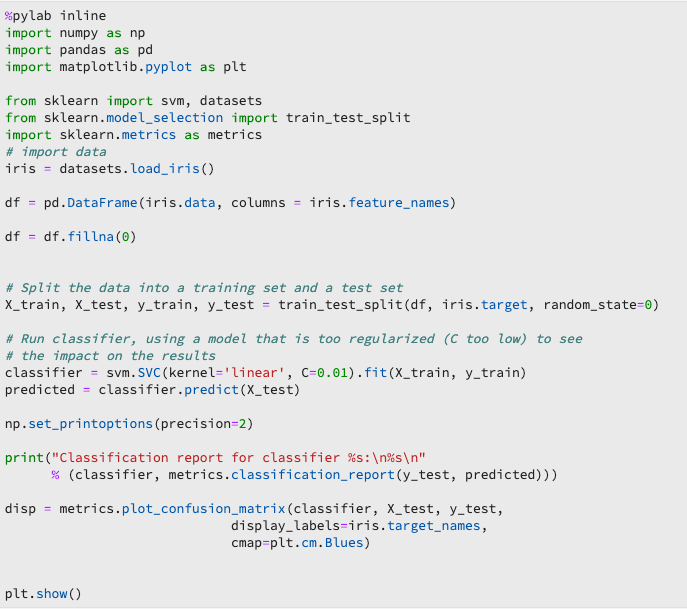

# リアルタイム機械学習モデルのトレーニング

>[!IMPORTANT]
>リアルタイム機械学習は、まだすべてのユーザーが利用できるわけではありません。 この機能はアルファベットで、まだテスト中です。 このドキュメントは変更される可能性があります。

このドキュメントでは、ONNXモデルをReal-time Machine Learningモデルストアにアップロードするためのチュートリアルを提供します。

次のオプションのいずれかを使用して、データの読み取り、前処理、および分析を行うPythonコードを記述します。 次に、独自のMLモデルをトレーニングし、ONNX形式にシリアル化して、最後にReal-time Machine Learningモデルストアにアップロードする必要があります。 さらに、チュートリアルの最後までに、 [スコアリングチュートリアルで使用するトレーニングを受けたモデルを識別するモデルIDが与えられます](./scoring-ml-model.md)。

* [Pythonノートブックを使用したモデルのトレーニング](#training-model-python-notebook)
* [独自のONNXモデルを使用したモデルのトレーニング](#train-using-own-onnx-model)
* [レシピビルダーテンプレートを使用したモデルのトレーニング](#train-using-recipe-builder)
* [Data Science Workplaceレシピワークフローを使用したモデルのトレーニング](#recipe-workflow-train-model)


## Pythonノートブックを使用したモデルのトレーニング {#training-model-python-notebook}

Adobe Experience Platform UIの「 **[!UICONTROL Data Science]** 」で「ノートブック **」を選択します。 次に、 **[!UICONTROL JupyterLabを選択し]** 、環境の読み込みに時間をかけます。


JupterLabランチャ内から **空のPython 3ノートブック** を選択して開始します。


### データへのアクセス {#access-data}

次に、使用するデータセットを選択します。 JupterLabノートブックのデータセットにアクセスするには、JupterLabの左側のナビゲーションで[ **Data** ]タブを選択します。 「 *Datasets* 」ディレクトリと「 *スキーマ* 」ディレクトリが表示されます。 「 **[!UICONTROL Datasets]** 」を選択して右クリックし、使用するデータセットのドロップダウンメニューから「 **[!UICONTROL Explore Data in Notebook]** 」オプションを選択します。 ノートブックに実行可能なコードのエントリが表示されます。


### モデルの準備

次のテンプレートを使用して、MLモデルを分析、事前処理、トレーニング、評価します。 完全な例として、次のテンプレートに示すスクリーンショットを使用します。

```python
from sklearn import svm, metrics
from sklearn.model_selection import train_test_split


data = df[input_columns]
target = df[target_column]
# Create a classifier: a support vector classifier
classifier = svm.SVC(gamma=0.001)

# Split data into train and test subsets
X_train, X_test, y_train, y_test = train_test_split(
    data, target, test_size=0.5, shuffle=False)

# We train the classifier
classifier.fit(X_train, y_train)

# Now do predictions
predicted = classifier.predict(X_test)


print("Classification report for classifier %s:\n%s\n"
      % (classifier, metrics.classification_report(y_test, predicted)))
disp = metrics.plot_confusion_matrix(classifier, X_test, y_test)
disp.figure_.suptitle("Confusion Matrix")
print("Confusion matrix:\n%s" % disp.confusion_matrix)
```

>[!NOTE]
>以下の例では、取り込んだAdobe Experience Platformデータセットからデータを読み込む代わりに、scikit-learnライブラリを使用しています。



**出力**


### モデルのアップロード

前の手順を完了したら、モデルをONNX形式にシリアル化し、Real-time Machine Learningストアにアップロードする必要があります。 これにより、 `model_id` 次のチュートリアルで使用した値が返されます [](#next-steps)。

次のテンプレートを使用してONNXに変換し、データセットをアップロードします。

```python
from rtml_nodelibs.nodes.standard.ml.artifact_utils
import ModelUpload
from rtml_nodelibs.core.nodefactory
import NodeFactory as nf
from skl2onnx.common.data_types
import FloatTensorType
from skl2onnx
import convert_sklearn

########## Save sklearn model in ONNX format at model_path ##########
inputs = [('features', FloatTensorType([None, X_train.shape[1]]))]
model_onnx = convert_sklearn(classifier, 'ScikitLearnModel', inputs)

model_path = "model.onnx"
os.environ["ONNX_MODEL_PATH"] = model_path

with open(model_path, "wb") as f:
  f.write(model_onnx.SerializeToString())

  ########## Upload the model from model_path to RTML model store ##########
  model = ModelUpload(params = {
    'model_path': model_path
  })

msg_model = model.process(None, 1)

model_id = msg_model.model['model_id']

print("Model ID : ", model_id)
```

**応答**


受け取った情報をコピー `model_id`し、 [次の手順に進みます](#next-steps)。


## 独自のONNXモデルを使用したモデルのトレーニング {#train-using-own-onnx-model}

Adobe Experience Platform UIの「 **[!UICONTROL Data Science]** 」で「ノートブック **」を選択します。 次に、 **[!UICONTROL JupyterLabを選択し]** 、環境の読み込みに時間をかけます。


JupterLabノートブックにある「アップロード」ボタンを使用して、ONNXモデルをData Science Workspaceノートブック環境にアップロードします。


次に、JupyterLabランチャーでPython 3の下の空白のノートブックアイコンを選択して、新しい空のノートブックを作成します。


空白のノートブック内で、次をコピーして貼り付けます。

>[!NOTE]
> アップロードしたONNXモデル `model_path` の内容を必ず指定してください。

```python
from rtml_nodelibs.nodes.standard.ml.artifact_utils import ModelUpload
from rtml_nodelibs.core.nodefactory import NodeFactory as nf
 
model_path = <path/to/onnx_model>
########## Upload the model from model_path to RTML model store ##########
model = ModelUpload(params={'model_path': model_path})
 
msg_model = model.process(None, 1)
 
model_id = msg_model.model['model_id']
 
print("Model ID : ", model_id)
```

上のセルを実行した後、が返 `model_id` されます。 次のチュートリアルで使用するモデルIDをコピー [し](#next-steps)ます。

## 事前に作成されたレシピテンプレートを使用してモデルをトレーニングする {#train-using-recipe-builder}

Adobe Experience Platform UIの「 **[!UICONTROL Data Science]** 」で「ノートブック **」を選択します。 次に、 **[!UICONTROL JupyterLabを選択し]** 、環境の読み込みに時間をかけます。


次に、 Jupyterノートブックを使用したレシピの [作成に従い](../jupyterlab/create-a-recipe.md) ます。 完了したら、リアルタイムの参照を機能させるために、pipeline.pyファイルを変更する必要があります。

>[!NOTE]
>Data Science Workspaceが提供するテンプレートは、データセットに合わせて変更する必要があります。

モデルをONNX形式で保存し、環境変数をに設定してくだ `ONNX_MODEL_PATH`さい。 次の例は、recipe-builderテンプレートを使用してパイプラインファイルを変更する方法を示しています。

```python
def train(configProperties, data):

  print("Train Start")

########## Extract fields from configProperties ##########
learning_rate = float(configProperties['learning_rate'])
n_estimators = int(configProperties['n_estimators'])
max_depth = int(configProperties['max_depth'])

########## Fit model ##########
X_train = data.drop('weeklySalesAhead', axis = 1).values
y_train = data['weeklySalesAhead'].values

seed = 1234
model = GradientBoostingRegressor(learning_rate = learning_rate,
  n_estimators = n_estimators,
  max_depth = max_depth,
  random_state = seed)

model.fit(X_train, y_train)

########## Save sklearn model in ONNX format at model_path ##########
inputs = [('features', FloatTensorType([None, X_train.shape[1]]))]
model_onnx = convert_sklearn(model, 'ScikitLearnModel', inputs)

model_path = "retail_sales_model.onnx"
os.environ["ONNX_MODEL_PATH"] = model_path

with open(model_path, "wb") as f:
  f.write(model_onnx.SerializeToString())

print("Train Complete")

return model
```

pipeline.pyファイルを変更した後、 **[!UICONTROL Training]** and **[!UICONTROL Scoringを実行します]**。 完了したら、「 **[!UICONTROL レシピを作成]** 」ボタンを選択します。


命名ダイアログが表示されます。 レシピ名を入力し、「 **[!UICONTROL OK]**」を選択します。 レシピの作成が開始されたことを知らせる新しいダイアログが表示されます。 レシピを作成するまでしばらく時間がかかります。


作成したレシピは、表示されるダイアログで **[!UICONTROL 表示レシピを選択するか、[]** モデル **に移動して左上のナビゲーションで[]** レシピ **** ]を選択すると表示できます。 作成日順に並べ替えられたレシピのリストが表示されます。 新しいレシピが一番上にあることを確認します。


レシピを選択します。 レシピの概要ページが表示されます。 右上のナビゲーションで、「モデルを **[!UICONTROL 作成]**」を選択します。


次に、適切なデータセットを選択します。 右上のナビゲーションで **[!UICONTROL 「次へ]** 」をクリックします。


設定ページが開きます。 モデルの名前を指定し、デフォルトのモデル設定を確認します。 デフォルトの設定はレシピの作成時に適用されます。 重複が値をクリックして、設定値を確認および変更します。 新しい設定のセットを提供するには、「新しい設定を **[!UICONTROL アップロード]** 」をクリックし、モデル設定を含むJSONファイルをブラウザーウィンドウにドラッグします。 [ **[!UICONTROL 終了]** ]を選択して、モデルを作成します。


モデルを作成したら、トレーニングの実行が完了するのを待つ必要があります。 成功したトレーニングの実行が完了したら、その詳細を表示に対して実行するトレーニングを選択できます。

トレーニングの実行を選択します。 選択すると、プロパティダイアログが右側に表示されます。 このダイアログで、 **[!UICONTROL 表示アクティビティログを選択します]**。


[ *表示アクティビティログ* ]ダイアログボックスが表示されます。 ログをダウンロードして実行の詳細を確認するには、 *stder* ログのURLを選択します。


ログは、失敗した実行で何が起きたかを確認するのに特に役立ちます。 ただし、この場合は、作成したONNXモデルに `model-id` 対応するONNXを探しています。 モデルIDをコピーします。

>[!NOTE]
>スコアリングジョブを実行する必要はありません。 リアルタイム機械学習のエッジスコアリングは、 [次の手順で説明します](#next-steps)。


## Data Science Workplaceレシピワークフローを使用したモデルのトレーニング {#recipe-workflow-train-model}

PythonコードのDocker、git、およびパッケージ化に詳しい場合は、この方法を使用するのが最適です。 Data Science Workspaceワークフローを使用すると、レシピを作成する際の柔軟性と自由度を最大限に高めることができます。 ベースドッカー環境を取り込み、独自のドッカーイメージを作成し、より簡単にレシピをデバッグし、あらかじめ組み込まれたレシピをコピーしてData Science Workspaceサービスで再生し、レシピの実行スケジュールを設定できます。

### スキーマの作成

最初の手順では、データセットのデータスキーマを使用する必要があります。 スキーマは、Adobe Experience Platform UIまたはPlatform APIを使用して作成できます。

>[!NOTE]
>Adobe Experience Platformに取り込んで使用したいデータが既にある場合は、Pythonレシピの [作成にスキップします](#create-a-python-recipe)。

* [スキーマエディターのUIチュートリアルを使用したスキーマの作成](../../xdm/tutorials/create-schema-ui.md)
* [スキーマエディターAPIチュートリアルを使用したスキーマの作成](../../xdm/tutorials/create-schema-api.md)

### データを取り込む

次に、先ほど作成したスキーマを使用してデータを取り込む必要があります。 これは、APIまたはプラットフォームUIを使用して行うことができます。

>[!NOTE]
>Adobe Experience Platformに取り込んで使用したいデータが既にある場合は、Pythonレシピの [作成にスキップします](#create-a-python-recipe)。

* [データをAdobe Experience Platform UIチュートリアルに取り込む](../../ingestion/tutorials/ingest-batch-data.md)
* [データをAdobe Experience Platform APIチュートリアルに取り込む](../../ingestion/batch-ingestion/api-overview.md)

### Pythonレシピの作成 {#create-a-python-recipe}

レシピ作成開始と、アーカイブファイルを作成するためのソースファイルのパッケージ化。 ソースファイルは、特定の問題の解決に使用される機械学習ロジックとアルゴリズムを定義します。 Python Dockerイメージを作成するには、次のチュートリアルを使用します。

* [ソースファイルのレシピへのパッケージ化](../models-recipes/package-source-files-recipe.md)

次の手順を完了するには、AzureコンテナレジストリにDockerイメージと対応するイメージURLが必要です。 以下のチュートリアルリンクの1つを選択して、Pythonレシピの作成を終了します。

* [パッケージ化されたレシピをUIに読み込む](../models-recipes/import-packaged-recipe-ui.md)
* [APIを使用したパッケージ化されたレシピの読み込み](../models-recipes/import-packaged-recipe-api.md)

### トレーニングの実行の作成

Adobe Experience Platform Data Science Workspaceでは、機械学習モデルは、モデルの意図に適した既存のレシピを組み込むことで作成されます。 次に、モデルのトレーニングと評価を行い、関連するハイパーパラメーターを微調整して、その動作効率と有効性を最適化します。

* [UIでモデルをトレーニングおよび評価する](../models-recipes/train-evaluate-model-ui.md)
* [APIでのモデルのトレーニングと評価](../models-recipes/train-evaluate-model-api.md)

>[!IMPORTANT]
>レシピのpipeline.pyファイルで、モデルをONNX形式で内に保存し、環境変数 `model_path` をに設定し `ONNX_MODEL_PATH`ます。 ランタイムは、この特定の環境変数を探します。

```python
def train(configProperties, data):
 
    print("Train Start")
 
    ########## Extract fields from configProperties ##########

    learning_rate = float(configProperties['learning_rate'])
    n_estimators = int(configProperties['n_estimators'])
    max_depth = int(configProperties['max_depth'])
 
 
    
    ########## Fit model ##########
    
    X_train = data.drop('weeklySalesAhead', axis=1).values
    y_train = data['weeklySalesAhead'].values
 
    seed = 1234
    model = GradientBoostingRegressor(learning_rate=learning_rate,
                                      n_estimators=n_estimators,
                                      max_depth=max_depth,
                                      random_state=seed)
 
    model.fit(X_train, y_train)
     
    ########## Save sklearn model in ONNX format at model_path ##########
    inputs = [('features', FloatTensorType([None, X_train.shape[1]]))]
    model_onnx = convert_sklearn(model, 'ScikitLearnModel', inputs)
 
    model_path = "retail_sales_model.onnx"
    os.environ["ONNX_MODEL_PATH"] = model_path
 
    with open(model_path, "wb") as f:
        f.write(model_onnx.SerializeToString())
 
    print("Train Complete")
 
    return model
```

モデルを作成したら、トレーニングの実行が完了するのを待つ必要があります。 トレーニングの実行が完了したら、トレーニングの実行を選択して詳細を表示できます。 トレーニングの実行を選択します。 プロパティを選択すると、右側に「 **[!UICONTROL 表示アクティビティログ]**」が表示されます。


[ *表示アクティビティログ* ]ダイアログボックスが表示されます。 ログをダウンロードして実行の詳細を確認するには、 *stder* ログのURLを選択します。


ログは、失敗した実行で何が起きたかを確認するのに特に役立ちます。 ただし、この場合は、作成したONNXモデルに `model-id` 対応するONNXを探しています。 モデルIDをコピーします。


レシピでスコアリングジョブを実行する必要はありません。 リアルタイム機械学習のエッジスコアリングは、 [次のチュートリアルで説明します](#next-steps)。

## 次の手順 {#next-steps}

上記のチュートリアルの1つに従うことで、ONNXモデルのトレーニングとReal-time Machine Learningモデルストアへのアップロードに成功し、モデルを識別す `model_id` る機能を持つことができます。 リアルタイム機械学習モデルに [スコアを付ける方法については、次のチュートリアルに進みます](./scoring-ml-model.md)。