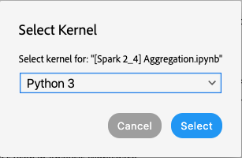
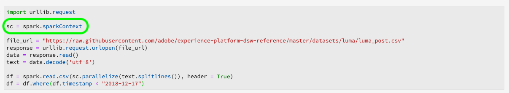

# レシピとノートブックの移行ガイド

>[!NOTE]
>Python/Rを使用するノートブックとレシピは影響を受けません。 移行は、既存のPySpark/Sparkレシピとノートブックにのみ適用されます。

次のガイドは、既存のレシピとノートブックを移行する際に必要な手順と情報を示しています。

- [レシピ移行ガイド](#recipe-migration)
- [ノートブック移行ガイド](#notebook-migration)

## レシピ移行ガイド {#recipe-migration}

Data Science Workspaceに対する最近の変更では、既存のSparkレシピとPySparkレシピを更新する必要があります。 レシピの移行に役立つワークフローを次に示します。

- [Spark移行ガイド](#spark-migration-guide)
   - [データセットの読み取りと書き込みの方法の変更](#read-write-recipe-spark)
   - [サンプルレシピのダウンロード](#download-sample-spark)
   - [ドッ追加カーファイル](#add-dockerfile-spark)
   - [依存関係の確認](#change-dependencies-spark)
   - [ドッカースクリプトの準備](#prepare-docker-spark)
   - [ドッカーを使ってレシピを作る](#create-recipe-spark)
- [PySpark移行ガイド](#pyspark-migration-guide)
   - [データセットの読み取りと書き込みの方法の変更](#pyspark-read-write)
   - [サンプルレシピのダウンロード](#pyspark-download-sample)
   - [ドッ追加カーファイル](#pyspark-add-dockerfile)
   - [ドッカースクリプトの準備](#pyspark-prepare-docker)
   - [ドッカーを使ってレシピを作る](#pyspark-create-recipe)

## Spark移行ガイド {#spark-migration-guide}

これで、ビルド手順で生成されるレシピアーティファクトは、.jarバイナリファイルを含むDockerイメージになりました。 また、プラットフォームSDKを使用してデータセットの読み取りと書き込みを行うための構文が変更され、レシピコードを変更する必要があります。

次のビデオは、Sparkのレシピに必要な変更を理解しやすくするために設計されています。

>[!VIDEO](https://video.tv.adobe.com/v/33243)

### データセットの読み取りと書き込み(Spark) {#read-write-recipe-spark}

Dockerイメージを構築する前に、以下の節に示す、プラットフォームSDKでのデータセットの読み取りと書き込みの例を確認してください。 既存のレシピを変換する場合は、プラットフォームSDKコードを更新する必要があります。

#### データセットの読み取り

この節では、データセットの読み取りに必要な変更点について説明し、アドビが提供する [helper.scalaの例を使用し](https://github.com/adobe/experience-platform-dsw-reference/blob/master/recipes/scala/src/main/scala/com/adobe/platform/ml/helper/Helper.scala) 、その内容を示します。

Sparkレシピの更新では、多数の値を追加および変更する必要があります。 1つ目は、 `DataSetOptions` 現在は使用されません。 Replace `DataSetOptions` with `QSOption`. また、新しいパラメ `option` ーターが必要です。 との両方 `QSOption.mode` が必 `QSOption.datasetId` 要です。 最後に、 `orgId` とに変 `serviceApiKey` 更する必要があ `imsOrg` ります `apiKey`。 データセットの読み取りに関する比較について、次の表を確認します。

<table>
  <th>データセットの古い読み方</th>
  <th>データセットを読み取る新しい方法</th>
  <tr>
  <td>
  <pre class="JSON language-JSON hljs">
  var df = sparkSession.read.format("com.adobe.platform.dataset") .option(DataSetOptions.orgId, orgId) .option(DataSetOptions.serviceToken, serviceToken) .option(DataSetOptions.DataserviceApiKey、apiKey) .load(dataSetId)
</pre>
  </td>
  <td>
<pre class="JSON language-JSON hljs">
import com.adobe.platform.クエリ.QSOption

var df = sparkSession.read.format(&quot;com.adobe.platform.userToken&quot;, {userToken}).option(QSOption.serviceToken, {serviceToken}).option(QSOption.ims, {orgId}).option(QSOption.apiKey, {apiKey}).option(QSOption.mode, &quot;interactive&quot;).option(QSOption.datasetId, {dataSetId}).load()
</pre>
</td>
  </tr>
</table>

>[!TIP]
> インタラクティブモードが10分を超えるとクエリがタイムアウトします。 数ギガバイトを超えるデータを取り込む場合は、「バッチ」モードに切り替えることをお勧めします。 バッチモードは、開始までに時間がかかりますが、大きなデータセットを処理できます。

#### データセットへの書き込み

この節では、アドビが提供するScoringDataSaver.scalaの例を使用してデータセットを書 [き込む際に必要な変更点について説明します](https://github.com/adobe/experience-platform-dsw-reference/blob/master/recipes/scala/src/main/scala/com/adobe/platform/ml/ScoringDataSaver.scala) 。

Sparkレシピの更新では、多数の値を追加および変更する必要があります。 1つ目は、 `DataSetOptions` 現在は使用されません。 Replace `DataSetOptions` with `QSOption`. また、新しいパラメ `option` ーターが必要です。 `QSOption.datasetId` が必要で、でを読み込む必要がなくなり `{dataSetId}` ました `.save()`。 最後に、 `orgId` とに変 `serviceApiKey` 更する必要があ `imsOrg` ります `apiKey`。 データセットの書き込みに関する比較について、次の表を確認します。

<table>
  <th>データセットの従来の書き方</th>
  <th>データセットの新しい書き方</th>
  <tr>
  <td>
  <pre class="JSON language-JSON hljs">
  df.write.format("com.adobe.platform.dataset") .option(DataSetOptions.orgId, orgId) .option(DataSetOptions.serviceToken, serviceToken) .option(DataSetOptions.userToken, userToken) .option(DataSetOptions.options.servions.serviceS.serviAApiAApiApikey, apiKey) .save(scoringResultsDataSetId)
</pre>
  </td>
  <td>
<pre class="JSON language-JSON hljs">
import com.adobe.platform.クエリ.QSOption

df.write.format(&quot;com.adobe.platform.userToken&quot;, {userToken}).option(QSOption.serviceToken, {serviceToken}).option(QSOption.imsOrg, {orgId}).option(QSOption.apiKey,apiKey}).option(QSOption.datasetId, {dataSetId}).save()
</pre>
</td>
  </tr>
</table>

### Dockerベースのソースファイルのパッケージ化(Spark) {#package-docker-spark}

開始を設定します。

次の節では、 [Data Science WorkspaceパブリックGithubリポジトリにある新しいScala小売販売レシピを使用します](https://github.com/adobe/experience-platform-dsw-reference)。

### サンプルレシピのダウンロード(Spark) {#download-sample-spark}

サンプルレシピには、既存のレシピにコピーする必要のあるファイルが含まれています。 すべてのサンプルレシピを含む公開Githubをコピーするには、ターミナルで次を入力します。

```BASH
git clone https://github.com/adobe/experience-platform-dsw-reference.git
```

Scalaレシピは次のディレクトリにありま `experience-platform-dsw-reference/recipes/scala/retail`す。

### 追加Dockerfile (Spark) {#add-dockerfile-spark}

ドッカーベースのワークフローを使用するには、レシピフォルダーに新しいファイルが必要です。 にあるrecipesフォルダからDockerファイルをコピーして貼り付けま `experience-platform-dsw-reference/recipes/scala/Dockerfile`す。 また、以下のコードをコピーして、という新しいファイルに貼り付けることもできま `Dockerfile`す。

>[!IMPORTANT]
> 次に示すjarファイルの例は、 `ml-retail-sample-spark-*-jar-with-dependencies.jar` レシピのjarファイルの名前に置き換える必要があります。

```scala
FROM adobe/acp-dsw-ml-runtime-spark:0.0.1

COPY target/ml-retail-sample-spark-*-jar-with-dependencies.jar /application.jar
```

### 依存関係の変更(Spark) {#change-dependencies-spark}

既存のレシピを使用している場合は、pom.xmlファイルに依存関係の変更が必要です。 model-authoring-sdk依存バージョンを1.0.0に変更します。次に、pomファイルのSparkバージョンを2.4.3に、Scalaバージョンを2.11.12に更新します。

```json
<groupId>com.adobe.platform.ml</groupId>
<artifactId>authoring-sdk_2.11</artifactId>
<version>1.0.0</version>
<classifier>jar-with-dependencies</classifier>
```

### Dockerスクリプトの準備(Spark) {#prepare-docker-spark}

Sparkレシピは、Binary Artifactsを使用せず、代わりにDockerイメージを作成する必要があります。 まだ実行していない場合は、Dockerをダウンロ [ードしてインストールします](https://www.docker.com/products/docker-desktop)。

提供されているScalaサンプルレシピでは、スクリプトを検索し、に `login.sh` あ `build.sh` ります `experience-platform-dsw-reference/recipes/scala/` 。 これらのファイルをコピーして、既存のレシピに貼り付けます。

フォルダー構造は次の例のようになります（新しく追加したファイルがハイライト表示されます）。


次の手順は、パッケージのソースファ [イルに従ってレシピのチュートリアルを作成](./models-recipes/package-source-files-recipe.md) します。 このチュートリアルでは、Scala(Spark)レシピ用のドッカー画像の作成について概要を説明する節を紹介します。 完了すると、対応するイメージURLと共にAzureコンテナレジストリにDockerイメージが提供されます。

### レシピの作成(Spark) {#create-recipe-spark}

レシピを作成するには、まずパッケージソースファイルのチュート [リアルを完了し](./models-recipes/package-source-files-recipe.md) 、ドッカー画像のURLを準備する必要があります。 UIまたはAPIを使用してレシピを作成できます。

UIを使用してレシピを作成するには、Scalaのパッケ [ージレシピ(UI)の読み込み](./models-recipes/import-packaged-recipe-ui.md) (Import a packaged recipe)チュートリアルに従います。

APIを使用してレシピを作成するには、Scalaのパッケージ [レシピ(API)の読み込みのチュートリ](./models-recipes/import-packaged-recipe-api.md) アルに従ってください。

## PySpark移行ガイド {#pyspark-migration-guide}

これで、ビルド手順で生成されるレシピアーティファクトは、.eggバイナリファイルを含むDockerイメージになりました。 また、プラットフォームSDKを使用してデータセットの読み取りと書き込みを行うための構文が変更され、レシピコードを変更する必要があります。

次のビデオは、PySparkのレシピに必要な変更点をより深く理解できるように設計されています。

>[!VIDEO](https://video.tv.adobe.com/v/33048?learn=on&quality=12)

### データセットの読み取りと書き込み(PySpark) {#pyspark-read-write}

Dockerイメージを構築する前に、以下の節に示す、プラットフォームSDKでのデータセットの読み取りと書き込みの例を確認してください。 既存のレシピを変換する場合は、プラットフォームSDKコードを更新する必要があります。

#### データセットの読み取り

この節では、アドビが提供する [helper.pyの例を使用してデータセットを読み取る際に必要な変更点について説明します](https://github.com/adobe/experience-platform-dsw-reference/blob/master/recipes/pyspark/pysparkretailapp/helper.py) 。

Sparkレシピの更新では、多数の値を追加および変更する必要があります。 1つ目は、 `DataSetOptions` 現在は使用されません。 Replace `DataSetOptions` with `qs_option`. また、新しいパラメ `option` ーターが必要です。 との両方 `qs_option.mode` が必 `qs_option.datasetId` 要です。 最後に、 `orgId` とに変 `serviceApiKey` 更する必要があ `imsOrg` ります `apiKey`。 データセットの読み取りに関する比較について、次の表を確認します。

<table>
  <th>データセットの古い読み方</th>
  <th>データセットを読み取る新しい方法</th>
  <tr>
  <td>
  <pre class="JSON language-JSON hljs">
dataset_options = get_dataset_options(spark.sparkContext)

pd = spark.read.format(&quot;com.adobe.platform.dataset&quot;).option(dataset_options.serviceToken(), service_token).option(dataset_options.userToken(), user_token).option(dataset_options.orgId(), org_id).option(dataset_opt_opt_keyKeyKey().load(id)
</pre>
</td>
  <td>
<pre class="JSON language-JSON hljs">
qs_option = spark_context。_jvm.com.adobe.platform.クエリ.QSOption

pd = sparkSession.read.format(&quot;com.adobe.platform.format&quot;).option(qs_option.userToken, {userToken}).option(qs_option.serviceToken, {serviceToken}).option(qs_option.imsOrg, {orgId}).option(qs_option.api.apiKey, {apiKey}).option(qs_option.mode, &quot;interactive&quot;).option(qs_option.datasetId, {dataSetId}).load()
</pre>
</td>
  </tr>
</table>

>[!TIP]
> インタラクティブモードが10分を超えるとクエリがタイムアウトします。 数ギガバイトを超えるデータを取り込む場合は、「バッチ」モードに切り替えることをお勧めします。 バッチモードは、開始までに時間がかかりますが、大きなデータセットを処理できます。

#### データセットへの書き込み

この節では、アドビが提供する [data_saver.py](https://github.com/adobe/experience-platform-dsw-reference/blob/master/recipes/pyspark/pysparkretailapp/data_saver.py) （例）を使用してデータセットを書き込む際に必要な変更点について説明します。

PySparkレシピの更新を行うには、多数の値を追加し、変更する必要があります。 1つ目は、 `DataSetOptions` 現在は使用されません。 Replace `DataSetOptions` with `qs_option`. また、新しいパラメ `option` ーターが必要です。  `qs_option.datasetId` が必要で、でを読み込む必要がなくなり `{dataSetId}` まし `.save()` た。 最後に、 `orgId` とに変 `serviceApiKey` 更する必要があ `imsOrg` ります `apiKey`。 データセットの読み取りに関する比較について、次の表を確認します。

<table>
  <th>データセットの従来の書き方</th>
  <th>データセットの新しい書き方</th>
  <tr>
  <td>
  <pre class="JSON language-JSON hljs">
df.write.format("com.adobe.platform.dataset") .option(DataSetOptions.orgId, orgId) .option(DataSetOptions.serviceToken, serviceToken) .option(DataSetOptions.userToken, userToken) .option(DataSetOptions.options.servions.serviceS.serviAApiAApiApikey, apiKey) .save(scoringResultsDataSetId)
</pre>
  </td>
  <td>
<pre class="JSON language-JSON hljs">
qs_option = spark_context。_jvm.com.adobe.platform.クエリ.QSOption

scored_df.write.format(&quot;com.adobe.platform.format&quot;).option(qs_option.userToken, {userToken}).option(qs_option.serviceToken}, {serviceToken}).option(qs_option.imsOrg, {orgId}).option(qs_option.ation.api.apiKey, {apiKey}option.datasetId、{dataSetId}).save()
</pre>
</td>
  </tr>
</table>

### Dockerベースのソースファイルのパッケージ化(PySpark) {#pyspark-package-docker}

開始を設定します。

この例では、新しいPySpark Retail Salesレシピが使用され、 [Data Science WorkspaceパブリックGithubリポジトリにあります](https://github.com/adobe/experience-platform-dsw-reference)。

### サンプルレシピのダウンロード(PySpark) {#pyspark-download-sample}

サンプルレシピには、既存のレシピにコピーする必要のあるファイルが含まれています。 すべてのサンプルレシピを含む公開Githubをコピーするには、ターミナルで次のように入力します。

```BASH
git clone https://github.com/adobe/experience-platform-dsw-reference.git
```

PySparkレシピは次のディレクトリにありま `experience-platform-dsw-reference/recipes/pyspark`す。

### 追加Dockerfile (PySpark) {#pyspark-add-dockerfile}

ドッカーベースのワークフローを使用するには、レシピフォルダーに新しいファイルが必要です。 にあるrecipesフォルダからDockerファイルをコピーして貼り付けま `experience-platform-dsw-reference/recipes/pyspark/Dockerfile`す。 必要に応じて、下のコードをコピーして貼り付け、という名前の新しいファイルを作成することもできま `Dockerfile`す。

>[!IMPORTANT]
> 次に示すサンプルのeggファ `pysparkretailapp-*.egg` イルは、レシピのeggファイルの名前に置き換える必要があります。

```scala
FROM adobe/acp-dsw-ml-runtime-pyspark:0.0.1
RUN mkdir /recipe

COPY . /recipe

RUN cd /recipe && \
    ${PYTHON} setup.py clean install && \
    rm -rf /recipe

RUN cp /databricks/conda/envs/${DEFAULT_DATABRICKS_ROOT_CONDA_ENV}/lib/python3.6/site-packages/pysparkretailapp-*.egg /application.egg
```

### Dockerスクリプトの準備(PySpark) {#pyspark-prepare-docker}

PySparkレシピは、Binary Artifactを使用せず、代わりにDockerイメージを作成する必要があります。 まだ実行していない場合は、 [Dockerをダウンロードしてインストールします](https://www.docker.com/products/docker-desktop)。

提供されているPySparkサンプルレシピでは、スクリプトを見つけ `login.sh` て、に `build.sh` ありま `experience-platform-dsw-reference/recipes/pyspark` す。 これらのファイルをコピーして、既存のレシピに貼り付けます。

フォルダー構造は次の例のようになります（新しく追加したファイルがハイライト表示されます）。


これで、Dockerイメージを使用してレシピを構築する準備が整いました。 次の手順は、パッケージのソースファ [イルに従ってレシピのチュートリアルを作成](./models-recipes/package-source-files-recipe.md) します。 このチュートリアルには、PySpark(Spark 2.4)レシピ用のドッカーイメージの作成について概説したセクションがあります。 完了すると、対応するイメージURLと共にAzureコンテナレジストリにDockerイメージが提供されます。

### レシピの作成(PySpark) {#pyspark-create-recipe}

レシピを作成するには、まずパッケージソースファイルのチュート [リアルを完了し](./models-recipes/package-source-files-recipe.md) 、ドッカー画像のURLを準備する必要があります。 UIまたはAPIを使用してレシピを作成できます。

UIを使ってレシピを作成するには、PySpark用のパッケージ [化レシピ(UI)の読み込み](./models-recipes/import-packaged-recipe-ui.md) (import a packaged recipe)チュートリアルに従ってください。

APIを使ってレシピを作るには、PySpark用のパッケージ [化レシピ(API)の読み込み](./models-recipes/import-packaged-recipe-api.md) (import a packaged recipe)チュートリアルに従ってください。

## ノートブック移行ガイド {#notebook-migration}

JupyterLabノートブックに対する最近の変更では、既存のPySparkおよびSpark 2.3ノートブックを2.4に更新する必要があります。この変更により、JupyterLab Launcherは新しいスターターノートブックで更新されました。 ノートブックの変換手順を説明するガイドを表示するには、次のいずれかのガイドを選択します。

- [PySpark 2.3から2.4への移行ガイド](#pyspark-notebook-migration)
- [Spark 2.3からSpark 2.4(Scala)への移行ガイド](#spark-notebook-migration)

次のビデオは、JupyterLabノートブックに必要な変更を理解するために役立ちます。

>[!VIDEO](https://video.tv.adobe.com/v/33444?quality=12&learn=on)

## PySpark 2.3から2.4へのノートブック移行ガイド {#pyspark-notebook-migration}

PySpark 2.4がJupyterLab Notebooksに導入され、PySpark 2.4を搭載した新しいPythonノートブックは、PySpark 3カーネルの代わりにPython 3カーネルを使用するようになりました。 つまり、PySpark 2.3上で動作する既存のコードはPySpark 2.4ではサポートされていません。

>[!IMPORTANT] PySpark 2.3は廃止され、以降のリリースで削除されるように設定されています。 既存の例はすべてPySpark 2.4の例に置き換えられるように設定されています。

既存のPySpark 3 (Spark 2.3)ノートブックをSpark 2.4に変換するには、次の例に従ってください。

### カーネル

PySpark 3 (Spark 2.4)ノートブックは、PySpark 3 （Spark 2.3 — 非推奨）ノートブックで使われている非推奨のPySparkカーネルの代わりに、Python 3カーネルを使用します。

JupyterLab UIでカーネルを確認または変更するには、ノートブックの右上のナビゲーションバーにあるカーネルボタンを選択します。 あらかじめ定義された起動ノートブックの1つを使用している場合、カーネルは事前に選択されています。 次の例は、PySpark 3 (Spark 2.4) *Aggregationノートブックスタータ* を使用しています。


ドロップダウンメニューを選択すると、利用可能なリストが開きます。


PySpark 3 (Spark 2.4)ノートブックの場合は、Python 3カーネルを選択し、 **Select** （選択）ボタンをクリックして確認します。



## sparkSessionを初期化しています

すべてのSpark 2.4ノートブックでは、新しいボイラープレートコードを使用してセッションを初期化する必要があります。

<table>
  <th>ノート</th>
  <th>PySpark 3（Spark 2.3 — 非推奨）</th>
  <th>PySpark 3 (Spark 2.4)</th>
  <tr>
  <th>カーネル</th>
  <td align="center">PySpark 3</td>
  <td align="center">Python 3</td>
  </tr>
  <tr>
  <th>コード</th>
  <td>
  <pre class="JSON language-JSON hljs">
  火
</pre>
  </td>
  <td>
  <pre class="JSON language-JSON hljs">
from pyspark.sql import SparkSessionspark = SparkSession.builder.getOrCreate()
</pre>
  </td>
  </tr>
</table>

次の画像は、PySpark 2.3とPySpark 2.4の設定の違いを示しています。この例では、JupyterLab Launcherで提供さ *れる* Aggregationスターターノートブックを使用します。

**2.3（非推奨）の設定例**


**2.4の設定例**


## %dataset magicの使用 {#magic}

Spark 2.4の導入に伴い、新しいPySpark 3 (Spark 2.4) `%dataset` ノートブック（Python 3カーネル）で使用するためのカスタムマジックが提供されます。

**用途**

`%dataset {action} --datasetId {id} --dataFrame {df}`

**説明**

Pythonノートブック（Python 3カーネル）からデータセットを読み書きするためのカスタムData Science Workspaceマジックコマンド。

- **{action}**:データセットに対して実行するアクションのタイプ。 「読み取り」と「書き込み」の2つのアクションを使用できます。
- **—datasetId {id}**:読み取りまたは書き込みを行うデータセットのIDを指定するために使用します。 これは必須の引数です。
- **—dataFrame {df}**:パンダのデータフレーム。 これは必須の引数です。
   - アクションが「read」の場合、{df}はデータセット読み取り操作の結果を利用できる変数です。
   - アクションが「書き込み」の場合、このデータフレーム{df}がデータセットに書き込まれます。
- **—mode（オプション）**:使用できるパラメーターは、「batch」および「interactive」です。 デフォルトでは、モードは「interactive」に設定されています。 大量のデータを読み取る場合は、「バッチ」モードを使用することをお勧めします。

**例**

- **例を読みます**。 `%dataset read --datasetId 5e68141134492718af974841 --dataFrame pd0`
- **例を記述**: `%dataset write --datasetId 5e68141134492718af974842 --dataFrame pd0`

## LocalContextでのデータ・フレームへのロード

Spark 2.4の導入に伴い、カスタムマジッ [`%dataset`](#magic) クが提供されます。 次の表は、PySpark(Spark 2.3)とPySpark(Spark 2.4)のノートブックでデータフレームをロードする際の主な違いを示しています。

<table>
  <th>ノート</th>
  <th>PySpark 3（Spark 2.3 — 非推奨）</th>
  <th>PySpark 3 (Spark 2.4)</th>
  <tr>
  <th>カーネル</th>
  <td align="center">PySpark 3</td>
  <td align="center">Python 3</td>
  </tr>
  <tr>
  <th>コード</th>
  <td>
  <pre class="JSON language-JSON hljs">
dataset_options = sc._jvm.com.adobe.platform.dataset.DataSetOptions

pd0 = spark.read.format(&quot;com.adobe.platform.dataset&quot;).option(dataset_options.orgId(), &quot;310C6D375BA5248F0A494212@AdobeOrg&quot;).load(&quot;5e68141134492718af974844&quot;)
</pre>
</td>
  <td>
  <pre class="JSON language-JSON hljs">
%dataset read —datasetId 5e68141134492718af974844 —dataFrame pd0
</pre>
  </td>
  </tr>
</table>

| 要素 | 説明 |
| ------- | ----------- |
| pd0 | 使用または作成するパンダのデータフレームオブジェクトの名前。 |
| [%dataset](#magic) | Python3カーネルでのデータアクセスのためのカスタムマジック。 |

次の画像は、PySpark 2.3とPySpark 2.4でのデータ読み込みの主な違いを示しています。この例では、JupyterLab Launcherで提供さ *れる* Aggregationスターターノートブックを使用します。

**PySpark 2.3 （ルミナンスデータセット）でのデータの読み込み — 廃止**


**PySpark 2.4でのデータの読み込み（Lumaデータセット）**

PySpark 3 (Spark 2.4)では、読み込み時に `sc = spark.sparkContext` 定義されています。



**PySpark 2.3でのExperience Cloudプラットフォームデータの読み込み — 廃止**


**PySpark 2.4でのExperience Cloudプラットフォームデータの読み込み**

PySpark 3 (Spark 2.4)では、とを定義する `org_id` 必要は `dataset_id` なくなりました。 また、データ `df = spark.read.format` セットの読み取りと書き込みを容易にするた [`%dataset`](#magic) めのカスタムマジックに置き換えられました。


| 要素 | 説明 |
| ------- | ----------- |
| [%dataset](#magic) | Python3カーネルでのデータアクセスに関するカスタムマジック。 |

>[!TIP] —modeをまたはに設定で `interactive` きます `batch`。 —modeのデフォルトはです `interactive`。 大量のデータを読み取る場合は、 `batch` モードを使用することをお勧めします。

## ローカル・データ・フレームの作成

PySpark 3 (Spark 2.4)では、 `%%` sparkmagicはサポートされなくなりました。 次の操作は使用できなくなりました。

- `%%help`
- `%%info`
- `%%cleanup`
- `%%delete`
- `%%configure`
- `%%local`

次の表に、SparkMagicの変換に必要な変更点を示 `%%sql` します。

<table>
  <th>ノート</th>
  <th>PySpark 3（Spark 2.3 — 非推奨）</th>
  <th>PySpark 3 (Spark 2.4)</th>
  <tr>
  <th>カーネル</th>
  <td align="center">PySpark 3</td>
  <td align="center">Python 3</td>
  </tr>
  <tr>
  <th>コード</th>
      <td>
         <pre class="JSON language-JSON hljs">%%sql -o dfselect * from sparkdf
</pre>
         <pre class="JSON language-JSON hljs"> %%sql -o df -n limitselect * from sparkdf
</pre>
         <pre class="JSON language-JSON hljs">%%sql -o df -qselect * from sparkdf
</pre>
         <pre class="JSON language-JSON hljs"> %%sql -o df -r fractionselect * from sparkdf
</pre>
      </td>
      <td>
         <pre class="JSON language-JSON hljs">
df = spark.sql(" SELECT * FROM sparkdf")
</pre>
         <pre class="JSON language-JSON hljs">
df = spark.sql(" SELECT * FROM sparkdf LIMIT")
</pre>
         <pre class="JSON language-JSON hljs">
df = spark.sql(" SELECT * FROM sparkdf LIMIT")
</pre>
         <pre class="JSON language-JSON hljs">
sample_df = df.sample(fraction)
</pre>
      </td>
   </tr>
</table>

>[!TIP] また、オプションのシードサンプル(boolean withReplacement、重複の分数、長いシードなど)を指定することもできます。

次の図は、PySpark 2.3とPySpark 2.4でローカルデータフレームを作成する際の主な違いを示しています。この例では、JupyterLab Launcherで提供さ *れる* Aggregationスターターノートブックを使用します。

**ローカルデータフレームPySpark 2.3の作成 — 廃止**


**PySpark 2.4でローカルデータフレームを作成する**

PySpark 3 (Spark 2.4)では、Sparkmagicはサポートされな `%%sql` くなり、次のものに置き換えられました。


## データセットへの書き込み

Spark 2.4の導入に伴い、書き込みデータセットをよりクリー [`%dataset`](#magic) ンにするカスタムマジックが提供されます。 データセットに書き込むには、次のSpark 2.4の例を使用します。

<table>
  <th>ノート</th>
  <th>PySpark 3（Spark 2.3 — 非推奨）</th>
  <th>PySpark 3 (Spark 2.4)</th>
  <tr>
  <th>カーネル</th>
  <td align="center">PySpark 3</td>
  <td align="center">Python 3</td>
  </tr>
  <tr>
  <th>コード</th>
  <td>
  <pre class="JSON language-JSON hljs">
userToken = spark.sparkContext.getConf().get("spark.yarn.appMasterEnv.USER_TOKEN")serviceToken = spark.sparkContext.getConf().get("spark.yarn.appMasterEnv.SERVICE_TOKEN)serviceApApApiKey =.spark.getConf().get("spark.yarn.appMasterEnv.SERVICE_API_KEY")

dataset_options = sc._jvm.com.adobe.platform.dataset.DataSetOptions

pd0.write.format(&quot;com.adobe.platform.dataset&quot;).option(dataset_options.orgId(), &quot;310C6D375BA5248F0A494212@AdobeOrg&quot;).option(dataset_options.userToken(), userToken).option(dataset_options.serviceToken(), serviceToken).option(datas_options.serviceS.serviceApiApiKeyKey(), saS(&quot;5e68141134492718af974844&quot;)
</pre>
</td>
  <td>
  <pre class="JSON language-JSON hljs">
%dataset write —datasetId 5e68141134492718af974844 —dataFrame pd0

pd0.describe()pd0.show(10, False)
</pre>
</td>
  </tr>
</table>

| 要素 | 説明 |
| ------- | ----------- |
| pd0 | 使用または作成するパンダのデータフレームオブジェクトの名前。 |
| [%dataset](#magic) | Python3カーネルでのデータアクセスのためのカスタムマジック。 |

>[!TIP] —modeをまたはに設定で `interactive` きます `batch`。 —modeのデフォルトはです `interactive`。 大量のデータを読み取る場合は、 `batch` モードを使用することをお勧めします。

次の画像は、PySpark 2.3とPySpark 2.4のPlatformにデータを書き戻す際の主な違いを示しています。この例では、JupyterLab Launcherで提供さ *れる* Aggregationスターターノートブックを使用します。

**Platform PySpark 2.3へのデータの書き込み — 廃止**


**Platform PySpark 2.4へのデータの書き込み**

PySpark 3 (Spark 2.4)を使うと、カスタムマジッ `%dataset` クは、、、、などの値を定義する必 `userToken`要をな `serviceToken`く `serviceApiKey`しま `.option`す。 さらに、定義 `orgId` する必要はなくなりました。


## Spark 2.3からSpark 2.4 (Scala)ノートブック移行ガイド {#spark-notebook-migration}

Spark 2.4がJupyterLab Notebooksに導入され、既存のSpark (Spark 2.3)ノートブックは、Sparkカーネルの代わりにScalaカーネルを使用するようになりました。 つまり、Spark(Spark 2.3)で実行されている既存のコードは、Scala(Spark 2.4)ではサポートされていません。 さらに、新しいSparkノートブックはすべて、JupyterLabランチャーでScala (Spark 2.4)を使用する必要があります。

>[!IMPORTANT] Spark(Spark 2.3)は非推奨となり、以降のリリースで削除されるように設定されています。 既存の例はすべてScala(Spark 2.4)の例に置き換えるように設定されています。

既存のSpark(Spark 2.3)ノートブックをScala(Spark 2.4)に変換するには、次の例に従います。

## カーネル

Scala (Spark 2.4)ノートブックは、Spark （Spark 2.3 — 非推奨）ノートブックで使用されている非推奨のSparkカーネルの代わりにScala Kernelを使用します。

JupyterLab UIでカーネルを確認または変更するには、ノートブックの右上のナビゲーションバーにあるカーネルボタンを選択します。 「 *Select Kernel* 」ポーバーが表示されます。 あらかじめ定義された起動ノートブックの1つを使用している場合、カーネルは事前に選択されています。 次の例では、JupyterLab LauncherのScala *Clustering* （Scalaクラスタリング）ノートブックを使用しています。


ドロップダウンメニューを選択すると、利用可能なリストが開きます。


Scala (Spark 2.4)ノートブックの場合は、Scalaカーネルを選択し、「 **Select** 」ボタンをクリックして確認します。


## SparkSessionの初期化 {#initialize-sparksession-scala}

すべてのScala(Spark 2.4)ノートブックでは、次のボイラープレートコードを使用してセッションを初期化する必要があります。

<table>
  <th>ノート</th>
  <th>Spark（Spark 2.3 — 非推奨）</th>
  <th>Scala(Spark 2.4)</th>
  <tr>
  <th>カーネル</th>
  <td align="center">Spark</td>
  <td align="center">スカラ</td>
  </tr>
  <tr>
  <th>code</th>
  <td align="center">
  コードは不要です
  </td>
  <td>
  <pre class="JSON language-JSON hljs">
org.apache.spark.sqlを読み込みます。{ SparkSession }val spark = SparkSession .builder() .master("local") .getOrCreate()
</pre>
  </td>
  </tr>
</table>

以下のScala(Spark 2.4)の画像は、Spark 2.3 SparkカーネルとSpark 2.4 ScalaカーネルでのsparkSessionの初期化の重要な違いを示しています。 この例では、JupyterLab Launcherで提供さ *れる* Clustering Starterノートブックを使用します。

**Spark（Spark 2.3 — 非推奨）**

Spark（Spark 2.3 — 非推奨）はSparkカーネルを使用するので、Sparkを定義する必要はありませんでした。

**Scala(Spark 2.4)**

Spark 2.4をScalaカーネルと組み合わせて使用する場合、読み取りまたは書き込みを行うに `val spark` は、次のよう `SparkSesson` に定義して読み込む必要があります。


## クエリデータ

Scala(Spark 2.4)では、 `%%` sparkmagicはサポートされなくなりました。 次の操作は使用できなくなりました。

- `%%help`
- `%%info`
- `%%cleanup`
- `%%delete`
- `%%configure`
- `%%local`

次の表に、SparkMagicの変換に必要な変更点を示 `%%sql` します。

<table>
  <th>ノート</th>
  <th>Spark（Spark 2.3 — 非推奨）</th>
  <th>Scala(Spark 2.4)</th>
  <tr>
  <th>カーネル</th>
  <td align="center">Spark</td>
  <td align="center">スカラ</td>
  </tr>
  <tr>
  <th>code</th>
    <td>
       <pre class="JSON language-JSON hljs">
%%sql -o dfselect * from sparkdf
</pre>
         <pre class="JSON language-JSON hljs">
%%sql -o df -n limitselect * from sparkdf
</pre>
         <pre class="JSON language-JSON hljs">
%%sql -o df -qselect * from sparkdf
</pre>
         <pre class="JSON language-JSON hljs">
%%sql -o df -r fractionselect * from sparkdf
</pre>
      </td>
      <td>
         <pre class="JSON language-JSON hljs">
val df = spark.sql(" SELECT * FROM sparkdf")
</pre>
         <pre class="JSON language-JSON hljs">
val df = spark.sql(" SELECT * FROM sparkdf LIMIT")
</pre>
         <pre class="JSON language-JSON hljs">
val df = spark.sql(" SELECT * FROM sparkdf LIMIT")
</pre>
         <pre class="JSON language-JSON hljs">
val sample_df = df.sample(fraction) </pre>
      </td>
   </tr>
</table>

以下のScala(Spark 2.4)の画像は、Spark 2.3 SparkカーネルとSpark 2.4 Scalaカーネルとのクエリの主な違いを示しています。 この例では、JupyterLab Launcherで提供さ *れる* Clustering Starterノートブックを使用します。

**Spark（Spark 2.3 — 非推奨）**

Spark（Spark 2.3 — 非推奨）ノートブックは、Sparkカーネルを使用します。 Sparkカーネルはsparkmagicをサポートし、使用 `%%sql` します。


**Scala(Spark 2.4)**

Scalaカーネルは、現在はsparkmagicをサポートしてい `%%sql` ません。 既存のスパークマジックコードを変換する必要があります。


## データセットの読み取り {#notebook-read-dataset-spark}

Spark 2.3では、データの読み取りやコ `option` ードセルでの生の値の使用に使用する値に対して変数を定義する必要がありました。 Scalaでは、を使用して値を宣言し `sys.env("PYDASDK_IMS_USER_TOKEN")` て返すことができるので、などの変数を定義する必要はありませ `var userToken`ん。 以下のScala(Spark 2.4)の例では、データセットの読み取りに必要なす `sys.env` べての値を定義して返すために使用されています。

<table>
  <th>ノート</th>
  <th>Spark（Spark 2.3 — 非推奨）</th>
  <th>Scala(Spark 2.4)</th>
  <tr>
  <th>カーネル</th>
  <td align="center">Spark</td>
  <td align="center">スカラ</td>
  </tr>
  <tr>
  <th>code</th>
  <td>
  <pre class="JSON language-JSON hljs">

import com.adobe.platform.dataset.DataSetOptions

var df1 = spark.read.format(&quot;com.adobe.platform.dataset&quot;).option(DataSetOptions.orgId, &quot;310C6D375BA5248F0A494212@AdobeOrg&quot;).option(DataSetOptions.batchId, &quot;dbe154d3-197a-4e6c-80f8-9b7025eeea2b9&quot;).load(&quot;5e68141134492718af974844&quot;)
</pre>
</td>
  <td>
  <pre class="JSON language-JSON hljs">

org.apache.spark.sqlを読み込みます。{Dataset, SparkSession}val spark = SparkSession.builder().master(&quot;local&quot;).getOrCreate()

val df1 = spark.read.format(&quot;com.adobe.platform.format&quot;).option(&quot;user-token&quot;, sys.env(&quot;PYDASDK_IMS_USER_TOKEN&quot;)).option(&quot;IMS_ORG_ID&quot;, sys.env&quot;).option(&quot;&quot;, sys.key&quot;dk_IMS_CLIENT_ID&quot;).option(&quot;service-token&quot;, sys.env(&quot;PYDASDK_IMS_SERVICE_TOKEN&quot;)).option(&quot;mode&quot;, &quot;interactive&quot;).option(&quot;dataset-id&quot;, &quot;5e681414492718af974844&quot;).load()
</pre>
</td>
  </tr>
</table>

| element | 説明 |
| ------- | ----------- |
| df1 | データの読み取りと書き込みに使用されるPandasデータフレームを表す変数。 |
| ユーザートークン | を使用して自動的に取り込まれるユーザートークンで `sys.env("PYDASDK_IMS_USER_TOKEN")`す。 |
| サービストークン | を使用して自動的に取得されるサービストークンで `sys.env("PYDASDK_IMS_SERVICE_TOKEN")`す。 |
| ims-org | を使用して自動的に取得されるims-org `sys.env("IMS_ORG_ID")`ID。 |
| api-key | を使用して自動的に取得されるAPIキーで `sys.env("PYDASDK_IMS_CLIENT_ID")`す。 |

次の画像では、Spark 2.3とSpark 2.4でのデータの読み込みにおける主な違いを示しています。この例では、JupyterLab Launcherで提供さ *れる* Clustering Starterノートブックを使用します。

**Spark（Spark 2.3 — 非推奨）**

Spark（Spark 2.3 — 非推奨）ノートブックは、Sparkカーネルを使用します。 次の2つのセルは、(2019-3-21, 2019-3-29)という日付範囲で、指定したデータセットIDを持つデータセットを読み込む例を示しています。


**Scala(Spark 2.4)**

Scala (Spark 2.4)ノートブックはScalaカーネルを使用し、最初のコードセルで強調表示されているように、設定時により多くの値を必要とします。 さらに、 `var mdata` 入力する値 `option` が多くなります。 このノートブックでは、SparkSessionを初期化するための [前述のコードが](#initialize-sparksession-scala) 、コードセルに含 `var mdata` まれます。


>[!TIP] Scalaでは、を使用して、内から値 `sys.env()` を宣言し、返すことができま `option`す。 これにより、変数が1回しか使用されないことがわかっている場合に、変数を定義する必要がなくなります。 次の例では、上の例 `val userToken` を取り込み、内でインラインで宣言しま `option`す。
> 
```scala
> .option("user-token", sys.env("PYDASDK_IMS_USER_TOKEN"))
> ```

## データセットへの書き込み

データセッ [トの読み取りと同様](#notebook-read-dataset-spark)、データセットに書き込むには `option` 、次の表に示す追加の値が必要になります。 Scalaでは、を使用して値を宣言し `sys.env("PYDASDK_IMS_USER_TOKEN")` て返すことができるので、などの変数を定義する必要はありませ `var userToken`ん。 以下のScalaの例では、を使用し `sys.env` て、データセットへの書き込みに必要なすべての値を定義し、返します。

<table>
  <th>ノート</th>
  <th>Spark（Spark 2.3 — 非推奨）</th>
  <th>Scala(Spark 2.4)</th>
  <tr>
  <th>カーネル</th>
  <td align="center">Spark</td>
  <td align="center">スカラ</td>
  </tr>
  <tr>
  <th>code</th>
  <td>
  <pre class="JSON language-JSON hljs">

import com.adobe.platform.dataset.DataSetOptions

var userToken = spark.sparkContext.getConf.getOption(&quot;spark.harn.appMasterEnv.USER_TOKEN&quot;).getvar serviceToken = spark.sparkContext.getConf.getOption(&quot;spark.yarn.appMasterEnv.SERVICE_TOKEN&quot;)).getokKey = spark.sparkContext.getConf.getOption(&quot;spark.harn.appMasterEnv.SERVICE_API_KEY&quot;).get

df1.write.format(&quot;com.adobe.platform.dataset&quot;).option(DataSetOptions.orgId, &quot;310C6D375BA5248F0A494212@AdobeOrg&quot;).option(DataSetOptions.userToken, userToken).option(DataSetOptions.serviceToken, serviceToken).option（DataSetOptions.serviceApiApiApiキー、serviceApiKey）.save(&quot;5e68141134492718af974844&quot;)
</pre>
</td>
  <td>
  <pre class="JSON language-JSON hljs">

org.apache.spark.sqlを読み込みます。{Dataset, SparkSession}val spark = SparkSession.builder().master(&quot;local&quot;).getOrCreate()

df1.write.format(&quot;com.adobe.platform.クエリ&quot;).option(&quot;user-token&quot;, sys.env(&quot;PYDASDK_IMS_USER_TOKEN&quot;)).option(&quot;service-token&quot;, sys.env(&quot;PYDASDK_IMS_SERVICE_TOKEN&quot;)))).option(&quot;, sys.orIMS_ORG_ID&quot;).option(&quot;api-key&quot;, sys.env(&quot;PYDASDK_IMS_CLIENT_ID&quot;)).option(&quot;mode&quot;, &quot;interactive&quot;).option(&quot;dataset-id&quot;, &quot;5e6814134492718974844&quot;).save()
</pre>
</td>
  </tr>
</table>

| element | 説明 |
| ------- | ----------- |
| df1 | データの読み取りと書き込みに使用されるPandasデータフレームを表す変数。 |
| ユーザートークン | を使用して自動的に取り込まれるユーザートークンで `sys.env("PYDASDK_IMS_USER_TOKEN")`す。 |
| サービストークン | を使用して自動的に取得されるサービストークンで `sys.env("PYDASDK_IMS_SERVICE_TOKEN")`す。 |
| ims-org | を使用して自動的に取得されるims-org `sys.env("IMS_ORG_ID")`ID。 |
| api-key | を使用して自動的に取得されるAPIキーで `sys.env("PYDASDK_IMS_CLIENT_ID")`す。 |