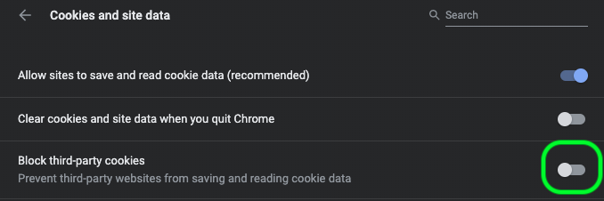

# [!DNL Data Science Workspace] トラブルシューティングガイド

このドキュメントでは、Adobe Experience Platformに関するよくある質問に対する回答を示します [!DNL Data Science Workspace]. に関する質問およびトラブルシューティング [!DNL Platform] 一般的な API については、 [Adobe Experience Platform API トラブルシューティングガイド](../landing/troubleshooting.md).

## JupyterLab Notebook クエリステータスが実行状態でスタックする

JupyterLab Notebook は、セルがメモリ不足の状態で、無期限に実行状態にあることを示します。 例えば、大きなデータセットをクエリしたり、後続のクエリを複数実行したりする場合、JupyterLab ノートブックで使用可能なメモリが不足して、結果のデータフレームオブジェクトを保存できます。 この状況では、いくつかの指標が見られます。 最初に、カーネルがアイドル状態に入ると、セルが [`*`] アイコンが表示されます。 また、下部のバーには、使用可能な RAM の容量が示されます。


データの読み取り中に、割り当て済みメモリの最大容量に達するまでメモリが増加する場合があります。 メモリは、最大メモリに達し、カーネルが再起動するとすぐに解放されます。 つまり、このシナリオで使用されるメモリはカーネルの再起動が原因で非常に低く表示されますが、再起動直前には、メモリは最大割り当て済み RAM に非常に近くなっていたはずです。

この問題を解決するには、JupyterLab の右上にある歯車アイコンを選択し、スライダーを右にスライドして、次に「 **[!UICONTROL 設定を更新]** より多くの RAM を割り当てる。 さらに、複数のクエリを実行していて、RAM 値が最大割り当て量に近づいている場合は、以前のクエリの結果が必要でない限り、カーネルを再起動して、使用可能な RAM の量をリセットします。 これにより、現在のクエリで使用できる RAM の最大容量が確保されます。


最大メモリ (RAM) を割り当てている場合でも、この問題が発生した場合は、データの列や範囲を減らすことで、クエリを変更して、より小さいデータセットサイズで動作するようにできます。 最大量のデータを使用するには、Spark ノートブックを活用することをお勧めします。

## [!DNL JupyterLab] で環境が読み込まれていません [!DNL Google Chrome]

>[!IMPORTANT]
>
>この問題は解決しましたが、Google Chrome 80.x ブラウザーには引き続き存在する可能性があります。 Chrome ブラウザーが最新であることを確認してください。

を使用 [!DNL Google Chrome] ブラウザーのバージョン 80.x では、すべてのサードパーティ Cookie がデフォルトでブロックされます。 このポリシーは、次を防ぐことができます [!DNL JupyterLab] Adobe Experience Platform内での読み込みから

この問題を修正するには、次の手順を実行します。

を [!DNL Chrome] ブラウザーで、右上に移動して、「 」を選択します。 **設定** ( または、アドレスバーに「chrome://settings/」をコピーして貼り付けることもできます )。 次に、ページの下部までスクロールし、**詳細設定**&#x200B;ドロップダウンをクリックします。


「**プライバシーとセキュリティ**」セクションが表示されます。次に、「**サイトの設定**」をクリックし、「**Cookie とサイトデータ**」をクリックします。


最後に、「サードパーティ Cookie のブロック」を「オフ」に切り替えます。



>[!NOTE]
>
>または、サードパーティ Cookie を無効にして、 [*.]ds.adobe.net を許可リストに追加します。

アドレスバーの「chrome://flags/」に移動します。 「 」というタイトルのフラグを検索して無効にします。 *&quot;SameSite by default cookies&quot;* 右側のドロップダウンメニューを使用します。


手順 2 の後、ブラウザーを再起動するように求められます。再起動後、 [!DNL Jupyterlab] はアクセス可能である必要があります。

## アクセスできない理由 [!DNL JupyterLab] Safari の

Safari は、Safari で 12 未満の場合、デフォルトでサードパーティ Cookie を無効にします。 なぜなら、 [!DNL Jupyter] 仮想マシンインスタンスは親フレームとは異なるドメインに存在します。現在、Adobe Experience Platformでは、サードパーティ cookie を有効にする必要があります。 サードパーティ Cookie を有効にするか、次のような別のブラウザに切り替えてください： [!DNL Google Chrome].

Safari 12 の場合は、ユーザーエージェントを「[!DNL Chrome]&#39;または&#39;[!DNL Firefox]&#39;. ユーザーエージェントを切り替えるには、まず *Safari* メニューと選択 **環境設定**. 環境設定ウィンドウが表示されます。


Safari 環境設定ウィンドウで、「 **詳細**. 次に、 *メニューバーに開発メニューを表示* ボックス この手順が完了したら、環境設定ウィンドウを閉じることができます。


次に、上部のナビゲーションバーから、 **開発** メニュー 内から **開発** ドロップダウン、 **ユーザーエージェント**. 次の項目を選択できます。 **[!DNL Chrome]** または **[!DNL Firefox]** 使用するユーザーエージェント文字列です。


## でファイルをアップロードまたは削除しようとすると、「403 Forbidden」というメッセージが表示されるのはなぜですか？ [!DNL JupyterLab]?

ブラウザーが、次のような広告ブロックソフトウェアで有効になっている場合 [!DNL Ghostery] または [!DNL AdBlock] さらに、の各広告ブロックソフトウェアでドメイン「\*.adobe.net」を許可する必要があります。 [!DNL JupyterLab] 正常に動作する。 これは、 [!DNL JupyterLab] 仮想マシンは、 [!DNL Experience Platform] ドメイン。

## なぜ私の一部を行うのか [!DNL Jupyter Notebook] スクランブルされているか、コードとしてレンダリングされていませんか。

これは、問題のセルが誤って「Code」から「Markdown」に変更された場合に発生する可能性があります。コードセルにフォーカスがある間に **Esc + M** キーを押すと、セルの種類が Markdown に変更されます。セルの種類は、選択したセルのノートブックの上部にあるドロップダウンインジケーターで変更できます。セルの種類をコードに変更するには、まず、変更するセルを選択します。次に、セルの現在の種類を示すドロップダウンをクリックし、「Code」を選択します。


## カスタムのインストール方法 [!DNL Python] 図書館？

この [!DNL Python] カーネルは、多くの一般的な機械学習ライブラリと共にプリインストールされています。 ただし、コードセル内で次のコマンドを実行すると、追加のカスタムライブラリをインストールできます。

```shell
!pip install {LIBRARY_NAME}
```

プリインストール済みの [!DNL Python] ライブラリについては、 [JupyterLab ユーザーガイドの付録の節](./jupyterlab/overview.md#supported-libraries).

## カスタム PySparkライブラリをインストールできますか？

残念ながら、PySpark カーネルの追加ライブラリはインストールできません。ただし、アドビのカスタマーサービス担当者に連絡して、カスタム PySpark ライブラリをインストールしてもらうことができます。

事前インストールされている PySpark ライブラリのリストについては、[JupyterLab ユーザーガイドの付録の節](./jupyterlab/overview.md#supported-libraries)を参照してください。

## 次の項目を設定できますか？ [!DNL Spark] クラスタリソース [!DNL JupyterLab] [!DNL Spark] PySpark カーネル？

ノートブックの最初のセルに次のブロックを追加することで、リソースを設定できます。

```python
%%configure -f 
{
    "numExecutors": 10,
    "executorMemory": "8G",
    "executorCores":4,
    "driverMemory":"2G",
    "driverCores":2,
    "conf": {
        "spark.cores.max": "40"
    }
}
```

詳しくは、 [!DNL Spark] 設定可能なプロパティの完全なリストを含む、クラスタリソースの設定については、 [JupyterLab ユーザーガイド](./jupyterlab/overview.md#kernels).

## 大きなデータセットに対して特定のタスクを実行しようとするとエラーが表示されるのはなぜですか？

次のような理由でエラーが発生した場合： `Reason: Remote RPC client disassociated. Likely due to containers exceeding thresholds, or network issues.` これは、通常、ドライバーまたは実行者のメモリが不足していることを意味します。 JupyterLab ノートブックを参照してください [データアクセス](./jupyterlab/access-notebook-data.md) データ制限の詳細と、大きなデータセットでタスクを実行する方法に関するドキュメントを参照してください。 通常、このエラーは `mode` から `interactive` から `batch`.

さらに、大きな Spark/PySpark データセットを書き込む際に、データをキャッシュします (`df.cache()`) を読み込む前に、書き込みコードを実行すると、パフォーマンスが大幅に向上します。

<!-- remove this paragraph at a later date once the sdk is updated -->

データの読み取り中に問題が発生し、データに変換を適用する場合は、変換の前にデータをキャッシュしてみてください。 データをキャッシュすると、ネットワークを介した複数の読み取りを防ぐことができます。 まずデータを読み取ります。 次に、キャッシュ (`df.cache()`) をクリックします。 最後に、変換を実行します。

## Spark/PySpark ノートブックがデータの読み取りと書き込みに長くかかるのはなぜですか？

データに対して変換を実行する場合 ( 例： `fit()`に値を指定しない場合、変換が複数回実行されている可能性があります。 パフォーマンスを向上させるには、 `df.cache()` 実行する前に `fit()`. これにより、変換が 1 回だけ実行され、ネットワークを介した複数の読み取りを防ぐことができます。

**推奨順序：** まずデータを読み取ります。 次に、変換の後にキャッシュ (`df.cache()`) をクリックします。 最後に、 `fit()`.

## Spark/PySpark ノートブックが動作しないのはなぜですか？

次のいずれかのエラーが表示される場合：

- ステージの失敗によりジョブが中止されました…各パーティション内の要素数が同じ RDD のみを zip で圧縮できます。
- リモート RPC クライアントが関連付けを解除し、その他のメモリエラーが発生しました。
- データセットの読み取りと書き込みの際のパフォーマンスが低下。

データをキャッシュしている (`df.cache()`) をクリックしてからデータを書き込みます。 ノートブックでコードを実行する場合、 `df.cache()` 例えば～のような行動の前に `fit()` は、ノートブックのパフォーマンスを大幅に向上させます。 使用 `df.cache()` データセットを書き込む前に、変換が複数回ではなく、1 回だけ実行されるようにします。

## [!DNL Docker Hub] Data Science Workspace の制限

2020 年 11 月 20 日をもって、Docker Hub の匿名での認証済み使用に関するレート制限が発効しました。 匿名で無料 [!DNL Docker Hub] ユーザーは、6 時間ごとに 100 個のコンテナイメージプルリクエストに制限されます。 これらの変更の影響を受ける場合は、次のエラーメッセージが表示されます。 `ERROR: toomanyrequests: Too Many Requests.` または `You have reached your pull rate limit. You may increase the limit by authenticating and upgrading: https://www.docker.com/increase-rate-limits.`.

現在、この制限は、6 時間以内に 100 台のノートブックをレシピに作成しようとしている場合、または頻繁に拡大/縮小する Data Science Workspace 内で Spark ベースのノートブックを使用している場合にのみ、組織に影響します。 ただし、これは考えられない。これは、クラスタがで実行され、アイドルアウトする前に 2 時間アクティブなままになるからである。 これにより、クラスターがアクティブな場合に必要なプル数が減ります。 上記のエラーのいずれかが発生した場合は、 [!DNL Docker] 制限がリセットされました。

詳しくは、 [!DNL Docker Hub] レート制限、 [DockerHub ドキュメント](https://www.docker.com/increase-rate-limits). これに対する解決策は、現在作業中で、今後のリリースで予想されるものです。
