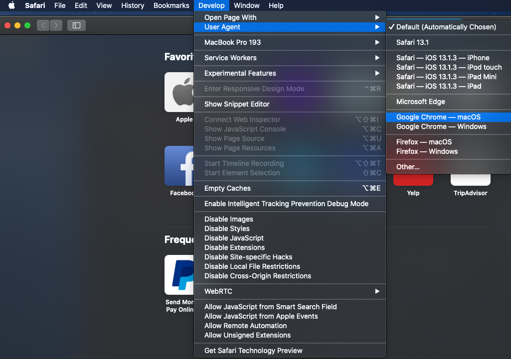

# Data Science Workspaceトラブルシューティングガイド

このドキュメントでは、Adobe Experience Platform Data Science Workspaceに関するよくある質問への回答を示します。 プラットフォームAPIに関する一般的な質問とトラブルシューティングについては、 [Adobe Experience Platform APIトラブルシューティングガイドを参照してください](../landing/troubleshooting.md)。

## JupterLab環境がGoogle Chromeで読み込まれない

>[!IMPORTANT] この問題は解決しましたが、Google Chrome 80.xブラウザーには引き続き存在する可能性があります。 Chromeブラウザーが最新の状態であることを確認してください。

Google Chromeブラウザーバージョン80.xでは、サードパーティCookieはすべてデフォルトでブロックされます。 このポリシーにより、JupterLabがAdobe Experience Platform内で読み込まれるのを防ぐことができます。

この問題を修正するには、次の手順を実行します。

Chromeブラウザーで、右上の「 **設定** 」を選択します(または、アドレスバーに「chrome://settings/」をコピーして貼り付けることができます)。 次に、ページの下部までスクロールし、「 **詳細** 」ドロップダウンをクリックします。


「 *プライバシーとセキュリティ* 」セクションが表示されます。 次に、「 **サイト設定** 」をクリックし、「 **Cookie」とサイトデータをクリックします**。


最後に、「サードパーティcookieをブロック」を「オフ」に切り替えます。


>[!NOTE] または、サードパーティcookieとホワイトリスト [*を無効にすることもできます。]ds.adobe.net

アドレスバーの「chrome://flags/」に移動します。 右側のドロップダウンメニューを使用して、「SameSite by default cookies」という名前のフラグを検索して無効に *し* ます。


手順2の後、ブラウザーを再起動するように求められます。 再起動後、Jupyterlabにアクセス可能にする必要があります。

## SafariでJupyterLabにアクセスできないのはなぜですか。

Safariでは、Safari &lt; 12で、デフォルトでサードパーティcookieが無効になっています。 Jupyter仮想マシンインスタンスは親フレームとは異なるドメインに存在するので、現在、Adobe Experience Platformではサードパーティcookieを有効にする必要があります。 サードパーティCookieを有効にするか、Google Chromeなどの別のブラウザーに切り替えてください。

Safari 12の場合は、ユーザーエージェントを「Chrome」または「Firefox」に切り替える必要があります。 ユーザーエージェントを切り替えるには、 *Safari* 開始を開いて「 **環境設定**」を選択します。 プリファレンスウィンドウが表示されます。


Safariの環境設定ウィンドウで、「 **詳細」を選択します**。 次に、メニューバーの *「現像を表示」メニュー* ・ボックスを選択します。 この手順が完了したら、環境設定ウィンドウを閉じることができます。


次に、上部ナビゲーションバーで **開発** メニューを選択します。 「 *開発* 」ドロップダウンで、「 *ユーザーエージェント*」の上にカーソルを置きます。 使用する **Chrome** または **Firefox** User Agent文字列を選択できます。



## JupyterLabでファイルをアップロードまたは削除しようとすると「403 Forbidden」というメッセージが表示されるのはなぜですか。

ブラウザがGhosteryやAdBlock Plusなどの広告ブロックソフトウェアで有効になっている場合、JupterLabが正常に動作するには、各広告ブロックソフトウェアでドメイン「\*.adobe.net」をホワイトリストに登録する必要があります。 これは、JupyterLab仮想マシンがエクスペリエンスプラットフォームドメインとは異なるドメインで実行されているためです。

## ジュピター・ノートブックの一部が乱れて見えるか、コードとして表示されないのはなぜですか。

これは、問題のセルが誤って「コード」から「マークダウン」に変更された場合に発生する可能性があります。 コードセルにフォーカスがある状態で、キーの組み合わせ **ESC+M** を押すと、セルの種類がMarkdownに変わります。 セルの種類は、選択したセルのノートブックの上部にあるドロップダウンインジケーターで変更できます。 セルの種類をコードに変更するには、変更するセルを開始します。 次に、セルの現在のタイプを示すドロップダウンをクリックし、「コード」を選択します。


## カスタムPythonライブラリのインストール方法

Pythonカーネルは、多くの一般的な機械学習ライブラリと共にプリインストールされています。 ただし、追加のカスタムライブラリは、コードセル内で次のコマンドを実行することでインストールできます。

```shell
!pip install {LIBRARY_NAME}
```

プリインストールされたPythonライブラリの完全なリストについては、『JupyterLab User Guide [』の](./jupyterlab/overview.md#supported-libraries)付録の節を参照してください。

## カスタムPySparkライブラリをインストールできますか。

残念ながら、PySparkカーネル用の追加のライブラリはインストールできません。 ただし、アドビのカスタマーサービス担当者に連絡して、カスタムPySparkライブラリをインストールしてもらうことができます。

PySparkの事前インストールされたライブラリのリストについては、『JupyterLab User Guide [』の](./jupyterlab/overview.md#supported-libraries)付録の節を参照してください。

## JupyterLab SparkまたはPySparkカーネル用にSparkクラスタリソースを設定できますか？

ノートブックの最初のセルに次のブロックを追加して、リソースを構成できます。

```python
%%configure -f 
{
    "numExecutors": 10,
    "executorMemory": "8G",
    "executorCores":4,
    "driverMemory":"2G",
    "driverCores":2,
    "conf": {
        "spark.cores.max": "40"
    }
}
```

設定可能なプロパティの完全なリストなど、Sparkクラスタリソースの設定について詳しくは、『 [JupterLab User Guide](./jupyterlab/overview.md#kernels)』を参照してください。