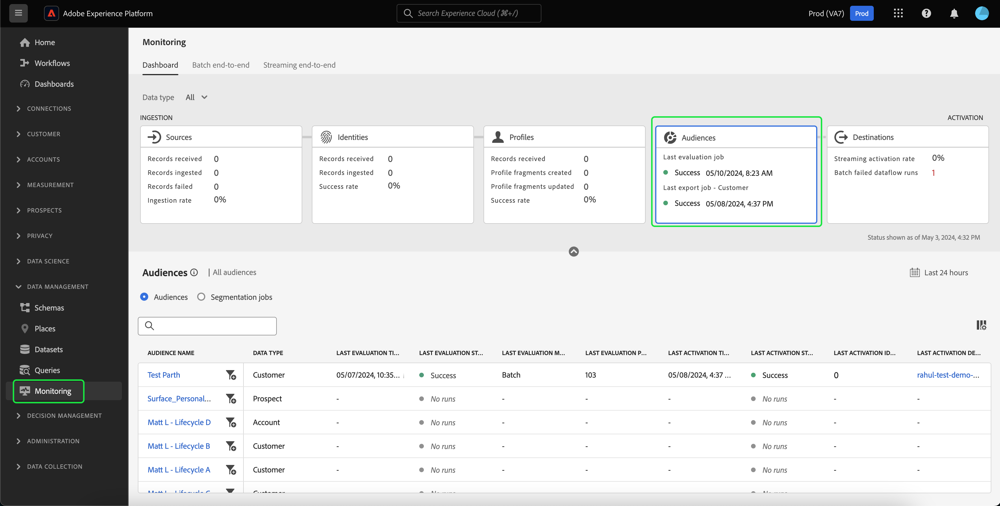
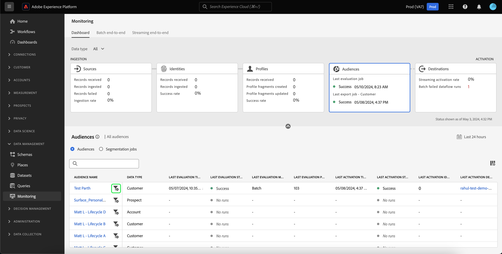
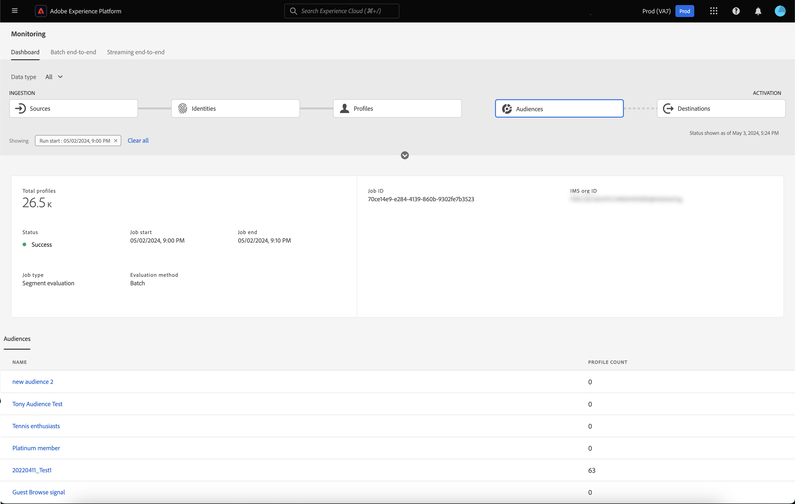
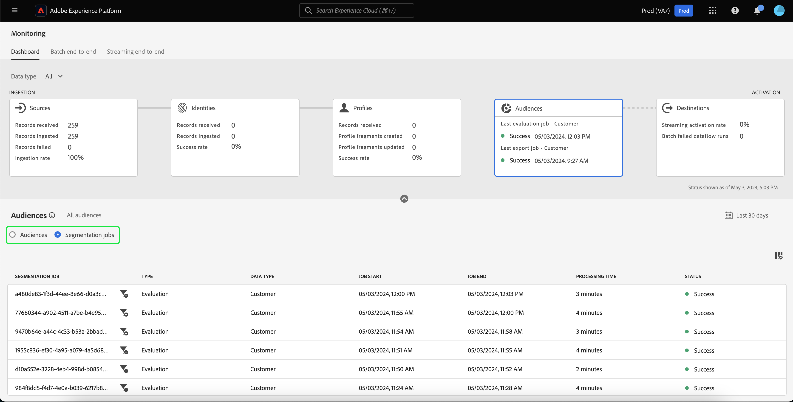

# UI でのオーディエンスのデータフローの監視

セグメント化サービスを使用すると、セグメント定義またはその他のソースを使用して、[!DNL Real-Time Customer Profile] データからオーディエンスを作成できます。 Experience Platformは、ソースから宛先へのデータフローを透過的に追跡するデータフローを提供します。

監視ダッシュボードを使用して、データのセグメント化のステータスなど、オーディエンス内のデータのアクティビティを視覚的に表示します。 Experience Platform ユーザーインターフェイスを使用してデータのセグメント化を監視し、オーディエンスのアクティベーション、評価および書き出しジョブのステータスを追跡できる、監視ダッシュボードを使用する方法について詳しくは、チュートリアルをお読みください。

## はじめに {#getting-started}

このガイドでは、Adobe Experience Platform の次のコンポーネントに関する十分な知識が必要です。

- [&#x200B; データフロー &#x200B;](../home.md)：データフローは、Experience Platform間でデータを移動するデータジョブを表します。 データフローは異なるサービスをまたいで設定され、ソースコネクタからターゲットデータセット、[!DNL Identity] および [!DNL Profile]、[!DNL Destinations] へとデータを移動できます。
   - [データフロー実行](../../sources/notifications.md)：データフロー実行は、選択したデータフローの頻度設定に基づいて繰り返しスケジュールされたジョブです。
- [&#x200B; セグメント化 &#x200B;](../../segmentation/home.md)：セグメント化によって、リアルタイム顧客プロファイルデータからオーディエンスを作成できます。
   - [&#x200B; アクティベーションジョブ &#x200B;](../../destinations/ui/activation-overview.md)：アクティベーションジョブを使用して、指定した宛先に対してオーディエンスをアクティベートします。
   - [&#x200B; 評価ジョブ &#x200B;](../../segmentation/tutorials/evaluate-a-segment.md#evaluate-a-segment)：評価ジョブは、オーディエンスを評価する非同期プロセスです。
   - [&#x200B; 書き出しジョブ &#x200B;](../../segmentation/api/export-jobs.md)：書き出しジョブは、オーディエンスメンバーをデータセットに保持するために使用される非同期プロセスです。
- [サンドボックス](../../sandboxes/home.md)：[!DNL Experience Platform] には、単一の [!DNL Experience Platform] インスタンスを別個の仮想環境に分割してデジタルエクスペリエンスアプリケーションの開発と発展を支援する仮想サンドボックスが用意されています。

## オーディエンス監視ダッシュボード {#monitoring-audiences-dashboard}

>[!CONTEXTUALHELP]
>id="platform_monitoring_segments"
>title="オーディエンス"
>abstract="オーディエンスビューには、アクティベーションおよび評価ジョブについての詳細情報を含む、すべての組織のオーディエンスに関する情報が表示されます。"

**[!UICONTROL オーディエンス]** ダッシュボードにアクセスするには、左側のナビゲーションで **[!UICONTROL 監視]** を選択します。 **[!UICONTROL モニタリング]** ページで「**[!UICONTROL オーディエンス]** カードを選択します。

メインの **[!UICONTROL オーディエンス]** ダッシュボードでは、**[!UICONTROL オーディエンス]** カードに前回の評価ジョブおよび前回のエクスポートジョブのステータスと日付が表示されます。

ダッシュボード自体には、オーディエンスとセグメント化ジョブの両方の指標が含まれています。 デフォルトでは、ダッシュボードには過去 24 時間のオーディエンス指標が表示されます。 セグメント化ジョブビューについて詳しくは、[&#x200B; セグメント化ジョブの監視 &#x200B;](#monitoring-segmentation-jobs-dashboard) を参照してください。

>[!IMPORTANT]
>
>現在、オーディエンスの監視ダッシュボードでは、[&#x200B; バッチ（ファイルベース）の宛先に対してアクティブ化されたオーディエンス &#x200B;](../../destinations/destination-types.md#file-based) みがサポートされています。

このダッシュボードビューでは、次の指標を使用できます。

| 指標 | 説明 |
| ------ | ----------- |
| **[!UICONTROL オーディエンス名]** | オーディエンスの名前。 |
| **[!UICONTROL データタイプ]** | オーディエンスのデータタイプ。 取り得る値は **[!UICONTROL Customer]**、**[!UICONTROL Account]**、および **[!UICONTROL Prospect]** です。 カードのリボンの上にある [!UICONTROL &#x200B; データタイプ &#x200B;] フィルターを使用すると、指定したデータタイプのオーディエンスを表示できます。 |
| **[!UICONTROL 前回の評価タイムスタンプ]** | オーディエンスの最後の評価ジョブが実行された日時。 |
| **[!UICONTROL 前回の評価ステータス]** | オーディエンスの前回の評価ジョブのステータス。 有効な値には、**[!UICONTROL 成功]**、**[!UICONTROL 実行なし]**、**[!UICONTROL 失敗]** などがあります。 |
| **[!UICONTROL 前回の評価方法]** | オーディエンスの評価方法。 バッチセグメント化のみがサポートされるので、取り得る値は **[!UICONTROL Batch]** のみです。 |
| **[!UICONTROL 前回の評価プロファイル]** | オーディエンスの最後の評価ジョブで評価されたプロファイルの数。 |
| **[!UICONTROL 前回のアクティベーションのタイムスタンプ]** | オーディエンスの最後のアクティベーションジョブが実行された日時。 |
| **[!UICONTROL 前回のアクティベーションステータス]** | オーディエンスの前回のアクティベーションジョブのステータス。 有効な値には、**[!UICONTROL 成功]**、**[!UICONTROL 実行なし]**、**[!UICONTROL 失敗]** などがあります。 |
| **[!UICONTROL 前回のアクティベーション ID]** | オーディエンスの最後のアクティベーションジョブでアクティブ化された ID の数。 |
| **[!UICONTROL 前回のアクティベーションの宛先]** | オーディエンスの最後のアクティベーションジョブがアクティベートされた宛先の名前。 |

フィルターアイコン（）に設定します。 セグメント化ジョブは時系列で並べ替えられ、最新のセグメント化ジョブが最初に表示されます。

フィルタリングされたオーディエンスダッシュボードが表示されます。 **[!UICONTROL オーディエンス]** カードには、最後の評価ジョブのステータスと日付、および最後のアクティベーションジョブの日付が表示されます。

ダッシュボード自体には、最後の評価およびアクティベーションジョブの時間とステータス、オーディエンス評価のプロファイル数を示すグラフ、および実行されたセグメント化ジョブの指標が表示されます。 デフォルトでは、ダッシュボードには、過去 24 時間のセグメント化ジョブ指標が表示されます。

このダッシュボードビューでは、次の指標を使用できます。

| 指標 | 説明 |
| ------ | ----------- |
| **[!UICONTROL ジョブ開始]** | セグメント化ジョブが開始した日時。 |
| **[!UICONTROL タイプ]** | セグメント化ジョブのタイプを示します。 サポートされているジョブタイプは **アクティブ化** ジョブと **評価** ジョブの 2 つです。 |
| **[!UICONTROL ジョブ完了]** | セグメント化ジョブが完了した日時。 |
| **[!UICONTROL 処理時間]** | セグメント化ジョブが完了するまでにかかった時間。 |
| **[!UICONTROL ジョブステータス]** | セグメント化ジョブのステータス。 サポートされる値は、**[!UICONTROL 成功]**、**[!UICONTROL 処理中]**、**[!UICONTROL 失敗]** です。 |
| **[!UICONTROL プロファイル数]** | セグメント化ジョブが評価しているプロファイルの数。 各ユーザーには、一意のプロファイルが必要です。 |
| **[!UICONTROL アクティブ化された ID]** | セグメント化ジョブがアクティブ化している ID の数。 各プロファイルには複数の ID を設定できます。 例えば、プロファイルには、ID としてメール、電話番号、ロイヤルティ番号を含めることができます。 |
| **[!UICONTROL 宛先名]** | セグメント化ジョブをアクティブ化する宛先の名前。 |

フィルターアイコン（）に設定します。 フィルタリングできるセグメント化ジョブには、アクティベーションジョブと評価ジョブの 2 種類があります。

### アクティベーションジョブの詳細 {#activation-job-details}

アクティベーションジョブのデータフロー実行の詳細ページには、セグメント化ジョブに関連する実行の指標、データフロー実行エラー、オーディエンスに関する情報が表示されます。 アクティベーションジョブは、指定した宛先に対してオーディエンスをアクティベートするために使用されます。

このダッシュボードビューでは、次の指標を使用できます。

| 指標 | 説明 |
| ------ | ----------- |
| **[!UICONTROL 受信したプロファイル]** | アクティベーションフローで受信したプロファイルの合計数。 |
| **[!UICONTROL アクティブ化された ID]** | 受信したプロファイルに基づいて、宛先に対して正常にアクティブ化された ID の合計数です。 |
| **[!UICONTROL 除外された ID]** | 受信したプロファイルに基づいて、宛先に対してアクティブ化するために除外された ID の合計数です。 これらの ID は、属性が見つからない、または同意違反が原因で除外される可能性があります。 |
| **[!UICONTROL データのサイズ]** | アクティブ化するデータフローのサイズ。 |
| **[!UICONTROL 合計ファイル数]** | データフローでアクティブ化されているファイルの合計数です。 |
| **[!UICONTROL ステータス]** | アクティベーションジョブの現在のステータス。 |
| **[!UICONTROL データフロー実行開始]** | アクティベーションジョブが開始した日時。 |
| **[!UICONTROL データフローの実行終了]** | アクティベーションジョブが終了した日時。 |
| **[!UICONTROL データフロー実行 ID]** | 現在のアクティベーションジョブの ID。 |
| **[!UICONTROL IMS 組織 ID]** | アクティベーションジョブが属する組織の ID。 |
| **[!UICONTROL 宛先名]** | データがアクティブ化されている宛先の名前。 |

「オーディエンス」セクションには、アクティベーションジョブの一部としてアクティベートされたオーディエンスのリストが表示されます。

オーディエンスセクションでは、次の指標を使用できます。

| 指標 | 説明 |
| ------ | ----------- |
| **[!UICONTROL 名前]** | アクティブ化されたオーディエンスの名前。 |
| **[!UICONTROL アクティブ化された ID]** | 受信したプロファイルに基づいて、宛先に対して正常にアクティブ化された ID の合計数です。 |
| **[!UICONTROL 除外された ID]** | 受信したプロファイルに基づいて、宛先に対してアクティブ化するために除外された ID の合計数です。 これらの ID は、属性の欠如または同意違反が原因で除外される可能性があります。 |
| **[!UICONTROL 前回のデータフロー実行ステータス]** | そのオーディエンスに対して実行された前回のアクティベーションジョブのステータス。 |
| **[!UICONTROL 前回のデータフロー実行日]** | そのオーディエンスに対して実行された最後のアクティベーションジョブの日時。 |

さらに、データフロー実行エラーに関する詳細を表示できます。 「データフロー実行エラー」セクションでは、失敗した ID と除外された ID の両方を表示できます。 「エラー」セクションには、エラーコードに関する詳細と、失敗または除外された ID の数が含まれます。

### 評価ジョブの詳細 {#evaluation-job-details}

評価ジョブのデータフロー実行の詳細ページには、セグメント化ジョブに関連する実行の指標とオーディエンスに関する情報が表示されます。

このダッシュボードビューでは、次の指標を使用できます。

| 指標 | 説明 |
| ------ | ----------- |
| **[!UICONTROL 合計プロファイル数]** | 評価中のプロファイルの合計数。 |
| **[!UICONTROL ステータス]** | 評価ジョブのステータス。 評価ジョブの可能なステータスには **[!UICONTROL 成功]** と **[!UICONTROL 失敗]** があります。 |
| **[!UICONTROL ジョブ開始]** | 評価ジョブが開始された日時。 |
| **[!UICONTROL ジョブ終了]** | 評価ジョブが終了した日時。 |
| **[!UICONTROL ジョブタイプ]** | セグメント化ジョブのタイプ。 この場合、常に **[!UICONTROL セグメント評価]** ジョブになります。 |
| **[!UICONTROL 評価タイプ]** | 実行されている評価のタイプ。 これは、**[!UICONTROL バッチ]** または **[!UICONTROL ストリーミング]** のいずれかです。 |
| **[!UICONTROL ジョブ ID]** | 評価ジョブの ID。 |
| **[!UICONTROL IMS 組織 ID]** | 評価ジョブが属する組織の ID。 |
| **[!UICONTROL オーディエンス名]** | 評価されるオーディエンスの名前。 |
| **[!UICONTROL オーディエンス ID]** | 評価対象のオーディエンス ID。 |

「[!UICONTROL &#x200B; オーディエンス &#x200B;]」セクションには、評価ジョブの一部として評価されているオーディエンスのリストが表示されます。 検索バーを使用して、名前でオーディエンスのリストをフィルタリングできます。

>[!IMPORTANT]
>
>このダッシュボードビューは現在、最大 800 個のオーディエンス指標をサポートしています。

[!UICONTROL &#x200B; オーディエンス &#x200B;] セクションでは、次の指標を使用できます。

| 指標 | 説明 |
| ------ | ----------- |
| **[!UICONTROL 名前]** | 評価されるオーディエンスの名前。 |
| **[!UICONTROL プロファイル数]** | 評価されているプロファイルの数。 |

## セグメント化ジョブ監視ダッシュボード {#monitoring-segmentation-jobs-dashboard}

>[!CONTEXTUALHELP]
>id="platform_monitoring_segment_jobs"
>title="セグメント化ジョブ"
>abstract="セグメント化ジョブビューには、すべてのオーディエンスに対する評価および書き出しジョブに関する情報が表示されます。"

**[!UICONTROL セグメント化ジョブ]** ダッシュボードにアクセスするには、**[!UICONTROL オーディエンス]** ダッシュボードの [!UICONTROL &#x200B; セグメント化ジョブ &#x200B;] を選択します。 [!UICONTROL &#x200B; モニタリング &#x200B;] ダッシュボードには、評価ジョブとエクスポートジョブに関する指標と情報が含まれています。

>[!NOTE]
>
>オーディエンスごとの監視では、**セグメント化評価ジョブ** のみがサポートされています。 セグメント化の書き出しジョブでは、組織レベルの監視のみがサポートされます。

[!UICONTROL &#x200B; セグメント化ジョブ &#x200B;] ダッシュボードを使用して、プロファイルの評価と書き出しが時間通りに、例外なく発生するかどうかを把握し、宛先アクティベーションのダウンストリームサービスが最新の評価済みプロファイルデータを持つことができるようにします。

セグメント化ジョブでは、次の指標を使用できます。

| 指標 | 説明 |
| ------ | ----------- |
| **[!UICONTROL セグメント化ジョブ]** | セグメント化ジョブの名前を示します。 |
| **[!UICONTROL タイプ]** | セグメント化ジョブのタイプ（書き出しまたは評価）を示します。 どちらの場合も、セグメント化ジョブは組織に属するオーディエンス **すべて** を評価または書き出します。 エクスポートジョブについて詳しくは、[&#x200B; エクスポートジョブエンドポイント &#x200B;](../../segmentation/api/export-jobs.md) に関するガイドを参照してください。 評価ジョブについて詳しくは、[&#x200B; セグメント定義の評価 &#x200B;](../../segmentation/tutorials/evaluate-a-segment.md#evaluate-a-segment) に関するチュートリアルを参照してください。 |
| **[!UICONTROL ジョブ開始]** | セグメント化ジョブが開始した日時。 |
| **[!UICONTROL ジョブ終了]** | セグメント化ジョブが完了した日時。 |
| **[!UICONTROL ステータス]** | 完了したジョブのステータス。 セグメント化ジョブの可能なステータスには、成功または失敗が含まれます。 |
