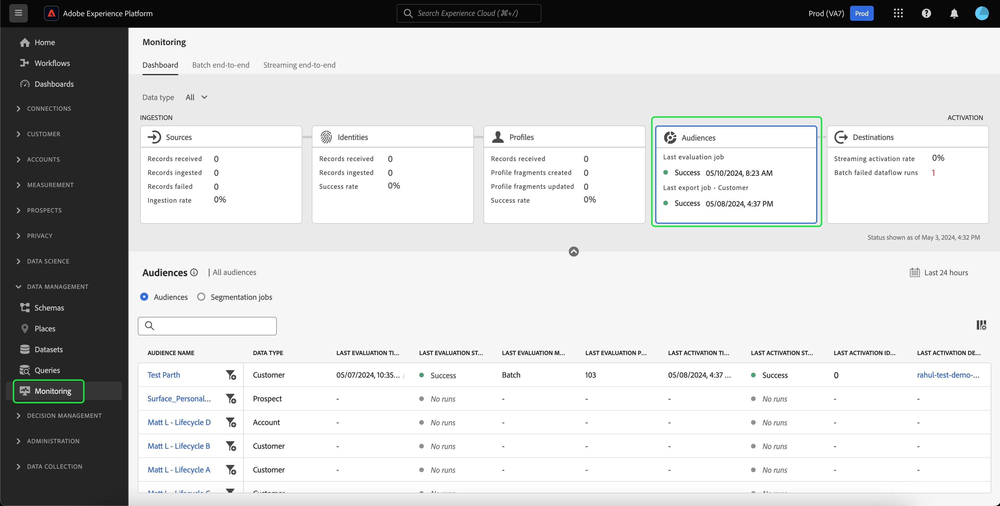
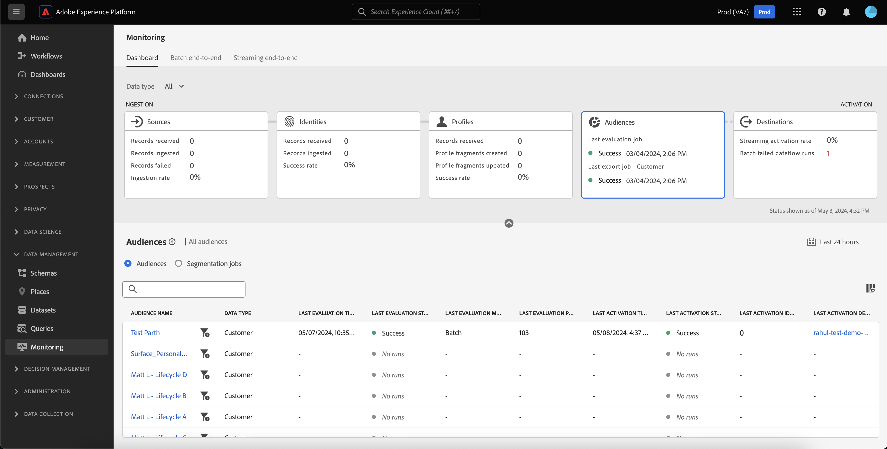
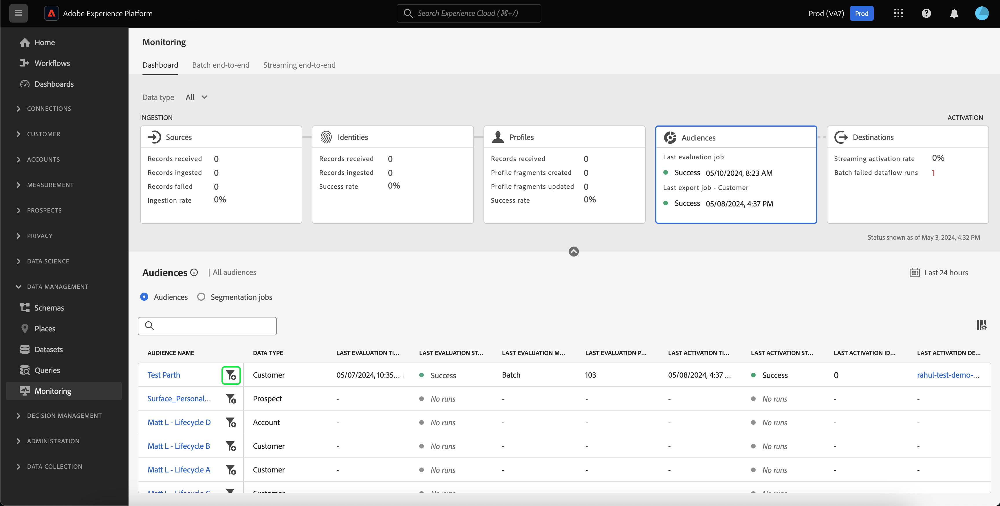
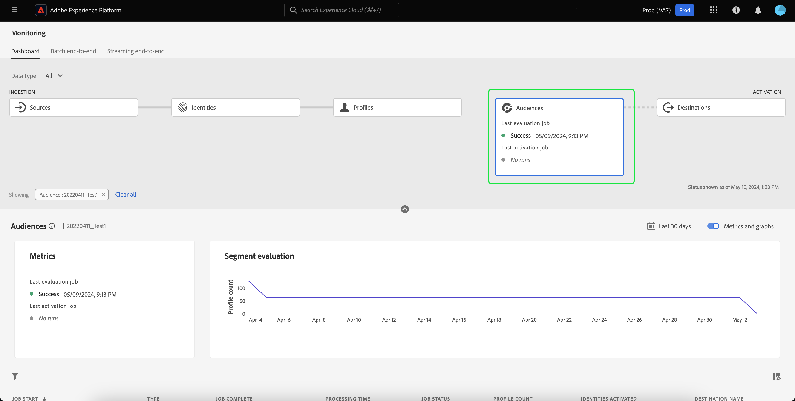
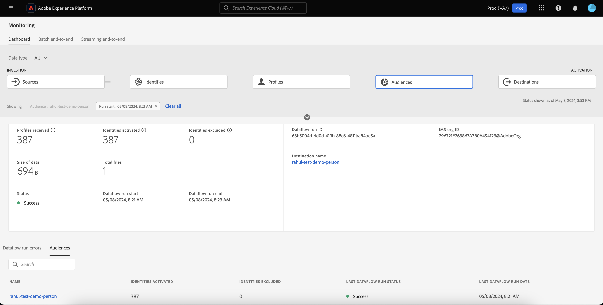
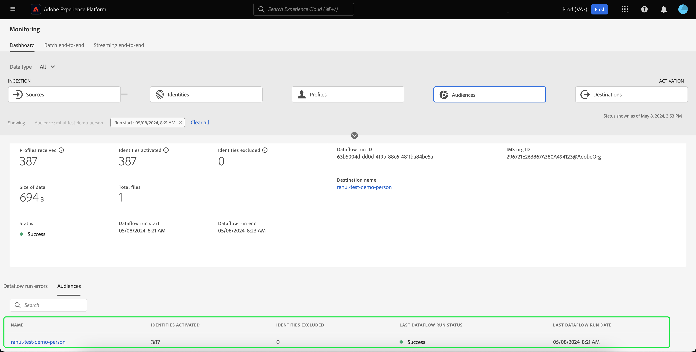
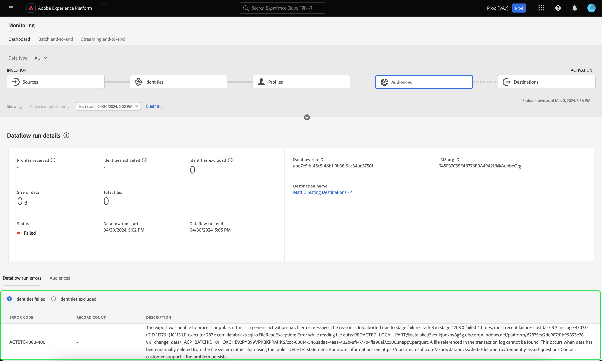
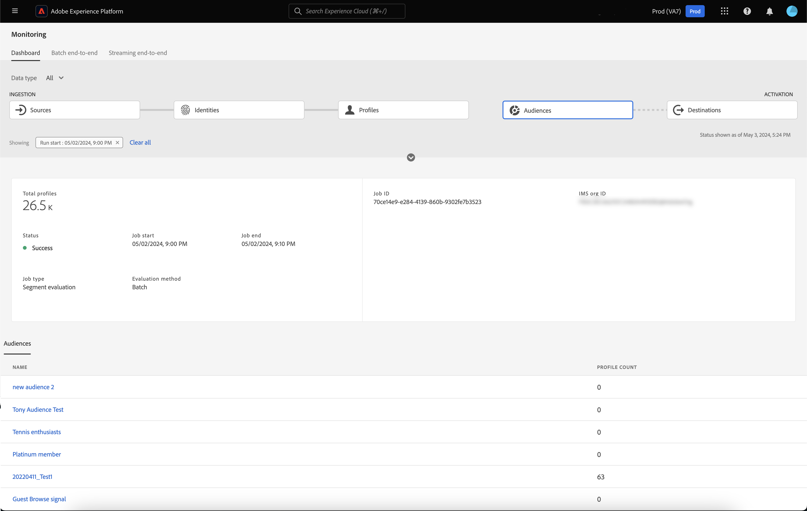
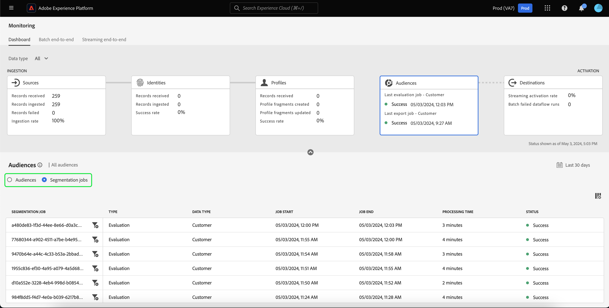

# UIでのオーディエンスのデータフローの監視

セグメント化サービスを使用すると、セグメント定義またはその他のソースを通じて、[!DNL Real-Time Customer Profile] データからオーディエンスを作成できます。 Experience Platformは、ソースから宛先へのデータの流れを透明性を保って追跡するためのデータフローを提供します。

モニタリングダッシュボードを使用すると、データのセグメンテーションのステータスなど、オーディエンス内でのデータのアクティビティを視覚的に表示できます。 Experience Platformのユーザーインターフェイスを使用して、モニタリングダッシュボードを使用してデータのセグメンテーションをモニタリングし、オーディエンスのアクティベーション、評価、エクスポートのステータスをトラッキングする方法について、チュートリアルをご覧ください。

## はじめに {#getting-started}

このガイドは、Adobe Experience Platform の次のコンポーネントを実際に利用および理解しているユーザーを対象としています。

- [&#x200B; データフロー](../home.md): データフローは、Experience Platform間でデータを移動するデータジョブを表します。 データフローは異なるサービスをまたいで設定され、ソースコネクタからターゲットデータセット、[!DNL Identity] および [!DNL Profile]、[!DNL Destinations] へとデータを移動できます。
   - [データフロー実行](../../sources/notifications.md)：データフロー実行は、選択したデータフローの頻度設定に基づいて繰り返しスケジュールされたジョブです。
- [&#x200B; セグメント化](../../segmentation/home.md): セグメント化を使用すると、リアルタイム顧客プロファイルデータからオーディエンスを作成できます。
   - [&#x200B; アクティベーションジョブ &#x200B;](../../destinations/ui/activation-overview.md)：アクティベーションジョブを使用して、指定した宛先にオーディエンスをアクティベートします。
   - [評価ジョブ &#x200B;](../../segmentation/tutorials/evaluate-a-segment.md#evaluate-a-segment)：評価ジョブは、オーディエンスを評価する非同期プロセスです。
   - [書き出しジョブ &#x200B;](../../segmentation/api/export-jobs.md)：書き出しジョブは、オーディエンスメンバーをデータセットに保持するために使用される非同期プロセスです。
- [サンドボックス](../../sandboxes/home.md)：[!DNL Experience Platform] には、単一の [!DNL Experience Platform] インスタンスを別個の仮想環境に分割してデジタルエクスペリエンスアプリケーションの開発と発展を支援する仮想サンドボックスが用意されています。

## オーディエンスモニタリングダッシュボード {#monitoring-audiences-dashboard}

>[!CONTEXTUALHELP]
>id="platform_monitoring_segments"
>title="オーディエンス"
>abstract="オーディエンスビューには、アクティベーションおよび評価ジョブについての詳細情報を含む、すべての組織のオーディエンスに関する情報が表示されます。"

**[!UICONTROL Audiences]** ダッシュボードにアクセスするには、左側のナビゲーションで「**[!UICONTROL Monitoring]**」を選択します。 **[!UICONTROL Monitoring]** ページで、**[!UICONTROL Audiences]** カードを選択します。

メインの&#x200B;**[!UICONTROL Audiences]** ダッシュボードでは、**[!UICONTROL Audiences]** カードに、最後の評価ジョブと最後の書き出しジョブのステータスと日付が表示されます。

ダッシュボードには、オーディエンスとセグメンテーションジョブの両方の指標が含まれています。 デフォルトでは、ダッシュボードには過去24時間のオーディエンス指標が表示されます。 セグメント化ジョブ ビューについて詳しくは、「[&#x200B; セグメント化ジョブの監視](#monitoring-segmentation-jobs-dashboard)」の節を参照してください。

>[!IMPORTANT]
>
>現在、監視オーディエンスダッシュボードでは、[&#x200B; バッチ（ファイルベース）宛先](../../destinations/destination-types.md#file-based)にアクティブ化されたオーディエンスのみがサポートされています。

このダッシュボードビューでは、次の指標を使用できます。

| 指標 | 説明 |
| ------ | ----------- |
| **[!UICONTROL Audience name]** | オーディエンスの名前。 |
| **[!UICONTROL Data type]** | オーディエンスのデータタイプ。 使用可能な値には、**[!UICONTROL Customer]**、**[!UICONTROL Account]**&#x200B;および&#x200B;**[!UICONTROL Prospect]**&#x200B;が含まれます。 カードのリボンの上にある[!UICONTROL Data type] フィルターを使用すると、指定したデータタイプのオーディエンスを表示できます。 |
| **[!UICONTROL Last evaluation timestamp]** | オーディエンスの最後の評価ジョブが実行された日時。 |
| **[!UICONTROL Last evaluation status]** | オーディエンスの最後の評価ジョブのステータス。 使用可能な値には、**[!UICONTROL Success]**、**[!UICONTROL No runs]**&#x200B;および&#x200B;**[!UICONTROL Failed]**&#x200B;が含まれます。 |
| **[!UICONTROL Last evaluation method]** | オーディエンスの評価方法。 バッチセグメント化のみがサポートされているので、可能な値は&#x200B;**[!UICONTROL Batch]**&#x200B;のみです。 |
| **[!UICONTROL Last evaluation profiles]** | オーディエンスの最後の評価ジョブで評価されたプロファイルの数。 |
| **[!UICONTROL Last activation timestamp]** | オーディエンスの最後のアクティベーションジョブが実行された日時。 |
| **[!UICONTROL Last activation status]** | オーディエンスの最後のアクティベーションジョブのステータス。 使用可能な値には、**[!UICONTROL Success]**、**[!UICONTROL No runs]**&#x200B;および&#x200B;**[!UICONTROL Failed]**&#x200B;が含まれます。 |
| **[!UICONTROL Last activation identities]** | オーディエンスの最後のアクティベーションジョブでアクティブ化されたIDの数。 |
| **[!UICONTROL Last activation destination]** | オーディエンスの最後のアクティベーションジョブがアクティブ化された宛先の名前。 |

フィルターのアイコン（）。 セグメンテーションジョブは時系列で並べ替えられ、最新のセグメンテーションジョブが最初に表示されます。

フィルタリングされたオーディエンスダッシュボードが表示されます。 **[!UICONTROL Audiences]** カードには、最後の評価ジョブと最後のアクティブ化ジョブのステータスと日付が表示されます。

ダッシュボード自体には、最後の評価およびアクティベーションジョブの時間とステータス、オーディエンス評価のプロファイル数、実行されたセグメンテーションジョブの指標を示すグラフが表示されます。 デフォルトでは、ダッシュボードには過去24時間のセグメント化ジョブ指標が表示されます。

このダッシュボードビューでは、次の指標を使用できます。

| 指標 | 説明 |
| ------ | ----------- |
| **[!UICONTROL Job start]** | セグメント化ジョブが開始された日時。 |
| **[!UICONTROL Type]** | セグメント化ジョブのタイプを示します。 サポートされているジョブタイプは、**アクティベーション**&#x200B;と&#x200B;**評価**&#x200B;です。 |
| **[!UICONTROL Job complete]** | セグメント化ジョブが完了した日時。 |
| **[!UICONTROL Processing time]** | セグメント化ジョブが完了するのにかかる時間。 |
| **[!UICONTROL Job status]** | セグメント化ジョブのステータス。 サポートされている値には、**[!UICONTROL Success]**、**[!UICONTROL In Progress]**、**[!UICONTROL Failed]**&#x200B;などがあります。 |
| **[!UICONTROL Profile count]** | セグメント化ジョブが評価するプロファイルの数。 各ユーザーには一意のプロファイルが必要です。 |
| **[!UICONTROL Identity activated]** | セグメント化ジョブがアクティブ化しているIDの数。 各プロファイルには複数のIDを設定できます。 例えば、電子メール、電話番号、ロイヤルティ番号をIDとして使用できます。 |
| **[!UICONTROL Destination name]** | セグメント化ジョブがアクティブ化されている宛先の名前。 |

特定のセグメント化ジョブをさらにフィルタリングし、フィルターアイコン（）。 フィルタリングできるセグメンテーションジョブには、アクティベーションジョブと評価ジョブの2種類があります。

### アクティベーションジョブの詳細 {#activation-job-details}

アクティベーションジョブデータフロー実行の詳細ページには、実行の指標、データフロー実行エラー、セグメント化ジョブに関連するオーディエンスに関する情報が表示されます。 アクティベーションジョブは、指定した宛先のオーディエンスをアクティベートするために使用されます。

このダッシュボードビューでは、次の指標を使用できます。

| 指標 | 説明 |
| ------ | ----------- |
| **[!UICONTROL Profiles received]** | アクティベーションフローで受信したプロファイルの合計数。 |
| **[!UICONTROL Identities activated]** | 受信したプロファイルに基づいて、宛先に対して正常にアクティブ化されたIDの合計数。 |
| **[!UICONTROL Identities excluded]** | 受信したプロファイルに基づいて、宛先に対するアクティブ化から除外されたIDの合計数。 属性が欠落しているか同意が違反しているため、これらのIDを除外できます。 |
| **[!UICONTROL Size of data]** | アクティブ化するデータフローのサイズ。 |
| **[!UICONTROL Total files]** | データフローでアクティブ化されているファイルの合計数。 |
| **[!UICONTROL Status]** | アクティベーションジョブの現在のステータス。 |
| **[!UICONTROL Dataflow run start]** | アクティベーションジョブが開始された日時。 |
| **[!UICONTROL Dataflow run end]** | アクティベーションジョブが終了した日時。 |
| **[!UICONTROL Dataflow run ID]** | 現在のアクティブ化ジョブのID。 |
| **[!UICONTROL IMS org ID]** | アクティベーションジョブが属する組織のID。 |
| **[!UICONTROL Destination name]** | データがアクティベートされる宛先の名前。 |

「オーディエンス」セクションには、アクティベーションジョブの一部としてアクティブ化されたオーディエンスのリストが表示されます。

「オーディエンス」セクションでは、次の指標を使用できます。

| 指標 | 説明 |
| ------ | ----------- |
| **[!UICONTROL Name]** | アクティブ化されたオーディエンスの名前。 |
| **[!UICONTROL Identities activated]** | 受信したプロファイルに基づいて、宛先に対して正常にアクティブ化されたIDの合計数。 |
| **[!UICONTROL Identities excluded]** | 受信したプロファイルに基づいて、宛先に対するアクティブ化から除外されたIDの合計数。 これらのIDは、属性が欠落しているか同意違反が原因で除外される可能性があります。 |
| **[!UICONTROL Last dataflow run status]** | そのオーディエンスに対して実行された最後のアクティベーションジョブのステータス。 |
| **[!UICONTROL Last dataflow run date]** | そのオーディエンスに対して実行された最後のアクティベーションジョブの日時。 |

さらに、データフロー実行エラーに関する詳細を表示できます。 「データフロー実行エラー」セクションでは、失敗したIDと除外されたIDの両方を表示できます。 「エラー」セクションには、エラーコードと、失敗または除外されたIDの数に関する詳細が含まれます。

### 評価ジョブの詳細 {#evaluation-job-details}

評価ジョブデータフロー実行の詳細ページには、実行の指標とセグメント化ジョブに関連するオーディエンスに関する情報が表示されます。

このダッシュボードビューでは、次の指標を使用できます。

| 指標 | 説明 |
| ------ | ----------- |
| **[!UICONTROL Total profiles]** | 評価されているプロファイルの合計数。 |
| **[!UICONTROL Status]** | 評価ジョブのステータス。 評価ジョブの可能なステータスには、**[!UICONTROL Success]**&#x200B;と&#x200B;**[!UICONTROL Failed]**&#x200B;が含まれます。 |
| **[!UICONTROL Job start]** | 評価ジョブが開始された日時。 |
| **[!UICONTROL Job end]** | 評価ジョブが終了した日時。 |
| **[!UICONTROL Job type]** | セグメント化ジョブのタイプ。 この場合は、常に&#x200B;**[!UICONTROL Segment evaluation]** ジョブになります。 |
| **[!UICONTROL Evaluation type]** | 実施している評価のタイプ。 **[!UICONTROL Batch]**&#x200B;または&#x200B;**[!UICONTROL Streaming]**&#x200B;を指定できます。 |
| **[!UICONTROL Job ID]** | 評価ジョブのID。 |
| **[!UICONTROL IMS org ID]** | 評価ジョブが属する組織のID。 |
| **[!UICONTROL Audience name]** | 評価されるオーディエンスの名前。 |
| **[!UICONTROL Audience ID]** | 評価されるオーディエンスのID。 |

「[!UICONTROL Audiences]」セクションには、評価ジョブの一部として評価されているオーディエンスのリストが表示されます。 検索バーを使用して、オーディエンスのリストを名前でフィルタリングできます。

>[!IMPORTANT]
>
>このダッシュボードビューは現在、最大800個のオーディエンス指標をサポートしています。

[!UICONTROL Audiences] セクションでは、次の指標を使用できます。

| 指標 | 説明 |
| ------ | ----------- |
| **[!UICONTROL Name]** | 評価されるオーディエンスの名前。 |
| **[!UICONTROL Profile count]** | 評価されるプロファイルの数。 |

## セグメント化ジョブモニタリングダッシュボード {#monitoring-segmentation-jobs-dashboard}

>[!CONTEXTUALHELP]
>id="platform_monitoring_segment_jobs"
>title="セグメント化ジョブ"
>abstract="セグメント化ジョブビューには、すべてのオーディエンスに対する評価および書き出しジョブに関する情報が表示されます。"

**[!UICONTROL Segmentation Jobs]** ダッシュボードにアクセスするには、**[!UICONTROL Segmentation jobs]** ダッシュボードで[!UICONTROL Audiences]を選択します。 [!UICONTROL Monitoring] ダッシュボードには、評価および書き出しジョブに関する指標と情報が含まれています。

>[!NOTE]
>
>オーディエンスごとの監視でサポートされているのは&#x200B;**セグメント化評価ジョブ**&#x200B;のみです。 セグメンテーション書き出しジョブは、組織レベルの監視のみをサポートします。

[!UICONTROL Segmentation Jobs] ダッシュボードを使用して、プロファイルの評価と書き出しが時間通りに行われ、例外が発生しないかどうかを把握します。これにより、宛先アクティベーション用のダウンストリームサービスで、最新の評価済みプロファイルデータを使用できます。

セグメント化ジョブでは、次の指標を使用できます。

| 指標 | 説明 |
| ------ | ----------- |
| **[!UICONTROL Segmentation job]** | セグメント化ジョブの名前を示します。 |
| **[!UICONTROL Type]** | セグメント化ジョブのタイプ（書き出しまたは評価）を示します。 いずれの場合も、セグメント化ジョブは、組織に属する&#x200B;**all** オーディエンスを評価または書き出します。 書き出しジョブについて詳しくは、[書き出しジョブ エンドポイント &#x200B;](../../segmentation/api/export-jobs.md)に関するガイドを参照してください。 評価ジョブについて詳しくは、[&#x200B; セグメント定義の評価](../../segmentation/tutorials/evaluate-a-segment.md#evaluate-a-segment)に関するチュートリアルを参照してください。 |
| **[!UICONTROL Job start]** | セグメント化ジョブが開始された日時。 |
| **[!UICONTROL Job end]** | セグメント化ジョブが完了した日時。 |
| **[!UICONTROL Status]** | 完了したジョブのステータス。 セグメント化ジョブで考えられるステータスには、「成功」または「失敗」が含まれます。 |
