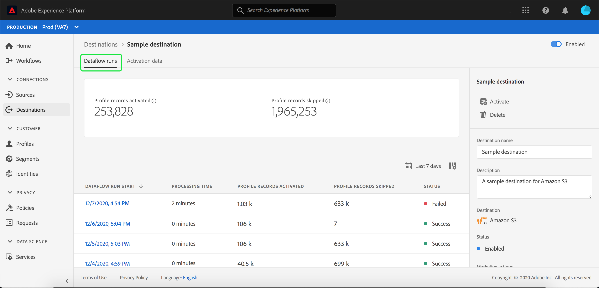

# UIの宛先のデータフローの監視

目的地では、Adobe Experience Platformから数え切れないほどの外部パートナーにデータをアクティブにできます。 このチュートリアルでは、Experience Platform・ユーザー・インタフェースを使用して、宛先のデータ・フローを監視する方法について説明します。

## はじめに

このチュートリアルは、Adobe Experience Platform の次のコンポーネントを実際に利用および理解しているユーザーを対象としています。

- [宛先](../../destinations/home.md):宛先は、一般的に使用されるアプリケーションとの統合が事前に構築されており、チャネル間のマーケティングキャンペーン、電子メールキャンペーン、ターゲットを絞った広告など、様々な用途で、プラットフォームのデータをシームレスにアクティベーションできます。
- [サンドボックス](../../sandboxes/home.md): [!DNL Experience Platform] は、1つの [!DNL Platform] インスタンスを個別の仮想環境に分割し、デジタルエクスペリエンスアプリケーションの開発と発展に役立つ仮想サンドボックスを提供します。

## データフローの監視

プラットフォームUI内の&#x200B;**[!UICONTROL 宛先]**&#x200B;ワークスペースで、「**[!UICONTROL 参照]**」タブに移動し、表示する宛先の名前を選択します。

既存のデータフローのリストが表示されます。 このページには、表示可能なデータ・フローのリストがあります。宛先、ユーザー名、データ・フロー数、ステータスに関する情報が含まれます。

ステータスについて詳しくは、次の表を参照してください。

| ステータス | 説明 |
| ------ | ----------- |
| 有効 | `Enabled`ステータスは、データフローがアクティブであり、提供されたスケジュールに従ってデータを取り込んでいることを示します。 |
| 無効 | `Disabled`ステータスは、データフローが非アクティブで、データを取り込んでいないことを示します。 |
| Processing | `Processing`ステータスは、データフローがまだアクティブでないことを示します。 このステータスは、多くの場合、新しいデータフローの作成直後に発生します。 |
| エラー | `Error`ステータスは、データフローのアクティベーションプロセスが中断されたことを示します。 |

## [!UICONTROL データフローの実行]

[!UICONTROL Dataflow runs]タブは、バッチ宛先に対してデータフローの実行に関する指標データを提供します。 個々の実行とその特定の指標のリストが表示され、プロファイルレコードの以下の合計が示されます。

- **[!UICONTROL アクティブ化されたプロファイルレコード]**:アクティベーション用に作成または更新されたプロファイルレコードの合計数です。
- **[!UICONTROL プロファイルレコードがスキップされました]**:プロファイルEXITまたは欠落した属性に基づいて、アクティベーションでスキップされたプロファイルレコードの合計数です。

>[!NOTE]
>
>データフローの実行は、宛先データフローのスケジュール頻度に基づいて生成されます。 セグメントに適用されたマージ・ポリシーごとに、個別のデータ・フローが実行されます。

特定のデータ・フロー実行の詳細を表示するには、リストから実行の開始時間を選択します。 データフロー実行の詳細ページには、処理されたデータのサイズや、エラー診断の詳細に関するエラーのリストなどの追加情報が含まれます。

