# UI での宛先のデータフローの監視

Experience Platform カタログの様々な宛先を使用して、Experience Platformから無数の外部パートナーにデータをアクティベートします。 Experience Platformでは、データフローの透明性を確保することで、配信先へのデータフローを追跡するプロセスが容易になります。

監視ダッシュボードでは、データフローのジャーニーを視覚的に表現できます。これには、データがアクティベートされる宛先、表示するデータの種類、データフロー実行ごとに書き出されたデータなどが含まれます。

このチュートリアルでは、宛先ワークスペースでデータフローを直接モニタリングする方法や、モニタリングダッシュボードを使用して Experience Platform ユーザーインターフェイスで宛先のデータフローをモニタリングする方法について説明します。

## はじめに {#getting-started}

このガイドは、Adobe Experience Platform の次のコンポーネントを実際に利用および理解しているユーザーを対象としています。

- [ データフロー](../home.md): データフローは、Experience Platform間でデータを移動するデータジョブを表します。 データフローは異なるサービスをまたいで設定され、ソースコネクタからターゲットデータセット、[!DNL Identity] および [!DNL Profile]、[!DNL Destinations] へとデータを移動できます。
   - [データフロー実行](../../sources/notifications.md)：データフロー実行は、選択したデータフローの頻度設定に基づいて繰り返しスケジュールされたジョブです。
- [宛先](../../destinations/home.md)：宛先は、一般的に使用されるアプリケーションとの事前定義済みの統合であり、クロスチャネルマーケティング施策、メールキャンペーン、ターゲット広告などの多くのユースケースで、Experience Platformからのデータをシームレスに活用することができます。
- [ サンドボックス ](../../sandboxes/home.md): [!DNL Experience Platform]には、単一の[!DNL Experience Platform] インスタンスを個別の仮想環境に分割する仮想サンドボックスが用意されており、デジタルエクスペリエンスアプリケーションの開発と進化に役立ちます。

## 宛先ワークスペースでのデータフローの監視 {#monitor-dataflows-in-the-destinations-workspace}

Experience Platform UI内の&#x200B;**[!UICONTROL Destinations]** ワークスペースで、「**[!UICONTROL Browse]**」タブに移動し、表示する宛先の名前を選択します。

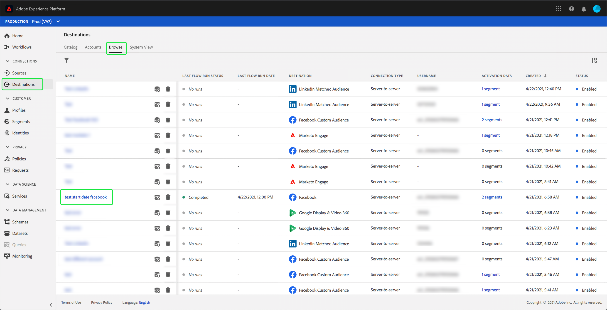

既存のデータフローのリストが表示されます。このページには、宛先、ユーザー名、データフロー数およびステータスに関する情報を含め、表示可能なデータフローがリストされます。

ステータスについて詳しくは、次の表を参照してください。

| ステータス | 説明 |
| ------ | ----------- |
| 有効 | 「`Enabled`」ステータスは、データフローがアクティブで、指定したスケジュールに従ってデータを書き出していることを示します。 |
| 無効 | 「`Disabled`」ステータスは、データフローが非アクティブで、データを書き出していないことを示します。 |
| 処理中 | 「`Processing`」ステータスは、データフローがまだアクティブでないことを示します。 このステータスは、多くの場合、新しいデータフローを作成した直後に発生します。 |
| エラー | 「`Error`」ステータスは、データフローのアクティブ化プロセスが中断されたことを示します。 |

### ストリーミング宛先のデータフロー実行 {#dataflow-runs-for-streaming-destinations}

>[!CONTEXTUALHELP]
>id="platform_monitoring_dataflow_run_details_activation_streaming"
>title="データフロー実行の詳細"
>abstract="宛先データフロー実行の詳細には、オーディエンスのアクティブ化ステータスに関する情報と、一意の ID を生成するリアルタイム顧客プロファイルから取得した指標が含まれます。詳しくは、指標の定義に関するガイドを参照してください。"

>[!CONTEXTUALHELP]
>id="platform_monitoring_profiles_received_streaming"
>title="受信したプロファイル"
>abstract="データフローで受信したプロファイルの合計数です。 この値は 60 分ごとに更新されます。"

>[!CONTEXTUALHELP]
>id="platform_destinations_dataflow_identitiesactivated_streaming"
>title="アクティブ化された ID"
>abstract="選択した宛先に対して正常にアクティブ化された個人プロファイル ID の数。この指標には、書き出されたオーディエンスから作成、更新、削除された ID が含まれます。"

>[!CONTEXTUALHELP]
>id="platform_destinations_dataflow_identitiesexcluded_streaming"
>title="除外された ID"
>abstract="属性の欠如と同意違反に基づいて、選択した宛先のアクティブ化から除外された個人プロファイルレコードの数。"

>[!CONTEXTUALHELP]
>id="platform_destinations_dataflow_identitiesfailed_streaming"
>title="失敗した ID"
>abstract="選択した宛先に対して失敗した個々のプロファイル IDの数。 詳細については、エラー診断を確認してください。"

ストリーミング宛先の場合、「[!UICONTROL Dataflow runs]」タブには、データフロー実行の指標データに対する時間単位の更新が表示されます。 ラベル付けされた最も顕著な統計情報は ID の情報です。

ID は、プロファイルの様々なファセットを表します。例えば、プロファイルに電話番号とメールアドレスの両方が含まれている場合、そのプロファイルには2つのIDがあります。

個々の実行とその特定の指標のリストが、ID の下記の合計数と共に表示されます。

- **[!UICONTROL Identities activated]**：選択した宛先に対して正常にアクティブ化されたプロファイル IDの合計数。 この指標には、書き出されたオーディエンスから作成、更新、削除された ID が含まれます。
- **[!UICONTROL Identities excluded]**：欠落している属性と同意違反に基づいて、アクティブ化のためにスキップされるプロファイル IDの合計数。
- **[!UICONTROL Identities failed]**: エラーが原因で宛先に対してアクティブ化されていないプロファイル IDの合計数。

>[!NOTE]
>
>アクティブ化、除外、失敗したIDの合計は、すべての個々のデータフロー実行数の合計を表します。 データフロー実行の有効期間（TTL）は90日であるため、これらの合計は通常、過去3か月間をカバーしています。 古いデータフローの実行が期限切れになり、システムから削除されると、表示される合計数が減少する場合があります。

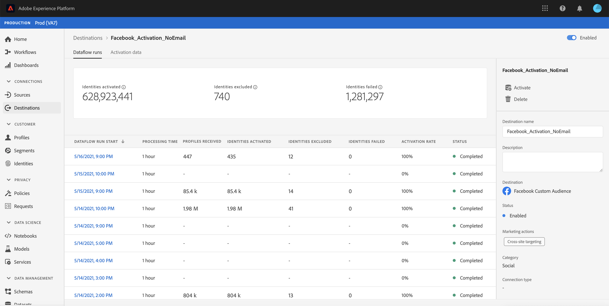

個々のデータフロー実行ごとに、次の詳細が表示されます。

- **[!UICONTROL Dataflow run start]**: データフロー実行が開始された時刻。 ストリーミングデータフロー実行の場合、Experience Platform は、データフロー実行の開始時刻に基づく指標を時間別指標の形式で取得します。つまり、ストリーミングデータフロー実行の場合、データフロー実行が例えば10:30PMで開始された場合、指標は開始時間をUIで10:00 PMとして示します。
- **[!UICONTROL Audience]**：各データフロー実行に関連付けられているオーディエンスの数。
- **[!UICONTROL Processing duration]**: データフロー実行が処理するのにかかる時間。
   - **[!UICONTROL completed]**&#x200B;実行の場合、処理時間指標は常に1時間を示します。
   - まだ&#x200B;**[!UICONTROL processing]**&#x200B;状態にあるデータフロー実行の場合、すべての指標をキャプチャするウィンドウは1時間以上開いたままになり、データフロー実行に対応するすべての指標を処理します。 例えば、午前9:30時に開始したデータフロー実行は、すべての指標を取得して処理するために、処理状態を1時間30分維持する場合があります。 処理時間の長さは、宛先の応答が失敗した結果として行われた再試行によって直接影響を受けます。 次に、処理ウィンドウが閉じ、データフロー実行のステータスが&#x200B;**完了**&#x200B;に更新されると、表示される処理時間が 1 時間に変更されます。
- **[!UICONTROL Profiles received]**: データフローで受信したプロファイルの合計数。
- **[!UICONTROL Identities activated]**: データフロー実行の一環として、選択した宛先に対して正常にアクティブ化されたプロファイル IDの合計数。 この指標には、書き出されたオーディエンスから作成、更新、削除された ID が含まれます。
- **[!UICONTROL Identities excluded]**：欠落している属性と同意違反に基づいてアクティブ化から除外されるプロファイル IDの合計数。
- **[!UICONTROL Identities failed]**: エラーが原因で宛先に対してアクティブ化されていないプロファイル IDの合計数。

  >[!IMPORTANT]
  >
  > 2025年3月から、Adobeでは、ストリーミング宛先のレポート精度を向上させるアップデートを展開しています。 この機能強化により、Experience Platformのレポートと宛先プラットフォームとの間の整合性が向上します。
  >
  > この更新の前に、**[!UICONTROL Identities failed]**&#x200B;にはすべてのアクティブ化再試行が含まれていました。 このアップデートの後、最後のアクティベーションの再試行のみが合計数に含まれます。
  > 
  > この機能強化は、すべてのストリーミング宛先に適用されます。
  > この機能強化に伴い、ストリーミング宛先のユーザーは、**[!UICONTROL Identities failed]**&#x200B;件のカウントが減少する可能性があります。

- **[!UICONTROL Activation rate]**：正常にアクティブ化された受信IDの割合。 次の数式は、この値の計算方法を示しています。
  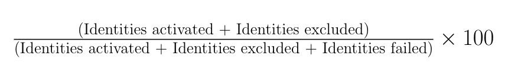
- **[!UICONTROL Status]**: データフローの状態（[!UICONTROL Completed]または[!UICONTROL Processing]）を表します。 [!UICONTROL Completed]は、対応するデータフロー実行のすべてのIDが1時間以内に書き出されたことを意味します。 [!UICONTROL Processing]は、データフロー実行がまだ完了していないことを意味します。

特定のデータフロー実行の詳細を表示するには、実行の開始時刻をリストから選択します。

データフロー実行の詳細ページには、受信したプロファイルの数、アクティブ化された ID の数、失敗した ID の数、除外された ID の数などの、追加の情報が含まれています。

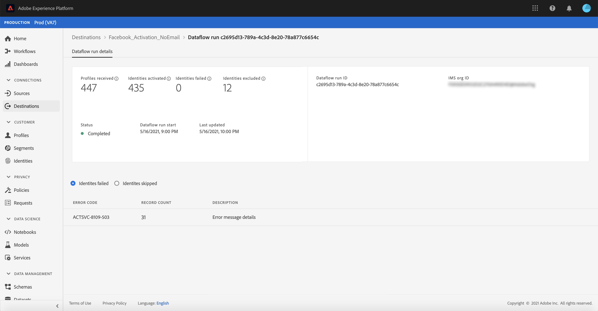

詳細ページには、失敗した ID と除外された ID のリストも表示されます。失敗した ID と除外された ID の両方に関する情報（エラーコード、ID の数、説明など）が表示されます。デフォルトでは、リストには、失敗した ID が表示されます。スキップされたIDを表示するには、**[!UICONTROL Identities excluded]** トグルを選択します。

エラーメッセージがハイライト表示されたストリーミング宛先の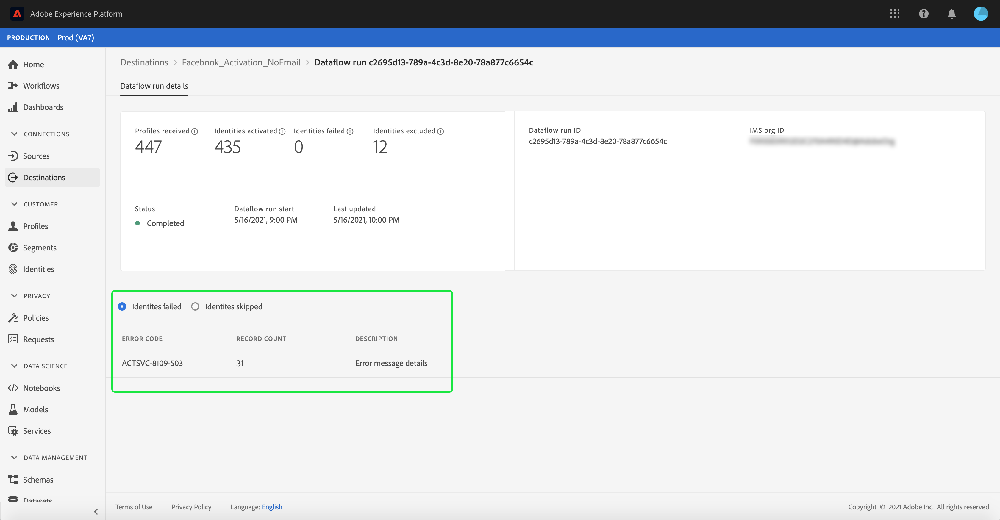

#### ストリーミング宛先のオーディエンスレベルのデータフロー実行モニタリング {#audience-level-dataflow-runs-for-streaming-destinations}

データフローの一部である各オーディエンスについて、アクティベート済みID、除外ID、失敗したIDに関する情報をオーディエンスレベルで表示できます。

ストリーミング宛先のオーディエンスレベルの監視は、特定の宛先でのみ使用できます。 サポートされている宛先のリストについては、[ オーディエンスレベルのビュー](#audience-level-view)の節を参照してください。

ストリーミング宛先の

>[!NOTE]
>
>**[!UICONTROL Profiles received]** タブの&#x200B;**[!UICONTROL Audiences]**&#x200B;番号が、データフロー実行で受信したプロファイル数と必ずしも一致しない場合があります。 これは、特定のプロファイルが、データフロー実行でアクティブ化される複数のオーディエンスの一部である可能性があるためです。

### バッチ宛先のデータフロー実行 {#dataflow-runs-for-batch-destinations}

>[!CONTEXTUALHELP]
>id="platform_monitoring_dataflow_run_details_activation"
>title="データフロー実行の詳細"
>abstract="宛先データフロー実行の詳細には、オーディエンスのアクティブ化ステータスに関する情報と、一意の ID を生成するリアルタイム顧客プロファイルから取得した指標が含まれます。詳しくは、指標の定義に関するガイドを参照してください。"
>additional-url="https://experienceleague.adobe.com/docs/experience-platform/dataflows/ui/monitor-destinations.html?lang=ja#dataflow-runs-for-streaming-destinations" text="ストリーミング宛先のデータフロー実行"

>[!CONTEXTUALHELP]
>id="platform_monitoring_profiles_received_batch"
>title="受信したプロファイル"
>abstract="データフロー実行で受信したプロファイルの合計数。 スケジュールされた書き出しの場合、最新のオーディエンススナップショットのプロファイルと、スナップショットの作成時間と書き出し時間の間にオーディエンスメンバーシップまたはIDが変更されたプロファイルが含まれます。 その結果、この数はオーディエンス内のプロファイル数よりも多くなる可能性があります。"

>[!CONTEXTUALHELP]
>id="platform_destinations_dataflow_identitiesactivated_batch"
>title="アクティブ化された ID"
>abstract="選択した宛先に対して正常にアクティブ化された個人プロファイル ID の数。この指標には、書き出されたオーディエンスから作成、更新、削除された ID が含まれます。"

>[!CONTEXTUALHELP]
>id="platform_destinations_dataflow_identitiesexcluded_batch"
>title="除外された ID"
>abstract="属性の欠如と同意違反に基づいて、選択した宛先のアクティブ化から除外された個人プロファイルレコードの数。"

バッチ宛先の場合、「[!UICONTROL Dataflow runs]」タブには、データフロー実行に関する指標データが表示されます。 個々の実行とその特定の指標のリストが、ID の下記の合計数と共に表示されます。

- **[!UICONTROL Identities activated]**：選択した宛先に対して正常にアクティブ化されたプロファイル IDの合計数。 この指標には、書き出されたオーディエンスから作成、更新、削除された ID が含まれます。
- **[!UICONTROL Identities excluded]**：欠落している属性と同意違反に基づいて、選択した宛先のアクティベーションから除外された個々のプロファイル IDの数。

バッチ宛先の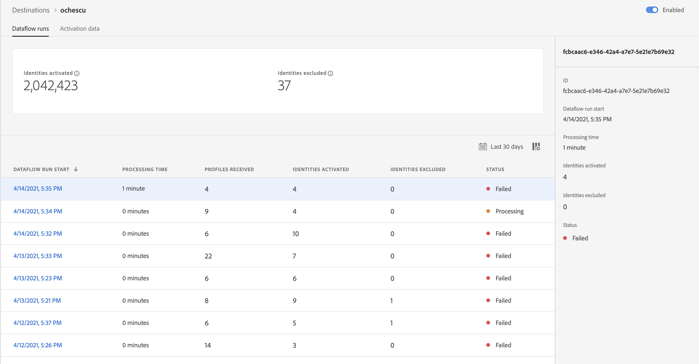

個々のデータフロー実行ごとに、次の詳細が表示されます。

- **[!UICONTROL Dataflow run start]**: データフロー実行が開始された時刻。
- **[!UICONTROL Audience]**：各データフロー実行に関連付けられているオーディエンスの名前。
- **[!UICONTROL Processing duration]**: データフロー実行を処理するのにかかった時間です。
- **[!UICONTROL Profiles received]**: データフローで受信したプロファイルの合計数。 この値は 60 分ごとに更新されます。
- **[!UICONTROL Identities activated]**: データフロー実行の一環として、選択した宛先に対して正常にアクティブ化されたプロファイル IDの合計数。 この指標には、書き出されたオーディエンスから作成、更新、削除された ID が含まれます。
- **[!UICONTROL Identities excluded]**：欠落している属性と同意違反に基づいてアクティブ化から除外されるプロファイル IDの合計数。
- **[!UICONTROL Status]**: データフローの状態を表します。 これは、[!UICONTROL Success]、[!UICONTROL Failed]、[!UICONTROL Processing]の3つの状態のいずれかになります。 [!UICONTROL Success]は、データフローがアクティブであり、指定されたスケジュールに従ってデータを書き出していることを意味します。 [!UICONTROL Failed]は、エラーが原因でデータのアクティブ化が中断されたことを意味します。 [!UICONTROL Processing]は、データフローがまだアクティブではなく、新しいデータフローの作成時に発生するのが一般的であることを意味します。

特定のデータフロー実行の詳細を表示するには、実行の開始時刻をリストから選択します。

>[!NOTE]
>
>データフロー実行は、宛先データフローのスケジュール頻度に基づいて生成されます。 オーディエンスに適用された各[結合ポリシー](../../profile/merge-policies/overview.md)に対して、個別のデータフロー実行が実行されます。

データフローの詳細ページには、データフローリストに表示される詳細に加えて、データフローに関するより具体的な情報も表示されます。

- **[!UICONTROL Size of data]**：書き出されるデータフローのサイズ。
- **[!UICONTROL Total files]**: データフローでエクスポートされたファイルの合計数。
- **[!UICONTROL Last updated]**: データフロー実行が最後に更新された時間。

バッチ宛先の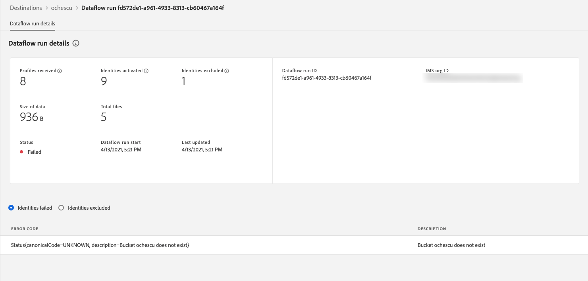

詳細ページには、失敗した ID と除外された ID のリストも表示されます。エラーコードや説明など、失敗した ID と除外された ID の両方に関する情報が表示されます。 デフォルトでは、リストには、失敗した ID が表示されます。除外されたIDを表示するには、**[!UICONTROL Identities excluded]** トグルを選択します。

エラーメッセージがハイライト表示されたバッチ宛先の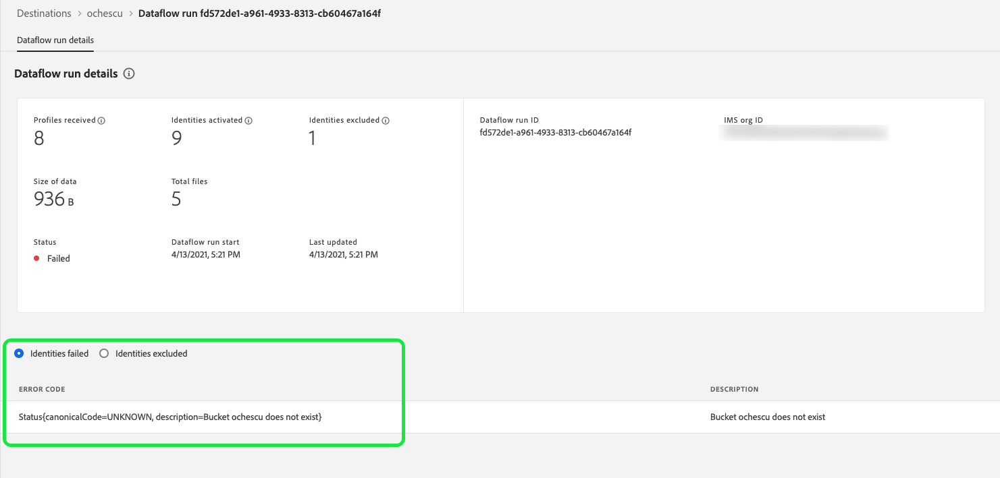

### 監視で表示 {#view-in-monitoring}

また、特定のデータフローとそのデータフローの実行に関する豊富な情報を監視ダッシュボードで表示するように選択することもできます。 監視ダッシュボードでデータフローに関する情報を表示するには：

1. **[!UICONTROL Connections]** > **[!UICONTROL Destinations]** > **[!UICONTROL Browse]** タブに移動します
2. 検査するデータフローに移動します。
3. 省略記号と **[!UICONTROL View in monitoring]**&#x200B;を選択します。

>[!SUCCESS]
>
>データフローと関連するデータフローの実行に関する情報を監視ダッシュボードで表示できるようになりました。 詳しくは、以下の節を参照してください。

## 宛先ダッシュボードの監視 {#monitoring-destinations-dashboard}

>[!NOTE]
>
>宛先モニタリング機能は、現在、[Adobe Target](/help/destinations/catalog/personalization/adobe-target-connection.md) 宛先と[カスタムパーソナライゼーション](/help/destinations/catalog/personalization/custom-personalization.md)宛先を&#x200B;*除く*、Experience Platform 内のすべての宛先でサポートされています。

>[!CONTEXTUALHELP]
>id="platform_monitoring_activation"
>title="アクティブ化"
>abstract="宛先アクティブ化ビューには、オーディエンスのアクティブ化ステータスに関する情報と、一意の ID を生成するリアルタイム顧客プロファイルから取得した指標が含まれます。"

[!UICONTROL Monitoring] ダッシュボードにアクセスするには、左側のナビゲーションで&#x200B;**[!UICONTROL Monitoring]** （）を選択します。 [!UICONTROL Monitoring] ページで「[!UICONTROL Destinations]」を選択します。 [!UICONTROL Monitoring] ダッシュボードには、宛先実行ジョブに関する指標と情報が含まれています。

[!UICONTROL Destinations] ダッシュボードを使用して、アクティベーションフローの健全性を全体的に把握します。 まず、あらゆるバッチおよびストリーミング宛先に関する集計レベルのインサイトを取得し、データフロー、データフロー実行、アクティブ化されたオーディエンスの詳細なビューにドリルダウンして、アクティベーションデータを詳細に分析します。 [!UICONTROL Monitoring] ダッシュボードの画面には、アクティベーションのシナリオで発生する可能性のある問題のトラブルシューティングに役立つ、指標とエラー説明を通じた実用的なインサイトが表示されます。

表示される情報は、顧客、アカウント（Adobe Real-Time CDP B2B editionのみ）、見込み顧客、およびアカウントエンリッチメントのデータタイプでフィルタリングできます。 これらのオプションについて詳しくは、[監視ダッシュボードガイド ](/help/dataflows/ui/monitor.md#monitoring-dashboard-overview)を参照してください。

ダッシュボードの中心には、[!UICONTROL Activation] パネルがあります。このパネルには、ストリーミング宛先に書き出されるデータのアクティベーション率に関するデータと、バッチ宛先に対する失敗したバッチデータフロー実行に関するデータを表示する指標とグラフが含まれています。

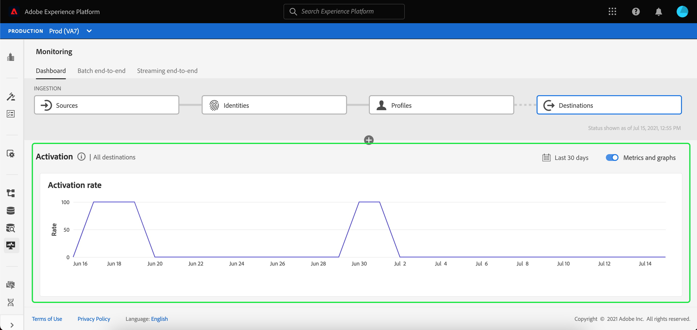

デフォルトでは、表示されるデータには、過去 24 時間のアクティブ化情報が含まれています。 表示されるレコードの時間枠を調整するには、**[!UICONTROL Last 24 hours]**&#x200B;を選択します。 利用できるオプションには、**[!UICONTROL Last 24 hours]**、**[!UICONTROL Last 7 days]**&#x200B;および&#x200B;**[!UICONTROL Last 30 days]**&#x200B;が含まれます。 または、表示されるカレンダーポップアップウィンドウで日付を選択することもできます。 日付を選択したら、**[!UICONTROL Apply]**&#x200B;を選択して、表示される情報の時間枠を調整します。

>[!NOTE]
>
>次のスクリーンショットは、過去 24 時間ではなく、過去 30 日間のアクティブ化率とバッチデータフロー実行を示しています。 **[!UICONTROL Last 30 days]**&#x200B;を選択すると、時間枠を調整できます。

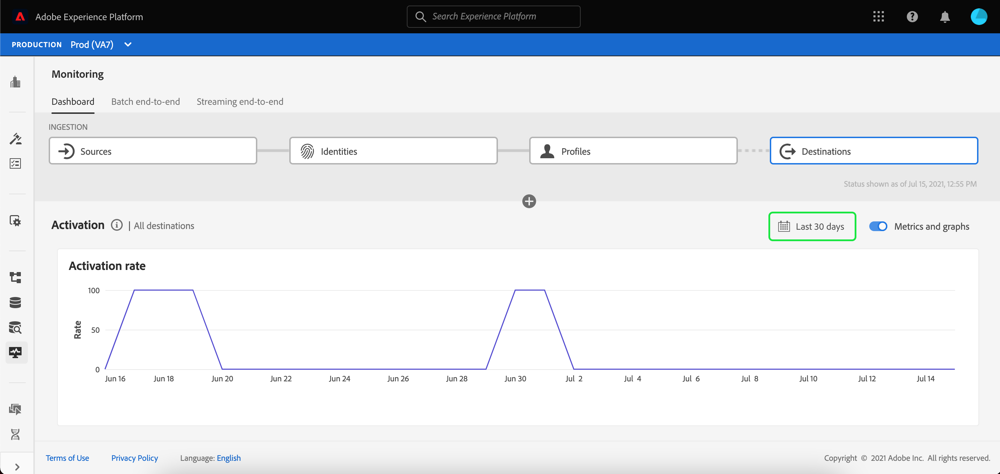

矢印アイコン（）を使用すると、画面上部のカードを展開したり展開解除したりできます。このカードでは、宛先のタイプ（ストリーミングまたはバッチ）に基づいて、アクティブ化の詳細に関する情報を一目で確認できます。

- **[!UICONTROL Streaming activation rate]**：正常にアクティブ化またはスキップされた受信IDの割合を表します。 この割合の計算に使用される数式について詳しくは、このページの[ストリーミング宛先のデータフロー実行](#dataflow-runs-for-streaming-destinations)節を参照してください。
- **[!UICONTROL Batch failed dataflow runs]**：選択した時間間隔で失敗したデータフロー実行の数を表します。

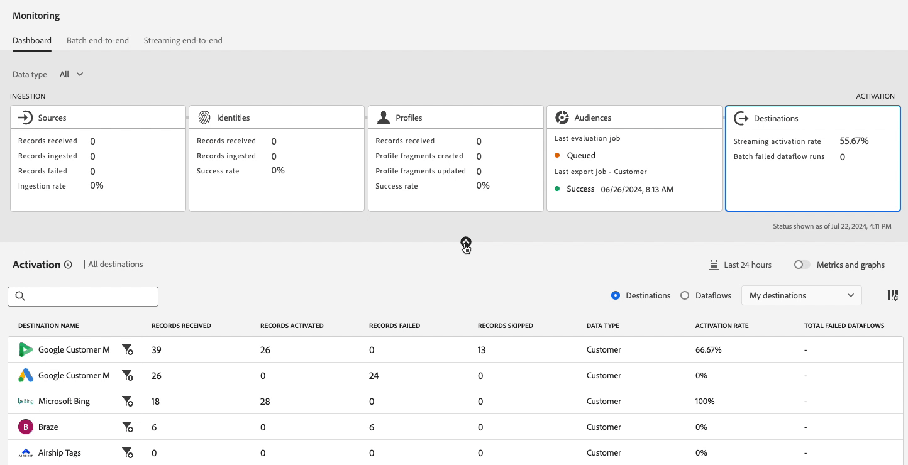

**[!UICONTROL Activation]** グラフはデフォルトで表示され、無効にすると、以下の宛先のリストを展開できます。 グラフを無効にするには、**[!UICONTROL Metrics and graphs]** トグルを選択します。

**[!UICONTROL Activation]** パネルには、少なくとも1つの既存アカウントを含む宛先のリストが表示されます。 このリストには、受信したプロファイル、アクティブ化された ID、失敗した ID、除外された ID、アクティブ化率、失敗したデータフローの合計およびこれらの宛先の最終更新日に関する情報も含まれています。 すべての宛先タイプですべての指標を使用できるわけではありません。 次の表は、宛先タイプごとに使用可能な指標と情報の概要を示しています。

| 指標 | 宛先のタイプ |
|--------------------------------------|-----------------------|
| **[!UICONTROL Records received]** | ストリーミングとバッチ |
| **[!UICONTROL Records activated]** | ストリーミングとバッチ |
| **[!UICONTROL Records failed]** | ストリーミング |
| **[!UICONTROL Records skipped]** | ストリーミングとバッチ |
| **[!UICONTROL Data type]** | ストリーミングとバッチ |
| **[!UICONTROL Activation rate]** | ストリーミング |
| **[!UICONTROL Total failed dataflows]** | バッチ |
| **[!UICONTROL Last updated]** | ストリーミングとバッチ |

{style="table-layout:auto"}

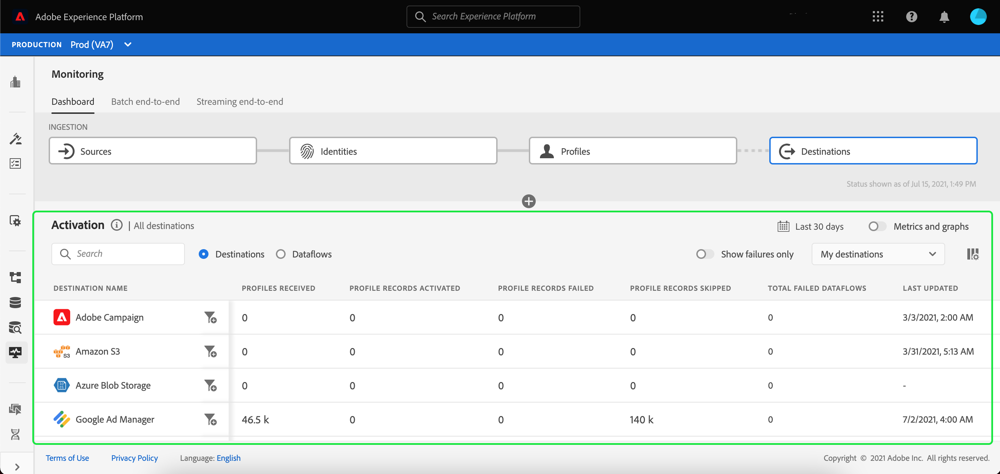

また、宛先のリストをフィルタリングして、選択したカテゴリの宛先のみを表示することもできます。 **[!UICONTROL My destinations]** ドロップダウンを選択し、フィルタリングする[宛先カテゴリ ](/help/destinations/destination-types.md#categories)を選択します。

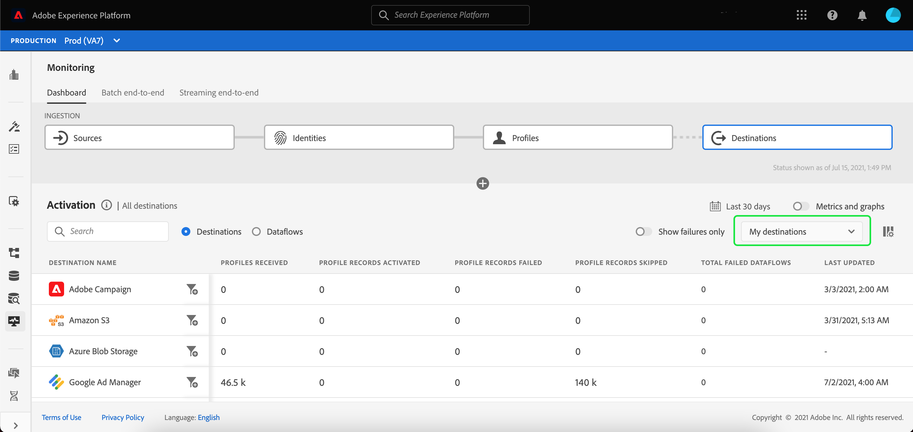

さらに、検索バーに宛先を入力して、1 つの宛先に分離することもできます。宛先のデータフローを表示する場合は、その横にあるフィルター  を選択して、アクティブなデータフローのリストを表示できます。

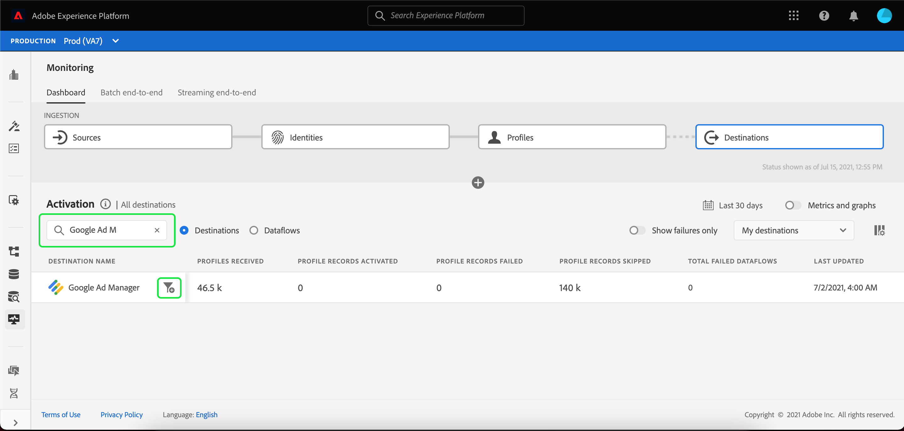

すべての宛先の既存のデータフローをすべて表示する場合は、**[!UICONTROL Dataflows]**&#x200B;を選択します。

データフローのリストが表示され、最後のデータフロー実行で並べ替えられます。監視する宛先を見つけ、その横にあるフィルター  を選択してから、詳細情報が必要なデータフローの横にあるフィルター  を選択すると、特定のデータフローの追加の詳細を表示できます。

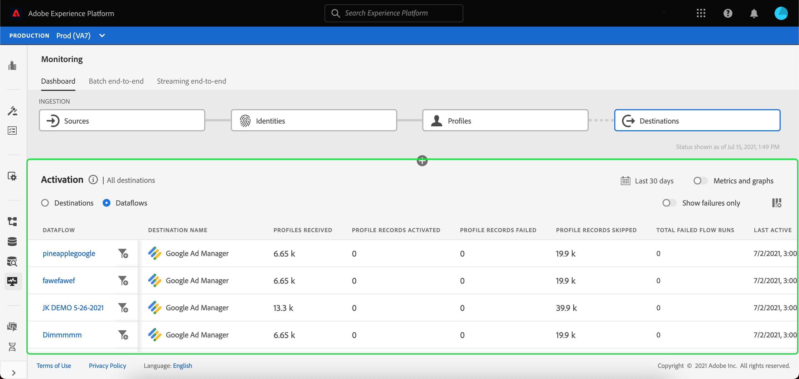

データフローを選択して詳細な調査を行うと、データフローの詳細ページに切り替えスイッチが表示され、データフローの実行またはオーディエンス別に、データフローでアクティブ化されたデータを確認できます。

### データフロー実行ビュー {#dataflow-runs-view}

**[!UICONTROL Dataflow runs]**&#x200B;を選択すると、選択したデータフローのデータフロー実行のリストと、各実行に関する詳細情報が表示されます。

>[!INFO]
>
>ストリーミング宛先へのデータフローの場合、データフロー実行は 1 時間ごとの期間に分類されます。1 時間ごとに、対応するデータフロー実行 ID が生成されます。
>
>バッチ宛先へのデータフローの場合、各オーディエンスには、オーディエンスアクティベーションのスケジュールされた頻度に基づいて、対応するデータフロー実行が生成されます。 例えば、同じ宛先データフロー内の5つのオーディエンスに対して毎日スケジュールされたアクティベーションを設定すると、毎日5つの個別のデータフロー実行が生成されます。

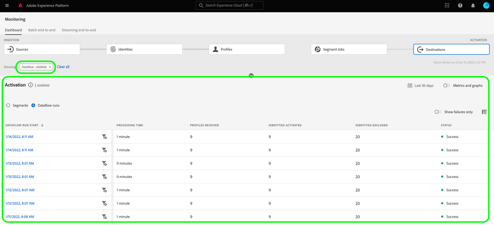

データフローの失敗した実行のみを表示するには、**[!UICONTROL Show failures only]** トグルを使用します。

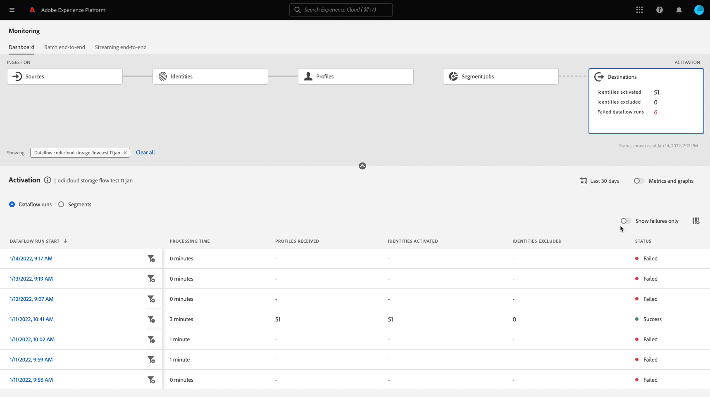

### オーディエンスレベルのビュー {#audience-level-view}

**[!UICONTROL Audiences]**&#x200B;を選択すると、選択した時間範囲内で、選択したデータフローに対してアクティブ化されたオーディエンスのリストが表示されます。 この画面には、アクティブ化されたレコード、除外されたレコード、最後のデータフロー実行のステータスと時間に関するオーディエンスレベルの情報が表示されます。 除外およびアクティブ化されたレコードの指標を確認することで、オーディエンスが正常にアクティブ化されたかどうかを確認できます。

例えば、「Loyalty Members in California」というオーディエンスを、Amazon S3の宛先「Loyalty Members California December」にアクティベートするとします。 選択したオーディエンスに100個のプロファイルがありますが、100個のレコードのうち80個のみがロイヤルティ ID属性を含んでおり、書き出しマッピングルールを`loyalty.id`として定義している必要があると仮定します。 この場合、オーディエンスレベルでは、80件のレコードがアクティブ化され、20件のレコードが除外されます。

>[!IMPORTANT]
>
>オーディエンスレベルの指標に関連する現在の制限事項に注意してください。
>
>- オーディエンスレベルのビューは、現在、以下に示す宛先で使用できます。 ロールアウトはさらなるストリーミング宛先のために計画されています。
>
>   - [[!DNL (API) Oracle Eloqua] 接続](../../destinations/catalog/email-marketing/oracle-eloqua-api.md)
>   - [[!DNL (V2) Marketo Engage]](../../destinations/catalog/adobe/marketo-engage.md)
>   - [[!DNL Airship Attributes]](../../destinations/catalog/mobile-engagement/airship-attributes.md)
>   - [[!DNL Airship Tags]](../../destinations/catalog/mobile-engagement/airship-tags.md)
>   - [[!DNL Amazon Kinesis]](../../destinations/catalog/cloud-storage/amazon-kinesis.md)
>   - [[!DNL Azure Event Hubs]](../../destinations/catalog/cloud-storage/azure-event-hubs.md)
>   - [[!DNL Google Customer Match + Display & Video 360]](../../destinations/catalog/advertising/google-customer-match-dv360.md)
>   - [[!DNL HTTP API]](../../destinations/catalog/streaming/http-destination.md)
>   - [[!DNL HubSpot]](../../destinations/catalog/crm/hubspot.md)
>   - [[!DNL Magnite: Real-time]](../../destinations/catalog/advertising/magnite-streaming.md)
>   - [[!DNL Marketo Engage]](../../destinations/catalog/adobe/marketo-engage.md)
>   - [[!DNL Marketo Engage Person Sync]](../../destinations/catalog/adobe/marketo-engage-person-sync.md)
>   - [[!DNL Microsoft Bing]](../../destinations/catalog/advertising/bing.md)
>   - [[!DNL Microsoft Dynamics 365]](../../destinations/catalog/crm/microsoft-dynamics-365.md)
>   - [[!DNL Moengage]](../../destinations/catalog/mobile-engagement/moengage.md)
>   - [[!DNL Outreach]](../../destinations/catalog/crm/outreach.md)
>   - [[!DNL Pega CDH Realtime Audience (V1)]](../../destinations/catalog/personalization/pega.md)
>   - [[!DNL Pega CDH Realtime Audience (V2)]](../../destinations/catalog/personalization/pega-v2.md)
>   - [[!DNL PubMatic Connect]](../../destinations/catalog/advertising/pubmatic.md)
>   - [[!DNL PubMatic Connect (Custom Audience ID Mapping)]](../../destinations/catalog/advertising/pubmatic.md)
>   - [[!DNL Qualtrics Automations]](../../destinations/catalog/survey/qualtrics-automations.md)
>   - [[!DNL RainFocus Attendee Profiles]](../../destinations/catalog/marketing-automation/rainfocus.md)
>   - [[!DNL Salesforce Marketing Cloud]  （API） ](../../destinations/catalog/email-marketing/salesforce-marketing-cloud.md)
>   - [[!DNL SAP Commerce]](../../destinations/catalog/ecommerce/sap-commerce.md)
>   - [[!DNL Snowflake]](../../destinations/catalog/warehouses/snowflake-batch.md)
>   - [[!DNL The Trade Desk]](../../destinations/catalog/advertising/tradedesk.md)
>   - [[!DNL Yahoo DataX]](../../destinations/catalog/advertising/datax.md)
>   - [[!DNL Zendesk]](../../destinations/catalog/crm/zendesk.md)
>   - バッチ（ファイルベース）の宛先
> 
>- バッチ宛先の場合、現在、オーディエンスレベルの指標は、成功したデータフロー実行についてのみ記録されます。 失敗したデータフロー実行や除外されたレコードでは記録されません。 ストリーミング宛先へのデータフロー実行の場合、指標は取り込まれ、アクティブ化されたレコードと除外されたレコードに表示されます。

データフローパネルでハイライト表示された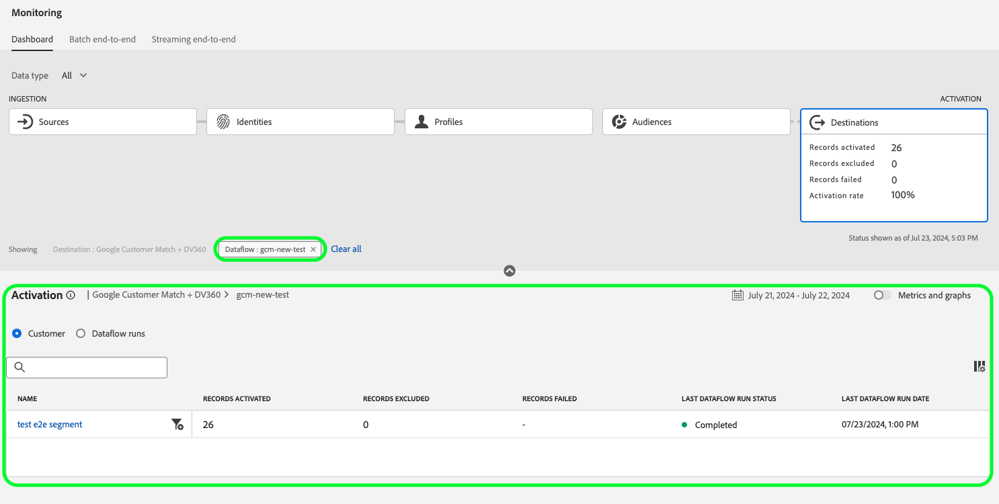

オーディエンスレベルのビューでは、選択した時間範囲内の複数のデータフロー実行にわたって指標が集計されます。 複数のデータフロー実行がある場合は、オーディエンスレベルからドリルダウンして、選択したオーディエンスでフィルタリングされた各データフロー実行の内訳を確認できます。
フィルターボタン を使用して、データフロー内の各オーディエンスのデータフロー実行ビューにドリルダウンします。

### データフロー実行ページ {#dataflow-runs-page}

データフロー実行ページには、データフロー実行の開始時間、処理時間、受信したレコード、アクティブ化されたレコード、除外されたレコード、失敗したレコード、アクティベーション率、ステータスなど、データフロー実行に関する情報が表示されます。

[ オーディエンスレベルのビュー](#audience-level-view)からデータフロー実行ページにドリルダウンすると、次のオプションでデータフロー実行をフィルタリングするオプションがあります。

- **[!UICONTROL Dataflow runs with failed records]**：選択したオーディエンスに対して、このオプションには、アクティブ化に失敗したすべてのデータフロー実行が一覧表示されます。 特定のデータフロー実行のレコードが失敗した理由を調べるには、そのデータフロー実行の[ データフロー実行の詳細ページ ](#dataflow-run-details-page)を参照してください。
- **[!UICONTROL Dataflow runs with excluded records]**：選択したオーディエンスに対して、このオプションには、一部のレコードが完全にアクティブ化されず、一部のプロファイルがスキップされたデータフロー実行がすべて一覧表示されます。 特定のデータフロー実行のレコードがスキップされた理由を調べるには、そのデータフロー実行の[ データフロー実行の詳細ページ ](#dataflow-run-details-page)を参照してください。
- **[!UICONTROL Dataflow runs with activated records]**：選択したオーディエンスに対して、このオプションには、正常にアクティブ化されたレコードを持つすべてのデータフロー実行が一覧表示されます。

特定のデータフロー実行の詳細を表示するには、データフロー実行開始時間の横にあるフィルター  を選択して、データフロー実行の詳細ページを表示します。

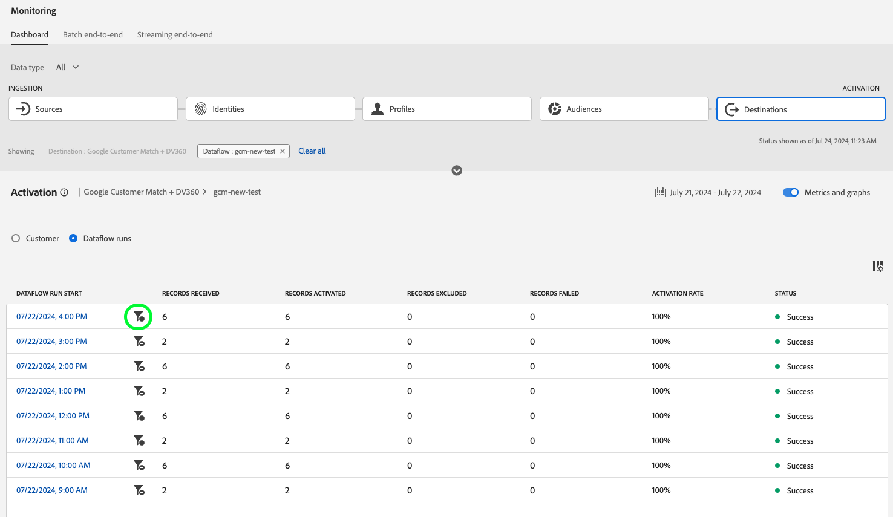

### データフロー実行の詳細ページ {#dataflow-run-details-page}

データフロー実行の詳細ページには、データフロー実行リストに表示される詳細に加えて、データフローに関するより具体的な情報も表示されます。

- **[!UICONTROL Dataflow run ID]**: データフローのID。
- **[!UICONTROL IMS org ID]**: データフローが属する組織。
- **[!UICONTROL Last updated]**: データフロー実行が最後に更新された時間。

詳細ページには、データフロー実行エラーとオーディエンスを切り替える切替スイッチもあります。 このオプションは、[ オーディエンスレベルのビュー](#audience-level-view) セクションに記載されている宛先に対して使用できます。

データフロー実行エラービューには、失敗したレコードとスキップされたレコードのリストが表示されます。 失敗したレコードとスキップしたレコードの両方の情報（エラーコード、ID数、説明など）が表示されます。 デフォルトでは、失敗したレコードがリストに表示されます。 スキップされたレコードを表示するには、**[!UICONTROL Records skipped]** トグルを選択します。

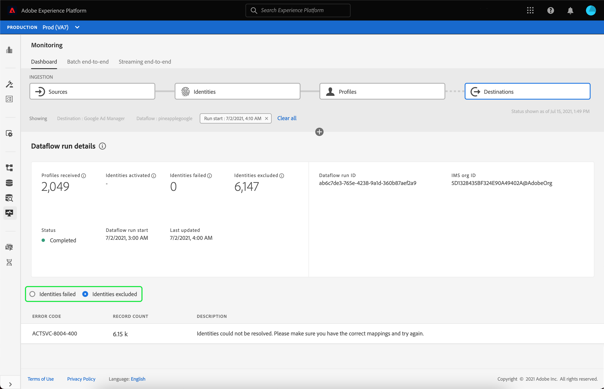

**[!UICONTROL Audiences]**&#x200B;を選択すると、選択したデータフロー実行でアクティブ化されたオーディエンスのリストが表示されます。 この画面には、アクティブ化されたレコード、除外されたレコード、最後のデータフロー実行のステータスと時間に関するオーディエンスレベルの情報が表示されます。

データフロー実行の詳細画面の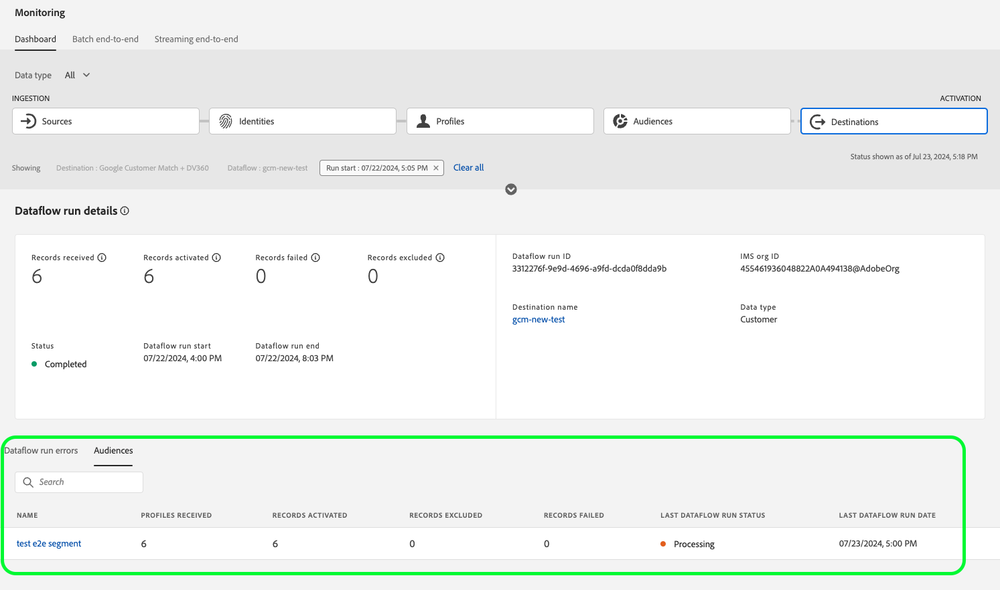

## 次の手順 {#next-steps}

このガイドを通じて、処理時間、アクティブ化率、ステータスなどのすべての関連情報を含め、バッチ宛先とストリーミング宛先の両方のデータフローを監視する方法を理解できました。Experience Platformのデータフローについて詳しくは、[ データフローの概要](../home.md)を参照してください。 宛先について詳しくは、[宛先の概要](../../destinations/home.md)を参照してください。