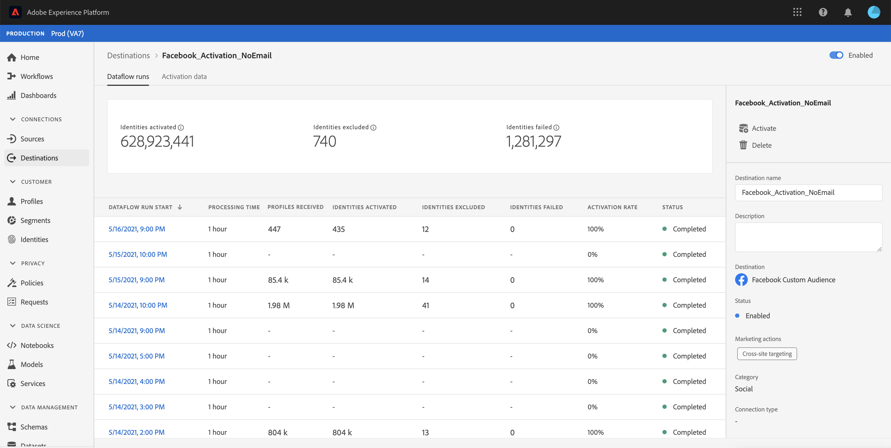
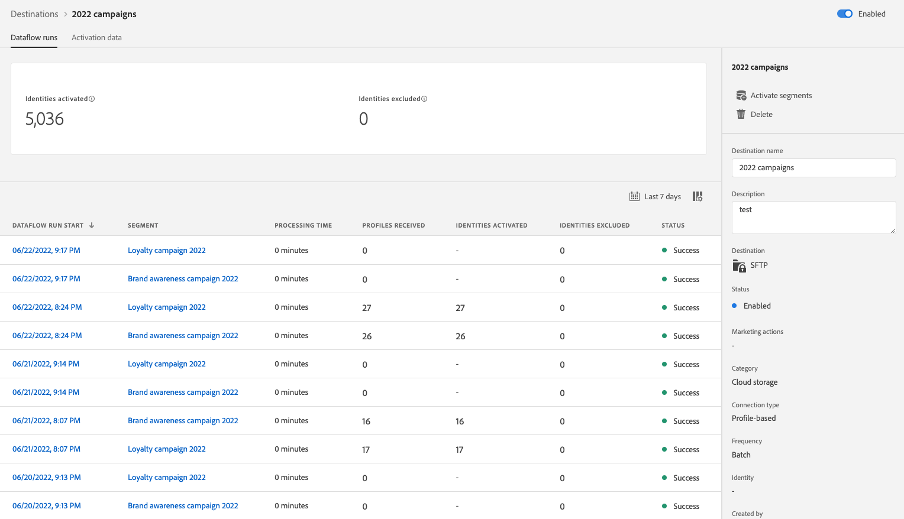

# UI での宛先のデータフローの監視

宛先を使用すると、Adobe Experience Platform から無数の外部パートナーに対してデータをアクティブ化できます。Platform では、データフローの透明性を提供することで、宛先へのデータフローの追跡プロセスを容易にします。

監視ダッシュボードは、データがアクティブ化される宛先を含め、データフローのジャーニーを視覚的に表します。 このチュートリアルでは、宛先ワークスペースでデータフローを直接監視する方法や、監視ダッシュボードを使用して Experience Platform ユーザーインターフェイスで宛先のデータフローを監視する方法について説明します。

## はじめに {#getting-started}

このガイドでは、Adobe Experience Platform の次のコンポーネントに関する十分な知識が必要です。

- [データフロー](../home.md)：データフローは、Platform 間でデータを移動するデータジョブを表します。データフローは異なるサービスをまたいで設定され、ソースコネクタからターゲットデータセット、[!DNL Identity] および [!DNL Profile]、[!DNL Destinations] へとデータを移動できます。
   - [データフロー実行](../../sources/notifications.md)：データフロー実行は、選択したデータフローの頻度設定に基づいて繰り返しスケジュールされたジョブです。
- [宛先](../../destinations/home.md)：宛先は、一般に使用されるアプリケーションとの事前定義済みの統合で、これを使用すると、Platform のデータをシームレスにアクティブ化してクロスチャネルマーケティングキャンペーン、メールキャンペーン、ターゲット広告およびその他の多くのユースケースを実現できます。
- [サンドボックス](../../sandboxes/home.md)：[!DNL Experience Platform] には、単一の [!DNL Platform] インスタンスを別個の仮想環境に分割してデジタルエクスペリエンスアプリケーションの開発と発展を支援する仮想サンドボックスが用意されています。

## 宛先ワークスペースでのデータフローの監視 {#monitor-dataflows-in-the-destinations-workspace}

Platform UI 内の&#x200B;**[!UICONTROL 宛先]**&#x200B;ワークスペースで、「**[!UICONTROL 参照]**」タブに移動し、表示する宛先の名前を選択します。

既存のデータフローのリストが表示されます。このページには、宛先、ユーザー名、データフロー数およびステータスに関する情報を含め、表示可能なデータフローがリストされます。

ステータスについて詳しくは、次の表を参照してください。

| ステータス | 説明 |
| ------ | ----------- |
| 有効 | 「`Enabled`」ステータスは、データフローがアクティブで、指定したスケジュールに従ってデータを書き出していることを示します。 |
| 無効 | 「`Disabled`」ステータスは、データフローが非アクティブで、データを書き出していないことを示します。 |
| 処理中 | 「`Processing`」ステータスは、データフローがまだアクティブでないことを示します。 このステータスは、多くの場合、新しいデータフローを作成した直後に発生します。 |
| エラー | 「`Error`」ステータスは、データフローのアクティブ化プロセスが中断されたことを示します。 |

### ストリーミング宛先のデータフロー実行 {#dataflow-runs-for-streaming-destinations}

>[!CONTEXTUALHELP]
>id="platform_monitoring_dataflow_run_details_activation_streaming"
>title="データフロー実行の詳細"
>abstract="宛先データフロー実行の詳細には、セグメントのアクティブ化ステータスに関する情報と、一意の ID を生成するためにリアルタイム顧客プロファイルから取得した指標が含まれています。詳しくは、指標の定義に関するガイドを参照してください。"

>[!CONTEXTUALHELP]
>id="platform_monitoring_profiles_received_streaming"
>title="受信したプロファイル"
>abstract="データフローで受信したプロファイルの合計数です。 この値は 60 分ごとに更新されます。"

>[!CONTEXTUALHELP]
>id="platform_destinations_dataflow_identitiesactivated_streaming"
>title="アクティブ化された ID"
>abstract="選択した宛先に対して正常にアクティブ化された個人プロファイル ID の数。この指標には、書き出されたセグメントで作成、更新および削除された ID が含まれます。"

>[!CONTEXTUALHELP]
>id="platform_destinations_dataflow_identitiesexcluded_streaming"
>title="除外された ID"
>abstract="属性の欠如と同意違反に基づいて、選択した宛先のアクティブ化から除外された個人プロファイルレコードの数。"

>[!CONTEXTUALHELP]
>id="platform_destinations_dataflow_identitiesfailed_streaming"
>title="失敗した ID"
>abstract="選択した宛先に対して失敗した個人プロファイル ID の数。詳しくは、エラー診断を確認してください。"

ストリーミング宛先の場合、「[!UICONTROL データフロー実行]」タブには、データフロー実行に関する指標データの 1 時間ごとの更新が表示されます。 ラベル付けされた最も顕著な統計情報は ID の情報です。

ID は、プロファイルの様々なファセットを表します。例えば、プロファイルに電話番号とメールアドレスの両方が含まれている場合、そのプロファイルには 2 つの ID が含まれます。

個々の実行とその特定の指標のリストが、ID の下記の合計数と共に表示されます。

- **[!UICONTROL アクティブ化された ID]**：選択した宛先に対して正常にアクティブ化されたプロファイル ID の合計数です。この指標には、書き出されたセグメントで作成、更新および削除された ID が含まれます。
- **[!UICONTROL 除外された ID]**：属性の欠如と同意違反に基づいてアクティブ化の対象からスキップされたプロファイル ID の合計数です。
- **[!UICONTROL 失敗した ID]**：エラーが原因で宛先に対してアクティブ化されなかったプロファイル ID の合計数です。

個々のデータフロー実行ごとに、次の詳細が表示されます。

- **[!UICONTROL データフロー実行開始]**：データフロー実行が開始された時刻です。ストリーミングデータフロー実行の場合、Experience Platform は、データフロー実行の開始時刻に基づく指標を時間別指標の形式で取得します。ストリーミングデータフロー実行の場合、データフロー実行が例えば午後 10:30 に開始した場合、UI では、この指標は開始時刻が午後 10:00 と表示されます。
- **[!UICONTROL 処理時間]**：データフロー実行が処理されるまでにかかった時間です。
   - **[!UICONTROL 完了]**&#x200B;した実行の場合、処理時間指標には常に 1 時間と表示されます。
   - まだ&#x200B;**[!UICONTROL 処理中]**&#x200B;状態のデータフロー実行の場合、データフロー実行に対応するすべての指標を処理するために、すべての指標を取得するウィンドウが 1 時間以上開いたままになります。例えば、午前 9:30 に開始したデータフロー実行が、すべての指標を取得して処理するために、1 時間 30 分間処理状態のままになるといった場合です。 次に、処理ウィンドウが閉じ、データフロー実行のステータスが&#x200B;**完了**&#x200B;に更新されると、表示される処理時間が 1 時間に変更されます。
- **[!UICONTROL 受信したプロファイル]**：データフローで受信したプロファイルの合計数です。
- **[!UICONTROL アクティブ化された ID]**：データフロー実行の一環として、選択した宛先に対して正常にアクティブ化されたプロファイル ID の合計数です。この指標には、書き出されたセグメントで作成、更新および削除された ID が含まれます。
- **[!UICONTROL 除外された ID]**：属性の欠如と同意違反に基づいてアクティブ化から除外されたプロファイル ID の合計数です。
- **[!UICONTROL 失敗した ID]**：エラーが原因で宛先に対してアクティブ化されなかったプロファイル ID の合計数です。
- **[!UICONTROL アクティブ化率]**：正常にアクティブ化されたかスキップされた受信 ID の割合です。次の数式は、この値の計算方法を示しています。
   
- **[!UICONTROL ステータス]**：データフローの状態（[!UICONTROL 完了]または[!UICONTROL 処理中]）を表します。[!UICONTROL 完了]は、対応するデータフロー実行のすべての ID が 1 時間以内に書き出されたことを意味します。[!UICONTROL 処理中]は、データフロー実行がまだ終了していないことを意味します。

特定のデータフロー実行の詳細を表示するには、実行の開始時刻をリストから選択します。

データフロー実行の詳細ページには、受信したプロファイルの数、アクティブ化された ID の数、失敗した ID の数、除外された ID の数などの、追加の情報が含まれています。

詳細ページには、失敗した ID と除外された ID のリストも表示されます。失敗した ID と除外された ID の両方に関する情報（エラーコード、ID の数、説明など）が表示されます。デフォルトでは、リストには、失敗した ID が表示されます。スキップされた ID を表示するには、「**[!UICONTROL 除外された ID]**」切替スイッチを選択します。

### バッチ宛先のデータフロー実行 {#dataflow-runs-for-batch-destinations}

>[!CONTEXTUALHELP]
>id="platform_monitoring_dataflow_run_details_activation"
>title="データフロー実行の詳細"
>abstract="宛先データフロー実行の詳細には、セグメントのアクティブ化ステータスに関する情報と、一意の ID を生成するためにリアルタイム顧客プロファイルから取得した指標が含まれています。詳しくは、指標の定義に関するガイドを参照してください。"
>additional-url="https://experienceleague.adobe.com/docs/experience-platform/dataflows/ui/monitor-destinations.html?lang=ja#dataflow-runs-for-streaming-destinations" text="ストリーミング宛先のデータフロー実行"

>[!CONTEXTUALHELP]
>id="platform_monitoring_profiles_received_batch"
>title="受信したプロファイル"
>abstract="データフローで受信したプロファイルの合計数です。 この値は 60 分ごとに更新されます。"

>[!CONTEXTUALHELP]
>id="platform_destinations_dataflow_identitiesactivated_batch"
>title="アクティブ化された ID"
>abstract="選択した宛先に対して正常にアクティブ化された個人プロファイル ID の数。この指標には、書き出されたセグメントで作成、更新および削除された ID が含まれます。"

>[!CONTEXTUALHELP]
>id="platform_destinations_dataflow_identitiesexcluded_batch"
>title="除外された ID"
>abstract="属性の欠如と同意違反に基づいて、選択した宛先のアクティブ化から除外された個人プロファイルレコードの数。"

バッチ宛先の場合、「[!UICONTROL データフロー実行]」タブには、データフロー実行に関する指標データが表示されます。個々の実行とその特定の指標のリストが、ID の下記の合計数と共に表示されます。

- **[!UICONTROL アクティブ化された ID]**：選択した宛先に対して正常にアクティブ化されたプロファイル ID の合計数です。 この指標には、書き出されたセグメントで作成、更新および削除された ID が含まれます。
- **[!UICONTROL 除外された ID]**：属性の欠如と同意違反に基づいて、選択した宛先のアクティブ化から除外された個人プロファイル ID の数です。

個々のデータフロー実行ごとに、次の詳細が表示されます。

- **[!UICONTROL データフロー実行開始]**：データフロー実行が開始された時刻です。
- **[!UICONTROL セグメント]**：各データフロー実行に関連付けられたセグメントの名前です。
- **[!UICONTROL 処理時間]**：データフロー実行が処理されるまでにかかった時間です。
- **[!UICONTROL 受信したプロファイル]**：データフローで受信したプロファイルの合計数です。 この値は 60 分ごとに更新されます。
- **[!UICONTROL アクティブ化された ID]**：データフロー実行の一環として、選択した宛先に対して正常にアクティブ化されたプロファイル ID の合計数です。この指標には、書き出されたセグメントで作成、更新および削除された ID が含まれます。
- **[!UICONTROL 除外された ID]**：属性の欠如と同意違反に基づいてアクティブ化から除外されたプロファイル ID の合計数です。
- **[!UICONTROL ステータス]**：データフローの状態を表します。これは、[!UICONTROL 成功]、[!UICONTROL 失敗]、[!UICONTROL 処理中]の 3 つの状態のいずれかです。[!UICONTROL 成功]は、データフローがアクティブで、指定したスケジュールに従ってデータを書き出していることを意味します。[!UICONTROL 失敗]は、エラーが原因でデータのアクティブ化が中断されたことを意味します。 [!UICONTROL 処理中]は、データフローがまだアクティブでないことを意味し、通常、新しいデータフローの作成時に発生します。

特定のデータフロー実行の詳細を表示するには、実行の開始時刻をリストから選択します。

>[!NOTE]
>
>データフロー実行は、宛先データフローのスケジュール頻度に基づいて生成されます。 セグメントに適用される[結合ポリシー](../../profile/merge-policies/overview.md)ごとに、別個のデータフロー実行が行われます。

データフローの詳細ページには、データフローリストに表示される詳細に加えて、データフローに関するより具体的な情報も表示されます。

- **[!UICONTROL データのサイズ]**：書き出されるデータフローのサイズです。
- **[!UICONTROL 合計ファイル数]**：データフローで書き出されたファイルの合計数です。
- **[!UICONTROL 最終更新日時]**：データフロー実行が最後に更新された時刻。

詳細ページには、失敗した ID と除外された ID のリストも表示されます。エラーコードや説明など、失敗した ID と除外された ID の両方に関する情報が表示されます。 デフォルトでは、リストには、失敗した ID が表示されます。除外された ID を表示するには、「**[!UICONTROL 除外された ID]**」切替スイッチを選択します。

## 宛先監視ダッシュボード {#monitoring-destinations-dashboard}

>[!NOTE]
>
>- 宛先モニタリング機能は、現在、[Adobe Target](/help/destinations/catalog/personalization/adobe-target-connection.md) 宛先と[カスタムパーソナライゼーション](/help/destinations/catalog/personalization/custom-personalization.md)宛先を&#x200B;*除く*、Experience Platform 内のすべての宛先でサポートされています。
>- [Amazon Kinesis](/help/destinations/catalog/cloud-storage/amazon-kinesis.md) 宛先、[Azure Event Hubs](/help/destinations/catalog/cloud-storage/azure-event-hubs.md) 宛先および [HTTP API](/help/destinations/catalog/streaming/http-destination.md) 宛先については、除外された ID、失敗した ID およびアクティブ化された ID は現在表示されません。

>[!CONTEXTUALHELP]
>id="platform_monitoring_activation"
>title="アクティブ化"
>abstract="宛先アクティブ化ビューには、セグメントのアクティブ化ステータスに関する情報と、一意の ID を生成するためにリアルタイム顧客プロファイルから取得された指標が表示されます。"

[!UICONTROL モニタリング]ダッシュボードにアクセスするには、左側のナビゲーションで「**[!UICONTROL モニタリング]**」（）を選択します。 [!UICONTROL モニタリング]ページで「[!UICONTROL 宛先]」を選択します。 [!UICONTROL モニタリング]ダッシュボードには、宛先実行ジョブに関する指標と情報が含まれています。

[!UICONTROL 宛先]ダッシュボードを使用すると、アクティブ化フローの正常性を全体的に把握できます。 まず、すべてのバッチ宛先とストリーミング宛先について集計レベルでインサイトを取得し、データフロー、データフロー実行およびアクティブ化されたセグメントの詳細ビューにドリルダウンして、アクティブ化データを詳しく調べます。[!UICONTROL モニタリング]ダッシュボードの画面では、指標やエラーの説明を通じて実用的なインサイトが提供され、アクティブ化シナリオで発生する可能性のある問題のトラブルシューティングに役立ちます。

ダッシュボードの中央にある[!UICONTROL アクティブ化]パネルには、ストリーミング宛先に書き出されたデータのアクティブ化率に関するデータと、バッチ宛先に対する失敗したバッチデータフロー実行に関するデータを表示する指標とグラフが表示されます。

デフォルトでは、表示されるデータには、過去 24 時間のアクティブ化情報が含まれています。 「**[!UICONTROL 過去 24 時間]**」を選択すると、表示されるレコードの時間枠を調整できます。 利用可能なオプションには、「**[!UICONTROL 過去 24 時間]**」、「**[!UICONTROL 過去 7 日間]**」および「**[!UICONTROL 過去 30 日間]**」があります。 または、表示されるカレンダーポップアップウィンドウで日付を選択することもできます。 日付を選択したら、「**[!UICONTROL 適用]**」を選択して、表示される情報の時間枠を調整できます。

>[!NOTE]
>
>次のスクリーンショットは、過去 24 時間ではなく、過去 30 日間のアクティブ化率とバッチデータフロー実行を示しています。 「**[!UICONTROL 過去 30 日間]**」を選択して、時間枠を調整できます。

矢印アイコン（）を使用すると、画面上部のカードを展開したり展開解除したりできます。このカードでは、宛先のタイプ（ストリーミングまたはバッチ）に基づいて、アクティブ化の詳細に関する情報を一目で確認できます。

- **[!UICONTROL ストリーミングのアクティブ化率]**：正常にアクティブ化またはスキップされた受信 ID の割合を表します。この割合の計算に使用される数式について詳しくは、このページの[ストリーミング宛先のデータフロー実行](#dataflow-runs-for-streaming-destinations)節を参照してください。
- **[!UICONTROL 失敗したデータフロー実行のバッチ]**：選択した時間枠での失敗したデータフロー実行の数を表します。

**[!UICONTROL アクティブ化]**&#x200B;グラフはデフォルトで表示されますが、これを無効にして、以下の宛先リストを展開することができます。グラフを無効にするには、「**[!UICONTROL 指標とグラフ]**」切替スイッチを選択します。

**[!UICONTROL アクティブ化]**&#x200B;パネルには、1 つ以上の既存のアカウントを含んだ宛先のリストが表示されます。 このリストには、受信したプロファイル、アクティブ化された ID、失敗した ID、除外された ID、アクティブ化率、失敗したデータフローの合計およびこれらの宛先の最終更新日に関する情報も含まれています。 すべての宛先タイプですべての指標を使用できるわけではありません。 宛先のタイプ（ストリーミングまたはバッチ）ごとに使用可能な指標の概要を次の表に示します。

| 指標 | 宛先のタイプ |
---------|----------|
| **[!UICONTROL 受信したプロファイル]** | ストリーミングとバッチ |
| **[!UICONTROL アクティブ化された ID]** | ストリーミングとバッチ |
| **[!UICONTROL 失敗した ID]** | ストリーミング |
| **[!UICONTROL 除外された ID]** | ストリーミングとバッチ |
| **[!UICONTROL アクティブ化率]** | ストリーミング |
| **[!UICONTROL 失敗したデータフローの合計]** | バッチ |
| **[!UICONTROL 最終更新日]** | ストリーミングとバッチ |

また、宛先のリストをフィルタリングして、選択したカテゴリの宛先のみを表示することもできます。 **[!UICONTROL 宛先]**&#x200B;ドロップダウンを選択し、フィルタリングする[宛先カテゴリ](/help/destinations/destination-types.md#categories)を選択します。

さらに、検索バーに宛先を入力して、1 つの宛先に分離することもできます。宛先のデータフローを表示する場合は、その横にあるフィルター  を選択して、アクティブなデータフローのリストを表示できます。

すべての宛先の既存のデータフローをすべて表示する場合は、「**[!UICONTROL データフロー]**」を選択します。

データフローのリストが表示され、最後のデータフロー実行で並べ替えられます。監視する宛先を見つけ、その横にあるフィルター  を選択してから、詳細情報が必要なデータフローの横にあるフィルター  を選択すると、特定のデータフローの追加の詳細を表示できます。

さらに調査するデータフローを選択すると、データフローの詳細ページには、データフロー内のアクティブ化されたデータをデータフロー実行またはセグメント別に分類して表示できる切替スイッチが含まれています。

### データフロー実行ビュー {#dataflow-runs-view}

「**[!UICONTROL データフロー実行]**」が選択されている場合は、選択したデータフローのデータフロー実行のリストと、各実行に関する詳細が表示されます。

>[!INFO]
>
>ストリーミング宛先へのデータフローの場合、データフロー実行は 1 時間ごとの期間に分類されます。1 時間ごとに、対応するデータフロー実行 ID が生成されます。
>
>バッチ宛先へのデータフローの場合、各セグメントには、スケジュールされたセグメントアクティブ化頻度に基づいて、対応するデータフロー実行が生成されます。 例えば、同じ宛先データフロー内の 5 つのセグメントに対して、毎日スケジュールされたアクティブ化を設定した場合、毎日 5 つの個別のデータフロー実行が生成されます。

「**[!UICONTROL 失敗のみを表示]**」切替スイッチを使用すると、データフローの失敗した実行のみを表示できます。

### セグメントレベルビュー {#segment-level-view}

「**[!UICONTROL セグメント]**」が選択されている場合は、選択した時間範囲内に、選択したデータフローに対してアクティブ化されたセグメントのリストが表示されます。この画面には、アクティブ化された ID、除外された ID、最後のデータフロー実行のステータスと時刻に関するセグメントレベルの情報が含まれます。除外された ID とアクティブ化された ID の指標をレビューすることで、セグメントが正常にアクティブ化されたかどうかを確認できます。

例えば、「Loyalty Members in California」というセグメントを Amazon S3 宛先「Loyalty Members California December」にアクティブ化するとします。 選択したセグメントに 100 個のプロファイルがあり、100 個中 80 個のプロファイルのみがロイヤルティ ID 属性を含んでおり、`loyalty.id` が必要なので書き出しマッピングルールを定義したとします。この場合、セグメントレベルでは、80 個の ID がアクティブ化され、20 個の ID が除外されます。

>[!IMPORTANT]
>
>セグメントレベルの指標に関する現在の制限事項に注意してください。
>- セグメントレベルビューは、現在、バッチ宛先でのみ使用できます。
>- セグメントレベルの指標は、現在、正常なデータフロー実行の場合にのみ記録されます。 失敗したデータフロー実行や除外されたレコードに対しては、記録されません。

セグメントレベルビューでは、指標は、選択した時間範囲内の複数のデータフロー実行にわたって集計されます。 複数のデータフロー実行がある場合、セグメントレベルからドリルダウンして、データフロー実行ごとの分類を、選択したセグメントでフィルタリングした結果を表示できます。
フィルターボタン  を使用すると、データフロー内の各セグメントのデータフロー実行ビューにドリルダウンできます。

### データフロー実行ページ {#dataflow-runs-page}

データフロー実行ページには、データフローの実行開始時間、処理時間、受信したプロファイル、アクティブ化された ID、除外された ID、失敗した ID、アクティブ化率、ステータスなど、データフロー実行に関する情報が表示されます。

[セグメントレベルビュー](#segment-level-view)からデータフロー実行ページにドリルダウンすると、次のオプションでデータフロー実行をフィルタリングすることができます。

- **[!UICONTROL ID が失敗したデータフロー実行]**：選択したセグメントに対して、このオプションは、アクティブ化に失敗したすべてのデータフロー実行をリストします。特定のデータフロー実行内の ID が失敗した理由を調べるには、そのデータフロー実行の[データフロー実行の詳細ページ](#dataflow-run-details-page)を参照してください。
- **[!UICONTROL ID がスキップされたデータフロー実行]**：選択したセグメントに対して、このオプションは、一部の ID が完全にはアクティブ化されておらず、一部のプロファイルがスキップされた、すべてのデータフロー実行をリストします。 特定のデータフロー実行内の ID がスキップされた理由を調べるには、そのデータフロー実行の[データフロー実行の詳細ページ](#dataflow-run-details-page)を参照してください。
- **[!UICONTROL ID がアクティブ化されたデータフロー実行]**：選択したセグメントに対して、このオプションは、正常にアクティブ化された ID を持つすべてのデータフロー実行をリストします。

特定のデータフロー実行の詳細を表示するには、データフロー実行開始時間の横にあるフィルター  を選択して、データフロー実行の詳細ページを表示します。

### データフロー実行の詳細ページ {#dataflow-run-details-page}

データフロー実行の詳細ページには、データフロー実行リストに表示される詳細に加えて、データフローに関するより具体的な情報も表示されます。

- **[!UICONTROL データフロー実行 ID]**：データフローの ID です。
- **[!UICONTROL IMS 組織 ID]**：データフローが属する IMS 組織です。
- **[!UICONTROL 最終更新日時]**：データフロー実行が最後に更新された時刻です。

詳細ページには、データフロー実行エラーとセグメントを切り替える切替スイッチもあります。このオプションは、バッチ宛先でのデータフロー実行に対してのみ使用できます。

データフロー実行エラービューには、失敗した ID と除外された ID のリストが表示されます。 失敗した ID と除外された ID の両方に関する情報（エラーコード、ID の数、説明など）が表示されます。デフォルトでは、リストには、失敗した ID が表示されます。スキップされた ID を表示するには、「**[!UICONTROL 除外された ID]**」切替スイッチを選択します。

**[!UICONTROL セグメント]**&#x200B;が選択されている場合、選択したデータフロー実行でアクティブ化されたセグメントのリストが表示されます。 この画面には、アクティブ化された ID、除外された ID、最後のデータフロー実行のステータスと時刻に関するセグメントレベルの情報が含まれます。

## 次の手順 {#next-steps}

このガイドを通じて、処理時間、アクティブ化率、ステータスなどのすべての関連情報を含め、バッチ宛先とストリーミング宛先の両方のデータフローを監視する方法を理解できました。Platform でのデータフローについて詳しくは、[データフローの概要](../home.md)を参照してください。宛先について詳しくは、[宛先の概要](../../destinations/home.md)を参照してください。