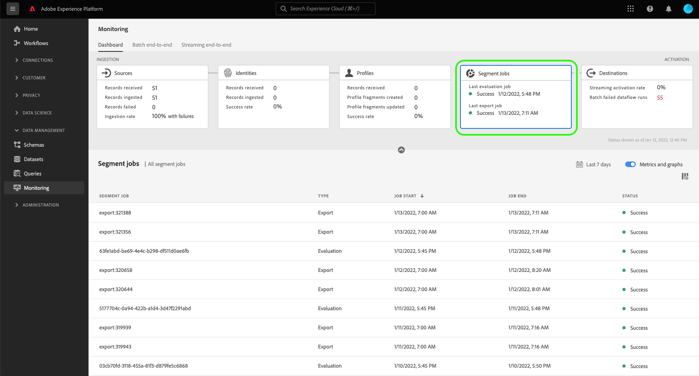

# UI での宛先のデータフローの監視

宛先を使用すると、Adobe Experience Platformから数え切れないほどの外部パートナーに対して、データをアクティブ化できます。 Platform では、データフローに透明性を提供することで、宛先へのデータフローの追跡プロセスを容易にします。

The monitoring dashboard provides you with a visual representation of the journey of a dataflow, including the destination the data is activated to. このチュートリアルでは、Experience Platformワークスペースで直接データフローを監視する方法、または監視ダッシュボードを使用して、宛先ユーザーインターフェイスを使用して、宛先のデータフローを監視する方法について説明します。

## はじめに {#getting-started}

このガイドでは、Adobe Experience Platform の次のコンポーネントに関する作業を理解している必要があります。

- [データフロー](../home.md)：データフローは、Platform 間でデータを移動するデータジョブを表します。データフローは異なるサービスをまたいで設定され、ソースコネクタからターゲットデータセット、[!DNL Identity] および [!DNL Profile]、[!DNL Destinations] へとデータを移動できます。
   - [データフローの実行](../../sources/notifications.md):データフローの実行は、選択したデータフローの頻度設定に基づく、定期的にスケジュールされたジョブです。
- [宛先](../../destinations/home.md):宛先は、クロスチャネルマーケティングキャンペーン、電子メールキャンペーン、ターゲット広告、その他多くの使用例に対して、Platform からデータをシームレスにアクティブ化できる、一般的に使用されるアプリケーションとの事前定義済みの統合です。
- [サンドボックス](../../sandboxes/home.md)：[!DNL Experience Platform] は、単一の [!DNL Platform] インスタンスを別々の仮想環境に分割して、デジタルエクスペリエンスアプリケーションの開発と発展を支援する仮想サンドボックスを提供します。

## Monitor dataflows in the Destinations workspace {#monitor-dataflows-in-the-destinations-workspace}

In the **[!UICONTROL Destinations]** workspace within the Platform UI, navigate to the **[!UICONTROL Browse]** tab and select the name of a destination that you want to view.

既存のデータフローのリストが表示されます。 このページには、表示可能なデータフローのリストがあります。これには、宛先、ユーザー名、データフロー数、ステータスに関する情報が含まれます。

ステータスについて詳しくは、次の表を参照してください。

| ステータス | 説明 |
| ------ | ----------- |
| 有効 | この `Enabled` 「 」ステータスは、データフローがアクティブで、指定されたスケジュールに従ってデータをエクスポートしていることを示します。 |
| 無効 | この `Disabled` status は、データフローが非アクティブで、データをエクスポートしていないことを示します。 |
| 処理中 | この `Processing` 「 」ステータスは、データフローがまだアクティブでないことを示します。 This status is often encountered immediately after a new dataflow is created. |
| エラー | この `Error` ステータスは、データフローのアクティベーションプロセスが中断されたことを示します。 |

### ストリーミング宛先のデータフロー実行 {#dataflow-runs-for-streaming-destinations}

>[!CONTEXTUALHELP]
>id="platform_monitoring_dataflow_run_details_activation_streaming"
>title="Dataflow run details"
>abstract="The destination dataflow run details contain information on the segment&#39;s activation status and metrics taken from Real-time Customer Profile to generate unique identities. 詳しくは、指標の定義に関するガイドを参照してください。"

>[!CONTEXTUALHELP]
>id="platform_monitoring_profiles_received_streaming"
>title="Profiles received"
>abstract="データフローで受信したプロファイルの合計数。 This value is updated every 60 minutes."
>text="Learn more in documentation"

>[!CONTEXTUALHELP]
>id="platform_destinations_dataflow_identitiesactivated_streaming"
>title="アクティブ化された ID"
>abstract="The count of individual profile identities successfully activated to the selected destination."
>text="Learn more in documentation"

>[!CONTEXTUALHELP]
>id="platform_destinations_dataflow_identitiesexcluded_streaming"
>title="Identities excluded"
>abstract="属性が見つからず、同意違反に基づいて、選択した宛先のアクティベーションから除外された個々のプロファイルレコードの数。"
>text="Learn more in documentation"

>[!CONTEXTUALHELP]
>id="platform_destinations_dataflow_identitiesfailed_streaming"
>title="Identities failed"
>abstract="選択した宛先に対して失敗した個々のプロファイル ID の数。 詳細は、エラー診断を確認してください。"
>text="Learn more in documentation"

For streaming destinations, the [!UICONTROL Dataflow runs] tab provides an hourly update for metric data on your dataflow runs. ラベル付けされた最も重要な統計は、ID 用です。

ID は、プロファイルの様々なファセットを表します。 例えば、プロファイルに電話番号と電子メールアドレスの両方が含まれている場合、そのプロファイルには 2 つの ID が含まれます。

個々の実行とその特定の指標のリストが表示され、次の ID の合計が表示されます。

- **[!UICONTROL アクティブ化された ID]**:アクティベーション用に作成または更新されたプロファイル ID の合計数です。
- **[!UICONTROL 除外された ID]**:属性が見つからず、同意違反に基づいてアクティベーション用にスキップされたプロファイル ID の合計数です。
- **[!UICONTROL 失敗した ID]**:エラーが原因で宛先に対してアクティブ化されなかったプロファイル ID の合計数です。

個々のデータフローの実行ごとに、次の詳細が表示されます。

- **[!UICONTROL データフローの実行開始]**:データフローの実行が開始された時刻。 For streaming dataflow runs, Experience Platform captures metrics based on the start of the dataflow run, in the form of hourly metrics. データフローのストリーミング実行の場合、データフローの実行が午後 10 時 30 分に開始した場合、この指標は、UI での開始時刻を午後 10 時と表示します。
- **[!UICONTROL Processing time]**: The amount of time that it took for the dataflow run to process.
   - の場合 **[!UICONTROL 完了]** が実行された場合、処理時間指標には常に 1 時間が表示されます。
   - まだ **[!UICONTROL 処理中]** 状態、すべての指標をキャプチャするためのウィンドウは、1 時間以上開いたままになり、データフローの実行に対応するすべての指標が処理されます。 例えば、午前 9 時 30 分に開始したデータフローの実行は、すべての指標を取得して処理するために、1 時間 30 分間処理状態のままになる場合があります。 次に、処理ウィンドウが閉じ、データフロー実行のステータスが次のように更新されます。 **完了**&#x200B;を指定した場合、表示される処理時間が 1 時間に変更されます。
- **[!UICONTROL 受信したプロファイル]**:データフローで受信したプロファイルの合計数。
- **[!UICONTROL アクティブ化された ID]**:選択した宛先に対して正常にアクティブ化されたプロファイル ID の合計数です。
- **[!UICONTROL 除外された ID]**:属性が見つからず、同意違反に基づいてアクティベーションから除外されたプロファイル ID の合計数です。
- **[!UICONTROL 失敗した ID]** エラーが原因で宛先に対してアクティブ化されなかったプロファイル ID の合計数です。
- **[!UICONTROL 有効化率]**:正常にアクティブ化されたか、スキップされた受信 ID の割合。 The following formula demonstrates how this value is calculated:
   
- **[!UICONTROL Status]**: Represents the state the dataflow is in: either [!UICONTROL Completed] or [!UICONTROL Processing]. [!UICONTROL 完了] は、対応するデータフロー実行のすべての ID が 1 時間以内にエクスポートされたことを意味します。 [!UICONTROL 処理中] は、データフローの実行がまだ完了していないことを示します。

特定のデータフロー実行の詳細を表示するには、リストから実行の開始時刻を選択します。

データフロー実行の詳細ページには、受信したプロファイルの数、アクティブ化された ID の数、失敗した ID の数、除外された ID の数など、追加の情報が含まれます。

詳細ページには、失敗した ID と除外された ID のリストも表示されます。 Information for both the failed and excluded identities is displayed, including the error code, identity count, and description. By default, the list displays the failed identities. スキップされた ID を表示するには、「 **[!UICONTROL 除外された ID]** 切り替え

### Dataflow runs for batch destinations {#dataflow-runs-for-batch-destinations}

>[!CONTEXTUALHELP]
>id="platform_monitoring_dataflow_run_details_activation"
>title="データフロー実行の詳細"
>abstract="宛先のデータフロー実行の詳細には、セグメントのアクティベーションステータスに関する情報と、一意の ID を生成するためにリアルタイム顧客プロファイルから取得された指標が含まれます。 詳しくは、指標の定義に関するガイドを参照してください。"

>[!CONTEXTUALHELP]
>id="platform_monitoring_dataflow_run_details_activation_batch"
>title="データフロー実行の詳細"
>abstract="The destination dataflow run details contain information on the segment&#39;s activation status and metrics taken from Real-time Customer Profile to generate unique identities. To learn more, please review the metric definitions guide."

>[!CONTEXTUALHELP]
>id="platform_monitoring_profiles_received_batch"
>title="受信したプロファイル"
>abstract="データフローで受信したプロファイルの合計数。 この値は 60 分ごとに更新されます。"
>text="Learn more in documentation"

>[!CONTEXTUALHELP]
>id="platform_destinations_dataflow_identitiesactivated_batch"
>title="アクティブ化された ID"
>abstract="選択した宛先に対して正常にアクティブ化された個々のプロファイル ID の数。"
>text="Learn more in documentation"

>[!CONTEXTUALHELP]
>id="platform_destinations_dataflow_identitiesexcluded_batch"
>title="除外された ID"
>abstract="属性が見つからず、同意違反に基づいて、選択した宛先のアクティベーションから除外された個々のプロファイルレコードの数。"
>text="Learn more in documentation"

バッチ保存先の場合、 [!UICONTROL データフローの実行] 「 」タブには、データフローの実行に関する指標データが表示されます。 個々の実行とその特定の指標のリストが表示され、次の ID の合計が表示されます。

- **[!UICONTROL アクティブ化された ID]**:選択した宛先に対して正常にアクティブ化された個々のプロファイル ID の数。
- **[!UICONTROL 除外された ID]**:見つからない属性や同意違反に基づいて、選択した宛先のアクティブ化から除外された個々のプロファイル ID の数。

個々のデータフローの実行ごとに、次の詳細が表示されます。

- **[!UICONTROL Dataflow run start]**: The time that the dataflow run started at.
- **[!UICONTROL 処理時間]**:データフローの実行が処理されるまでに要した時間。
- **[!UICONTROL Profiles received]**: The total number of profiles received in the dataflow. この値は 60 分ごとに更新されます。
- **[!UICONTROL Identities activated]**: The total number of profile identities that were successfully activated to the selected destination.
- **[!UICONTROL Identities excluded]**: The total number of profile identities that are excluded from activation based on missing attributes and consent violation.
- **[!UICONTROL ステータス]**:データフローの状態を表します。 This can be one of three states: [!UICONTROL Success], [!UICONTROL Failed], and [!UICONTROL Processing]. [!UICONTROL 成功] は、データフローがアクティブで、指定されたスケジュールに従ってデータをエクスポートしていることを意味します。 [!UICONTROL 失敗] は、エラーが原因でデータのアクティベーションが中断されたことを意味します。 [!UICONTROL Processing] means that the dataflow is not yet active and is generally encountered when a new dataflow is created.

特定のデータフロー実行の詳細を表示するには、リストから実行の開始時刻を選択します。

>[!NOTE]
>
>データフローの実行は、宛先データフローのスケジュール頻度に基づいて生成されます。 各 [結合ポリシー](../../profile/merge-policies/overview.md) をセグメントに適用した状態。

データフローの詳細ページは、データフローリストに表示される詳細に加えて、データフローに関するより具体的な情報を表示します。

- **[!UICONTROL データのサイズ]**:エクスポートするデータフローのサイズ。
- **[!UICONTROL 合計ファイル数]**:データフローでエクスポートされたファイルの合計数。
- **[!UICONTROL Last updated]**: The time the dataflow run was last updated.

詳細ページには、失敗した ID と除外された ID のリストも表示されます。 Information for both the failed and excluded identities is displayed, including the error code and description. デフォルトでは、リストには失敗した ID が表示されます。 To show excluded identities, select the **[!UICONTROL Identities excluded]** toggle.

## Monitoring Segment Jobs dashboard {#monitoring-segment-jobs-dashboard}

>[!CONTEXTUALHELP]
>id="platform_monitoring_segment_jobs"
>title="セグメントジョブ"
>abstract="セグメントジョブビューには、すべてのセグメントの評価ジョブと書き出しジョブに関する情報が含まれています。"

To access the [!UICONTROL Segment Jobs] dashboard, select **[!UICONTROL Monitoring]** () in the left navigation. 1 回 [!UICONTROL 監視] ページ、選択 [!UICONTROL セグメントジョブ]. この [!UICONTROL 監視] ダッシュボードには、セグメント評価ジョブと書き出しジョブに関する指標と情報が含まれています。

以下を使用： [!UICONTROL セグメントジョブ] ダッシュボードを使用すると、プロファイルの評価と書き出しが時間通りに例外なく実行されるかどうかを把握でき、宛先のアクティベーション用のダウンストリームサービスで最新の評価済みプロファイルデータを使用できます。

セグメントジョブでは、次の指標を使用できます。

| 指標 | 説明 |
---------|----------|
| **[!UICONTROL セグメントジョブ]** | Indicates the name of the segment job. |
| **[!UICONTROL タイプ]** | Indicates the type of segment job - export or evaluation. どちらの場合も、セグメントジョブは評価または書き出しをおこないます *すべて* 組織に属するセグメント。 |
| **[!UICONTROL ジョブ開始]** | セグメントジョブが開始された日時。 |
| **[!UICONTROL ジョブ終了]** | セグメントジョブが完了した日時。 |
| **[!UICONTROL ステータス]** | 完了したジョブのステータス（成功または失敗）。 |

## 「宛先の監視」ダッシュボード {#monitoring-destinations-dashboard}

>[!CONTEXTUALHELP]
>id="platform_monitoring_activation"
>title="Activation"
>abstract="宛先のアクティベーション表示には、セグメントのアクティベーションステータスに関する情報と、一意の ID を生成するためにリアルタイム顧客プロファイルから取得された指標が含まれます。"

次の手順で [!UICONTROL 監視] ダッシュボード、選択 **[!UICONTROL 監視]** () をクリックします。 1 回 [!UICONTROL 監視] ページ、選択 [!UICONTROL 宛先]. この [!UICONTROL 監視] ダッシュボードには、宛先の実行ジョブに関する指標と情報が含まれています。

以下を使用： [!UICONTROL 宛先] ダッシュボードを使用して、アクティベーションフローの正常性を全体的に把握できます。 Start by getting insights on an aggregated level for all batch and streaming destinations and then drill down into detailed views for dataflows, dataflow runs, and activated segments for an in-depth look at your activation data. 画面 [!UICONTROL 監視] ダッシュボードは、指標やエラーの説明を通じて実用的なインサイトを提供し、アクティベーションシナリオで発生する可能性のある問題のトラブルシューティングに役立ちます。

At the center of the dashboard is the [!UICONTROL Activation] panel, which contains metrics and graphs that display data on the activation rate of the data which is exported to streaming destinations, as well as on the failed batch dataflow runs to batch destinations.

デフォルトでは、表示されるデータには、過去 24 時間のアクティベーション情報が含まれています。 選択 **[!UICONTROL 過去 24 時間]** を使用して、表示されるレコードの時間枠を調整します。 次のオプションを使用できます。 **[!UICONTROL 過去 24 時間]**, **[!UICONTROL 過去 7 日間]**、および **[!UICONTROL 過去 30 日間]**. または、表示されるカレンダーポップアップウィンドウで日付を選択することもできます。 Once you have selected dates, select **[!UICONTROL Apply]** to adjust the time frame of the information shown.

>[!NOTE]
>
>次のスクリーンショットは、過去 24 時間ではなく、過去 30 日間のアクティベーション率とバッチデータフローの実行を示しています。 時間枠は、 **[!UICONTROL 過去 30 日間]**.

矢印アイコン () をクリックして、画面の上部にあるカードを展開または解除します。このカードには、宛先のタイプ（ストリーミングまたはバッチ）に基づいて、アクティベーションの詳細に関する一目でわかる情報が表示されます。

- **[!UICONTROL Streaming activation rate]**: Represents the percentage of received identities that have either been successfully activated or skipped. The formula used to calculate this percentage is described further above on this page, in the [Dataflow runs for streaming destinations](#dataflow-runs-for-streaming-destinations) section.
- **[!UICONTROL Batch failed dataflow runs]**: Represents the number of failed dataflow runs in the selected time interval.

この **[!UICONTROL Activation]** グラフはデフォルトで表示されます。このグラフを無効にして、以下の宛先のリストを展開できます。 を選択します。 **[!UICONTROL 指標とグラフ]** を切り替えて、グラフを無効にします。

この **[!UICONTROL Activation]** パネルには、1 つ以上の既存のアカウントを含む宛先のリストが表示されます。 このリストには、受信したプロファイル、アクティブ化された ID、失敗した ID、除外された ID、アクティブ化率、失敗したデータフローの合計、これらの宛先の最終更新日に関する情報も含まれます。 すべての指標が、すべての宛先タイプで使用できるわけではありません。 次の表に、宛先のタイプ、ストリーミングまたはバッチごとに使用可能な指標の概要を示します。

| 指標 | 宛先のタイプ |
---------|----------|
| **[!UICONTROL 受信したプロファイル]** | ストリーミングとバッチ |
| **[!UICONTROL アクティブ化された ID]** | ストリーミングとバッチ |
| **[!UICONTROL Identities failed]** | ストリーミング |
| **[!UICONTROL 除外された ID]** | ストリーミングとバッチ |
| **[!UICONTROL 有効化率]** | ストリーミング |
| **[!UICONTROL Total failed dataflows]** | バッチ |
| **[!UICONTROL Last updated]** | ストリーミングとバッチ |

また、宛先のリストをフィルタリングして、選択したカテゴリの宛先のみを表示することもできます。 Select the **[!UICONTROL My destinations]** dropdown, and select the [destination category](/help/destinations/destination-types.md#categories) that you want to filter to.

さらに、検索バーに宛先を入力して、1 つの宛先に分離することもできます。 宛先のデータフローを表示する場合は、フィルターを選択できます  その横に、アクティブなデータフローのリストを表示します。

すべての宛先の既存のデータフローをすべて表示する場合は、「 」を選択します。 **[!UICONTROL データフロー]**.

データフローのリストが表示され、最後のデータフロー実行で並べ替えられます。 You can see additional details for a specific dataflow by locating the destination you want to monitor, selecting the filter  beside it, and then subsequently selecting the filter  beside the dataflow you want more information about.

さらに調査するデータフローを選択すると、データフローの詳細ページに、アクティブ化されたデータをデータフローの実行またはセグメント別に分類してデータフローで確認できる切り替えが含まれます。

### Dataflow runs view {#dataflow-runs-view}

条件 **[!UICONTROL データフローの実行]** が選択されている場合は、選択したデータフローのデータフロー実行のリストと、各実行に関する詳細を確認できます。

>[!INFO]
>
>データフローをストリーミング宛先に対して使用する場合、データフローの実行は 1 時間ごとのウィンドウに分類されます。 Each hourly window generates a corresponding dataflow run ID.
>
>データフローをバッチ宛先に対して使用する場合、各セグメントには、スケジュールされたセグメントアクティベーション頻度に基づいて、対応するデータフローの実行が生成されます。 例えば、同じ宛先データフロー内の 5 つのセグメントに対して、毎日スケジュールされたアクティベーションを設定した場合、毎日 5 つの個別のデータフロー実行が生成されます。

以下を使用： **[!UICONTROL 失敗のみを表示]** を切り替えて、データフローの失敗した実行のみを表示します。

### セグメントレベル表示 {#segment-level-view}

条件 **[!UICONTROL セグメント]** が選択されている場合、選択した期間内に、選択したデータフローに対してアクティブ化されたセグメントのリストが表示されます。 この画面には、アクティブ化された ID、除外された ID、最後のデータフロー実行のステータスと時間に関するセグメントレベルの情報が含まれます。 除外およびアクティブ化された ID の指標を確認することで、セグメントが正常にアクティブ化されたかどうかを確認できます。

例えば、「Loyalty Members in California」というセグメントをAmazon S3 の宛先「Loyalty Members California Decembers」にアクティブ化するとします。 Let&#39;s assume that there are 100 profiles in the selected segment but only 80 out of 100 profiles contain Loyalty ID attributes and you have defined the export mapping rules as `loyalty.id` is required. この場合、セグメントレベルでは、80 個の ID がアクティブ化され、20 個の ID が除外されます。

>[!IMPORTANT]
>
>セグメントレベルの指標に関する現在の制限事項に注意してください。
>- The segment-level view is currently only available for batch destinations.
>- セグメントレベルの指標は、現在、正常なデータフロー実行の場合にのみ記録されます。 失敗したデータフローの実行や除外されたレコードに対しては、記録されません。

セグメントレベルの表示では、指標は、選択した期間内の複数のデータフロー実行にわたって集計されます。 If there are multiple dataflow runs, you can drill down from the segment level to see the breakdown for each dataflow run, filtered by the selected segment.
フィルターボタンを使用  をクリックして、データフロー内の各セグメントのデータフロー実行ビューにドリルダウンします。

### データフロー実行ページ {#dataflow-runs-page}

データフローの実行ページには、データフローの実行開始時間、処理時間、受信したプロファイル、アクティブ化された ID、除外された ID、失敗した ID、アクティブ化率、ステータスなど、データフローの実行に関する情報が表示されます。

次からデータフロー実行ページにドリルダウンする場合： [セグメントレベル表示](#segment-level-view)の場合は、次のオプションでデータフローの実行をフィルタリングできます。

- **[!UICONTROL 失敗した ID を使用したデータフローの実行]**:選択したセグメントに対して、このオプションは、アクティベーションに失敗したすべてのデータフローの実行をリストします。 特定のデータフローの実行が失敗した理由を調べるには、 [データフロー実行の詳細ページ](#dataflow-run-details-page) 」を追加します。
- **[!UICONTROL ID がスキップされたデータフロー実行]**:選択したセグメントに対して、このオプションは、一部の ID が完全にアクティブ化されておらず、一部のプロファイルがスキップされた、すべてのデータフロー実行をリストします。 特定のデータフロー実行内の ID がスキップされた理由を調べるには、 [データフロー実行の詳細ページ](#dataflow-run-details-page) 」を追加します。
- **[!UICONTROL アクティブ化された ID を使用したデータフローの実行]**:選択したセグメントに対して、このオプションは、正常にアクティブ化された ID を持つすべてのデータフロー実行をリストします。

特定のデータフロー実行の詳細を表示するには、フィルターを選択します  をクリックし、データフローの実行の詳細ページを確認します。

### データフロー実行の詳細ページ {#dataflow-run-details-page}

データフローの実行の詳細ページには、データフローの実行リストに表示される詳細に加えて、データフローに関するより具体的な情報が表示されます。

- **[!UICONTROL データフロー実行 ID]**:データフローの ID。
- **[!UICONTROL IMS org ID]**:データフローが属する IMS 組織。
- **[!UICONTROL 最終更新日]**:データフローの実行が最後に更新された時刻。

詳細ページでは、データフロー実行エラーとセグメントを切り替える切り替えも可能です。 このオプションは、バッチ宛先でのデータフローの実行に対してのみ使用できます。

データフロー実行エラー表示には、失敗した ID と除外された ID のリストが表示されます。 失敗した ID と除外された ID の両方に関する情報（エラーコード、ID の数、説明を含む）が表示されます。 デフォルトでは、リストには失敗した ID が表示されます。 スキップされた ID を表示するには、「 **[!UICONTROL 除外された ID]** 切り替え

When **[!UICONTROL Segments]** is selected, you see a list of the segments which were activated in the selected dataflow run. この画面には、アクティブ化された ID、除外された ID、最後のデータフロー実行のステータスと時間に関するセグメントレベルの情報が含まれます。

## 次の手順 {#next-steps}

このガイドに従うことで、処理時間、アクティベーション率、ステータスなどの関連情報を含め、バッチ宛先とストリーミング宛先の両方でデータフローを監視する方法を理解できました。 Platform でのデータフローの詳細については、 [データフローの概要](../home.md). 宛先の詳細については、 [宛先の概要](../../destinations/home.md).