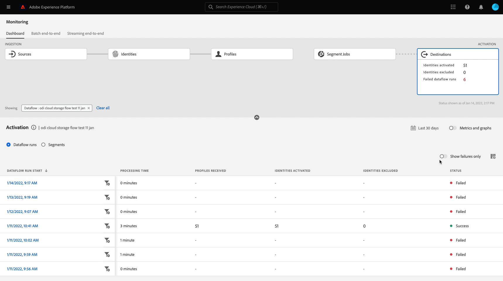

# UI での宛先のデータフローの監視

Experience Platform カタログの様々な宛先を使用して、Experience Platformから無数の外部パートナーに対してデータをアクティブ化します。 Experience Platformでは、データフローの透明性を提供することで、宛先へのデータフローのトラッキングプロセスを容易にします。

監視ダッシュボードは、データフローのジャーニーを視覚的に表します。これには、データがアクティブ化されている宛先、表示しているデータのタイプ、データフロー実行ごとに書き出されたデータなどが含まれます。

このチュートリアルでは、宛先ワークスペースでデータフローを直接監視する方法や、監視ダッシュボードを使用して Experience Platform ユーザーインターフェイスで宛先のデータフローを監視する方法について説明します。

## はじめに {#getting-started}

このガイドでは、Adobe Experience Platform の次のコンポーネントに関する十分な知識が必要です。

- [ データフロー ](../home.md)：データフローは、Experience Platform間でデータを移動するデータジョブを表します。 データフローは異なるサービスをまたいで設定され、ソースコネクタからターゲットデータセット、[!DNL Identity] および [!DNL Profile]、[!DNL Destinations] へとデータを移動できます。
   - [データフロー実行](../../sources/notifications.md)：データフロー実行は、選択したデータフローの頻度設定に基づいて繰り返しスケジュールされたジョブです。
- [ 宛先 ](../../destinations/home.md)：宛先は、一般に使用されるアプリケーションとの事前定義済みの統合で、これを使用すると、Experience Platformのデータをシームレスにアクティブ化してクロスチャネルマーケティングキャンペーン、メールキャンペーン、ターゲット広告およびその他の多くのユースケースを実現できます。
- [サンドボックス](../../sandboxes/home.md)：[!DNL Experience Platform] には、単一の [!DNL Experience Platform] インスタンスを別個の仮想環境に分割してデジタルエクスペリエンスアプリケーションの開発と発展を支援する仮想サンドボックスが用意されています。

## 宛先ワークスペースでのデータフローの監視 {#monitor-dataflows-in-the-destinations-workspace}

Experience Platform UI 内の **[!UICONTROL Destinations]** ワークスペースで、「**[!UICONTROL Browse]**」タブに移動し、表示する宛先の名前を選択します。

既存のデータフローのリストが表示されます。このページには、宛先、ユーザー名、データフロー数およびステータスに関する情報を含め、表示可能なデータフローがリストされます。

ステータスについて詳しくは、次の表を参照してください。

| ステータス | 説明 |
| ------ | ----------- |
| 有効 | 「`Enabled`」ステータスは、データフローがアクティブで、指定したスケジュールに従ってデータを書き出していることを示します。 |
| 無効 | 「`Disabled`」ステータスは、データフローが非アクティブで、データを書き出していないことを示します。 |
| 処理中 | 「`Processing`」ステータスは、データフローがまだアクティブでないことを示します。 このステータスは、多くの場合、新しいデータフローを作成した直後に発生します。 |
| エラー | 「`Error`」ステータスは、データフローのアクティブ化プロセスが中断されたことを示します。 |

### ストリーミング宛先のデータフロー実行 {#dataflow-runs-for-streaming-destinations}

>[!CONTEXTUALHELP]
>id="platform_monitoring_dataflow_run_details_activation_streaming"
>title="データフロー実行の詳細"
>abstract="宛先データフロー実行の詳細には、オーディエンスのアクティブ化ステータスに関する情報と、一意の ID を生成するリアルタイム顧客プロファイルから取得した指標が含まれます。詳しくは、指標の定義に関するガイドを参照してください。"

>[!CONTEXTUALHELP]
>id="platform_monitoring_profiles_received_streaming"
>title="受信したプロファイル"
>abstract="データフローで受信したプロファイルの合計数です。 この値は 60 分ごとに更新されます。"

>[!CONTEXTUALHELP]
>id="platform_destinations_dataflow_identitiesactivated_streaming"
>title="アクティブ化された ID"
>abstract="選択した宛先に対して正常にアクティブ化された個人プロファイル ID の数。この指標には、書き出されたオーディエンスから作成、更新、削除された ID が含まれます。"

>[!CONTEXTUALHELP]
>id="platform_destinations_dataflow_identitiesexcluded_streaming"
>title="除外された ID"
>abstract="属性の欠如と同意違反に基づいて、選択した宛先のアクティブ化から除外された個人プロファイルレコードの数。"

>[!CONTEXTUALHELP]
>id="platform_destinations_dataflow_identitiesfailed_streaming"
>title="失敗した ID"
>abstract="選択した宛先に対して失敗した個人プロファイル ID の数。詳しくは、エラー診断を確認してください。"

ストリーミング宛先の場合、「[!UICONTROL Dataflow runs]」タブには、データフロー実行に関する指標データの 1 時間ごとの更新が表示されます。 ラベル付けされた最も顕著な統計情報は ID の情報です。

ID は、プロファイルの様々なファセットを表します。例えば、プロファイルに電話番号とメールアドレスの両方が含まれている場合、そのプロファイルには 2 つの ID があります。

個々の実行とその特定の指標のリストが、ID の下記の合計数と共に表示されます。

- **[!UICONTROL Identities activated]**：選択した宛先に対して正常にアクティブ化されたプロファイル ID の合計数です。 この指標には、書き出されたオーディエンスから作成、更新、削除された ID が含まれます。
- **[!UICONTROL Identities excluded]**：属性の欠如と同意違反に基づいてアクティブ化の対象からスキップされたプロファイル ID の合計数です。
- **[!UICONTROL Identities failed]**：エラーが原因で宛先に対してアクティブ化されなかったプロファイル ID の合計数です。

個々のデータフロー実行ごとに、次の詳細が表示されます。

- **[!UICONTROL Dataflow run start]**：データフロー実行が開始された時刻。 ストリーミングデータフロー実行の場合、Experience Platform は、データフロー実行の開始時刻に基づく指標を時間別指標の形式で取得します。つまり、ストリーミングデータフロー実行の場合、データフロー実行が例えば 10:30PM に開始すると、UI では、この指標は開始時刻が午後 10:00 と表示されます。
- **[!UICONTROL Processing time]**：データフロー実行が処理されるまでにかかった時間です。
   - **[!UICONTROL completed]** 実行の場合、処理時間指標には常に 1 時間と表示されます。
   - まだ **[!UICONTROL processing]** 状態のデータフロー実行の場合、データフロー実行に対応するすべての指標を処理するために、すべての指標を取得するウィンドウが 1 時間以上開いたままになります。 例えば、午前 9:30 に開始したデータフロー実行が、すべての指標を取得して処理するために、1 時間 30 分間処理状態のままになるといった場合です。 処理時間の長さは、宛先の応答失敗の結果として行われた再試行の影響を直接受けます。 次に、処理ウィンドウが閉じ、データフロー実行のステータスが&#x200B;**完了**&#x200B;に更新されると、表示される処理時間が 1 時間に変更されます。
- **[!UICONTROL Profiles received]**：データフローで受信したプロファイルの合計数です。
- **[!UICONTROL Identities activated]**：データフロー実行の一環として、選択した宛先に対して正常にアクティブ化されたプロファイル ID の合計数です。 この指標には、書き出されたオーディエンスから作成、更新、削除された ID が含まれます。
- **[!UICONTROL Identities excluded]**：属性の欠如と同意違反に基づいてアクティブ化から除外されたプロファイル ID の合計数です。
- **[!UICONTROL Identities failed]** エラーが原因で宛先に対してアクティブ化されなかったプロファイル ID の合計数です。

  >[!IMPORTANT]
  >
  > 2025 年 3 月より、Adobeは、ストリーミング宛先のレポート精度を高めるためのアップデートを展開しています。 この機能強化により、Experience Platformのレポートと出力先プラットフォームの間の整合性が向上します。
  >
  > このアップデート以前は、すべてのアクティベーションの再試行 **[!UICONTROL Identities failed]** 含まれていました。 この更新後は、最後のアクティベーションの再試行のみが合計数に含まれます。
  > 
  > この機能強化は、すべてのストリーミング宛先に適用されます。
  > この機能強化に伴い、ストリーミング宛先のユーザーでは、**[!UICONTROL Identities failed]** 数が低下する可能性があります。

- **[!UICONTROL Activation rate]**：正常にアクティブ化された受信 ID の割合です。 次の数式は、この値の計算方法を示しています。
  
- **[!UICONTROL Status]**：データフローの状態（[!UICONTROL Completed] または [!UICONTROL Processing]）を表します。 [!UICONTROL Completed] れは、対応するデータフロー実行のすべての ID が 1 時間以内に書き出されたことを意味します。 [!UICONTROL Processing] は、データフロー実行がまだ終了していないことを意味します。

特定のデータフロー実行の詳細を表示するには、実行の開始時刻をリストから選択します。

データフロー実行の詳細ページには、受信したプロファイルの数、アクティブ化された ID の数、失敗した ID の数、除外された ID の数などの、追加の情報が含まれています。

詳細ページには、失敗した ID と除外された ID のリストも表示されます。失敗した ID と除外された ID の両方に関する情報（エラーコード、ID の数、説明など）が表示されます。デフォルトでは、リストには、失敗した ID が表示されます。スキップされた ID を表示するには、「**[!UICONTROL Identities excluded]**」切替スイッチを選択します。

#### ストリーミング宛先のオーディエンスレベルのデータフロー実行監視 {#audience-level-dataflow-runs-for-streaming-destinations}

データフローの一部である各オーディエンスに対して、オーディエンスレベルで分類されたアクティブ化、除外、失敗した ID に関する情報を表示できます。

ストリーミング宛先のオーディエンスレベルの監視は、特定の宛先でのみ使用できます。 サポートされる宛先のリストについては、[ オーディエンスレベルの表示 ](#audience-level-view) の節を参照してください。

>[!NOTE]
>
>「**[!UICONTROL Profiles received]**」タブの **[!UICONTROL Audiences]** 数は、データフロー実行のために受信したプロファイル数と常に一致するとは限りません。 これは、特定のプロファイルが、データフロー実行でアクティブ化される複数のオーディエンスの一部である可能性があるためです。

### バッチ宛先のデータフロー実行 {#dataflow-runs-for-batch-destinations}

>[!CONTEXTUALHELP]
>id="platform_monitoring_dataflow_run_details_activation"
>title="データフロー実行の詳細"
>abstract="宛先データフロー実行の詳細には、オーディエンスのアクティブ化ステータスに関する情報と、一意の ID を生成するリアルタイム顧客プロファイルから取得した指標が含まれます。詳しくは、指標の定義に関するガイドを参照してください。"
>additional-url="https://experienceleague.adobe.com/docs/experience-platform/dataflows/ui/monitor-destinations.html?lang=ja#dataflow-runs-for-streaming-destinations" text="ストリーミング宛先のデータフロー実行"

>[!CONTEXTUALHELP]
>id="platform_monitoring_profiles_received_batch"
>title="受信したプロファイル"
>abstract="データフローで受信したプロファイルの合計数です。 この値は 60 分ごとに更新されます。"

>[!CONTEXTUALHELP]
>id="platform_destinations_dataflow_identitiesactivated_batch"
>title="アクティブ化された ID"
>abstract="選択した宛先に対して正常にアクティブ化された個人プロファイル ID の数。この指標には、書き出されたオーディエンスから作成、更新、削除された ID が含まれます。"

>[!CONTEXTUALHELP]
>id="platform_destinations_dataflow_identitiesexcluded_batch"
>title="除外された ID"
>abstract="属性の欠如と同意違反に基づいて、選択した宛先のアクティブ化から除外された個人プロファイルレコードの数。"

バッチ宛先の場合、「[!UICONTROL Dataflow runs]」タブには、データフロー実行に関する指標データが表示されます。 個々の実行とその特定の指標のリストが、ID の下記の合計数と共に表示されます。

- **[!UICONTROL Identities activated]**：選択した宛先に対して正常にアクティブ化されたプロファイル ID の合計数です。 この指標には、書き出されたオーディエンスから作成、更新、削除された ID が含まれます。
- **[!UICONTROL Identities excluded]**：属性の欠如と同意違反に基づいて、選択した宛先のアクティブ化から除外された個人プロファイル ID の数です。

個々のデータフロー実行ごとに、次の詳細が表示されます。

- **[!UICONTROL Dataflow run start]**：データフロー実行が開始された時刻。
- **[!UICONTROL Audience]**：各データフロー実行に関連付けられたオーディエンスの名前。
- **[!UICONTROL Processing time]**: データフロー実行が処理されるまでにかかった時間です。
- **[!UICONTROL Profiles received]**：データフローで受信したプロファイルの合計数です。 この値は 60 分ごとに更新されます。
- **[!UICONTROL Identities activated]**：データフロー実行の一環として、選択した宛先に対して正常にアクティブ化されたプロファイル ID の合計数です。 この指標には、書き出されたオーディエンスから作成、更新、削除された ID が含まれます。
- **[!UICONTROL Identities excluded]**：属性の欠如と同意違反に基づいてアクティブ化から除外されたプロファイル ID の合計数です。
- **[!UICONTROL Status]**：データフローの状態を表します。 これは、[!UICONTROL Success]、[!UICONTROL Failed]、[!UICONTROL Processing] の 3 つの状態のいずれかです。 [!UICONTROL Success] は、データフローがアクティブで、指定したスケジュールに従ってデータを書き出していることを意味します。 [!UICONTROL Failed] は、エラーが原因でデータのアクティブ化が中断されたことを意味します。 [!UICONTROL Processing] は、データフローがまだアクティブでないことを意味し、通常、新しいデータフローの作成時に発生します。

特定のデータフロー実行の詳細を表示するには、実行の開始時刻をリストから選択します。

>[!NOTE]
>
>データフロー実行は、宛先データフローのスケジュール頻度に基づいて生成されます。 オーディエンスに適用される [ 結合ポリシー ](../../profile/merge-policies/overview.md) ごとに、別個のデータフロー実行が行われます。

データフローの詳細ページには、データフローリストに表示される詳細に加えて、データフローに関するより具体的な情報も表示されます。

- **[!UICONTROL Size of data]**：書き出されるデータフローのサイズ。
- **[!UICONTROL Total files]**：データフローでエクスポートされたファイルの合計数です。
- **[!UICONTROL Last updated]**：データフロー実行が最後に更新された時刻。

詳細ページには、失敗した ID と除外された ID のリストも表示されます。エラーコードや説明など、失敗した ID と除外された ID の両方に関する情報が表示されます。 デフォルトでは、リストには、失敗した ID が表示されます。除外された ID を表示するには、「**[!UICONTROL Identities excluded]**」切替スイッチを選択します。

### 監視で表示 {#view-in-monitoring}

また、特定のデータフローとそのデータフローの実行に関する豊富な情報を監視ダッシュボードで表示するように選択することもできます。 監視ダッシュボードでデータフローに関する情報を表示するには：

1. **[!UICONTROL Connections]**/**[!UICONTROL Destinations]**/**[!UICONTROL Browse]** タブに移動します。
2. 検査するデータフローに移動します。
3. 省略記号アイコンと **[!UICONTROL View in monitoring]** を選択します。

>[!SUCCESS]
>
>監視ダッシュボードで、データフローとその関連するデータフロー実行に関する情報を表示できるようになりました。 詳しくは、以下の節を参照してください。

## 宛先監視ダッシュボード {#monitoring-destinations-dashboard}

>[!NOTE]
>
>宛先モニタリング機能は、現在、[Adobe Target](/help/destinations/catalog/personalization/adobe-target-connection.md) 宛先と[カスタムパーソナライゼーション](/help/destinations/catalog/personalization/custom-personalization.md)宛先を&#x200B;*除く*、Experience Platform 内のすべての宛先でサポートされています。

>[!CONTEXTUALHELP]
>id="platform_monitoring_activation"
>title="アクティブ化"
>abstract="宛先アクティブ化ビューには、オーディエンスのアクティブ化ステータスに関する情報と、一意の ID を生成するリアルタイム顧客プロファイルから取得した指標が含まれます。"

[!UICONTROL Monitoring] ダッシュボードにアクセスするには、左側のナビゲ **[!UICONTROL Monitoring]** ションで「）を選択します。 [!UICONTROL Monitoring] ページで「[!UICONTROL Destinations]」を選択します。 [!UICONTROL Monitoring] ダッシュボードには、宛先実行ジョブに関する指標と情報が含まれています。

[!UICONTROL Destinations] ダッシュボードを使用すると、アクティブ化フローの正常性を全体的に把握できます。 まず、すべてのバッチ宛先とストリーミング宛先について集計レベルでインサイトを取得し、データフロー、データフロー実行およびアクティブ化されたオーディエンスの詳細ビューにドリルダウンして、アクティベーションデータを詳しく調べます。 [!UICONTROL Monitoring] ダッシュボードの画面では、指標やエラーの説明を通じて実用的なインサイトが提供され、アクティブ化シナリオで発生する可能性のある問題のトラブルシューティングに役立ちます。

表示される情報は、データタイプ（顧客、アカウント（Adobe Real-Time CDP B2B editionのみ）、見込み客、アカウント強化）でフィルタリングできます。 これらのオプションについて詳しくは、[ 監視ダッシュボードガイド ](/help/dataflows/ui/monitor.md#monitoring-dashboard-overview) を参照してください。

ダッシュボードの中央にある [!UICONTROL Activation] パネルには、ストリーミング宛先に書き出されたデータのアクティブ化率に関するデータと、バッチ宛先に対する失敗したバッチデータフロー実行に関するデータを表示する指標とグラフが表示されます。

デフォルトでは、表示されるデータには、過去 24 時間のアクティブ化情報が含まれています。 「**[!UICONTROL Last 24 hours]**」を選択すると、表示されるレコードの時間枠を調整できます。 使用可能なオプションには、**[!UICONTROL Last 24 hours]**、**[!UICONTROL Last 7 days]**、**[!UICONTROL Last 30 days]** などがあります。 または、表示されるカレンダーポップアップウィンドウで日付を選択することもできます。 日付を選択したら、「**[!UICONTROL Apply]**」を選択して、表示される情報の時間枠を調整できます。

>[!NOTE]
>
>次のスクリーンショットは、過去 24 時間ではなく、過去 30 日間のアクティブ化率とバッチデータフロー実行を示しています。 **[!UICONTROL Last 30 days]** を選択して時間枠を調整できます。

矢印アイコン（）を使用すると、画面上部のカードを展開したり展開解除したりできます。このカードでは、宛先のタイプ（ストリーミングまたはバッチ）に基づいて、アクティブ化の詳細に関する情報を一目で確認できます。

- **[!UICONTROL Streaming activation rate]**：正常にアクティブ化またはスキップされた受信 ID の割合を表します。 この割合の計算に使用される数式について詳しくは、このページの[ストリーミング宛先のデータフロー実行](#dataflow-runs-for-streaming-destinations)節を参照してください。
- **[!UICONTROL Batch failed dataflow runs]**：選択した時間枠での失敗したデータフロー実行の数を表します。

**[!UICONTROL Activation]** グラフはデフォルトで表示されますが、これを無効にして、以下の宛先リストを展開することができます。 グラフを無効にするには、「**[!UICONTROL Metrics and graphs]**」切替スイッチを選択します。

**[!UICONTROL Activation]** パネルには、1 つ以上の既存のアカウントを含んだ宛先のリストが表示されます。 このリストには、受信したプロファイル、アクティブ化された ID、失敗した ID、除外された ID、アクティブ化率、失敗したデータフローの合計およびこれらの宛先の最終更新日に関する情報も含まれています。 すべての宛先タイプですべての指標を使用できるわけではありません。 次の表に、宛先タイプごとに使用できる指標と情報の概要を示します。

| 指標 | 宛先のタイプ |
|--------------------------------------|-----------------------|
| **[!UICONTROL Records received]** | ストリーミングとバッチ |
| **[!UICONTROL Records activated]** | ストリーミングとバッチ |
| **[!UICONTROL Records failed]** | ストリーミング |
| **[!UICONTROL Records skipped]** | ストリーミングとバッチ |
| **[!UICONTROL Data type]** | ストリーミングとバッチ |
| **[!UICONTROL Activation rate]** | ストリーミング |
| **[!UICONTROL Total failed dataflows]** | バッチ |
| **[!UICONTROL Last updated]** | ストリーミングとバッチ |

{style="table-layout:auto"}

また、宛先のリストをフィルタリングして、選択したカテゴリの宛先のみを表示することもできます。 **[!UICONTROL My destinations]** ドロップダウンを選択し、フィルタリングする [ 宛先カテゴリ ](/help/destinations/destination-types.md#categories) を選択します。

さらに、検索バーに宛先を入力して、1 つの宛先に分離することもできます。宛先のデータフローを表示する場合は、その横にあるフィルター  を選択して、アクティブなデータフローのリストを表示できます。

すべての宛先の既存のデータフローをすべて表示する場合は、「**[!UICONTROL Dataflows]**」を選択します。

データフローのリストが表示され、最後のデータフロー実行で並べ替えられます。監視する宛先を見つけ、その横にあるフィルター  を選択してから、詳細情報が必要なデータフローの横にあるフィルター  を選択すると、特定のデータフローの追加の詳細を表示できます。

さらに調査するデータフローを選択すると、データフローの詳細ページには、データフロー内のアクティブ化されたデータをデータフロー実行またはオーディエンス別に分類して表示できる切替スイッチが含まれています。

### データフロー実行ビュー {#dataflow-runs-view}

**[!UICONTROL Dataflow runs]** を選択すると、選択したデータフローのデータフロー実行のリストと、各実行に関する詳細が表示されます。

>[!INFO]
>
>ストリーミング宛先へのデータフローの場合、データフロー実行は 1 時間ごとの期間に分類されます。1 時間ごとに、対応するデータフロー実行 ID が生成されます。
>
>バッチ宛先へのデータフローの場合、各オーディエンスには、スケジュールされたオーディエンスアクティベーションの頻度に基づいて、対応するデータフロー実行が生成されます。 例えば、同じ宛先データフロー内の 5 つのオーディエンスに対して、毎日スケジュールされたアクティベーションを設定した場合、毎日 5 つの個別のデータフロー実行が生成されます。

「**[!UICONTROL Show failures only]**」切替スイッチを使用すると、データフローの失敗した実行のみを表示できます。

### オーディエンスレベルビュー {#segment-level-view}

「**[!UICONTROL Audiences]**」を選択すると、選択した時間範囲内に、選択したデータフローに対してアクティブ化されたオーディエンスのリストが表示されます。 この画面には、アクティブ化されたレコード、除外されたレコード、最後のデータフロー実行のステータスと時刻に関するオーディエンスレベルの情報が含まれます。 除外されたレコードとアクティブ化されたレコードの指標を確認することで、オーディエンスが正常にアクティブ化されたかどうかを確認できます。

例えば、「Loyalty Members in California」というオーディエンスをAmazon S3 の宛先「Loyalty Members California December」にアクティブ化するとします。 選択したオーディエンスに 100 個のプロファイルがあり、100 個中 80 個のレコードのみがロイヤルティ ID 属性を含んでおり、が必要なので書き出しマッピングルールを定義し `loyalty.id` とします。 この場合、オーディエンスレベルでは、80 件のレコードがアクティブ化され、20 件のレコードが除外されます。

>[!IMPORTANT]
>
>オーディエンスレベルの指標に関する現在の制限事項に注意してください。
>
>- 現在、以下に示す宛先では、オーディエンスレベルの表示を使用できます。 今後のストリーミング宛先へのロールアウトが予定されています。
>
>   - [[!DNL (API) Oracle Eloqua] 接続](../../destinations/catalog/email-marketing/oracle-eloqua-api.md)
>   - [[!DNL (V2) Marketo Engage]](../../destinations/catalog/adobe/marketo-engage.md)
>   - [[!DNL Airship Attributes]](../../destinations/catalog/mobile-engagement/airship-attributes.md)
>   - [[!DNL Airship Tags]](../../destinations/catalog/mobile-engagement/airship-tags.md)
>   - [[!DNL Amazon Kinesis]](../../destinations/catalog/cloud-storage/amazon-kinesis.md)
>   - [[!DNL Azure Event Hubs]](../../destinations/catalog/cloud-storage/azure-event-hubs.md)
>   - [[!DNL Google Customer Match + Display & Video 360]](../../destinations/catalog/advertising/google-customer-match-dv360.md)
>   - [[!DNL HTTP API]](../../destinations/catalog/streaming/http-destination.md)
>   - [[!DNL HubSpot]](../../destinations/catalog/crm/hubspot.md)
>   - [[!DNL Magnite: Real-time]](../../destinations/catalog/advertising/magnite-streaming.md)
>   - [[!DNL Marketo Engage]](../../destinations/catalog/adobe/marketo-engage.md)
>   - [[!DNL Marketo Engage Person Sync]](../../destinations/catalog/adobe/marketo-engage-person-sync.md)
>   - [[!DNL Microsoft Bing]](../../destinations/catalog/advertising/bing.md)
>   - [[!DNL Microsoft Dynamics 365]](../../destinations/catalog/crm/microsoft-dynamics-365.md)
>   - [[!DNL Moengage]](../../destinations/catalog/mobile-engagement/moengage.md)
>   - [[!DNL Outreach]](../../destinations/catalog/crm/outreach.md)
>   - [[!DNL Pega CDH Realtime Audience (V1)]](../../destinations/catalog/personalization/pega.md)
>   - [[!DNL Pega CDH Realtime Audience (V2)]](../../destinations/catalog/personalization/pega-v2.md)
>   - [[!DNL PubMatic Connect]](../../destinations/catalog/advertising/pubmatic.md)
>   - [[!DNL PubMatic Connect (Custom Audience ID Mapping)]](../../destinations/catalog/advertising/pubmatic.md)
>   - [[!DNL Qualtrics Automations]](../../destinations/catalog/survey/qualtrics-automations.md)
>   - [[!DNL RainFocus Attendee Profiles]](../../destinations/catalog/marketing-automation/rainfocus.md)
>   - [[!DNL Salesforce Marketing Cloud]  （API） ](../../destinations/catalog/email-marketing/salesforce-marketing-cloud.md)
>   - [[!DNL SAP Commerce]](../../destinations/catalog/ecommerce/sap-commerce.md)
>   - [[!DNL The Trade Desk]](../../destinations/catalog/advertising/tradedesk.md)
>   - [[!DNL Snowflake]](../../destinations/catalog/cloud-storage/snowflake.md)
>   - [[!DNL Yahoo DataX]](../../destinations/catalog/advertising/datax.md)
>   - [[!DNL Zendesk]](../../destinations/catalog/crm/zendesk.md)
>   - バッチ（ファイルベース）の宛先
> 
>- バッチ宛先の場合、オーディエンスレベルの指標は、現在、データフローの正常な実行に関してのみ記録されます。 失敗したデータフロー実行や除外されたレコードに対しては、記録されません。 ストリーミング宛先へのデータフロー実行の場合、指標が取得され、アクティブ化されたレコードと除外されたレコードについて表示されます。

オーディエンスレベルのビューでは、指標は、選択した時間範囲内の複数のデータフロー実行にわたって集計されます。 複数のデータフロー実行がある場合、オーディエンスレベルからドリルダウンして、データフロー実行ごとの分類を、選択したオーディエンスでフィルタリングした結果を表示できます。
フィルターボタン  を使用すると、データフロー内の各オーディエンスのデータフロー実行ビューにドリルダウンできます。

### データフロー実行ページ {#dataflow-runs-page}

データフロー実行ページには、データフローの実行開始時間、処理時間、受信したレコード、アクティブ化されたレコード、除外されたレコード、失敗したレコード、アクティブ化率、ステータスなど、データフロー実行に関する情報が表示されます。

[ オーディエンスレベル表示 ](#segment-level-view) からデータフロー実行ページにドリルダウンすると、次のオプションでデータフロー実行をフィルタリングすることができます。

- **[!UICONTROL Dataflow runs with failed records]**：選択したオーディエンスに対して、このオプションは、アクティブ化に失敗したすべてのデータフロー実行をリストします。 特定のデータフロー実行内のレコードが失敗した理由を調べるには、そのデータフロー実行の [ データフロー実行の詳細ページ ](#dataflow-run-details-page) を参照してください。
- **[!UICONTROL Dataflow runs with excluded records]**：選択したオーディエンスに対して、このオプションは、一部のレコードが完全にはアクティブ化されておらず、一部のプロファイルがスキップされた、すべてのデータフロー実行をリストします。 特定のデータフロー実行内のレコードがスキップされた理由を調べるには、そのデータフロー実行の [ データフロー実行の詳細ページ ](#dataflow-run-details-page) を参照してください。
- **[!UICONTROL Dataflow runs with activated records]**：選択したオーディエンスに対して、このオプションは、正常にアクティブ化されたレコードを持つすべてのデータフロー実行をリストします。

特定のデータフロー実行の詳細を表示するには、データフロー実行開始時間の横にあるフィルター  を選択して、データフロー実行の詳細ページを表示します。

### データフロー実行の詳細ページ {#dataflow-run-details-page}

データフロー実行の詳細ページには、データフロー実行リストに表示される詳細に加えて、データフローに関するより具体的な情報も表示されます。

- **[!UICONTROL Dataflow run ID]**：データフローの ID。
- **[!UICONTROL IMS org ID]**：データフローが属する組織。
- **[!UICONTROL Last updated]**：データフロー実行が最後に更新された時刻。

詳細ページには、データフロー実行エラーとオーディエンスを切り替える切替スイッチもあります。 このオプションは、バッチ宛先でのデータフロー実行と、[Google Customer Match DV 360](/help/destinations/catalog/advertising/google-customer-match-dv360.md) ストリーミング宛先でのみ使用できます。

データフロー実行エラービューには、失敗したレコードとスキップされたレコードのリストが表示されます。 エラーコード、ID 数、説明など、失敗したレコードとスキップされたレコードの両方に関する情報が表示されます。 デフォルトでは、リストには失敗したレコードが表示されます。 スキップされたレコードを表示するには、「**[!UICONTROL Records skipped]**」切替スイッチを選択します。

**[!UICONTROL Audiences]** を選択すると、選択したデータフロー実行でアクティブ化されたオーディエンスのリストが表示されます。 この画面には、アクティブ化されたレコード、除外されたレコード、最後のデータフロー実行のステータスと時刻に関するオーディエンスレベルの情報が含まれます。

## 次の手順 {#next-steps}

このガイドを通じて、処理時間、アクティブ化率、ステータスなどのすべての関連情報を含め、バッチ宛先とストリーミング宛先の両方のデータフローを監視する方法を理解できました。Experience Platformでのデータフローについて詳しくは、[ データフローの概要 ](../home.md) を参照してください。 宛先について詳しくは、[ 宛先の概要 ](../../destinations/home.md) を参照してください。