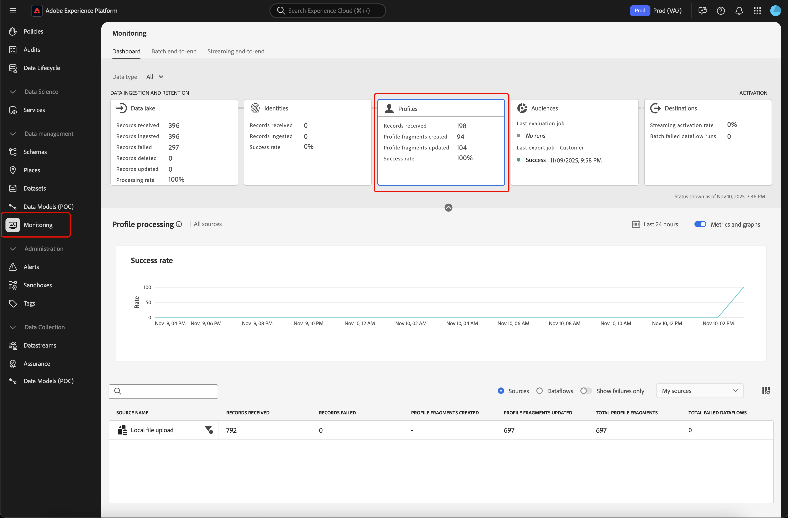
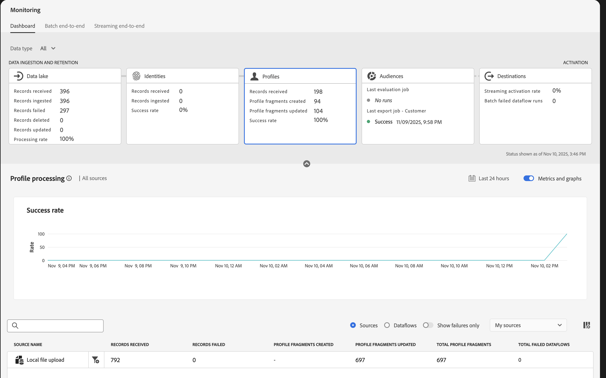
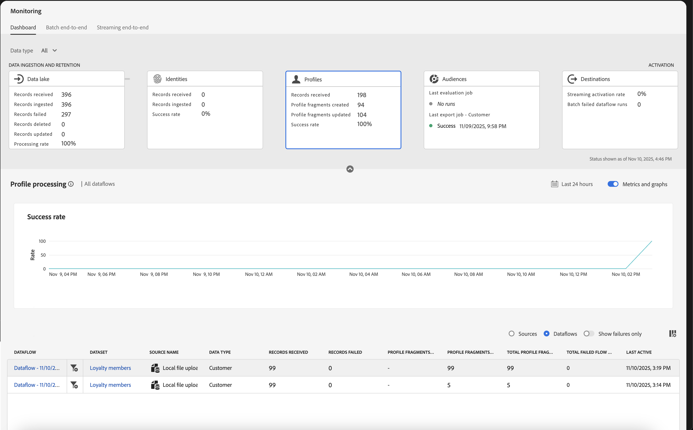
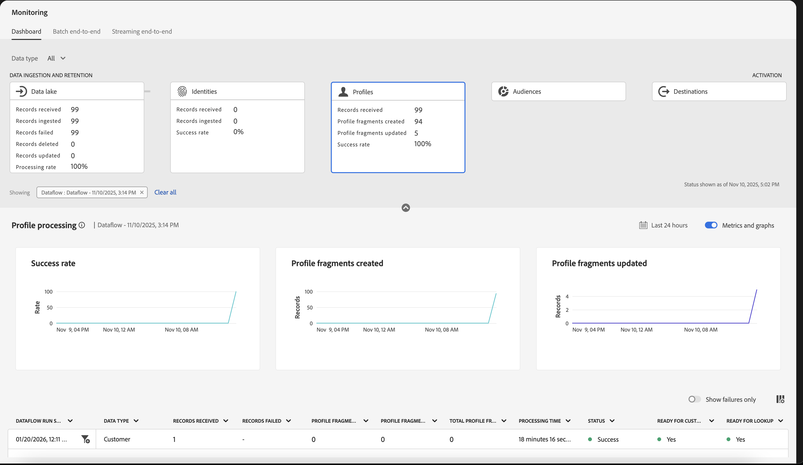
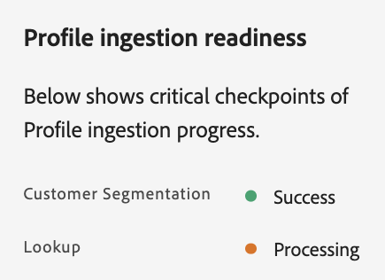
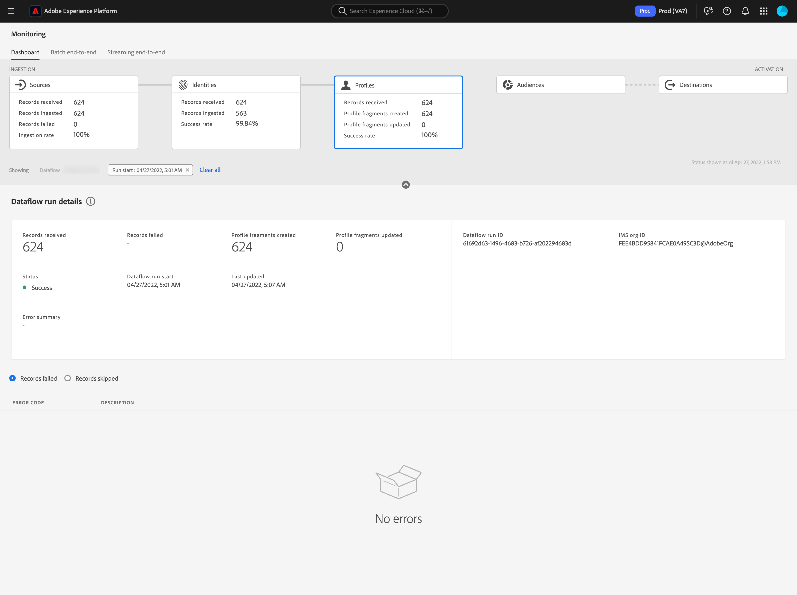

# UIでのプロファイルのデータフローの監視

リアルタイムの顧客プロファイルにより、オンライン、オフライン、CRM、サードパーティなど、複数のチャネルからのデータを組み合わせることで、個々の顧客の全体像を把握できます。 プロファイルにより、顧客データを統合し、あらゆる顧客インタラクションに関する実用的でタイムスタンプ付きのアカウントを提供します。

モニタリングダッシュボードでは、データのプロファイルのステータスなど、プロファイル内のデータのアクティビティを視覚的に表示できます。 このチュートリアルでは、Experience Platform ユーザーインターフェイスを使用してモニタリングダッシュボードを使用してデータのプロファイルをモニタリングし、プロファイル処理のステータスをトラッキングする方法について説明します。

## はじめに {#getting-started}

このガイドは、Adobe Experience Platform の次のコンポーネントを実際に利用および理解しているユーザーを対象としています。

- [&#x200B; データフロー](../home.md): データフローは、Experience Platform間でデータを移動するデータジョブを表します。 データフローは異なるサービスをまたいで設定され、ソースコネクタからターゲットデータセット、[!DNL Identity] および [!DNL Profile]、[!DNL Destinations] へとデータを移動できます。
   - [データフロー実行](../../sources/notifications.md)：データフロー実行は、選択したデータフローの頻度設定に基づいて繰り返しスケジュールされたジョブです。
- [リアルタイム顧客プロファイル](../../profile/home.md)：複数のソースから集計したデータに基づいて、統合されたリアルタイムの顧客プロファイルを提供します。
- [サンドボックス](../../sandboxes/home.md)：[!DNL Experience Platform] には、単一の [!DNL Experience Platform] インスタンスを別個の仮想環境に分割してデジタルエクスペリエンスアプリケーションの開発と発展を支援する仮想サンドボックスが用意されています。

## プロファイルモニタリングダッシュボード {#profile-metrics}

>[!CONTEXTUALHELP]
>id="platform_monitoring_profile_processing"
>title="プロファイル処理"
>abstract="プロファイル処理ビューには、プロファイルサービスに取り込まれたレコードに関する情報 (作成されたプロファイルフラグメントの数、更新されたプロファイルフラグメントの数、プロファイルフラグメントの総数など) が含まれます。"
>text="Learn more in documentation"

>[!CONTEXTUALHELP]
>id="platform_monitoring_dataflow_run_details_profile"
>title="データフロー実行の詳細"
>abstract="データフロー実行の詳細ページには、プロファイルデータフロー実行に関する詳しい情報 (組織 ID やデータフロー実行 ID など) が表示されます。"

**[!UICONTROL Profiles]** ダッシュボードにアクセスするには、左側のナビゲーションで「**[!UICONTROL Monitoring]**」を選択します。 **[!UICONTROL Monitoring]** ページで、**[!UICONTROL Profiles]** カードを選択します。

メインの&#x200B;**[!UICONTROL Profiles]** ダッシュボードでは、**[!UICONTROL Profiles]** カードに、受信したレコードの合計数、作成および更新されたプロファイルフラグメントの数、作成および更新されたプロファイルフラグメントの成功率に関する情報が表示されます。

ダッシュボード自体には、プロファイル処理に関する指標が含まれています。 デフォルトでは、ダッシュボードには、過去24時間の組織のソースに関するプロファイル処理の詳細が表示されます。

[!UICONTROL Profile processing] ページには、作成されたプロファイルフラグメントの数、更新されたプロファイルフラグメントの数、プロファイルフラグメントの合計数など、[!DNL Profile]に取り込まれたレコードに関する情報が含まれます。

このダッシュボードビューでは、次の指標を使用できます。

| 指標 | 説明 |
| -------| ----------- |
| **[!UICONTROL Source name]** | ソースの名前。 |
| **[!UICONTROL Records received]** | データレイクから受信したレコードの数。 |
| **[!UICONTROL Records failed]** | エラーが発生したため、取り込まれたが[!DNL Profile]に取り込まれなかったレコードの数。 |
| **[!UICONTROL Profile fragments created]** | 追加された純新規[!DNL Profile] フラグメントの数。 |
| **[!UICONTROL Profile fragments updated]** | 既存の[!DNL Profile] フラグメントの数が更新されました。 |
| **[!UICONTROL Total Profile fragments]** | [!DNL Profile]に書き込まれたレコードの合計数。既存のすべての[!DNL Profile] フラグメントが更新され、新しく作成された[!DNL Profile] フラグメントが含まれます。 |
| **[!UICONTROL Total failed dataflows]** | 失敗したデータフロー実行の数。 |

ソース名の横にあるフィルターアイコン を選択すると、選択したソースのデータフローのプロファイル処理情報を表示できます。

または、トグルで「**[!UICONTROL Dataflows]**」を選択して、過去24時間の組織のデータフローのプロファイル処理の詳細を表示することもできます。

このダッシュボードビューでは、次の指標を使用できます。

| 指標 | 説明 |
| -------| ----------- |
| **[!UICONTROL Dataflow]** | データフローの名前。 |
| **[!UICONTROL Dataset]** | データフローが挿入するデータセットの名前。 |
| **[!UICONTROL Source name]** | データフローが属するソースの名前。 |
| **[!UICONTROL Data type]** | データセットから受信するデータのタイプ。 |
| **[!UICONTROL Records received**] | データレイクから受信したレコードの数。 |
| **[!UICONTROL Records failed]** | エラーが発生したため、取り込まれたが[!DNL Profile]に取り込まれなかったレコードの数。 |
| **[!UICONTROL Profile fragments created]** | 追加された純新規[!DNL Profile] フラグメントの数。 |
| **[!UICONTROL Profile fragments updated]** | 更新された既存の[!DNL Profile] フラグメントの数 |
| **[!UICONTROL Total Profile fragments]** | [!DNL Profile]に書き込まれたレコードの合計数。既存のすべての[!DNL Profile] フラグメントが更新され、新しく作成された[!DNL Profile] フラグメントが含まれます。 |
| **[!UICONTROL Total failed flow runs]** | 失敗したデータフロー実行の数。 |
| **[!UICONTROL Last active]** | データフローが最後に実行されたタイムスタンプ。 |

データフロー実行開始時間の横にあるフィルターアイコン を選択すると、[!DNL Profile] データフロー実行に関する詳細が表示されます。

すべてのデータフロー実行を表示するダッシュボードが表示されます。 このダッシュボードには、データフローの実行に関する指標と、成功率、作成されたプロファイルフラグメント、更新されたプロファイルフラグメントを示すグラフが含まれています。

このダッシュボードビューでは、次の指標を使用できます。

>[!NOTE]
>
>データフロー実行が&#x200B;**[!UICONTROL Processing]**&#x200B;状態の場合、取り込みプロセスでチェックポイントのステータスを確認することで、準備状況に関する情報を確認できます。
>
>{zoomable="yes" width="300"}

| 指標 | 説明 |
| ------ | ----------- |
| **[!UICONTROL Dataflow run start]** | データフローの実行がUTCで開始された時間。 |
| **[!UICONTROL Data type]** | データフローで受信されるデータのタイプ。 |
| **[!UICONTROL Records received]** | データレイクから受信したレコードの数。 |
| **[!UICONTROL Records failed]** | エラーが発生したため、取り込まれたが[!DNL Profile]に取り込まれなかったレコードの数。 |
| **[!UICONTROL Profile fragments created]** | 追加された純新規[!DNL Profile] フラグメントの数。 |
| **[!UICONTROL Profile fragments updated]** | 既存の[!DNL Profile] フラグメントの数が更新されました。 |
| **[!UICONTROL Total profile fragments]** | [!DNL Profile]に書き込まれたレコードの合計数。既存のすべての[!DNL Profile] フラグメントが更新され、新しく作成された[!DNL Profile] フラグメントが含まれます。 |
| **[!UICONTROL Processing time]** | データフロー実行が処理するのにかかる時間。 |
| **[!UICONTROL Status]** | データフロー実行のステータス。 指定できる値は、[!UICONTROL Success]、[!UICONTROL Failed]、[!UICONTROL Queued]、[!UICONTROL Processing]です。 |
| **[!UICONTROL Ready for customer segmentation]** | 取り込んだレコードを顧客セグメンテーションで使用する準備ができているかどうかを示すステータス。 指定できる値は、[!UICONTROL Yes]、[!UICONTROL Failed]、[!UICONTROL Queued]、[!UICONTROL Processing]です。 データフローの&#x200B;**ステータス**&#x200B;が処理中であっても、このフィールドの値が「はい」の場合、顧客セグメント化でプロファイルを使用できます。 |
| **[!UICONTROL Ready for lookup]** | 取り込んだレコードがAdobe Journey Optimizer ルックアップで使用できる状態であるかどうかを示すステータス。  指定できる値は、[!UICONTROL Yes]、[!UICONTROL Failed]、[!UICONTROL Queued]、[!UICONTROL Processing]です。 データフローの&#x200B;**ステータス**&#x200B;が処理中であっても、このフィールドの値が「はい」の場合、Journey Optimizer ルックアップでプロファイルを使用できます。 |

[!UICONTROL Dataflow run details] ページには、組織IDとデータフロー実行IDなど、[!DNL Profile] データフロー実行に関する詳細が表示されます。 このページには、取り込みプロセスでエラーが発生した場合に[!DNL Profile]が提供する対応するエラーコードとエラーメッセージも表示されます。

このダッシュボードビューでは、次の指標を使用できます。

| 指標 | 説明 |
| -------| ----------- |
| **[!UICONTROL Records received]** | データレイクから受信したレコードの数。 |
| **[!UICONTROL Records failed]** | エラーが発生したため、取り込まれたが[!DNL Profile]に取り込まれなかったレコードの数。 |
| **[!UICONTROL Profile fragments created]** | 追加された純新規[!DNL Profile] フラグメントの数。 |
| **[!UICONTROL Profile fragments updated]** | 既存の[!DNL Profile] フラグメントの数が更新されました。 |
| **[!UICONTROL Status]** | データフローの全体的なステータスを定義します。 使用可能なステータス値は次のとおりです。 <ul><li>`Success`: データフローがアクティブであり、提供されたスケジュールに従ってデータを取り込んでいることを示します。</li><li>`Failed`: エラーが原因でデータフローのアクティブ化プロセスが中断されたことを示します。 </li><li>`Processing`: データフローがまだアクティブでないことを示します。 このステータスは、多くの場合、新しいデータフローを作成した直後に発生します。</li></ul> |
| **[!UICONTROL Dataflow run start]** | データフローの実行を開始した日時。 |
| **[!UICONTROL Last updated]** | データフローが最後に更新された日時。 |
| **[!UICONTROL Error summary]** | データフロー実行に失敗した場合、エラーコードと、データフロー実行が失敗した理由の概要が表示されます。 |
| **[!UICONTROL Dataflow run ID]** | データフロー実行のID。 |
| **[!UICONTROL IMS org ID]** | データフロー実行が属する組織ID。 |

さらに、トグルを選択して、失敗したレコードまたはスキップしたレコードを表示できます。 「エラー」セクションには、エラーコードと、失敗または除外されたレコード数に関する詳細が含まれます。
