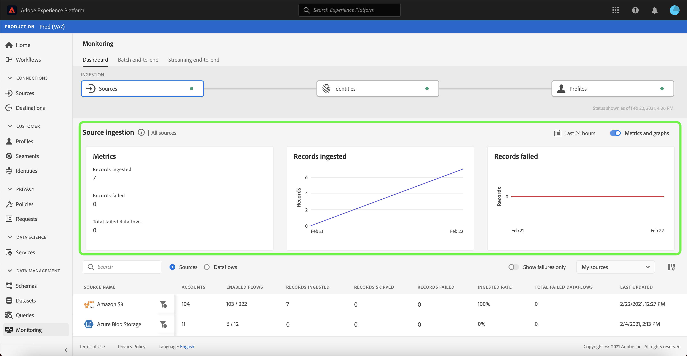

# UI でのソースのデータフローの監視

>[!IMPORTANT]
>
>ストリーミングソース ( [HTTP API ソース](../../sources/connectors/streaming/http.md) は、現在、監視ダッシュボードではサポートされていません。 現時点では、ダッシュボードを使用してバッチソースを監視することのみできます。

Adobe Experience Platform では、様々なソースからデータを取り込み、Experience Platform 内で分析し、様々な目的でアクティブ化します。Platform では、データフローに透明性を提供することで、この非線形の可能性があるデータフローのトラッキングプロセスを容易にします。

監視ダッシュボードは、データフローのジャーニーを視覚的に表します。 集計された監視ビューを使用し、ソースレベルからデータフロー、およびデータフローの実行に垂直に移動して、データフローの成功または失敗に貢献する対応する指標を表示できます。 また、監視ダッシュボードのクロスサービス監視機能を使用して、ソースからへのデータフローのジャーニーを監視することもできます。 [!DNL Identity Service]、および [!DNL Profile].

このチュートリアルでは、集計された監視ビューとクロスサービス監視の両方を使用してデータフローを監視する手順を説明します。

## はじめに {#getting-started}

このチュートリアルは、Adobe Experience Platform の次のコンポーネントを実際に利用および理解しているユーザーを対象としています。

* [データフロー](../home.md)：データフローは、Platform 間でデータを移動するデータジョブを表します。データフローは異なるサービスをまたいで設定され、ソースコネクタからターゲットデータセット、[!DNL Identity] および [!DNL Profile]、[!DNL Destinations] へとデータを移動できます。
   * [データフローの実行](../../sources/notifications.md):データフローの実行は、選択したデータフローの頻度設定に基づく、定期的にスケジュールされたジョブです。
* [ソース](../../sources/home.md):Experience Platformを使用すると、様々なソースからデータを取り込みながら、Platform サービスを使用して、受信データの構造化、ラベル付け、拡張をおこなうことができます。
* [ID サービス](../../identity-service/home.md)：デバイスやシステム間で ID を関連付けることで、個々の顧客とそのビヘイビアーへの理解を深めることができます。
* [リアルタイム顧客プロファイル](../../profile/home.md)：複数のソースから集約されたデータに基づいて、統合されたリアルタイムのコンシューマープロファイルを提供します。
* [サンドボックス](../../sandboxes/home.md)：Experience Platform は、単一の Platform インスタンスを別々の仮想環境に分割して、デジタルエクスペリエンスアプリケーションの開発と発展を支援する仮想サンドボックスを提供します。

## 集計された監視ビュー {#aggregated-monitoring-view}

>[!CONTEXTUALHELP]
>id="platform_monitoring_source_ingestion"
>title="ソースの取り込み"
>abstract="ソース処理には、取り込まれたレコードと失敗したレコードを含む、データレイクサービスのデータアクティビティのステータスと指標に関する情報が含まれます。 指標とグラフの詳細については、指標定義ガイドを参照してください。"
>text="Learn more in documentation"

>[!CONTEXTUALHELP]
>id="platform_monitoring_dataflow_run_details_ingestion"
>title="データフロー実行の詳細"
>abstract="ソース処理には、取り込まれたレコードと失敗したレコードを含む、データレイクサービスのデータアクティビティのステータスと指標に関する情報が含まれます。 指標とグラフの詳細については、指標定義ガイドを参照してください。"
>text="Learn more in documentation"

内 [Platform UI](https://platform.adobe.com)を選択します。 **[!UICONTROL 監視]** 左側のナビゲーションから [!UICONTROL 監視] ダッシュボード。 この [!UICONTROL 監視] ダッシュボードには、ソースからソースへのデータトラフィックの状態に関するインサイトを含む、すべてのソースデータフローに関する指標と情報が含まれます。 [!DNL Identity Service]、および [!DNL Profile].

ダッシュボードの中央には、 [!UICONTROL ソースの取り込み] 取得されたレコードと失敗したレコードに関するデータを表示する指標とグラフを含むパネル。

デフォルトでは、表示されるデータには、過去 24 時間のインジェスト率が含まれています。 選択 **[!UICONTROL 過去 24 時間]** を使用して、表示されるレコードの時間枠を調整します。

カレンダーポップアップウィンドウが開き、別の取り込み時間枠のオプションが表示されます。 選択 **[!UICONTROL 過去 30 日間]** 次に、 **[!UICONTROL 適用]**

グラフはデフォルトで有効になっています。無効にすると、以下のソースのリストが展開されます。 を選択します。 **[!UICONTROL 指標とグラフ]** を切り替えて、グラフを無効にします。

| ソースの取り込み | 説明 |
| ---------------- | ----------- |
| [!UICONTROL 取り込まれたレコード ] | 取り込まれたレコードの合計数。 |
| [!UICONTROL 失敗したレコード] | データのエラーが原因で取り込まれなかったレコードの合計数です。 |
| [!UICONTROL 失敗したデータフローの合計] | を含むデータフローの合計数 `failed` ステータス。 |

ソースの取り込みリストには、1 つ以上の既存のアカウントを含むすべてのソースが表示されます。 また、このリストには、適用した時間枠に基づく、各ソースの取り込み率、失敗したレコードの数、失敗したデータフローの合計数に関する情報も含まれます。

ソースのリストを並べ替えるには、「 **[!UICONTROL マイソース]** 次に、ドロップダウンメニューから選択したカテゴリを選択します。 例えば、クラウドストレージに焦点を当てるには、「  **[!UICONTROL クラウドストレージ]**

すべてのソースの既存のデータフローをすべて表示するには、「 」を選択します。 **[!UICONTROL データフロー]**.

または、検索バーにソースを入力して、1 つのソースを分離することもできます。 ソースを特定したら、フィルターアイコンを選択します。  その横に、アクティブなデータフローのリストを表示します。

データフローのリストが表示されます。 リストを絞り込み、エラーのあるデータフローに焦点を当てるには、「 」を選択します。 **[!UICONTROL 失敗のみを表示]**.

監視するデータフローを見つけ、フィルターアイコンを選択します。  の横に、実行ステータスの詳細を表示します。

データフローの実行ページには、データフローの実行開始日、データのサイズ、ステータス、および処理時間に関する情報が表示されます。 フィルターアイコンを選択します。  をクリックし、データフローの実行の詳細を確認します。

この [!UICONTROL データフロー実行の詳細] ページには、データフローのメタデータ、部分取り込みステータス、エラー概要に関する情報が表示されます。 エラー概要には、取り込みプロセスでエラーが発生した手順を示す特定の最上位エラーが含まれます。

下にスクロールして、発生したエラーに関する詳細情報を確認します。

この [!UICONTROL データフロー実行エラー] パネルには、データフローの取り込み失敗を引き起こした特定のエラーおよびエラーコードが表示されます。 このシナリオでは、マッパー変換エラーが発生し、結果として 24 件のレコードが失敗しました。

選択 **[!UICONTROL ファイル]** を参照してください。

この [!UICONTROL ファイル] パネルには、ファイルの名前とパスに関する情報が含まれます。

エラーの詳細な表現を得るには、 **[!UICONTROL エラー診断をプレビュー]**.

この [!UICONTROL エラー診断のプレビュー] ウィンドウが表示され、データフローで最大 100 個のエラーのプレビューが表示されます。 次を選択できます。 **[!UICONTROL ダウンロード]** を使用して curl コマンドを取得します。このコマンドを使用すると、エラー診断をダウンロードできます。

完了したら、「 **[!UICONTROL 閉じる]**

上部のヘッダーにあるパンくずリストシステムを使用すると、 [!UICONTROL 監視] ダッシュボード。 選択 **[!UICONTROL 実行開始：2/14/2021, 9:47 PM]** 前のページに戻り、「 **[!UICONTROL データフロー：ロイヤリティデータ取り込みデモ — 失敗]** をクリックして、データフローページに戻ります。

## クロスサービス監視 {#cross-service-monitoring}

ダッシュボードの上部には、ソースレベルからへの取り込みフローが表示されます。 [!DNL Identity Service]、および [!DNL Profile]. 各セルには、取り込みの段階で発生したエラーの有無を示すドットマーカーが含まれます。 緑の点はエラーのない取り込みを意味し、赤の点はその取り込みの特定の段階でエラーが発生したことを意味します。

データフローページで、成功したデータフローを探し、フィルターアイコンを選択します。  の横にある、データフローの実行情報を確認します。

この [!UICONTROL ソースの取り込み] ページには、データフローの正常な取り込みを確認する情報が含まれています。 ここから、ソースレベルからへのデータフローのジャーニーの監視を開始できます [!DNL Identity Service]を選択し、 [!DNL Profile].

選択 **[!UICONTROL ID]** インジェストを [!UICONTROL ID] ステージ。

### [!DNL Identity] 指標 {#identity-metrics}

>[!CONTEXTUALHELP]
>id="platform_monitoring_identity_processing"
>title="ID 処理"
>abstract="ID 処理には、ID サービスに取り込まれたレコードに関する情報（追加された ID の数、作成されたグラフ、更新されたグラフなど）が含まれます。 指標とグラフの詳細については、指標定義ガイドを参照してください。"
>text="Learn more in documentation"

>[!CONTEXTUALHELP]
>id="platform_monitoring_dataflow_run_details_identity"
>title="データフロー実行の詳細"
>abstract="データフローの実行の詳細ページには、IMS 組織 ID やデータフローの実行 ID など、ID データフローの実行に関する詳細が表示されます。"

この [!UICONTROL ID 処理] ページには、次の場所に取り込まれたレコードに関する情報が含まれます： [!DNL Identity Service]（追加された id 数、作成されたグラフ、更新されたグラフなど）

フィルターアイコンを選択します。  を追加し、 [!DNL Identity] データフローの実行。

| ID 指標 | 説明 |
| ---------------- | ----------- |
| [!UICONTROL 受信したレコード] | から受信したレコードの数 [!DNL Data Lake]. |
| [!UICONTROL 失敗したレコード] | データのエラーが原因で Platform に取り込まれなかったレコードの数。 |
| [!UICONTROL スキップされたレコード] | 取り込まれたが、に取り込まれなかったレコードの数 [!DNL Identity Service] レコード行には識別子が 1 つしかなかったので |
| [!UICONTROL 取り込まれたレコード] | に取り込まれたレコードの数 [!DNL Identity Service]. |
| [!UICONTROL 合計レコード数] | 失敗したレコード、スキップされたレコードを含む、すべてのレコードの合計数 [!DNL Identities] 追加されたレコードと重複したレコード |
| [!UICONTROL 追加された ID] | に追加された新しい識別子の数 [!DNL Identity Service]. |
| [!UICONTROL 作成されたグラフ] | で作成された新しい ID グラフの数 [!DNL Identity Service]. |
| [!UICONTROL 更新されたグラフ] | 新しいエッジで更新された既存の ID グラフの数。 |
| [!UICONTROL 失敗したデータフローの実行] | 失敗したデータフロー実行の数。 |
| [!UICONTROL 処理時間] | 取り込み開始から完了までのタイムスタンプ。 |
| [!UICONTROL ステータス] | データフローの全体的なステータスを定義します。 可能なステータス値は次のとおりです。 <ul><li>`Success`:データフローがアクティブで、提供されたスケジュールに従ってデータを取り込んでいることを示します。</li><li>`Failed`:データフローのアクティベーションプロセスがエラーが原因で中断されたことを示します。 </li><li>`Processing`:データフローがまだアクティブでないことを示します。 このステータスは、多くの場合、新しいデータフローの作成直後に発生します。</li></ul> |

この [!UICONTROL データフロー実行の詳細] ページには、 [!DNL Identity] データフローの実行（IMS Org ID とデータフローの実行 ID を含む）。 また、このページには、 [!DNL Identity Service]は、取得プロセスでエラーが発生した場合に使用します。

選択 **[!UICONTROL 実行開始：2/14/2021, 9:47 PM]** 前のページに戻る

次の [!UICONTROL ID 処理] ページ、選択 **[!UICONTROL プロファイル]** をクリックして、 [!UICONTROL プロファイル] ステージ。

### [!DNL Profile] 指標 {#profile-metrics}

>[!CONTEXTUALHELP]
>id="platform_monitoring_profile_processing"
>title="プロファイルの処理"
>abstract="プロファイル処理には、作成されたプロファイルフラグメントの数、更新されたプロファイルフラグメントの数、プロファイルフラグメントの合計数など、プロファイルサービスに取り込まれたレコードに関する情報が含まれます。"
>text="Learn more in documentation"

>[!CONTEXTUALHELP]
>id="platform_monitoring_dataflow_run_details_profile"
>title="データフロー実行の詳細"
>abstract="データフローの実行の詳細ページには、IMS 組織 ID やデータフローの実行 ID など、プロファイルのデータフローの実行に関する詳細が表示されます。"

この [!UICONTROL プロファイルの処理] ページには、次の場所に取り込まれたレコードに関する情報が含まれます： [!DNL Profile]（作成したプロファイルフラグメントの数、更新したプロファイルフラグメントの数、プロファイルフラグメントの合計数を含む）。

フィルターアイコンを選択します。  を追加し、 [!DNL Profile] データフローの実行。

| プロファイル指標 | 説明 |
| --------------- | ----------- |
| [!UICONTROL 受信したレコード] | から受信したレコードの数 [!DNL Data Lake]. |
| [!UICONTROL 失敗したレコード ] | 取り込まれたが、に取り込まれなかったレコードの数 [!DNL Profile] エラーが原因です。 |
| [!UICONTROL 追加されたプロファイルフラグメント] | 新規の純数 [!DNL Profile] フラグメントが追加されました。 |
| [!UICONTROL 更新されたプロファイルフラグメント] | 既存の [!DNL Profile] 更新されたフラグメント |
| [!UICONTROL 合計プロファイルフラグメント] | に書き込まれたレコードの合計数 [!DNL Profile]既存の [!DNL Profile] 更新されたフラグメントと新しいフラグメント [!DNL Profile] フラグメントが作成されました。 |
| [!UICONTROL 失敗したデータフローの実行] | 失敗したデータフロー実行の数。 |
| [!UICONTROL 処理時間] | 取り込み開始から完了までのタイムスタンプ。 |
| [!UICONTROL ステータス] | データフローの全体的なステータスを定義します。 可能なステータス値は次のとおりです。 <ul><li>`Success`:データフローがアクティブで、提供されたスケジュールに従ってデータを取り込んでいることを示します。</li><li>`Failed`:データフローのアクティベーションプロセスがエラーが原因で中断されたことを示します。 </li><li>`Processing`:データフローがまだアクティブでないことを示します。 このステータスは、多くの場合、新しいデータフローの作成直後に発生します。</li></ul> |

この [!UICONTROL データフロー実行の詳細] ページには、 [!DNL Profile] データフローの実行（IMS Org ID とデータフローの実行 ID を含む）。 また、このページには、 [!DNL Profile]は、取得プロセスでエラーが発生した場合に使用します。

## 次の手順 {#next-steps}

このチュートリアルに従うことで、ソースレベルからへの取り込みデータフローを正常に監視できました [!DNL Identity Service]、および [!DNL Profile]、 **[!UICONTROL 監視]** ダッシュボード。 また、取り込みプロセス中にデータフローが失敗した原因となるエラーも正常に識別されました。 詳しくは、次のドキュメントを参照してください。

* [リアルタイム顧客プロファイルの概要](../../profile/home.md)
* [Data Science Workspace の概要](../../data-science-workspace/home.md)
