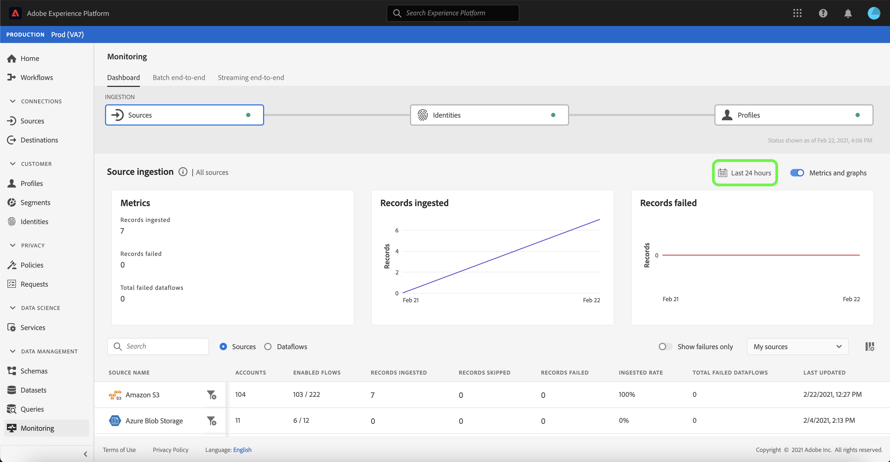
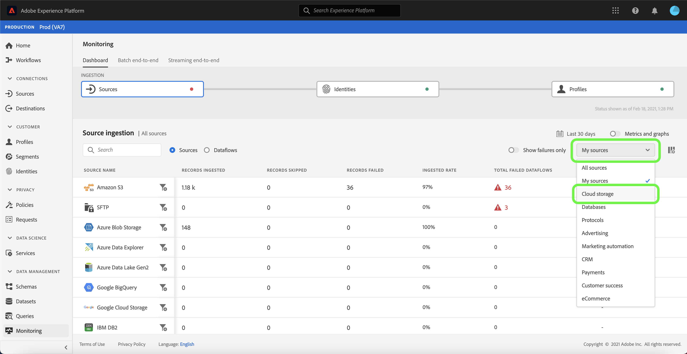
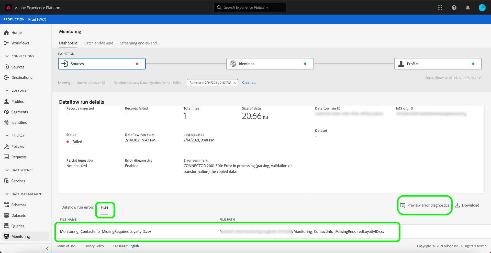
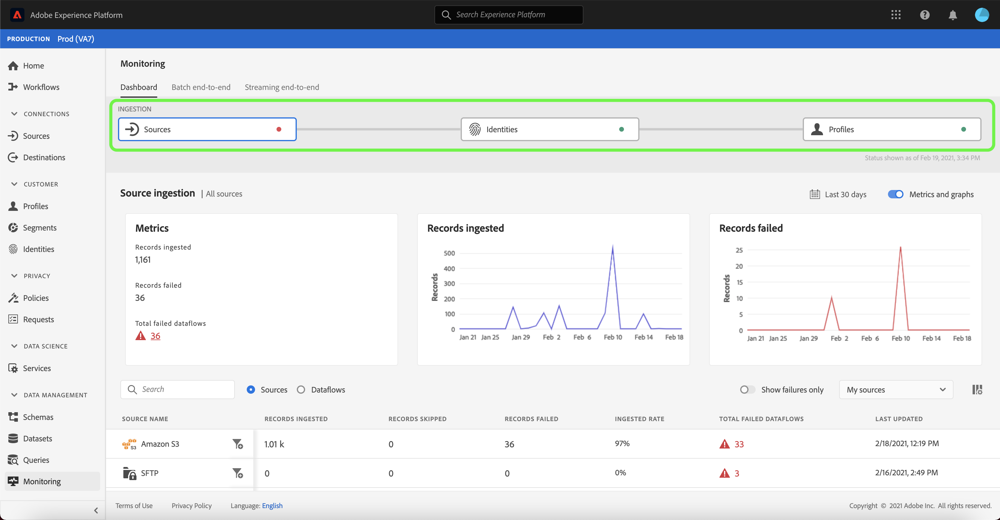
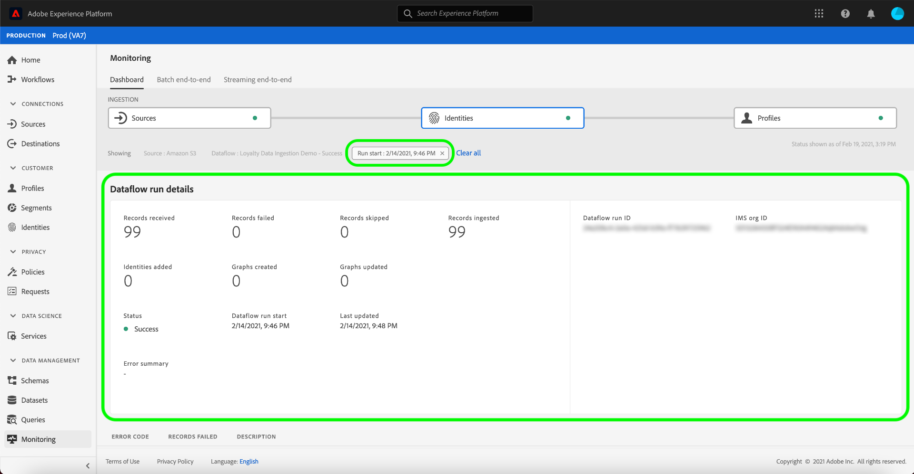

# UI でのソースのデータフローの監視

>[!IMPORTANT]
>
>[HTTP API ソース ](../../sources/connectors/streaming/http.md) などのストリーミングソースは、現在、監視ダッシュボードではサポートされていません。 現時点では、ダッシュボードを使用してバッチソースを監視することのみ可能です。

Adobe Experience Platform では、様々なソースからデータを取り込み、Experience Platform 内で分析し、様々な目的でアクティブ化します。Platform では、データフローに透明性を提供することで、この非線形の可能性があるデータフローのトラッキングプロセスを容易にします。

監視ダッシュボードは、データフローのジャーニーを視覚的に表します。 集計された監視ビューを使用して、ソース・レベルからデータフロー、およびデータフロー実行に垂直に移動し、データフローの成功または失敗に貢献する対応する指標を表示できます。 また、監視ダッシュボードのクロスサービス監視機能を使用して、ソースから [!DNL Identity Service]、[!DNL Profile] へのデータフローのジャーニーを監視することもできます。

このチュートリアルでは、集計された監視ビューとクロスサービス監視の両方を使用してデータフローを監視する手順を説明します。

## はじめに

このチュートリアルは、Adobe Experience Platform の次のコンポーネントを実際に利用および理解しているユーザーを対象としています。

* [データフロー](../home.md)：データフローは、Platform 間でデータを移動するデータジョブを表します。データフローは異なるサービスをまたいで設定され、ソースコネクタからターゲットデータセット、[!DNL Identity] および [!DNL Profile]、[!DNL Destinations] へとデータを移動できます。
   * [データフローの実行](../../sources/notifications.md):データフロー実行は、選択したデータフローの頻度設定に基づく定期的なスケジュール済みジョブです。
* [ソース](../../sources/home.md):Experience Platformを使用すると、様々なソースからデータを取り込みながら、Platform サービスを使用して、受信データの構造化、ラベル付け、拡張をおこなうことができます。
* [ID サービス](../../identity-service/home.md)：デバイスやシステム間で ID を関連付けることで、個々の顧客とそのビヘイビアーへの理解を深めることができます。
* [リアルタイム顧客プロファイル](../../profile/home.md)：複数のソースから集約されたデータに基づいて、統合されたリアルタイムのコンシューマープロファイルを提供します。
* [サンドボックス](../../sandboxes/home.md)：Experience Platform は、単一の Platform インスタンスを別々の仮想環境に分割して、デジタルエクスペリエンスアプリケーションの開発と発展を支援する仮想サンドボックスを提供します。

## 集計された監視ビュー

[Platform UI](https://platform.adobe.com) で、左側のナビゲーションから「**[!UICONTROL 監視]**」を選択して、「[!UICONTROL  監視 ]」ダッシュボードにアクセスします。 [!UICONTROL  監視 ] ダッシュボードには、ソースから [!DNL Identity Service] および [!DNL Profile] へのデータトラフィックのヘルスに関するインサイトを含む、すべてのソースデータフローに関する指標と情報が含まれています。

ダッシュボードの中央には「[!UICONTROL  ソースの取り込み ]」パネルがあり、取り込まれたレコードと失敗したレコードに関するデータを表示する指標とグラフが含まれています。

デフォルトでは、表示されるデータには、過去 24 時間のインジェスト率が含まれています。 「**[!UICONTROL 過去 24 時間]**」を選択して、表示されるレコードの時間枠を調整します。

カレンダーのポップアップウィンドウが表示され、代替の取り込み時間枠のオプションが表示されます。 「**[!UICONTROL 過去 30 日間]**」を選択し、「**[!UICONTROL 適用]**」を選択します。

グラフはデフォルトで有効になっており、無効にして以下のソースのリストを展開できます。 「**[!UICONTROL 指標とグラフ]**」切り替えを選択してグラフを無効にします。

| ソースの取り込み | 説明 |
| ---------------- | ----------- |
| [!UICONTROL 取り込んだレコード  ] | 取得されたレコードの合計数。 |
| [!UICONTROL 失敗したレコード] | データのエラーが原因で取り込まれなかったレコードの合計数。 |
| [!UICONTROL 失敗したデータフローの合計] | ステータスが `failed` のデータフローの合計数。 |

ソースの取り込みリストには、1 つ以上の既存のアカウントを含むすべてのソースが表示されます。 また、このリストには、適用した時間枠に基づく、各ソースの取り込み率、失敗したレコード数、失敗したデータフローの合計数に関する情報も含まれます。

ソースのリストを並べ替えるには、「**[!UICONTROL My sources]**」を選択し、ドロップダウンメニューから選択したカテゴリを選択します。 例えば、クラウドストレージに焦点を当てるには、**[!UICONTROL クラウドストレージ]** を選択します。

すべてのソースにわたる既存のデータフローをすべて表示するには、**[!UICONTROL Dataflows]** を選択します。

または、検索バーにソースを入力して、1 つのソースを分離することもできます。 ソースを特定したら、横のフィルターアイコン  を選択して、アクティブなデータフローのリストを表示します。

データフローのリストが表示されます。 リストを絞り込み、エラーのあるデータフローに焦点を当てるには、「**[!UICONTROL エラーのみを表示]**」を選択します。

監視するデータフローを探し、その横にあるフィルターアイコン  を選択して、その実行ステータスの詳細を確認します。

データフロー実行ページには、データフローの実行開始日、データのサイズ、ステータス、および処理時間に関する情報が表示されます。 データフローの実行開始時間の横にあるフィルターアイコン  を選択して、そのデータフローの実行の詳細を確認します。

[!UICONTROL Dataflow run details] ページには、データフローのメタデータ、部分取得ステータス、エラー概要に関する情報が表示されます。 エラー概要には、取り込みプロセスでエラーが発生したステップを示す特定の最上位エラーが含まれます。

下にスクロールして、発生したエラーに関する詳細情報を確認します。

[!UICONTROL Dataflow run errors] パネルに、データフローの取り込みエラーを引き起こした特定のエラーおよびエラーコードが表示されます。 このシナリオでは、マッパー変換エラーが発生し、24 件のレコードが失敗しました。

詳細については、「**[!UICONTROL ファイル]**」を選択してください。

[!UICONTROL  ファイル ] パネルには、ファイルの名前とパスに関する情報が表示されます。

エラーをより詳細に表示するには、「**[!UICONTROL エラー診断のプレビュー]**」を選択します。

[!UICONTROL  エラー診断のプレビュー ] ウィンドウが開き、データフローに最大 100 個のエラーのプレビューが表示されます。 「**[!UICONTROL ダウンロード]**」を選択して curl コマンドを取得し、エラー診断をダウンロードできます。

終了したら、「**[!UICONTROL 閉じる]**」を選択します。

上部のヘッダーにあるパンくずシステムを使用して、[!UICONTROL  監視 ] ダッシュボードに戻ることができます。 「**[!UICONTROL 実行開始：2/14/2021、9:47 PM]** で前のページに戻り、「**[!UICONTROL Dataflow:Loyalty Data Ingestion Demo - Failed]** を使用して、データフローページに戻ります。

## クロスサービス監視

ダッシュボードの上部には、ソースレベル、[!DNL Identity Service]、および [!DNL Profile] へのインジェストフローが表示されます。 各セルには、取り込みの段階で発生したエラーの有無を示すドットマーカーが含まれます。 緑の点はエラーのない取り込みを意味し、赤の点は特定の取り込み段階でエラーが発生したことを意味します。

データフローページで、成功したデータフローを探し、その横にあるフィルタアイコン  を選択して、データフローの実行情報を確認します。

[!UICONTROL  ソース取得 ] ページには、データフローの正常な取得を確認する情報が含まれています。 ここから、ソースレベルから [!DNL Identity Service]、さらに [!DNL Profile] へのデータフローのジャーニーの監視を開始できます。

**[!UICONTROL ID]** を選択して、[!UICONTROL ID] ステージで取り込みを確認します。

### [!DNL Identity] 指標

[!UICONTROL ID 処理 ] ページには、追加された ID 数、作成されたグラフ、更新されたグラフなど、[!DNL Identity Service] に取り込まれたレコードに関する情報が含まれます。

データフローの実行開始時間の横にあるフィルターアイコン  を選択して、[!DNL Identity] データフローの実行の詳細を確認します。

| ID 指標 | 説明 |
| ---------------- | ----------- |
| [!UICONTROL 受信済みレコード] | [!DNL Data Lake] から受信したレコードの数。 |
| [!UICONTROL 失敗したレコード] | データのエラーが原因で Platform に取り込まれなかったレコードの数。 |
| [!UICONTROL スキップされたレコード] | レコード行に 1 つの識別子しかないため、[!DNL Identity Service] に取り込まれずに取り込まれたレコードの数。 |
| [!UICONTROL 取り込んだレコード] | [!DNL Identity Service] に取り込まれたレコードの数。 |
| [!UICONTROL 合計レコード数] | 失敗したレコード、スキップしたレコード、[!DNL Identities] 追加されたレコード、重複したレコードを含む、すべてのレコードの合計数。 |
| [!UICONTROL 追加された ID] | [!DNL Identity Service] に追加された新しい識別子の数。 |
| [!UICONTROL 作成したグラフ] | [!DNL Identity Service] で作成された新しい ID グラフの数。 |
| [!UICONTROL グラフの更新] | 新しいエッジで更新された既存の ID グラフの数。 |
| [!UICONTROL 失敗したデータフローの実行] | 失敗したデータフロー実行の数。 |
| [!UICONTROL 処理時間] | 取り込みの開始から完了までのタイムスタンプ。 |
| [!UICONTROL ステータス] | データフローの全体的なステータスを定義します。 可能なステータス値は次のとおりです。 <ul><li>`Success`:データフローがアクティブで、提供されたスケジュールに従ってデータを取り込んでいることを示します。</li><li>`Failed`:データフローのアクティベーションプロセスがエラーによって中断されたことを示します。 </li><li>`Processing`:データフローがまだアクティブでないことを示します。このステータスは、多くの場合、新しいデータフローの作成直後に発生します。</li></ul> |

[!UICONTROL Dataflow run details] ページには、IMS 組織 ID やデータフロー実行 ID など、[!DNL Identity] データフロー実行の詳細が表示されます。 また、このページには、取り込みプロセスでエラーが発生した場合に、対応するエラーコードと [!DNL Identity Service] から提供されるエラーメッセージも表示されます。

「**[!UICONTROL 実行開始：2/14/2021, 9:47 PM]** 前のページに戻ります。

[!UICONTROL ID 処理 ] ページで、「**[!UICONTROL プロファイル]**」を選択して、[!UICONTROL  プロファイル ] ステージでのレコード取り込みのステータスを確認します。

### [!DNL Profile] 指標

[!UICONTROL  プロファイル処理 ] ページには、作成されたプロファイルフラグメントの数、更新されたプロファイルフラグメント、プロファイルフラグメントの合計数など、[!DNL Profile] に取り込まれたレコードに関する情報が含まれます。

データフローの実行開始時間の横にあるフィルターアイコン  を選択して、[!DNL Profile] データフローの実行の詳細を確認します。

| プロファイル指標 | 説明 |
| --------------- | ----------- |
| [!UICONTROL 受信済みレコード] | [!DNL Data Lake] から受信したレコードの数。 |
| [!UICONTROL 失敗したレコード  ] | エラーが原因で [!DNL Profile] に取り込まれなかったレコードの数。 |
| [!UICONTROL プロファイルフラグメントの追加] | 追加された新しい [!DNL Profile] フラグメントの数。 |
| [!UICONTROL プロファイルフラグメントの更新] | 更新された既存の [!DNL Profile] フラグメントの数 |
| [!UICONTROL プロファイルフラグメントの合計] | [!DNL Profile] に書き込まれたレコードの総数。更新された既存の [!DNL Profile] フラグメントと新しく作成された [!DNL Profile] フラグメントをすべて含みます。 |
| [!UICONTROL 失敗したデータフローの実行] | 失敗したデータフロー実行の数。 |
| [!UICONTROL 処理時間] | 取り込みの開始から完了までのタイムスタンプ。 |
| [!UICONTROL ステータス] | データフローの全体的なステータスを定義します。 可能なステータス値は次のとおりです。 <ul><li>`Success`:データフローがアクティブで、提供されたスケジュールに従ってデータを取り込んでいることを示します。</li><li>`Failed`:データフローのアクティベーションプロセスがエラーによって中断されたことを示します。 </li><li>`Processing`:データフローがまだアクティブでないことを示します。このステータスは、多くの場合、新しいデータフローの作成直後に発生します。</li></ul> |

[!UICONTROL Dataflow run details] ページには、IMS 組織 ID やデータフロー実行 ID など、[!DNL Profile] データフロー実行の詳細が表示されます。 また、このページには、取り込みプロセスでエラーが発生した場合に、対応するエラーコードと [!DNL Profile] から提供されるエラーメッセージも表示されます。

## 次の手順

このチュートリアルでは、**[!UICONTROL 監視]** ダッシュボードを使用して、ソースレベル、[!DNL Identity Service]、および [!DNL Profile] への取得データフローを正常に監視しました。 また、取り込みプロセス中のデータフローの失敗に貢献したエラーも正常に識別されました。 詳しくは、次のドキュメントを参照してください。

* [リアルタイム顧客プロファイルの概要](../../profile/home.md)
* [Data Science Workspace の概要](../../data-science-workspace/home.md)
