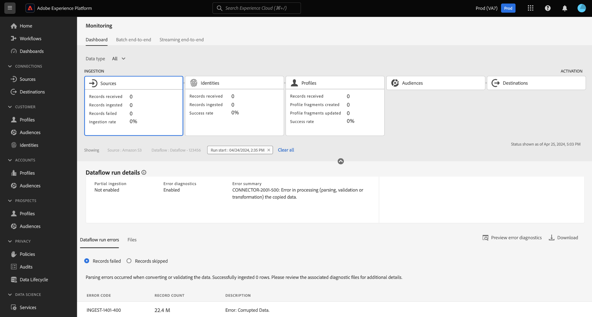

# UI でソースのデータフローを監視

>[!IMPORTANT]
>
>[HTTP API ソース ](../../sources/connectors/streaming/http.md) などのストリーミングソースは、現在、監視ダッシュボードではサポートされていません。 現時点では、バッチソースの監視にのみダッシュボードを使用できます。

このドキュメントでは、モニタリングダッシュボードを使用してExperience Platform UI でソースデータフローをモニタリングする方法について説明します。

## 基本を学ぶ {#get-started}

このチュートリアルは、Adobe Experience Platform の次のコンポーネントを実際に利用および理解しているユーザーを対象としています。

* [ データフロー ](../home.md)：データフローは、Experience Platform間でデータを移動するデータジョブを表します。 データフローは異なるサービスをまたいで設定され、ソースコネクタからターゲットデータセット、[!DNL Identity] および [!DNL Profile]、[!DNL Destinations] へとデータを移動できます。
   * [データフロー実行](../../sources/notifications.md)：データフロー実行は、選択したデータフローの頻度設定に基づいて繰り返しスケジュールされたジョブです。
* [ ソース ](../../sources/home.md):Experience Platformを使用すると、データを様々なソースから取得しながら、Experience Platform サービスを使用して受信データの構造化、ラベル付け、拡張を行うことができます。
* [ID サービス](../../identity-service/home.md)：デバイスやシステム間で ID を橋渡しすることで、個々の顧客とその行動をより確実に把握することができます。
* [リアルタイム顧客プロファイル](../../profile/home.md)：複数のソースから集計したデータに基づいて、統合されたリアルタイムの顧客プロファイルを提供します。
* [ サンドボックス ](../../sandboxes/home.md): Experience Platformには、1 つのExperience Platform インスタンスを別々の仮想環境に分割し、デジタルエクスペリエンスアプリケーションの開発と発展に役立つ仮想サンドボックスが用意されています。

## 監視ダッシュボードを使用したソースデータの監視

>[!CONTEXTUALHELP]
>id="platform_monitoring_source_ingestion"
>title="ソース取り込み"
>abstract="ソース取り込みビューには、データレイクサービスのデータアクティビティステータスや指標に関する情報 (取り込まれたレコードや失敗したレコードなど) が表示されます。指標およびグラフについて詳しくは、指標定義ガイドを参照してください。"
>text="Learn more in documentation"

>[!CONTEXTUALHELP]
>id="platform_monitoring_dataflow_run_details_ingestion"
>title="データフロー実行の詳細"
>abstract="ソース処理ビューには、データレイクサービスのデータアクティビティステータスや指標に関する情報 (取り込まれたレコードや失敗したレコードなど) が表示されます。指標およびグラフについて詳しくは、指標定義ガイドを参照してください。"
>text="Learn more in documentation"

<!-- In the [Experience Platform UI](https://platform.adobe.com), select **[!UICONTROL Monitoring]** from the left navigation to access the [!UICONTROL Monitoring] dashboard. The [!UICONTROL Monitoring] dashboard contains metrics and information on all sources dataflows, including insights into the health of data traffic from a source to [!DNL Identity Service], and to [!DNL Profile].

At the center of the dashboard is the [!UICONTROL Source ingestion] panel, which contains metrics and graphs that display data on records ingested and records failed. -->

監視ダッシュボードで、メインヘッダーから [!UICONTROL  ソース ] を選択し、ソースデータフロー取り込み率の表示でダッシュボードを更新します。

[!UICONTROL  取り込み率 ] グラフには、設定した時間枠に基づいてデータ取り込み率が表示されます。 デフォルトでは、監視ダッシュボードには、過去 24 時間の取り込み率が表示されます。 時間枠の設定手順については、[ 時間枠の監視の設定 ](monitor.md#configure-monitoring-time-frame) に関するガイドを参照してください。

このグラフは、デフォルトで表示できるようになっています。 グラフを非表示にするには、「**[!UICONTROL 指標とグラフ]**」を選択して、切り替えを無効にし、グラフを非表示にします。

ダッシュボードの下部には、既存のすべてのソースデータフローの現在の指標レポートの概要を示すテーブルが表示されます。

| 指標 | 説明 |
| --- | --- |
| 受信したレコード | 特定のソースから受信したレコードの合計数。 |
| 取り込まれたレコード | データレイクに取り込まれたレコードの合計数。 |
| スキップされたレコード | スキップされたレコードの合計数です。 スキップされたレコードとは、取り込みに必要でなかったという理由でスキップされたフィールドを指します。 例えば、部分取り込みを有効にしてソースデータフローを作成した場合、許容可能なエラー率しきい値を設定できます。 取り込みプロセス中、エラーしきい値内にある限り、取り込みは ID フィールドなどの不要なフィールドのレコードをスキップします。 |
| 失敗したレコード | エラーが原因で取り込むことができなかったレコードの合計数です。 |
| 取り込み率 | 受信したレコードの合計数に基づいて取り込まれたレコードの割合。 |
| 失敗したデータフローの合計 | 失敗したデータフローの合計数。 |

{style="table-layout:auto"}

指標テーブルの上にあるオプションを使用して、データをさらにフィルタリングできます。

| フィルターオプション | 説明 |
| --- | --- |
| 検索 | 検索バーを使用して、ビューを単一のソースタイプにフィルタリングします。 |
| ソース | **[!UICONTROL ソース]** を選択してビューをフィルタリングし、ソースタイプごとの指標データを表示します。 これは、監視ダッシュボードが使用するデフォルトの表示です。 |
| データフロー | 「**[!UICONTROL データフロー]**」を選択してビューをフィルタリングし、データフローごとの指標データを表示します。 |
| 失敗のみを表示 | **[!UICONTROL 失敗のみを表示]** を選択して表示をフィルタリングし、取り込み失敗を報告したデータフローのみを表示します。 |
| マイソース | [!UICONTROL  マイソース ] ドロップダウンメニューを使用して、表示をさらにフィルタリングできます。 ドロップダウンメニューを使用すると、カテゴリでビューをフィルタリングできます。 または、「**[!UICONTROL すべてのソース]**」を選択してすべてのソースまたはソースの指標を表示するか、「**[!UICONTROL マイソース]**」を選択して、対応するアカウントを持つソースのみを表示できます。 |

{style="table-layout:auto"}

特定のデータフローに取り込まれるデータを監視するには、ソースの横にあるフィルターアイコン  を選択します。

指標テーブルは、選択したソースに対応するアクティブなデータフローのテーブルに更新されます。 この手順では、対応するデータセットやデータタイプなどのデータフローに関する追加情報と、最後にアクティブだった日時を示すタイムスタンプを表示できます。

データフローをさらに詳しく調べるには、データフローの横にあるフィルターアイコン  を選択します。

次に、選択したデータフローのすべてのデータフロー実行イテレーションをリストするインターフェイスに移動します。

データフロー実行は、データフロー実行のインスタンスを表します。 例えば、データフローが 1 時間ごとに午前 9:00、午前 10:00、午前 11:00 に実行されるようにスケジュールされている場合、フロー実行のインスタンスが 3 つ存在します。 フロー実行は、特定の組織に固有です。

特定のデータフロー実行イテレーションの指標を調べるには、データフローの横にあるフィルターアイコン  を選択します。

データフロー実行の詳細ページを使用して、選択した実行イテレーションの指標と情報を表示します。

| データフロー実行の詳細 | 説明 |
| --- | --- |
| 取り込まれたレコード | データフロー実行から取り込まれたレコードの合計数です。 |
| 失敗したレコード | データフロー実行のエラーによって取り込まれなかったレコードの合計数です。 |
| 合計ファイル | データフロー実行のファイルの合計数。 |
| データのサイズ | データフロー実行に含まれるデータの合計サイズ。 |
| データフロー実行 ID | データフロー実行イテレーションの ID。 |
| 組織 ID | データフロー実行が作成された組織の ID。 |
| ステータス | データフロー実行のステータス。 |
| データフローの実行開始 | データフロー実行がいつ開始されたかを示すタイムスタンプ。 |
| データフローの実行終了 | データフロー実行がいつ終了したかを示すタイムスタンプ。 |
| データセット | データフローの作成に使用するデータセット。 |
| データタイプ | データフローに含まれていたデータのタイプ。 |
| 部分取り込み | 部分的なバッチ取得は、設定可能な特定のしきい値まで、エラーを含むデータを取り込む機能です。 この機能を使用すると、正確なデータをすべてExperience Platformに正常に取り込みながら、不正なデータがすべて無効な理由に関する情報と共に個別にバッチ処理されます。 データフローの作成プロセス中に、部分取り込みを有効にすることができます。 |
| エラー診断 | エラー診断は、ソースがエラー診断を生成するように指示します。エラー診断は、後でデータセットアクティビティとデータフローステータスを監視するときに参照できます。 データフローの作成プロセス中に、エラー診断を有効にすることができます。 |
| エラー概要 | データフロー実行が失敗した場合、エラーサマリーには、実行の反復が失敗した理由を要約するエラーコードと説明が表示されます。 |

{style="table-layout:auto"}

データフロー実行でエラーが報告された場合は、[!UICONTROL  データフロー実行エラー ] インターフェイスを使用して、ページの下部まで下にスクロールできます。

「[!UICONTROL  失敗したレコード ]」セクションを使用すると、エラーが原因で取り込まれなかったレコードの指標を表示できます。 包括的なエラーレポートを表示するには、「**[!UICONTROL エラー診断をプレビュー]**」を選択します。 エラー診断およびファイルマニフェストのコピーをダウンロードするには、「**[!UICONTROL ダウンロード]**」を選択したあと、サンプル API 呼び出しをコピーして [!DNL Data Access] API で使用します。

>[!NOTE]
>
>エラー診断を使用できるのは、ソース接続の作成プロセス中にこの機能が有効になった場合のみです。

## 次の手順 {#next-steps}

このチュートリアルでは、**[!UICONTROL モニタリング]** ダッシュボードを使用して、ソースレベルから取り込みデータフローを正常に監視しました。 また、取り込みプロセス中のデータフローの失敗に貢献したエラーを正常に特定しました。 詳しくは、次のドキュメントを参照してください。

* [ID データの監視 ](./monitor-identities.md)。
* [ プロファイルデータの監視 ](./monitor-profiles.md)。
