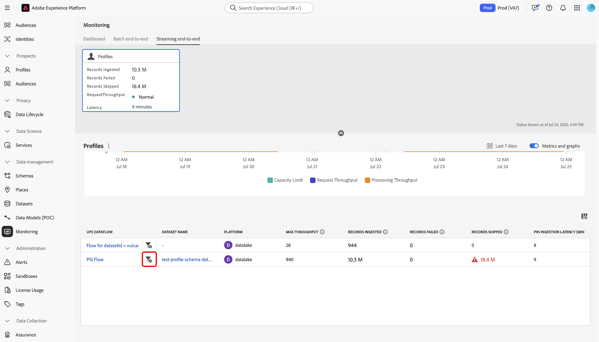
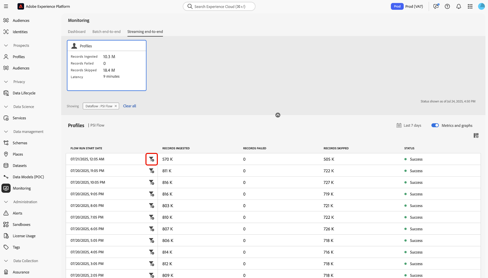

# ストリーミングプロファイル取り込みの監視

Adobe Experience Platform UI のモニタリングダッシュボードを使用すると、組織内でストリーミングプロファイルの取得をリアルタイムにモニタリングできます。 この機能を使用すると、ストリーミングデータに関連するスループット、待ち時間、データ品質指標に関する透明性を高めることができます。 さらに、この機能を使用してプロアクティブなアラートを送信し、実用的なインサイトを取得することで、潜在的な容量違反やデータ取り込みの問題を特定できます。

監視ダッシュボードを使用して、組織内のストリーミングプロファイル取り込みジョブの割合と指標を追跡する方法については、次のガイドを参照してください。

## 基本を学ぶ

このガイドは、Adobe Experience Platform の次のコンポーネントを実際に利用および理解しているユーザーを対象としています。

* [ データフロー ](../home.md)：データフローは、Experience Platform間で情報を転送するデータジョブを表します。 様々なサービスにわたって設定され、ソースコネクタからターゲットデータセット、ID サービス、リアルタイム顧客プロファイル、宛先へのデータの移動を容易にします。
* [ リアルタイム顧客プロファイル ](../../profile/home.md)：リアルタイム顧客プロファイルでは、オンライン、オフライン、CRM、サードパーティなど、複数のソースのデータを、各顧客のアクションにつながる単一のビューに組み合わせることで、すべてのタッチポイントにわたって一貫性のあるパーソナライズされたエクスペリエンスを実現します。
* [ ストリーミング取得 ](../../ingestion/streaming-ingestion/overview.md):Experience Platformのストリーミング取得は、クライアントおよびサーバーサイドデバイスから、リアルタイムでExperience Platformにデータを送信する方法をユーザーに提供します。Experience Platformでは、個々の顧客に対してリアルタイム顧客プロファイルを生成することで、調整された一貫性のある関連性の高いエクスペリエンスを提供できます。&#x200B;ストリーミング取り込みは、これらのプロファイルをできる限り少ない待ち時間で作成する上で重要な役割を果たします。
* [ 処理能力 ](../../landing/license-usage-and-guardrails/capacity.md):Experience Platformの処理能力を使用すると、組織がガードレールの上限を超えたかどうかを把握でき、これらの問題を修正する方法に関する情報が得られます。

>[!NOTE]
>
>ストリーミングスループット容量では、1 秒あたり最大 1500 件のインバウンドイベントをサポートします。 1 秒&#x200B;あたり最大 13,500 件のインバウンドイベントをサポートするストリーミングセグメント化を追加購入できます。 詳しくは、[Real-Time CDP B2C Edition - PrimeおよびUltimate パッケージの製品説明 ](https://helpx.adobe.com/jp/legal/product-descriptions/real-time-customer-data-platform-b2c-edition-prime-and-ultimate-packages.html) を参照してください。

## ストリーミングプロファイル取り込み用の監視指標 {#streaming-profile-metrics}

>[!CONTEXTUALHELP]
>id="platform_monitoring_streaming_profile"
>title="ストリーミングプロファイル取り込みの監視"
>abstract="ストリーミングプロファイルの監視ダッシュボードには、スループット、取り込み率、待ち時間に関する情報が表示されます。 このダッシュボードを使用して、データ処理指標の表示、理解および分析を行います。 のプロファイルをExperience Platformにストリーミングします。"
>text="Learn more in documentation"

>[!CONTEXTUALHELP]
>id="platform_monitoring_streaming_profile_request_throughput"
>title="リクエストのスループット"
>abstract="この指標は、取り込みシステムに入るイベントの 1 秒あたりの数を表します。"
>text="Learn more in documentation"

>[!CONTEXTUALHELP]
>id="platform_monitoring_streaming_profile_processing_throughput"
>title="処理スループット"
>abstract="この指標は、システムによって 1 秒ごとに正常に取り込まれたイベントの数を表します。"
>text="Learn more in documentation"

>[!CONTEXTUALHELP]
>id="platform_monitoring_streaming_profile_p95_ingestion_latency"
>title="P95 取得待ち時間"
>abstract="この指標は、Experience Platformにイベントが到達してからプロファイルストアに正常に取り込まれるまでの 95 パーセンタイルの待ち時間を測定します。"
>text="Learn more in documentation"

>[!CONTEXTUALHELP]
>id="platform_monitoring_streaming_profile_max_throughput"
>title="最大スループット"
>abstract="この指標は、ストリーミングプロファイル取り込みに入る 1 秒あたりのインバウンドリクエストの最大数を表します。"
>text="Learn more in documentation"

>[!CONTEXTUALHELP]
>id="platform_monitoring_streaming_profile_records_ingested"
>title="取り込まれたレコード"
>abstract="この指標は、設定された時間枠内にプロファイルストアに取り込まれたレコードの合計数を表します。"
>text="Learn more in documentation"

>[!CONTEXTUALHELP]
>id="platform_monitoring_streaming_profile_records_failed"
>title="失敗したレコード"
>abstract="この指標は、設定された時間内に、エラーが原因でプロファイルストアへの取り込みに失敗したレコードの合計数を表します。"
>text="Learn more in documentation"

>[!CONTEXTUALHELP]
>id="platform_monitoring_streaming_profile_records_skipped"
>title="スキップされたレコード"
>abstract="この指標は、設定または容量超過が原因で、設定された期間内にドロップされたレコードの合計数を表します。"
>text="Learn more in documentation"

>[!CONTEXTUALHELP]
>id="platform_monitoring_streaming_profile_error_details"
>title="エラーの詳細"
>abstract="この指標は、エラーが原因で失敗したイベントの数を表します。"
>text="Learn more in documentation"

データフローに固有の情報については、指標テーブルを使用します。 各列について詳しくは、次の表を参照してください。

| 指標 | 説明 | ディメンション | 測定頻度 |
| --- | --- | --- | --- |
| リクエストのスループット | この指標は、取り込みシステムに入るイベントの 1 秒あたりの数を表します。 | サンドボックス/データフロー | 60 秒ごとにデータを更新するリアルタイム監視。 |
| 処理スループット | この指標は、システムによって 1 秒ごとに正常に取り込まれたイベントの数を表します。 | サンドボックス/データフロー | 60 秒ごとにデータを更新するリアルタイム監視。 |
| P95 取得待ち時間 | この指標は、Experience Platformにイベントが到達してからプロファイルストアに正常に取り込まれるまでの 95 パーセンタイルの待ち時間を測定します。 | サンドボックス/データフロー | 60 秒ごとにデータを更新するリアルタイム監視。 |
| 最大スループット | この指標は、ストリーミングプロファイル取り込みに入る 1 秒あたりのインバウンドリクエストの最大数を表します | <ul><li>サンドボックス/データフロー</li><li>データフローの実行</li></ul> |
| 取り込まれたレコード | この指標は、設定された時間枠内にプロファイルストアに取り込まれたレコードの合計数を表します。 | <ul><li>サンドボックス/データフロー</li><li>データフローの実行</li></ul> | <ul><li>サンドボックス/データフロー：60 秒ごとにデータを更新するリアルタイム監視。</li><li>データフロー実行：15 分でグループ化されました。</li></ul> |
| 失敗したレコード | この指標は、設定された時間内に、エラーが原因でプロファイルストアへの取り込みに失敗したレコードの合計数を表します。 | <ul><li>サンドボックス/データフロー</li><li>データフローの実行</li></ul> | <ul><li>サンドボックス/データフロー：60 秒ごとにデータを更新するリアルタイム監視。</li><li>データフロー実行：15 分でグループ化されました。</li></ul> |
| スキップされたレコード | この指標は、設定または容量超過が原因で、設定された期間内にドロップされたレコードの合計数を表します。 | <ul><li>サンドボックス/データフロー</li><li>データフローの実行</li></ul> | <ul><li>サンドボックス/データフロー：60 秒ごとにデータを更新するリアルタイム監視。</li><li>データフロー実行：15 分でグループ化されました。</li></ul> |
| エラーの詳細 | この指標は、エラーが原因で失敗したイベントの数を表します。 | データフローの実行 | 1 時間ごとのウィンドウにグループ化。 |

{style="table-layout:auto"}

## ストリーミングプロファイル取り込みの監視ダッシュボードの使用

ストリーミングプロファイル取り込みのモニタリングダッシュボードにアクセスするには、Experience Platform UI に移動し、左側のナビゲーションから **[!UICONTROL モニタリング]** を選択したあと、**[!UICONTROL エンドツーエンドのストリーミング]** を選択します。

*[!UICONTROL プロファイル]* 指標カードについては、ダッシュボードの上部ヘッダーを参照してください。 この表示を使用して、取り込み、失敗およびスキップされたレコードに関する情報と、リクエストのスループットおよび待ち時間の現在のステータスに関する情報を表示します。

次に、インターフェイスを使用して、ストリーミングプロファイル取り込み指標に関する詳細情報を表示します。 カレンダー機能を使用して、様々な期間を切り替えます。 次の事前設定済みの時間枠から選択できます。

* [!UICONTROL &#x200B; 過去 6 時間 &#x200B;]
* [!UICONTROL &#x200B; 過去 12 時間 &#x200B;]
* [!UICONTROL &#x200B; 過去 24 時間 &#x200B;]
* [!UICONTROL &#x200B; 過去 7 日間 &#x200B;]
* [!UICONTROL &#x200B; 過去 30 日間 &#x200B;]

または、カレンダーを使用して独自の期間を手動で設定することもできます。

ストリーミングプロファイル取り込みの監視ダッシュボードでは、[!UICONTROL &#x200B; スループット &#x200B;]、[!UICONTROL &#x200B; 取り込み &#x200B;]、[!UICONTROL &#x200B; 待ち時間 &#x200B;] の 3 つの異なる指標カテゴリを使用できます。

>[!BEGINTABS]

>[!TAB  スループット ]

**[!UICONTROL スループット]** を選択すると、設定された期間にExperience Platformで処理されているデータ量に関する情報が表示されます。 システムの効率と処理能力を評価するには、この指標を参照してください。

* **[処理能力](../../landing/license-usage-and-guardrails/capacity.md)**：定義された条件下でサンドボックスが処理できるデータの最大量です。
* **リクエストスループット**：取り込みシステムがイベントを受信する速度（1 秒あたりのイベント数）。
* **処理スループット**：受信イベントペイロードをシステムが正常に取り込んで処理した割合（1 秒あたりのイベント数で測定）。

>[!TAB  インジェスト ]

**取り込み**: **[!UICONTROL 取り込み]** を選択して、サンドボックス内の取り込みジョブに関する情報を表示します。 これらの取り込みジョブは、3 つの異なる指標で測定されます。

* **取り込まれたレコード**：指定された期間内に作成されたレコードの合計数です。 この指標は、サンドボックスでのデータ取り込みプロセスの成功を表します。
* **スキップされたレコード**: エラーが原因で取り込まれなかったレコードの合計数です。
* **スキップされたレコード**：容量制限に違反したためにドロップされたレコードの合計数です。

>[!TAB  遅延 ]

「**[!UICONTROL 待ち時間]**」を選択すると、Experience Platformがリクエストに応答する、または指定された時間内に操作を完了するまでにかかる時間に関する情報が表示されます。

>[!ENDTABS]

### データフロー指標テーブルの使用

データフローテーブルには、すべてのストリーミング取得アクティビティと、リアルタイム顧客プロファイルに対応する一連の指標が一覧表示されます。 各データフローは、対応するデータセットと共に表示されます。

サンドボックスレベルの処理能力の上限に近づいている場合は、[!UICONTROL &#x200B; 最大スループット &#x200B;] 列を参照して、消費率に貢献している既存のデータフローを特定できます。 データフロー管理のベストプラクティスについて詳しくは、[ ベストプラクティスの節 ](#best-practices) を参照してください。

特定のデータフローに取り込まれるデータを監視するには、データフロー名の横にあるフィルターアイコン  を選択します。

次に、データフロー指標インターフェイスを使用して、検査する特定のフロー実行を選択します。 フロー実行イテレーションの横にあるフィルターアイコン  を選択して、選択したフロー実行に固有の指標を表示します。

データフロー実行は、データフロー実行のインスタンスを表します。 例えば、データフローが 1 時間ごとに午前 9:00、午前 10:00、午前 11:00 に実行されるようにスケジュールされている場合、フロー実行の 3 つのインスタンスが存在します。 フロー実行は、特定の組織に固有です。

データフロー実行の詳細ページを使用して、選択した実行イテレーションの指標と情報を表示します。

## データフロー管理のベストプラクティス {#best-practices}

Experience Platformでデータフローを最適に管理し、データ使用を最適化する方法については、次の節を参照してください。

### ストリーミング取得データフローの評価と最適化

効率的なストリーミング取得を確実に行うには、データフローと処理戦略を確認し、調整します。

* **現在の使用状況の評価**：スループットに最も貢献しているデータフローとデータセットを特定します。
* **貴重なデータの優先順位を付ける**：必ずしもすべてのデータが必要とは限りません。 ユースケースをサポートしていないデータは除外して、ストレージを削減し、効率を向上させます。
* **処理モードの最適化**：一部のデータをストリーミングからバッチ取得にシフトできるかどうかを決定します。 リアルタイムセグメント化など、低遅延を必要とするユースケースには、ストリーミングを予約します。

### 処理能力および季節的なトラフィックの計画

現在の 1 秒あたりのイベント数 **1,500** の制限で不十分な場合は、データ戦略を最適化するか、ライセンス容量を増やすことを検討してください。

* **データセットとサンドボックスの使用状況の分析**：現在のデータと履歴データの両方を確認して、トラフィックとエンゲージメントがストリーミングセグメント化スループットに与える影響を理解します。
* **季節性を考慮**：繰り返しマーケティングキャンペーンや業界固有のサイクルによって引き起こされるピークトラフィック期間を特定します。
* **将来の需要の予測**：過去の季節的なトレンド、計画されたキャンペーン、主要イベントに基づいて、今後のトラフィックとエンゲージメントの量を予測します。

| 寄与因子 | 概要 | ユースケースへの影響 | ベストプラクティス |
| --- | --- | --- | --- |
| バッチからストリーミングへの変換 | ストリーミングに変換されるバッチワークロードは、スループットを大幅に向上させる可能性があり、パフォーマンスとリソース割り当てに影響を与えます。 例えば、レート制限のないイベントの後に一括プロファイル更新を実行する場合などです。 | 低遅延処理が必要ない場合のバッチのユースケースには、ストリーミング戦略は不要です。 | ユースケースの要件を評価します。 バッチ送信マーケティングの場合は、ストリーミングではなく [ バッチ取り込み ](../../ingestion/batch-ingestion/overview.md) を使用して、データ取り込みをより効率的に管理することを検討します。 |
| 不要なデータ取り込み | パーソナライゼーションに不要なデータの取り込みは、価値を追加することなくスループットを向上させ、リソースを無駄にします。 例えば、関連度に関係なく、すべての分析トラフィックをプロファイルに取り込みます。 | 過剰な無関係なデータはノイズを生み出し、影響を受けるデータポイントを特定するのが難しくなります。 また、オーディエンスとプロファイルを定義および管理する際に摩擦が生じる可能性があります。 | ユースケースに必要なデータのみを取り込みます。 不要なデータは必ず除外してください。<ul><li>**Adobe Analytics**: [ 行レベルのフィルタリング ](../../sources/tutorials/ui/create/adobe-applications/analytics.md#filtering-for-real-time-customer-profile) を使用して、データ取り込みを最適化します。</li><li>**ソース**:[[!DNL Flow Service] API を使用して、](../../sources/tutorials/api/filter.md) や [!DNL Snowflake] などのサポートされているソースの行レベルのデータ [!DNL Google BigQuery] をフィルタリングします。</li></li>**Edge データストリーム**: [ 動的データストリーム ](../../datastreams/configure-dynamic-datastream.md) を設定して、WebSDK から受信するトラフィックの行レベルのフィルタリングを実行します。</li></ul> |

{style="table-layout:auto"}

## 次の手順 {#next-steps}

このチュートリアルに従って、組織のストリーミングプロファイル取り込みジョブを監視する方法を学びました。 リアルタイム顧客プロファイルのデータ監視に関する追加情報については、次のドキュメントを参照してください。

* [ 監視ダッシュボードの使用 ](./monitor.md)。
* [ プロファイルデータの監視 ](./monitor-profiles.md)。
