# ダッシュボードの概要の監視

Adobe Experience Platform UIのモニタリングダッシュボードを使用して、取り込みからアクティベーションに至るまでのデータのジャーニーを表示できます。 監視ダッシュボードを使用すると、次のことが可能になります。

* ソース、ID サービス、リアルタイム顧客プロファイル、オーディエンス、そして最終的に宛先からデータのジャーニーを監視します。
* データがあるステージに応じて、さまざまな指標とステータスを表示します。
* データタイプ別にデータモニタリングビューをフィルタリングします。

監視ダッシュボードでは、次の様々なデータタイプの表示がサポートされています。

* **顧客とアカウント**：顧客データは[Real-Time Customer Data Platform](../../rtcdp/home.md)で使用されるデータを参照し、アカウントデータは[&#x200B; アカウントプロファイルデータ &#x200B;](../../rtcdp/accounts/account-profile-overview.md)を参照し、[Real-Time CDP、B2B edition](../../rtcdp/b2b-overview.md)を購読するとアクセスできます。 Real-Time CDP ライセンスにReal-Time CDP、B2B editionが含まれていない場合は、モニタリングダッシュボードを使用してお客様データをモニタリングすることしかできません。
* **見込み客**: [見込み客プロファイル &#x200B;](../../profile/ui/prospect-profile.md)は、自社とまだエンゲージしていないが、連絡を取りたい人を表すために使用されます。 見込み客プロファイルを使用すれば、信頼できるサードパーティパートナーからの属性で顧客プロファイルを補完できます。 見込み客のデータタイプを表示するには、Real-Time CDP（アプリサービス）、Adobe Experience Platform アクティベーション、Real-Time CDP、Real-Time CDP Prime、Real-Time CDP Ultimateのライセンスが必要です。
* **アカウントプロファイルの強化**: アカウントプロファイルを使用すると、複数のソースからアカウント情報を統合できます。 アカウントプロファイルエンリッチメントデータを監視するには、Real-Time CDP、B2B editionにライセンスを取得する必要があります。

このドキュメントでは、モニタリングダッシュボードを使用して、さまざまなExperience Platform サービスをまたいでデータのジャーニーをモニタリングする方法について説明します。

## 基本を学ぶ

このドキュメントでは、Experience Platformの次のコンポーネントについて理解する必要があります。

* [&#x200B; データフロー](../home.md): データフローは、Experience Platform間でデータを移動するデータジョブを表します。 ソースワークスペースを使用して、特定のソースからExperience Platformにデータを取り込むデータフローを作成できます。
* [&#x200B; ソース &#x200B;](../../sources/home.md): Experience Platformのソースを使用して、Adobe アプリケーションまたはサードパーティのデータソースからデータを取り込みます。
* [ID サービス](../../identity-service/home.md)：デバイスやシステム間で ID を橋渡しすることで、個々の顧客とその行動をより確実に把握することができます。
* [リアルタイム顧客プロファイル](../../profile/home.md)：複数のソースから集計したデータに基づいて、統合されたリアルタイムの顧客プロファイルを提供します。
* [&#x200B; セグメント化](../../segmentation/home.md): セグメント化サービスを使用して、リアルタイム顧客プロファイルデータからセグメントとオーディエンスを作成します。
* [宛先](../../destinations/home.md)：宛先は、一般的に使用されるアプリケーションとの事前定義済みの統合であり、クロスチャネルマーケティング施策、メールキャンペーン、ターゲット広告などの多くのユースケースで、Experience Platformからのデータをシームレスに活用することができます。

## ダッシュボードの監視ガイド

Experience Platform UIで、左側のナビゲーションの&#x200B;**[!UICONTROL Monitoring]**&#x200B;の下にある[!UICONTROL Data Management]を選択します。

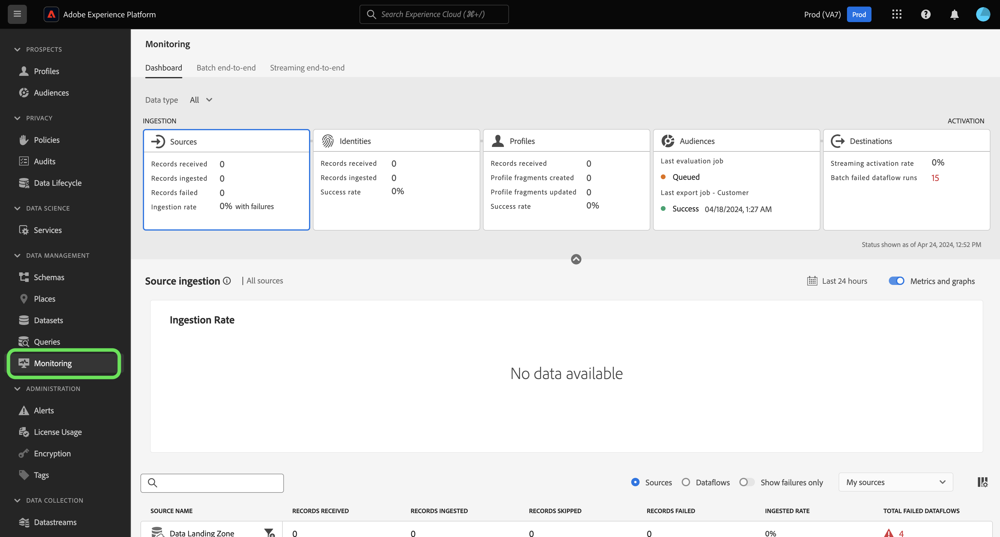

**[!UICONTROL Data Type]**&#x200B;を選択し、ドロップダウンメニューを使用して、表示するデータの種類を選択します。 データタイプは、Experience Data Model （XDM）スキーマクラスによって定義され、Experience Platformに取り込まれたときにデータが標準フォーマットに従うことを確認します。 詳しくは、次のドキュメントを参照してください。

* [B2B アカウントのデータタイプ](../../rtcdp/b2b-tutorial.md)
* [見込み客のデータタイプ](../../rtcdp/partner-data/prospecting.md)

次のデータタイプに基づいてビューをフィルタリングできます。

>[!BEGINTABS]

>[!TAB すべて]

**[!UICONTROL All]**&#x200B;を選択してダッシュボードを更新し、特定の期間にExperience Platformに取り込まれたすべてのデータに関する指標を表示します。

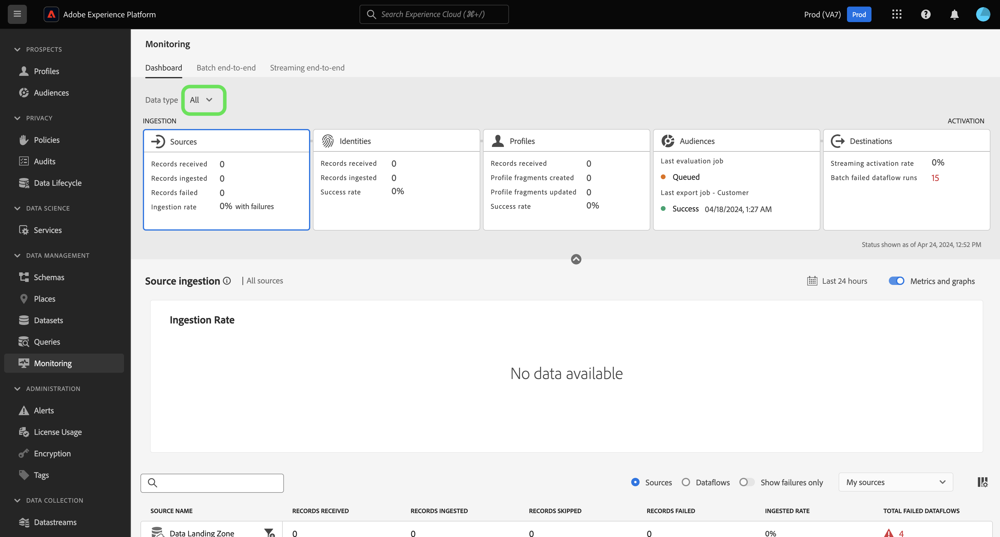

>[!TAB 顧客とアカウント ]

**[!UICONTROL Customer & Account]**&#x200B;を選択してダッシュボードを更新し、一定期間にわたってExperience Platformに取り込まれた顧客データとアカウントデータに関する指標を表示します。

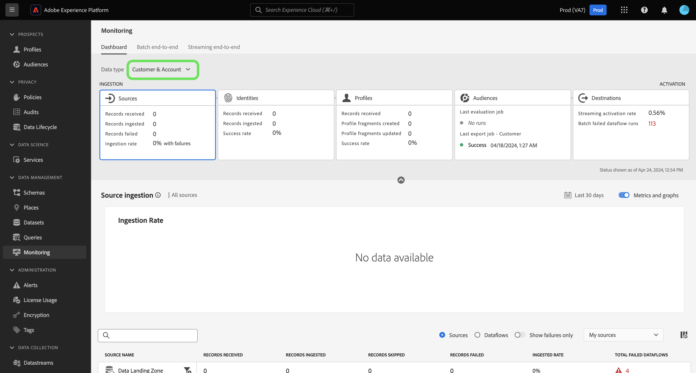

>[!TAB  アカウントプロファイルの強化]

**[!UICONTROL Account profile enrichment]**&#x200B;を選択してダッシュボードを更新し、プロファイル強化データに指標を表示します。 **注**: アカウント プロファイルのエンリッチメント指標は、[B2B データ &#x200B;](../../rtcdp/b2b-tutorial.md)の使用権限がある場合にのみ表示できます。

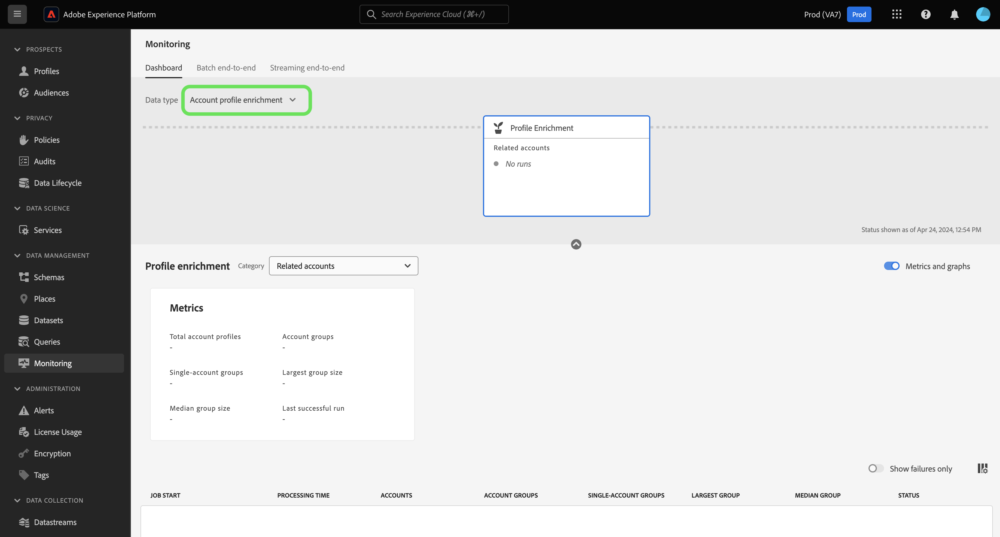

>[!ENDTABS]

ダッシュボードの上部ヘッダーを使用して、クロスサービス監視エクスペリエンスを実現します。 データカテゴリヘッダーから選択した機能カードを選択することで、指標とグラフ表示をフィルタリングできます。

>[!BEGINTABS]

>[!TAB  データレイク ]

**[!UICONTROL Data lake]**&#x200B;を選択して、データレイクの取り込み率に関する指標を表示します。 詳しくは、[&#x200B; データレイクの取り込みの監視](monitor-sources.md)に関するガイドを参照してください。

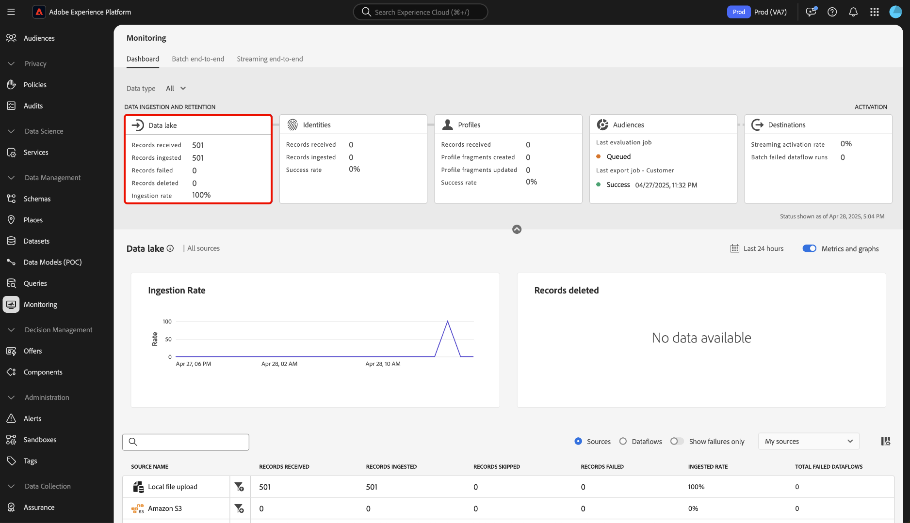

>[!TAB ID]

ID データの処理成功率を表示するには、**[!UICONTROL Identities]**&#x200B;を選択してください。 詳しくは、[ID データの監視](monitor-identities.md)に関するガイドを参照してください。

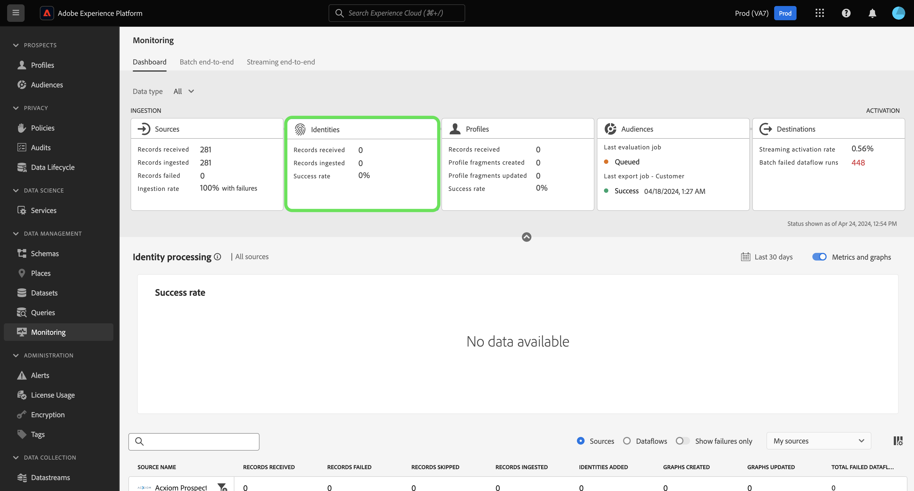

>[!TAB プロファイル]

プロファイルデータの処理成功率を表示するには、**[!UICONTROL Profiles]**&#x200B;を選択します。 詳しくは、[&#x200B; プロファイルデータの監視](monitor-profiles.md)に関するガイドを参照してください。

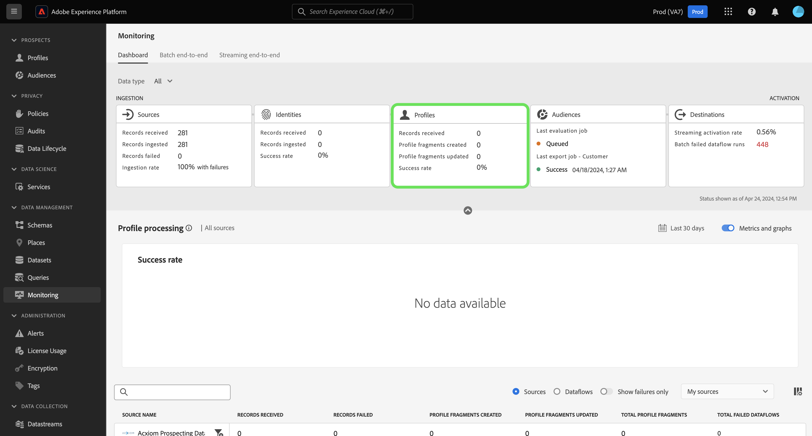

>[!TAB オーディエンス]

**[!UICONTROL Audiences]**&#x200B;を選択して、オーディエンスとセグメント化ジョブに関する指標を表示します。 詳しくは、[&#x200B; オーディエンスデータの監視](monitor-audiences.md)に関するガイドを参照してください。

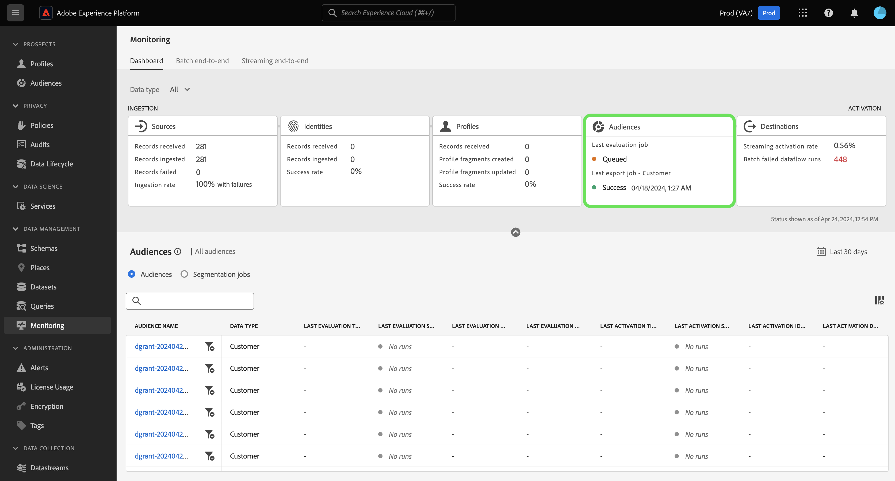

>[!TAB 宛先]

**[!UICONTROL Destinations]**&#x200B;を選択して、[!UICONTROL Streaming activate rate]と[!UICONTROL Batch failed dataflow runs]の指標を表示します。 詳しくは、[宛先データの監視](monitor-destinations.md)に関するガイドを参照してください。

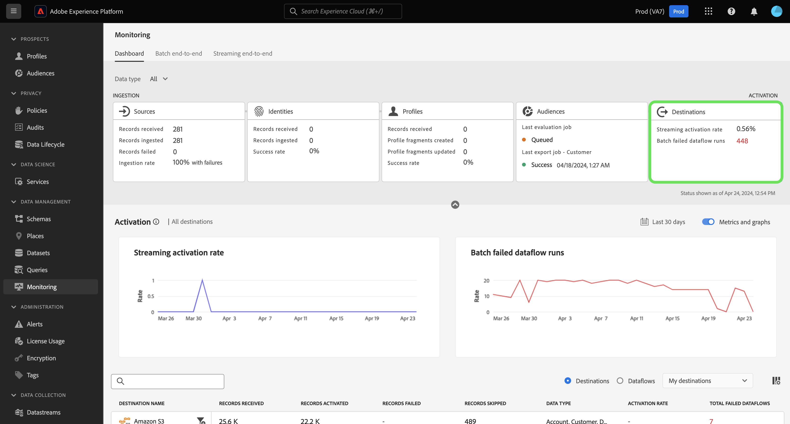

>[!ENDTABS]

### 監視時間枠の設定 {#configure-monitoring-time-frame}

デフォルトでは、監視ダッシュボードには、過去24時間以内に取り込まれたデータに関する指標が表示されます。 時間枠を更新するには、**[!UICONTROL Last 24 hours]**&#x200B;を選択します。

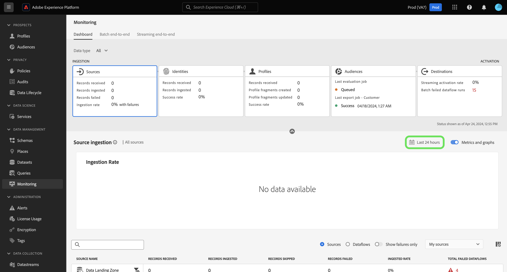

表示されるダイアログで、データ監視ビューの新しい時間枠を設定できます。 カスタム時間枠を作成するか、事前設定済みのオプションのリストから選択するオプションがあります。

* [!UICONTROL Last 24 hours]
* [!UICONTROL Last 7 days]
* [!UICONTROL Last 30 days]

終了したら「**[!UICONTROL Apply]**」を選択します。

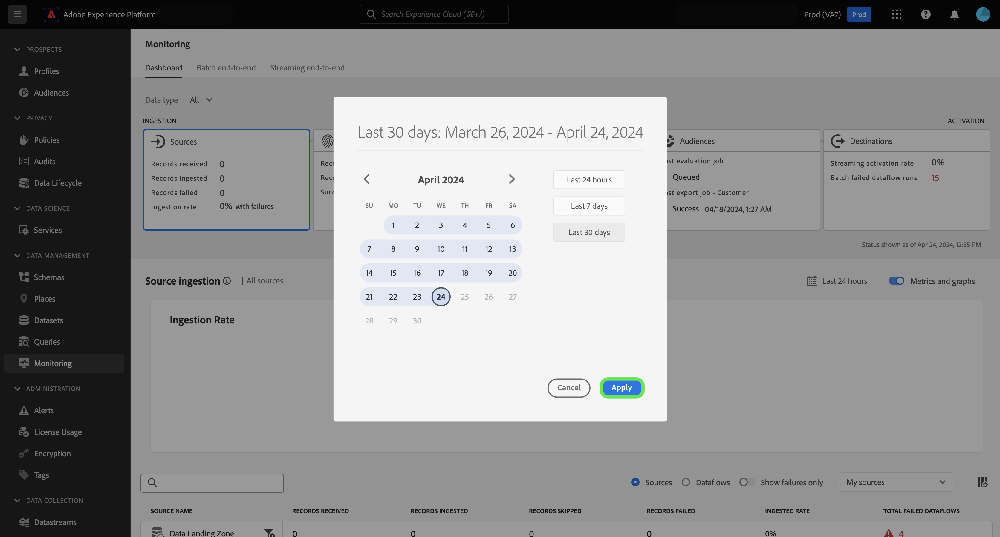

## 次の手順

このドキュメントを読むことで、UIの監視ダッシュボードを移動できるようになりました。 特定のExperience Platform サービスのデータを監視する方法について詳しくは、次のドキュメントを参照してください。

* [&#x200B; データレイクの取り込みを監視](monitor-sources.md)。
* [ID データを監視](monitor-identities.md)。
* [&#x200B; プロファイルデータを監視](monitor-profiles.md)。
* [&#x200B; オーディエンスデータを監視](monitor-audiences.md)。
* [宛先データを監視](monitor-destinations.md)。

<!-- 
>[!TAB Prospect]

Select **[!UICONTROL Prospect]** to update your dashboard and display metrics on prospecting data that has been ingested to Experience Platform over the course of a given period. **Note**: You can only view prospect data type activities if you are [entitled to prospect data](../../rtcdp/partner-data/prospecting.md). 
-->