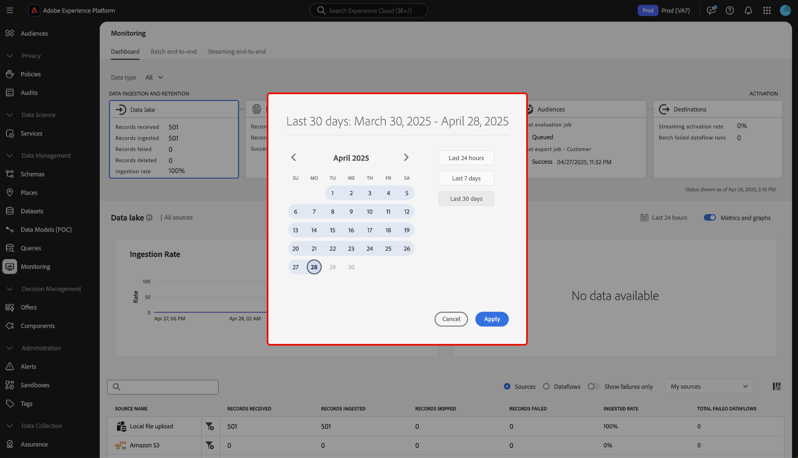

# 監視ダッシュボードの概要

Adobe Experience Platform UI のモニタリングダッシュボードを使用して、取り込みからアクティベーションまでのデータのジャーニーを表示します。 監視ダッシュボードを使用すると、次のことができます。

* ソース、ID サービス、リアルタイム顧客プロファイル、オーディエンスからのデータのジャーニーを監視し、最後に宛先で監視します。
* データが含まれているステージに応じて、様々な指標とステータスを表示します。
* データタイプでデータ監視ビューをフィルタリングします。

監視ダッシュボードでは、次の複数の異なるデータタイプの表示をサポートしています。

* **顧客とアカウント**：顧客データは [Real-Time Customer Data Platform](../../rtcdp/home.md) で使用されるデータを参照するのに対して、アカウントデータは [ アカウントプロファイルデータ ](../../rtcdp/accounts/account-profile-overview.md) を参照し、[B2B editionのReal-Time CDP](../../rtcdp/b2b-overview.md) に登録するとアクセスできます。 Real-Time CDP ライセンスにReal-Time CDP、B2B editionが含まれていない場合は、モニタリングダッシュボードを使用してのみ顧客データをモニタリングできます。
* **見込み客**:[ 見込み客プロファイル ](../../profile/ui/prospect-profile.md) は、会社とまだ関わっていないが連絡を取りたい人物を表すために使用されます。 見込み客プロファイルを使用すると、信頼できるサードパーティパートナーの属性で顧客プロファイルを補完できます。 見込み客データタイプを表示するには、Real-Time CDP（アプリサービス）、Adobe Experience Platform アクティベーション、Real-Time CDP、Real-Time CDP Prime、Real-Time CDP Ultimateのライセンスが必要です。
* **アカウントプロファイルのエンリッチメント**：アカウントプロファイルを使用すると、複数のソースのアカウント情報を統合できます。 アカウントプロファイルエンリッチメントデータを監視するには、Real-Time CDP（B2B edition）のライセンスが必要です。

このドキュメントでは、モニタリングダッシュボードを使用して、様々なExperience Platform サービスをまたいでデータのジャーニーを監視する方法について説明します。

## 基本を学ぶ

このドキュメントでは、Experience Platformの次のコンポーネントに関する十分な知識が必要です。

* [ データフロー ](../home.md)：データフローは、Experience Platform間でデータを移動するデータジョブを表します。 ソースワークスペースを使用すると、特定のソースからExperience Platformにデータを取り込むデータフローを作成できます。
* [ ソース ](../../sources/home.md):Experience Platformのソースを使用して、Adobe アプリケーションまたはサードパーティのデータソースからデータを取り込みます。
* [ID サービス](../../identity-service/home.md)：デバイスやシステム間で ID を橋渡しすることで、個々の顧客とその行動をより確実に把握することができます。
* [リアルタイム顧客プロファイル](../../profile/home.md)：複数のソースから集計したデータに基づいて、統合されたリアルタイムの顧客プロファイルを提供します。
* [ セグメント化 ](../../segmentation/home.md)：セグメント化サービスを使用すると、リアルタイム顧客プロファイルデータからセグメントやオーディエンスを作成できます。
* [ 宛先 ](../../destinations/home.md)：宛先は、一般に使用されるアプリケーションとの事前定義済みの統合で、これを使用すると、Experience Platformのデータをシームレスにアクティブ化してクロスチャネルマーケティングキャンペーン、メールキャンペーン、ターゲット広告およびその他の多くのユースケースを実現できます。

## 監視ダッシュボードガイド

Experience Platform UI の「[!UICONTROL Data Management]」で、「**[!UICONTROL モニタリング]**」をクリックします。

**[!UICONTROL データタイプ]** を選択し、ドロップダウンメニューを使用して、表示するデータのタイプを選択します。 データタイプは、Experience Platformに取り込む際にデータが標準形式に従っていることを確認するために、エクスペリエンスデータモデル（XDM）スキーマクラスによって定義されます。 詳しくは、次のドキュメントを参照してください。

* [B2B アカウントのデータタイプ](../../rtcdp/b2b-tutorial.md)
* [見込み客データタイプ](../../rtcdp/partner-data/prospecting.md)

次のデータタイプに基づいて、表示をフィルタリングできます。

>[!BEGINTABS]

>[!TAB  すべて ]

**[!UICONTROL すべて]** を選択してダッシュボードを更新し、特定の期間にExperience Platformに取り込まれたすべてのデータに関する指標を表示します。

>[!TAB  顧客およびアカウント ]

**[!UICONTROL 顧客とアカウント]** を選択してダッシュボードを更新し、特定の期間にExperience Platformに取り込まれた顧客とアカウントのデータに関する指標を表示します。

>[!TAB  アカウントプロファイルのエンリッチメント ]

「**[!UICONTROL アカウントプロファイルエンリッチメント]**」を選択して、ダッシュボードを更新し、プロファイルエンリッチメントデータに指標を表示します。 **メモ**:[B2B データ ](../../rtcdp/b2b-tutorial.md) を参照する権限がある場合にのみ、アカウントプロファイルエンリッチメント指標を表示できます。

>[!ENDTABS]

クロスサービス監視エクスペリエンスには、ダッシュボードの上部ヘッダーを使用します。 データカテゴリヘッダーから選択した機能カードを選択することで、指標およびグラフ表示をフィルタリングできます。

>[!BEGINTABS]

>[!TAB  データレイク ]

**[!UICONTROL データレイク]** を選択すると、データレイクの取り込み率に関する指標が表示されます。 詳しくは、[ データレイクの取り込みの監視 ](monitor-sources.md) に関するガイドを参照してください。

>[!TAB ID]

**[!UICONTROL ID]** を選択して、ID データの処理成功率を表示します。 詳しくは、[ID データの監視 ](monitor-identities.md) に関するガイドを参照してください。

>[!TAB プロファイル]

**[!UICONTROL プロファイル]** を選択して、プロファイルデータの処理成功率を表示します。 詳しくは、[ プロファイルデータの監視 ](monitor-profiles.md) に関するガイドを参照してください。

>[!TAB オーディエンス]

**[!UICONTROL オーディエンス]** を選択して、オーディエンスおよびセグメント化ジョブの指標を表示します。 詳しくは、[ オーディエンスデータの監視 ](monitor-audiences.md) に関するガイドを参照してください。

>[!TAB 宛先]

**[!UICONTROL 宛先]** を選択して、[!UICONTROL &#x200B; ストリーミングのアクティブ化率 &#x200B;] および [!UICONTROL &#x200B; 失敗したデータフロー実行のバッチ &#x200B;] に関する指標を表示します。 詳しくは、[ 宛先データの監視 ](monitor-destinations.md) に関するガイドを参照してください。

>[!ENDTABS]

### 監視時間枠の設定 {#configure-monitoring-time-frame}

デフォルトでは、監視ダッシュボードには、過去 24 時間以内に取り込まれたデータに関する指標が表示されます。 時間枠を更新するには、「**[!UICONTROL 過去 24 時間]**」を選択します。

表示されるダイアログで、データ監視ビューの新しい時間枠を設定できます。 カスタムの時間枠を作成するか、事前設定済みのオプションのリストから選択するかを選択できます。

* [!UICONTROL &#x200B; 過去 24 時間 &#x200B;]
* [!UICONTROL &#x200B; 過去 7 日間 &#x200B;]
* [!UICONTROL &#x200B; 過去 30 日間 &#x200B;]

完了したら、「**[!UICONTROL 適用]**」を選択します。

## 次の手順

このドキュメントを読むことで、UI の監視ダッシュボードをナビゲートできるようになりました。 特定のExperience Platform サービスのデータを監視する方法について詳しくは、以下のドキュメントを参照してください。

* [ データレイクの取り込みを監視 ](monitor-sources.md).
* [ID データの監視 ](monitor-identities.md)。
* [ プロファイルデータの監視 ](monitor-profiles.md)。
* [ オーディエンスデータの監視 ](monitor-audiences.md).
* [ 宛先データの監視 ](monitor-destinations.md)。

<!-- >[!TAB Prospect]

Select **[!UICONTROL Prospect]** to update your dashboard and display metrics on prospecting data that has been ingested to Experience Platform over the course of a given period. **Note**: You can only view prospect data type activities if you are [entitled to prospect data](../../rtcdp/partner-data/prospecting.md). -->