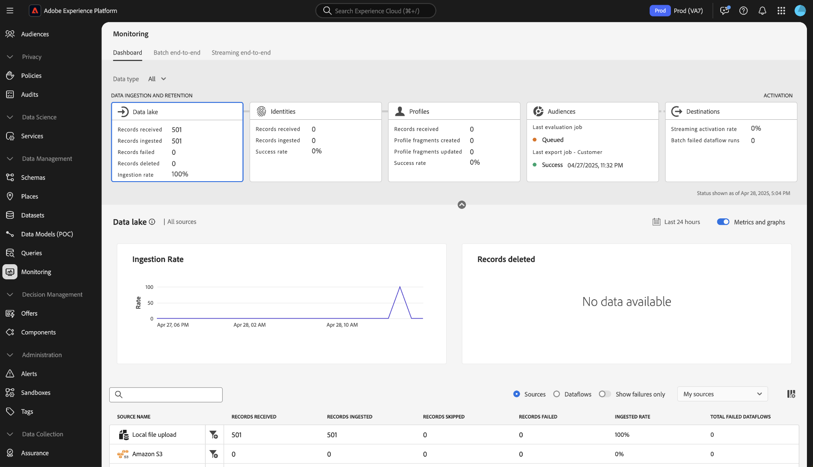
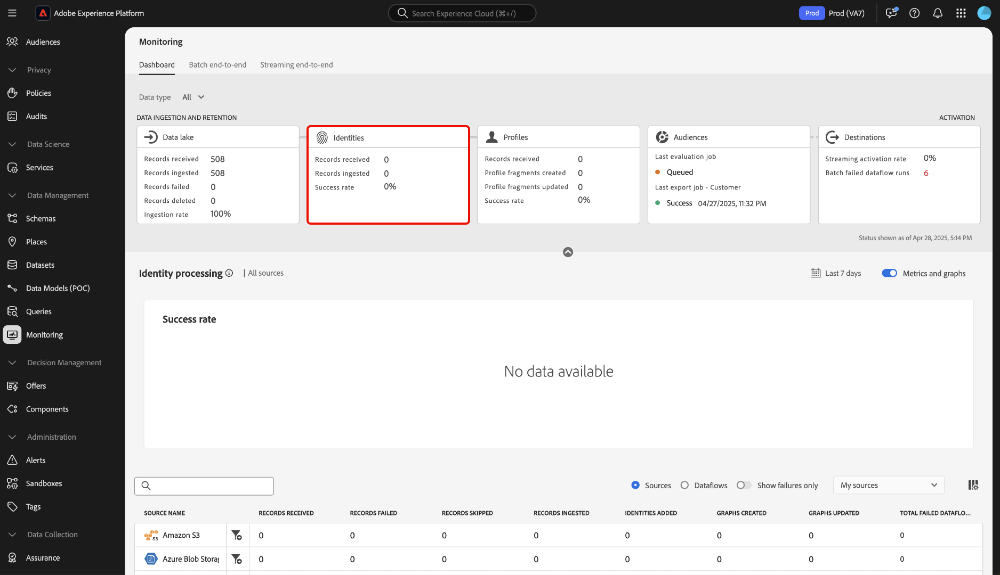
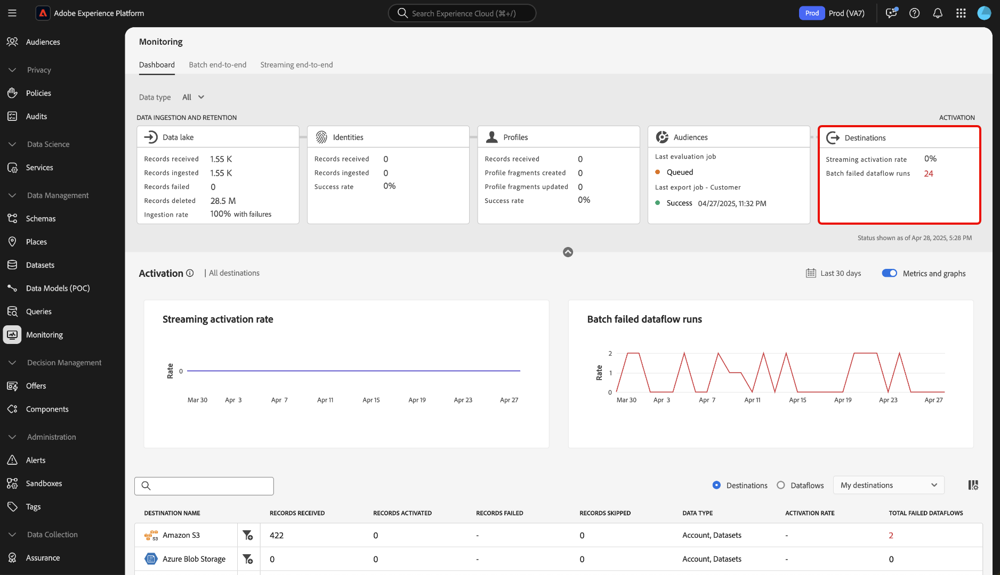

# 監視ダッシュボードの概要

Adobe Experience Platform UI のモニタリングダッシュボードを使用して、取り込みからアクティベーションまでのデータのジャーニーを表示します。 監視ダッシュボードを使用すると、次のことができます。

* ソース、ID サービス、リアルタイム顧客プロファイル、オーディエンスからのデータのジャーニーを監視し、最後に宛先で監視します。
* データが含まれているステージに応じて、様々な指標とステータスを表示します。
* データタイプでデータ監視ビューをフィルタリングします。

監視ダッシュボードでは、次の複数の異なるデータタイプの表示をサポートしています。

* **顧客およびアカウント**：顧客データとは、で使用されるデータを指します [Real-time Customer Data Platform](../../rtcdp/home.md)アカウントデータはを参照しますが、 [アカウントプロファイルデータ](../../rtcdp/accounts/account-profile-overview.md) 登録するとアクセスできます [Real-Time CDP、B2B エディション](../../rtcdp/b2b-overview.md). Real-Time CDP ライセンスにReal-Time CDP B2B Edition が含まれていない場合は、モニタリングダッシュボードのみを使用してカスタマーデータをモニタリングできます。
* **見込み客**: [見込み客プロファイル](../../profile/ui/prospect-profile.md) は、まだあなたの会社と関わっていないけれど連絡を取りたい人物を表すために使用されます。 見込み客プロファイルを使用すると、信頼できるサードパーティパートナーの属性で顧客プロファイルを補完できます。 見込み客データタイプを表示するには、Real-Time CDP（アプリサービス）、Adobe Experience Platform Activation、Real-Time CDP、Real-Time CDP Prime、Real-Time CDP Ultimate のライセンスが必要です。
* **アカウントプロファイルのエンリッチメント**：アカウントプロファイルを使用すると、複数のソースのアカウント情報を統合できます。 アカウントプロファイルエンリッチメントデータを監視するには、Real-Time CDP B2B Edition のライセンスが必要です。

このドキュメントでは、モニタリングダッシュボードを使用して、様々なExperience Platformサービスをまたいでデータのジャーニーを監視する方法について説明します。

## 基本を学ぶ

このドキュメントでは、Experience Platformの次のコンポーネントに関する十分な知識が必要です。

* [データフロー](../home.md)：データフローは、Experience Platform間でデータを移動するデータジョブを表します。 ソースワークスペースを使用すると、特定のソースからExperience Platformにデータを取り込むデータフローを作成できます。
* [ソース](../../sources/home.md):Experience Platformのソースを使用して、Adobeアプリケーションまたはサードパーティのデータソースからデータを取り込みます。
* [ID サービス](../../identity-service/home.md)：デバイスやシステム間で ID を橋渡しすることで、個々の顧客とその行動をより確実に把握することができます。
* [リアルタイム顧客プロファイル](../../profile/home.md)：複数のソースから集計したデータに基づいて、統合されたリアルタイムの顧客プロファイルを提供します。
* [セグメント化](../../segmentation/home.md)：セグメント化サービスを使用すると、リアルタイム顧客プロファイルデータからセグメントやオーディエンスを作成できます。
* [宛先](../../destinations/home.md)：宛先は、一般に使用されるアプリケーションとの事前定義済みの統合で、これを使用すると、Platform のデータをシームレスにアクティブ化してクロスチャネルマーケティングキャンペーン、メールキャンペーン、ターゲット広告およびその他の多くのユースケースを実現できます。

## 監視ダッシュボードガイド

Experience PlatformUI で、次を選択します。 **[!UICONTROL 監視]** 未満 [!UICONTROL データ管理] 左側のナビゲーションの

を選択 **[!UICONTROL データタイプ]** ドロップダウンメニューを使用して、表示するデータのタイプを選択します。 データタイプは、エクスペリエンスデータモデル（XDM）スキーマクラスによって定義され、Experience Platformに取り込む際にデータが標準フォーマットに従うようにします。 詳しくは、次のドキュメントを参照してください。

* [B2B アカウントのデータタイプ](../../rtcdp/b2b-tutorial.md)
* [見込み客データタイプ](../../rtcdp/partner-data/prospecting.md)

次のデータタイプに基づいて、表示をフィルタリングできます。

>[!BEGINTABS]

>[!TAB すべて]

を選択 **[!UICONTROL すべて]** を使用して、特定の期間にExperience Platformに取り込まれたすべてのデータに関するダッシュボードと表示を更新できます。

>[!TAB 顧客およびアカウント]

を選択 **[!UICONTROL 顧客およびアカウント]** を使用して、特定の期間にExperience Platformに取り込まれた顧客およびアカウントデータに関するダッシュボードと表示を更新できます。

>[!TAB 見込み客]

を選択 **[!UICONTROL 見込み客]** これにより、ダッシュボードを更新し、一定期間にわたってExperience Platformに取り込まれた見込みデータに関する指標を表示できます。 **注意**：次の場合にのみ、見込み客データタイプアクティビティを表示できます [見込み客データの権利](../../rtcdp/partner-data/prospecting.md).

>[!TAB アカウントプロファイルのエンリッチメント]

を選択 **[!UICONTROL アカウントプロファイルのエンリッチメント]** ダッシュボードを更新し、プロファイルエンリッチメントデータに指標を表示します。 **注意**：の権限がある場合にのみ、アカウントプロファイルエンリッチメント指標を表示できます [B2B データ](../../rtcdp/b2b-tutorial.md).

>[!ENDTABS]

クロスサービス監視エクスペリエンスには、ダッシュボードの上部ヘッダーを使用します。 データカテゴリヘッダーから選択した機能カードを選択することで、指標およびグラフ表示をフィルタリングできます。

>[!BEGINTABS]

>[!TAB ソース]

を選択 **[!UICONTROL ソース]** ソースの取り込み率に関する指標を表示します。 ガイドを読む [ソースデータの監視](monitor-sources.md) を参照してください。

>[!TAB ID]

を選択 **[!UICONTROL ID]** id データの処理成功率を表示します。 ガイドを読む [id データの監視](monitor-identities.md) を参照してください。

>[!TAB プロファイル]

を選択 **[!UICONTROL プロファイル]** プロファイルデータの処理成功率を表示します。 ガイドを読む [プロファイルデータの監視](monitor-profiles.md) を参照してください。

>[!TAB オーディエンス]

を選択 **[!UICONTROL オーディエンス]** オーディエンスおよびセグメント化ジョブの指標を表示する場合。 ガイドを読む [オーディエンスデータの監視](monitor-audiences.md) を参照してください。

>[!TAB 宛先]

を選択 **[!UICONTROL 宛先]** 指標を表示するには [!UICONTROL ストリーミングのアクティブ化率] および [!UICONTROL 失敗したデータフロー実行のバッチ]. ガイドを読む [宛先データの監視](monitor-destinations.md) を参照してください。

>[!ENDTABS]

### 監視時間枠の設定 {#configure-monitoring-time-frame}

デフォルトでは、監視ダッシュボードには、過去 24 時間以内に取り込まれたデータに関する指標が表示されます。 時間枠を更新するには、を選択します。 **[!UICONTROL 過去 24 時間]**.

表示されるダイアログで、データ監視ビューの新しい時間枠を設定できます。 カスタムの時間枠を作成するか、事前設定済みのオプションのリストから選択するかを選択できます。

* [!UICONTROL 過去 24 時間]
* [!UICONTROL 過去 7 日間]
* [!UICONTROL 過去 30 日間]

完了したら、「**[!UICONTROL 適用]**」を選択します。

## 次の手順

このドキュメントを読むことで、UI の監視ダッシュボードをナビゲートできるようになりました。 特定のExperience Platformサービスのデータを監視する方法について詳しくは、以下のドキュメントを参照してください。

* [ソースデータの監視](monitor-sources.md).
* [ID データの監視](monitor-identities.md).
* [プロファイルデータの監視](monitor-profiles.md).
* [オーディエンスデータの監視](monitor-audiences.md).
* [宛先データの監視](monitor-destinations.md).
