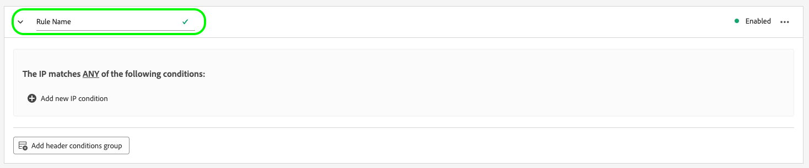
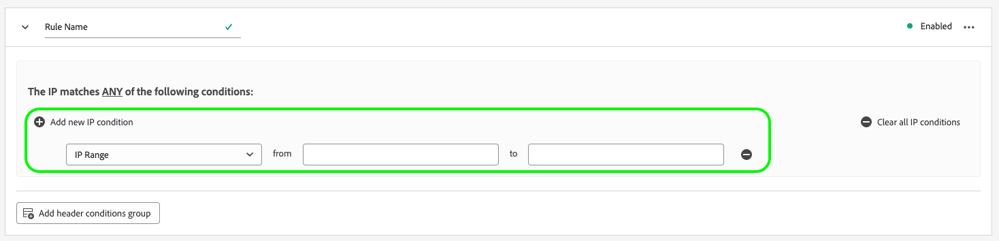
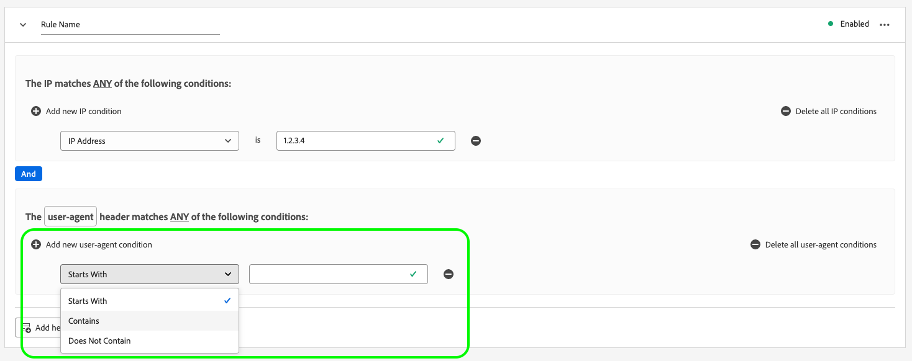
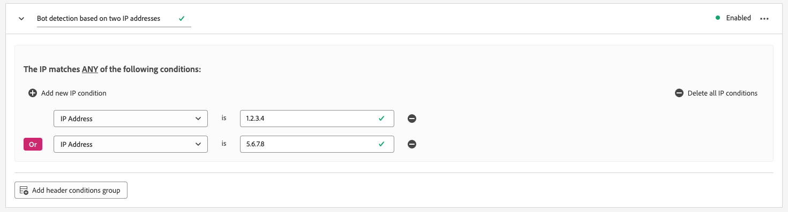

# データストリームのボット検出の設定

自動化されたプログラム、web スクレイパー、クモ、スクリプトスキャナーなどからの人間ではないトラフィックは、人間の訪問者からのイベントを識別することを困難にする可能性があります。 この種類のトラフィックは、重要なビジネス指標に悪影響を与え、誤ったトラフィックレポートにつながる可能性があります。

ボット検出を使用して、[Web SDK](/help/collection/js/js-overview.md)、[&#x200B; モバイル SDK](https://developer.adobe.com/client-sdks/home/)、[Edge Network API](https://developer.adobe.com/data-collection-apis/docs/api/)によって生成されたイベントを、既知のクモやボットによって生成されたものとして識別します。

>[!NOTE]
>
>[!DNL Bot Detection Service]を使用して、データから人間以外（ボット）のトラフィックを識別し、フィルタリングします。 これにより、収集したデータセットのノイズを軽減し、分析とレポートがユーザーとの真のインタラクションを反映するのに役立ちます。

データストリームのボット検出を設定することで、特定のIP アドレス、IP範囲、およびボットイベントとして分類するリクエストヘッダーを特定できます。 これにより、web サイトやモバイルアプリケーションにおける利用者のアクティビティをより正確に測定できるようになります。

[!DNL Edge Network]へのリクエストがボット検出ルールのいずれかに一致すると、XDM スキーマはボットスコアで更新されます（常に1に設定）。

```json
{
  "botDetection": {
    "score": 1
  }
}
```

このボットスコアリングは、リクエストを受け取ったソリューションがボットトラフィックを正しく識別するのに役立ちます。

>[!IMPORTANT]
>
>ボット検出はボットリクエストをドロップしません。 ボットスコアリングを使用してXDM スキーマのみを更新し、設定した[&#x200B; データストリームサービス &#x200B;](/help/datastreams/configure.md)にイベントを転送します。
>
>Adobeのソリューションは、さまざまな方法でボットスコアリングに対応できます。 例えば、[!DNL Adobe Analytics]は独自の[&#x200B; ボットフィルタリングサービス &#x200B;](https://experienceleague.adobe.com/docs/analytics/admin/admin-tools/manage-report-suites/edit-report-suite/report-suite-general/bot-removal/bot-rules.html)を使用し、[!DNL Edge Network]によって設定されたスコアを使用しません。 2つのサービスで同じ[IAB ボットリスト &#x200B;](https://www.iab.com/guidelines/iab-abc-international-spiders-bots-list/)を使用しているため、ボットスコアリングは同じです。

## 技術的な考慮事項 {#technical-considerations}

データストリームでボット検出を有効にする前に、正確な結果とスムーズな実装を確実にするために留意すべきいくつかの重要なポイントを次に示します。

* ボット検出は、`edge.adobedc.net`に送信された未認証のリクエストにのみ適用されます。
* `server.adobedc.net`に送信された認証済み要求は、認証済みトラフィックが信頼できると見なされるため、ボットトラフィックでは評価されません。
* ボット検出ルールを作成した後、最大15分で[!DNL Edge Network]に反映できます。

## 前提条件 {#prerequisites}

ボット検出がデータストリームで機能するには、**[ボット検出情報](/help/xdm/field-groups/event/bot-detection-information.md)** フィールドグループをスキーマに追加する必要があります。 スキーマにフィールドグループを追加する方法については、[XDM スキーマ &#x200B;](/help/xdm/ui/resources/schemas.md#add-field-groups)のドキュメントを参照してください。

## データストリームのボット検出の設定 {#configure}

データストリーム設定を作成した後で、ボット検出を設定できます。 データストリームを[作成および設定する方法に関するドキュメント &#x200B;](/help/datastreams/configure.md)を参照し、次の手順に従ってボット検出機能をデータストリームに追加します。

データストリーム リストに移動し、ボット検出を追加するデータストリームを選択します。


データストリームの詳細ページで、右側のパネルの「**[!UICONTROL Bot Detection]**」オプションを選択します。

データストリーム ユーザーインターフェイスでハイライト表示された

**[!UICONTROL Bot Detection Rules]** ページが表示されます。

データストリーム設定ページの

ボット検出ルール ページでは、次の機能を使用してボット検出を設定できます。

* [IAB/ABC International Spiders and Bots List](https://www.iab.com/guidelines/iab-abc-international-spiders-bots-list/)を使用します。
* 独自のボット検出ルールの作成。

### IAB/ABC International Spiders and Bots Listを使用する {#iab-list}

[IAB/ABC International Spiders and Bots List](https://www.iab.com/guidelines/iab-abc-international-spiders-bots-list/)は、業界標準のサードパーティのインターネットスパイダーとボットのリストです。 このリストは、検索エンジンのweb クローラー、モニタリングツール、分析数に含めたくない可能性のあるその他の人間ではないトラフィックなどの、自動化されたトラフィックを特定するのに役立ちます。

IAB/ABC International Spiders and Bots Listを使用するようにデータストリームを設定するには：

1. **[!UICONTROL Use IAB/ABC International Spiders and Bots List for bot detection on this datastream]** オプションを切り替えます。
2. **[!UICONTROL Save]**&#x200B;を選択して、ボット検出設定をデータストリームに適用します。


### ボット検出ルールの作成 {#rules}

[IAB/ABC International Spiders and Bots List](https://www.iab.com/guidelines/iab-abc-international-spiders-bots-list/)を使用することに加えて、各データストリームに独自のボット検出ルールを定義できます。

**IP アドレス**&#x200B;および&#x200B;**IP アドレス範囲**&#x200B;に基づいてボット検出ルールを作成できます。

より詳細なボット検出ルールが必要な場合は、IP条件とリクエストヘッダー条件を組み合わせることができます。 ボット検出ルールでは、次のヘッダーを使用できます。

| HTTP ヘッダー | 説明 |
| --- | --- |
| `user-agent` | サーバーとネットワークピアが、リクエスト側のユーザーエージェントのアプリケーション、オペレーティングシステム、ベンダー、および/またはバージョンを識別できるヘッダー。 |
| `content-type` | リソースの元のメディアタイプを示します（送信用に適用されたコンテンツエンコーディングの前）。 |
| `referer` | リソースが要求されたweb ページのアドレスを識別します。 |
| `sec-ch-ua` | ブラウザーに関連付けられている各ブランドのブランドと重要なバージョンをコンマ区切りのリストで提供します。 |
| `sec-ch-ua-mobile` | ブラウザーがモバイルデバイス上にあるかどうかを示します。 また、デスクトップブラウザーでモバイルユーザーエクスペリエンスの環境設定を示すために使用することもできます。 |
| `sec-ch-ua-platform` | ユーザーエージェントが実行されているプラットフォームまたはオペレーティングシステムを提供します。 例えば、「Windows」または「Android」と入力します。 |
| `sec-ch-ua-platform-version` | ユーザーエージェントが実行されているオペレーティングシステムのバージョンを提供します。 |
| `sec-ch-ua-arch` | ARMやx86など、user-agentの基盤となるCPU アーキテクチャを提供します。 |
| `sec-ch-ua-model` | ブラウザーが実行されているデバイスモデルを示します。 |
| `sec-ch-ua-bitness` | ユーザーエージェントの基盤となるCPU アーキテクチャの「ビット数」を提供します。 これは、整数アドレスまたはメモリアドレスのビット単位のサイズ（通常は64または32 ビット）です。 |
| `sec-ch-ua-wow64` | 64 ビット Windowsでユーザーエージェントバイナリが32 ビットモードで実行されているかどうかを示します。 |

ボット検出ルールを作成するには、次の手順に従います。

1. **[!UICONTROL Add New Rule]** を選択します。

   

2. ルールの名前を&#x200B;**[!UICONTROL Rule Name]** フィールドに入力します。

   ルール名が強調表示された

3. **[!UICONTROL Add new IP condition]**&#x200B;を選択して、新しいIP ベースのルールを追加します。 ルールは、IP アドレスまたはIP アドレス範囲で定義できます。

   IP アドレスフィールドがハイライト表示された

   IP範囲フィールドがハイライト表示された

   >[!TIP]
   >
   >IP条件は、論理[!DNL OR]操作に基づいています。 定義したIP条件のいずれかと一致する場合、リクエストはボットからのリクエストとしてマークされます。

4. ルールにヘッダー条件を追加する場合は、**[!UICONTROL Add header conditions group]**&#x200B;を選択し、ルールで使用するヘッダーを選択します。

   「ヘッダー条件を追加」グループオプションを表示する

   次に、選択したヘッダーに使用する条件を追加します。

   

5. 目的のボット検出ルールを設定した後、**[!UICONTROL Save]**&#x200B;を選択して、データストリームにルールを適用します。

   


## ボット検出ルールの例 {#examples}

ボット検出を開始するには、以下の例を使用してボット検出ルールを作成します。

### 1つのIP アドレスに基づくボット検出 {#one-ip}

特定のIP アドレスから送信されたすべてのリクエストをボットトラフィックとしてマークするには、単一のIP アドレスを評価する新しいボット検出ルールを作成します。

単一のIP アドレスを評価するように設定された

### 2つのIP アドレスに基づくボット検出 {#two-ip}

2つの特定のIP アドレスのいずれかから発生するすべてのリクエストをボットトラフィックとしてマークするには、2つのIP アドレスを評価する新しいボット検出ルールを作成します。

2つの特定のIP アドレスを評価するように設定された

### IP アドレスの範囲に基づくボット検出 {#range}

特定の範囲の任意のIP アドレスから発生するすべてのリクエストをボットトラフィックとしてマークするには、IP アドレス範囲全体を評価する新しいボット検出ルールを作成します。

IP アドレス範囲を評価するように設定された

### IP アドレスとリクエストヘッダーに基づくボット検出 {#ip-header}

特定のIP アドレスから送信され、特定のリクエストヘッダーを含むすべてのリクエストをボットトラフィックとしてマークするには、新しいボット検出ルールを作成します。 このルールは、リクエストが特定のIP アドレスから発生しているか、および`referer` リクエストヘッダーが`www.adobe.com`で始まるかどうかをチェックします。


### 複数の条件に基づくボット検出 {#multiple-conditions}

以下に基づいてボット検出ルールを作成できます。

* **複数の異なる条件**：異なる条件が論理[!DNL AND]操作として評価されます。つまり、システムがボットトラフィックとしてリクエストを識別するには、すべての条件を同時に満たす必要があります。
* **同じタイプの複数の条件**：同じタイプの条件は、論理[!DNL OR]操作として評価されます。つまり、いずれかの条件が満たされた場合、リクエストはボットトラフィックとして識別されます。

次のルールは、これらの条件が満たされた場合にボットを開始するリクエストを識別します。リクエストは、2つのIP アドレスのいずれかから発生し、`referer` ヘッダーは`www.adobe.com`で始まり、`sec-ch-ua-mobile` ヘッダーは、リクエストがデスクトップブラウザーから発生したものとして識別します。


