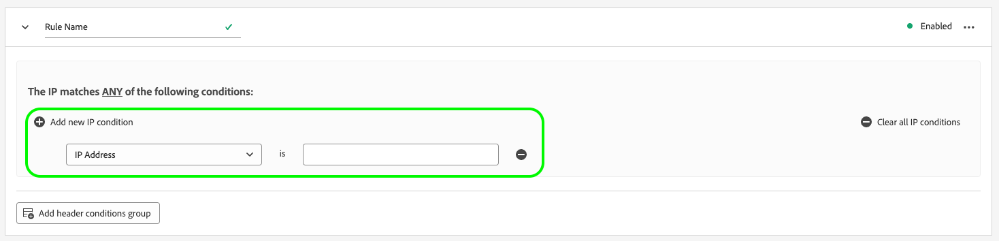
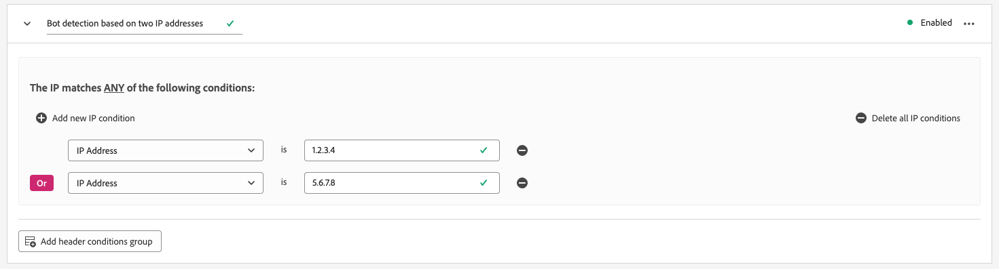

# データストリームのボット検出の設定

自動プログラム、Web スクレーパ、スパイダ、スクリプトスキャナなど、非人間エンティティから発生するトラフィックは、人間の訪問者によって発生するイベントの識別をより難しくする場合があります。 このタイプのトラフィックは、重要なビジネス指標に悪影響を与え、トラフィックレポートが不正確になる可能性があります。

ボット検出を使用すると、 [[!DNL Web SDK]](../edge/home.md), [[!DNL Mobile SDK]](https://developer.adobe.com/client-sdks/home/) および [[!DNL Server API]](../server-api/overview.md) 既知のスパイダーやボットによって生成されるものとして。

データストリームのボット検出を設定することで、ボットイベントとして分類したい特定の IP アドレス、IP 範囲、リクエストヘッダーを特定できます。

ボットトラフィックを特定することで、サイトやモバイルアプリケーションでのユーザーアクティビティをより正確に測定できます。

Edge ネットワークへのリクエストがいずれかのボット検出ルールと一致する場合、XDM スキーマは、次に示すように、ボットスコアリングで更新されます（常に 1 に設定されます）。

```json
{
  "botDetection": {
    "score": 1
  }
}
```

このボットスコアリングは、リクエストを受け取るソリューションがボットトラフィックを正しく識別するのに役立ちます。

>[!IMPORTANT]
>
>ボット検出は、ボットリクエストを削除しません。 このメソッドは、ボットスコアで XDM スキーマを更新し、イベントをに転送します。 [datastream サービス](configure.md) 設定済みの

ボット検出ルールは、作成後に Edge ネットワーク全体に反映されるまでに最大 15 分かかる場合があります。

## 前提条件 {#prerequisites}

データストリームでボット検出が機能するには、 **[!UICONTROL ボット検出情報]** フィールドグループをスキーマに追加します。 詳しくは、 [XDM スキーマ](../xdm/ui/resources/schemas.md#add-field-groups) フィールドグループをスキーマに追加する方法を説明するドキュメントです。

## データストリームのボット検出の設定 {#configure}

ボット検出は、データストリーム設定を作成した後に設定できます。 方法に関するドキュメントを参照してください。 [データストリームの作成と設定](configure.md)次に、以下の手順に従って、データストリームにボット検出機能を追加します。


データストリームリストに移動し、ボット検出を追加するデータストリームを選択します。


データストリームの詳細ページで、 **[!UICONTROL ボット検出]** 」オプションを使用します。


The **[!UICONTROL ボット検出ルール]** ページが表示されます。


ボット検出ルールページで、次の機能を使用してボット検出を設定できます。

* デフォルト PCID の代わりに [!DNL [IAB/ABC International Spiders and Bots List]](https://www.iab.com/guidelines/iab-abc-international-spiders-bots-list/).
* 独自のボット検出ルールを作成する。


### IAB/ABC International Spiders and Bots List の使用 {#iab-list}

The [IAB/ABC International Spiders and Bots List](https://www.iab.com/guidelines/iab-abc-international-spiders-bots-list/) は、業界標準のインターネットスパイダーおよびボットリストで、検索エンジンクローラー、監視ツールなど、analytics のカウントに表示したくない自動トラフィックを識別するのに役立ちます。

データストリームを設定して [!DNL IAB/ABC International Spiders and Bots List]、切り替え **[!UICONTROL このデータストリームのボット検出には、 IAB/ABC International Spiders and Bots Lists を使用します。]** 」オプションを選択し、「保存」を選択して、ボット検出設定をデータストリームに適用します。


### ボット検出ルールの作成 {#rules}

を使用する以外に、 [IAB/ABC International Spiders and Bots List](https://www.iab.com/guidelines/iab-abc-international-spiders-bots-list/)を使用する場合、各データストリームに対して独自のボット検出ルールを定義できます。

ボット検出ルールは、 **IP アドレス** および **IP アドレスの範囲**.

より詳細なボット検出ルールが必要な場合は、IP 条件とリクエストヘッダー条件を組み合わせることができます。 ボット検出ルールでは、次のヘッダーを使用できます。

| HTTP ヘッダー | 説明 |
| --- | --- |
| `user-agent` | サーバーとネットワークピアが要求元のユーザーエージェントのアプリケーション、オペレーティングシステム、ベンダー、バージョンを識別できるようにするヘッダー。 |
| `content-type` | リソースの元のメディアタイプを示します（送信に適用されるコンテンツエンコーディングの前）。 |
| `referer` | リソースがリクエストされた Web ページのアドレスを識別します。 |
| `sec-ch-ua` | ブラウザーに関連付けられた各ブランドのブランドと重要なバージョンを、コンマ区切りのリストで提供します。 |
| `sec-ch-ua-mobile` | ブラウザーがモバイルデバイス上にあるかどうかを示します。 また、モバイルユーザーエクスペリエンスの環境設定を示すために、デスクトップブラウザーで使用することもできます。 |
| `sec-ch-ua-platform` | ユーザーエージェントが実行されているプラットフォームまたはオペレーティングシステムを提供します。 例えば、「Windows」や「Android」と入力します。 |
| `sec-ch-ua-platform-version` | ユーザーエージェントが実行されているオペレーティングシステムのバージョンを示します。 |
| `sec-ch-ua-arch` | ARM や x86 など、ユーザーエージェントの基盤となる CPU アーキテクチャを提供します。 |
| `sec-ch-ua-model` | ブラウザーが実行されているデバイスモデルを示します。 |
| `sec-ch-ua-bitness` | ユーザーエージェントの基盤となる CPU アーキテクチャの「ビット度」を提供します。 これは、整数またはメモリアドレス（通常は 64 または 32 ビット）のビット数です。 |
| `sec-ch-ua-wow64` | 64 ビット Windows 上で、ユーザーエージェントバイナリが 32 ビットモードで実行されているかどうかを示します。 |


ボット検出ルールを作成するには、次の手順に従います。

1. 選択 **[!UICONTROL 新規ルールの追加]**.

   

2. ルールの名前を **[!UICONTROL ルール名]** フィールドに入力します。

   

3. 選択 **[!UICONTROL 新しい IP 条件を追加]** をクリックして、新しい IP ベースのルールを追加します。 ルールは、IP アドレスまたは IP アドレス範囲で定義できます。

   

   

   >[!TIP]
   >
   >IP 条件は、論理に基づいています `OR` 操作。 定義した IP 条件のいずれかと一致する場合、リクエストはボットからの発信元としてマークされます。

4. ルールにヘッダー条件を追加する場合は、「 **[!UICONTROL ヘッダー条件グループを追加]**&#x200B;をクリックし、ルールで使用するヘッダーを選択します。

   

   次に、選択したヘッダーに使用する条件を追加します。

   

5. 目的のボット検出ルールを設定したら、「 」を選択します。 **[!UICONTROL 保存]** ルールをデータストリームに適用する。

   


## ボット検出ルールの例 {#examples}

ボット検出を開始する際に役立つように、以下に説明する例を使用してボット検出ルールを作成できます。

### 1 つの IP アドレスに基づくボット検出 {#one-ip}

特定の IP アドレスからのすべての要求をボットトラフィックとしてマークするには、次の図に示すように、単一の IP アドレスを評価する新しいボット検出ルールを作成します。


### 2 つの IP アドレスに基づくボット検出 {#two-ip}

2 つの特定の IP アドレスのいずれかから発生するすべての要求をボットトラフィックとしてマークするには、次の図に示すように、2 つの IP アドレスを評価する新しいボット検出ルールを作成します。



### IP アドレスの範囲に基づくボット検出 {#range}

特定の範囲内の任意の IP アドレスから発生したすべてのリクエストをボットトラフィックとしてマークするには、次の図に示すように、IP アドレス範囲全体を評価する新しいボット検出ルールを作成します。


### IP アドレスとリクエストヘッダーに基づくボット検出 {#ip-header}

特定の IP アドレスから発生したすべてのリクエストをボットトラフィックとしてマークするには、次の図に示すように、新しいボット検出ルールを作成します。

このルールは、リクエストが特定の IP アドレスから送信されたかどうか、および `referer` リクエストヘッダーが次の値で始まる `www.adobe.com`.


### 複数の条件に基づくボット検出 {#multiple-conditions}

次の条件に基づいて、ボット検出ルールを作成できます。

* **複数の異なる条件**：異なる条件は、論理的に評価されます `AND` 操作とは、リクエストをボットから生成したものとして識別するために、条件を同時に満たす必要があることを意味します。
* **同じタイプの複数の条件**：同じタイプの条件は、論理的なとして評価されます `OR` 操作。つまり、いずれかの条件が満たされた場合、リクエストはボットからのリクエストとして識別されます。

次の画像に示すルールは、次の条件を満たした場合に、ボット発信リクエストを識別します。

このリクエストは、2 つの IP アドレスのいずれか ( `referer` ヘッダーが次の値で始まる `www.adobe.com`、および `sec-ch-ua-mobile` ヘッダーは、デスクトップブラウザーからの要求であることを識別します。


