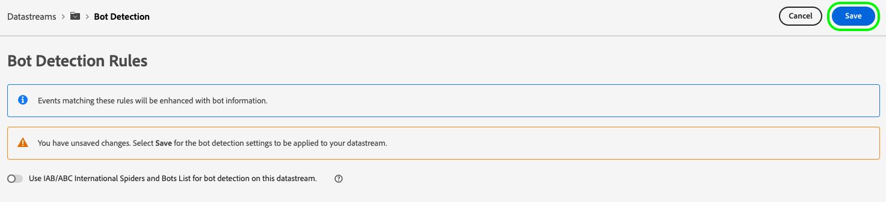
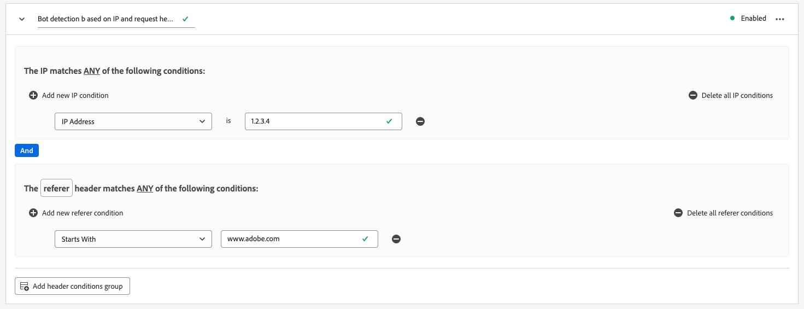

# データストリームのボット検出の設定

自動プログラム、Web スクレーパー、スパイダー、スクリプト化されたスキャナーからの人間以外のトラフィックによって、訪問者からイベントを特定するのが難しくなる場合があります。 このタイプのトラフィックは、重要なビジネス指標に悪影響を与え、誤ったトラフィックレポートにつながる可能性があります。

ボット検出を使用すると、[Web SDK](../web-sdk/home.md)、[ モバイルSDK](https://developer.adobe.com/client-sdks/home/) および [[!DNL Edge Network API]](https://developer.adobe.com/data-collection-apis/docs/api/) で生成されたイベントを、既知のスパイダーやボットによって生成されたものとして識別できます。

データストリームのボット検出を設定することで、特定の IP アドレス、IP 範囲およびリクエストヘッダーを識別して、ボットイベントとして分類できます。 これにより、サイトまたはモバイルアプリケーションでのユーザーアクティビティをより正確に測定できます。

Edge Networkへのリクエストが任意のボット検出ルールに一致すると、次に示すように、XDM スキーマがボットスコアで更新されます（常に 1 に設定されます）。

```json
{
  "botDetection": {
    "score": 1
  }
}
```

このボットスコアリングは、リクエストを受信したソリューションがボットトラフィックを正しく識別するのに役立ちます。

>[!IMPORTANT]
>
>ボット検出は、ボットリクエストをドロップしません。 ボットスコアリングを使用した XDM スキーマのみを更新し、設定した [datastream サービス ](configure.md) イベントを転送します。
>
>Adobe ソリューションは、様々な方法でボットスコアリングを処理できます。 例えば、Adobe Analyticsは独自の [ ボットフィルタリングサービス ](https://experienceleague.adobe.com/docs/analytics/admin/admin-tools/manage-report-suites/edit-report-suite/report-suite-general/bot-removal/bot-rules.html) を使用し、Edge Networkによって設定されたスコアを使用しません。 2 つのサービスは同じ [IAB ボットリスト ](https://www.iab.com/guidelines/iab-abc-international-spiders-bots-list/) を使用しているので、ボットスコアリングは同じです。

ボット検出ルールは、作成後、Edge Network全体に反映されるまでに最大 15 分かかる場合があります。

## 前提条件 {#prerequisites}

ボット検出がデータストリームで機能するには、**[!UICONTROL ボット検出情報]** フィールドグループをスキーマに追加する必要があります。 スキーマにフィールドグループを追加する方法については、[XDM スキーマ ](../xdm/ui/resources/schemas.md#add-field-groups) のドキュメントを参照してください。

## データストリームのボット検出の設定 {#configure}

データストリーム設定を作成した後で、ボット検出を設定できます。 [ データストリームを作成および設定 ](configure.md) する方法に関するドキュメントを参照し、以下の手順に従ってデータストリームにボット検出機能を追加します。

データストリームリストに移動し、ボット検出を追加するデータストリームを選択します。


データストリームの詳細ページの右側のパネルで、「**[!UICONTROL ボット検出]**」オプションを選択します。


**[!UICONTROL ボット検出ルール]** ページが表示されます。


ボット検出ルール ページで、次の機能を使用してボット検出を設定できます。

* [!DNL [IAB/ABC International Spiders and Bots List]](https://www.iab.com/guidelines/iab-abc-international-spiders-bots-list/) を使用します。
* 独自のボット検出ルールの作成。

### IAB/ABC International Spiders and Bot List の使用 {#iab-list}

[IAB/ABC International Spiders and Bot List](https://www.iab.com/guidelines/iab-abc-international-spiders-bots-list/) は、サードパーティの、業界標準のインターネットスパイダーおよびボットのリストです。 このリストは、検索エンジンのクローラー、監視ツール、分析カウントに含めたくない可能性のあるその他の非人間トラフィックなど、自動トラフィックを特定するのに役立ちます。

IAB/ABC International Spiders and Bot List を使用するようにデータストリームを設定するには：

1. **[!UICONTROL このデータストリームでボット検出に IAB/ABC International Spiders and Bot List を使用]** オプションを切り替えます。
2. 「**[!UICONTROL 保存]**」を選択して、データストリームにボット検出設定を適用します。


### ボット検出ルールの作成 {#rules}

[IAB/ABC International Spiders and Bots List](https://www.iab.com/guidelines/iab-abc-international-spiders-bots-list/) を使用する以外に、各データストリームに対して独自のボット検出ルールを定義できます。

**IP アドレス** および **IP アドレスの範囲** に基づいて、ボット検出ルールを作成できます。

より詳細なボット検出ルールが必要な場合は、IP 条件とリクエストヘッダー条件を組み合わせることができます。 ボット検出ルールでは、次のヘッダーを使用できます。

| HTTP ヘッダー | 説明 |
| --- | --- |
| `user-agent` | サーバーやネットワークピアが、要求元のユーザーエージェントのアプリケーション、オペレーティングシステム、ベンダー、バージョンを特定できるヘッダー。 |
| `content-type` | （送信にコンテンツエンコーディングが適用される前の）リソースの元のメディアタイプを示します。 |
| `referer` | リソースがリクエストされた web ページのアドレスを識別します。 |
| `sec-ch-ua` | ブラウザーに関連付けられている各ブランドのブランドと重要なバージョンをコンマ区切りリストで提供します。 |
| `sec-ch-ua-mobile` | ブラウザーがモバイルデバイス上にあるかどうかを示します。 また、デスクトップブラウザーでモバイルユーザーエクスペリエンスの環境設定を示すためにも使用できます。 |
| `sec-ch-ua-platform` | ユーザーエージェントが実行されているプラットフォームまたはオペレーティングシステムを提供します。 例：「Windows」または「Android」。 |
| `sec-ch-ua-platform-version` | ユーザーエージェントが実行されているオペレーティングシステムのバージョンを提供します。 |
| `sec-ch-ua-arch` | ARM や x86 など、user-agent の基盤となるCPU アーキテクチャを提供します。 |
| `sec-ch-ua-model` | ブラウザーが実行されているデバイスモデルを示します。 |
| `sec-ch-ua-bitness` | user-agent の基盤となるCPU アーキテクチャの「ビット数」を提供します。 これは、整数またはメモリアドレスのビット単位のサイズで、通常は 64 ビットまたは 32 ビットです。 |
| `sec-ch-ua-wow64` | ユーザーエージェント バイナリが 64 ビット Windows 上の 32 ビット モードで実行されているかどうかを示します。 |

ボット検出ルールを作成するには、次の手順に従います。

1. 「**[!UICONTROL 新しいルールを追加]**」を選択します。

   

2. **[!UICONTROL ルール名]** フィールドにルールの名前を入力します。

   

3. 「**[!UICONTROL 新しい IP 条件を追加]**」を選択して、新しい IP ベースのルールを追加します。 ルールは、IP アドレスまたは IP アドレスの範囲で定義できます。

   

   

   >[!TIP]
   >
   >IP 条件は、論理 `OR` 操作に基づいています。 定義したいずれかの IP 条件に一致する場合、リクエストはボットからの発信元としてマークされます。

4. ルールにヘッダー条件を追加する場合は、「**[!UICONTROL ヘッダー条件グループを追加]**」を選択し、ルールで使用するヘッダーを選択します。

   

   次に、選択したヘッダーに使用する条件を追加します。

   

5. 目的のボット検出ルールを設定したら、「**[!UICONTROL 保存]**」を選択して、ルールをデータストリームに適用します。

   


## ボット検出ルールの例 {#examples}

ボット検出を開始する際に役立つように、以下に説明する例を使用して、ボット検出ルールを作成できます。

### 1 つの IP アドレスに基づくボット検出 {#one-ip}

特定の IP アドレスから発生するすべてのリクエストをボットトラフィックとしてマークするには、単一の IP アドレスを評価する新しいボット検出ルールを作成します（下図を参照）。


### 2 つの IP アドレスに基づくボット検出 {#two-ip}

2 つの特定の IP アドレスのいずれかから発生するすべての要求をボットトラフィックとしてマークするには、次の画像に示すように、2 つの IP アドレスを評価する新しいボット検出ルールを作成します。


### IP アドレスの範囲に基づくボット検出 {#range}

特定の範囲の任意の IP アドレスから発生するすべての要求をボットトラフィックとしてマークするには、以下の画像に示すように、IP アドレス範囲全体を評価する新しいボット検出ルールを作成します。


### IP アドレスとリクエストヘッダーに基づくボット検出 {#ip-header}

特定の IP アドレスから発生し、特定のリクエストヘッダーを含むすべてのリクエストをボットトラフィックとしてマークするには、次の画像に示すように、新しいボット検出ルールを作成します。

このルールは、リクエストが特定の IP アドレスから始まっているかどうか、およびリク `referer` ストヘッダーが `www.adobe.com` で始まるかどうかを確認します。



### 複数の条件に基づくボット検出 {#multiple-conditions}

次の項目に基づいてボット検出ルールを作成できます。

* **複数の異なる条件**：異なる条件が論理的な `AND` 定操作として評価されます。つまり、リクエストがボットから発生したものと識別されるためには、条件を同時に満たす必要があります。
* **同じタイプの複数の条件**：同じタイプの条件は、論理 `OR` 定操作として評価されます。つまり、いずれかの条件が満たされた場合、リクエストは、ボットからのリクエストと識別されます。

以下の画像に示すルールは、次の条件を満たす場合、ボット起点のリクエストを識別します。

リクエストは 2 つの IP アドレスのどちらか一方から発生し、`referer` ヘッダーは `www.adobe.com` で始まり、`sec-ch-ua-mobile` ヘッダーはリクエストがデスクトップブラウザーから発生したことを識別します。


